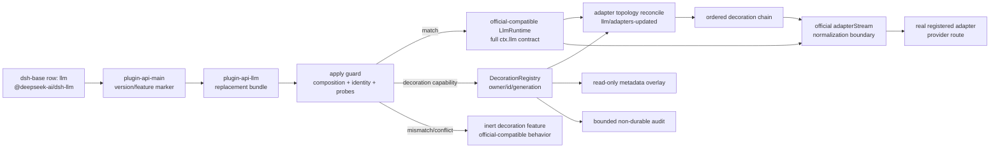

# Stage 2 - Design

## Status

Stage 2 Design：已获用户确认（2026-08-27，M6 最后批次批量确认门）；现进入 Stage 3 Tasks（不设用户确认门，以对抗性审查为门）。本文只定义设计与可验证契约，不创建 Tasks、实现代码、package metadata 或测试文件。

## Overview

`adapter-decoration` 采用 R 类 replacement bundle，替换官方 DSH base profile 中唯一的 `llm` loader row。replacement 只替换该 row 对外提供的 `ctx.llm` service/event 面：它保留官方 `LlmRuntime` 的 provider registry、configurable-provider directory、model discovery、exact-model resolution、prepared call、`llm/stream` waterfall、`llm/adapters-updated` event、stream normalization、错误和 teardown 语义，并在真实 adapter dispatch 边界增加 decoration registry 与 execution wrapper。

新能力的推荐入口是主门面暴露的 `pluginApi.llm.adapters.decorate(...)`。decorator 是绑定到真实 adapter registration 的 capability slice，不是 provider、model registry、route policy、retry owner 或第二个 execution owner。metadata overlay 和 execution wrapper 是两条独立的内部路径：overlay 只读并挂在 decoration identity 上，wrapper 只围绕当前官方 adapter operation 执行。

该设计冻结以下 replacement identity：

- 被替换官方 row：`id: llm`，`name: '@deepseek-ai/dsh-llm'`。
- replacement source package：`packages/llm/`。
- replacement package：`@deepseek-ai/dsh-plugin-api-llm`。
- replacement row：`id: plugin-api-llm`。
- runtime lock：`@deepseek-ai/dsh@0.1.0-rc.6` 与 `@deepseek-ai/dsh-llm@0.1.0-rc.6`。
- package lock：`@deepseek-ai/dsh-plugin-api-main@0.1.0-rc.6-0.7` 与 replacement package `@deepseek-ai/dsh-plugin-api-llm@0.1.0-rc.6-0.7`，两者 `dsh.api` 均为 `0.7`（本批集成 sync 时主包与辅助包统一对齐到该值；若集成将 API 协议进一步递增，本锁须在进入 Stage 3 前同步修订后再冻结）。

`0.1.0-rc.6-0.7` 的 runtime 部分、API 协议部分和官方 package identity 都是 activation lock，不是宽松的 semver 兼容声明。任何 lock 不匹配都只停用本 replacement capability；不得静默按“相近版本”运行。

## Architecture



### Replacement assembly

The only approved patch shape is the following. The bundle contains one disable entry and one replacement insertion; it does not patch the official package files and does not add a second `llm` row:

```yaml
- id: llm
  disabled: true
- insert:
    - id: plugin-api-llm
      name: '@deepseek-ai/dsh-plugin-api-llm'
```

The full aggregate bundle and selective installation must produce this same row state. The replacement package's own patch is the sole component-level owner for the official `dsh-llm` component. A second package claiming `llm`, a second `plugin-api-llm` insertion, or an enabled official row is a composition conflict and disables the decoration capability.

The replacement row changes the Cordis service implementation only. `import '@deepseek-ai/dsh-llm'`, its subpath exports, its type declarations, and any unsupported direct consumers continue to resolve to the installed official package. The replacement does not alter Node module resolution, export maps, or official package files.

### Official contract evidence and preservation boundary

The lock is based on the installed `0.1.0-rc.6` source, not on an assumed subset of the API:

| Official surface | Audited evidence | Replacement obligation |
|---|---|---|
| `ctx.llm` service and `LlmRuntime` | `@deepseek-ai/dsh-llm/lib/types/index.d.ts:195-340` | Preserve constructor/service identity and every public member. |
| adapter registration | `registerAdapter`, atomic `replace`, registration disposal in `lib/index.js:956-1017` | Preserve all-or-nothing validation, route ownership, atomic replacement and `REGISTRATION_DISPOSED` behavior. |
| configurable providers | `lib/index.js:1033-1085` | Preserve directory validation, atomic replace, disposal and `llm/adapters-updated` emission. |
| model discovery | `registerModelDiscovery`, `discoverModels`, `listModels`, `resolveModelInfo` in the official runtime/types | Preserve advisory catalog semantics, detached metadata and cancellation. |
| call preparation | `prepareCall`, `resolveCallConfig`, `PreparedLlmCall` | Preserve registration binding, deep-frozen resolved config, one-shot dispatch and exact config checks. |
| stream entry | `stream()` and `streamWithRegistration()` at `lib/index.js:1385-1389` | Preserve `llm/stream` waterfall and prepared-registration routing. |
| adapter boundary | `adapterStream` at `lib/index.js:1327-1373` | Preserve iterator construction, terminal failure chunk normalization, cancellation mapping and cleanup behavior. |
| events | official `llm/adapters-updated()` and `llm/stream(...)` declarations | Preserve event names, payloads, modes, ordering and contained topology-listener failures. |
| exports/imports | official `lib/index.js` and `package.json` exports | Leave the import surface official; no replacement export shadowing. |

The complete public compatibility surface includes `registerAdapter`, `listProviders`, `registerConfigurableProviders`, `listConfigurableProviders`, `registerModelDiscovery`, `discoverModels`, `providerRetryPolicy`, `listModels`, `resolveModelInfo`, `resolveCallConfig`, `prepareCall`, and `stream`, together with the official `LlmAdapter`, `LlmError`, stream/message/content/error/retry types and utility exports as observed by official imports. The replacement may add private implementation modules, but it may not remove, rename, or reinterpret an official member.

### Client-half decision

The six required checks for the target official `dsh-llm` row are all negative:

| Check | Evidence | Result |
|---|---|---|
| client manifest | `@deepseek-ai/dsh-llm/package.json` has no `dsh.client` entry | No |
| remote namespace | no client contribution or remote service in the package | No |
| slot/settings bridge | no slot or settings bridge declaration | No |
| host-client version negotiation | no client half or negotiation contract in the package | No |
| browser state/reconnect | no browser module and no reconnect owner | No |
| client-facing event/service | the service is host-side `ctx.llm`; its events are host Cordis events | No |

Therefore this replacement is host-only. It adds no `lib/client.js`, no `dsh.client` manifest, no browser bundle, and no client roster row. Existing client transport and remote packages remain untouched.

## Hook Classification

| Hook or semantic area | Mechanism | Classification | Boundary |
|---|---|---|---|
| official `ctx.llm` service | replacement row, audited compatible runtime | R | Full official service/event contract is retained. |
| `registerAdapter` topology | same commit point as official route registry, followed by local reconcile | R capability slice | Decoration sees stable registration identity; it does not own provider routes. |
| `registerConfigurableProviders` and model discovery | official implementation preserved; local registry only reconciles after topology change | R compatibility | No decoration is inferred from dormant settings entries. |
| `llm/adapters-updated` | official `emit` event preserved; decoration manager reconciles from current registry | R observation | Existing listeners still see the official payload-free event. |
| `llm/stream` | official waterfall remains the outer dispatch seam; decoration is inserted at the final adapter operation inside the replacement | R capability slice | No second event, no recursive `llm.stream()` call, no route owner. |
| metadata overlay | local read-only projection derived from current decoration bindings | R capability slice / projection | Never replaces `resolveModelInfo` or the official model registry record. |
| route, retry, approval, billing, credential ownership | no hook is claimed | Excluded / existing owner | Wrapper returns evidence only; existing route/recovery/approval/billing owners decide. |
| generic priority, deep freeze, fault containment | existing facade/framework semantics | B interop | Replacement does not redefine framework-level dispatch. |
| official adapter decoration seam | unavailable in current runtime | C upstream proposal | Replacement is the local workaround until an equivalent official seam exists. |

## Components and Interfaces

### C1. Replacement package and apply guard

`packages/llm/` will expose the replacement row entry and retain the package identity above. Its `apply(ctx)` must be fail-safe and perform all checks before publishing the decoration capability:

1. Enumerate loader entries and locate exactly one official `llm` row and exactly one replacement row.
2. Require the official row to be disabled and the replacement row to be active.
3. Reject duplicate replacement rows, an enabled official row, another component owner marker, or an ambiguous loader result.
4. Read and compare the locked DSH runtime, official `dsh-llm`, main facade and replacement package versions/API protocol.
5. Probe `ctx.llm`, `ctx.on`, `ctx.emit`, `ctx.waterfall`, `ctx.effect`, registration/disposal primitives and the official members listed in the fidelity table.
6. Mark the component owner with a private instance token so a second owner cannot attach to the same registry.
7. Only after all checks pass, mount the decoration facet on the main facade. Any failure logs a bounded diagnostic, returns normally, and leaves the ordinary official-compatible service available when the loader has already selected it. It never throws through boot and never silently runs both owners.

The guard does not attempt to repair a malformed profile. It reports the composition mismatch and leaves the profile to the official loader's normal restoration or failure behavior.

### C2. `pluginApi.llm.adapters` policy/projection face

The public facet has one policy registration entry and one read-only projection entry. It is mounted only when the replacement marker and main package version contract are active:

```js
const handle = pluginApi.llm.adapters.decorate({
  id: 'latency-metrics',
  match: ({ provider, adapterIdentity, providerInfo }) => provider === 'openai',
  priority: 'normal',
  capabilities: {
    metadata: { labels: true },
    execution: { phases: ['stream'], requestTransform: false, chunkTransform: false, retry: 'none' }
  },
  wrap: async function* ({ adapter, sourceRoute, operation, signal, next }) {
    const startedAt = Date.now()
    try {
      yield* await next()
    } finally {
      // Implementation records only a bounded timing summary.
    }
  }
})

handle.dispose()
```

The exact implementation type may use an async generator or an equivalent `AsyncIterable` function, but the following interface is frozen for the feature:

```text
DecorationDefinition {
  id: non-empty owner-local string
  match: (AdapterMatchInput) => boolean
  priority?: lowest | low | normal | high | highest
  capabilities: declared, immutable capability descriptor
  wrap: (DecorationOperation) => AsyncIterable<StreamChunk> | Promise<AsyncIterable<StreamChunk>>
}

DecorationHandle {
  dispose(): void                 // idempotent, identity-bound
  snapshot(): DecorationSnapshot // detached, frozen, read-only
}
```

`decorate` is a policy registry mutation and returns an identity-bound disposer. `snapshot()` is a projection, not a mutation and never exposes the adapter object, credentials, raw request, raw stream content, or private generation token. The projection contains only `id`, owner summary, priority, declared capability names, current lifecycle state, matched provider summary, adapter identity summary, local revision and timestamp fields permitted by the visibility policy.

The caller owner is the current plugin/fiber registration context supplied by the facade. The public input does not accept a foreign owner id for taking another plugin's resources. If no valid owner context exists, registration is rejected as unavailable rather than attributed to the facade itself.

### C3. Adapter identity and match input

The replacement observes official registration commit points and assigns an opaque identity to each real registration:

```text
AdapterBinding {
  provider: string                  // official route key
  registrationIdentity: opaque      // one official registerAdapter ownership
  adapterIdentity: opaque           // registrationIdentity + provider binding
  generation: owner-specific opaque // changes when binding is removed/replaced
  adapterInfo: detached provider metadata
}

AdapterMatchInput {
  provider: string
  adapterIdentity: opaque summary
  generation: opaque summary
  providerInfo: detached LlmProviderInfo
}
```

The actual adapter instance is never published as a public identity and the match predicate cannot cause a synthetic adapter to be registered. `registerAdapter(...).replace(...)` keeps the official registration handle semantics but creates a new local binding generation for every topology-changing route set. A removed route is never treated as the same binding merely because the provider string is reused later.

### C4. Deterministic decoration chain

For one current `AdapterBinding`, matching decorations are snapshotted before wrapper execution. The order is:

1. priority tier `highest`, `high`, `normal`, `low`, `lowest`;
2. within a tier, successful registration commit order in the current registry epoch（registry 单调提交序号，跨 owner 同一序列，见下方术语定义）;
3. if a reconciliation rebuilds a binding, the original decoration identity remains the tie-break key only for diagnostics, never as a cross-owner ordering rule.

**Registry epoch** 定义为本地 adapter topology 的提交代数：每次官方注册/替换/disposal 提交点（C6 的四个 mutation boundary）与每次本地 reconcile 原子递增一次；同一 epoch 内的每次成功注册获得一个 registry 单调提交序号，该序号跨 owner 唯一且单调递增，构成同一优先级 tier 内的确定性 tie-break（AD-R6.1 的 documented tie-break rule）。它专用于跨 owner 链序与 stale reconcile 判定；binding generation（owner-specific opaque）仍负责同一 binding 生命周期新旧判定，二者并存不混用。旧 epoch 的序号不参与当前链序；binding 重建后 decoration 在新 epoch 重新取序。

The first entry is the outermost wrapper. Each wrapper receives a `next()` function for exactly one downstream invocation; the final `next()` invokes the real official adapter once. `next()` does not call `ctx.llm.stream()` and therefore cannot recursively enter the public waterfall. It also cannot change `provider` or `model` unless `requestTransform` was declared, and even then provider/model route identity is immutable. A request transform may produce a detached request for the same route; it may not select a route, create a retry attempt, or mutate the caller's object.

Before each wrapper invocation and before each yielded chunk, the chain checks the binding identity, decoration generation, operation terminal state and cancellation signal. A wrapper that is disposed while another wrapper is executing loses the right to publish its subsequent output. Other decorations in the snapshot are not deleted or reordered.

### C5. Capability descriptor and execution context

Capabilities are explicit and immutable. The minimum v1 vocabulary is:

```text
capabilities {
  metadata?: { labels?: boolean }
  execution?: {
    phases: ['stream']
    requestTransform?: boolean
    chunkTransform?: boolean
    retry: 'none' | 'evidence-only'
  }
}
```

The v1 vocabulary is requirement-anchored（克制设计，§3.0.3）：`labels`、`requestTransform`、`chunkTransform` 与 `retry: 'evidence-only'` 分别对应 AD-R6/AD-R8/AD-R9 的 metadata overlay、declared transform 与 evidence-only retry 语义；无需求锚点的能力词（如 finish transform、annotations）不进入词汇表，未来扩展须另经批准。

`retry: 'evidence-only'` permits a wrapper to return bounded typed evidence to the existing recovery owner. It never permits the wrapper to invoke `next()` a second time. There is no decoration capability for route selection, approval bypass, credential access, billing mutation or provider registration.

The wrapper receives:

```text
DecorationOperation {
  adapter: AdapterBinding summary
  sourceRoute: { provider: string, model: string }
  operation: {
    executionIdentity?: opaque official/existing identity
    operationIdentity: opaque local correlation identity
    request: frozen GenerateOptions view
  }
  signal: AbortSignal                 // combined caller + local revocation signal
  next(): AsyncIterable<StreamChunk>  // one downstream call
}
```

The caller's `AbortSignal` remains part of the combined signal. The local revocation controller adds cancellation but never replaces or hides caller cancellation. The operation identity is a correlation value for this wrapper invocation; it is not a new execution identity and does not change on internal provider retries owned elsewhere.

### C6. Official lifecycle integration

The local manager is attached at the official mutation boundaries rather than observing private adapter maps:

- after a successful `registerAdapter` initial commit, create bindings and reconcile;
- after a successful registration `replace`, invalidate removed bindings, create new generations and reconcile;
- after registration disposal, revoke only bindings owned by that registration and reconcile;
- after configurable-provider and model-discovery mutations, preserve the official behavior and emit unchanged events; no adapter decoration is attached until a real registered adapter exists;
- preserve the official `llm/adapters-updated` event exactly once per official commit point.

If an implementation must listen to `llm/adapters-updated` for an external equivalent update, it coalesces by the local topology revision and does not emit a second event. The local reconcile is never allowed to mutate official registry state.

## Data Models

### Decoration registration

```text
DecorationRecord {
  ownerIdentity: opaque owner token
  id: string
  definition: frozen normalized definition
  registrationSequence: owner-local integer
  lifecycleState: active | degraded | revoked | disposed
  generation: owner-specific opaque token
  matches: Map<adapterIdentity, BindingRecord>
  createdAt: timestamp
  lastReconciledAt?: timestamp
}
```

`id` is unique within an owner. A second equivalent registration from the same owner and id returns a handle for the existing record. Equivalence means the normalized scalar capability/priority values match and the `match` and `wrap` function references are the same. A same-owner id with a conflicting definition is rejected without changing the existing record. Different owners may use the same id; their records remain separate. `registrationSequence` is an owner-local accounting ordinal for same-owner equivalence/idempotence and diagnostics only; chain-ordering tie-break uses the registry-monotonic commit sequence defined in C4, never this field.

### Binding and overlay

```text
BindingRecord {
  adapterIdentity: opaque
  provider: string
  adapterGeneration: opaque
  decorationGeneration: opaque
  lifecycleState: active | superseded | revoked
  overlay: frozen non-secret metadata projection
}

DecorationSnapshot {
  id: string
  owner: bounded owner summary
  priority: string
  capabilities: frozen capability names
  lifecycleState: string
  bindings: frozen detached summaries
  observedAt: timestamp
}
```

An overlay is not merged into `LlmModelInfo`, `LlmResolvedModelInfo`, `listModels`, or `listProviders`. When a caller asks for a decoration projection, it receives the official metadata separately plus the decoration overlay keyed by decoration identity. An overlay may contain only declared non-secret labels and bounded lifecycle facts; no credential, prompt, message, raw tool arguments, stream text or provider request identifier is copied into it.

### Operation and terminal state

```text
DecorationOperationState {
  operationIdentity: opaque
  bindingIdentity: opaque
  decorationGeneration: opaque
  terminal: undefined | success | error | aborted | superseded
  terminalReason?: { code: string, category?: string }
  committedAt?: timestamp
}
```

The official `StreamChunk` union remains unchanged. A decoration failure at the stream boundary is normalized to the official terminal `finish` shape with an `LlmFailure` code such as `DECORATION_FAILED`; cancellation maps to the official `aborted` reason. The local operation state records `superseded` when a generation loses submission qualification. No stale chunk is yielded. If the official stream contract cannot represent a distinct superseded finish, the consumer-visible stream closes without stale output and the typed superseded outcome is available through the operation diagnostic/projection; the replacement does not invent a new official `StreamChunk.reason.kind`.

### Persistence and audit

No model registry, provider registration, or decoration chain is durable in this feature. Registration is fiber-owned and disappears with disposal. Audit is a bounded in-memory diagnostic ring with declared `profile` process scope; it is not a session transcript and is not replayed after restart. A future durable audit must be a separate feature with an explicit scope and commit contract.

Each audit item is capped and contains only owner summary, decoration id, provider/adapter identity summary, generation summary, lifecycle/outcome code, bounded error code and `observedAt`. Raw prompts, message content, credentials, headers, API keys, provider secrets, exception causes and full stream chunks are excluded.

## Error Handling and Guard Strategy

### Activation failures

| Failure | Result | Official behavior |
|---|---|---|
| loader unavailable or malformed | bounded log, normal return | no decoration facet; do not touch unknown rows |
| official `llm` row still enabled | no decoration publication | avoid double owner; official row remains the authority |
| replacement absent/duplicated | inert capability and diagnostic | no synthetic replacement or guessed order |
| runtime/package/API mismatch | typed activation diagnostic | only this R capability is disabled |
| core service/event probe fails | typed activation diagnostic | no decoration registration; preserve available official-compatible service |
| component owner conflict | typed owner-conflict diagnostic | no chain mutation and no cleanup of foreign resources |

The guard is evaluated before registration and before mounting the public facet. A disabled facade method fails before touching any official service, following the main facade's inactive-feature behavior.

### Registration and reconciliation failures

- Invalid/empty `id`, malformed `match`, unknown capability, unsupported phase, non-function `wrap`, or invalid priority is rejected before publication with a typed validation error.
- A throwing `match` marks only that decoration `degraded` for the current reconcile, logs a bounded diagnostic, and excludes it from the chain. It does not hide the adapter or affect other decorations.
- A match that sees a wrapped/synthetic marker for its own decoration is forced false. The marker is internal and cannot be supplied through public input. This is the recursion fence.
- An adapter lookup with no current match returns a typed unavailable/degraded projection and creates no synthetic adapter.
- A conflicting same-owner registration leaves the prior record unchanged. An equivalent registration is idempotent.
- A callback from an old reconcile is discarded if owner identity, replacement owner token, registry epoch or adapter generation no longer matches.

### Wrapper and stream failures

The chain invokes a wrapper under the operation's combined signal. A wrapper failure is converted to a bounded decoration failure for that operation and cannot remove unrelated records. It never automatically retries or falls through to an unwrapped provider call after partial execution. If the wrapper declared evidence-only retry, the evidence is returned to the existing recovery owner; the wrapper still performs no retry.

The final real adapter invocation remains the official `adapterStream` boundary: adapter selection, iterator construction and iterator errors retain official terminal normalization, while decoration callback failures remain local decoration failures. Cleanup errors from the official iterator follow official semantics. Cleanup of local decoration resources is identity-bound and cannot throw through `apply` or delete a newer binding.

### Cancellation and stale result rules

Cancellation sources are the caller signal, owner/fiber disposal and adapter binding revocation. Local revocation is combined with the caller signal. Before invoking `next`, before awaiting a wrapper result, before yielding a chunk and before recording an outcome, the owner checks:

- replacement owner token is still current;
- decoration owner/id/generation still matches;
- adapter identity and binding generation are still current;
- operation has not committed a terminal outcome;
- the target resource is still owned by this registration.

If caller cancellation wins before the terminal commit, the operation is `aborted`. A deadline is `error` with reason `timeout`. A newer binding or decoration generation wins as `superseded`. The uncommitted arbitration order is `aborted > superseded > error > timeout-error`; after one terminal commit, later signals cannot rewrite it. A superseded operation cannot start another attempt.

### Disposer ownership

`DecorationHandle.dispose()` is idempotent. It removes only the exact `{ ownerIdentity, id, generation }` record and its bindings. A stale handle returns a typed no-op outcome and cannot delete a same-id record created by a newer generation or another owner. Fiber teardown invokes the same identity-bound path. Late promise/iterator callbacks may be recorded as bounded stale diagnostics but cannot publish a projection, emit a current result, or call another owner's disposer.

## Testing Strategy

Stage 4 tests must be added only after this Design is approved and Tasks pass their review. The test plan is listed here to make every guard and compatibility claim executable.

### Replacement assembly and compatibility

- Parse the patch and assert exactly one disabled official `llm` row and exactly one inserted `plugin-api-llm` row.
- Assert uninstallation restores the official row and no official installation path is edited.
- Exercise version/runtime/API mismatch, duplicate rows, enabled official row, duplicate owner and missing probes; each case must stay normal-returning, diagnostic and inert.
- Assert `import('@deepseek-ai/dsh-llm')` resolves the official module and that the replacement does not alter its exports.
- Run an official contract matrix over every public `LlmRuntime` member, registration handle, configurable directory handle, discovery method, prepared call and stream event.

### Decoration registry and projection

- Validate id, predicate, priority, capability and wrapper contracts before insertion.
- Verify same-owner equivalent registration is idempotent and conflicting registration is rejected without state merge.
- Verify owner-local identity, generation, detached frozen projections and metadata separation from official model info.
- Verify no-match and disposed adapter paths produce typed unavailable/degraded results without synthetic adapters.
- Verify deterministic priority order and registry-epoch registration-order tie-break, including cross-owner same-priority registration order, epoch reset/rebuild after reconciliation, chain nesting and one downstream call.

### Provider lifecycle and recursion

- Register, atomically replace and dispose official adapter routes; assert old bindings are revoked/superseded and new routes require reconciliation.
- Assert `llm/adapters-updated` retains one official event per commit and decoration reconciliation does not duplicate it.
- Assert a wrapper cannot match its own internal marker, re-enter `llm.stream`, change provider/model route, or create a second execution identity.
- Assert an old disposer/callback cannot remove or mutate a new same-id or same-provider generation.

### Stream, cancellation and failure containment

- Verify no-decoration streams match official chunks, finish reasons, replay state, cancellation and iterator cleanup byte-for-byte at the contract level.
- Verify request and chunk transforms require declared capabilities and preserve the official stream union（v1 词汇无 finish-transform 能力）.
- Verify wrapper throw/rejection is contained to its call, unrelated decorations remain active, malformed output is typed failure, and no automatic retry occurs.
- Verify caller abort, owner dispose, provider replacement, deadline and competing failure arbitration, including stale late chunks and promise settlements.
- Verify bounded audit records have owner/adapter/generation/timestamp but no prompt, credential, secret, cause or full chunk.

### Client and migration checks

- Assert the target `dsh-llm` row has no client manifest and the replacement publishes no client bundle or browser roster entry.
- Run existing host headless boot and provider/model discovery smoke tests with the replacement inactive and active.
- Use a representative provider plugin to register a decoration, call `prepareCall` and `stream`, unload the provider, reconcile, and re-register it under a new generation.
- Verify the existing provider integration can remove its model metadata copy/reconcile workaround while retaining official model and stream behavior.

## Standards Alignment

### `capability-strategy.md`

R1 is satisfied by the one official patch shape and no official-file edits. R2 is satisfied by treating `dsh-llm` as the full replacement unit and preserving every service/event member before adding the decoration slice. R3 is explicit: ctx service/event replacement does not cover the official import surface. R4 is implemented by apply composition and contract probes. R5 locks the exact runtime/package/API identity. R6 uses one component owner and rejects duplicate or enabled rows. R7 is covered by the upstream proposal and retirement section below. R8 is not applicable because the six client checks are all negative. R9 is respected: boot glue, Cordis dispatch, priority framework semantics and fault containment are not replaced.

### `api-shape.md`

The primary public face is the decoration policy registry. `snapshot()` and the binding metadata are read-only projection; they do not register, mutate or dispose. There is no durable mutation face. The policy callback receives explicit immutable input and cannot read private registry state or perform route/retry/approval/billing mutation. Official stream dispatch remains the existing service boundary.

### `identity-and-lifecycle.md`

Adapter registration identity, decoration identity and their generations are separate owner-specific opaque values. Generations are used only for same-owner stale checks and are never compared across owners. Operation outcome is distinct from lifecycle state; terminal vocabulary follows the shared `success`, `error`, `aborted`, `denied`, `superseded` set, of which this feature produces `success`, `error`, `aborted` and `superseded`（decoration 无 approval/denial 语义，不产出 `denied`），with timeout represented as `error` plus a reason. A terminal outcome is final and late callbacks cannot rewrite it.

### `durable-state-and-scope.md`

The feature intentionally creates no durable model or provider record. The bounded audit ring is explicitly non-durable and process/profile scoped. If future durable audit is requested, it must be a separate record with one scope, identity, generation, commit state, and declared retry capability. Decoration wrappers have no automatic retry by default; evidence-only retry is delegated to existing owners and remains bounded there.

### `visibility-and-redaction.md`

Projections expose declared non-secret metadata only. Host logs/audit contain bounded summaries and timestamps, never raw prompts, credentials, headers, provider secrets, full stream chunks or exception causes. Redaction failure or an undeclared secret is fail-closed. No client surface exists, so browser-specific exposure is not introduced.

### `concurrency-and-cancellation.md`

The chain uses snapshot plus latest-generation invalidation. Caller cancellation is preserved and combined with owner revocation; stale results lose submission qualification at every async boundary. Disposers are idempotent and identity-bound. There is no automatic retry, no new execution identity, and no result publication after superseded/aborted terminal state.

## Requirements Traceability

| Requirement | Design location | Verification anchor |
|---|---|---|
| AD-R1 | Replacement assembly | patch parser, uninstall restoration, official-path immutability |
| AD-R2 | Official contract evidence and C1/C6 | public-member matrix, no-decoration parity, official import resolution |
| AD-R3 | C1 and activation failures | malformed composition/probe tests, normal-returning inert apply |
| AD-R4 | frozen identity and C1 | runtime/package/API lock and sole-owner conflict tests |
| AD-R5 | C2/C3 and registration failures | validation, identity binding, no-match, idempotence tests |
| AD-R6 | C4/C5 and overlay model | ordering, nesting, transform capability, failure isolation tests |
| AD-R7 | C6 and binding model | update/replacement/disposal/reconcile and stale disposer tests |
| AD-R8 | C4/C5 and recursion/error boundary | self-match, route/retry/approval/billing exclusion tests |
| AD-R9 | operation state and cancellation rules | abort/deadline/supersede/stale callback tests |
| AD-R10 | projection, audit and visibility alignment | bounded/redacted projection and audit tests |
| AD-R11 | client-half decision | six-negative audit and no-client-build assertion |
| AD-R12 | Upstream proposal and retirement | governance registration and migration test gate |

## Upstream Proposal and Retirement

Register upstream proposal **U20: official LLM adapter decoration lifecycle**. The official seam should provide, within the existing `dsh-llm` component, a stable adapter-registration identity, provider generation, metadata-overlay channel, deterministic decoration ordering, wrapper operation context, cancellation/revocation semantics, identity-bound disposer, and topology reconciliation. The official API must preserve the existing `LlmRuntime` stream and error contract and must make route/retry/approval/billing ownership explicit rather than allowing decorators to become hidden owners.

This replacement is a current local workaround, not a new official import surface. Retirement is permitted only when the official runtime provides equivalent identity, chain ordering, metadata separation, provider unload/reconcile, stale/cancellation guards and disposer semantics, and consumers have migrated from `pluginApi.llm.adapters.decorate` to that official seam. At retirement, the replacement patch is removed so the official `llm` row is restored; the main facade keeps a compatibility projection only if separately approved.

Stage 4 交付登记时须同步既有治理登记：将 `docs/standards/capability-strategy.md` §6 与 `docs/specs/plugin-api-features/feature-list.md` 中 `llm` 行的 R 候选状态（现为“维持方案一”）更新为本 replacement 的登记，并在 U-series 中央表回填 U20，避免登记期漂移。

## Decision Points

1. **Single component owner:** replace only `llm`; do not replace `api-gateway`, `connection`, agent loop, or boot glue.
2. **Decoration at adapter boundary:** keep `llm/stream` as the official public waterfall and insert the chain immediately before the real adapter call inside the replacement, avoiding recursive public dispatch.
3. **No synthetic identity:** adapter identity is registration-bound and generation-bound; a decoration never appears in `listProviders`, `listModels`, or official model metadata.
4. **No implicit retry:** declared evidence may be consumed by the existing recovery owner, but a wrapper never replays a provider operation.
5. **Host-only:** all client-half checks are negative for the target package, so no browser implementation is planned.
6. **Stage 2 boundary:** this document is ready for explicit human approval; no Tasks or implementation work is authorized until that approval is given.
