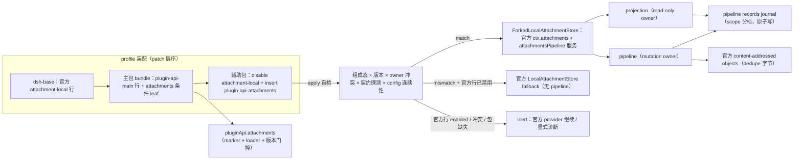

# Stage 2 - Design

## Status

Stage 2 Design 草案，待用户确认。Stage 1 Requirements（`requirements.md`）已由用户确认；此前按用户要求暂停，现按用户指示接续 SPEC1 产出本设计。本设计不包含实现代码，不进入 Stage 3。

## Overview

`attachment-pipeline` 以 **R 类 replacement bundle** 落地：辅助包 `@deepseek-ai/dsh-plugin-api-attachments`（源码 `packages/attachments/`，row id `plugin-api-attachments`）经官方 patch 机制禁用官方 `attachment-local` 行并插入唯一替代行。替代行 vendored-fork 官方 `@deepseek-ai/dsh-attachment-local@0.1.0-rc.6` 的 `lib/index.js`（303 行，MIT，保留出处），在逐字节保留官方 `ctx.attachments` 契约（`imageLimits` / `validateImage` / `saveImage` / `readImage`、`sha256:` content addressing、原子发布、digest/metadata 校验、AbortSignal、`AttachmentError`）之后，增加 pipeline capability slice：统一的 source ingestion、稳定 identity、受策略约束的 transform、面向 target route 的 projection、owner/generation 守卫的 resolve/open 与 retention cleanup。

主包在替代标记成立时条件性暴露 `pluginApi.attachments`（`pipeline` mutation owner + `projection` read-only owner）；`pluginApi.services.attachments`（SV8 官方直通）继续指向同一 `ctx.attachments` 服务，不因扩展成员而改变。**未安装辅助包、替代行未 active、版本失配或 owner 冲突时，主包该命名空间不可用，官方行为与旁路消费者完全不受影响。**

v1 媒体面按克制设计收敛：**官方四类 raster（png/jpeg/webp/gif）走官方 full-decode 准入路径**，另支持 `application/octet-stream` 通用 blob（仅 bytes 限额，无 pixel 维度）；timed media（audio/video 的 duration 限额）在 v1 显式返回 `ATTACHMENT_MEDIA_UNSUPPORTED`，不猜测媒体元数据，也暂不引入解码依赖。该媒体面取舍作为本设计决策点提交用户评审（见 Decision Points）。

## Architecture



### Source and hook classification

| Semantic area | Mechanism | Classification |
|---|---|---|
| official `ctx.attachments` contract | vendored fork 逐字节保留官方 backend 行为 | R（R2） |
| source ingestion / identity / transform / cleanup | 替代行新增 `ctx.attachmentsPipeline` service | R capability slice |
| resolve / open / projection / provenance | 同一替代行内的独立只读 owner | R capability slice（projection） |
| remote resource fetch | 复用官方公开 seam `pluginApi.services.web.fetch`（若可用），受 size/deadline/trust 约束；不可用则 unavailable | B composition |
| MCP resource | caller 提供 resource descriptor/bytes 或 resolver；本 feature 不拨号 MCP server | B composition |
| modality admission / route 选择 / retry / approval | 不拥有；projection 只消费显式 admission evidence | interop（`llm` admission、`model-route-policy`） |
| 官方 attachment pipeline seam | 当前不存在 | C / U10 upstream proposal |

Host 是权威 owner。Client 无 package-owned bundle、remote、slot、settings 或 reconnect 面（六项 §10 判定已记录于 requirements AP-10，全为阴性），本 feature 为 host-only。

## Components and Interfaces

### C1. Auxiliary package and patch assembly

`packages/attachments/`：

- `package.json`：`name: @deepseek-ai/dsh-plugin-api-attachments`；`version`/`dsh.api` 与主包完全一致（全量唯一版本 `<runtime>-<api.major.minor>`）；`dsh.bundle.patch: ./cordis.patch.yml`；`peerDependencies` 镜像官方 `dsh-attachment-local`（`dsh-attachment`、`dsh-invariants`、`cordis`、`dsh-home-paths`），并固定 `@deepseek-ai/dsh-attachment-local: 0.1.0-rc.6`（仅 identity 校验与 fallback 实例化）；`dependencies` 与官方相同（`sharp`、`@deepseek-ai/schemastery`）。
- `cordis.patch.yml`：

  ```yaml
  - id: attachment-local
    disabled: true
  - insert:
      - id: plugin-api-attachments
        name: '@deepseek-ai/dsh-plugin-api-attachments'
        config: {}
  ```

  官方 base 行无 config（`dsh-base/cordis.patch.yml:106-107`）；用户对 `attachment-local` 行的自定义 config 会落在已禁用行上，由 config 连续性解析接管（见下方自检步骤 4）。
- `lib/apply.js`：入口 `{ name, inject: ['loader'], apply }`。apply 永不抛穿；自检矩阵通过才注册 fork，任何失败 = 结构化诊断 + 正常 return。
- `lib/forked-store.js`：vendored 官方 `dsh-attachment-local/lib/index.js`，文件头注明出处与 MIT，增量全部标记 `// replacement patch:`。官方函数（`detectImage`/`probeImage`/`validateImageFile`/`saveImageFile`/`readImageFile`、durable directory sync、EEXIST 竞态处理）不改一行；只在 `LocalAttachmentStore` 实例上挂接 pipeline 扩展。
- `lib/pipeline-core.js`：纯函数/零 harness 依赖：source 解析、media profile 选择、identity/digest、provenance 构造、batch validation、transform policy 校验、projection 结果构造、redacted 错误构造。
- `lib/journal.js`：pipeline records journal 的原子读写与 scope 分档（见 C4.4）。
- `lib/invariant.js`：**不注册官方包名**。官方 `dsh-attachment-local/invariant` companion（no-op）继续由官方行/官方装配负责；替代行不得二次占用官方 invariant identity。

### C2. Boot self-check and fail-safe matrix

`apply(ctx)` 顺序执行：

1. **组成态探测**（`ctx.loader.entries()`）：找 `attachment-local` 与 `plugin-api-attachments` 条目；官方行 enabled → 保持 inert（官方 provider 继续）；重复替代行/竞争 owner → inert。
2. **owner 冲突探测**：`ctx.get('attachments')` 已存在且不携带本包契约符号 → inert，绝不覆盖既有 provider。
3. **identity matrix**（全部精确比较，含 prerelease）：
   - runtime 全量版本 `0.1.0-rc.6`；
   - `@deepseek-ai/dsh-attachment`、`@deepseek-ai/dsh-attachment-local` 均为 `0.1.0-rc.6`；
   - 本包与已安装主包的 full unique version 与 `dsh.api` 完全一致。
4. **config 连续性解析**：读取已禁用官方行的 `entry.options.config`（若存在）与 insert config `{}`，都用 forked 官方 Config schema 校验；**官方行 config 合法则优先采用**（保留用户自定义限额），否则回退 insert config 并 log 诊断；解析失败绝不抛穿。
5. **契约探测**：实例化后验证 `ctx.attachments` 存在、`imageLimits` 冻结且含 `maxImageBytes/maxImagesPerMessage/maxMessageImageBytes/maxImagePixels/mediaTypes`、`validateImage/saveImage/readImage` 为函数、读路径错误码 `INVALID_ATTACHMENT_REF/ATTACHMENT_CORRUPT/ATTACHMENT_NOT_FOUND` 保留；失败 → rollback 本行注册并 inert。
6. **mismatch fallback**：identity 失配但官方行已禁用/缺席且官方包可解析时，注册**官方 `LocalAttachmentStore`** 以保留原始服务契约（pipeline 关闭），显式诊断；官方行 enabled 时不注册（避免双跑）。

R3 边界：第三方 `import '@deepseek-ai/dsh-attachment'` / `'@deepseek-ai/dsh-attachment-local'` 仍解析官方包；本包只替换 loader row 的 ctx service/event 面。

### C3. Forked service and public service extension

替代行提供两个 Cordis 服务：

1. `ctx.attachments`：`ForkedLocalAttachmentStore extends official AttachmentStore`，成员与官方完全一致（R2）。实例上设置 `Symbol.for('dsh-plugin-api.attachments.contract') = true` 作为主包门控契约符号。
2. `ctx.attachmentsPipeline`：pipeline capability slice 的权威 owner，包含 `pipeline`（mutation）与 `projection`（read-only）两个**独立 owner**、冻结子对象；两者不共享私有状态，数据流单向（mutation 写 journal → projection 重读）。

主包 `pluginApi.attachments` 只在该符号成立、loader 状态为替代行 active、辅助包版本与主包一致时挂载，并委托到 `ctx.attachmentsPipeline`；否则返回 inert surface（`availability: 'unavailable'` + typed error）。主包不 import 辅助包（沿用 compaction-events 契约符号模式）。

### C4. Pipeline mutation owner

概念接口（冻结形状，全部返回深冻结记录/结果）：

```js
ctx.attachmentsPipeline.pipeline.ingest(source, options)        // → AttachmentRecord
ctx.attachmentsPipeline.pipeline.transform(input, operation, options) // → 新 generation 的 AttachmentRecord
ctx.attachmentsPipeline.pipeline.registerTransform(capability)   // → idempotent identity-scoped disposer
ctx.attachmentsPipeline.pipeline.cleanup({ scope, ownerId, generation, reason, retention }) // → CleanupResult
ctx.attachmentsPipeline.pipeline.capabilities()                  // → 冻结 limits / supported media
```

**C4.1 Source ingestion（AP-2）**

- 支持的 source kinds 与解析边界：

  | kind | 输入 | 边界 |
  |---|---|---|
  | `file` | `{ path }` | 经公开 `fs` seam 读取；路径只作 source provenance，绝不作 identity |
  | `paste` | `{ bytes, mediaType, name? }` | 全量校验后才发布 |
  | `data-uri` | `{ uri }` | 解析后得到 bytes + declared mediaType |
  | `remote` | `{ url }` | 经官方 `ctx.get('web')` seam（主包 SV48 直通的同一服务）读取；显式 trust/size/deadline 上限；不可用或超限 → unavailable，绝不私建网络客户端 |
  | `mcp-resource` | `{ resource: { uri, mediaType?, data? } \| resolver }` | caller 提供内容或 resolver；本 feature 不拥有 MCP 连接生命周期 |

- identity：`attachmentId = sha256:<hex digest of verified bytes>`（官方 content addressing 延续）；`recordId` 为本 pipeline 生成的 opaque id；`ownerId` + `owner generation` 由调用方显式提供；文件路径、URL、object URL、display name 变化只追加 provenance，不重铸 identity。
- 发布前完成：media profile 校验（full decode / declared media-type 匹配）、byte/pixel 限额、source-trust、deadline、并发 bound、digest 计算；失败 = explicit unavailable/error，不写 journal、不发布 record。
- batch（`options.batch`）：先逐成员校验、再校验聚合限额，全部通过才提交 batch-level publication；任何成员失败不产生部分发布。

**C4.2 Media profiles（AP-3）**

- v1 内置：`image/png|jpeg|webp|gif`（官方 sharp full-decode 路径，pixel 限额 `maxImagePixels`）与 `application/octet-stream`（bytes 限额，无 pixel/duration 元数据）。
- timed media（audio/video）v1 返回 `ATTACHMENT_MEDIA_UNSUPPORTED`；不做 header 猜测，不新增解码依赖（Decision Point D1）。
- 所有限额来源：官方 `imageLimits`（原样保留）+ pipeline config（同一 Config schema 的扩展字段，默认与官方一致）；pipeline 不绕过官方限额。

**C4.3 Transform generations（AP-4）**

- `registerTransform({ id, ownerId, generation, mediaTypes, policy, run, dispose? })`：`policy` 声明该 transform 的输入/输出 media 边界、byte/deadline 上限；`run(bytes, meta, { signal }) → { bytes, mediaType, meta }` 纯异步转换；注册重复按 `(ownerId, id)` latest-wins 且旧 disposer 不删新注册。
- `transform(input, { operationId, signal })`：只运行已注册且 mediaTypes 匹配的 operation；成功后发布**新 generation**（新 `recordId`、新 content identity、`parent: {recordId, generation}`、operation metadata、transform policy provenance）；失败/超时/中止 → 源 generation 不变、无部分发布；转换结果必须再走完整 admission（media profile + 限额 + digest）。
- provenance 明确区分 `original | derived | projected`；derived 永不冒充 original（AP-4）。

**C4.4 Records journal and cleanup（AP-7）**

- journal 根：`DSH_HOME/attachments/v1/pipeline/records/<scope>/<ownerId>/<recordId>.json`；写路径 temp + rename + fsync（复用官方 durable 目录语义），读路径 digest 校验。每个 record **只归属一档** `session | workspace | profile`；跨档需求拆记录，不合并。
- 字节对象沿用官方 content-addressed objects（同 digest dedupe）；dedupe 只共享字节，不共享 provenance：record 的 scope 权威在 journal，open/resolve 必须携带匹配的 `ownerId`/`generation`/scope。
- `cleanup({ scope, ownerId, generation, reason, retention })`：owner-scoped；只删除能由该 owner 的 journal 记录证明归属的对象引用与 record；与 open/transform/projection 竞争时由 ownership/generation guard 裁决（当前 generation 仍引用则让行）；重复 cleanup 幂等；replacement 后运行的旧 disposer 不删除新 owner 状态。

### C5. Projection owner（AP-5 / AP-6）

概念接口：

```js
ctx.attachmentsPipeline.projection.resolve({ ownerId, generation, attachmentId })   // → frozen record
ctx.attachmentsPipeline.projection.open({ ownerId, generation, attachmentId }, signal) // → { ref, data }（digest+metadata 复验）
ctx.attachmentsPipeline.projection.project(ref, { targetRoute, admission })          // → ProjectionResult | unavailable/denied
ctx.attachmentsPipeline.projection.provenance({ ownerId, attachmentId, generation? }) // → frozen chain
ctx.attachmentsPipeline.projection.availability()                                    // → active/supported media/limits
```

- `open` 必须携带 owner/generation，并完整复验官方 readImage 语义（AbortSignal 传播、digest、mediaType/bytes/width/height 元数据）；missing/corrupt/path-changed/expired → explicit unavailable/error，绝不按 display name 换读另一个对象。
- `project` 要求显式 `targetRoute`（route identity + media acceptance 描述）与显式 `admission` evidence（`{ accepted: boolean, source, observedAt }`，由 `llm` admission / `model-route-policy` 的公开投影提供）。任一缺失 → `unavailable`；`accepted === false` → `denied`。projection 返回只读表示（attachment identity、generation、targetRoute、media metadata、projection provenance），**不包含 bytes、不选择 route、不发 provider 流量、不绕过 admission**。
- projection 是读面：不注册、不写、不触发 mutation；admission/route 决策结果由调用方输入。

### C6. Main facade leaf and gating

- `pluginApi.attachments` 命名空间：`pipeline` / `projection` 两个 leaf + `availability()`。
- 挂载条件（全部满足才 active）：`ctx.attachments` 带契约符号；`ctx.attachmentsPipeline` 服务存在且成员探测通过；辅助包与主包 full version/`dsh.api` 一致；否则 inert surface 返回 typed `unavailable`。
- `pluginApi.services.attachments`（SV8）不受影响：仍按官方形状转发 `validateImage/saveImage/readImage/imageLimits`，替换行的扩展成员不进入该静态直通。
- 无新增 events catalog slice（requirements 未要求 pipeline 事件；需要时另立 spec）。

### C7. Client-surface determination

按 `capability-strategy.md` §10 六项逐条复证（requirements AP-10 已记录）：无 `dsh.client` manifest、无 remote namespace、无 slot/settings bridge、无 host/client 版本协商、无 browser reconnect 状态、无 client-facing event/service。结论 host-only；官方未来新增 client half 时必须重跑六项判定。

## Data Models

```ts
type AttachmentSource =
  | { kind: 'file'; path: string }
  | { kind: 'paste'; bytes: Uint8Array; mediaType: string; name?: string }
  | { kind: 'data-uri'; uri: string }
  | { kind: 'remote'; url: string }
  | { kind: 'mcp-resource'; resource: { uri: string; mediaType?: string; data?: Uint8Array } | { resolver: (signal: AbortSignal) => Promise<{ mediaType: string; data: Uint8Array }> } }

type AttachmentRecord = Readonly<{
  recordId: string                    // pipeline opaque id
  ownerId: string
  generation: string                  // owner-local opaque token
  scope: 'session' | 'workspace' | 'profile'  // exactly one
  attachmentId: string                // `sha256:<hex>` of verified bytes
  media: Readonly<{ mediaType: string; bytes: number; width?: number; height?: number }>
  name?: string                       // sanitized display name
  origin: 'original' | 'derived'
  parent?: Readonly<{ recordId: string; generation: string }>
  operation?: Readonly<{ id: string; ownerId: string }>
  sourceProvenance: ReadonlyArray<Readonly<{
    kind: SourceKind; observedAt: string; reason?: string
    displayPath?: string              // host-audit only; redacted from logs/UI by default
  }>>
  commitState: 'success' | 'error' | 'aborted' | 'denied' | 'superseded'
  createdAt: string
}>

type ProjectionResult = Readonly<{
  attachmentId: string
  generation: string
  targetRoute: Readonly<{ id: string; provider?: string; model?: string }>
  media: AttachmentRecord['media']
  provenance: ReadonlyArray<Readonly<{ source: string; observedAt: string; certainty: 'observed' | 'inferred' | 'unavailable' }>>
  admission: Readonly<{ accepted: boolean; source: string; observedAt: string }>
}>
```

Error vocabulary（保留官方 code，新增 bounded code）：`INVALID_ATTACHMENT_REF`、`IMAGE_TOO_LARGE`、`IMAGE_TOO_MANY_PIXELS`、`IMAGE_TYPE_MISMATCH`、`ATTACHMENT_NOT_FOUND`、`ATTACHMENT_CORRUPT`、`ATTACHMENT_WRITE_FAILED`（官方）+ `ATTACHMENT_SOURCE_UNTRUSTED`、`ATTACHMENT_MEDIA_UNSUPPORTED`、`ATTACHMENT_TRANSFORM_DENIED`、`ATTACHMENT_PROJECTION_UNAVAILABLE`、`ATTACHMENT_GENERATION_SUPERSEDED`、`ATTACHMENT_CLEANUP_CONFLICT`（pipeline）。

## Concurrency, Cancellation, and Ownership

- 并发策略按操作声明：content publication `deduplicate`（同 digest 共享对象，不同 record 独立）；record publish `latest-wins`（同 owner/generation 未终态前）；cleanup 对单 owner scope `exclusive`；projection 只读，不适用共享写。
- AbortSignal 传播：read/open（官方 readImage signal）、remote fetch、transform `run`、cleanup I/O 全部透传 caller signal；本地 signal 一律与 caller signal 组合，不替换。
- stale guard：所有异步结果在 publish/commit 前校验 `ownerId`、`generation`、`commitState` 未终态、目标 record 仍由本操作持有；迟到结果只保留 bounded diagnostic，不发布当前状态、不调用新 owner disposer、不追加引用。
- disposer：`registerTransform`、journal observer、cleanup 注册的 disposer 幂等且 identity-bound；旧 generation disposer 不删除同 id 新注册。
- cleanup 与 open/transform 竞争：由 record ownership/reference guard 裁决；当前 generation 引用的对象不可删。

## Visibility and Redaction

默认：model-visible 数据只含 approved 非 secret 的 identity/media/provenance 摘要；UI/debug 与日志省略路径、URL、凭据与 raw bytes；reason 有界。投影默认省略 `displayPath` 等 source 细节，除非显式 visibility policy 提升（保留 source/observedAt/uncertainty）。redaction/classification 失败 = 字段省略 + `redacted/unavailable`，绝不 fail-open。二进制（如 paste 的 bytes）不进入任何模型/UI/日志面。

## Error Handling and Fail-Safe

所有边界 contain：source 解析失败、media profile 抛错、transform 抛错/超时/中止、journal I/O 失败、projection 组装失败、listener（若有）失败均只影响对应操作/贡献，返回 typed error 或 unavailable，绝不抛穿 `apply`。apply 自检失败路径见 C2：inert / 官方 fallback / rollback 三态，任何情况不与官方行双跑。out-of-boundary 请求（modality admission、model 选择、retry、approval bypass、任意路径访问、跨组件 replacement）typed reject，无副作用。

## Testing Strategy

Focused tests SHALL cover：

1. **official fork integrity**：vendored 文件与官方 `dsh-attachment-local/lib/index.js` 的基线一致性（逐函数行为对照）；官方 `validateImage/saveImage/readImage` 契约（限额、full decode、type mismatch、content addressing、EEXIST、corrupt、signal abort、error codes）与官方实现等价。
2. **patch/self-check**：disable+insert 装配、移除恢复、官方行 enabled 时 inert、owner 冲突不双跑、identity matrix 失配时 fallback 官方 provider 且 pipeline 关闭、config 连续性（用户自定义限额落在禁用行时仍生效）、rollback 不抛穿。
3. **ingest/identity**：五类 source、路径/URL 变化不改 content identity、batch 全校验后原子发布、超限/不可信/不支持媒体 explicit 失败、scope 单档归属。
4. **transform/provenance**：新 generation + parent 链路、失败不发布部分 generation、original/derived 区分、重复注册 latest-wins 与旧 disposer 隔离。
5. **projection**：显式 targetRoute + admission evidence 的三态（ok/denied/unavailable）、无 route 推断、不触发 provider 流量。
6. **open/cleanup**：owner/generation 守卫、digest/metadata 复验、missing/corrupt/expired 语义、cleanup 幂等与引用 guard、dedupe 不跨 scope 泄漏 provenance。
7. **concurrency/redaction**：迟到 transform/open 结果 stale guard、AbortSignal 传播、可见性默认脱敏与提升面。

Tests use local fixtures and the audited official seam；不声明官方 runtime 支持之外的语义。

## Requirements Coverage

| Requirement | Design coverage |
|---|---|
| AP-1 | C1/C3 vendored fork + C2 契约探测，官方行为逐项保留 |
| AP-2 | C4.1 source kinds、identity、原子发布、失败边界 |
| AP-3 | C4.2 media profiles、batch 聚合校验、bounded rejection |
| AP-4 | C4.3 transform registry、新 generation、parent provenance |
| AP-5 | C5 `project` 显式 targetRoute/admission 三态 |
| AP-6 | C5 open 守卫 + Concurrency 节 stale guard |
| AP-7 | C4.4 journal scope 分档、cleanup ownership/race/idempotence |
| AP-8 | C1 patch + C2 自检矩阵、rollback、fail-safe |
| AP-9 | C2 identity matrix、mismatch 仅停用本 capability、R3 import 边界、owner 冲突 |
| AP-10 | C7 host-only 六项判定、U10 登记、可见性、out-of-boundary reject |

## Decision Points (flagged for user review)

- **D1 media surface**：v1 仅官方 raster + generic blob；audio/video（duration 限额、timed media 元数据）显式 unsupported，待 U10 或后续获批 spec 引入，不静默猜测。若用户要求 v1 即支持 timed media，本设计需回退 requirements 扩面。
- **D2 records journal 位置**：journal 落在官方 attachment root 之下的 `pipeline/` 子目录（替换行自有数据，不动官方 objects 布局）；如用户希望 metadata 走 `pluginApi.services.storage` domain，设计可改为 storage-backend 适配（scope 契约不变）。

## Governance Registration (on approval commit)

- **U10**：官方 attachment pipeline seam（identity、transform、projection provenance、cancellation、cleanup 一体契约）。注册于 `feature-list.md` §3，替代包为 current workaround。
- **退休条件**：官方 `dsh-attachment`/`dsh-attachment-local` 提供等价的公开 pipeline 契约后，消费者迁移至官方 seam，替代包进入 deprecation/retirement。

## Boundary and Non-Duplication

不替代 `dsh-app-boot`、launcher、Cordis dispatch、`dsh-llm`、`dsh-agent-loop`、settings 或任何其他官方组件；不覆盖官方 package import 面；不把 modality admission、route 选择、retry、billing 或自动发送塞进存储层。`model-route-policy` 与 `llm` admission 的决策仍归其 owner，本 feature 只消费其显式 evidence。
