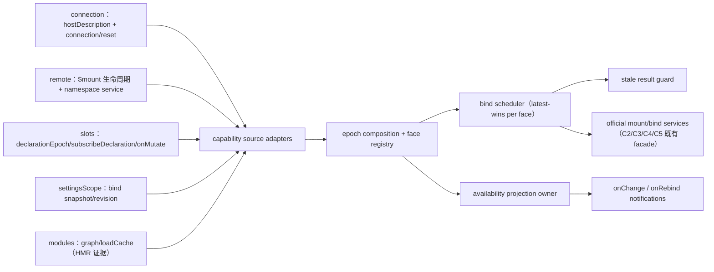

# Stage 2 - Design

> **公共契约现状注（2026-08-29 追加）**：本制品成文于目标领域树 cutover 之前，文中的公共 path 为旧命名。现行命名以 [`public-contract.registry.json`](../plugin-api-m7-public-contract-refactor/public-contract.registry.json) 的 `oldToTargetMapping` 为唯一权威，本制品涉及的映射如下：
>
> | 本制品使用的旧 path | 现行 path |
> |---|---|
> | `ctx.pluginApi.client.*`（client 根） | `ctx.pluginApi` 直接根成员（已无 `.client` 子命名空间）；`lifecycle` 为 `pluginApi.lifecycle` |
>
> 现行契约基线：包版本 `0.1.0-rc.6-0.1.0`（runtime `0.1.0-rc.6` / `dsh.api` `0.1`）；本制品中出现的 `0.1.0-rc.6-0.x` 为历史交付边界记录，不代表现行版本。本注只更新命名与版本指针，不改动本制品已获批的 Goal / Requirements 验收边界。

## Status

Stage 2 Design 已批准，Stage 2 已完成。Stage 1 Requirements（`requirements.md`）已由用户确认；本设计不包含实现代码，可进入 Stage 3。

## Overview

`client-generation-rebind` 是 **B 类 client lifecycle facade**，落在主包 client bundle 的 `pluginApi.client.lifecycle` 命名空间。它在既有的官方 client 服务（connection host description、remote mount、slot declaration、settings scope、module/HMR 图）之上提供 owner-local generation、face availability projection、独立 domain epoch、bind/rebind 调度与 stale async result guard，解决晚绑定、重连、HMR、版本变化与宿主部分不可用时的旧状态写回、重复 mount 和资源泄漏。

本设计不预设 R replacement：当前 `0.1.0-rc.6` 官方图中 generation/rebind 责任分布在 `dsh-client-runtime`、`dsh-client-connection`、`dsh-api-remotes`、`dsh-client-modules`、`dsh-client-ui-slots`、`dsh-client-ui-settings` 六个组件（requirements CG-8 已记录证据），没有任何单一官方 row 能完整承载“availability + generation + contribution binding + stale cleanup”全生命周期。facade 只组合官方公开服务，不复制官方 browser bundle，不新增 transport/resume/ack 协议。

**主公开面 = registration/bind lifecycle registry；availability 是独立只读 projection owner**（`api-shape.md` §1/§3：同一 feature 内拆为独立 owner 的面，二者不共享私有状态）。Host 通过既有官方 client 服务提供权威 capability evidence；client 拥有绑定生命周期；host 不因本 feature 新增 wire 面。

## Architecture



### Source and hook classification

| Semantic area | Mechanism | Classification |
|---|---|---|
| connection readiness / runtime version | 官方 `ctx.connection.hostDescription.getSnapshot/subscribe` + `connection/reset` 事件直接绑定（官方 controller 的 generation/attempt 是 instance-private，facade 只从其公开状态信号推导 owner-local connection epoch） | B（官方事件/服务直绑） |
| remote face availability | 复用 M3 C2 `mountRemoteContribution` 的官方 `ctx.remote.$mount` 生命周期 | B（官方服务组合） |
| slot declaration epoch | 官方 `ctx.slots.inject(key, callback)` 的 declaration-lifetime effect（内部已按官方 declaration epoch 重跑）+ `slots/changed`；facade 以 inject 重入为 epoch 边界，不读官方私有计数 | B（官方服务直绑） |
| settings revision | 官方 `settingsScope.bind(spec)` 的 `getSnapshot/subscribe`（M3 C3） | B（官方服务直绑） |
| HMR / module arrival | 官方公开 `clientModules` module graph、load-cache 与 invalidation 面（M4 C10/SV24）作为证据源；不读取私有 `generation`/`attempt` | B（官方服务直绑） |
| 官方统一 client lifecycle/rebind seam | 当前不存在 | C / U12 upstream proposal |
| replacement / 自建 browser bundle | 不采用 | 无 R |

Host 侧不新增注册服务：runtime 版本来自官方 `host.describe`（`{version, cwd, provider, model, ...}`），remote descriptor 与 settings revision 本身就是 host 权威描述。Client 只绑定与投影；不创建 execution、usage 或 durable record。

## Components and Interfaces

### C1. Capability source adapters

每个 adapter 只读自己声明的官方服务，输出 `CapabilityEvidence`：

| Adapter | 证据 | 失效信号 |
|---|---|---|
| `connection` | `hostDescription` snapshot（含 runtime `version`） | snapshot 变为 `undefined`（reconnect）、`connection/reset` 重建 |
| `remote` | 某 namespace 经官方 `$mount` 成功、namespace service 可解析 | mount 失败 / 所属 disposer 运行 / service 缺失 |
| `slot` | 官方 `slots.inject(key, ...)` 的 declaration-lifetime effect 进入/退出 + `slots/changed` | declaration collapse（effect 退出） |
| `settings` | `settingsScope.bind(spec)` 的 status/revision | `status: 'unavailable'`、revision 变化、bind 失效 |
| `modules` | module graph / `loadCache` 变更（HMR invalidate） | 图 rev 变化 |

核心官方 client 服务缺失或 malformed，或 lifecycle registry 初始化失败时，`clientLifecycle` 才允许返回 disabled/inert surface；该失败必须记录安全诊断并继续 client boot。核心服务已存在且 registry 已初始化后，单个 adapter/evidence 缺失或失败只使对应证据源与受影响 face `degraded/unavailable`，不关闭其他 adapter、无关 face 或整个 lifecycle facade。

### C2. Face registry and availability projection

概念接口（client bundle 内，冻结形状）：

```js
const handle = pluginApi.client.lifecycle.registerFace({
  faceId,                       // stable, owner 域内唯一
  ownerId,
  scope: 'client',              // v1 唯一支持 scope，必填
  kind: 'remote' | 'slot' | 'settings',
  require: {
    contractVersion?,           // 与 host runtime full version 精确比较（缺省=不约束）
    capabilities?,              // 需要的 capability 键
    remote?: { namespace, contribution? },   // kind=remote
    slot?: { key },                           // kind=slot
    settings?: { namespace },                 // kind=settings
  },
  bind(input, { signal }) { /* return disposer owned by this contribution */ },
  dispose?,                     // 可选外部资源 disposer
})
// → { generation, availability(), dispose() }  // dispose 幂等且 identity-bound

pluginApi.client.lifecycle.availability(faceId)   // frozen snapshot
pluginApi.client.lifecycle.onChange(listener)     // → disposer
pluginApi.client.lifecycle.onRebind(listener)     // → disposer
pluginApi.client.lifecycle.scan()                 // 只读诊断扫描（见 C5）
```

- 注册要求 faceId/ownerId/`require`/bind/disposer/`scope: 'client'`（v1 唯一支持 scope）齐备；重复 `(ownerId, faceId, generation)` mount 返回既有 identity-scoped handle 或 typed reject，**不创建第二个 live registration**。每次 bind 记录一个 owner-local `contributionId`（CG-1）。
- generation 是 owner-local opaque token：由 facade 为每次 rebind 生成，只用于判定旧回调/旧 disposer 是否被取代，不跨 owner 比较；owner 需要排序时另带 owner-local revision（CG-1）。
- availability 状态词汇：`available | pending | unavailable | degraded | disposed`，与 execution outcome 词汇隔离。snapshot 含 `faceId/ownerId/generation/capabilities/state/epochs/reasons/observedAt` 与当前 `contributionId/contributionEpoch`，深冻结。
- 每个 domain 的 epoch 独立保留（CG-3）：`connection` 是 facade 从官方 `connection/reset` + hostDescription 变换推导的 owner-local epoch（官方 controller 的 generation/attempt 是 instance-private，不得当作公开读数）；`modules` 只随官方公开 module graph/load-cache/invalidation 面的变化而变化，不读取私有 `generation`/`attempt`；`remote` 只随该 namespace mount/unmount；`slot` 以官方 `slots.inject` 的 declaration-lifetime 重入为边界；`settings` 采用 host revision。browser refresh、SSE reconnect、module arrival/HMR、Typert schema revision、slot declaration epoch、settings revision 即使同区间发生也保留五个独立 cause/epoch，绝不合并为一个数字。

### C3. Bind scheduler and rebind lifecycle

- **触发**：registration 后与任何相关 evidence 变化后，scheduler 以 face 为单位做 `latest-wins` 重评估；同 face 内评估串行，不同 face 可并行。
- **bind**：当 `require` 中全部 evidence 可用且 `contractVersion` 匹配时，以当前 generation/epoch 调用一次 `bind(input, { signal })`，把返回 disposer 记录为该 contribution 所有。partial setup 失败：只清理本 contribution 已创建资源，face 标 `degraded`，不关闭 facade 其他 contribution。
- **invalidate/rebind**：必需 evidence 失效或新 generation 取代旧 generation → 旧 contribution 失去提交资格，其 disposer **至多运行一次**；evidence 再次齐备后允许以新 generation/epoch 重新 bind，并保留前序 degraded/unavailable 原因。每次 invalidate/dispose/rebind 发布一条 owner-scoped 通知（affected face、old/new generation 或 epoch、bounded reason）。
- **官方契约保真**：bind 路径只经官方 `connection`、`remote.$mount`（既有 C2 wrapper）、`slots.*`、`settingsScope.bind`（既有 C3 wrapper）调用，不重定义成员名、RPC payload、事件顺序、取消、返回值、错误或 disposer 所有权；mutation 后的事件/通知仍由官方服务发布。

### C4. Stale async result guard

- bind/rebind 发起的每个异步操作绑定 `(ownerId, generation, faceId, contributionEpoch, caller AbortSignal)`。
- 提交资格校验（任一不满足即 stale）：owner 仍匹配、generation 仍为当前、face 未 unavailable/disposed、contribution 未被本 disposer 清理、execution/lifecycle 未进入被取代状态。
- stale 结果只保留 bounded diagnostic：不得发布当前 availability/生命周期状态、不得调用新 contribution 的 disposer、不得重复注册、不得触发新 bind。底层网络/Promise 无法真正取消时，guard 依然阻止其成为当前状态（CG-5）。
- 所有 listener（onChange/onRebind/evidence subscriber）throw/reject 均 contained；face 状态与 client boot 不受影响。

### C5. Contract compatibility and diagnostics

- `contractVersion` 与官方 `connection.hostDescription.getSnapshot()?.version`（runtime 全量版本）精确比较；缺失/不匹配 → 该 face `unavailable/degraded`，bounded diagnostic 记录 `{faceId, ownerId, required, provided, reason}`。
- host description 缺失时不从包名、module arrival 或旧缓存推断兼容（CG-7）。remote/slot/settings 的 capability 检查分别用官方 descriptor / declaration / settings snapshot，不做字符串猜测。
- 诊断只写既有 logger 与 `plugin-diagnostics` 的公开投影（若 active）：本 feature **不拥有** diagnostic check 状态，不提供 repair/UI。diagnostic 发射失败不影响 lifecycle 结果。

## Data Models

```ts
type FaceKind = 'remote' | 'slot' | 'settings'
type FaceState = 'available' | 'pending' | 'unavailable' | 'degraded' | 'disposed'

type AvailabilitySnapshot = Readonly<{
  faceId: string
  ownerId: string
  generation: string                // owner-local opaque token
  revision?: number                 // owner-local, only comparable within owner
  kind: FaceKind
  capabilities: ReadonlyArray<string>
  state: FaceState
  epochs: Readonly<{
    connection?: string             // opaque connection generation evidence
    modules?: string                // public module graph/load-cache/invalidation epoch
    remote?: string                 // per-namespace mount epoch
    slot?: number                   // official declarationEpoch
    settings?: number | string      // host revision
  }>
  required: Readonly<{ contractVersion?: string; capabilities: ReadonlyArray<string> }>
  provided: Readonly<{ contractVersion?: string; capabilities: ReadonlyArray<string> }>
  contributionId?: string            // current bound contribution (owner-local)
  contributionEpoch?: string         // current bind epoch (owner-local)
  reasons: ReadonlyArray<Readonly<{ code: string; detail?: string; observedAt: string }>>
  observedAt: string
}>

type RebindNotification = Readonly<{
  faceId: string
  ownerId: string
  oldGeneration?: string
  newGeneration: string
  cause: 'connection' | 'remote' | 'slot' | 'settings' | 'modules' | 'owner'
  reason: Readonly<{ code: string; detail?: string }>
  observedAt: string
}>
```

State 是生命周期投影，不是 execution outcome；`disposed` 表示 face 已由 owner 清理，不是 `superseded` 终态。UI/debug 面只暴露上表字段；remote payload、settings values、凭据与请求内容一律不进投影。

## Concurrency, Cancellation, and Ownership

- 并发策略声明：每 face bind 评估 `latest-wins`（新 generation/epoch 取代旧评估）；同 `(ownerId, faceId)` 重复 mount `deduplicate`（复用/拒绝，不双注册）；不同 face `parallel`；只读 projection 无共享写，声明不适用。
- 取消：caller `AbortSignal` 传给 `bind` 与底层官方调用；取消是信号不是终态，face 只在 invalidate/rebind 裁决后变化。generation 取代旧绑定时同步发出 invalidate，但旧 disposer 运行与网络真正停止无时序承诺——正确性由 C4 guard 保证。
- disposer：注册 disposer、bind 返回 disposer、listener disposer 全部幂等且 identity-bound；旧 disposer 不删除同 public key 新 contribution；plugin unload 时由 `ctx.effect` 回收其所有 registration/listener/timer，并让 pending bind 失去发布资格（CG-6）。
- retry：本 feature 不自动重试 bind；是否重试由下次 evidence 变化或 owner 显式调用决定（默认不重试，符合 `durable-state-and-scope.md` 未声明能力默认不 retry）。

## Visibility and Redaction

无 visibility policy 时：投影只含 face id、availability、bounded reason、generation metadata 与 capability 版本；省略 remote payload、settings values、凭据与请求内容。显式提升的非 secret 证据保留 source/observedAt/uncertainty，且不被呈现为 host mutation 或 execution outcome。redaction 失败 = 字段省略 + `unavailable`。

## Error Handling and Fail-Safe

核心官方 client 服务缺失或 malformed，或 lifecycle registry 初始化失败时，feature inert（`pluginApi.client.lifecycle` 返回 disabled surface），并记录安全诊断后继续 client boot。核心服务可用且 registry 已初始化后，adapter/evidence 失败只使受影响 face `degraded/unavailable`；注册校验失败、bind 抛错/reject、listener/evidence subscriber 失败、disposer cleanup 失败与 diagnostic emission 失败均须在对应 face、listener、contribution 或 diagnostic 边界内 contained，不关闭 lifecycle facade、无关 face 或 client boot（CG-2/CG-4/CG-7）。任何 repair/自动 recovery/transport 协议/profile mutation/跨 owner generation 比较请求 typed reject。单个 contribution 失败只使自身 `degraded/unavailable`。

## Testing Strategy

Focused tests SHALL cover：

1. owner-local generation 与 revision 分离、跨 owner 不比较、connection/modules/remote/slot/settings 五个 epoch 独立前进；modules 只由官方公开 module graph/load-cache/invalidation 证据推进，不读取私有 generation/attempt；含同区间 refresh+reconnect+HMR+schema revision 并发。
2. registration 契约：缺失 faceId/owner/bind/disposer/scope 拒绝；重复 mount 复用或拒绝；availability snapshot 冻结与状态词汇。
3. bind/rebind：evidence 齐备后一次 bind、失效后 disposer 至多一次、再次可用以新 epoch 重绑、partial bind 失败只清理自身、通知含 old/new generation 与 reason。
4. stale guard：晚到 Promise/HMR 回调/reconnect 旧回调在 dispose/replacement 后不能发布状态、不能注册、不能调用新 disposer；bounded stale diagnostic。
5. 官方契约保真：经 C2/C3/C4/C5 既有 facade 调用的官方成员名、payload、disposer 所有权与错误不被重定义。
6. diagnostics/redaction：contractVersion 缺失与不匹配降级、diagnostic 发射失败不影响 lifecycle、payload/settings/凭据不出现在投影。
7. fail-safe：核心官方服务缺失或 malformed、或 lifecycle registry 初始化失败时 feature inert，client boot 不中断；adapter/evidence 失败只局部降级，listener/evidence subscriber、disposer cleanup 与 diagnostic emission 失败均 contained，不关闭 facade、无关 face 或 client boot。

Tests use local client fixtures over the audited official services；不声称修复或重连保证。

## Requirements Coverage

| Requirement | Design coverage |
|---|---|
| CG-1 | C2 generation token、owner 域、owner-local revision |
| CG-2 | C2 registry + availability projection、逐 face 降级、listener containment |
| CG-3 | C1 adapter table、C2 independent epochs、refresh/HMR/reconnect 不合并 |
| CG-4 | C3 bind/rebind 调度、partial cleanup、通知与官方契约保真 |
| CG-5 | C4 stale guard、取消不可停止时 identity/epoch 守卫 |
| CG-6 | C2 重复 mount、幂等 identity-bound disposer、unload 回收 |
| CG-7 | C5 contractVersion 比较、缺失不推断、diagnostic 边界 |
| CG-8 | Overview 证据与 B 判定、无效 R 边界拒绝、U12 登记 |
| CG-9 | Visibility 节 redaction 与 out-of-boundary reject |

## R-Class Assessment (confirmed in this design)

首版保持 B 类。一个合法 R replacement 需要某个官方组件同时是 face discovery、contract generation、connection/remote/slot/settings binding 与 stale cleanup 的唯一 owner；当前证据把上述责任分属六个官方包。任何“替换一个或多个官方组件行 + 复制完整 browser bundle”的实现按 CG-8 判为无效 R 边界。官方未来出现单一 lifecycle owner 且其 client bundle/build 契约可完整复现（R8）时，经独立 client-surface audit 后可重开 R 评估。

## Governance Registration (on approval commit)

- **U12**：官方 client lifecycle/rebind seam（face availability、owner-local generation、contribution binding、stale cleanup 一体契约）。注册于 `feature-list.md` §3。
- **退休条件**：官方 client graph 提供等价的公开 seam 后，facade 优先官方契约并进入 deprecation/retirement，不维持竞争性 generation 语义。

## Boundary and Non-Duplication

不替换 `dsh-client-runtime/connection/api-remotes/modules/ui-slots/ui-settings` 任何行；不新建 transport resume/ack、remote namespace 发现协议、settings wire schema 或 slot 渲染 API；不在浏览器创建 execution/usage/durable identity；不自动 repair 宿主或改 profile。既有的 M3/M4/M5 client facade（C2/C3/C4/C5/C6/C9/C10 等）保持其 owner，本 feature 只在其上做生命周期组合。
