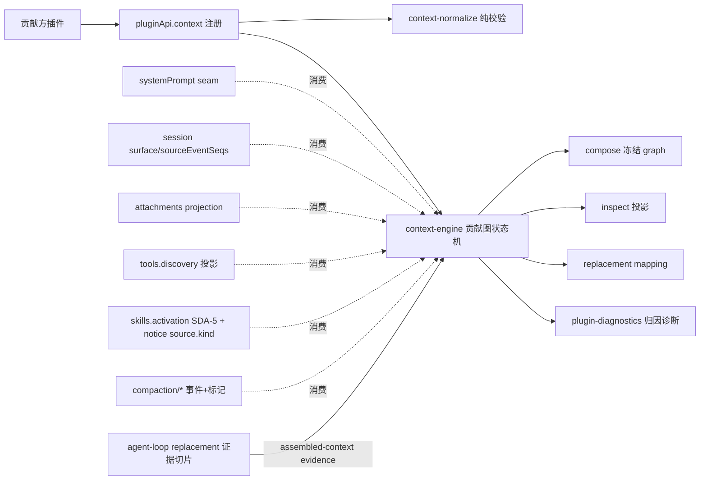

# Stage 2 - Design

## Status

SPEC1 Stage 2：Design 已产出，与重构后的 Goal/Requirements 一并提交 M6 第六批次批量确认门，**尚未获批**。获批前不得进入 Stage 3 Tasks。本文为 Wave B：消费 Wave A `skill-discovery-activation` 设计中的 Exposure record 词汇（SDA-5）与目录 notice 的 `source.kind` 元数据，不重实现其生命周期。

## Overview

`context-provenance` 提供一个只读可审阅的上下文贡献图。**`sent` 证据切片为 R 类实现**：官方 agent loop 在组装/发送点（`dsh-agent-loop` 内 `renderContextSections(assembly)` / `renderPrompt(assembly)`，本机 DSH `0.1.0-rc.6` 源码核实）没有任何 provenance dispatch；本 feature 在既有 `@deepseek-ai/dsh-plugin-api-agent-loop` replacement（owner `@deepseek-ai/dsh-agent-loop`，model-route-policy 已交付并锁定 runtime identity）上新增 assembled-context 证据发射，使贡献图的 `sent` 状态由真实证据支撑。

边界纪律：**R 切片只发射证据，不改变 loop 内组装/策略决策**——组装点策略消费带 provenance 的 assembled context 仍属 C 类（U19 上游提案，退役条件见 CP-5.7）。门面本体保持 B 类组合 facade：不拥有 memory/attachment/session/skill/tool 的持久状态，不因 compose 结果触发任何动作。

## Architecture

组件：

| 组件 | 职责 | 钩子引出机制 |
|---|---|---|
| `lib/context-normalize.js` | 纯函数：contribution 校验、受众包络、graph 排序、budget 截断、mapping/证据归一 | —（零依赖纯函数） |
| `lib/context-engine.js` | 状态机：contribution 注册表、节点六态、observer epoch、bounded history、replacement mapping、evidence → `sent` 迁移 | B 类：门面自有解释层 |
| `lib/context-sources.js` | 七个 source adapter（systemPrompt / sessionSurface / attachment / toolExposure / skillExposure / compaction / assembledEvidence；memory 可选第八来源） | A 类直通 + B 类委托已交付投影 |
| `packages/agent-loop/`（既有 R 包扩展） | assembled-context 证据切片：在等价 `renderContextSections`/`renderPrompt` 调用点发射冻结证据（identifiers/seq 范围，无 content）；不改组装与决策 | **R**（同组件第二能力，R2） |
| host wiring | feature guard `context`、FEATURE_MOUNTERS（在 `skillsActivation` 之后）、guards.js probe | 门面胶水，fail-safe |

**数据流（单向）**：sources 产生证据 → contribution 注册 → compose/inspect 冻结投影 → evidence 触发 `sent` 迁移。投影不写、compose 不决策、R 切片不决策（`api-shape.md` §2）。

**状态派生澄清（Stage 4 实现期修订，2026-08-26）**：`served` 是**派生分类**而非持久状态转移——compose 是纯投影（CP-3.1 / `api-shape.md` §1 projection 面：不写状态、不注册策略、不调 mutation），节点被该 session 最近一次 compose graph 包含即报告为 `served`，engine 仅保留每 session 最近一次 graph 快照（latest-wins）供 inspect 派生与分页；持久转移仅四条：evidence→`sent`、mapping→`archived`/`superseded`、redaction 失败→`redacted`（均为外部事件/失败路径驱动，与投影纯度不冲突）。

## Components and Interfaces

### 公开面（`pluginApi.context`）

- `contribute(spec)` → `{ handle }`（CP-1）；`compose(request, { budget, policy })` → 冻结 `ComposeResult`（CP-3）；`inspect(session)` → 冻结 `InspectResult`（CP-6）；`mapping(query)`（CP-7）；`observe(listener)`（CP-9）；`availability()`。

### R 证据切片（`packages/agent-loop/` 扩展）

- **发射点**：替代引擎内与官方 `renderContextSections`/`renderPrompt` 等价的调用点，在渲染完成后、dispatch 前发射一次冻结证据（不注册主 facade events catalog；与 `mcp/catalog-changed` 同款 R 行自发射惯例）。
- **证据 payload**：`{ sessionId, generation, systemSections: [{ sectionKey, sourceTags }], messageRanges: [{ fromSeq, toSeq, count }], dropped: [{ ref, reason }], observedAt }`——只含标识符/序号范围/原因，不含 content、不含 secret（CP-5.3/CP-8）。
- **门面消费**：`context-sources.js` 的 `assembledEvidence` adapter 把 evidence 映射到图节点 → `sent`（含 evidence reference 与 observedAt）；不匹配贡献保持 `served`/`dropped`；切片缺席/停用 → 上限 `served` + `served ≠ sent` 披露（CP-5.4）。
- **契约复刻不变**：切片不改变既有 agent-loop replacement 已复刻的 `ctx.agentLoop` 服务/事件面、route-policy 语义与 boot 自检矩阵；版本锁定与 owner 检测沿用该包现有实现（CP-5.2）。

### 内部接口

- engine 注入 `{ sources, reportDiagnostics, now, idFactory, sessionResolver, evidenceSource }`；session 解析复用 execution-observation correlation，缺省回退 `session.requestContext()`，失败 typed `INSPECT_UNAVAILABLE`。

**sessionResolver 语义澄清（Stage 4 实现期修订，2026-08-26）**：执行期确认本 feature 的 sessionResolver 面向「显式 session 引用」（字符串/含 `id`/`sessionId` 的对象），而 execution-observation correlation 与 `session.requestContext()` 属于 agent/execution 场景的隐式解析，本 feature 公开面不接收 exec/agent 对象；因此 resolver 的最小诚实语义为：well-formed 引用 → ok（持久会话不一定在 live store，存在性检查会产生假阴性，克制设计不引入）；畸形引用 → 失败 → typed `INSPECT_UNAVAILABLE`；合法引用但无记录 → 有界空投影而非伪造历史（CP-6.4 的"缺失/越界"按引用格式判定，不做跨调用方存在性披露）。
- compose 策略：纯函数 policy 瀑布；AbortSignal → typed `aborted`。

## Data Models

- **ContributionRecord / NodeRecord / ReplacementMapping**：同重构前定义；NodeRecord 新增 `sentBy: { evidenceId, observedAt }?`。
- **AssembledEvidenceRecord**：`{ evidenceId, sessionId, generation, systemSections, messageRanges, dropped, observedAt }`（冻结、内存态、bounded ring）。
- 节点六态为生命周期/可见性状态，非终态词汇；有终态的操作对象沿用统一终态词汇（`identity-and-lifecycle.md` §3）。

## Error Handling

统一 typed 结果（不抛穿插件回调、绝不抛穿 apply）：

- `CONTRIBUTION_INVALID` / `CONTRIBUTION_CONFLICT` / `CONTRIBUTION_UNKNOWN` / `CONTRIBUTION_DISPOSED`
- `COMPOSE_SCOPE_UNRESOLVED` / `COMPOSE_ABORTED`
- `SOURCE_UNAVAILABLE` / `SOURCE_DEGRADED`（per-source，含 evidence 切片缺席 → `EVIDENCE_UNAVAILABLE`）
- `INSPECT_UNAVAILABLE` / `MAPPING_UNAVAILABLE` / `REDACTION_FAILED`（fail-closed）/ `INACTIVE`

R 切片发射异常被替代引擎吞掉并记诊断：证据发射失败**不得影响**模型请求的组装与发送（evidence-only 铁律）；门面在 evidence 缺失时降级披露，不伪造 `sent`。

## Failure Paths and Guard Strategy

1. **boot 自检（guards.js probe 扩展 + agent-loop 包既有矩阵）**：`systemPrompt.service`（mandatory）；session surface helper；软性：attachments 投影 marker、compaction 事件词汇、toolDiscovery、skillsActivation、agent-loop evidence 切片（marker 探测）——软性缺失只降级对应 source（`EVIDENCE_UNAVAILABLE` 时 `sent` 不可达、`served` 上限披露）。
2. **apply fail-safe**：probe 失败 → `context` 挂载 disabled 面（typed `INACTIVE`），不抛穿 apply、不杀 boot；R 切片发射失败不影响 agent-loop 主功能（route-policy 照常）。
3. **per-source 降级**：单 source 组装失败只留 degraded 证据，graph 其余照常。
4. **stale 隔离**：stale generation 失去提交资格；evidence 迟到/旧代不重写已终态节点（CP-5.6）；observer epoch + stale-callback guard。
5. **脱敏 fail-closed**：secret 默认 deny；evidence 只含标识符，脱敏失败即剔除/标 `redacted`。

## Hook Extraction Summary（AGENTS.md §2.5 强制表）

| 语义 | 通道 | 引出机制 |
|---|---|---|
| systemPrompt 服务与渲染 helper | A | `ctx.get('systemPrompt')` + 已稳定化 `renderContextSnapshot`/`joinContextSections` 直通 |
| contribution 注册 / compose / inspect | B | 官方无 provenance dispatch，门面自有解释层 |
| session surface 证据 | B | 门面 S2 上屏 intent（`surfaceOp`/`sourceEventSeqs`，底层官方 `Session.append`） |
| attachment provenance | A（消费） | 已交付 attachments R 投影 `projection.provenance/project` |
| 工具暴露来源 | B（消费） | 已交付 `toolDiscovery` 投影 |
| skill 暴露来源 | B（消费） | Wave A `skills.activation` SDA-5 Exposure record + 目录 notice `source.kind` |
| memory 来源（可选） | B（可选） | contribution 元数据声明；无专用 facade |
| compaction/prune replacement mapping | A（消费） | 已交付 compaction-events 事件 + 瀑布 + durable 标记 |
| **`sent` 证据** | **R** | 既有 `plugin-api-agent-loop` replacement 上新增 assembled-context 证据切片（发射点=官方 `renderContextSections`/`renderPrompt` 等价位置；evidence-only） |
| 组装点原生消费带 provenance 的 assembled context | **C** | 登记 U19 上游提案（退役条件见 CP-5.7），不伪造官方保证 |
| 横切派发语义 | 永不 R | priority/deepFreeze/fault containment 维持官方现状 |

## Testing Strategy

1. **纯函数**：`context-normalize.test.mjs`（校验、受众包络、排序确定性、budget dropped reason、mapping/evidence 归一）。
2. **引擎**：`context-engine.test.mjs`（六态转移、superseded lineage、bounded history、observer epoch、stale guard、取消；evidence→`sent` 迁移、迟到/旧代证据不重写终态、evidence 缺失 → `served` 上限披露）。
3. **R 证据切片**：`packages/agent-loop/test/evidence-slice.test.mjs`——发射点等价性、payload 冻结且无 content/secret、发射失败不影响组装与 route-policy、boot 自检矩阵与版本锁定回归（既有包测试扩展）。
4. **source 适配**：fake systemPrompt / session surface / attachments / toolDiscovery / SDA-5 exposure / compaction 事件流 / evidence 事件流；per-source 降级；memory 来源只认 contribution 元数据。
5. **guard/集成**：guards probe、FEATURE_MOUNTERS 顺序（`context` 在 `skillsActivation` 之后）、`npm test` 全量、无 governance token 泄漏；共享 `features.length`/host-boundary 断言为 integration-owned 增量；版本 bump 与 catalog 登记由 integration owner 统一。

## Requirements Coverage

CP-1→contribute；CP-2→context-sources 七来源+memory；CP-3→compose/budget/policy；CP-4→NodeRecord；CP-5→R 证据切片 + U19；CP-6→inspect；CP-7→compaction mapping；CP-8→受众包络；CP-9→取消/stale/降级；CP-10→ownership 边界与单组件 R 切片。

## Non-Goals

同 requirements.md「Non-Goals」；另：R 切片不做 loop 组装/策略决策；不为 evidence 注册主 facade events catalog slice；不承诺 evidence durable。
