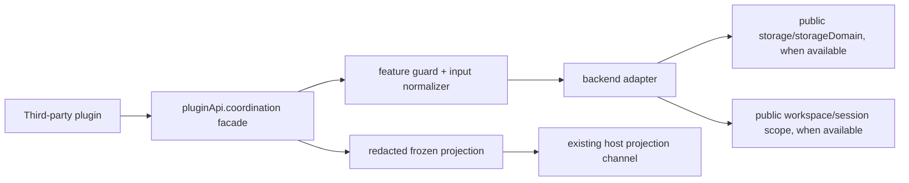

# Stage 2 - Design

> **公共契约现状注（2026-08-29 追加）**：本制品成文于目标领域树 cutover 之前，文中的公共 path 为旧命名。现行命名以 [`public-contract.registry.json`](../plugin-api-m7-public-contract-refactor/public-contract.registry.json) 的 `oldToTargetMapping` 为唯一权威，本制品涉及的映射如下：
>
> | 本制品使用的旧 path | 现行 path |
> |---|---|
> | `pluginApi.recovery` | `pluginApi.executions.recovery` |
> | `pluginApi.execution` | `pluginApi.executions` |
> | `pluginApi.workspaceTransactions` | `pluginApi.workspaces.transactions` |
>
> 现行契约基线：包版本 `0.1.0-rc.6-0.1.0`（runtime `0.1.0-rc.6` / `dsh.api` `0.1`）；本制品中出现的 `0.1.0-rc.6-0.x` 为历史交付边界记录，不代表现行版本。本注只更新命名与版本指针，不改动本制品已获批的 Goal / Requirements 验收边界。

## Status

Stage 2 Design 已确认；SPEC2 审查纠偏完成，可进入 Stage 3 Tasks。2026-08-25
ANY 维护修订（规范对齐）见各节标注与文末「ANY 维护修订记录」，不改变已确认
的 Goal/Requirements 验收边界。

## Overview

`coordination-lease` adds a host-owned `pluginApi.coordination` surface for
bounded ownership of a logical resource. The surface normalizes owner identity,
generation, expiry, fencing, conditional takeover, compare-and-set, and watch
semantics while preserving the truth about the backend that supplied each
guarantee.

This is a B-class facade and aggregation layer. It consumes only public host
services (`storageDomain`, `storage`, `workspaces`, and session/workspace scope
metadata when available). It does not import private DSH modules, modify an
official package, create a replacement bundle, or become a scheduler. An
in-memory adapter is allowed as a local fallback, but its capability projection
is explicitly non-durable and memory-scoped.

The following feature surfaces are deliberately separated:

| Surface | Owner | Role |
|---|---|---|
| `pluginApi.coordination` | this feature | lease and fenced-CAS contract |
| `pluginApi.recovery` | `recovery-policy` | recovery decision and action policy |
| `pluginApi.execution` | `execution-observation` | execution identity and lifecycle projection |
| `pluginApi.workspaceTransactions` | same-batch feature `workspace-mutation-transaction` | mutation and rollback evidence |
| `pluginApi.tasks` | same-batch feature `task-execution-observation` | task/run/attempt lineage |

No client authority is created: the client shape exposes no acquire, heartbeat,
release, takeover, or CAS entry point, and any mutation attempt through this
feature's client surface is answered with an explicit typed
`{ code: 'unsupported', kind: 'client-mutation', availability }` result rather
than a local emulation (CL-10.2). A client may render an existing host
projection through an already supported channel; that projection is read-only,
redacted, carries availability and generation metadata, and degrades to an inert
local face without blocking unrelated client faces when no compatible host
projection exists (CL-10.1, CL-10.3).

### Face placement (api-shape 三面模型对齐，ANY 修订 2026-08-25)

本 feature 以 **durable mutation** 为主公开面（acquire / heartbeat / release /
takeover / compareAndSet 写 lease 记录），`watch` / `current` 是其同 owner 的
**只读投影面**，与 mutation 共享同一记录状态空间：投影是 mutation 的即时
镜像，不注册策略、不写状态，遵守 mutation → event → projection 的单向数据流
（`api-shape.md` §2）。这与 `api-shape.md` §3 的 llm 分面先例（各面不共享
私有状态、各自 feature guard）不同：lease/CAS 是读写一体域，投影必须观察
mutation 的结果才能成立，强行拆面会破坏单向数据流且令 watch 无法消费事件。
本取舍保持单一并发语义 owner（adapter 的 per-key 串行 lane），不构成
`api-shape.md` §4 smell #1 的拆面触发；若未来官方提供统一 lease seam，
本面形状随兼容路径（B compatibility path）重估。

## Architecture



The mount is added to the existing facade assembly: a disabled surface is
created in `plugin-api-service`, `coordination` is added to the known feature
registry, and a guarded mounter is added to the feature mounter table. The
mounter is prepared and committed using the same idempotent mount transaction as
other B-class features. The service is considered active only after the backend
adapter and its capability probe have completed.

The adapter maintains one serialized operation lane per canonical resource key.
The lane is an ordering mechanism for calls made in this host process; it is not
presented as cross-process locking. An authoritative backend must still perform
the final conditional write using the expected generation/fencing token.

### Hook classification

| Hook or input | Mechanism | Boundary |
|---|---|---|
| `storageDomain`/`storage` reads and writes | public service adapter call | B |
| workspace/session scope discovery | public service lookup and bounded metadata read | B |
| backend watch notifications | adapter watch method when the public service exposes one (e.g. `domain/changed`) | B |
| compare-and-set within one in-process lane | adapter-local atomic lane, memory-scoped; genuine CAS for that lane, never a stand-in for cross-process atomicity | B, memory-scoped |
| atomic cross-process takeover or CAS absent from public services | no simulation; typed `unsupported`/`upstream-required` result | C |
| future official lease service | capability-selected direct adapter, preserving facade shape | B compatibility path |

The facade never treats a successful local read followed by a local write as an
authoritative distributed CAS. If the backend cannot prove atomicity, the
operation is unavailable rather than weakened silently.

## Components and Interfaces

### Host owner

`createCoordinationLease({ ctx, logger, now, idFactory })` returns:

```text
{ api, dispose, availability }
```

The public API is a frozen object with these methods:

```text
availability(scope?)
acquire({ resource, ownerId, leaseMs, provenance? })
heartbeat(handle, { leaseMs? })
release(handle)
takeover({ resource, ownerId, leaseMs, expectedProof, reason?, provenance? })
compareAndSet({ resource, handle, expectedVersion, value, visibility? })
watch(resource, { signal?, sinceGeneration?, audience? })
```

`expectedProof` is exactly one of `{ generation }`, `{ expiresAt }`, or a
backend-supplied staleness proof; omitting it or supplying more than one member
returns `invalid-input` before the backend is contacted (CL-5.1).
`sinceGeneration?` filters delivered transitions to generations at or after the
given value; when the backend cannot resync from that generation the watch
reports an explicit resync/unavailable state rather than skipping silently. The
`availability` property on the mount result is the mount-time snapshot, distinct
from the live `api.availability(scope?)` query.

Methods return discriminated results. Expected conflicts, stale handles,
unavailable backends, and unsupported guarantees are values with a stable
`code`; they are not thrown through a plugin callback. Input validation also
returns a typed `invalid-input` result before the adapter is touched. A disposed
surface returns `inactive` without contacting the backend.

`watch()` returns a frozen subscription object with `current()`, `subscribe(fn)`,
and idempotent `dispose()`. Observer exceptions and rejected thenables are
contained by the facade.

### Backend adapter

The internal adapter contract is capability-oriented and is not exported as a
second public API:

```text
capabilities() -> { scope, durability, atomicCas, atomicTakeover, watch, status }
read(resource) -> record | unavailable
acquire(input) -> result
heartbeat(input) -> result
release(input) -> result
takeover(input) -> result
compareAndSet(input) -> result
watch(input) -> disposer | unsupported
dispose() -> void
```

The adapter must return the backend identity and capability provenance on every
successful or uncertain result. A storage-domain adapter may persist the record
and version in a domain when the host explicitly reports the domain's durability
and atomic operation support. It must not infer those properties from the
domain name alone.

### Mount and guard

The mounter checks that the facade service and required registration primitives
are still available, resolves the optional public services, and probes the
adapter. Missing optional primitives disable only `coordination`; a core guard
failure leaves the existing inert `pluginApi` service intact. Setup diagnostics
are bounded and use the repository guard logger. `apply()` catches all setup
errors and returns normally.

## Data Models

All values crossing the public boundary are bounded, deeply frozen, and contain
no private record value unless an adapter explicitly marks it safe for the
requested audience.

### Resource identity

```text
{
  scope: 'session' | 'workspace' | 'profile' | 'process',
  key: string,             // canonical, bounded, non-empty
  label?: string,          // display-only
  provenance?: { kind, id, certainty }
}
```

The canonical key is normalized before backend access. Scope and key are the
identity; a display label is never used for lookup.

### Lease handle and record

```text
{
  resource: ResourceIdentity,
  ownerId: string,
  generation: string,
  fencingToken: string,
  expiresAt: string,
  state: 'active' | 'expired' | 'released' | 'superseded' | 'uncertain',
  backend: { id, scope, durability, status },
  provenance: [BoundedProvenance]
}
```

`generation` changes on every successful acquisition or takeover. The fencing
token is unique per generation and is required for protected writes. Expiry is
checked against the adapter's clock policy; an uncertain clock/backend result
cannot be upgraded to active ownership.

Generation is a **resource-local monotonic sequence** (ANY 修订 2026-08-25):
it is strictly increasing only within the same canonical resource, never
comparable across resources, and callers must treat it as an opaque token
(`identity-and-lifecycle.md` §2). The durable bridge persists the sequence
with the record itself (`seq` internal field, never projected), so a process
restart continues the sequence from the persisted record and **never re-mints
a generation value that already exists** — a stale era's heartbeat, fencing
proof, or takeover proof stays invalid against a newer era record (CL-3.4,
CL-5.2). The memory adapter restarts its sequence on dispose; that is
disclosed by the honest memory-scoped, non-durable projection.

Executions, tasks, workspace transactions, or sessions whose identities are
supplied by sibling features are preserved as bounded provenance; the facade
never mints a replacement identity for them (CL-1.4).

### CAS result and watch event

```text
{ ok: true, version, handle, value?: RedactedValue }
{ ok: false, code, observed?: { generation, version, state }, availability }
```

Watch events contain `previous`, `current`, `generation`, `version`, `expiresAt`,
`fencingValid` (boolean; the fencing token value itself never leaves the host per
CL-9.1), `reason`, `observedAt`, `epoch`, and bounded backend provenance,
subject to the caller's scope. Secret tokens and private value contents are
omitted from observations.

### Availability

```text
{
  status: 'available' | 'unavailable' | 'unsupported' | 'unknown',
  scope: 'session' | 'workspace' | 'profile' | 'process',
  durability: 'durable' | 'session' | 'workspace' | 'memory' | 'unknown',
  operations: { acquire, heartbeat, release, takeover, compareAndSet, watch },
  backend: { id, reason? },
  epoch: string
}
```

The projection distinguishes a capability that is absent (`unsupported`) from a
backend that is currently unhealthy (`unavailable`) and from a state that could
not be verified (`unknown`).

Scope vocabulary includes `process` (ANY 修订 2026-08-25): this is the
**explicitly non-durable** memory tier. `durable-state-and-scope.md` §1 defines
three durable tiers (session / workspace / profile); memory records are
transient and their projection must truthfully report `durability: 'memory'`
and never claim cross-process or cross-restart recovery. Durable bridge
records belong to the workspace tier only (as reported by the host).

## Error Handling

Validation errors are returned before backend access. Runtime outcomes include:
`conflict`, `stale-holder`, `expired`, `released`, `superseded`,
`compare-conflict`, `unsupported`, `unavailable`, `unknown`, and `inactive`.
Each result includes the resource identity, operation, availability, bounded
observed generation/version where safe, and the observation time
(`observedAt`, ISO) so the audit trail is complete — who / what / when /
generation (`durable-state-and-scope.md` §2). Successful CAS results carry
`observedAt` as well; watch events already carry `observedAt`.

Acquire never replaces an unexpired foreign lease. Heartbeat never revives an
expired lease. Release is identity-bound and idempotent; a repeat release of the
same generation returns the typed `released` no-op. Takeover requires exactly one
`expectedProof` member and one atomic backend operation. Compare-and-set
requires the active fencing token, the handle's expected generation, and the
expected value version, all matching the current record (CL-6.1).

No-op and conflict outcomes are stable typed codes, not exceptions: a heartbeat
after expiry returns `expired`, a stale handle returns `superseded`, a foreign
conflict returns `conflict`, and a repeat disposer returns `released`. A lookup
outside the caller's declared scope returns the same unavailable shape as a
missing resource and never reveals whether a private resource exists (CL-9.2).

### Operation capability declaration（ANY 修订 2026-08-25）

Per-operation capability declaration (`durable-state-and-scope.md` §3); the
facade never performs automatic retry — an unconfirmed result is returned to
the caller, never replayed by the facade:

| Operation | Idempotency | Auto-retry | Fail-closed |
|---|---|---|---|
| `acquire` | deterministic conflict on repeat while unexpired (no replace) | no | yes |
| `heartbeat` | deterministic stale/expired codes on replay after expiry | no | yes |
| `release` | idempotent same-generation no-op (`released`) | no | yes |
| `takeover` | proof mismatch returns conflict without change | no | yes |
| `compareAndSet` | replay of an applied version = `compare-conflict`, never double-commits | no | yes |
| `watch` | subscription disposer idempotent | no | yes |

If redaction or freezing fails, the facade returns an unavailable projection and
does not expose the underlying value. If a watch callback fails, only that
callback is contained. If backend setup fails, the feature is disabled with a
bounded diagnostic and unrelated facade features remain active.

## Testing Strategy

Tests remain dependency-light for pure normalization and state transitions, with
adapter contract tests using scripted public-service doubles.

| Area | Evidence |
|---|---|
| identity normalization | scope/key/owner validation, label collision, provenance preservation |
| acquisition | generation monotonicity, unique fencing, duration limits, foreign conflict |
| heartbeat/release | exact-handle renewal, stale rejection, expiry, idempotent disposer |
| takeover/CAS | proof mismatch, atomic capability gate, stale token rejection, version conflict |
| watch | immutable transitions, reconnect/unknown signal, disposal isolation, rejected callback containment |
| capability truth | durable vs memory labels, unsupported vs unavailable vs unknown |
| visibility | redaction, deep freeze, scope denial, bounded diagnostics |
| mount | missing services, malformed backend, repeated apply/dispose, fail-safe boot |
| integration | real `storageDomain` capability probe where available; no claim when unavailable |

No test may assert cross-process durability from an in-memory adapter. Tests that
exercise future official hooks must be capability-gated and must verify the
facade degrades explicitly when the hook is absent.

## ANY 维护修订记录（2026-08-25）

依据用户 ANY 指示与 `docs/standards/` 六册符合性审计结论，就地修订本文
（不改变已确认的 Goal/Requirements 验收边界，不新增能力；代码侧修订与
回归测试见 Stage 4 交付后的维护提交）：

1. **生成语义**（`identity-and-lifecycle.md` §2/§3）：明确 generation 为
   资源局部单调序号、跨资源不可比（修复全局统一单调序号的字面偏差）；
   durable bridge 的序列随记录持久化，重启不重铸（修复旧 era proof/heartbeat
   跨重启失效保证）——见「Lease handle and record」节。
2. **面放置**（`api-shape.md` §1/§3/§4）：显式声明 mutation + projection
   同体取舍及其理由——见「Face placement」节。
3. **审计时间**（`durable-state-and-scope.md` §2）：操作结果补 `observedAt`——
   见「Error Handling」节。
4. **操作能力声明**（`durable-state-and-scope.md` §3）：逐操作声明幂等 /
   auto-retry / fail-closed——见「Operation capability declaration」节。
5. **Scope 词汇**（`durable-state-and-scope.md` §1）：`process` 仅为显式非
   durable 内存档，durable 记录只落 workspace 档——见「Availability」节。
