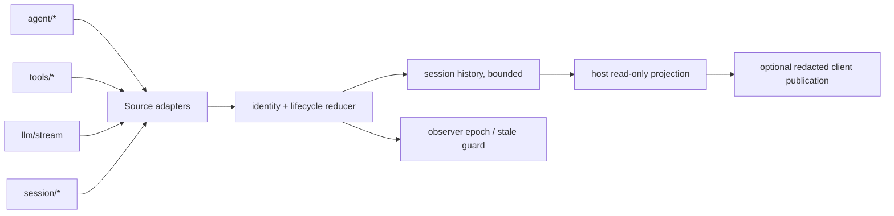

# Stage 2 - Design

> **公共契约现状注（2026-08-29 追加）**：本制品成文于目标领域树 cutover 之前，文中的公共 path 为旧命名。现行命名以 [`public-contract.registry.json`](../plugin-api-m7-public-contract-refactor/public-contract.registry.json) 的 `oldToTargetMapping` 为唯一权威，本制品涉及的映射如下：
>
> | 本制品使用的旧 path | 现行 path |
> |---|---|
> | `pluginApi.execution`（`observe/get/history/onChange/visibility/availability`） | `pluginApi.executions`（叶子名不变） |
> | `pluginApi.routing` | `pluginApi.llm.routing`（叶子 `forExecution`） |
>
> 现行契约基线：包版本 `0.1.0-rc.6-0.1.0`（runtime `0.1.0-rc.6` / `dsh.api` `0.1`）；本制品中出现的 `0.1.0-rc.6-0.x` 为历史交付边界记录，不代表现行版本。本注只更新命名与版本指针，不改动本制品已获批的 Goal / Requirements 验收边界。

## Status

Stage 2 Design 已获批并落地（3278b5c），进入 Stage 3 Tasks；Stage 3 Tasks 已获批（663e7ec）；Stage 4 已完成（b7626af）并合入 M6 Wave C（merge dc1a7cd / 12c6ce0）。

## Overview

`execution-observation` 是 host-first 的 B 类 facade projection。它把现有公开的 `agent/*`、`tools/*`、`llm/stream` 和 `session/*` seam 归并为只读 `ExecutionProjection`，但不修改官方 agent loop、不把 event sequence 当作身份，也不提供 retry、route 或 durable mutation API。

`executionId` 由 plugin-api 在第一次能够证明逻辑操作边界时生成；内部 retry 只新增 attempt，外部再次触发则新建 execution。缺少稳定官方因果边界时，字段保持 unavailable，并在 provenance 中标明上游限制。

## Architecture



### Source and hook classification

| Semantic area | Mechanism | Boundary |
|---|---|---|
| agent/tool/LLM/session observation | 官方公开事件直接绑定 | B facade composition |
| execution identity、attempt、跨源归并 | 由 reducer 基于公开 payload 模拟 | B facade；不能证明的 parent/cause 标为 unavailable |
| 官方稳定 execution identity、完整 causal boundary | 不在当前公开 seam 可达 | C upstream proposal，不在本 feature 伪造 |
| cross-feature dispatch priority/freeze/fault containment | 复用现有 events bus | 不新增 R，不复制横切派发实现 |

Host 是唯一权威 owner；client 不创建、结算或改变 execution，只消费已提交快照。

## Components and Interfaces

### 1. Source adapters

每个 adapter 只读取其声明的公开事件/服务，并输出内部 `ObservationFragment`。adapter 记录 `sourceKind`、source identity（若官方提供）、observedAt、source event sequence（若有）和能力可用性。缺失服务只使该 source degraded，不关闭其他 adapter。

### 2. Identity and reducer owner

内部 reducer 维护 `executionByKey`、`attemptByKey` 和 owner-local generation。逻辑 key 只能使用可证明的 source identity、session/agent context 和明确的 start boundary；event sequence、时间戳和数组位置不得作为 identity。对同一 source fragment 的重复输入采用 deduplicate；不能证明同一 execution 时保留两个 projection，而不是合并猜测。

公开 projection 入口（概念接口）：

```js
pluginApi.execution.observe({ sessionId?, since?, signal? }) // disposer + committed snapshots
pluginApi.execution.get(executionId)
pluginApi.execution.history(sessionId, { limit, cursor? })
pluginApi.execution.onChange(listener) // read-only notification disposer
pluginApi.execution.availability           // read-only availability snapshot (EO-3 source availability)
pluginApi.execution.visibility.register(policy) // api-shape.md §1 policy face (EO-7); returns disposer
```

这些入口只返回深冻结快照。`observe` 的 disposer 只撤销本 observer 自己的 listener/epoch；不得清理其他 observer 或新 owner 的资源。

### 3. Lifecycle reducer

Reducer 按明确的 source precedence 合并 phase、attempt 和 terminal candidate。终态字段固定为 `outcome`，取 `success | error | aborted | denied | superseded`；`settled`、`closed`、`disposed` 只作为生命周期 metadata。单个 execution 的终态原子提交后，迟到事件只进入 bounded provenance/diagnostic，不可改写 outcome、phase 或 terminal timestamp。timeout 观察映射为 `outcome: 'error'` 并写入 `outcomeReason`，不引入独立 timeout outcome。最新有效观察时间（EO-2 AC1）取合并后各 source 已提交 observedAt 的最大值，随 projection 的 provenance 条目承载，不为此新增独立字段。

### 4. Host/client publication

Host publication 输出版本化、受众参数化的 snapshot。client publication（若已有 remote/slot 通道）只发布 `executionId`、phase、outcome、bounded provenance 和允许的 metadata；client 断线或版本不兼容只标记 unavailable/degraded，不在浏览器本地重建权威生命周期。当前 feature 不自建新的 client reconnect 协议。

## Data Models

```ts
type ExecutionProjection = Readonly<{
  executionId: string
  sessionId?: string
  agentId?: string
  parentExecutionId?: string
  cause?: Readonly<{ kind: string; id?: string }>
  start: { observedAt: string; sourceKind: string }
  phase?: string
  attempt: ReadonlyArray<{
    attempt: number
    // source-provided string attempt identity, if any; never used as execution identity
    attemptId?: string
    owner: string
    generation: string
    state: 'active' | 'settled' | 'stale'
    startedAt?: string
    endedAt?: string
  }>
  outcome?: 'success' | 'error' | 'aborted' | 'denied' | 'superseded'
  outcomeReason?: Readonly<{ category?: string; code?: string }>
  settled?: boolean
  closed?: boolean
  disposed?: boolean
  sourceAvailability: Readonly<Record<string, 'available' | 'degraded' | 'missing'>>
  provenance: ReadonlyArray<Readonly<{ sourceKind: string; seq?: number; observedAt: string; certainty: 'observed' | 'inferred' | 'unavailable' }>>
  observerEpoch: string
}>
```

History is session-scoped only. It is bounded and may return `truncated: true`, `nextCursor`, and unavailable source ranges; it must never present an incomplete history as complete.

## Concurrency, Cancellation, and Ownership

- Observer rebuilds use a new observer epoch. Every async read/reconciliation result checks owner id, epoch, execution generation, and non-terminal status before publication.
- AbortSignal requests stopping observation, but does not itself commit `aborted`; only an owner terminal observation does. Parent cancellation propagates to live child observation work; child failure does not change parent unless the source marks the child required.
- Same execution/source work uses `deduplicate`; unrelated executions may run `parallel`. A newer owner/generation is `latest-wins` for publication. No automatic retry is started by this feature.
- A stale callback may be retained as redacted diagnostic evidence, but cannot publish state, invoke a newer disposer, or create an attempt.

## Visibility and Redaction

Default projection is audience-specific: model/tool output excludes internal diagnostics; UI excludes secrets; logs contain bounded summaries. Non-secret fields may be exposed only through an explicit visibility policy and retain source, timestamp, scope and certainty. Prompt text, tool arguments, provider credentials, authorization material and raw error bodies are never included in the base projection. If classification or redaction fails, the field is omitted and the projection becomes `redacted/unavailable`.

The visibility policy face follows the `api-shape.md` §1 policy-registry contract: a single `visibility.register(policy)` entry, the policy is a pure function (inputs passed explicitly, no private state reads, no side effects), registration returns a disposer, and the policy carries an owner id + generation token; a policy throw only degrades that decision point to the default denial and never throws through apply. The policy face and the projection surface are independent owners and share no private state.

## Error Handling and Fail-Safe

Adapter throws, malformed payloads, reducer failures, listener failures and client publication errors are caught at their respective boundaries. The affected source or projection is marked degraded/unavailable, a bounded diagnostic is sent through the existing logger/diagnostic path, and `apply` returns normally. No observation error may alter provider/tool execution or throw through harness boot. Unsupported mutation requests (retry, route, checkpoint, task mutation) are rejected without side effects.

## Testing Strategy

Focused tests SHALL cover:

1. identity independence from event sequence, external-vs-internal retry, parent/cause unavailable semantics, and attempt numbering;
2. source composition with missing/partial adapters, duplicate fragments, concurrent tool/LLM observations, and exactly-once terminal outcome;
3. aborted, denied, superseded and timeout-as-error mapping, late callbacks, observer rebuild epochs, reconnect history deduplication, bounded/truncated history, and idempotent disposers;
4. deep immutability and audience-specific redaction, including secret-bearing payloads and redaction failure;
5. listener/reducer/apply failures remaining isolated, with no mutation API exposed;
6. client publication consuming host identity while remaining inert when unavailable or incompatible.

Acceptance evidence is limited to local public seam fixtures and headless/dev boot; it does not claim official runtime support beyond the audited seams.

## Requirements Coverage

| Requirement | Design coverage |
|---|---|
| EO-1 | identity/reducer owner, attempt model, unavailable parent/cause |
| EO-2 | lifecycle reducer and one-way terminal commit |
| EO-3 | four source adapters and partial-source degradation |
| EO-4 | bounded session history, observer epoch and immutable snapshots |
| EO-5 | cancellation distinction, stale guards and child ownership |
| EO-6 | host authority and optional redacted client publication |
| EO-7 | audience policy and fail-closed redaction |
| EO-8 | contained failures, session-only history and mutation rejection |

## Boundary and Non-Duplication

This design does not replace `pluginApi.routing`, `session durable observation`, `tokenMeter`, task/workflow APIs, or existing raw event catalog entries. Those remain their owners; this feature only provides a shared read-only execution correlation projection. New official execution events or an authoritative causal identity remain an upstream proposal.
