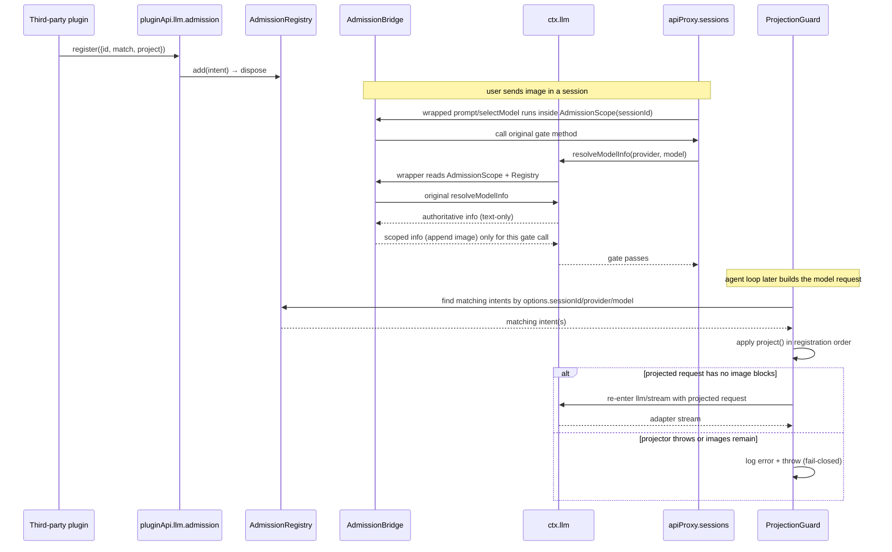

# Design: llm-image-admission

> **Historical supersession:** This design documents the pre-M2 L1 implementation and is
> not the current runtime authority. The delivered `plugin-api-llm-request-m2` supersession
> record replaces the old `project`/ProjectionGuard/admission-bridge wording with the
> constrained L2 policy and sole scoped `resolveModelInfo` wrapper. Keep this document for
> provenance; use the M2 design for implementation and API guidance.

## Overview

`llm-image-admission` 在 `dsh-plugin-api` 门面内提供第一个语义化钩子：**图片输入准入 + 投影强制执行**。第三方插件通过 `ctx.pluginApi.llm.admission.register(intent)` 注册一个 intent，其中包含：

- `match`：判断哪些会话/请求需要图片准入；
- `project`：一个**同步投影器**，负责把模型请求中的图片块替换/处理为文本模型可接受的形式。

门面承担两份责任：

1. **准入**：在 DeepSeek Harness 的 API 准入闸门处放行匹配的图片请求，同时**不把 `image` input modality 泄露给 `resolveModelInfo` 的其他消费方**。
2. **投影强制**：在 `llm/stream` 模型请求最后边界调用 `project` 并校验投影后无图片残留；投影抛错或残留图片时 **fail-closed**，绝不把像素漏给文本 API。

设计结论（来自源码调研）：

- 官方 `dsh-host-apiproxy` 的准入闸门在 `session.selectModel` 与 `session.prompt` 两个 RPC 方法内，都直接调用 `ctx.llm.resolveModelInfo()` 检查 `inputModalities`。
  - 源码位置：`dsh-host-apiproxy/lib/index.js:2686-2689`（selectModel）、`2843-2846`（prompt）。
- 官方 `dsh-llm` 没有准入/输入策略事件，只有 `llm/stream`（waterfall）和 `llm/adapters-updated`（emit）。
  - 源码位置：`dsh-llm/lib/index.js:929`、`1389`。
- 官方 `ctx.apiProxy` 是一个 Cordis 服务，`apiProxy.sessions.selectModel` / `apiProxy.sessions.prompt` 是普通对象方法，可作为运行时包装边界。
  - 源码位置：`dsh-host-apiproxy/lib/index.js:5587` 附近（`ApiProxyService` 提供 `ctx.apiProxy`）、`2473`（`sessions` 对象）。
- 官方 `GenerateOptions` 携带 `sessionId`（loop 写入，用于 request routing），因此门面可以在 `llm/stream` 边界把请求关联回 admission intent。
  - 源码位置：`dsh-llm/lib/types/types.d.ts:312-360`。

因此本 feature 采用 **B 类模拟 + C 类提案**：

- **B 类**：包装 `apiProxy.sessions.selectModel` / `apiProxy.sessions.prompt` 建立“准入作用域”，再包装 `llm.resolveModelInfo`，仅在作用域内追加 `image`；同时监听 `llm/stream`，在模型边界执行并校验投影。
- **C 类**：向上游提议官方 `llm/admission` 事件，payload 包含 session/request 上下文；该事件就位后，隐藏包装可退役。

---

## 钩子引出机制（本仓库必填）

| 钩子/能力 | 类型 | 引出机制 | 失败路径与 guard 策略 |
|---|---|---|---|
| `ctx.pluginApi` 服务 | 门面基础 | `ctx.plugin(PluginApiService)` 注册为 Cordis 服务（不用 fiber ctx 上不可用的 `ctx.service()`） | guard 失败时仍注册 inert 服务（`isActive: false`）；仅当 `ctx.plugin` 本身缺失时无法注册服务，只能写日志并正常 return |
| `pluginApi.llm.admission.register(intent)` | B 类 | 门面内部注册表；真正的官方缺口是准入事件 | 非法 intent（缺 `match`/`project`、非法 id、重复 id）抛带 code 的 `AdmissionIntentError`；`match` 抛错按 no-match 处理并限流 warn |
| 图片准入生效 | B 类 | 包装 `apiProxy.sessions.selectModel` / `sessions.prompt` + `llm.resolveModelInfo`，用 `AsyncLocalStorage` 限定作用域 | `apiProxy` 缺失/形状不符 → 不安装 admission bridge，记录 warn；`resolveModelInfo` 缺失 → 核心 guard 失败 |
| 投影强制执行 | B 类 | 监听官方 `llm/stream`（A 类事件），在模型边界调用 `intent.project` 并断言无图片残留 | `project` 抛错或投影后仍含图片 → log error + throw（fail-closed）；无匹配 intent → 直通 |
| 包装链安全 | B 类 | identity-guard dispose，同 dsh-read-image A1 加固模式 | 若目标已被其他插件包装，本包装降级为透传，不拆别人的链 |
| 官方 `llm/admission` 事件 | C 类 | 文档提案，不实现 | 上游就位后迁移：保留公开 API，移除内部包装 |

---

## Packaging and row order

本 feature 的加载形态来自 `AGENTS.md` 第 1 节与第 2 节的既有约定，设计在此明确其制品：

- **包名**：`@deepseek-ai/dsh-plugin-api`。
- **`package.json`**：
  - `"type": "module"`；`main`/`exports` 指向 `lib/index.js`。
  - `dsh.bundle.patch: "./cordis.patch.yml"`（DSH 插件安装时据此把本插件作为一行 entry 注入 profile）。
  - `peerDependencies`：`@deepseek-ai/cordis`、`@deepseek-ai/dsh-llm`（与 harness 共享同一实例；写成普通 dependencies 会造成实例分裂）。
- **`cordis.patch.yml`**：
  - insert row：`id: plugin-api`、`name: '@deepseek-ai/dsh-plugin-api'`、`config: {}`。
- **Row 顺序要求（硬约束）**：本插件必须在第三方插件之前加载。因为 `pluginApi` 服务在本插件 `apply` 期间注册，第三方插件 `inject: ['pluginApi']` 时服务必须已经存在；顺序颠倒会导致第三方插件 pending 并杀死 boot。该要求与 `AGENTS.md` 第 2 节第 2 条一致。

---

## Architecture

```mermaid
flowchart LR
    Client["Web client"] -->|session.prompt / session.selectModel| AP["ctx.apiProxy.sessions"]
    AP -->|wrapped| W["AdmissionScope.run(sessionId)"]
    W -->|original call| GATE["official prompt/selectModel"]
    GATE -->|calls| RM["ctx.llm.resolveModelInfo"]
    RM -->|wrapped| BR["AdmissionBridge.resolveModelInfo wrapper"]
    BR -->|in scope & intent matches & text-only| ORIG["original resolveModelInfo"] --> RESULT["info + image modality"]
    BR -->|otherwise| ORIG
    REG["AdmissionRegistry"] --> BR
    API["ctx.pluginApi.llm.admission.register()"] --> REG
    LOOP["agent loop builds request"] --> STREAM["llm/stream waterfall"]
    STREAM -->|wrapped guard| PG["ProjectionGuard"]
    PG -->|matching intents| REG
    PG -->|apply project() then verify no image| ADAPTER["adapter dispatch"]
    PG -->|projector throws or images remain| FAIL["fail-closed: throw, do not forward"]
```

关键路径：



---

## Components and Interfaces

### 1. Host plugin (`lib/index.js`, planned)

- `export const inject = ['llm', 'agents']`：只注入核心服务；`apiProxy` 通过 `ctx.get('apiProxy')` 可选获取，**绝不加入 inject**（headless 等 profile 可能不挂载 apiProxy，注入会造成 pending 并杀死 boot）。
- `export const name = 'dsh-plugin-api'`。
- `apply(ctx)` 流程：
  1. 跑 `checkHostEnvironment(ctx)`（guard）。
  2. 创建 `AdmissionRegistry`（纯逻辑实例）。
  3. 注册 `PluginApiService`（`ctx.plugin()`），并根据 guard 结果设置 `isActive`：
     - guard 通过 → 后续安装 bridge，`isActive` 由 bridge 安装结果决定；
     - guard 核心失败 → 仍注册 inert 服务（`isActive: false`），然后 `writeGuardLog()` + `guardFailNotice()` + `return`（不安装 bridge / ProjectionGuard）。
     - 唯一例外：若 `ctx.plugin` 本身缺失（核心失败项之一），无法注册服务，只能写日志并正常 return。
  4. guard 通过时，可选获取 `apiProxy`；形状完整则安装 `AdmissionBridge`，否则记录 **warn** 并跳过 admission 生效（服务仍注册，`isActive === false`，register 可用但不会改变行为）。
  5. guard 通过时，安装 `ProjectionGuard`（监听 `llm/stream`）。
  6. 所有 `ctx.effect` 注册 dispose 恢复逻辑。

### 2. `ctx.pluginApi` 服务（`PluginApiService`）

服务名：`pluginApi`（Cordis Service）。第三方插件 `inject: ['pluginApi']` 后访问：

```ts
type PluginApi = {
  llm: {
    admission: {
      register(intent: ImageAdmissionIntent): () => boolean
      readonly isActive: boolean  // 门面是否成功安装 admission bridge
    }
  }
}
```

约束：

- 服务构造 `super(ctx, 'pluginApi')`，通过 `ctx.plugin(PluginApiService)` 注册。
- guard 核心失败但 `ctx.plugin` 可用时，服务仍注册为 inert 状态（`isActive === false`），第三方插件拿到的是“功能未激活”的明确信号，而不是服务缺失错误。
- `isActive === false` 时，`register()` 仍可调用（保持 API 稳定），但门面不会改变任何官方行为，并返回一个恒为 `false` 的 no-op dispose。
- `register(intent)` 委托 `AdmissionRegistry`，返回 `() => boolean`：内部就是 `() => registry.dispose(id)`，第一次调用返回 `true`，重复调用返回 `false`。
- 本 feature 不暴露 `resolveModelInfo` 变更能力；未来若做 `llm/model-info` 只读查询 API，另行 spec。

### 3. `AdmissionRegistry`（纯逻辑，`lib/admission.js` planned）

职责：保存 intent、按 id 去重、执行匹配、按顺序取 projector。不 import 任何 Cordis/harness 模块。

```ts
type ImageAdmissionIntent = {
  id: string
  match: (ctx: AdmissionMatchContext) => boolean
  project: (options: GenerateOptions) => GenerateOptions
}

type AdmissionMatchContext = {
  sessionId: string | undefined
  agent: unknown       // ctx.agents.get(sessionId) 的结果；可能为 undefined
  provider: string
  model: string
}
```

行为：

- `register(intent)`：
  - 校验 `id` 为非空字符串，否则抛 `AdmissionIntentError('INVALID_ADMISSION_ID')`。
  - 校验 `match` 为函数、`project` 为函数，否则分别抛 `AdmissionIntentError('INVALID_ADMISSION_INTENT')` / `AdmissionIntentError('PROJECTOR_REQUIRED')`。
  - 重复 `id` 抛 `AdmissionIntentError('DUPLICATE_ADMISSION_INTENT')`。
  - 成功返回 `() => dispose(id)`（即返回 `boolean` 的 dispose 包装）。
- `matches(ctx)`：**同步**调用每个 intent 的 `match`；任一返回 `true` 即整体匹配（OR 语义）。`match` 抛错、返回 Promise/thenable 或非布尔值 → 记录一条限流 warn（**每个 id 每 30s 最多一次**），该 intent 按 `false` 处理，不打断其他 intent。
- `matchingProjectors(ctx)`：返回所有 `matches(ctx)` 为真的 intent 的 `project`，按注册顺序排列；供 ProjectionGuard 使用。该方法也是同步的，与 `llm/stream` waterfall 的同步约束一致。
- `dispose(id)`：移除并返回是否移除成功（`true` 表示本次移除成功）；不存在时返回 `false`；重复调用返回 `false`。

### 4. `AdmissionBridge`（隐藏包装，`lib/admission-bridge.js` planned）

内部组件，不通过 `ctx.pluginApi` 暴露。职责：

1. 保存 `originalResolveModelInfo = llm.resolveModelInfo.bind(llm)`。
2. 创建 `AsyncLocalStorage<AdmissionScope>`：

   ```ts
   type AdmissionScope = {
     sessionId: string | undefined
     kind: 'selectModel' | 'prompt'
   }
   ```

3. 包装 `apiProxy.sessions.selectModel` 与 `apiProxy.sessions.prompt`：
   - 从 `request.payload.sessionId` 取出 `sessionId`。
   - 在 `AdmissionScope` 内调用原方法，原方法的异步 continuation 继承该作用域。
4. 包装 `llm.resolveModelInfo`：
   - 无作用域 → 原样透传 `originalResolveModelInfo`。
   - 有作用域 → 先调用原方法拿权威 info；仅当 **同时满足** 以下条件才追加 `image`：
     1. `info.inputModalities` 是数组且不含 `'image'`（官方 gate 对 `undefined` 本来就是放行，不画蛇添足）；
     2. `registry.matches({ sessionId, agent: ctx.agents.get(sessionId), provider, model })` 为 `true`；
     3. 追加返回 `{ ...info, inputModalities: [...info.inputModalities, 'image'] }`，**不修改原 info 对象**。
   - 其他情况原样返回权威 info。
   - **原方法抛错时，包装后必须原样 rethrow 同一个错误对象**，不 catch、不 mask、不替换。
5. `isActive` 标志与 dispose：
   - 用 identity-guard 恢复 `llm.resolveModelInfo`、`apiProxy.sessions.prompt`、`apiProxy.sessions.selectModel`。
   - 若目标方法已被后续插件包装，不拆链，而是把自身降级为透明透传并 warn（与 dsh-read-image A1 加固一致）。

### 5. `ProjectionGuard`（模型边界投影强制，`lib/projection-guard.js` planned）

内部组件。职责：

1. 导出纯函数 `applyProjectors(options, projectors, hasImage)`：
   - `projectors` 为同步函数数组；`hasImage` 为注入的**请求级**图片检测器（生产环境传 `createRequestHasImage(dshLlm.contentHasImage)`，测试可注入请求级替身）。
   - 按数组顺序对当前 `options` 依次执行 `projector`。
   - 每次执行后立即 `hasImage(result)` 检查：一旦为 `false` 就返回该结果并停止。
   - 任一 projector 抛错 → 直接 rethrow（由 listener 记 error 后 fail-closed）。
   - 全部执行完仍含图片 → throw `AdmissionProjectionError`（由 listener 记 error 后 fail-closed）。
   - 该函数是纯逻辑，不 import Cordis，不碰 `this`。
2. 通过 `ctx.on('llm/stream', listener)` 监听官方 A 类事件。
3. listener 逻辑（**同步**，waterfall 不 await）：
   - 若 `options` 无 `messages` 数组，或请求不含图片块 → `return next()`。
   - 若 `options.sessionId` 为空 → `return next()`（无法关联会话，不投影、不放宽）。
   - 用 `registry.matchingProjectors({ sessionId, agent: ctx.agents.get(sessionId), provider, model })` 取匹配 projectors。
   - 无匹配 → `return next()`。
   - 有匹配 → `const projected = applyProjectors(options, projectors, hasImage)`：
     1. 成功且 `projected !== options` → `return this.stream(projected)`（重入 waterfall，与 dsh-read-image A2 同款收敛模式；重入后本 listener 看到无图请求会直通）。
     2. `applyProjectors` 抛错 → `ctx.logger.error(...)` + rethrow（fail-closed，不转发、不重入死循环）。
4. 图片检测使用官方导出的 `contentHasImage`（`@deepseek-ai/dsh-llm`），与 harness 的 gating/serialization 共用同一 walker。`contentHasImage` 是逐 content 的检测器，而 ProjectionGuard 处理完整请求对象，因此生产环境通过 `createRequestHasImage(contentHasImage)` 将其适配为请求级 detector；该 wrapper 对无法解析的 content 形状 fail-closed（视为有图）。

### 6. Guard（`lib/guards.js` planned）

`checkHostEnvironment(ctx)` 逐项探测：

| 契约 | 缺失/失效时的处置 |
|---|---|
| `ctx.plugin` 为函数 | 核心失败：无法注册服务 |
| `ctx.llm.resolveModelInfo` 为函数 | 核心失败 |
| `ctx.agents.get` 为函数 | 核心失败 |
| `dshLlm.contentHasImage` 为函数 | 核心失败（投影校验依赖它） |
| `ctx.get('apiProxy')` 返回对象且 `sessions.prompt` / `sessions.selectModel` 为函数 | 可选失败：admission bridge 不安装，记录 warn（headless profile 正常；ProjectionGuard 仍可监听 `llm/stream` 但无 admission 生效时通常直通） |
| `AsyncLocalStorage` 可用 | 核心失败（Node 24 恒有，防御性保留） |

失败模式（G1 对齐，并满足 R1.3）：

- 写 `~/.dsh/logs/dsh-plugin-api-guard.log`（覆盖写，路径恒定）。
- 前台只打一条双语提示，包含日志路径。
- 核心失败但 `ctx.plugin` 可用时：注册 inert `pluginApi` 服务（`isActive === false`）后正常 return；不安装 bridge、不安装 ProjectionGuard。
- 仅当 `ctx.plugin` 本身缺失：无法注册服务，写日志并正常 return（此时 harness 服务机制本身已损坏，属唯一例外）。
- 测试开关：`DSH_PLUGIN_API_FORCE_GUARD_FAIL=1` 强制失败路径；`DSH_PLUGIN_API_GUARD_DISABLE=1` 跳过 guard（自担风险）。本 feature 不引入 settings 命名空间（settings 桥在后续 feature）。

---

## Data Models

```ts
// 公开 API
type PluginApi = {
  llm: {
    admission: {
      register(intent: ImageAdmissionIntent): () => boolean
      readonly isActive: boolean
    }
  }
}

type ImageAdmissionIntent = {
  id: string
  match: (ctx: AdmissionMatchContext) => boolean
  project: (options: GenerateOptions) => GenerateOptions
}

type AdmissionMatchContext = {
  sessionId: string | undefined
  agent: unknown
  provider: string
  model: string
}

// 内部
type AdmissionScope = {
  sessionId: string | undefined
  kind: 'selectModel' | 'prompt'
}

type LlmResolvedModelInfo = {
  inputModalities?: readonly string[]
  // ...其余字段原样透传，门面不重新定义
}
```

约定：

- `register()` 返回的 dispose 是 `dispose(id)` 的包装：`() => boolean`；第一次调用返回 `true`，之后返回 `false`。
- `project` 必须同步；这是 `llm/stream` waterfall 的硬约束（异步 listener 会断裂）。
- 门面不持久化 intent；插件 dispose 或进程退出即失效。
- 多个 intent 匹配同一请求时，projector 按注册顺序执行；全部执行后仍有图片块即 fail-closed。

---

## Error Handling

| 场景 | 行为 |
|---|---|
| guard 核心失败 | 写 `~/.dsh/logs/dsh-plugin-api-guard.log`；前台双语提示；若 `ctx.plugin` 可用，注册 inert `pluginApi`（`isActive: false`）后正常 return；不安装 bridge / ProjectionGuard |
| guard 核心失败且 `ctx.plugin` 缺失 | 写日志 + 前台提示 + 正常 return（唯一无法注册服务的例外） |
| `apiProxy` 缺失（如 headless） | `pluginApi` 服务仍注册；`admission.isActive === false`；`register()` 返回恒 `false` 的 no-op dispose；日志级别 **warn** |
| `register()` 收到非法 id | 抛 `AdmissionIntentError('INVALID_ADMISSION_ID')`；不产生部分注册 |
| `register()` 收到缺/非法 `match` | 抛 `AdmissionIntentError('INVALID_ADMISSION_INTENT')`；不产生部分注册 |
| `register()` 收到缺/非法 `project` | 抛 `AdmissionIntentError('PROJECTOR_REQUIRED')`；不产生部分注册 |
| `register()` 收到重复 id | 抛 `AdmissionIntentError('DUPLICATE_ADMISSION_INTENT')`；不产生部分注册 |
| 单个 intent 的 `match()` 抛错、返回 thenable 或非布尔值 | 按 no-match 处理，warn 限流（每个 id 每 30s 最多一次）；不打断其他 intent 或 admission 调用 |
| `project()` 抛错 | ProjectionGuard `logger.error` 后 rethrow 同一个错误；原请求不转发 |
| `project()` 返回后仍含图片块 | ProjectionGuard `logger.error` 后 throw `AdmissionProjectionError`；原请求不转发 |
| 包装的原方法抛错 | 原样 rethrow 同一个错误对象，不 catch、不 mask（原方法错误语义保持不变） |
| dispose 时发现被其他插件包装 | 不还原该边界；将自身包装降级为透传并 warn；其他插件的链保持完整 |
| 重复 apply / HMR | 包装函数带 `Symbol.for('dsh-plugin-api.llm-image-admission')` 标记；发现已有标记则不再嵌套包装，避免无限叠加 |

---

## Testing Strategy

进入 Execute 阶段后使用 `node --test`，纯函数模块零 harness 依赖。

| 测试文件（planned） | 覆盖内容 |
|---|---|
| `test/admission-registry.test.mjs` | 注册/去重/dispose 幂等；非法 id；缺 `match` / `project`；重复 id 的 code；多 intent OR 语义与 projector 顺序；`match` 抛错按 false 处理且限流 30s |
| `test/admission-bridge.test.mjs` | 用 mock `llm` + mock `apiProxy.sessions` 安装 bridge：scope 内文本路由追加 image；scope 外完全透传；原生 image 路由不修改；`inputModalities` 为 undefined 不添加；dispose 恢复；重复安装不嵌套；被其他包装后 dispose 不拆链；**原方法抛错时包装后 rethrow 同一个错误对象** |
| `test/projection-guard.test.mjs` | 纯函数 `applyProjectors`：按注册顺序、无图即停、projector 抛错 rethrow、全部执行后仍含图抛 `AdmissionProjectionError`；listener 集成：有匹配且含图 → 调用 projector 并重入；无匹配 → 直通；无图 → 直通；多 projector 顺序 |
| `test/guards.test.mjs` | 核心契约缺失 → 报告问题且不抛错；`apiProxy` 缺失 → 只标记可选失败；`contentHasImage` 缺失 → 核心失败；`DSH_PLUGIN_API_FORCE_GUARD_FAIL=1` → 强制失败路径；guard 失败但 `ctx.plugin` 可用 → 服务以 `isActive: false` 注册 |
| 迁移验收（自动化脚本，Execute 阶段） | 改 `dsh-read-image` 的 A1 为 `ctx.pluginApi.llm.admission.register({ match, project })`；其 A2 投影逻辑交给门面执行；headless 冒烟 OK；dev boot HTTP 200 |

自动化测试必须覆盖 Requirements 中的关键反例：

- 无 intent 时官方行为逐字节等价（R2.5、R3.3）。
- 有 intent 时 `resolveModelInfo` 的非准入消费方不看到 `image`（R3.2）。
- 投影失败 fail-closed，不转发含图请求（R4.3、R4.4）。
- guard 失败时 apply 正常返回，且消费方拿到 `isActive: false` 的 inert 服务而非服务缺失（R1.2、R1.3）。
- dispose 链安全（R5.2）。

---

## 明确不做（本 feature 范围外）

- 不实现 client 插件 / 浏览器 bundle。
- 不实现 settings 可视化配置桥。
- 不实现完整事件 API（`emit/serial/parallel/waterfall` 的稳定门面）——本 feature 只做 admission 注册 API。
- 不实现 `llm/request` 同步转译、`exec.route`、session 上屏 helper。
- 不提供 `resolveModelInfo` 的公开变更 API。
- 门面不替插件决定投影内容（`[Image #N]` 还是其他形式），只负责调用插件提供的 `project` 并校验结果。
