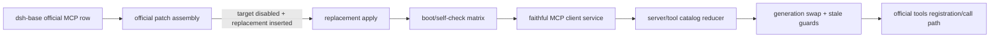

# Stage 2 - Design

## Status

Stage 2 Design 草案，待用户确认。

## Overview

`mcp-catalog-lifecycle` is an R-class replacement owned exclusively by the official component package `@deepseek-ai/dsh-mcp-client`, locked to the audited runtime/package identity `0.1.0-rc.6` and source directory `packages/mcp/mcp-client`. The replacement disables the official loader row `mcp-client` and inserts one replacement row `plugin-api-mcp` through the supported patch mechanism.

The replacement first reproduces the complete observed official host `ctx` service/event behavior, then adds a read-only catalog and lifecycle capability for server/tool generations. It does not replace the official package import face, `dsh-tools`, boot, Cordis dispatch, route policy, budget policy or browser client.

## Architecture



### Official evidence and hook classification

The audited package provides stdio and streamable HTTP transports, unique `serverName`, paginated `tools/list`, fetch-before-swap synchronization, public/raw name mapping and deterministic hash, raw-name `tools/call`, timeout/AbortSignal, reconnect/generation and old-tool cleanup on disconnect/dispose/exhaustion. These are preserved by direct vendored replication of the locked official host implementation (R2), not reimplemented as a second facade.

The added catalog/lifecycle events and immutable projection are replacement-owned host behavior (R capability slice). No current client evidence exists: no `dsh.client` manifest, remote namespace, slot/settings bridge, host/client negotiation, browser state/reconnect or client-facing event/service. Therefore the current design is host-only. Any future official identity that turns one of those six checks positive requires a new Requirements/Design audit and R8 client build/HMR verification before client replacement is enabled.

## Components and Interfaces

### 1. Patch and boot self-check

The auxiliary package supplies a patch equivalent to:

```yaml
- id: mcp-client
  disabled: true
- insert:
    - id: plugin-api-mcp
      name: '@deepseek-ai/dsh-plugin-api-mcp'
```

Apply inspects loader composition, target disabled state, replacement active state, duplicate insertion, component owner marker, runtime full identity, official package identity/version and replacement manifest version. On mismatch it logs a bounded diagnostic and returns normally; it never silently runs both rows. The replacement only publishes its added catalog when self-check and post-registration contract probes pass. Direct imports of `@deepseek-ai/dsh-mcp-client` still resolve to the official package.

### 2. Faithful official service owner

Vendored code preserves accepted config/transport shape, scrubbed child environment, server uniqueness, reconnect limits/backoff, startup failure option, disposal/HMR, logger/error boundary, paged list, atomic fetch-before-swap, schema fallback, output/error conversion, timeout and AbortSignal semantics, and old-generation cleanup. Public official methods, payloads, timing, return and disposer/error identity are not changed. Extension code is confined to the MCP component row.

### 3. Catalog projection

Conceptual replacement-owned host interface:

```js
ctx.mcpCatalog.servers({ includeUnavailable? })
ctx.mcpCatalog.tools({ serverName?, generation? })
ctx.mcpCatalog.resolvePublicName(publicName)
ctx.mcpCatalog.onChange(listener) // immutable server/tool snapshots
```

Records are projection-only: callers cannot register/unregister tools through this surface. Query parameters (`includeUnavailable?`, `generation?`) are read-only filters and never trigger registration, unregistration, resync or any other side effect. Server records expose identity, lifecycle state, connection generation, timestamps, transport kind without secrets, availability reason and provenance. Tool records expose `(serverName, rawName)`, public name, description, schema availability/fallback, generation and provenance.

The main facade may expose the same read-only projection as `pluginApi.mcp` when the replacement marker is active. The replacement-owned `ctx.mcpCatalog` service and its `mcp/catalog-changed` notification are the authoritative host owner; the facade does not maintain a second catalog.

### 4. Synchronization and invocation guard

Per-server synchronization is serialized or guarded by `latest-wins`. Pagination drains all cursors into a candidate set; validation and tool registration complete before publishing a new generation. `list_changed` or explicit resync creates a new owner-local generation. Calls capture server/tool generation and raw name at start. Disconnect, dispose, exhaustion or replacement invalidates the old generation; pending calls settle according to observed unavailable/error/aborted cause and cannot publish into the new generation.

### 5. Catalog slice and upstream retirement

The main facade may expose a catalog metadata slice only while this replacement marker and loader state prove the replacement is active. The slice uses existing events-bus freeze/fault containment and does not fork that cross-cutting implementation. Governance registers a U-series proposal for official MCP catalog/lifecycle events. Retirement begins when the official component offers equivalent generation, list-change, availability, identity and stale-cleanup semantics; consumers then migrate to the official seam and the replacement stops publishing duplicate semantics after deprecation.

## Data Models

```ts
// Resource-lifecycle vocabulary only; `superseded` is an execution-outcome/generation term
// and is never written into `lifecycleState`. A replaced generation is represented as
// `unavailable` (with reason code/provenance) or `disposed`, per the official
// "explicitly unavailable or superseded" requirement, so stale generations are never advertised.
type LifecycleState = 'pending' | 'available' | 'unavailable' | 'disposed'

type ProvenanceSource = 'config' | 'sync' | 'list_changed' | 'reconnect'

type ServerRecord = Readonly<{
  serverName: string
  lifecycleState: LifecycleState
  generation: string
  transport: 'stdio' | 'streamable-http' | 'unknown'
  observedAt: string
  reason?: Readonly<{ code: string; category?: string }>
  provenance: Readonly<{ source: ProvenanceSource; certainty: 'observed' | 'inferred' }>
}>

type ToolRecord = Readonly<{
  identity: Readonly<{ serverName: string; rawName: string }>
  publicName: string
  generation: string
  description?: string
  inputSchema: 'available' | 'fallback' | 'unavailable'
  outputSchema: 'available' | 'fallback' | 'unavailable'
  lifecycleState: LifecycleState
  provenance: Readonly<{ source: ProvenanceSource; observedAt: string }>
}>
```

Public names follow the official `mcp__<server>__<raw>` normalization and deterministic identity-derived disambiguator. Invocation always uses the stored raw name for the captured generation; public names are never heuristically parsed. Catalog snapshots are deeply frozen and do not include credentials, headers, raw environment, private command arguments or unbounded MCP content.

## R1-R9 Compliance and Boundaries

- **R1/R4/R9:** only official patch assembly; boot self-check is fail-safe; no boot/framework replacement.
- **R2/R3:** complete official `ctx` service/event face is reproduced before extension; package import face remains official.
- **R5/R6:** runtime/package identity matrix and one owner for `@deepseek-ai/dsh-mcp-client`; conflicts, active target row, missing ids and duplicate rows fail closed.
- **R7:** U-series upstream proposal plus explicit retirement condition are registered with this feature.
- **R8:** current six-step client audit is all negative; host-only replacement has no client bundle. A future positive check requires a new approved design.

MCP catalog owns external server/tool identity only. Progressive discovery, generic tools exposure, usage budgets, route/retry policy, Web UI and diagnostics are separate features. No durable MCP record is introduced in this design; if a later revision adds one, it must choose exactly one `session`, `workspace` or `profile` scope and carry identity, generation, commit state and stale guards.

## Concurrency, Cancellation, and Ownership

- Per-server sync is `latest-wins` with serialized candidate publication; independent servers run `parallel`.
- A pending call combines the caller AbortSignal with the replacement's generation/disconnect signal. Abort is not assumed to be a terminal success/failure until the call settles; deadline remains `error` with timeout reason.
- Every list page, schema result, call result and cleanup callback checks component owner, server generation, replacement row and resource identity. Stale results are discarded and may be retained only as bounded diagnostics.
- Disposers are idempotent and identity-bound: an old server disposer cannot unregister a newer generation's tools or invoke a newer owner's cleanup.
- Reconnect follows the preserved official bounded retry policy; this feature never starts an unbounded retry or merges separate external call identities.

## Visibility and Redaction

Default model-facing catalog includes public tool identity, schema availability and bounded lifecycle reasons only. UI/debug and logs omit transport headers, credentials, environment secrets, private command arguments and raw server stderr/content. If a value cannot be safely classified, it is omitted and the server/tool state is redacted/unavailable. The replacement does not expose a secret policy or mutate another feature's visibility state.

## Error Handling and Fail-Safe

Transport, pagination, list notification, schema, registration, call and cleanup errors are isolated to the server/generation where possible. A failed candidate leaves the last valid generation untouched or marks the server unavailable according to the preserved official path; partial generations are never advertised. Self-check or version mismatch disables only this replacement capability and preserves unrelated main facade features. The preserved official `failOnStartupError` configuration remains authoritative for its configured startup behavior; replacement code never throws beyond that official contract.

## Testing Strategy

Focused tests SHALL cover:

1. patch composition, target disable/insert, duplicate owner detection, runtime/package identity mismatch, post-registration contract probes and fail-safe no-double-run;
2. official contract parity for transports, server uniqueness, reconnect/disposal/HMR, startup failure option, paginated list, fetch-before-swap, schema/result/error mapping and timeout/AbortSignal;
3. catalog server/tool snapshots, public/raw identity, deterministic collision disambiguation, schema fallback, unavailable/superseded cleanup and deep immutability;
4. list_changed and racing resyncs, stale page/schema/call results, disconnect during pending call, bounded reconnect and idempotent disposers;
5. redaction of headers, credentials, environment, private arguments and raw content, plus listener/error containment;
6. six negative client-surface checks and a regression fixture that requires a design revision if any check becomes positive.

Verification is local to the locked runtime/package evidence and host boot fixtures. It does not claim compatibility with an un-audited official version or a browser MCP surface.

## Requirements Coverage

| Requirement | Design coverage |
|---|---|
| MC-1 | faithful official service owner and parity tests |
| MC-2 | server/tool projection and immutable catalog records |
| MC-3 | paginated candidate sync, list-change serialization and atomic publish |
| MC-4 | raw/public identity, normalization and schema fallback |
| MC-5 | call generation capture, cancellation and stale-result guard |
| MC-6 | `mcp-client` patch, self-check and fail-safe no-double-run |
| MC-7 | runtime/package matrix and component-level unique owner |
| MC-8 | six negative client checks and future re-audit trigger |
| MC-9 | U-series proposal and retirement condition |
| MC-10 | bounded redaction, per-server failure containment and scope boundary |

## Upstream Proposal and Retirement

The Design registers the missing official public MCP catalog/lifecycle seam as a U-series proposal. Retirement is triggered only by an official contract that covers generation identity, paginated/list-change synchronization, availability transitions, raw/public tool identity, stale cleanup and equivalent failure semantics. Until then, the replacement remains the sole component owner and must not expand across other official packages.
