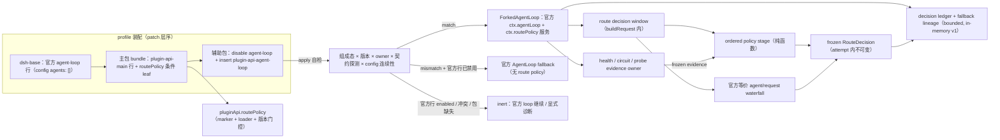

# Stage 2 - Design

> **公共契约现状注（2026-08-29 追加）**：本制品成文于目标领域树 cutover 之前，文中的公共 path 为旧命名。现行命名以 [`public-contract.registry.json`](../plugin-api-m7-public-contract-refactor/public-contract.registry.json) 的 `oldToTargetMapping` 为唯一权威，本制品涉及的映射如下：
>
> | 本制品使用的旧 path | 现行 path |
> |---|---|
> | `pluginApi.routePolicy`（`policy/candidates/health/circuit/decisions/availability`） | `pluginApi.llm.routing`（policy 叶子改复数 `policies`） |
> | `pluginApi.routing` | `pluginApi.llm.routing`（叶子 `forExecution`） |
>
> 现行契约基线：包版本 `0.1.0-rc.6-0.1.0`（runtime `0.1.0-rc.6` / `dsh.api` `0.1`）；本制品中出现的 `0.1.0-rc.6-0.x` 为历史交付边界记录，不代表现行版本。本注只更新命名与版本指针，不改动本制品已获批的 Goal / Requirements 验收边界。

## Status

Stage 2 Design 已批准，Stage 2 已完成。Stage 1 Requirements（`requirements.md`）已由用户确认；本设计不包含实现代码，可进入 Stage 3。

## Overview

`model-route-policy` 以 **R 类 replacement bundle** 落地：辅助包 `@deepseek-ai/dsh-plugin-api-agent-loop`（源码 `packages/agent-loop/`，row id `plugin-api-agent-loop`）经官方 patch 机制禁用官方 `agent-loop` 行并插入唯一替代行。替代行 vendored-fork 官方 `@deepseek-ai/dsh-agent-loop@0.1.0-rc.6` 的 `lib/index.js`（1295 行，MIT，保留出处），完整复刻官方 `ctx.agentLoop` 服务契约（`AgentLoop` service、`create/createAgent/resume`、config-driven agents、`installSettingsSection('agent-loop')`、provider/model/cwd system-prompt variables、`ReactLoopAgent` driver、全部 `agent/*` 事件与失败时序、cancellation/teardown/disposal），再在官方 `agent/request` 决策边界增加 route policy capability slice：有序策略注册、health/circuit/probe 证据、attempt 内不可变 route decision 与 fallback lineage。

主包在替代标记成立时条件性暴露新顶层命名空间 `pluginApi.routePolicy`；`pluginApi.routing`（已交付的冻结 composite）保持不动；`pluginApi.services.agentLoop`（SV21 官方直通）继续指向同一 `ctx.agentLoop` 服务。**未安装辅助包、替代行未 active、版本失配或 owner 冲突时，`pluginApi.routePolicy` 不可用，官方 agent loop 行为与旁路消费者完全不受影响。**

本设计把 route 决策定义为**一次 route window 内唯一、不可变的结果**：window = `(sessionId, turn, attemptEpoch)`；首个 `agent/request` 决策点收敛并冻结 route，window 内后续步骤复用；官方 `agent/request-error` 的 `retry` 动作或 `recovery-policy` 授权的新 fallback attempt 打开新 attemptEpoch，才允许重评。这一 interpretation 是对 MR-2（attempt 内 route 不可变）与 MR-1（保留官方 waterfall 派发）的显式调和，见 Decision Points D1。

## Architecture



### Source and hook classification

| Semantic area | Mechanism | Classification |
|---|---|---|
| official `ctx.agentLoop` contract | vendored fork 逐段保留官方实现 | R（R2） |
| `agent/request` 决策点 | 官方 waterfall 在 fork 内原样保留，前插有序 policy stage、后冻结 decision | R capability slice（事件面为官方等价） |
| `agent/request-error` | 官方 waterfall 原样保留；`retry` 动作推进 attemptEpoch 并链接 fallback lineage | R slice 观察 + 官方语义保留 |
| health/circuit/probe | 替代行新增 component-local evidence owner（见 C5） | R capability slice |
| execution/attempt correlation | 消费 `execution-observation` 的公开投影（`get/history/observe`），不代造 identity | B interop |
| budget evidence | 消费 `usage-budget-telemetry` 的公开投影（`query/budget.observe`） | B interop |
| modality admission evidence | 消费 `llm` admission 的公开投影/显式输入；不拥有 admission | B interop |
| prepared-route / pre-flight seam | 仍不可达，维持 U3 proposal | C（本 feature 不伪造） |
| 官方 route-policy/health/fallback seam | 当前不存在 | C / U11 upstream proposal |

## Components and Interfaces

### C1. Auxiliary package and patch assembly

`packages/agent-loop/`：

- `package.json`：`name: @deepseek-ai/dsh-plugin-api-agent-loop`；`version`/`dsh.api` 与主包完全一致；`dsh.bundle.patch: ./cordis.patch.yml`；`peerDependencies` 镜像官方 `dsh-agent-loop`（`dsh-agent`、`dsh-llm`、`dsh-session`、`dsh-scope`、`dsh-session-persistence`、`dsh-system-prompt`、`dsh-tools`、`dsh-settings`、`dsh-invariants`、`cordis`），并固定 `@deepseek-ai/dsh-agent-loop: 0.1.0-rc.6`（仅 identity 校验与 fallback 实例化）；`dependencies`：`@deepseek-ai/schemastery`（与官方相同）。
- `cordis.patch.yml`：

  ```yaml
  - id: agent-loop
    disabled: true
  - insert:
      - id: plugin-api-agent-loop
        name: '@deepseek-ai/dsh-plugin-api-agent-loop'
        config:
          agents: []
  ```

  insert config 写死官方 base 默认值（`dsh-base/cordis.patch.yml:436-439`），使替代行在官方行缺席时也能独立激活；用户对官方 `agent-loop` 行的自定义 config 落在已禁用行上，由 config 连续性解析接管（见下方自检步骤 4）。
- `lib/apply.js`：入口 `{ name, inject: ['loader'], apply }`；apply 永不抛穿；自检矩阵通过才注册 fork，任何失败 = 结构化诊断 + 正常 return。
- `lib/forked-loop.js`：vendored 官方 `dsh-agent-loop/lib/index.js`，文件头注明出处与 MIT，增量全部标记 `// replacement patch:`。官方段（RuntimeContextProjection、executeToolCalls、ReactLoopAgent、FactoryOwnership、AgentLoop 生命周期、settings、config-driven agents）不改行为；patch 只落在 `buildRequest` 的 route decision 边界与 `AgentLoop` 构造的 routePolicy 装配。
- `lib/route-policy.js`：纯函数/零 harness 依赖：decision input 构造、策略收敛、frozen decision、circuit 状态机、probe 边界、fallback lineage 链接、redacted 错误构造。
- `lib/invariant.js`：**不注册官方包名 invariant**。官方 `dsh-agent-loop/invariant` companion 的官方装配（按官方清单装载时）继续注册官方包名；其 loop-built request 冻结/重建校验对 fork 产出的 request 依然生效——fork 必须保持 request 构造（`markAgentLoopRequest(deepFreeze({...}))`）与官方逐字段一致，否则 invariant 失败本身就是 boot/运行期 fail-loud 信号。本包不重复占用该 identity。

### C2. Boot self-check and fail-safe matrix

`apply(ctx)` 顺序执行：

1. **组成态探测**：`agent-loop` 与 `plugin-api-agent-loop` 条目状态；官方行 enabled → inert（官方 loop 继续，绝无 route policy slice）；重复替代行/竞争 owner → inert。
2. **owner 冲突探测**：`ctx.get('agentLoop')` 已存在且不携带本包契约符号 → inert，绝不覆盖。
3. **identity matrix**（精确比较，含 prerelease）：runtime 全量 `0.1.0-rc.6`；`@deepseek-ai/dsh-agent-loop` 恰为 `0.1.0-rc.6`；本包与主包 full unique version / `dsh.api` 完全一致。
4. **config 连续性解析**：读已禁用官方行 `entry.options.config` 与 insert config，都用 forked 官方 Config schema 校验（`maxParallelToolCalls` 正整数、`agents` 数组、`sessionId/resumeSessionId` 互斥等）；**官方行 config 合法则优先采用**（保留用户自定义 agent 配置），否则回退 insert config 并 log 诊断；解析异常回退 insert config，不抛穿。
5. **契约探测**：实例化后验证 `ctx.agentLoop` 存在且 `config/create/createAgent/resume` 契约可调用；settings namespace `agent-loop` 已由 `installSettingsSection` 注册（经 settings 公开 probe，若可得）；`AgentLoop.static inject` 依赖（agents/sessions/llm/tools/systemPrompt）已解析；失败 → rollback 本行注册并 inert。
6. **mismatch fallback**：identity 失配但官方行已禁用/缺席且官方包可解析时，注册**官方 `AgentLoop`** 保留原始 loop 契约（route policy 关闭），显式诊断；官方行 enabled 时不注册（避免双跑）。

R3 边界：第三方 `import '@deepseek-ai/dsh-agent-loop'`（及 `./invariant`）仍解析官方包；本包只替换 loader row 的 ctx service/event 面。

### C3. Forked service and public service extension

替代行提供两个 Cordis 服务：

1. `ctx.agentLoop`：`ForkedAgentLoop extends official AgentLoop`（保留 `static inject`/`static Config`），实例设置 `Symbol.for('dsh-plugin-api.agent-loop.contract') = true`。
2. `ctx.routePolicy`：route capability slice 的权威 owner，冻结子对象：
   - `policy`（policy registry owner，见 C4）
   - `candidates`（candidate source registry owner）
   - `health`（health/circuit/probe evidence owner，见 C5）
   - `circuit`（只读 circuit projection）
   - `decisions`（只读 decision/lineage projection）

主包 `pluginApi.routePolicy` 只在该符号成立、loader 状态为替代行 active、辅助包版本与主包一致时挂载并委托到 `ctx.routePolicy`；否则 inert surface（`availability: 'unavailable'` + typed error）。主包不 import 辅助包（沿用 compaction-events 契约符号模式）。

### C4. Route decision point and policy registry

**C4.1 Decision window and stability（MR-2）**

- fork 在 `ReactLoopAgent` 上维护 `routeWindow = { sessionId, turn, attemptEpoch }`。turn 边界重置 attemptEpoch；官方 `agent/request-error` waterfall 返回 `{kind:'retry'}` 时 attemptEpoch+1；`recovery-policy`/官方 loop 授权的新 fallback attempt 到达时同样递增。
- execution/attempt correlation：decision 记录 `executionId/attemptId` 字段，值来自 `execution-observation` 公开投影（若 active 且可关联）；缺失时该字段 `unavailable` 并保留 provenance——route window identity 本身由 fork 生成，不冒充官方 execution identity。
- 每个 window 只提交一次 `RouteDecision`；提交后冻结。window 内后续 `buildRequest`（同 turn 后续 step）复用 decision；policy、health event、circuit transition 或任何 late callback 到达都不改写（MR-2）。
- 新 turn / 新 attemptEpoch 允许新 decision；fallback attempt 的 decision 记录 `fallbackParentId = 前一个 decisionId` 与分类 cause。

**C4.2 Policy stage（MR-3）**

```js
const dispose = ctx.routePolicy.policy.register({
  id, ownerId, generation,
  scope,                             // explicit match scope: { sessionId?, agentId?, provider?, model? }
  match(input) { /* pure */ },
  decide(input) { /* pure */ },     // → { action:'select', candidateId }
                                     // | { action:'reject', reason }
                                     // | { action:'no-op' } | Promise<同上>
  priority,                          // lowest|low|normal|high|highest|monitor（默认 normal）
})
```

- 注册返回幂等、identity-scoped disposer；旧 generation disposer 不删同 id 新注册。
- 确定性顺序：`priority` 升层（lowest→monitor），同层按注册序；每个 decision 每个 policy 至多调用一次。**收敛规则**：任一 `reject` 立即使 route 决策进入 denied（短路并记录）；多个 `select` 后者覆盖前者；`no-op` 不改选择；无 `select` 时使用官方 seed config（no-op 等价官方行为）。policy throw / rejected thenable / invalid 返回值 → 该 policy contained + bounded diagnostic，按“no-op”继续；全失败按 no-route 规则处理。
- decision input 显式传入且深冻结：`{ decisionId, windowKey, execution?, attempt?, candidates[], health[], circuit[], budget?, admission?, priorDecision? }`。policy 不读共享可变状态、不写 circuit/health、不创建 retry/probe/attachment projection（MR-3）。
- candidates 来源：官方 seed（`requestProposal`/agent options 精确复刻）+ `candidates.register({ id, ownerId, generation, list(input) })` 提供的候选；候选不含凭据，admission 状态由 evidence assembler 填充（`accepted|denied|unknown`）。

**C4.3 Waterfall parity and decision freeze**

fork 的 `buildRequest` 保持官方时序（MR-1）：

1. 按官方逻辑构造 `seedConfig`（`requestProposal`/`reasoningEffort`/`maxTokens` 与官方逐字一致）。
2. 构造 decision input 并运行 policy stage。
3. **denied**：提交 frozen denied decision，仍派发官方等价 `agent/request` waterfall（payload `{turn, step, signal}` + 正交 decision 字段，`next` 返回官方 seed）以保留事件时序，但**不采用任何 listener 返回、不调用 `prepareCall`、不发 provider 流量**，抛 typed `agent loop: no eligible route`（bounded reasons 随 `agent/error` 路径呈现）。该分支是新增的 no-route 失败路径，官方无对应状态（见 Decision Points D2）。
4. **非 denied**：派发 `agent/request` waterfall，`next()` 返回 policy 选择（或 seed）；waterfall 最终 proposal 经官方 provider/model 存在性校验后冻结为 committed decision（decision 记录非 secret request config、reason/source、observedAt）。
5. window 内后续 buildRequest：继续派发 `agent/request`（保留官方事件时序与 listener 运行），但实际请求使用 committed decision；waterfall 返回的 provider/model 与 committed decision 不同时**不应用**，记为 bounded `superseded` diagnostic（MR-2 对 late proposal 的约束，见 Decision Points D1）。

**C4.4 No-route / recovery boundary（MR-5）**

- route policy 不创建 attempt、不 retry、不 abort、不 fork；denied/no-route 是 decision 结果，后续动作（含新 fallback attempt 授权）归官方 loop 或 `recovery-policy`。
- budget/admission 拒绝的候选原因原样保留在 decision，不通过候选集外的“等价 route”绕过（MR-5）。

### C5. Health, circuit, and probe evidence（MR-4）

```js
ctx.routePolicy.health.observe(scope, outcome, evidence)     // health plugins 上报
ctx.routePolicy.health.registerCircuitPolicy({ id, ownerId, generation, scope, qualify, openAfter, reEvaluateAfterMs, probePolicy })
ctx.routePolicy.health.registerProbe({ id, ownerId, generation, scope, run })  // bounded probe runner
ctx.routePolicy.circuit.status(scope)                        // closed|open|half-open + reason/expiry
ctx.routePolicy.decisions.get(decisionId)
ctx.routePolicy.decisions.history({ sessionId?, executionId? }, { limit, cursor? })
```

- **evidence owner 与 policy 分离**：`health` 是 component-local mutation owner（观察记录 + circuit 状态机 + probe 调度）；`policy` 只消费 decision input 中的 frozen evidence 快照，不写 health/circuit；`circuit`/`decisions` 是只读 projection。三个面独立 owner，不共享私有状态（`api-shape.md`）。
- health evidence：`{scope: provider|model, source, observedAt, outcome, failureClass, reason}`；unknown/stale 不得表示为 healthy；policy 对无可靠证据的 scope 必须使用显式 unknown-state 规则。
- circuit：`closed → open` 由 registered circuit policy 在 qualifying failures 满足阈值时决定；`open → half-open` 仅进入受 `probePolicy` 限额约束的探测（并发上限、probe 数量上限）；`half-open → closed/open` 按探测结果。用户流量绝不 relabel 为 probe；probe 带独立 operation identity，不泄漏 prompt/凭据。
- probe success/fail/abort/supersede 按 policy 转状态；probe 结果不改写已提交 route decision（MR-4）。已提交 `aborted/superseded` 的 attempt 不启动新 probe（MR-6）。

### C6. Decision ledger（v1 bounded）

- decision ledger 为**进程内 bounded**（每 session 保留最近 N 条，超出显式 `truncated`），不是 durable record；重启后 route 审计仍以官方 session log 的 `request/header`/`request/context` 事件为准（官方已有 durable 证据）。durable lineage 归 U11 上游提案（Decision Points D3）。
- 每条 decision：`decisionId`、windowKey、execution/attempt correlation、provider/model、非 secret request config、reason/source、fallbackParentId、observedAt、`commitState: 'success' | 'denied'`。终态一次提交，迟到信号不改写。

### C7. Main facade leaf and gating

- `pluginApi.routePolicy`：`policy/candidates/health/circuit/decisions` 五 leaf + `availability()`；挂载条件同 C3 契约符号门控；否则 typed unavailable。
- `pluginApi.routing`（M2 冻结 composite）不修改；`pluginApi.services.agentLoop`（SV21）继续直通 fork 服务的官方成员。
- client-surface 判定（MR-9）：锁定身份审计记录六项阴性（无 `dsh.client` manifest、无 package-owned browser bundle、无 remote namespace、无 slot、无组件级 host/client 协商、无组件级 reconnect 状态）+ 一项阳性（官方 settings bridge 上的 `agent-loop` settings namespace）；替代行只复用官方 host settings bridge，不自建 browser bundle；官方未来身份新增 client 能力时必须重跑六项判定。
- 无新增 events catalog slice（route decision 经 `routePolicy.decisions` 与既有 `agent/*` 事件可见；如需新事件另立 spec）。

## Data Models

```ts
type RouteCandidate = Readonly<{
  candidateId: string
  provider: string
  model: string
  config: Readonly<Record<string, unknown>>   // non-secret request config
  admission?: Readonly<{ state: 'accepted' | 'denied' | 'unknown'; source?: string; observedAt?: string }>
  source: 'seed' | string                     // candidate source id
}>

type RouteDecision = Readonly<{
  decisionId: string
  windowKey: Readonly<{ sessionId: string; turn: number; attemptEpoch: string }>
  executionId?: string
  attemptId?: string
  provider?: string                  // commitState:'denied' 时为 undefined
  model?: string
  config: Readonly<Record<string, unknown>>
  candidates: ReadonlyArray<RouteCandidate>
  reason: Readonly<{ source: string; detail?: string }>
  fallbackParentId?: string
  commitState: 'success' | 'denied'
  observedAt: string
}>

type CircuitState = Readonly<{
  scope: string
  state: 'closed' | 'open' | 'half-open'
  reason?: Readonly<{ code: string; detail?: string }>
  openedAt?: string
  reEvaluateAfter?: string
  probeCount: number
  observedAt: string
}>
```

## Concurrency, Cancellation, and Ownership

- 并发策略：route window 内决策 `exclusive`（同 window 只一个 decision owner，重复 buildRequest 复用）；policy 评估在 decision 内串行；不同 window/agent `parallel`；circuit 状态迁移 `compare-and-swap`（open→half-open 受 probe 限额）；decision ledger append-only（终态前 `latest-wins` 不适用，终态后拒绝改写）。
- 取消与 stale：caller AbortSignal、agent disposal、attempt cancellation 传播到 policy stage、probe 与 evidence 读取（支持处透传）；所有晚到 policy/health/probe 结果提交前校验 `ownerId/generation/execution/attempt/window` 资格，失败只保留 bounded diagnostic（MR-6）。
- disposer：policy/candidate/circuit-policy/probe 注册 disposer 幂等且 identity-bound；旧 generation disposer 不删新注册；route 资源清理不触碰 policy/health 的新 owner 状态。

## Visibility and Redaction

默认：模型输出不暴露内部 circuit 诊断与凭据；UI/debug 只显示 route identity、provider/model、bounded reason、lineage；日志不含 API key 或完整请求 payload。显式 visibility policy 提升的非 secret evidence 保留 source/observedAt/uncertainty，避免把 stale evidence 当当前事实。redaction 失败 = 字段省略。

## Error Handling and Fail-Safe

policy/candidate/probe 抛错或 reject 均 contained（对应 decision 按 no-op/unknown 继续）；decision freeze、circuit 状态机、ledger、facade leaf 失败只影响本 capability 或该 decision；`apply` 自检失败按 C2 三态（inert / 官方 fallback / rollback），绝不与官方行双跑，绝不部分发布 `agentLoop` 或 routePolicy。out-of-boundary 请求（attachment mutation、billing、retry execution、approval bypass、boot mutation、跨组件 replacement）typed reject。

## Testing Strategy

Focused tests SHALL cover：

1. **official fork integrity**：vendored 文件与官方 `dsh-agent-loop/lib/index.js` 基线一致性；`AgentLoop` config/`create/createAgent/resume`、settings、systemPrompt variables、`ReactLoopAgent` 事件时序（inbox/pre-step/turn/step/request/request-error/turn-stopping/error/config-start-failed）、tool-call scheduler、teardown 与官方等价；官方 invariant companion 对 fork 请求的校验通过。
2. **patch/self-check**：disable+insert 装配、移除恢复、官方行 enabled 时 inert、owner 冲突不双跑、identity 失配 fallback 官方 loop 且 routePolicy 关闭、config 连续性（用户自定义 agents 落在禁用行仍生效）、rollback 不抛穿。
3. **decision window/stability**：turn/attemptEpoch 边界、window 内复用、retry/新 attempt 重评、late policy/health/circuit 回调不改写已提交 decision、waterfall listener 分叉被记为 superseded 且不应用（D1 语义）。
4. **policy registry**：确定性顺序与收敛（reject/select/no-op）、每 policy 至多一次、throw/thenable/invalid 收敛、显式输入无私有读、旧 disposer 隔离。
5. **health/circuit/probe**：unknown-state 规则、closed→open→half-open 状态机、probe 限额与独立 identity、probe 失败/abort/supersede、用户流量不冒充 probe。
6. **fallback lineage**：`agent/request-error` retry 与 recovery-policy 授权的新 attempt 链接 fallbackParentId、no-route 不发 provider 流量且不选未声明 route、budget/admission 拒绝原因保留。
7. **concurrency/redaction**：取消传播、stale guard、bounded ledger 截断、可见性默认脱敏、out-of-boundary reject。

Tests use local fixtures over the audited official seam；不声明官方 runtime 支持之外的路由语义。

## Requirements Coverage

| Requirement | Design coverage |
|---|---|
| MR-1 | C1/C3 vendored fork + C4.3 waterfall 时序/事件/失败语义逐项保留 |
| MR-2 | C4.1 window + immutable decision + correlation provenance |
| MR-3 | C4.2 ordered registry、确定性收敛、纯函数输入、containment、disposer |
| MR-4 | C5 health/circuit/probe evidence owner 与 policy 分离、unknown-state |
| MR-5 | C4.4 no-route/denied、fallback lineage、retry 边界、budget/admission 不绕过 |
| MR-6 | Concurrency 节取消传播、stale guard、aborted/superseded 不启动新 probe、disposer |
| MR-7 | C1 patch + C2 自检矩阵、rollback、fail-safe、R9 组件边界 |
| MR-8 | C2 identity matrix、mismatch 仅停用本 capability、R3 import 边界、owner 冲突 |
| MR-9 | C1/C2 settings `agent-loop` 等价保留、官方 settings bridge 复用、六项 client 判定 |
| MR-10 | C6 ledger/可见性、U11 登记、out-of-boundary reject |

## Decision Points (flagged for user review)

- **D1 in-window waterfall 分叉处理**：为同时满足 MR-1（`agent/request` 每 buildRequest 原样派发）与 MR-2（attempt 内 route 不可变），window 内后续步骤的 `agent/request` listener 若提议不同 provider/model，将被记录为 `superseded` 诊断且**不应用**于请求。这是对官方 A4 语义在已提交 window 内的有意收紧，属于已确认 Goal（attempt 内 route 不变）的直接推论；如用户希望 legacy listener 仍可逐步改 route，需回退 requirements 修订 MR-2。
- **D2 no-route 失败路径**：官方 `agent/request` 决策点位于 turn/step 已开始之后，因此 route policy 无法“避免创建 attempt”；no-route 时 fork 保留 waterfall 派发、不调用 provider、以 typed error 结束该 step。真正 attempt 之前的 pre-flight route seam 仍归 U3 proposal。
- **D3 decision ledger 非 durable**：v1 进程内 bounded；跨重启审计依赖官方 session log 的 `request/header`/`request/context`。若需要 durable route lineage，需另立 durable 记录 spec 或等待 U11。

## Governance Registration (on approval commit)

- **U11**：官方 agent-loop 有序 route-policy/health/fallback seam（确定性策略收敛、attempt 内不可变 decision identity、health/circuit/probe evidence、fallback lineage 一体契约）。注册于 `feature-list.md` §3，替代包为 current workaround。
- **退休条件**：官方 `dsh-agent-loop` 提供等价公开契约后，消费者迁移至官方 seam，替代包进入 deprecation/retirement。

## Boundary and Non-Duplication

不替换 launcher、`dsh-app-boot`、Cordis dispatch、`dsh-agent`、`dsh-llm`、settings 基础设施或任何其他官方组件；不覆盖官方 package import 面；不在 stream 中途换 model；不把 probe 当用户请求；不拥有 retry/attempt 创建/terminal outcome（归官方 loop 与 `recovery-policy`）；不重新实现 priority/deepFreeze/fault containment（继续复用主 facade 横切语义）。
