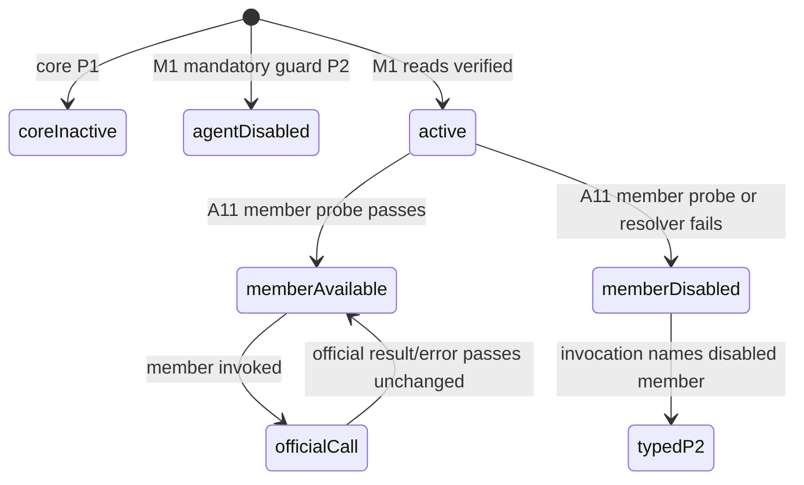

# Design: plugin-api-agent-create-m2

> feature_name: `plugin-api-agent-create-m2`
> 状态：已完成（Stage 4）
> 上游：`requirements.md`（Stage 1 已批准）、`plugin-api-agent-m1`、`plugin-api-m1-integration`
> 面：仅 host；不新增 client bundle、remote、codec、slot 或 settings bridge
> 分类：A11 全部公开成员均为 A 类官方 `AgentRegistry` 同参直通；无 B 类转译、事件 catalog slice 或 C 类 proposal

---

## Overview

A11 把 M1 的 `pluginApi.agent` 注册表读面扩展为一个分级的 host API：

```text
pluginApi.agent
  get(id) / list() / roots()                       // M1 read surface
  create(options) / resume(options) / register(agent) // consumer surface
  provider.enter(agent, owner)
  provider.announce(agent)
  provider.setFactory(factory)                     // advanced provider surface
  availability                                     // immutable A11 member matrix
```

A11 不创建或包装 Agent、factory、`AgentHandle`、disposer、session 或生命周期事件。每个
A11 member 在可用时只执行一次对应官方方法调用，并直接返回该调用的同步值、Promise 或
Cordis disposer。官方 `AgentRegistry` 保留 owner attribution、factory slot、store entry、
publication、rollback 和 teardown 的唯一所有权。

A11 的实现分成两个边界：

1. **A11-local adapter**：独立探测六个 A11 registry members，保存每 member capability
   state，产生 immutable availability snapshot，并将 facade call 解析到调用者 fiber 的
   traced `agents` service。
2. **coordinated agent-facade integration**：唯一拥有 `pluginApi.agent` 组合、disabled
   surface replacement、context-bound view creation、A11 与 exec-route extension 合并及
   activation rollback 的共享改动。A11 worktree 不独立重写当前 `mountAgentFeature()` 或
   `createDisabledAgentApi()` construction block。

第二个边界是并行协议要求的 integration issue，不表示 A11 是 B 类或依赖
`plugin-api-semantic-hooks-m2`。它的目的仅是防止两个 M2 feature 各自替换同一个
`pluginApi.agent` object，或在 cleanup effect 注册失败后留下局部已发布的 member。

---

## Official API Evidence

`@deepseek-ai/dsh-agent` 的公开 `AgentRegistry` 是 A11 的唯一行为源。运行时调研所得
结论如下；这些文件只作为调研依据，门面不得 import 其 module-private state。

| Official member | Official behavior preserved by A11 |
|---|---|
| `create(options)` | Reads the installed factory and invokes it through the caller's traced registry context. The official registry invocation returns its Promise for post-setup, rollback-covered publication and loop start. |
| `resume(options)` | Mirrors `create`, using the caller's traced registry context and the installed factory's resume entry. The official registry invocation returns its Promise. |
| `register(agent)` | Installs an effect in the calling fiber. Its generator performs `enter(agent, this.ctx.agent)`, then `announce(agent)`; it returns the exact effect disposer. |
| `enter(agent, owner)` | Inserts one exact, unpublished registry entry; rejects ID/session mismatch and duplicate IDs; returns an exact-entry idempotent detach closure. |
| `announce(agent)` | Requires the exact entered object, publishes `agent/created` only once, and defers an in-dispatch detach until synchronous creation publication unwinds. |
| `setFactory(factory)` | Installs one effect-scoped factory provider, rejects a second provider, and returns the exact effect disposer that clears the factory slot. |

The decisive Cordis fact is that a traced service method receives the consumer fiber context through
its service `ctx` shadow. Capturing `safeGet(hostCtx, 'agents')` inside the facade host mounter would
make all later A11 calls appear to originate from the facade host. It is therefore prohibited for
A11 consumer/provider calls. Every successful call must resolve `agents` from the context bound to
that particular `pluginApi` consumer view.

---

## Architecture

```mermaid
flowchart LR
  C[Third-party plugin fiber] --> P[traced pluginApi service view]
  P --> A[context-bound agent facade view]
  A --> R[resolve ctx.get('agents') once per call]
  R --> O[traced official AgentRegistry]
  O --> F[official factory / registry / lifecycle]

  M1[M1 read extension] --> I[coordinated agent facade composer]
  A11[A11 creation extension] --> I
  ER[exec-route extension] --> I
  I --> A
```



### A. Agent facade composition boundary

The coordinated M2 integration will replace the one M1 `agentApi = { get, list, roots }` literal
with a single context-bound composer. It is the only code permitted to assemble the public object.
Its conceptual contract is:

```ts
type AgentFacadeFactory = (consumerCtx: Context) => AgentFacade

type AgentFacade = {
  isActive: boolean
  get(id: SessionId): Agent | undefined
  list(): Agent[]
  roots(): Agent[]
  create(options: CreateAgentOptions): Promise<AgentHandle>
  resume(options: ResumeAgentOptions): Promise<AgentHandle>
  register(agent: Agent): () => void
  provider: {
    isActive: boolean
    enter(agent: Agent, owner: Agent | undefined): () => void
    announce(agent: Agent): void
    setFactory(factory: AgentFactory): () => void
  }
  availability: Readonly<AgentAvailability>
  // `routeOf(exec)` is added only by the separately approved exec-route integration.
}
```

The pluginApi service must expose this through a getter or equivalent Cordis-traceable accessor,
not a data property holding a host-captured plain object. When a third-party plugin evaluates
`ctx.pluginApi.agent`, the composer receives that third-party consumer context and creates the
corresponding view. The generated view may be fresh on each property read; no requirement promises
identity of the facade view itself. The only identity requirements apply to official inputs and
returns.

The composer owns these integration invariants:

- It includes M1 `get/list/roots`, every active A11 member, and later approved agent extensions
  without one extension reconstructing or dropping another.
- It retains declared disabled A11 members and provider keys, rather than silently omitting them.
- It creates P1/P2 disabled views before any official service resolution.
- It publishes a proposed agent extension only after the coordinator's activation transaction can undo that proposed extension and restore the exact prior composed view if cleanup registration fails.
- If a candidate A11 or later extension fails after the M1 base is already active, it leaves the established M1 reads, every pre-existing extension, and their registry state intact; only the candidate extension is removed or remains unavailable.
- It removes only the failed or disposed extension. A stale cleanup closure cannot remove an extension registered by a later active instance.

The integration may implement this with a named private extension registry and a composed factory,
or an equivalent atomic replacement mechanism. It must not add a public pluginApi namespace,
change M1 read semantics, or give A11 a separate top-level feature name. The exact integration
mechanism is a required coordinated M2 task because exec-route also contributes to `agent`.

### B. A11-local capability state

A11-local code exports an internal constructor conceptually equivalent to:

```ts
type AgentAvailability = {
  create: boolean
  resume: boolean
  register: boolean
  provider: {
    enter: boolean
    announce: boolean
    setFactory: boolean
  }
}

type AgentCreateExtension = {
  availability(): Readonly<AgentAvailability>
  createView(consumerCtx: Context): {
    create(options: CreateAgentOptions): Promise<AgentHandle>
    resume(options: ResumeAgentOptions): Promise<AgentHandle>
    register(agent: Agent): () => void
    provider: {
      isActive: boolean
      enter(agent: Agent, owner: Agent | undefined): () => void
      announce(agent: Agent): void
      setFactory(factory: AgentFactory): () => void
    }
  }
}
```

At A11 mount preparation, the adapter obtains the official registry only through a guarded
`ctx.get('agents')` read and probes these function properties without calling any of them:

```text
create, resume, register, enter, announce, setFactory
```

A missing registry during this A11-local probe, a throwing service/property access, or a non-function
member marks the affected A11 member unavailable. It does not alter the M1 read guard result,
`agent.isActive`, another A11 member, or another facade feature. The adapter records a single
redacted diagnostic keyed by `(agent, member, mount-probe)`.

The adapter stores each member's capability state privately. `agent.availability` and
`agent.provider.isActive` are getters over that state:

- `availability` returns an object with the exact stable shape from the requirements. Both the
  outer object and `provider` object are frozen; all leaves are booleans.
- `provider.isActive` is true exactly when `enter`, `announce`, and `setFactory` are all true.
- The availability table describes facade capability, not the dynamic official factory slot.
  A missing factory or occupied factory slot does not change any leaf.
- If a later facade-owned service-resolution/member-resolution failure occurs before an official
  method call, the adapter marks that one member unavailable, emits its one redacted
  `(agent, member, call-resolution)` diagnostic, and future availability reads show `false`.
  It does not retry the failed resolution implicitly or re-enable the member before a future
  coordinated remount.

No call-time path catches an error thrown by an already resolved official method. This separates a
facade resolution failure (P2) from an official no-factory, duplicate-ID, invalid-announce,
single-provider, setup, persistence, signal, rollback, or lifecycle error (passed through exactly).

### C. Context-bound official call path

For each available A11 member, the facade view uses the following ordered operation:

1. Resolve `consumerCtx.get('agents')` in a narrow guarded block.
2. Read and validate the named member in that same guarded block.
3. If resolution/member access failed, atomically mark only that member unavailable, report once,
   and throw `PluginApiFeatureDisabledError('agent', diagnostic)` before an official invocation.
4. Invoke the already-resolved official method exactly once with the traced registry as receiver
   and the exact supplied argument references.
5. Return the raw invocation result directly. Do not use `async`, `await`, `Promise.resolve`,
   `try/catch` around the invocation, or a wrapper disposer/handle.

Conceptually, the success path for a member is:

```js
const registry = resolveMember(consumerCtx, memberName)
return Reflect.apply(registry[memberName], registry, args)
```

`Reflect.apply` is used only to make the receiver explicit after guarded resolution; it does not
change inputs or outputs. For `create` and `resume`, the returned Promise is the exact Promise from
the traced official invocation. For `register`, `enter`, and `setFactory`, the returned function is
the exact Cordis effect/detach disposer. `announce` returns its official `undefined` result.

The same context-bound resolver is used for M1 registry reads when the coordinated composer is
introduced. Their existing direct-passthrough behavior is otherwise unchanged: no caching, sorting,
cloning, freezing, filtering, or new disposal capability.

### D. Public tiers

The composer constructs two intentionally different namespaces:

| Surface | Members | Design treatment |
|---|---|---|
| Consumer | `create`, `resume`, `register` | Direct methods on `pluginApi.agent`; recommended host plugin entry points. |
| Provider | `provider.enter`, `provider.announce`, `provider.setFactory` | Solely under `agent.provider`; advanced ordered lifecycle operations. |

No alias exposes provider primitives at `pluginApi.agent` level. The per-member P2 diagnostic names
the full member path, and for provider paths states that this is an advanced provider-only primitive.
A consumer-member diagnostic names the consumer surface. This is explanatory text on the existing
`PluginApiFeatureDisabledError('agent')`, not a new error class or a `services.*` P4 facade.

---

## Component Changes

### 1. `lib/agent-create-api.js` -- A11-local adapter (new)

A pure, zero-harness-dependency module. It accepts injected operations rather than importing DSH
modules:

```js
createAgentCreateExtension({
  probeRegistry,
  logger,
  active,
})
```

Responsibilities:

- evaluate and store the six independent A11 member capabilities;
- create frozen availability snapshots;
- create the consumer/provider method closures for one supplied consumer context;
- resolve a member with narrow containment before official invocation;
- deduplicate and redact adapter-owned diagnostics; and
- expose no public DSH objects beyond the direct official returns.

It does not call `ctx.effect`, `ctx.on`, `ctx.plugin`, `AgentHandle.dispose`, a returned disposer,
or an official A11 member during its own setup. It does not decide M1 feature state and does not
mutate an official Agent, Session, registry, factory, or event payload.

The local diagnostic set uses only safe keys such as `agent:create:mount-probe` and
`agent:provider.setFactory:call-resolution`. It logs a fixed category message through a safe logger;
it never includes Agent IDs, session IDs, options, factory source, raw error objects, or private
payload dumps. A missing or throwing logger is ignored.

### 2. Coordinated `lib/plugin-api-service.js` agent view refactor

This is an **integration-owned** change, not an independent A11 worktree edit. It replaces the
current data-property `this.agent = ...` lifecycle with a stored agent facade factory/extension
state and a traceable getter. The service keeps the existing `mountFeature('agent', api)` ownership
boundary, but the integration adapts that internal `api` from a fixed object to a context-bound
factory or a dedicated private agent-composer registration.

The disabled agent factory is extended to declare all A11 consumer and provider members plus the
all-false frozen availability table. Its methods check core inactive first, then throw the existing
`PluginApiFeatureDisabledError('agent')`. No disabled method invokes `ctx.get('agents')`.

When the agent feature is active but one A11 member is unavailable, only that closure throws P2 with
a named member diagnostic. The M1 reads and independently verified A11 members keep operating.

### 3. Coordinated `lib/index.js` agent mount integration

This is also integration-owned. The existing agent mounter will prepare:

- the M1 read extension;
- the A11 `createAgentCreateExtension` adapter; and
- any separately approved agent extension, including exec-route only at its own integration point.

It will pass these into the single agent composer and return an idempotent feature-owned disposer.
M1-required `get/list/roots` remain in the existing mandatory `runFeatureGuard('agent')` branch.
A11's six probes are deliberately not added to that fail-closed guard: they run as independent
A11-local member probes after the M1 guard passes.

The coordinated mount transaction must have this ordering:

```text
prepare base and extension state
  -> register feature cleanup / rollback capability
  -> publish composed agent facade view
  -> mark featureRegistry agent active
```

If cleanup registration or publication of a proposed A11 or later extension fails after the M1 base
is active, the transaction discards only that proposed extension and restores the exact prior composed
view. It retains M1 reads, every previously active extension, and their registry state; it does not
call `featureRegistry.disable('agent', reason)` for an extension-local failure. Whole-agent P2
remains reserved for a failure to establish the initial M1 base agent feature before an active agent
view exists. Neither case may disable `tools`, `events`, `llm`, `session`, or any other facade feature.
An already active `featureRegistry.isActive('agent')` returns the established no-op disposer and does
not reprobe, republish, or duplicate diagnostics.

The existing generic host currently publishes feature APIs before `ctx.effect` registration. The
coordinator must adjust the agent-specific transaction or the generic mount contract before this
feature is activated, and prove rollback in an apply-level test. This is recorded as the same
coordinated facade-activation issue required when exec-route first publishes a B facade member; it
is not an authorization for either worktree to rewrite the shared block alone.

### 4. `lib/guards.js` (no A11 branch extension)

A11 retains the M1 `agent` mandatory guard unchanged: `agents.get`, `agents.list`, and
`agents.roots` remain the sole conditions that determine whole-agent P2 disablement. The local
adapter's probe is called only after that guard has passed.

This deliberately avoids making an absent `enter` or `setFactory` turn a useful M1 registry read
surface into a global feature outage. It also makes factory-slot occupancy and a currently absent
factory call-time official conditions rather than guard conditions.

---

## Failure Handling

| Condition | Public result | Containment boundary |
|---|---|---|
| Core is inactive | P1 `PluginApiInactiveError` from every declared A11 member | Before registry resolution. |
| M1 `agents`/read guard fails | Whole agent P2 `PluginApiFeatureDisabledError('agent')` | Existing M1 disabled facade; no member resolution. |
| One A11 member fails its local probe | That member remains declared, availability leaf false, named P2 error on call | A11 adapter; M1 and other verified members remain active. |
| Registry/member cannot be resolved at call time | That member changes to unavailable, one redacted diagnostic, named P2 error | A11 adapter catches only resolution/member access. |
| Official A11 method throws or rejects | Exact original error/rejection/value/timing | Never caught or logged as facade failure. |
| No factory / factory slot occupied | Exact official call-time error | `create`/`resume`/`setFactory` remain available. |
| Returned handle/disposer invoked | Exact official teardown behavior | No facade wrapper, observer, or catch. |
| A11 adapter preparation/probe, candidate extension publication, cleanup registration, or later candidate cleanup fails after the M1 base is active | Remove or retain as unavailable only that A11 candidate; restore the exact prior M1/other-extension view, redacted diagnostic; `apply()` returns normally | Candidate extension transaction; no whole-agent P2 and no unrelated feature disablement. |
| Initial M1 base-agent activation cannot establish or publish an agent view | Whole-agent P2 agent view, redacted diagnostic; `apply()` returns normally | Initial feature transaction; no unrelated feature disablement. |
| Repeated same local degradation | No duplicate diagnostic | A11-local `(feature, member, phase)` diagnostic key. |

The design does not classify official creation/publication exceptions as fail-safe adapter failures.
The fail-safe rule protects host boot and facade-owned lifecycle work; it must not conceal official
lifecycle behavior from the plugin that initiated it.

---

## Lifecycle and Ownership Preservation

A11 owns only its extension state, availability flags, diagnostics, and its mount transaction. The
official registry owns every operation below:

- `create`/`resume` call the installed factory through the consumer's traced registry context;
- factory setup, Agent and Session construction, collision handling, cancellation, persistence,
  rollback, loop start, and `AgentHandle` lifetime;
- `register` effect ownership under the consumer fiber and its exact disposer nesting;
- `enter` store insertion, unpublished lifetime, exact-entry detach and deferred removal;
- `announce` one-time `agent/created` dispatch and its official synchronous-veto handling; and
- announced-entry teardown plus paired `agent/disposed` dispatch.

The adapter neither registers listeners nor emits lifecycle events. Existing M1 event catalog,
scope carrier, freeze, priority, fault policy, listener ordering, synchronous veto, and async
rejection behavior therefore continue to observe official dispatches exactly as direct callers do.

A bare Agent obtained through `get`, `list`, or `roots` remains an observation reference only. The
composer does not add a `dispose` function, does not retain an ownership-equivalent copy, and does
not infer teardown authority from that Agent.

---

## Parallel and Integration Contract

| Area | A11 worktree responsibility | Coordinated integration responsibility |
|---|---|---|
| `lib/agent-create-api.js` | Own local capability/forwarding adapter and its focused tests. | Import it into the composed agent view. |
| `lib/guards.js` | No shared agent-guard rewrite. | Preserve M1 guard and invoke local A11 probe only after it passes. |
| `lib/plugin-api-service.js` | Do not rewrite current agent construction. | Introduce the one context-bound composer and disabled view extension. |
| `lib/index.js` | Do not rewrite `mountAgentFeature()` during parallel delivery. | Perform one transaction-aware mount/composition change. |
| `pluginApi.agent.routeOf` | Do not add, remove, or implement it. | Merge it only from the independently approved exec-route design. |
| events bus/catalog/freeze | Do not edit. | Remain unchanged for A11. |

The coordinator must test the integrated facade with both A11 and exec-route extension registration,
then verify that removing or failing one extension does not remove the other. A11 introduces no
artificial runtime dependency on exec-route, semantic hooks, tools, or session.

---

## Testing Strategy

All tests use `node --test` and mock Cordis contexts/official registry doubles. No test boots a real
DSH harness. The suite is split so A11-local behavior is testable before coordinated integration,
while public facade and transaction behavior is verified only after the shared composition change.

### A11-local tests: `test/agent-create-api.test.mjs` (new)

- Each consumer/provider call forwards exact references and returns the exact registry result:
  Promise, `AgentHandle`, Agent, `undefined`, or disposer as applicable.
- Consumer-context resolution is explicit: registry doubles observe the consumer context rather than
  the facade-host context for `create`, `resume`, `register`, and `setFactory`.
- Official thrown/rejected values preserve identity and are not logged or converted.
- `register`, `enter`, and `setFactory` disposers are returned without wrapping; invoking them goes
  only to the official double. After probe or call-resolution containment has been exercised, the
  `AgentHandle.dispose()` returned by successful `create` or `resume` remains the exact official
  method and its invocation remains outside the adapter containment path.
- All six independent capability probes, including a throwing registry getter/property getter,
  produce the exact frozen availability matrix and preserve verified siblings.
- `provider.isActive` matches the three provider leaves only.
- Missing/occupied factory slots pass through as official call-time outcomes and do not change
  availability.
- A late resolver failure marks only its member unavailable, produces one redacted diagnostic, and
  does not retry or touch the official method; logger failure is inert.

### Coordinated facade tests

- Extend `test/plugin-api-service-agent.test.mjs` to assert the P1/P2 agent view declares all A11
  methods, provider members, and all-false immutable availability without touching official
  services.
- Extend `test/index-agent.test.mjs` with the active composed agent API, individual missing consumer
  and provider member cases, and preservation of M1 `get/list/roots` when A11 members are disabled.
- Add an ownership fixture that compares direct versus facade calls under equivalent traced consumer
  contexts, including registry effect ownership for `register` and `setFactory`.
- Add lifecycle doubles proving A11 itself produces no second register/enter/announce/dispose call;
  official `agent/created`, `agent/session-start`, `agent/disposed`, session events, order, scope
  carrier, rollback pairing, and M1 event-bus behavior remain those of the direct registry path.
- Add activation transaction tests: A11 candidate cleanup-registration failure, publication failure,
  and later candidate-cleanup failure restore the exact pre-transaction agent state (M1 reads and any
  active extension surface, or P2 only when that was the starting state); each failure is contained,
  logs at most one redacted diagnostic for its repeated identity, `apply()` never throws, unrelated
  features remain active, duplicate apply does not republish or reprobe, and stale cleanup cannot
  remove a later active composed view.
- Add integration coverage with the separately implemented exec-route extension: both sets of
  members remain present and a rollback/dispose affects only its own extension.

The complete repository `node --test` suite is the Stage 4 delivery gate.

---

## Requirements Coverage Matrix

| Requirements section | Design location |
|---|---|
| 1. Public surface and tiers | Overview; Architecture D; Components 2 |
| 2. `create` / `resume` | Official API Evidence; Architecture C; Lifecycle and Ownership |
| 3. `register` / disposer identity | Official API Evidence; Architecture C; Testing Strategy |
| 4. Provider ordered lifecycle | Official API Evidence; Architecture C/D; Lifecycle and Ownership |
| 5. Availability and fail-safe | Architecture B/C; Failure Handling; Components 1/3/4 |
| 6. Identity, errors, publication | Architecture C; Lifecycle and Ownership |
| 7. Parallel boundary | Architecture A; Parallel and Integration Contract |
| 8. Tests and documentation synchronization | Testing Strategy; Stage 4 tasks will update feature-list and AGENTS.md |

---

## Non-goals

- Reimplementing `AgentRegistry`, an Agent factory, an Agent loop, session setup, persistence,
  rollback, or lifecycle dispatch.
- Calling, wrapping, composing, observing, delaying, memoizing, or replacing `AgentHandle.dispose()`
  or any official registry/provider disposer.
- Capturing a host-fiber `agents` service for A11 method calls.
- Turning factory presence or provider-slot occupancy into facade availability state.
- Adding an `agent/*` event, event-catalog entry, synthetic lifecycle notification, B-class hook,
  route helper, client capability, remote contract, or settings bridge.
- Editing `/usr/lib/node_modules/@deepseek-ai/dsh/**`, importing official private runtime state, or
  independently rewriting the shared M1 agent facade construction during parallel delivery.
