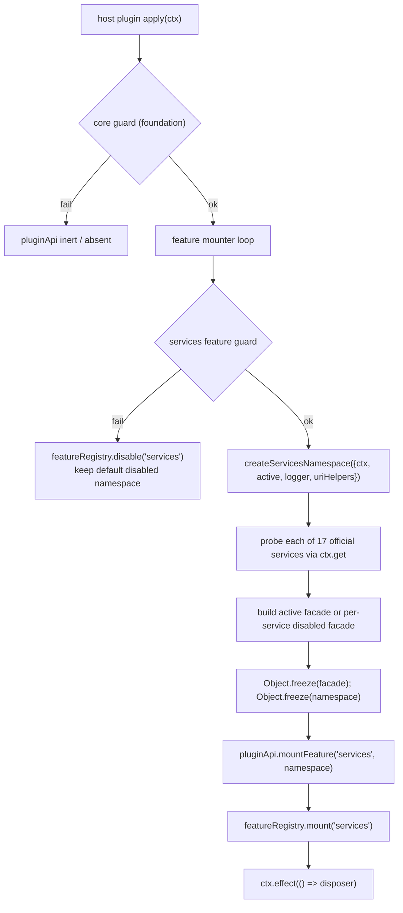

# Feature Design: plugin-api-capabilities-m1

## 1. Overview

`plugin-api-capabilities-m1` 在 `ctx.pluginApi.services.<name>` 下为 17 个官方 capability seam 服务提供稳定、类型化、fail-safe 的 **A 类直通**：

- **SV1–SV16**：官方已注册的 capability 服务直通；
- **SV18**：`agentDefaultModel` 默认模型选择服务直通。

设计目标与已确认需求（`requirements.md`）完全对齐：

1. `pluginApi.services` 是一个 **read-only namespace**，恰好 17 个键，不暴露 `compaction` 或任何越界服务。
2. 每个 `services.<name>` facade 对官方服务做 **1:1 直通**：同参数、同顺序、原样返回、错误原样传播，不包装、不缓存、不克隆 provider/callback/return value。
3. fail-safe 遵循 `plugin-api-foundation`：核心失效 → 门面 inert；`services` feature 整体失效 → 17 个 facade 全部 typed feature-disabled；单个官方服务缺失 → 仅对应 facade observably disabled（per-service degradation），apply 绝不抛穿。
4. SV14 只覆盖 `sessionTelemetry` 服务 seam；`session-telemetry/record` 事件已由 `plugin-api-events-m1` O16 交付，本设计不触碰任何事件。
5. SV15 按 Stage 2 裁决：`listCandidates` / `prepare` 走官方服务方法直通；`encodeSessionReferenceUri` / `decodeSessionReferenceUri` 走官方包公开导出转发。

**类型与引出机制总表**：

| 项目 | 机制 |
|---|---|
| SV1–SV16, SV18 服务直通 | **官方服务直接绑定**（`ctx.get(serviceName)` → 方法/只读 getter 1:1 委托） |
| SV15 URI helpers | **官方包公开导出转发**（`@deepseek-ai/dsh-session-reference` 的 `encodeSessionReferenceUri` / `decodeSessionReferenceUri`） |
| B 类模拟 / C 类提案 | 无（本 feature 全部为 A 类 + 门面基础，不安装任何事件钩子、不 monkey-patch） |

---

## 2. Architecture

### 2.1 架构图



### 2.2 设计决策（关键）

- **统一子对象**：`pluginApi.services` 是唯一挂载点（Stage 0 已确认）。facade 键名与 feature-list §2.11 的外部形状名一致（`workspaces`、`workflows`、`sessionReferences` 是门面键名，官方服务名分别是 `workspaceRegistry`、`workflowEngine`、`sessionReferenceResolver`）。
- **运行时不枚举官方对象属性**：每个服务的 facade 由静态 `SERVICE_DEFINITIONS` 表显式声明成员（method / getter / forwarded export）。这是为了满足 read-only 要求——facade 可以 `Object.freeze`，而官方服务对象**绝不能被 freeze**（会破坏官方状态与其它插件）。显式声明也避免把官方对象的私有字段、可变 config 字段泄漏给插件。
- **不包装、不缓存、不代理返回值**：方法委托直接 `target[member](...args)`，`this` 即官方服务对象；getter 委托直接 `target[member]`。官方返回什么，插件就拿到什么（identity 保留）。
- **per-service degradation**：`services` feature 的整体 guard 只检查通用原语（`ctx.get`）与「至少一个官方服务存在」；17 个服务各自独立 probe。单个服务缺失只把对应 facade 建成 disabled facade，其余 16 个保持 active。
- **可选成员**：官方为可选的成员（如 `sessionTelemetry.flush?`）仅在官方对象上实际存在时出现在 facade 上；不存在则不出现在该 facade，避免暴露一个永远 throw 的假方法。
- **可变官方字段不暴露**：如 `approval.config` 是官方公开可变字段，不在本 feature 的稳定直通面内。facade 只暴露方法、官方声明的只读 getter，以及 SV15 两个官方公开导出函数。

---

## 3. Components and Interfaces

### 3.1 新模块 `lib/services.js`

纯函数模块（零 harness 依赖），导出：

- `SERVICE_DEFINITIONS`：静态定义表（见 3.3）。
- `createServicesNamespace({ ctx, active, logger, uriHelpers })`：构建并返回 frozen namespace。`active` 是 `() => boolean`（核心是否 active），`uriHelpers` 是 `{ encodeSessionReferenceUri, decodeSessionReferenceUri }` 注入（便于测试替换）。
- `createDisabledServicesNamespace(active)`：为全部 17 个 key 构造 **feature 级** disabled facade 并返回 frozen all-disabled namespace；每个成员抛 `PluginApiFeatureDisabledError('services')`（feature 级错误串）。`lib/plugin-api-service.js` 用它构造默认 `this.services`，`createServicesNamespace` 的「全部服务缺失」回退也复用同一工厂。

伪代码接口：

```js
// 每个 facade 成员：
//   { kind: 'method', name }            => facade[name] = (...args) => service[name](...args)
//   { kind: 'getter', name }            => defineProperty get() { return service[name] }
//   { kind: 'forward', name, fn }       => facade[name] = (...args) => fn(...args)
//   { kind: 'method'|'getter', name, optional: true }
//     => 仅当 service[name] 存在时才挂到 facade

createServicesNamespace({ ctx, active, logger, uriHelpers }) -> {
  // 1. 若 ctx.get 不存在或全部 17 个服务缺失：返回 allDisabledNamespace
  // 2. 对每个 SERVICE_DEFINITIONS：
  //    - probe ctx.get(def.ctxService)
  //    - 成功 => buildActiveFacade(def, service, uriHelpers)
  //    - 失败 => buildDisabledFacade(def, active, reason)
  // 3. namespace = { [def.key]: facade }
  // 4. return Object.freeze(namespace)
}
```

- `buildActiveFacade(def, service, uriHelpers)`：
  - `facade = { isActive: true }`
  - 对每个 member 按 kind 挂载（`method` 用 `service[name]` 调用，`getter` 用 `Object.defineProperty`，`forward` 用注入的函数）。
  - `return Object.freeze(facade)`
- `buildDisabledFacade(def, active, reason, featureCode = 'services.' + def.key)`：
  - `facade = { isActive: false }`
  - 对每个 member 挂一个 `fail()`：先 `if (!active()) throw PluginApiInactiveError()`；再 `throw PluginApiFeatureDisabledError(featureCode, reason)`。
  - `return Object.freeze(facade)`
  - 调用约定：`createServicesNamespace` 的 per-service 降级使用默认 `featureCode`（`'services.<key>'`）；`createDisabledServicesNamespace(active)` 为每个 def 传入 `featureCode = 'services'`。

### 3.2 修改 `lib/plugin-api-service.js`

- 构造函数中新增默认 `this.services = createDisabledServicesNamespace(active)`：与 active 版本同构的 17 个 disabled facade（`isActive: false`，全部成员 throw typed error）。这样在 `services` feature 未挂载前，`pluginApi.services` 也稳定存在且 fail-closed。
- `mountFeature` 增加分支：

```js
if (name === 'services') {
  this.services = api
  return
}
```

### 3.3 修改 `lib/guards.js`

`runFeatureGuard` 增加 `services` 分支：

```js
if (featureName === 'services') {
  probe('ctx.get', 'capability services cannot be resolved', () => typeof ctx?.get === 'function')
  probe('capability services', 'none of the 17 official capability services is available', () => {
    if (typeof ctx?.get !== 'function') return false
    return SERVICE_DEFINITIONS.some((def) => ctx.get(def.ctxService) !== undefined)
  })
}
```

`SERVICE_DEFINITIONS` 从 `lib/services.js` 导入（`guards.js` 保持纯探测，不构建 facade）。单个服务缺失**不**作为 feature-level failure；它由 `createServicesNamespace` 做 per-service degradation。

### 3.4 修改 `lib/index.js`

- 新增 `mountServicesFeature({ ctx, service, featureRegistry, logger })`：
  1. 幂等：若 `service.services` 已带 facade brand（如 `service.services[servicesBrand] === true`），直接返回 `() => {}`。
  2. 构建 `uriHelpers`：从 `@deepseek-ai/dsh-session-reference` import 两个公开导出（仅这两个，不 import 任何私有符号）。
  3. `const namespace = createServicesNamespace({ ctx, active: () => service.isActive, logger, uriHelpers })`。
  4. `service.mountFeature('services', namespace)`。
  5. 返回一个 no-op 或轻量 disposer（facade 本身不持有官方 hook，通常无需清理）。
- `FEATURE_MOUNTERS` 增加 `['services', mountServicesFeature]`。
- 沿用现有 apply 流程：core guard → feature loop → `runFeatureGuard('services')` → mount → `featureRegistry.mount('services')`。

### 3.5 `package.json`

- `peerDependencies` 增加 `"@deepseek-ai/dsh-session-reference": "<与宿主一致的版本范围>"`（用于 SV15 URI helpers 的公开导出转发）。其余 16 个服务全部经 `ctx.get` 注入，不新增 import。

### 3.6 服务定义表（`SERVICE_DEFINITIONS`，设计期从官方 `.d.ts` 钉死）

图例：M = method（方法直通），G = getter（只读 getter 直通），F = forwarded export（官方公开导出转发）。

| # | facade key | 官方服务（ctx key） | 官方包 | 暴露成员 |
|---|---|---|---|---|
| SV1 | `fs` | `fs` | `dsh-fs`（服务定义，实现在 `dsh-fs-local`/`dsh-fs-sandbox` 等 backend） | G `sandboxMode`；M `resolve`, `processPath`, `fileUrl`, `contains`, `stat`, `lstat`, `readText`, `streamText`, `readBytes`, `listDir`, `writeText`, `editText` |
| SV2 | `codeRuntime` | `codeRuntime` | `dsh-code-runtime` | G `language`, `isolation`；M `run` |
| SV3 | `workspaces` | `workspaceRegistry` | `dsh-workspace` | G `archivedSessionIds`；M `create`, `get`, `list`, `delete`, `insertBefore`, `archiveSession`, `resolveByPath` |
| SV4 | `subagents` | `subagents` | `dsh-subagent` | M `startContinuable`, `followup`, `interrupt`, `reportFrom`, `registerContinuableSetup`, `drainContinuableDescendants`, `listChildren`, `listDescendants`, `registerProvider`, `getProvider`, `list`, `start` |
| SV5 | `workflows` | `workflowEngine` | `dsh-workflow` | M `start` |
| SV6 | `approval` | `approval` | `dsh-user-approval` | M `setPolicy`, `request`, `overrideOf`（`config` 为可变字段，不暴露） |
| SV7 | `userQuestions` | `userQuestions` | `dsh-user-questions` | M `registerProvider`, `ask` |
| SV8 | `attachments` | `attachments` | `dsh-attachment` | G `imageLimits`；M `validateImage`, `saveImage`, `readImage` |
| SV9 | `skills` | `skills` | `dsh-skill` | M `registerProvider`, `register`, `list`, `snapshot`, `get` |
| SV10 | `storage` | `storage` | `dsh-storage` | G `backend`, `domain`；M `mount`, `form` |
| SV11 | `sessionProjections` | `sessionProjections` | `dsh-session-projection` | M `register`, `onChanged`, `snapshot`, `checkpoint`, `restoreFloor`, `viewCheckpoint`, `restore` |
| SV12 | `sessionQuery` | `sessionQuery` | `dsh-session-query` | M `searchSessions`, `searchEvents`, `listSessions`, `readSession`, `filterSessions`, `readTitle`, `readTitleSnapshot`, `readTitleSnapshots`, `listEvents`, `filterEvents`, `readSurface`, `traceSession`, `traceEvent`, `readEvent` |
| SV13 | `sessionTitle` | `sessionTitle` | `dsh-session-title` | M `get`, `rename`, `refresh`, `register` |
| SV14 | `sessionTelemetry` | `sessionTelemetry` | `dsh-session-telemetry` | G `sharing`；M `emit`, `flush`(optional), `shutdown` |
| SV15 | `sessionReferences` | `sessionReferenceResolver` | `dsh-session-reference` | M `listCandidates`, `prepare`；F `encodeSessionReferenceUri`, `decodeSessionReferenceUri` |
| SV16 | `tokenMeter` | `tokenMeter` | `dsh-token-meter` | M `measure`, `estimateMessage` |
| SV18 | `agentDefaultModel` | `agentDefaultModel` | `dsh-agent-default-model` | M `currentSelection`, `saveSelection` |

> 上表成员全部来自各官方包 `lib/types/index.d.ts` 的公开服务类声明。feature-list §2.11 中 `fs.read/write/edit/observe`、`workspaces.attachSession`、`skills.collect` 等为草案示意名，设计期已按官方真实公开面修正 requirements AC。

---

## 4. Data Models

### 4.1 `ServiceDefinition`

```ts
type ServiceMember =
  | { kind: 'method'; name: string; optional?: boolean }
  | { kind: 'getter'; name: string; optional?: boolean }
  | { kind: 'forward'; name: string; fn: (...args: unknown[]) => unknown }

type ServiceDefinition = {
  key: string            // facade key，如 'fs'
  ctxService: string     // 官方服务名，如 'fs'
  pkg: string            // 官方包名，仅文档/诊断用
  members: ServiceMember[]
}
```

### 4.2 Facade 运行时形状

每个 `pluginApi.services.<key>` 是 frozen object：

```ts
type ServiceFacade = Readonly<{
  isActive: boolean
  // 该服务声明的 members，active 时为直通实现，disabled 时为 typed-error thrower
  [member: string]: unknown
}>
```

- `isActive === true`：成员直通官方服务/官方公开导出。
- `isActive === false`：每个成员调用时先判 `active()`（core inactive → `PluginApiInactiveError`），否则 `PluginApiFeatureDisabledError('services.<key>', reason)`。

### 4.3 Namespace 运行时形状

```ts
pluginApi.services: Readonly<{
  fs: ServiceFacade
  codeRuntime: ServiceFacade
  workspaces: ServiceFacade
  subagents: ServiceFacade
  workflows: ServiceFacade
  approval: ServiceFacade
  userQuestions: ServiceFacade
  attachments: ServiceFacade
  skills: ServiceFacade
  storage: ServiceFacade
  sessionProjections: ServiceFacade
  sessionQuery: ServiceFacade
  sessionTitle: ServiceFacade
  sessionTelemetry: ServiceFacade
  sessionReferences: ServiceFacade
  tokenMeter: ServiceFacade
  agentDefaultModel: ServiceFacade
}>
```

### 4.4 诊断记录

- feature-level failure：复用 `guards.js` 的 `featureFailNotice` + `writeGuardLog`，`featureRegistry.disable('services', reason)`。
- per-service failure：由 `createServicesNamespace` 调用注入的 `logger.error` 输出 `dsh-plugin-api capability service "<key>" unavailable; services.<key> disabled`，facade 的 `isActive` 同时为 `false`（observable）。

---

## 5. Error Handling

| 场景 | 行为 |
|---|---|
| 核心 inactive（`pluginApi.isActive === false`） | 任意 `services.<key>.<member>()` 先抛 `PluginApiInactiveError`，不触碰官方服务 |
| `services` feature 整体被禁用（feature guard 失败） | 默认 disabled namespace 的每个成员抛 `PluginApiFeatureDisabledError('services')`（feature 级错误串） |
| 单个官方服务缺失（per-service degradation） | 对应 facade `isActive === false`，其成员抛 `PluginApiFeatureDisabledError('services.<key>', reason)`（per-service 错误串）；其余 facade 正常 |
| 官方方法正常抛错/reject | **原样传播**，facade 不 catch、不 wrap、不 suppress（直通契约 AC 2.2） |
| 官方 getter 抛错 | 原样传播 |
| facade 构建过程抛错 | `mountServicesFeature` 内部 catch，feature 整体禁用并记录日志，apply 不抛穿 |
| `ctx.effect` 注册失败 | 与现有 mounter 相同：调用 disposer、`featureRegistry.disable('services')`、写日志 |
| 插件尝试改写 `services` 或 facade 属性 | frozen object 使 mutation 不可观察（静默失败/严格模式抛 TypeError 取决于运行时，但不产生可观察变化） |

所有 typed error 复用 `lib/errors.js` 的 `PluginApiInactiveError` / `PluginApiFeatureDisabledError`，不新增错误类型。

---

## 6. Testing Strategy

测试目录 `test/`，全部 `node --test`，mock Cordis context 与 mock 官方服务，**不 boot 真实 harness**。

| 测试文件 | 覆盖 requirements AC |
|---|---|
| `test/services-definitions.test.mjs` | §1 AC 1.2、§3–§19：`SERVICE_DEFINITIONS` 17 键、无 `compaction`、官方服务名映射、member kind 合法、SV15 forward 成员存在 |
| `test/services-namespace.test.mjs` | §1：17 键精确、无 `compaction`、namespace/facade frozen、facade `isActive` 可观察 |
| `test/services-passthrough.test.mjs` | §2–§19：对每个 `SERVICE_DEFINITIONS` 用 mock service 验证 1:1 委托（同参数、同 `this`、返回值 identity、错误原样传播、provider/callback 不包装）；getter 成员原样返回；SV15 URI helpers 调用注入的 `uriHelpers` |
| `test/services-disabled.test.mjs` | §1 AC 1.5 / AC 1.6：core inactive、feature disabled、单个服务缺失（只禁用该 facade，其余 16 个 active），并断言不调用官方服务 |
| `test/services-fail-closed.test.mjs` | §20 AC 6：`services.approval` 直通不新增/移除/软化 `allowed-once`、`rejected`、`cancelled`、`unavailable` 任一 outcome；`services.userQuestions` 直通不替换回答语义，保持官方 fail-closed 行为 |
| `test/services-optional-member.test.mjs` | 可选成员（`sessionTelemetry.flush?`）存在/缺失两种行为 |
| `test/plugin-api-service.test.mjs`（扩展） | 默认 disabled namespace 与 `mountFeature('services')` 挂载行为 |
| `test/guards.test.mjs`（扩展） | `runFeatureGuard('services')` 的 `ctx.get` 缺失、全部服务缺失、部分服务缺失判定 |
| `test/index-services.test.mjs` | apply 级 fail-safe：`mountServicesFeature` 抛错时 feature 禁用、apply 不抛、其余 feature 正常 |
| `test/package.test.mjs`（扩展） | §20 AC 7 + §3.5：peerDependencies 含 `@deepseek-ai/dsh-session-reference`、无新增运行时 dependencies、`dsh.api` 不变 |

测试中 `uriHelpers` 通过依赖注入替换为 mock，避免测试依赖官方包版本细节。

---

## 7. Requirements 覆盖对照

| requirements 章节 | 设计落点 |
|---|---|
| §1 namespace 与只读形状 | `lib/services.js` + `lib/plugin-api-service.js` |
| §2 通用直通契约 | `buildActiveFacade` 的 method/getter 委托规则 |
| §3–§19 各服务 | 3.6 服务定义表逐项声明成员 |
| §1 AC 1.5 / AC 1.6（fail-safe 与 per-service degradation） | `guards.js` services 分支 + `buildDisabledFacade` |
| §20 测试 | 第 6 节测试矩阵 |

## 8. 设计期 requirements 修正记录

Stage 2 源码调研发现 feature-list 草案中的四处「示意方法名」与官方真实公开面不一致，已按官方 `lib/types/index.d.ts` 修正 requirements AC（用户已对 SV15 裁决；其余三处为同类机械修正，随本 design 一并复核）：

1. SV1 `fs`：`read/write/edit/observe` → 官方方法 `resolve/processPath/fileUrl/contains/stat/lstat/readText/streamText/readBytes/listDir/writeText/editText` + `sandboxMode` getter。
2. SV3 `workspaces`：删除不存在的 `attachSession`，改为官方方法 `create/get/list/delete/insertBefore/archiveSession/resolveByPath` + `archivedSessionIds` getter。
3. SV9 `skills`：删除不存在的 `collect`，改为官方方法 `registerProvider/register/list/snapshot/get`。
4. SV15 `sessionReferences`：`listCandidates` + `prepare` 为官方服务方法；URI encode/decode 改为官方包公开导出转发。
