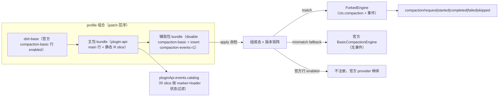

# Design: plugin-api-compaction-events-r1

> feature_name: `plugin-api-compaction-events-r1`
> 状态：Stage 2 草案（待用户批准；按用户指示不再调用子代理审查）
> 上游：`requirements.md`（Stage 1 已批准并按其最新指示修订：49 条编号 AC）、`AGENTS.md` §2.7/§4.6、`docs/capability-strategy.md` R1–R9
> 类型：R 类 replacement bundle；host-only。
>
> **维护修订（包政策推行）**：实现已按本 spec 的命名规范收敛到不含 `r1` 的运行时名（源码 `packages/compaction-events/`、row id `plugin-api-compaction-events`、feature `compaction-events`、契约符号 `dsh-plugin-api.compaction-events.contract`）。辅助包 `package.json` 与主包统一 `0.1.0-rc.6-0.5` / `dsh.api: 0.5`，apply 内校验自身与主包的全量唯一版本；不一致时进入官方等价 fallback（replacement events 停用）并显式诊断。主包 catalog slice 用工厂 `createCompactionEventsCatalogSlice({expectedContract, auxiliaryManifest, logger})` 做二次校验，只排除本 R slice。聚合 bundle `packages/full/` 以确定顺序装配主包与本替代行。

---

## Overview

本 feature 分两个包落地：

1. **主包**（本仓库根包，改名后）：`@deepseek-ai/dsh-plugin-api-main`，仍承载 `pluginApi` 门面。它新增 R 类 catalog 机制：静态登记 `compaction/*` 事件元数据，按“替代行是否 active”动态决定 `pluginApi.events.catalog` 是否列出这些事件。
2. **R 类辅助包**：`packages/compaction-events-r1/`，发布名 `@deepseek-ai/dsh-plugin-api-compaction-events`。它是官方 `@deepseek-ai/dsh-compaction-basic@0.1.0-rc.6` 的 vendored fork（MIT，保留出处），在完整复刻官方 `ctx.compaction` 契约的基础上，于压缩事务内新增 5 个 `compaction/*` Cordis 事件（1 个策略瀑布 + 4 个观察事件）。

核心不变量：**未安装辅助包时与官方完全一致；安装后，官方行被禁用、替代行提供契约等价的 `ctx.compaction`，唯一可观察差异是新增事件 dispatch。**

---

## Architecture



两个包的耦合只通过一个**契约符号**：`Symbol.for('dsh-plugin-api.compaction-events-r1.active')`。辅助包在其 `ctx.compaction` 服务实例上设置该符号；主包的 catalog guard 只读该符号 + `ctx.loader` 条目状态，不 import 辅助包。因此主包/辅助包仍可独立安装（requirements 1.5）。

---

## Components and Interfaces

### C1. Monorepo 布局与主包改名

- 根目录新增 `pnpm-workspace.yaml`，workspace 包为 `.` 与 `packages/*`；根包保持可独立 `dsh plugin add` 安装。
- 根 `package.json`：
  - `name`: `@deepseek-ai/dsh-plugin-api-main`；
  - `version`: `0.1.0-rc.6-0.4`，`dsh.api`: `0.4`（本 feature 引入 R 类 catalog 类型与动态 catalog 可见性，属 API 协议变更）；
  - 新增 workspace 相关配置但不改变 `exports` 的对外形状（`.`, `./client`, `./typert`, `./package.json`）。
- 根 `cordis.patch.yml`：行 id `plugin-api-main`，name `@deepseek-ai/dsh-plugin-api-main`；服务 key 仍为 `pluginApi`（requirements 1.2）。
- 旧文档刷新义务按 requirements 1.6/1.7：Stage 4 任务执行前先全仓库盘点含 `@deepseek-ai/dsh-plugin-api`、`plugin-api`（行 id）、`0.1.0-rc.6-0.3` 的引用，覆盖**旧 spec 制品 + `AGENTS.md` + `README.md`**，逐项追加/修订；确属历史快照的，加顶部指针指向当前 authority。刷新结果以“人工交付清单”核对，不为其新增自动化文档测试。

### C2. 辅助包装配

`packages/compaction-events-r1/`：

- `package.json`：
  - `name`: `@deepseek-ai/dsh-plugin-api-compaction-events`；
  - `version`: `0.1.0-rc.6-0.1`（`<runtime全量>-<R迭代>`；runtime 部分 = 锁定的官方 runtime `0.1.0-rc.6`）；
  - `dsh.bundle.patch`: `./cordis.patch.yml`；
  - `peerDependencies` 与官方 `dsh-compaction-basic` 相同，并额外 `@deepseek-ai/dsh-compaction-basic@0.1.0-rc.6`（仅用于 fallback 与 identity 校验）；
  - `dependencies`: `@deepseek-ai/schemastery`（vendored 引擎的 Config schema 校验依赖，与官方相同）。
- R3 边界显式声明：本包只替换 `ctx.compaction` 服务面与新增事件面；第三方 `import '@deepseek-ai/dsh-compaction-basic'` 或 `.../invariant` 仍解析到官方原包（requirements 3.6）。
- `cordis.patch.yml`：
  ```yaml
  - id: compaction-basic
    disabled: true
  - insert:
      - id: compaction-events-r1
        name: '@deepseek-ai/dsh-plugin-api-compaction-events'
        config: {}
  ```
- `lib/apply.js`：插件入口 `{ name, inject: ['loader'], apply }`；apply 执行自检矩阵并条件注册 provider，**永不抛穿 apply**。
- `lib/forked-engine.js`：vendored 官方 `dsh-compaction-basic/lib/index.js`（文件头注明出处与 MIT），打上 `// R-class patch:` 注释的增量为事件 dispatch。
- `lib/event-contract.js`：纯函数（零 harness 依赖）：decision 校验、trigger 常量、payload 冻结、redacted failure 构造。
- `lib/invariant.js`：可选提供同名 companion（注册本包名，no-op），不参与行契约判断。

### C3. Boot 自检与 provider 决策（requirements §4）

apply 流程（伪代码）：

```text
state = inspectComposition(ctx)
  官方行 entry：present-enabled | present-disabled | absent（按 id=compaction-basic 匹配，
    回退按 name=@deepseek-ai/dsh-compaction-basic）
  已有 ctx.compaction：
    - 存在且带本契约符号 → idempotent re-apply：不重复注册，返回
    - 存在且非本契约符号 → 已有 provider（官方或更早 claimant）：log + inert
versionOk = (readPackageVersion('@deepseek-ai/dsh-llm') === '0.1.0-rc.6')
          && (readPackageVersion('@deepseek-ai/dsh-compaction-basic') === '0.1.0-rc.6')
if versionOk:
    present-enabled → inert（官方 provider 继续）
    present-disabled | absent → ctx.plugin(ForkedEngine, config)
      然后 post-register 自检：ctx.get('compaction') 可解析、三入口与事件面 callable、
      marker 符号存在；失败 → 尝试 dispose 已注册实例，log，stay inert（requirements 4.7，
      不再走 fallback；若官方行 disabled 将表现为 boot 审计的显式 pending 失败，属可诊断的失败呈现）
else:
    present-enabled → inert + diagnostic
    present-disabled | absent → 官方包可解析 ? ctx.plugin(BasicCompactionEngine, config)
      （官方等价、无新事件）: inert + loud diagnostic
```

- 确定性同行胜者：**首个成功注册的 provider 拥有 `ctx.compaction`**（Cordis 服务单例语义天然实现 composed entry order 最早者胜出）；后续 claimant 在 `ctx.get('compaction')` 已存在且非自身符号时 log + inert（requirements 4.6）。
- ownership 解释（对齐 requirements 4.6）：**因版本不匹配/官方包不可解析而 inert 的首个 claimant 不构成 ownership**；若它未注册任何 provider，后续匹配的 claimant 仍可注册 fork 或 fallback，避免官方行已 disabled 却无任何 provider 的死 boot。
- 全部 `ctx.get` / loader 枚举 / package.json 读取均在 try/catch 中，异常按“present-disabled”的 fallback-or-inert 规则处理，绝不抛穿 apply（requirements 4.5）。
- marker 符号在 `ForkedEngine` 构造器中设置：`Object.defineProperty(this, MARKER, { value: true })`（不可枚举）。

### C4. ForkedEngine 事件注入点与 trigger 穿线（requirements §5）

vendored 文件内的语义增量集中在模块私有函数 `compactSurfaceRegion`（官方 `lib/index.js:418-490`）与三个入口方法的 trigger 穿线。公开 `compactRegion(start, end, agent, signal)` 的签名保持不变（requirements 3.1）：

1. **trigger 穿线（修正：官方调用链是 `compactIfNeeded → this.compactRegion → compactSurfaceRegion`）**：
   - 新增模块私有入口 `compactRegionInternal(start, end, agent, trigger, signal, sourceCommandId?)`；
   - 公开 `compactRegion(start, end, agent, signal)` 委托 `compactRegionInternal(..., 'direct', signal)`；
   - `compactIfNeeded(agent, trigger, signal)` 的两次 `this.compactRegion(...)` 调用改为委托 `compactRegionInternal(..., trigger, signal)`（`pressure` / `context-overflow` 原样透传）；
   - `compactNow(agent, signal, sourceCommandId)` 委托 `compactRegionInternal(..., 'manual', operationSignal, sourceCommandId)`（`sourceCommandId` 沿用官方 `options.sourceCommandId` 机制，不新增签名参数）。
2. 在 `compactSurfaceRegion` 内，原 `validateSurfaceRegion` + `assertCompactionInactive` + owner 判定之后、`session.append("compaction/start")` 之前：
   - 构造 request payload 并 `await dispatchCompactionRequest(ctx, payload)`；
   - `reject` → `ctx.emit('compaction/skipped', ...)`，返回**模块私有哨兵 `COMPACTION_REJECTED`**（不写任何 durable 标记）；
   - `replace-range` → 重新校验后替换 selection 或沿用原 range（见下）。
3. **replace-range 的五个不变量复查（requirements 5.5 显式对齐）**：
   - balanced boundaries / surface membership / `start <= end`：重新调用 fork 内的官方同款 `validateSurfaceRegion(session, newStart, newEnd)`；
   - no open turn：重新运行 owner/open-turn 判定（复用 `inspectCompactionEntryState`），确认异步决策期间没有开启新 turn；
   - surface stability：由官方既有 `prepareCompaction` 的 `SurfaceChangedError` 与 `assertStable` 在 summarization 前后兜底（此不变量本就不是“决策时点”可终验的）；
   - no concurrent compaction：`assertNoActiveCompaction(session, ...)` 复查 durable 锁（官方已有 helper，`lib/index.js:513-516`）。
   - 任何复查失败 → log + 沿用原 range（requirements 5.6）。
4. `session.append("compaction/start", ...)` 之后、`summarizeCompaction(...)` 之前：`ctx.emit('compaction/started', ...)`（requirements 5.8）。
5. 成功路径：`result = completeCompaction(pending, endEvent)` 之后 `ctx.emit('compaction/completed', ...)`（requirements 5.9）。
6. 失败路径：原 catch 块设置 `failure` 后、进入官方 throw 逻辑前，若已 started 则 `ctx.emit('compaction/failed', ...)`，每事务至多一次（requirements 5.10）。
7. **flush 失败双事件（显式声明）**：commit 已成功且 `completed` 已发出后，`options.flush` 失败会再发 `failed` 并抛 `ManualCompactionError('persistence')`；两个事件可以同事务出现，语义分别为“durable commit 成功”与“持久化 checkpoint 失败”。
8. 无 range/低于阈值路径不进入 `compactSurfaceRegion`，天然不产生任何事件（requirements 5.11）。

**reject 的返回值契约（显式定义，覆盖 pressure / context-overflow / manual / direct 四条路径）**：

- `compactRegionInternal` 把 `COMPACTION_REJECTED` 逐层向上传播；
- `compactIfNeeded` 收到哨兵后**立即返回 `null`，不再进入重试循环**——否则官方 retry 循环会对同一 range 重复 dispatch 并在耗尽后抛“still above threshold”错误，违背 requirements 5.4 的 no-compaction 语义；
- `compactNow` 收到哨兵返回 `null`；公开 `compactRegion` 收到哨兵返回 `null`（这是 R 类增量语义：官方 `compactRegion` 只会 throw 或返回 result，veto 后返回 `null` 表示 no compaction）；
- context-overflow 路径因此走官方的 `result === null → return next()`，保留原始 request error；pressure 路径无错误继续 turn；manual/direct 路径返回 `null`。

### C5. compaction/request 策略瀑布语义（requirements 5.2–5.7）

`dispatchCompactionRequest` 实现语义（定义于 `lib/event-contract.js` + fork 内调用）：

- 用 `ctx.waterfall('compaction/request', payload, () => undefined)` 派发；返回值按 Promise 语义 await（Cordis waterfall 同步，但监听器可能返回 thenable）。
- 决策解释（**先返回者胜，短路链**，与 Cordis waterfall 原生语义一致）：
  - `undefined` / 调用 `next()` 链正常结束 → proceed；
  - `{ kind: 'reject', reason? }` → veto；
  - `{ kind: 'replace-range', start, end }` → 尝试替换；
  - 其他形状 → 记一条 redacted 诊断，按 proceed 处理。
- 监听器同步 throw / 异步 reject → 捕获、redacted 日志、视为 no decision（requirements 5.7）。
- `reason`/`start`/`end` 在进入校验前按 `isJsonValue` 级约束检查，非法值按 malformed 处理。

### C6. 观察事件契约（requirements 5.1/5.8–5.13）

| 事件 | 模式 | payload（冻结后交付） |
|---|---|---|
| `compaction/request` | waterfall | `{ agent, session, trigger, range: {start,end}, sourceCommandId? }` |
| `compaction/started` | emit | 同 request payload |
| `compaction/completed` | emit | `{ agent, session, trigger, range, result: { compactionId, shadowedRange, shadowedSeqs, shadowedTokenCount, startSeq, summarySeq, endSeq, sourceCommandId? } }`（不含 summary 正文） |
| `compaction/failed` | emit | `{ agent, session, trigger, range, failure: { stage, name, code? } }`（不含原始 message/stack） |
| `compaction/skipped` | emit | `{ agent, session, trigger, range, reason }` |

- `trigger ∈ { pressure, context-overflow, manual, direct }`。
- 不可变性由**辅助包生产侧**保证（requirements 5.13）：`range`/`result`/`failure`/`reason` 深冻结；`agent`/`session` 保持官方 live 引用，不深冻结（与门面既有 freeze 策略一致）。
- 观察事件监听器故障由 fork 的 emit 包装 try/catch 收敛，绝不影响事务（requirements 5.12）；Cordis `emit` 本身同步调用，fork 对每个观察 dispatch 再包一层 contain。

### C7. 主包 R 类 catalog（requirements §6）

- 新模块 `lib/compaction-events-catalog.js`：导出 `compactionEventsCatalogSlice = { name, entries, isActive }`。
- 5 个 entry 均为 `type: 'R'`、`scopeFiltered: false`、`scopeKey: null`（compaction 是 session-owning host 服务，不按 agent scope 过滤）；`mode` 如上表；`fault: 'contain'`；`freeze` 分别指向 `{ deep: ['range'] }` / `{ deep: ['range','result'] }` 等。
- `lib/events-bus.js` 扩展为接收 `rSlices`：
  - 内部 `catalogEntryOf` 使用**静态全集**（base + 所有 R slice，不管当前 guard），保证订阅元数据稳定；
  - 对外 `catalog` 从静态对象改为 **accessor**：每次读取时 `composeCatalogs(base, ...activeSlices)` 并 deepFreeze；`isActive()` 为 false 的 slice 不进入公开快照（requirements 6.1/6.4）。
- `lib/index.js` 的 `mountEventsFeature` 传入该 R slice；guard 实现：
  ```text
  isCompactionEventsReplacementActive(ctx):
    loader 条目中存在 name=@deepseek-ai/dsh-plugin-api-compaction-events
      且 entry.fiber !== undefined 且 !entry.disabled
    且 ctx.get('compaction') 上存在契约符号
  ```
  guard 全部 try/catch，任何异常返回 false。
- `pluginApi.events.catalog` 由此自动获得动态可见性；`events.on` 对 R 事件的订阅无论 guard 当前值都按静态元数据走门面包装（替换行未激活时事件不会发生，无副作用）。

### C8. 版本与退役

- 辅助包运行时锁：`@deepseek-ai/dsh-llm@0.1.0-rc.6`（runtime identity，与主包 F0.3 同源）+ `@deepseek-ai/dsh-compaction-basic@0.1.0-rc.6`（fork 基底 identity）。
- U8 上游提案继续登记；官方提供等价 `compaction/*` 词汇后，辅助包发布 deprecation 版本：保留 provider 但把事件改为官方事件（或直接退役 fork）。
- 交付治理（requirements 8.3）：Stage 4 完成时，`docs/specs/plugin-api-features/feature-list.md` 的 U8 状态与 `AGENTS.md` §8 登记必须与本 feature 实现同一 change set 更新。

---

## Data Models

```ts
type CompactionTrigger = 'pressure' | 'context-overflow' | 'manual' | 'direct'

type CompactionRequestPayload = {
  agent: unknown        // live official reference
  session: unknown      // live official reference
  trigger: CompactionTrigger
  range: { start: number, end: number }
  sourceCommandId?: string
}

type CompactionRequestDecision =
  | undefined                       // proceed
  | { kind: 'reject', reason?: string }
  | { kind: 'replace-range', start: number, end: number }

type CompactionCompletedResult = {
  compactionId: string
  shadowedRange: { start: number, end: number }
  shadowedSeqs: number[]
  shadowedTokenCount: number
  startSeq: number
  summarySeq: number
  endSeq: number
  sourceCommandId?: string
}

type CompactionFailureInfo = { stage: 'summary' | 'commit', name: string, code?: string }
```

CatalogEntry 的 `type` 联合扩为 `'A' | 'B' | 'R'`；其余字段沿用 M1 统一 schema。

---

## Error Handling

| 场景 | 行为 | 对应需求 |
|---|---|---|
| apply 自检异常 / loader 枚举异常 | 捕获、按 present-disabled fallback-or-inert 处理、不抛穿 | 4.5 |
| 版本不匹配 | §C3 矩阵：官方 provider / 官方等价 fallback / inert，全部带诊断 | 4.4 |
| 同行冲突 / 已存在 provider | 后者 inert + 冲突诊断 | 4.6 |
| post-register 关键契约自检失败 | 回滚注册、log、stay inert（requirements 4.7，不走 fallback） | 4.7 |
| 策略监听器 throw/reject | redacted 诊断 + no decision | 5.7 |
| 非法 decision | redacted 诊断 + proceed | 5.6/5.7 |
| 观察监听器 throw/reject | contain，事务不受影响 | 5.12 |
| 事务失败（summary/commit） | 先发 redacted `compaction/failed`，再走官方 throw 语义 | 5.10 |
| flush/持久化 checkpoint 失败 | commit 成功则 `completed` 已发出，随后补发 `failed` 再抛 persistence 错误（双事件语义见 C4.7） | 5.10 |
| 日志本身 throw | 忽略，不改变事务结果 | 全 feature |

诊断遵守 semantic-hooks M2 redaction 契约：不包含 summary 正文、prompt、credential 或 raw session payload；每逻辑操作同 key 只记一次。

---

## Testing Strategy

| 需求组 | 测试/验收 |
|---|---|
| §1 命名/文档新鲜度 | Stage 4 任务 1 的 grep 盘点清单 + 人工交付清单核对（**不新增文档自动化测试**；现有测试仅随事实性引用变化同步更新） |
| §2 装配可逆 | 用官方 `composeEntries` 做 patch 组合单测：disable+insert 结果；remove 后恢复；缺席 id 时 insert 仍生效 |
| §3 官方契约 | 复用官方 `dsh-compaction-basic` 的公开配置 schema 做等价断言；headless/dev boot 冒烟；SV17 passthrough 集成测试 |
| §4 自检矩阵 | fake loader entries 构造 3×2 矩阵 + 冲突 + post-register 失败（断言回滚后 inert、不注册 fallback），断言 provider 决策与无 throw |
| §5 事件语义 | 用 fake session/dependencies 驱动 `compactSurfaceRegion`/`compactRegionInternal`：request→started→completed 顺序；reject→skipped + `COMPACTION_REJECTED` 哨兵且 `compactIfNeeded` 立即返回 null 不重试；四条 trigger 路径各自结局；replace-range 合法/非法与五不变量复查；监听器 throw；failed exactly-once；flush 失败双事件；无 range 零事件；payload 深冻结断言 |
| §6 catalog | `createEventsBus` rSlices 单测：guard true/false 时 catalog 可见性；R entry 订阅包装、scopeKey null、fault/freeze 生效；duplicate R name fail-loud |
| §7 B4 迁移 | 在 `../dsh-read-image` 增加 completed 事件消费者，headless 冒烟 + dev boot；模拟 compaction 后发出 stale-index notice |
| 全局 | `node --test` 全绿；`git diff --check`；官方包文件 checksum 断言未被修改 |

---

## Key Decisions

| ID | 决策 | 理由 |
|---|---|---|
| D1 | 辅助包 vendored fork 官方 built `lib/index.js`；事件 dispatch 收敛在 `compactSurfaceRegion` 一处，trigger 经新增私有 `compactRegionInternal` 从三个入口穿线 | 官方只有 `summarize()` 一个子类钩子，range 级策略钩子必须进入私有事务函数；单点 dispatch + 显式 trigger 穿线最小化 diff 与升级审计面 |
| D2 | 策略瀑布用原生 `ctx.waterfall` + 先返回者胜，fork 自行 contain 监听器错误 | 与 Cordis 语义一致；门面 fault 策略只约束门面订阅者，原生生产侧另有独立 contain |
| D3 | 版本不匹配时提供“官方等价 fallback provider（无事件）”而不是 inert | 官方行被禁用时 inert 会导致 boot pending/失败；fallback 精确复刻官方契约，满足 R5“不做猜测” |
| D4 | 主包 catalog 静态携带 R 元数据，公开快照按 guard 动态过滤；订阅始终可用静态元数据 | 无需 loader 事件驱动的动态注册，避免 catalog 被第三方改写；`pluginApi.events.catalog` 是 accessor 快照 |
| D5 | 两包契约仅通过 `Symbol.for(...)` + loader 条目状态，主包不 import 辅助包 | 保持主包/辅助包独立可安装，避免主包拉入 fork 依赖 |
| D6 | 主包升级 `0.1.0-rc.6-0.4` / `dsh.api 0.4`，辅助包版本 `0.1.0-rc.6-0.1` | F0.3 协议：API 形状变化须迭代 minor；辅助包 runtime 前缀固定官方版本 |
| D7 | completed payload 不携带 summary 正文，failed 不携带 message/stack | redaction 契约：事件是公开 API，不得泄漏会话内容 |

---

## Requirements Traceability

- §1 → C1；§2 → C2；§3 → C2/C4；§4 → C3；§5 → C4/C5/C6；§6 → C7；§7 → Testing；§8 → C8。
- 每个 AC 至少落入一个测试矩阵行；Stage 3 Tasks 将按本设计逐条编号映射。
