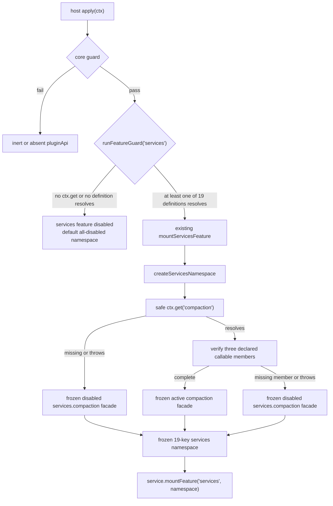

# Feature Design: plugin-api-compaction-m2

## 1. Overview

`plugin-api-compaction-m2` delivers SV17 by adding one A-class, host-side
capability facade at `pluginApi.services.compaction`. It extends the existing
18-entry `pluginApi.services` namespace to 19 entries while preserving the
existing `services` feature, mount point, feature registry name, guard branch,
and P1/P2/P4 failure taxonomy.

The design exposes the public abstract `CompactionEngine` operations only:

| Facade member | Official target | Stable basis |
|---|---|---|
| `compactIfNeeded` | `ctx.compaction.compactIfNeeded` | public abstract `CompactionEngine` operation |
| `compactNow` | `ctx.compaction.compactNow` | public abstract `CompactionEngine` operation |
| `compactRegion` | `ctx.compaction.compactRegion` | public abstract `CompactionEngine` operation |

The installed `@deepseek-ai/dsh-compaction` service definition registers the
service as `ctx.compaction`. It explicitly supports interchangeable providers
that subclass `CompactionEngine`; therefore the facade obtains the official
service through `ctx.get('compaction')` and does not detect, import, or depend
on any backend class.

`BasicCompactionEngine.summarize()` is a protected subclass hook, and its
`SummarizationInput` / `SummaryResult` types are not root exports of
`@deepseek-ai/dsh-compaction-basic`. `config`, automatic-compaction state,
overflow state, injection metadata, and any other concrete-backend details are
outside the facade.

**Type and mechanism:** A-class official service direct binding. No event
translation, wrapper chain, B-class re-entry, or C-class proposal is involved.

**Host/client split:** Host only. This feature creates no client bundle,
remote contribution, codec, slot, browser API, or client peer dependency.

---

## 2. Architecture

### 2.1 Runtime flow



### 2.2 Key decisions

1. **One existing feature, not a new feature:** `compaction` is a definition
   within the delivered `services` feature. There is no
   `runFeatureGuard('compaction')`, `FEATURE_MOUNTERS` entry, feature-registry
   record, top-level `pluginApi.compaction`, or independent cleanup lifecycle.
2. **Static allowlist:** `SERVICE_DEFINITIONS` remains the sole source of
   exposed members. Runtime property enumeration of `ctx.compaction` is
   prohibited. This preserves the exact three-method public shape and prevents
   Basic-only or provider-specific members from leaking.
3. **Existing generic forwarding:** declared `method` members use the existing
   rest-argument delegate pattern, `(...args) => target[name](...args)`. This
   preserves `this === ctx.compaction`, argument identity, call ordering,
   return/rejection identity, timing, and optional trailing argument omission:
   `compactNow(agent, signal)` stays a two-argument official call and
   `compactRegion(start, end, agent)` stays a three-argument official call.
4. **Freeze facade, never target:** the namespace and every facade are frozen;
   the official `ctx.compaction` object is never frozen, sealed, proxied, or
   otherwise altered.
5. **No direct official import:** all three operations are obtained via Cordis
   injection (`ctx.get('compaction')`). No code imports
   `@deepseek-ai/dsh-compaction` or `@deepseek-ai/dsh-compaction-basic`, so no
   peer dependency is added for this feature.
6. **No compaction event surface:** `compaction/*` is not added to
   `pluginApi.events`, event catalogs, or event-bus logic. The official names
   are durable session-log event types, not a Cordis event API for this facade.

---

## 3. Components and Interfaces

### 3.1 `lib/services.js`: add the SV17 definition

Append the following static definition after the current 18 entries in
`SERVICE_DEFINITIONS`:

```js
{
  key: 'compaction',
  ctxService: 'compaction',
  pkg: 'dsh-compaction',
  members: [
    { kind: 'method', name: 'compactIfNeeded' },
    { kind: 'method', name: 'compactNow' },
    { kind: 'method', name: 'compactRegion' },
  ],
}
```

This definition has no getter, forward, or optional member. Its position makes
`SERVICES_NAMESPACE_KEYS`, the default disabled namespace, and all
`SERVICE_DEFINITIONS`-driven test fixtures include `compaction` automatically.
The namespace's exact stable order becomes:

```text
fs, codeRuntime, workspaces, subagents, workflows, approval, userQuestions,
attachments, skills, storage, sessionProjections, sessionQuery, sessionTitle,
sessionTelemetry, sessionReferences, tokenMeter, agentDefaultModel, web,
compaction
```

`buildActiveFacade()` remains the only active-facade constructor. With the new
definition, it creates a frozen shape equivalent to:

```js
{
  isActive: true,
  compactIfNeeded: (...args) => compaction.compactIfNeeded(...args),
  compactNow: (...args) => compaction.compactNow(...args),
  compactRegion: (...args) => compaction.compactRegion(...args),
}
```

This is descriptive only; implementation continues to use the generic member
factory rather than adding a special-purpose compaction facade.

### 3.2 Per-definition construction containment

`createServicesNamespace()` currently probes each definition independently.
Its construction path will be strengthened so that an exception raised while
inspecting or building **one** active facade is contained at that definition:

1. Resolve each official service through the existing `safeGet` boundary.
2. If the value is absent, create the existing P4 disabled facade for that
   definition.
3. If it resolves, invoke active-facade construction inside a per-definition
   `try` boundary.
4. If member inspection, a hostile property getter, or facade construction
   throws, log through the injected safe logger and substitute the existing
   `buildDisabledFacade(def, active, reason)` result for that definition.
5. Continue building all remaining definitions and freeze the namespace.

The reason recorded for such a failure shall identify the facade key and retain
the caught error message when safely available. Logging is best effort and
must not throw. This generic containment is intentionally applied to every
`SERVICE_DEFINITIONS` entry, not just compaction: it is the existing P4
mechanism made reliable for the required compaction failure case, and it
preserves all other facades when one target has hostile or incomplete members.

A resolved service with a missing or non-callable declared compaction method
already follows the generic non-optional-member rule: `buildActiveFacade()`
returns a single frozen P4 disabled facade for `services.compaction`. It never
publishes a partially active method set.

### 3.3 `lib/guards.js`: existing `services` guard automatically expands

No new feature-guard branch is added. The existing `services` branch iterates
`SERVICE_DEFINITIONS` and passes if at least one `ctx.get(def.ctxService)`
resolves without throwing. After the definition is appended it therefore
becomes a 19-service probe.

The guard behavior is:

| Situation | `services` feature result | `services.compaction` result |
|---|---|---|
| `ctx.get` absent or every one of 19 definitions unavailable | P2: `services` disabled | default P2 disabled facade; calls report `services` |
| a complete compaction service alone resolves | active | active P4-capable facade; all 18 unavailable entries remain P4-disabled |
| compaction absent while another definition resolves | active | P4 disabled facade; calls report `services.compaction` |
| compaction resolves but misses or throws from a declared member while another definition resolves | active | P4 disabled facade; no partial active surface |
| core inactive | core inert | P1 inactive error precedes all official access |

This retains the delivered guard classification: capability seams are optional
as a group, but each declared service is locally observable as active or P4
disabled after the group mounts.

### 3.4 `lib/index.js` and `lib/plugin-api-service.js`

No new mounter, feature-registry key, or mounting order is introduced.
`mountServicesFeature()` continues to construct the one services namespace and
mount it through `service.mountFeature('services', namespace)`. The existing
`FEATURE_MOUNTERS` order remains unchanged.

`createDisabledServicesNamespace(active)` in `lib/services.js` derives its
entries from `SERVICE_DEFINITIONS`; consequently the default
`pluginApi.services` object created by `lib/plugin-api-service.js` gains the
19th disabled `compaction` facade automatically. Before a successful services
mount, its three declared methods produce P2 (`services`) or P1 (inactive
core), never touch `ctx.compaction`, and never report a nonexistent independent
`compaction` feature.

### 3.5 Package boundary

`package.json` remains unchanged. `@deepseek-ai/dsh-compaction` is not added as
a peer dependency because the host facade does not import it; it uses the
Cordis-injected object exclusively. The existing peer dependency rules remain
unchanged, and no runtime dependency is introduced.

---

## 4. Data Models

### 4.1 Definition model

No new model type is introduced. SV17 is one existing `ServiceDefinition`:

```ts
type ServiceDefinition = {
  key: 'compaction'
  ctxService: 'compaction'
  pkg: 'dsh-compaction'
  members: [
    { kind: 'method'; name: 'compactIfNeeded' },
    { kind: 'method'; name: 'compactNow' },
    { kind: 'method'; name: 'compactRegion' },
  ]
}
```

The `pkg` label is diagnostic/documentation metadata only. It is not used for
runtime imports, backend discovery, class checks, or version checks.

### 4.2 Active facade model

```ts
type CompactionFacade = Readonly<{
  isActive: true
  compactIfNeeded: (...args: unknown[]) => unknown
  compactNow: (...args: unknown[]) => unknown
  compactRegion: (...args: unknown[]) => unknown
}>
```

The unbounded argument and return types document runtime forwarding rather than
weaken the official type contract. The facade does not clone, freeze, validate,
cache, serialize, or transform the values.

### 4.3 Disabled facade model

```ts
type DisabledCompactionFacade = Readonly<{
  isActive: false
  compactIfNeeded: () => never
  compactNow: () => never
  compactRegion: () => never
}>
```

The members remain present for both P2 and P4 states, so consumers can inspect
`isActive` and receive a typed failure rather than encountering an omitted
member. P1 takes precedence over P2/P4 whenever the core is inactive.

---

## 5. Error Handling and Failure Isolation

| Scenario | Observable behavior |
|---|---|
| Core inactive | P1: each compaction method throws `PluginApiInactiveError` before accessing the official service. |
| `services` guard fails (`ctx.get` missing or all 19 definitions unavailable) | P2: the default all-disabled namespace remains installed; each compaction method throws `PluginApiFeatureDisabledError('services')`. |
| `ctx.get('compaction')` missing or throws while another definition makes services active | P4: frozen `isActive: false` compaction facade; methods throw `PluginApiFeatureDisabledError('services.compaction', reason)`. |
| A declared method is absent or non-callable | P4: the whole compaction facade is disabled, with all three declared methods still present as typed-error throwers. |
| Target member access or active-facade construction throws | P4: the per-definition construction boundary logs best effort and returns the disabled compaction facade; unrelated capability facades continue construction. |
| Official method throws or rejects after a valid call begins | The exact error/rejection propagates unchanged. No containment, retry, wrapping, or logging is added to the passthrough call. |
| Namespace or facade mutation attempted | Frozen object prevents observable mutation; behavior of strict-mode assignment errors remains native JavaScript behavior. |
| `mountServicesFeature`, mounting, or cleanup registration fails | Existing feature-level fail-safe applies: `services` is disabled, diagnostics are written, and `apply()` returns normally. |

The distinction between a target failure during an official passthrough call and
a failure while building a facade is deliberate: only the latter is contained
as setup degradation. Once an official method is selected and called, its
behavior is passed through exactly.

---

## 6. Test Strategy

All coverage uses `node --test`, mocked contexts, and mocked service objects.
No case boots a real DSH harness, loads a Basic backend, or performs a real
compaction transaction.

| Test file | Changes and coverage |
|---|---|
| `test/services-definitions.test.mjs` | Update expected cardinality/key list to 19; assert `compaction -> compaction`; assert exactly the three non-optional method members and no getter/forward members. |
| `test/services-namespace.test.mjs` | Update the 19-key namespace assertions; assert frozen active compaction facade has only `isActive` plus the three operations; assert the official mock remains unfrozen; assert a complete compaction service alone yields an active compaction facade while each other entry is P4-disabled. |
| `test/services-passthrough.test.mjs` | Retain generic 1:1 delegation coverage after it includes the new definition; add compaction-specific calls for `compactNow(agent, signal)` versus three arguments and `compactRegion(start, end, agent)` versus four arguments, asserting exact forwarded argument lengths, identities, `this`, returned identity, and unchanged throw/rejection behavior. |
| `test/services-optional-member.test.mjs` | Add the non-optional compaction-missing-member case: the entire facade becomes P4-disabled, keeps all three declared members observable, and never exposes a partial surface. |
| `test/services-disabled.test.mjs` | Add compaction-specific P1, P2, P4 missing-service, and P4 incomplete-service assertions. Include a target with Basic-style extras (`summarize`, `config`, arbitrary state) and verify none appear on the facade. |
| `test/plugin-api-service.test.mjs` | Update default services namespace cardinality to 19 and verify its pre-mount compaction facade reports P2/P1 without any `ctx.get('compaction')` call. |
| `test/guards.test.mjs` | Update 18-service wording/cardinality to 19; assert a compaction-only context passes `runFeatureGuard('services')`; retain the no-service and missing-`ctx.get` P2 cases. |
| `test/index-services.test.mjs` | Update 19-service integration assertions. Add apply-level coverage where only a complete compaction service is available: `services` is mounted/active, compaction is active, the other 18 facades are P4-disabled, and apply does not throw. Add an apply-level hostile/missing-member compaction case proving it does not disable otherwise available services. |
| Existing suite | Run the complete `node --test` suite to prove current services, events, and all M1 behavior remain green. |

The tests use call-recording mock methods instead of a real `CompactionEngine`.
This directly verifies the public facade contract without depending on the
Basic implementation that the facade intentionally excludes.

---

## 7. Requirements Coverage

| Requirement section | Design realization |
|---|---|
| §1 namespace, exact key set, read-only integration | `SERVICE_DEFINITIONS` append; definition-derived namespace/default; frozen facade/namespace tests |
| §2 three abstract operations and transparent forwarding | generic static method delegation plus compaction optional-argument tests |
| §3 backend-neutral boundary | static three-member allowlist; no package import, class check, or provider API; Basic-extra-member tests |
| §4 P1/P2/P4 degradation and isolation | existing services guard plus per-definition construction containment in `createServicesNamespace` |
| §5 no events, policy, or backend changes | no events/catalog/index mounter additions; no package/backend changes |
| §6 regression coverage | focused services/guards/apply tests and full `node --test` |

---

## 8. Execution Boundaries and Documentation

Stage 4 implementation changes are confined to the existing services
infrastructure and tests listed in section 6. No new runtime module is
necessary. Shared-file changes are limited to the already owned
`lib/services.js` and `lib/guards.js`; `lib/index.js` requires no behavioral
change because its services mounter is definition-driven.

After implementation and tests pass, documentation synchronization will:

1. mark SV17 delivered in `docs/specs/plugin-api-features/feature-list.md` and
   replace its stale `summarize()` sketch with the three-method abstract
   contract;
2. add the delivered feature entry to `AGENTS.md` §8, including its
   backend-neutral and P4-containment constraints;
3. report the static namespace cardinality as 19 wherever this feature's
   current public shape is documented.

No migration target from the existing acceptance-object plugins is required:
none currently depends on compaction or contains an SV17 hack to remove.
