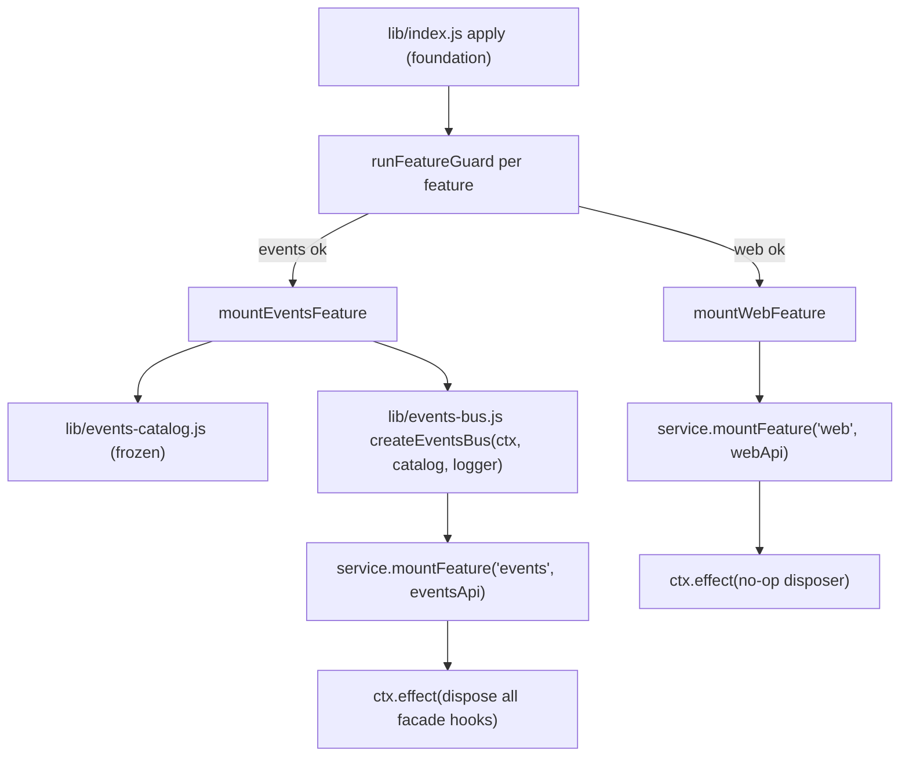

# Design: plugin-api-events-m1

## Overview

`plugin-api-events-m1` 把 feature-list 中的 **E1–E12** 与 **O1–O7, O9–O12, O15, O16** 落地为两个 host 侧门面 feature：

1. **`pluginApi.events`**（feature 名 `events`）：稳定事件总线 + 19 个宿主事件目录。E1–E7 是 Cordis 五种 dispatch 模式的类型化稳定版；E8/E9/E11 是门面在 Cordis 之上统一的三项总线契约（priority、只读 payload、故障隔离）；E10 基于官方 scope carrier 做订阅过滤；E12 提供只读目录。
2. **`pluginApi.web`**（feature 名 `web`）：`web.registerSearchProvider` / `web.registerFetchProvider` 的稳定直通（O15）。

依赖已交付的 `plugin-api-foundation`（服务、guard、版本协商）与 `plugin-api-facade-integrity`（门面完整性；本 feature 不包装官方边界，不新增包装链）。

---

## 源码调研结论

### Cordis 事件总线语义（`@deepseek-ai/cordis/lib/index.js`）

- `dispatch(type, args)`（L258–264）：若 `args[0]` 是对象/函数，则作为 `thisArg`（scope carrier）shift 掉；再 shift 事件名；随后 `internal/dispatch` 通知；hook 过滤规则：`hook.global || !filter || filter.call(thisArg, hook.ctx)`；回调统一 `hook.callback.bind(thisArg)`，因此 **监听器内 `this` 是 dispatch 的 `thisArg`**（对 scope-filtered 事件就是 scope carrier）。
- `emit`（L280–282）：同步调用全部回调，忽略返回值。
- `parallel`（L271–274）：`Promise.allSettled` 并发执行全部回调，**任一 rejection 会抛 `AggregateError`**（门面必须对 facade 自己的监听器先包含，否则会漏到 aggregate）。
- `serial`（L289–294）：按序 `await`，遇到 `isBailed(result)` 立即返回该值；`isBailed` 定义于 L219–221：`value !== null && value !== false && value !== undefined`。
- `bail`（L301–306）：同步版按序短路。
- `waterfall`（L317–325）：最后一个参数是 innermost `next`；每个监听器收到 `(...args, next)`，调用 `next()` 才会继续；监听器返回值为该链最终返回值。
- `on`（L371–380）：`options` 非对象时按 `prepend` 简写处理；返回 disposer（`true` 表示仍注册时移除成功）；`once`（L389–395）先 dispose 再调用监听器。

### scope-filtered 派发（`@deepseek-ai/dsh-scope/lib/index.js`、`lib/invariant.js`）

- `scopeTarget(base, key)`（L327–338）生成 carrier：保留 base 的 Cordis filter；**未打 scope tag 的 listener（`scopeOf(ctx) === undefined`）对所有 scope 全局可见**；打了 tag 的 listener 仅对 `key` 或其祖先 scope 可见。
- `carrierKeyOf(value)`（L352–355）可从 carrier 读取路由 key；`isScopeCarrier` 判断 carrier。
- `dsh-scope/lib/invariant.js` 的 `scopedSubjectResolvers` 是 scope-filtered 事件权威表。本 spec 涉及的：
  - `approval/request`: subject = `args[0].agent`
  - `goal/changed`: subject = `args[0].agent`
  - `subagent/start` / `subagent/end`: subject 为 `null`（presence-only，payload 不含 subject，但 dispatch 仍带 carrier；parent key 只能通过 `carrierKeyOf(this)` 取得）
  - 其余本 spec 事件不在表中 → 非 scope-filtered。

### O* 官方事件实参形状（本设计 catalog 的 wire shape 依据）

- `dsh-tool-fs/lib/index.js`：`fs/write-intent`（L658）与 `fs/edit-intent`（L809）为 `ctx.waterfall(name, target, exec, () => void 0)`，即**位置参数 `(target, exec, next)`**；`fs/observed`（L278/L432/L665/L818/L1031）为 `ctx.emit(name, target, observation, actor)`，即 `(target, observation, actor)`。
  - 注：feature-list/requirements 中的 `{target, exec}`、`{target, observation, actor}` 是**逻辑 payload 字段**；实际回调收到的是位置参数。本设计在 catalog 中同时记录逻辑形状与位置参数形状。
- `dsh-subagent/lib/index.js`：`createLifecycleEmitter`（L166–182）逐个包含监听器；`subagent/start`（identity `{runId, provider, id, local}`，L210/L237）、`subagent/end`（identity + `stopReason` + 可选 `lastAssistantMessage`，L199–208/L250–255）经 `scopeTarget(parent)` 派发；`subagent/provider-added`（payload `provider`，L2476）、`subagent/provider-removed`（payload `providerName`，L2474）为非 scope-filtered emit。
- `dsh-workflow/lib/index.js`：`emitWorkflowEvent`（L68–77）逐个包含监听器；worker 端 `dsh-workflow-worker-thread/lib/index.js`（L895–914）发出：
  - `workflow/start(info)`、`workflow/phase(info, title)`、`workflow/log(info, message)`、`workflow/agent-start(info, agent)`、`workflow/agent-end(info, agent)`、`workflow/end(info, {stopReason, error?, agentsStarted})`；`info = {id, meta}`。
- `dsh-user-approval/lib/index.js`（L189）：`ctx.waterfall(scopeTarget(this, req.agent), 'approval/request', req, () => Promise.resolve('unavailable'))`，随后把非法 outcome 归一到 `'unavailable'`（fail-closed）。官方在整链外层兜底，但单个 throwing listener 仍会中断后续官方监听器；门面对自己的监听器做包含。
- `dsh-goal/lib/index.js`（L793）：`agentEvents(this.ctx, agent).emit('goal/changed', { change: notification })`；`agentEvents`（`dsh-agent/lib/index.js` L335–365）把 `agent` 注入 payload，最终 payload 为 `{agent, change}`，且 dispatch 带 `scopeTarget(agent, agent)`。
- `dsh-commands/lib/index.js`（L348）：`commands/change` 无参 emit，官方逐个包含监听器。
- `dsh-skill/lib/index.js`（L404）：`skills/change` 无参 emit，官方逐个包含监听器。
- `dsh-credentials/lib/index.js`（L45）：`credentials/updated` 单参 `(ref)` emit，官方逐个包含监听器（INVARIANT 码错误除外，会 rethrow）。
- `dsh-session-telemetry/lib/index.js`（L174）：`ctx.waterfall('session-telemetry/record', record, () => record)`，即 `(record, next)`；官方调用侧另有 contain，默认 fail-closed（throwing rule 会 withhold 该 record）。
- `dsh-web/lib/index.js`（L67–87）：`registerSearchProvider(provider)` / `registerFetchProvider(provider)` 返回官方 disposer；重复 id 抛官方 `WebError(WEB_DUPLICATE_PROVIDER)`。

---

## 钩子引出机制（本仓库必填）

| 能力 | 类型 | 引出机制 | 失败路径与 guard 策略 |
|---|---|---|---|
| `pluginApi.events`（E1–E7） | A | 对 `ctx.on/once/emit/serial/parallel/bail/waterfall` 做类型化稳定直通；facade 监听器以原生 Cordis hook 形式注册，保留官方五种 dispatch 语义 | `events` feature guard 失败 → 仅 `events` 禁用并显式报错；禁用/门面 inert 时调用 events 方法抛 typed error |
| E8 priority | B | 门面维护每个 cataloged event 的有序 entry 列表；注册/注销时**先 dispose 再按序重注册**该 event 的全部 facade hooks（Cordis 原生只支持 push/prepend，中间插入用重注册实现） | 注册失败 → 回滚本次重注册并 rethrow（调用方 misuse）；不与官方 listeners 发生顺序冲突：只保证 facade 内部顺序，不重排外部 listener |
| E9 只读 payload | B | facade hook 在调用用户 listener 前对 object 实参递归 `Object.freeze`（新模块 `lib/deep-freeze.js`，纯函数、循环安全、绝不 throw） | freeze 失败只记录并继续（不阻断 dispatch）；waterfall 返回值只对下一个 facade listener 冻结，不冻结传给官方 `next` 的值 |
| E10 scope 订阅 | A | 基于官方 scope carrier：subject 型事件用 `args[0].agent` 解析；presence-only 事件（`subagent/start|end`）用 `carrierKeyOf(this)` 解析；wrapper 不匹配时对 waterfall 调 `next()` 继续 | 非 scope-filtered 事件传 `opts.scope` 时忽略并文档化；`carrierKeyOf` 不可用（理论场景）时 presence-only scope 过滤退化为不匹配并记录诊断 |
| E11 故障隔离 | A/B | facade hook 按 event mode 分派包裹：sync throw 与 rejected promise 都被 contain（log + 不抛出/不 reject）；waterfall 错误时用当前输入继续 `next()` | containment 自身抛错只记录；官方 listeners 与官方 dispatcher 不受影响 |
| E12 catalog | 门面基础 | `lib/events-catalog.js` 纯模块，`Object.freeze` 只读；首版恰好 19 个事件名 | catalog 为静态纯数据，无运行时失败路径 |
| `pluginApi.web`（O15） | A | `ctx.get('web')` 服务方法直通，返回值原样返回 | `web` feature guard 失败 → 仅 `web` 禁用；官方 `web` 服务缺失时 stub 抛 `PluginApiFeatureDisabledError` |
| O1–O7, O9–O12, O16 事件稳定化 | A | 不新增官方事件、不重排官方 dispatch；只把这些事件纳入 catalog 并提供类型化订阅 | 官方事件缺失时门面不探测、不补偿（纯订阅方）；相应事件收不到即无调用，无额外失败路径 |

---

## Architecture



```mermaid
flowchart LR
    PLUGIN["third-party plugin"] -->|inject: ['pluginApi']| API["ctx.pluginApi"]
    API --> EVENTS["pluginApi.events"]
    API --> WEB["pluginApi.web"]
    EVENTS -->|on/once| REG["ordered entry list + re-register native hooks"]
    EVENTS -->|emit/serial/parallel/bail/waterfall| CTX["delegate to ctx.*"]
    REG --> HOOKS["ctx.on(name, wrapped, {})"]
    CTX --> HOOKS
    EVENTS --> CATALOG["events.catalog (frozen)"]
    WEB --> WSVC["ctx.get('web').register*"]
```

---

## Components and Interfaces

### 1. `lib/events-catalog.js` — 只读事件目录（新纯模块）

零 harness 依赖。导出 `eventsCatalog`（冻结对象）与 `catalogEntryOf(name)`。

条目模型见 Data Models。首版恰好 19 个事件：

| name | mode | scopeFiltered | subject | 实参（listener 收到） |
|---|---|---|---|---|
| `fs/write-intent` | waterfall | false | — | `(target, exec, next)`，`target={targetKey, displayPath}` |
| `fs/edit-intent` | waterfall | false | — | `(target, exec, next)` |
| `fs/observed` | emit | false | — | `(target, observation, actor)`，`observation.kind: 'present'\|'absent'` |
| `subagent/start` | emit | true | `null`（presence-only，用 `carrierKeyOf(this)`） | `{runId, provider, id, local}` |
| `subagent/end` | emit | true | `null` | `{runId, provider, id, local, stopReason, lastAssistantMessage?}` |
| `subagent/provider-added` | emit | false | — | `provider` |
| `subagent/provider-removed` | emit | false | — | `providerName` |
| `workflow/start` | emit | false | — | `info {id, meta}` |
| `workflow/phase` | emit | false | — | `(info, title)` |
| `workflow/log` | emit | false | — | `(info, message)` |
| `workflow/agent-start` | emit | false | — | `(info, agent)` |
| `workflow/agent-end` | emit | false | — | `(info, agent)` |
| `workflow/end` | emit | false | — | `(info, {stopReason, error?, agentsStarted})` |
| `approval/request` | waterfall | true | `args[0].agent` | `(req, next)`，`req={agent, toolName, callId?, reason?, signal}` |
| `commands/change` | emit | false | — | `()` |
| `skills/change` | emit | false | — | `()` |
| `credentials/updated` | emit | false | — | `(ref)` |
| `goal/changed` | emit | true | `args[0].agent` | `{agent, change}` |
| `session-telemetry/record` | waterfall | false | — | `(record, next)` |

约束：catalog 与 requirements AC 7.3 完全一致，不多不少；每个 entry 含 `source`、`type`；整个 catalog 用 `Object.freeze` 深冻结。

### 2. `lib/deep-freeze.js` — 深冻结纯模块（新）

```js
deepFreeze(value, seen = new WeakSet()) // -> value
```

- 只处理 object/array；函数、primitive 原样返回。
- `WeakSet` 防循环；`Object.isFrozen` 短路避免重复遍历同一对象。
- **任何异常都被捕获并返回原值**：freeze 永远不能成为 dispatch 失败点。
- 对 `AbortSignal` 等宿主对象：冻结失败不抛（`Object.freeze` 对部分 exotic object 会抛），保持原样。

### 3. `lib/events-bus.js` — 事件总线（新，host 侧）

零 harness 依赖纯逻辑 + 运行时只依赖传入的 `ctx` 与 `logger`。`createEventsBus({ ctx, catalog, logger })` 返回 `eventsApi`。

#### 3.1 订阅面 `on/once`

```js
events.on(name, listener, opts?) -> () => boolean
events.once(name, listener, opts?) -> () => boolean
```

- `name` 不在 catalog：**直接透传** `ctx.on/once(name, listener)`，忽略 `opts`，返回 Cordis disposer（untyped、无任何门面保证）。
- `name` 在 catalog：
  1. 校验 `opts.priority`：缺省 `'normal'`；非法值抛新 typed error `PluginApiEventPriorityError`（code `PLUGIN_API_INVALID_PRIORITY`），不注册。
  2. 生成 entry（`priority`、`scope`、`once`、递增 `order`），插入该 event 的有序列表：按 tier 升序，同 tier 按 `order` 升序。
  3. `reconcile(name)`：dispose 该 event 的全部旧 facade hooks → 按新顺序 `ctx.on(name, wrapped, {})` 逐个注册。返回 disposer：从列表移除该 entry、`reconcile`、返回是否移除。
- `once`：wrapped 在**第一次调用前**先移除自身并 `reconcile`（对齐 Cordis `once` 先 dispose 后调用的语义），再调用用户 listener。

#### 3.2 派发面 `emit/serial/parallel/bail/waterfall`

直接委托 `ctx`，保持官方语义：

```js
events.emit(name, ...args)            -> void                  // ctx.emit(name, ...args)
events.serial(name, ...args)          -> Promise<BailValue>    // ctx.serial(name, ...args)
events.parallel(name, ...args)        -> Promise<void>         // ctx.parallel(name, ...args)
events.bail(name, ...args)            -> BailValue             // ctx.bail(name, ...args)
events.waterfall(name, ...args, next) -> Return                // ctx.waterfall(name, ...args, next)
```

facade 监听器已作为原生 Cordis hook 注册，因此委托后自然参与对应 dispatch 模式，无需门面再造一套派发器。scope-filtered 事件的生产派发属于官方 DSH；门面不合成 carrier，若插件对这类事件调用派发方法，行为与直接调用 `ctx.*` 一致（官方 invariant 可能拒绝）。

#### 3.3 包裹函数 `wrapped`（每个 cataloged 监听器一个）

`wrapped` 必须是普通 function（不能用箭头函数，以保留 `this = dispatch thisArg`）。执行顺序：

1. **freeze**：对实参列表中除 waterfall 的 `next` 函数外的每个 object 调用 `deepFreeze`。
2. **scope gate**（仅当 `entry.scope !== undefined` 且 `entry.scopeFiltered`）：
   - subject 解析：`'args[0].agent'` → `args[0]?.agent`；`null` → `carrierKeyOf(this)`。
   - 不匹配：`emit/bail/serial/parallel` 返回 `undefined`；`waterfall` 调用 `next()` 并返回其值（不能 veto 官方链）。
   - 非 scope-filtered 事件带 `opts.scope`：忽略 scope，按全局订阅处理（requirements AC 5.3）。
3. **mode 化调用与包含**：
   - `emit`：`try { const r = listener.apply(this, args); Promise.resolve(r).catch(contain) } catch (e) { contain(e) }`，返回 `undefined`。
   - `bail`：`try { return listener.apply(this, args) } catch (e) { contain(e); return undefined }`。**monitor 例外**：`priority === 'monitor'` 时忽略返回值，恒返回 `undefined`（observe-only，不产生 bail）。
   - `serial`：同上，但把 rejected promise 转为 `undefined`（不产生 bail）。**monitor 例外**：恒返回 `undefined`。
   - `parallel`：返回 always-resolved promise，把 listener 的 rejection 包含掉。
   - `waterfall`：`next` 包装为 `guardedNext`（标记 `called` 并记录 `chainResult = originalNext()`）；`try { return listener.apply(this, [...args, guardedNext]) } catch (e) { contain(e); if (!called) return originalNext(); return undefined }`；对 thenable 结果附加 rejection 处理：reject 时 contain，且仅在 `!called` 时调 `originalNext()`。**monitor 例外**：调用后忽略 monitor 自身的返回值，返回 `called ? chainResult : originalNext()`（observe-only，既不 veto 链也不改写链结果）。
4. `contain(error)`：`logger.warn` 一条可读诊断（logger 调用包 try/catch），绝不 rethrow。

#### 3.4 `catalog` 暴露

`eventsApi.catalog` 直接返回冻结的 `eventsCatalog` 引用。

### 4. `lib/plugin-api-service.js` — 扩展服务面

- 构造时新增两个 disabled stub：
  - `this.events = createDisabledEventsApi(active)`：`on/once/emit/serial/parallel/bail/waterfall` 全部抛 inactive/feature-disabled typed error；`catalog` 为 `undefined`。
  - `this.web = createDisabledWebApi(active)`：两个方法抛 inactive/feature-disabled typed error。
- `mountFeature(name, api)` 扩展可挂载名：`llm/admission`、`events`、`web`。
- 其余（`isActive`、`features`、`assertCompatible`、`reconcile`）不变。

### 5. `lib/errors.js` — 新增 priority typed error

```js
class PluginApiEventPriorityError extends PluginApiError {
  code = 'PLUGIN_API_INVALID_PRIORITY'
  priority // 传入的非法值
}
```

### 6. `lib/guards.js` — 扩展 feature guard

`runFeatureGuard(featureName, ctx, deps)` 增加两个分支：

- `events`：
  - probe `ctx.on/once/emit/serial/parallel/bail/waterfall` 均为 function（Cordis context 基本能力）；
  - 不探测任何官方 O* 事件源：events feature 是纯订阅方，官方事件不存在时最多收不到调用，不需要禁用门面。
- `web`：
  - probe `ctx.get('web')` 存在且 `registerSearchProvider`、`registerFetchProvider` 均为 function。

### 7. `lib/index.js` — 挂载新 feature

`FEATURE_MOUNTERS` 增加：

- `['events', mountEventsFeature]`：`createEventsBus` → `service.mountFeature('events', api)` → 返回 disposer（dispose 全部 facade root hooks；幂等）。mount 返回 null（如 createEventsBus 失败）时按 foundation 既有规则禁用 `events`。
- `['web', mountWebFeature]`：构造 `webApi` 直通 `ctx.get('web')`，`service.mountFeature('web', webApi)`，disposer 为 no-op（无资源）。

挂载顺序建议 `events` 在 `web` 之前（两者无依赖，仅为可读性）。

### 8. `package.json` — peerDependencies

新增 `"@deepseek-ai/dsh-scope": "^0.1.0-rc.6"`（`carrierKeyOf` 的宿主来源）。`dsh-scope` 的 `exports["."]` 公开导出 `carrierKeyOf`（`dsh-scope/package.json`）。

---

## Documentation synchronization (AGENTS.md anti-staleness)

1. WHEN `plugin-api-events-m1` 的 Stage 4 全部任务完成并验收，THEN 必须同步更新仓库根 `AGENTS.md`：追加本 feature 的条目（feature 名 `plugin-api-events-m1`、范围 E1–E12 + O1–O7, O9–O12, O15, O16、交付状态 delivered、spec 目录 `docs/specs/plugin-api-events-m1/`、关键设计约束：events-bus 原生 hook 按序重注册 / deepFreeze / scope 过滤 / `dsh-scope` peerDependency）。
2. WHEN 未来任何新 feature 在 Stage 4 实现交付，THEN 必须在 `AGENTS.md` 中追加对应条目（feature 名、范围、状态、spec 目录、关键约束），以保持文档与实际代码同步，禁止只写代码不更新 `AGENTS.md`。
3. WHEN 一个 feature 的公开 API 形状或里程碑状态发生变化，THEN 必须同步更新 `AGENTS.md` 与 `docs/specs/plugin-api-features/feature-list.md` 中的对应条目，避免文档过期过时。
4. 本义务是用户显式要求的治理约束；Stage 3 tasks 中将安排一个明确任务执行本 feature 的 `AGENTS.md` 同步（该任务属于本仓库治理文档维护，作为 SKILL 中“tasks 不含文档任务”的例外，按用户指示优先执行）。

---

## Data Models

```ts
type EventMode = 'on' | 'emit' | 'serial' | 'parallel' | 'bail' | 'waterfall'  // E12 完整枚举；本 spec catalog 实际只出现 emit/waterfall

type CatalogEntry = {
  name: string
  mode: 'on' | 'emit' | 'serial' | 'parallel' | 'bail' | 'waterfall'  // E12 要求的完整枚举
  scopeFiltered: boolean
  subject: 'args[0].agent' | null | undefined  // null = presence-only（carrierKeyOf(this)）
  payload: string          // 类型/形状描述（文档用）
  args: string             // listener 实际收到的位置参数形状
  source: string           // feature id（E1..O16）
  type: 'A' | 'B'
}

type Priority = 'lowest' | 'low' | 'normal' | 'high' | 'highest' | 'monitor'

type EventListenerEntry = {
  id: number
  listener: Function
  priority: Priority
  scope: unknown
  once: boolean
  order: number          // 同 tier 内稳定插入序
}

type EventsApi = {
  catalog: Readonly<Record<string, CatalogEntry>>
  on(name: string, listener: Function, opts?: { priority?: Priority, scope?: unknown }): () => boolean
  once(name: string, listener: Function, opts?: { priority?: Priority, scope?: unknown }): () => boolean
  emit(name: string, ...args: unknown[]): void
  serial(name: string, ...args: unknown[]): Promise<unknown>
  parallel(name: string, ...args: unknown[]): Promise<void>
  bail(name: string, ...args: unknown[]): unknown
  waterfall(name: string, ...args: unknown[], next: Function): unknown
}
```

> **修订注记（`plugin-api-agent-m1`）**：`plugin-api-agent-m1` 交付后，catalog schema 已升级：`subject` 更名为 `scopeKey`，每个 entry 新增 `fault`（`'contain' | 'created' | 'propagate'`）与 `freeze`（`'all' | { deep: string[] }`）两个策略字段。既有 19 个事件回填为 `fault:'contain'`、`freeze:'all'`、`scopeKey` 同原 `subject`；新增 12 个 `agent/*` 条目。运行时 catalog 总数从 19 增至 31。

---

## Error Handling

1. **boot fail-safe 不变**：`mountEventsFeature` / `mountWebFeature` 任何异常由 foundation 的 mount try/catch 与 feature-registry 捕获，绝不抛穿 `apply`；events feature 失败只禁用 `events`，门面保持 active。
2. **feature 禁用/inert**：`pluginApi.events` / `pluginApi.web` 的 stub 方法先抛 `PluginApiInactiveError` 或 `PluginApiFeatureDisabledError`，且抛错前不触碰任何官方服务（与 foundation 规则一致）。
3. **非法 priority**：`events.on/once` 抛 `PluginApiEventPriorityError`，不注册、不产生副作用。
4. **listener 故障隔离**：facade listener 的 sync throw / async rejection 一律 contain；waterfall 中包含后继续 `next()`，dispatch 不中断、不 reject；官方 listeners 不感知。
5. **scope 过滤**：不匹配的 waterfall facade listener 调用 `next()` 继续；非 scope-filtered 事件传 `opts.scope` 被忽略（文档化）。
6. **非 cataloged 事件名**：透传 Cordis，门面不包含、不冻结、不排序；调用方自担稳定性。
7. **注册失败回滚**：`reconcile` 中任一 `ctx.on` 失败 → dispose 本次已注册 hook，移除触发注册的新 entry，对旧列表重新 `reconcile`，最后 rethrow（调用方 fiber 已 dispose 等 misuse 场景）。
8. **`deepFreeze` 永不 throw**：exotic/不可冻结对象原样返回，dispatch 继续。
9. **scope carrier 缺失**：`carrierKeyOf(this)` 对非 carrier `this` 返回 `undefined`；presence-only 事件在无 carrier 派发时 scope 订阅不匹配，但该场景本身会先被官方 scope invariant 拒绝。

> **修订注记（`plugin-api-agent-m1`）**：第 4 条的“一律 contain”不再适用于 `agent/*` 事件。`plugin-api-agent-m1` 为 catalog 增加 per-event `fault` 策略：7 个普通 `agent/*` emit 仍 contain；`agent/created` 为 `'created'`（同步 throw 传播以保留官方 sync-veto，异步 rejection contain）；`agent/pre-step`、`agent/request`、`agent/request-error`、`agent/turn-stopping` 为 `'propagate'`（保留 Cordis 原生传播）。Components 3.3 step 1 的全量 `deepFreeze` 实参也由 `freezeByPolicy(arg, meta.freeze)` 取代，以支持 `agent/*` 事件的 live object 不冻结策略。

---

## Testing Strategy

运行器 `node --test`；纯模块零 harness 依赖；集成测试用 mock Cordis context（实现 `dispatch` 语义：shift 可选 `thisArg` 与 name、绑定 `this`、按 emit/serial/parallel/bail/waterfall 调用回调）。

- `test/events-catalog.test.mjs`：恰好 19 个事件名、每个 entry 的 mode/scopeFiltered/subject/source/type 与上表一致、整个 catalog 深冻结；`catalogEntryOf` 行为。
- `test/deep-freeze.test.mjs`：普通对象/数组/嵌套/循环/已冻结/函数/primitive/exotic 不抛。
- `test/events-bus.test.mjs`：
  - E1/E2：on/once 注册、disposer 幂等返回布尔、once 先移除后调用且只调一次。
  - E3–E7：五种派发方法委托 `ctx.*` 且 mock 观察到正确调用；facade listener 以原生 hook 形式收到相同实参。
  - E8：六档 priority 顺序、同档插入序、monitor 对 bail/waterfall 返回值被忽略、非法 priority 抛 typed error。
  - E9：object 实参在 listener 内 `Object.isFrozen === true`；waterfall 返回的新对象对下一个 facade listener 已冻结；对官方 `next` 返回值不额外冻结。
  - E10：`goal/changed`/`approval/request` 按 `args[0].agent` 过滤；`subagent/start|end` 用 mock scope carrier + 真实 `carrierKeyOf` 过滤；非 scope-filtered 事件传 scope 忽略。
  - E11：emit/bail/serial/parallel/waterfall 下 sync throw 与 rejected promise 均被包含；waterfall 继续 `next`；serial 中 rejecting listener 不产生 bail。
  - 非 cataloged 名透传：门面不冻结、不包含、不排序。
- `test/events-guard.test.mjs`：`runFeatureGuard('events')` 与 `runFeatureGuard('web')` 的 probe 矩阵、缺 `web` 服务时仅 web 禁用。
- `test/plugin-api-service-events.test.mjs`：disabled stub 抛 typed error；mount 后 events/web API 可调；`mountFeature` 未知名仍拒绝。
- `test/index-events.test.mjs`：apply 挂载 events/web 的 mock 集成——events 失败时门面仍 active 且只禁用 events；apply 永不 throw。
- 回归：既有全部测试（foundation、facade-integrity、llm-image-admission）保持通过。

---

## Requirements coverage matrix

| Requirements 章节 | 设计落点 |
|---|---|
| 1. Subscription surface (E1/E2) | Components 3.1；非 cataloged 透传；disabled stub |
| 2. Dispatch surface (E3–E7) | Components 3.2 |
| 3. Priority ordering (E8) | Components 3.1/3.3；reconcile 算法 |
| 4. Read-only payload (E9) | Components 2/3.3 step 1 |
| 5. Scope-aware subscription (E10) | Components 1/3.3 step 2；源码调研 scope carrier |
| 6. Listener fault isolation (E11) | Components 3.3 step 3/4 |
| 7. Event catalog (E12) | Components 1；Data Models；Testing Strategy catalog 测试 |
| 8. File-system events (O1–O3) | Components 1 catalog 行 1–3；3.3 |
| 9. Subagent events (O4/O5) | Components 1 catalog 行 4–7；3.3 scope gate |
| 10. Workflow events (O6) | Components 1 catalog 行 8–13 |
| 11. Approval request (O7) | Components 1 catalog 行 14；3.3 |
| 12. Change notifications (O9–O12) | Components 1 catalog 行 15–18 |
| 13. Web passthrough (O15) | Components 4/7；guard web |
| 14. Session telemetry (O16) | Components 1 catalog 行 19 |
| 15. Testability and regression | Testing Strategy |
