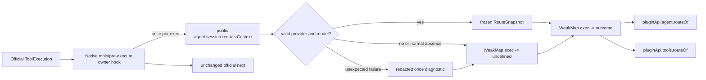

# Design: plugin-api-exec-route-m2

> feature_name: `plugin-api-exec-route-m2`
> 状态：已完成（Stage 4）
> 上游：`requirements.md`（Stage 1 已批准）、`plugin-api-semantic-hooks-m2`、`plugin-api-m1-integration/parallel-workflow.md`
> 范围：host-only A9 + T10；不增加 client、remote、codec、settings 或 event catalog slice

---

## Overview

本 feature 为每一个进入官方 `tools/pre-execute` 的 `ToolExecution` 建立一次性的、只读的 `RouteSnapshot`：

```ts
type RouteSnapshot = Readonly<{
  provider: string
  model: string
}>
```

`pluginApi.routing.ofExecution(exec)` 是 M2 的 canonical execution-route query；`pluginApi.agent.routeOf(exec)`（A9）与 `pluginApi.tools.routeOf(exec)`（T10）是同一个 feature-owned query authority 的兼容委托。三者不各自读取 session，不提供 fallback，不暴露 `Session`、`Agent`、`RequestContext`，也不向官方对象写入字段或 symbol。

这是 B 类转译，不是官方 `exec.route`：route 的唯一公开来源是 `exec.agent.session.requestContext()`。该 public method 返回 session 最近已提交的 `request/context`，而非一个已与特定 `ToolExecution` 因果绑定的记录。因此非空结果只表示“本 execution 首次进入 `tools/pre-execute` 时可读取的最近已提交 route 快照”。

### 调研结论与分类

| 能力 | 分类 | 公开 substrate | 精度边界 |
|---|---|---|---|
| `pluginApi.agent.routeOf(exec)` | B / A9 | `tools/pre-execute` + `Agent.session` + `Session.requestContext()` | 最新 committed context 的 execution-time snapshot，不是 agent 配置或 model-call causal binding。 |
| `pluginApi.tools.routeOf(exec)` | B / T10 | 同上 | 与 A9 共用同一 owner-local outcome；不是 tools service 的 route rewrite。 |
| `tools/pre-execute`、`tools/execute`、`tools/post-execute`、`tools/result` | A | 已有 tools runtime dispatch | 既有 catalog、freeze、fault、scope、signal 与 result 语义完全不变。 |
| 官方 `exec.route` / 强因果 route 绑定 | C / A10 | 无 | 需要上游在 execution 与 request-context record 间公开稳定绑定；本 feature 不模拟。 |

官方 tools runtime 会先创建 execution，再以 `ctx.waterfall(carrier, 'tools/pre-execute', exec, next)` 进入预执行阶段；只有该路径可以建立本 feature 所需的 route outcome。Cordis 的 `{ prepend: true }` 将 hook 插入同名原生 hook list 的头部，waterfall 按该 list 外层到内层执行。故 owner capture hook 可以早于随后由 `pluginApi.events` 注册的 facade listeners 运行，同时仍将原始 `next()` 透传一次。

官方 `tools/post-execute` 对 `final-result` 路径并非必达；这个事实不改变本 feature 的查询规则：只要该 execution 已在 pre-execute 捕获，实际到达的后续 A 类阶段均能返回同一结果。没有到达 pre-execute 的 execution 在任何后续阶段均只能返回 `undefined`。

## Architecture



### Components

| Module / surface | Responsibility |
|---|---|
| `lib/exec-route.js` | Feature-local owner: outcome `WeakMap`, snapshot validation/freeze, diagnostic dedupe, native capture registration, public `routeOf`, idempotent epoch-bound disposer. |
| `lib/guards.js` | Additive `execRoute` mandatory-substrate guard branch. |
| `lib/plugin-api-service.js` | Shared disabled/active `execRoute` delegate, service-lifetime P2 diagnostic ledger, and reversible mount/unmount support; wire both namespace entries to that one delegate. |
| `lib/index.js` | Import and mount the owner after its M1 dependencies; use the coordinated reversible publication boundary. |
| `test/exec-route.test.mjs` | Owner behavior and native waterfall ordering, capture, cache, diagnostics, no mutation, disposal. |
| `test/exec-route-guard.test.mjs` | Guard P2 coverage. |
| `test/plugin-api-service-exec-route.test.mjs` | P1/P2 delegate behavior, shared authority, reversible mount/unmount. |
| `test/index-exec-route.test.mjs` | Apply-level transactional activation, failure rollback, re-apply, existing tools lifecycle treatment. |
| `../dsh-read-image` migration tests | A6 replacement acceptance, headless smoke, and development boot. |

No `lib/exec-route-events-catalog.js` exists because this feature publishes no synthetic event. No existing catalog module, `lib/events-bus.js`, or `lib/deep-freeze.js` is modified.

## Components and Interfaces

### 1. Feature-local owner: `lib/exec-route.js`

The module exports focused construction/mount functions rather than a generic semantic-hooks engine. Its private state is per mounted owner instance:

```ts
type RouteOutcome = RouteSnapshot | undefined

type ExecRouteOwner = {
  routeOf(exec: unknown): RouteOutcome
  dispose(): void
}
```

The owner stores outcomes in `WeakMap<object, RouteOutcome>`. A second `WeakSet<object>` (or equivalent private tagged record) distinguishes “not observed” from “observed with missing route”, because `WeakMap.get()` alone cannot distinguish an absent key from a stored `undefined`.

The observable outcome rules are:

1. A non-object or unobserved input returns `undefined` without inspection, logging, or throwing while the feature is active.
2. On the first eligible `tools/pre-execute` observation of an object `exec`, the owner records it as observed before route work. It then has exactly one opportunity to resolve the snapshot.
3. A valid request context has non-empty string `provider` and `model`. The owner creates exactly `{ provider, model }`, applies `deepFreeze`, and stores that instance.
4. No agent, no readable `agent.session`, no request context, or incomplete/non-string/empty fields is normal absence. The owner stores `undefined` and does not log.
5. An unexpected accessor, method, validation, or owner failure is contained. The owner records one redacted diagnostic keyed by `plugin-api-exec-route-m2`, `tools/pre-execute`, `resolution-failure`, and the execution identity; it then stores `undefined`.
6. Repeated pre-execute observation and all later calls only read stored owner state. They cannot call `requestContext()` again, retry validation, re-enter the substrate, or issue a second diagnostic.

The owner reads only the public `exec.agent.session.requestContext()` surface. It never reads `requestHeader()`, `agent.options`, DSH backing event collections, request configuration, or private module state. It never mutates, defines, deletes, proxies, clones, or attaches route state to `exec`, `exec.agent`, session, or the returned context. Its `WeakMap` is the sole correlation store.

#### Native capture hook

On successful mount, the owner registers exactly one native hook:

```js
ctx.on('tools/pre-execute', function captureRoute(exec, next) {
  owner.capture(exec)
  return next()
}, { prepend: true })
```

The actual implementation contains `owner.capture()` so unexpected owner failures cannot prevent continuation. `capture()` itself never invokes `ctx.waterfall`, `ctx.on`, or an event-bus method. The hook calls the received continuation exactly once and forwards its return value unchanged. It introduces no decision, denial, ask, signal replacement, result transformation, retry, or listener-fault policy.

`prepend: true` is required for availability to a facade listener in that same event stage. It is intentionally only native ordering: it does not declare a new facade priority, alter existing facade listener registration order, or move any existing M1 hook. Context scope filtering remains Cordis-owned, because the hook is registered on the same context and dispatch carrier as the official event.

#### Diagnostics

`diagnoseOnce(identity, phase, category, error?)` uses private identity-backed deduplication. It produces a constant-shaped redacted message containing the feature name, phase, and category. It must not stringify `exec`, agent, session, context, request content, prompts, credentials, or raw payloads. A logger missing method or logger throw is swallowed.

Normal missing route is not a diagnostic condition. Feature guard and activation failures use an `execRoute`-only service-lifetime P2 diagnostic ledger rather than calling the generic `writeGuardLog` / `featureFailNotice` path unconditionally. The ledger is owned by `pluginApi` service state so it survives repeated `apply()` against the same branded service, and is keyed by `(featureName, lifecyclePhase, category)`. Its one narrow operation, `reportExecRouteP2Once(phase, category, problems)`, marks the key before it invokes `writeGuardLog(problems)` and `logger.error(featureFailNotice('execRoute', logPath))`; later matching failures do neither. A distinct lifecycle phase or category remains eligible for one diagnostic. This ledger applies only to `execRoute` and does not alter existing feature diagnostics. The owner must not duplicate a host lifecycle notice.

#### Disposal and stale owner isolation

The mounter owns an instance epoch token closed over by its hook and disposer. `dispose()` is idempotent, disables future capture by that owner, invokes the native hook disposer best-effort once, and releases strongly reachable diagnostic state. `WeakMap` and `WeakSet` entries need no explicit per-execution deletion. A stale disposer verifies that its epoch is still the service’s mounted `execRoute` epoch before it can unpublish; it cannot detach or disable a later owner.

### 2. One facade authority with routing composite and compatibility entries

`pluginApi` retains the existing tools service accessor and agent read API. The service gains a private current exec-route delegate initialized to a disabled delegate for feature key `execRoute`.

The stable routing composite and the two compatibility namespace methods delegate to it:

```ts
pluginApi.routing.ofExecution(exec): RouteSnapshot | undefined
pluginApi.agent.routeOf(exec): RouteSnapshot | undefined
pluginApi.tools.routeOf(exec): RouteSnapshot | undefined
```

The methods are stable facade members, but neither has local resolution logic. When core is inactive, their delegate throws `PluginApiInactiveError` before reading `exec` or any official service. When the feature is not active, their delegate throws `PluginApiFeatureDisabledError('execRoute')` before route inspection. When active, both call the same owner `routeOf` function and return the exact stored snapshot instance or `undefined`.

The `tools` accessor continues to resolve the official tools service only for existing tools operations. `routeOf` is supplied by the service-owned exec-route delegate and therefore does not call `ctx.get('tools')`. This avoids turning an already captured route query into a later official-service lookup and preserves the required P2 `execRoute` result for the new route API.

`mountFeature('execRoute', api)` installs only an owner delegate exposing `routeOf`. It does not replace or independently decorate route logic in the agent/tools feature modules. `unmountFeature('execRoute', token)` restores the disabled delegate only when `token` still identifies the active owner. It is a narrow reversible facility for feature activation, not a general reset of unrelated feature APIs.

### 3. Guard: `execRoute`

`runFeatureGuard('execRoute', ctx)` is additive before the unknown-feature fallback and fail-closed. It probes only mandatory public substrate:

| Probe | Required public contract | P2 reason on failure |
|---|---|---|
| `ctx.on` | native capture hook registration is available | `ctx.on` unavailable |
| `ctx.get('tools')` | existing official tools lifecycle support remains resolvable | tools service unavailable |
| `ctx.get('sessions')` | established session read surface is available | sessions service unavailable |
| *(no `agents` probe)* | A9/T10 is a service delegate and does not require a later agent lookup | superseded H1 dependency |

The guard does not read a particular execution, agent, session, or request context. Those values are operation-local and handled by the fail-open capture rules. It also does not add a synthetic event probe, since no B route event exists.

The exec-route mounter verifies only active `tools` and `session` substrates before registering its hook. It has no `events` or `agents` lifecycle dependency: `agent.routeOf` is a stable service delegate and the native owner binds directly to `tools/pre-execute`. Missing/inactive dependency, malformed registration return, or mount exception is P2. It logs via the established redacted guard/feature-failure path, installs no active delegate, and leaves official tools untouched.

### 4. Mount order and first-B publication transaction

The feature key is `execRoute`, matching the guard branch and lifecycle registry. It is inserted after `session` in `FEATURE_MOUNTERS`; this preserves all existing M1 order and places it after tools, events, agent, and session.

The existing host sequence calls a mounter before `ctx.effect()` cleanup registration. Publishing a new delegate or hook before that registration is unsafe: an `ctx.effect()` exception could leave a publicly reachable route API or native capture hook after the registry has been disabled.

This feature resolves the first-B-facade integration gate with a coordinated generic reversible transaction:

```text
1. guard succeeds; required M1 feature states are active
2. mounter creates private owner and registers its native capture hook
3. mounter returns { disposer, publish, rollback } without publishing route delegate
4. host registers ctx.effect(() => disposer)
5. host calls publish() to install the service execRoute delegate
6. host featureRegistry.mount('execRoute')
7. every execRoute guard, mount, cleanup-registration, publication, activation, or re-apply failure
   calls the service-lifetime reportExecRouteP2Once(phase, category, problems) before/with
   featureRegistry.disable('execRoute', reason); this records only the first matching P2 notice
8. a transaction failure in steps 2-6 additionally calls rollback/disposer and
   service.unmountFeature('execRoute', token)
```

The host’s transaction protocol applies only where a mounter opts into the prepared return shape; existing M1 mounters may continue returning a disposer and preserve their existing behavior. The prepared mounter returns an idempotent rollback that is safe before or after publication. The host does not call `featureRegistry.mount('execRoute')` until cleanup is registered and publication succeeds. The service ledger is consulted for all execRoute P2 exits, including pass-1 guard failure before the mounter runs and repeated `apply()` after a prior disabled state, so neither path can repeatedly write the guard log or emit the feature notice.

If `ctx.effect()` fails, rollback removes the hook and the exec-route delegate remains disabled or is restored to the disabled delegate; `featureRegistry` records P2. If delegate publication fails, rollback likewise removes the hook, restores the disabled delegate, and records P2. If registry activation unexpectedly fails after publication, rollback reverses the delegate and hook before P2. In every such path, `apply()` contains the error and later queries raise `PluginApiFeatureDisabledError('execRoute')`.

This is a coordinated integration change because it extends `lib/index.js` host lifecycle and `lib/plugin-api-service.js` with reversible unmount behavior. It does not change frozen `events-bus.js` or `deep-freeze.js`, does not create a catalog rollback concern, and does not modify A11.

### 5. Existing tools lifecycle contract

The owner hook observes only `tools/pre-execute`. It neither subscribes to nor alters the other three events. Captured state remains private and can be queried by facade listeners that receive that same execution in:

| Stage | Existing mode | Route behavior |
|---|---|---|
| `tools/pre-execute` | waterfall | Capture runs before facade event listeners; both facade queries return stored outcome. |
| `tools/execute` | waterfall | Query returns stored outcome; `exec.signal` replacement contract remains exclusively M1/official behavior. |
| `tools/post-execute` | waterfall | Query returns stored outcome only when the official path reaches this stage. |
| `tools/result` | emit | Query returns stored outcome after official materialization. |

No catalog entry changes. Existing tools entries remain A-class with their current mode, scope key, fault policy, and freeze policy. Since `tools/pre-execute` payload is frozen by the facade event bus, route state cannot and need not be attached to `exec`.

## Data Models

```ts
type RouteSnapshot = Readonly<{
  provider: string
  model: string
}>

type RouteOutcome = RouteSnapshot | undefined

type ExecRouteState = {
  observed: WeakSet<object>
  outcomes: WeakMap<object, RouteOutcome>
  diagnostics: WeakSet<object>
  epoch: object
  disposed: boolean
}

type PreparedFeatureMount = {
  disposer: () => void
  publish: () => void
  rollback: () => void
}

type ExecRouteP2DiagnosticKey =
  | 'guard:mandatory-substrate'
  | 'mount:dependency-or-registration'
  | 'activation:cleanup-registration'
  | 'activation:publication'
  | 'activation:registry'
```

`ExecRouteState` is explanatory private state. It is not exposed, serialized, attached to a DSH object, or placed in an events catalog. An implementation may use an equivalent record structure, but must retain the observed-versus-undefined distinction and owner/epoch isolation. The service-owned P2 ledger stores completed `ExecRouteP2DiagnosticKey` values for the lifetime of the branded service; it stores no execution, route, or raw failure data.

The only public route data model is `RouteSnapshot`, exactly two properties. Construction explicitly copies primitive values; it never returns or freezes the official `RequestContext` object itself.

## Error Handling

| Condition | Owner / host behavior | Public result |
|---|---|---|
| Core inactive | Disabled delegate throws before inspecting input. | P1 `PluginApiInactiveError`. |
| Guard missing/throwing mandatory public substrate | Host disables feature and invokes `reportExecRouteP2Once('guard', 'mandatory-substrate', problems)`; only its first matching call writes the redacted feature guard diagnostic. | P2 `PluginApiFeatureDisabledError('execRoute')`. |
| M1 dependency inactive | Prepared mount declines; host invokes `reportExecRouteP2Once('mount', 'dependency-or-registration', problems)` and records P2 without hook/delegate publication. | P2. |
| Hook registration failure | Best-effort rollback removes any partial hook and restores disabled delegate; host invokes `reportExecRouteP2Once('mount', 'dependency-or-registration', problems)`; `apply()` returns normally. | P2. |
| `ctx.effect()` registration failure | Transaction rollback; host invokes `reportExecRouteP2Once('activation', 'cleanup-registration', problems)` and registry never becomes active. | P2. |
| Delegate publication / registry activation failure | Transaction rollback; host invokes the matching `activation` key once and registry never remains active. | P2. |
| Normal missing/incomplete route | Store `undefined`; call original continuation unchanged; no diagnostic. | `undefined`. |
| Unexpected access/validation failure | Contain, redacted once diagnostic, cache `undefined`, continuation unchanged. | `undefined`. |
| Query before observation or malformed input while active | No official-object inspection or diagnostic. | `undefined`. |
| Repeated apply | `featureRegistry.isActive('execRoute')` returns true, so no second owner/hook/delegate is created. | Existing owner remains authoritative. |
| Stale/double disposal | Best-effort idempotent cleanup; epoch prevents affecting current owner. | No change to later owner. |

This feature adds no P3 or P4 route behavior. It never changes a tool decision/result merely because route information is unavailable.

## Migration: `dsh-read-image` A6

Stage 4 migration changes only the A6 route acquisition path in `../dsh-read-image/lib/index.js`. At its supported tool lifecycle timing, it obtains the route through canonical `ctx.pluginApi.routing.ofExecution(exec)` (the A9/T10 delegates remain equivalent compatibility entries). It no longer reads `exec.agent.session.requestHeader()`, `exec.agent.options`, or equivalent nested layout to obtain provider/model.

The image plugin retains its existing missing-route behavior: `undefined` route selects its safe relay/fallback path and does not fail the tool operation. The migration does not introduce a dependency on A11, does not rewrite agent creation, and does not make image routing rewrite model selection.

## Testing Strategy

All implementation tests use `node --test`. The test plan is deliberately split so feature-local semantics and shared-lifecycle changes are independently diagnosable.

| Test module | Required proof |
|---|---|
| `test/exec-route.test.mjs` | Valid context creates exactly frozen `{ provider, model }`; two entries see same instance; no route/no agent/no session/incomplete context returns cached `undefined`; context is read once; later session changes do not alter outcome; malformed input is quiet; unexpected getter/read failure is contained and redacted once; no official object changes; two executions sharing a session are independent. |
| `test/exec-route.test.mjs` | Native pre-execute registration uses `prepend`; capture completes before a facade listener query; repeated same-exec substrate observation does not re-read/log/re-enter; continuation is called once and return is untouched; queries work across pre-execute, execute, post-execute, result when reached. |
| `test/exec-route-guard.test.mjs` | Each mandatory guard probe absent or throwing yields only P2 `execRoute`, with a redacted deduplicated guard diagnostic. |
| `test/plugin-api-service-exec-route.test.mjs` | P1 and P2 throw before input/official access; agent/tools calls delegate to the same owner; mount exposes same outcome; unmount restores P2; stale token cannot unmount later owner. |
| `test/index-exec-route.test.mjs` | Healthy apply adds active `execRoute` after M1 dependencies; duplicate apply produces one native hook; inactive dependencies disable only execRoute; hook registration failure is contained; `ctx.effect` failure and publication failure leave no hook, no active registry state, and disabled facade; each same P2 lifecycle key produces one redacted log/write across repeated apply while a distinct key remains independently visible; disposer idempotency/stale isolation. |
| Existing tools regression tests | Existing catalog has no route entry and each tools event retains M1 scope/fault/freeze/mode/signal/result treatment. |
| `dsh-read-image` focused migration test | A6 uses `pluginApi.tools.routeOf(exec)` for its supported path, receives the expected provider/model, and preserves its safe missing-route fallback. |
| `dsh-read-image` acceptance | Relevant headless smoke and dev boot pass after migration. |

The Stage 4 transaction tests are the verification required by the shared M2 first-B-facade gate. No implementation may treat their absence as permission to publish partially.

## Key Decisions

| ID | Decision | Rationale |
|---|---|---|
| D1 | Capture only at native `tools/pre-execute` with `prepend: true`. | This is the earliest public execution lifecycle point and makes route available to facade listeners in the same stage. |
| D2 | Store one outcome per execution in private weak state. | Preserves snapshot consistency without mutating often-frozen official objects or retaining executions strongly. |
| D3 | Use only `agent.session.requestContext()`. | It is the public resolved-route surface; headers/options/defaults would invent unsupported fallback semantics. |
| D4 | Return a copied, deep-frozen two-field snapshot. | Avoids exposing live route/configuration objects and guarantees stable read-only identity. |
| D5 | No B catalog slice or synthetic route event. | Existing A-class tools lifecycle already supplies the appropriate timing and payload. |
| D6 | Add a narrow reversible prepared-mount transaction. | First B facade activation must not leave delegate, hook, or active state after cleanup-registration failure. |
| D7 | Place `execRoute` after `session`. | It follows all declared M1 dependencies without reordering existing mounters. |
| D8 | Migrate A6 through `pluginApi.tools.routeOf(exec)`. | It matches dsh-read-image’s tool execution use and removes nested internal route lookup. |
| D9 | Keep A10 and A11 excluded. | No public substrate provides A10 fidelity; A11 ownership is unrelated to route translation. |
| D10 | Keep `execRoute` P2 diagnostic keys in the branded service. | Repeated apply shares the service, so deduplication must survive individual owner/mounter attempts without changing other features' diagnostics. |
