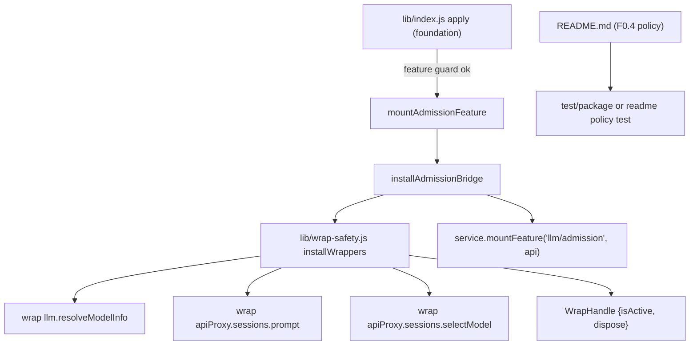
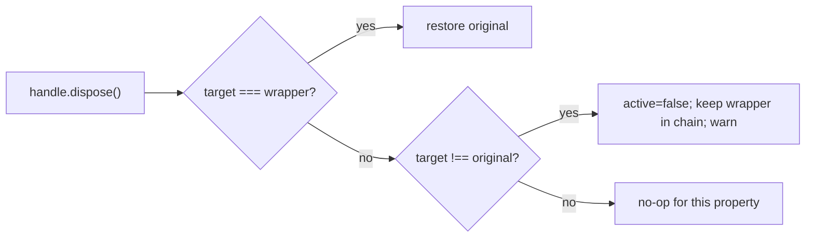

# Design: plugin-api-facade-integrity

## Overview

`plugin-api-facade-integrity` 把门面的两项完整性契约显式化并落地为可复用实现：

1. **F0.4 符号解析门面**：`ctx.pluginApi` 是推荐、受支持的符号解析面；直连 `@deepseek-ai/dsh-*` 内部包是 unsupported escape hatch。本设计不新增命名空间，只确立权威定义、用户文档落点与测试约束。
2. **F0.5 包装链安全**：把 `lib/admission-bridge.js` 中已交付的 identity-guard 语义抽成共享 helper（新模块 `lib/wrap-safety.js`），`admission-bridge` 重构为它的客户端；行为与 `llm-image-admission` 基线完全一致。

依赖关系（requirements 已确认）：

- 前置：`plugin-api-foundation`（F0.1–F0.3）的 `ctx.pluginApi` 服务、分层 guard、版本协商。
- 迁移基线：`llm-image-admission` 的 `admission-bridge` 及其回归测试。
- 权威定义：本 design 是 F0.4/F0.5 的权威实现设计；`plugin-api-foundation/requirements.md` §2 在 Stage 4 增加指向本 spec 的引用指针。

---

## 钩子引出机制（本仓库必填）

| 能力 | 类型 | 引出机制 | 失败路径与 guard 策略 |
|---|---|---|---|
| F0.4 符号解析门面 | 门面基础 / policy | 依赖已交付的 `ctx.pluginApi` 服务；文档落点 `README.md`，权威定义在本 spec | 未暴露符号 → 已交付的 typed inactive/feature-disabled 错误或文档化 `undefined` 路径；不返回半初始化符号 |
| F0.4 escape hatch | 门面基础 / policy | 门面不拦截、不 patch、不 block 直连内部包 | 无运行时失败路径；策略由 README + package/manifest 测试验收 |
| F0.5 包装链安全 helper | 门面基础 / reusable module | 新模块 `lib/wrap-safety.js`：`installWrappers(specs)` 记录原始引用、品牌标记、identity-guard dispose | 目标缺失/畸形 → 返回 `{installed:false, invalid:true}`，不装半截，由 feature 层禁用该 feature；helper 不抛穿 apply |
| F0.5 degrade（透明降级） | 门面基础 / chain-safety | dispose 时若 `target[property] !== wrapper` 且 `!== original`，只把 handle 的 `active` 置 false 并 warn，不还原任何引用 | wrapper 内 `isActive()` 为 false 时直接原样调用 `original`，无可观察变更 |
| `llm/admission` bridge 重构 | B 类（门面内部包装） | `admission-bridge.js` 改为 `installWrappers` 的客户端，包装 `llm.resolveModelInfo` / `sessions.prompt` / `sessions.selectModel` | 行为与 `llm-image-admission` §5 基线一致；feature guard 失败时不安装任何 admission hook |

---

## Architecture





---

## Components and Interfaces

### 1. `lib/wrap-safety.js` — shared chain-safety helper（新模块）

零 harness 依赖纯模块。核心接口：

```js
createWrapSafety({ marker = Symbol('dsh-plugin-api.wrap-safety') } = {}) // -> { installWrappers }

installWrappers(specs, { logger } = {}) // -> WrapHandle
```

`specs`：数组，每项 `{ target, property, wrapperFactory }`。

- `mark(wrapper)` 使用 `Object.defineProperty(marker, { value: true, configurable: false, enumerable: false, writable: false })`，与现状 `admission-bridge.js` 第 17–25 行一致；marker 打在 wrapper 函数上。`admission-bridge` 重构时可保留 `ADMISSION_WRAPPER_MARKER`（`Symbol.for('dsh-plugin-api.llm-image-admission')`）传入 `createWrapSafety`，或接受缺省 marker 并断言既有回归测试仍识别为 own-wrapper。
- `wrapperFactory({ original, isActive })` 返回 wrapper 函数；wrapper 内通过 `isActive()` 判断是否降级透传。
- `installWrappers` 行为：
  1. **先全部校验**：所有 `target` 是对象、`target[property]` 是函数；任一不合法 → 返回 `{ installed:false, invalid:true, reason, isActive:()=>false, dispose:noop }`，**不装半截**。
  2. **防嵌套**：任一 `target[property]` 已带品牌 marker → 返回 `{ installed:false, alreadyWrapped:true, isActive:()=>true, dispose:noop }`。`isActive:()=>true` 继承 `admission-bridge.js` 现状（先装者拥有链）；含义是“该链当前由门面拥有”，而非“wrapper 此刻必然在执行投影”。
  3. **安装**：记录所有 `original`；创建并 `mark()` 所有 wrapper；按 spec 顺序赋值；共享一个 `active=true`。`active` 是共享单一开关：dispose 时任一 property 进入 degraded 都会把 `active` 置 false，从而该 handle 的全部 wrapper 转为透传；这与 `admission-bridge.js` 现状（任一 property degrade 即整体 degrade）等价。
  4. **返回** `WrapHandle = { installed:true, isActive:()=>active, dispose }`。
- `dispose()`（幂等）：
  - 首次调用后 `active=false` 并标记 disposed；重复调用 no-op。
  - 对每个 spec：若 `target[property] === wrapper` → 还原 `original`；否则若 `target[property] !== original` → 记入 `degraded` 并 warn。
  - 不删除、不替换任何“非自己”的引用。

### 2. `lib/admission-bridge.js` — 重构为 helper 客户端

> 接口名以已交付代码为准：服务挂载用 `lib/plugin-api-service.js` 的 `mountFeature(name, api)`；feature 状态表用 `lib/feature-registry.js` 的 `mount(name)` / `disable(name, reason)`。

- 删除本地的 `mark` / `isMarked` / `ADMISSION_WRAPPER_MARKER` 实现，改为使用 `createWrapSafety`（可保留 `ADMISSION_WRAPPER_MARKER` 作为兼容导出或迁移到 helper）。
- 保留 `boundariesValid` 预检、`AsyncLocalStorage` 作用域、`registry.matches` 调用、`inputModalities` 追加逻辑不变。
- 三个 wrapper 都通过 `wrapperFactory({ original, isActive })` 创建，并在入口检查 `isActive()`；`isActive()===false` 时直接 `original.call(...)`，实现透明降级（prompt/selectModel 也不创建 AsyncLocalStorage 作用域）。
- `installAdmissionBridge` 返回的 `isActive` 从 `WrapHandle.isActive` 派生；`dispose` 委托给 `WrapHandle.dispose`。

### 3. F0.4 文档落点

- 权威政策：本 spec `requirements.md` §1。
- 用户文档：根 `README.md` 保留并强化“推荐入口 `inject: ['pluginApi']` + unsupported escape hatch”两段；Stage 4 增加一行引用本 spec 与 `isActive/features/assertCompatible` 的既有说明（若已存在则仅做最小修订）。
- `plugin-api-foundation/requirements.md` §2 增加一行指针：“F0.4 的权威定义见 `plugin-api-facade-integrity/requirements.md` §1”。

### 4. 测试组件

- 新增 `test/wrap-safety.test.mjs`：纯 mock 边界矩阵。
- 新增/扩展 `test/package.test.mjs`（或独立 `test/readme-policy.test.mjs`）：断言 `README.md` 同时包含推荐入口与 escape hatch 措辞。
- 既有 `test/admission-bridge.test.mjs`、`test/admission-registry.test.mjs`、`test/projection-guard.test.mjs` **不改断言**，作为迁移等价基线。

---

## Data Models

```ts
type WrapSpec = {
  target: object
  property: string | symbol
  wrapperFactory: (deps: { original: Function, isActive: () => boolean }) => Function
}

type WrapHandle = {
  installed: boolean
  alreadyWrapped?: boolean
  invalid?: boolean
  reason?: string
  isActive: () => boolean
  dispose: () => void
}
```

---

## Error Handling

1. **helper 永不 throw**：`installWrappers` 任何输入都通过返回值表达失败；`dispose` 永不 throw。
2. **不装半截**：任一 spec 非法或已标记，整体不安装；已标记场景返回 no-op handle（保留“先装者拥有链”的基线语义）。
3. **透明降级**：`dispose` 发现目标已被其他插件包装时，只把 `active` 置 false 并 warn；wrapper 仍在链上但原样透传，**不删除、不还原任何目标引用**。
4. **feature 集成**：`admission-bridge` 拿到 `invalid` handle 时返回 `isActive:false`，由 foundation 的 feature 循环禁用 `llm/admission` 并显式报错（不抛穿 apply）。
5. **日志**：helper 通过注入的 `logger`（缺省 no-op）输出 warn，不依赖 `ctx.logger` 存在。

---

## Testing Strategy

- 运行器：`node --test`。
- `wrap-safety.test.mjs`：
  - own-wrapper dispose 还原全部原始引用；
  - foreign-wrapper degrade：目标被外部包装后 dispose，断言外部 wrapper 仍在、我们的 wrapper 仍在链上且透明（原样透传），并有 warn；
  - repeated install 不嵌套（同一 marker 返回 alreadyWrapped no-op）；
  - double dispose 幂等；
  - malformed target / 非函数 property → invalid，无半截安装；
  - 多个 property 中一个非法 → 所有 property 均未被改写。
- `readme-policy.test.mjs`：断言 `README.md` 含推荐入口与 escape hatch 措辞。
- 回归基线：`admission-bridge.test.mjs` 等既有测试不改断言、必须通过。
- 全量 `node --test`。

---

## Requirements coverage matrix

| Requirements 章节 | 设计落点 |
|---|---|
| 1. Recommended symbol-resolution facade | Components 3；README 落点；policy 测试 |
| 2. Chain-safety contract | Components 1/2；Architecture degrade 图；Error Handling 3 |
| 3. Reusable chain-safety helper | Components 1；Data Models；Error Handling 1–2 |
| 4. Migrate llm/admission to helper | Components 2；回归基线测试 |
| 5. Testability and regression coverage | Testing Strategy |
