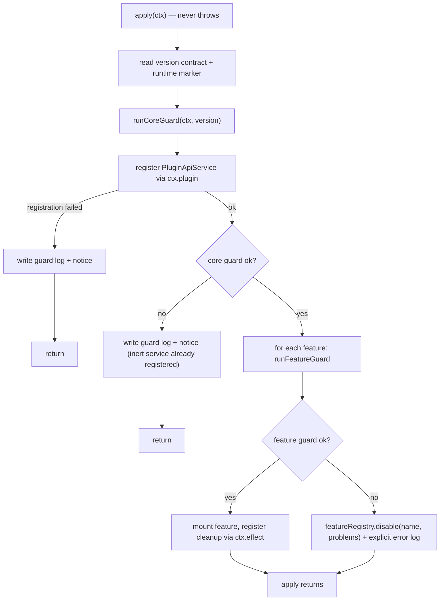

# Design: plugin-api-foundation

> **公共契约现状注（2026-08-29 追加）**：本制品成文于目标领域树 cutover 之前，文中的公共 path 为旧命名。现行命名以 [`public-contract.registry.json`](../plugin-api-m7-public-contract-refactor/public-contract.registry.json) 的 `oldToTargetMapping` 为唯一权威，本制品涉及的映射如下：
>
> | 本制品使用的旧 path | 现行 path |
> |---|---|
> | `pluginApi.features`（feature 启用/禁用快照） | **已删除**；替代为 `pluginApi.capabilities`（`get` / `list` / `require`，registry-backed 能力描述 + availability） |
>
> 现行契约基线：包版本 `0.1.0-rc.6-0.1.0`（runtime `0.1.0-rc.6` / `dsh.api` `0.1`）；版本模型为 `<A>-<B>.<C>.<D>`（本制品写作时仍为 `<runtime>-<B>.<C>`），本制品中出现的 `0.1.0-rc.6-0.x` 为历史交付边界记录，不代表现行版本。本注只更新命名与版本指针，不改动本制品已获批的 Goal / Requirements 验收边界。

> **M2 supersession note:** F0.3 version policy and the foundation guard remain policy foundations, but any admission-bridge or projection-guard implementation reference in this historical M0 design is obsolete. The current L2 owner is solely `lib/llm-admission-gateway.js`; do not reintroduce a foundation-level wrapper or the historical bridge.
>
> **Rename/version pointer（`plugin-api-compaction-events-r1`）**：主包现已更名为 `@deepseek-ai/dsh-plugin-api-main`（row id `plugin-api-main`，Cordis 服务 key 仍为 `pluginApi`），monorepo 工作区见根 `pnpm-workspace.yaml` / `packages/`；唯一 full version 为 `0.1.0-rc.6-0.4` / `dsh.api: 0.4`。本文历史正文保留原始 M0 记录。
>
> **权威指针（`plugin-api-session-title-r1`）**：上行为 compaction-events-r1 承接的 boundary；现行 authority 为 `0.1.0-rc.6-0.5` / `dsh.api: 0.5`（由 `plugin-api-session-title-r1` 承接），见 AGENTS.md §8 与 README。
>
> **维护修订（包政策推行）**：`lib/guards.js` 的核心 guard 仍只校验主包自身；辅助包各自在 apply 内校验自身全量唯一版本与主包一致，主包在装配 replacement catalog slice 时也按已安装辅助包的 `version`/`dsh.api` 二次校验。任一辅助包不匹配时只排除该 R slice 并记录一次显式诊断，替代行本身降级为官方原接口提供者，主包其余 feature 照常 active。聚合 bundle `packages/full/` 只做确定性 patch 装配，不含任何 API 代码。

## Overview

`plugin-api-foundation` 是 `dsh-plugin-api` 的 M0 基础三件套，设计目标是把“门面如何安全存在”这件事一次做对：

1. **F0.1 门面服务**：`ctx.pluginApi` 作为推荐、受支持的门面入口，通过 Cordis `Service` 注册；第三方插件 `inject: ['pluginApi']` 即可获得，不强制、不拦截直连官方内部包（unsupported escape hatch）。
2. **F0.2 分层 fail-safe guard**：核心 guard 失败 → 服务 inert；仅非核心 feature guard 失败 → 门面照常 active，只禁用该 feature 并显式报错。
3. **F0.3 双向版本协商**：门面对 DSH runtime（不匹配 → 门面 inert）；第三方插件对门面（不匹配 → 插件收到 typed 错误，门面保持 active）。

本设计只覆盖 host 侧。client bundle / remote / slot 属于 M3，不在本 spec 内。

---

## 源码调研结论

- Cordis 服务注册机制：`Service` 基类构造函数调用 `ctx.reflect.provide(name, self, check)`，服务随 owning fiber 自动移除；`ctx.plugin(PluginClass)` 会实例化插件并运行其构造。
  - 源码：`@deepseek-ai/cordis/lib/index.js`（`Service` class）、`lib/types/service.d.ts`、`lib/types/registry.d.ts`。
- `ctx.get(name)` 来自 Cordis reflect 层，可在 apply 中探测未注入的服务；现有代码已用 `ctx.get('apiProxy')` 证明该模式可用（`lib/index.js:90`）。
  - 因此本设计的 host 插件 `inject` 降为 `[]`：核心服务注册不依赖任何注入；各 feature 用 `ctx.get` 探测它需要的官方服务。这消除了“服务改名即 pending 杀死 boot”的挂点（与 G1 对齐）。
- 官方 DSH root 包版本为 `0.1.0-rc.6`；`@deepseek-ai/dsh-llm/package.json` 暴露 `./package.json` 且版本同为 `0.1.0-rc.6`，可作为 runtime 版本探针。
  - 源码：`@deepseek-ai/dsh-llm/package.json`（`exports["./package.json"]`）。
- G1 总保险丝模式（apply 永不抛错、guard 失败只记录并安静停用、日志写 `~/.dsh/logs/*-guard.log`）来自 `../dsh-read-image/docs/known-hacks.md` G1 节，本设计沿用并细化为“核心 / feature 两级”。

---

## 钩子引出机制（本仓库必填）

| 钩子/能力 | 类型 | 引出机制 | 失败路径与 guard 策略 |
|---|---|---|---|
| `ctx.pluginApi` 服务 | 门面基础 | `ctx.plugin(PluginApiService)` 注册 Cordis `Service`（名称 `pluginApi`），随 owning fiber 自动移除；注册前用品牌符号检测 `ctx.get('pluginApi')`：已有本门面实例则复用，已有外部同名服务则不覆盖 | 核心 guard 失败（非注册原语）→ 仍注册 inert 服务（`isActive:false`）；`ctx.plugin`/`ctx.reflect.provide` 缺失 → 不注册服务、不预置全局状态，Cordis 原生 missing-service；已有外部同名服务 → 不覆盖，仅写日志并正常 return |
| `pluginApi.isActive` | 门面基础 | 服务实例字段，反映核心 guard 结果 | 永远可读，不抛错 |
| `pluginApi.features` | 门面基础 | feature registry 的只读快照 | 永远可读，不抛错 |
| `pluginApi.assertCompatible(requirement, pluginName?)` | 门面基础 | 纯函数版本比较（`lib/version.js`） | 不匹配抛 typed `PluginApiVersionError`；core inert 时抛 `PluginApiInactiveError` |
| `pluginApi.llm.admission`（首 feature） | B 类 | 现有 `lib/admission.js` + `lib/admission-bridge.js` + `lib/projection-guard.js` 迁移为 feature 挂载协议 | 该 feature 的 guard 失败 → 仅 `llm.admission` 禁用并显式报错，门面保持 active |
| escape hatch（直连内部包） | policy | 门面不拦截、不 patch、不 block；仅文档声明 unsupported | 无运行时失败路径 |

---

## Packaging and row order

- 包名（历史 M0 为 `@deepseek-ai/dsh-plugin-api`，现主包）：`@deepseek-ai/dsh-plugin-api-main`。
- `package.json`：
  - `"type": "module"`；`main`/`exports` 指向 `lib/index.js`。
  - `"version": "0.1.0"`（门面自身版本，`major.minor` 归一为 `0.1`）。
  - `"dsh": { "api": "0.1", "bundle": { "patch": "./cordis.patch.yml" } }`：`dsh.api` 是本门面 API 契约版本（`major.minor`），仅用于方向 ②；方向 ① 使用完整 runtime identity。

> **修订注记（`plugin-api-m2-integration` Task 8.2）**：版本号语义规范化。`package.json.version` 采用全量唯一格式 `<runtime全量版本>-<API协议大版本.迭代小版本>`（如 `0.1.0-rc.6-0.3`，由 `parseFacadeVersion` 解析为 `{ runtime, api }`）。方向 ① 要求 `version` 中的完整 runtime 部分与实际安装 runtime（`dsh-llm` 探针）精确相等，包含 patch 与 prerelease；`dsh.api` 只承载 API 协议版本，仅用于方向 ②（`assertCompatible`）。core guard 探针为 `dsh.api`（格式）、`facade version`（全量格式可解析且 api 部分与 `dsh.api` 一致）、`runtime version`（完整 runtime identity 精确匹配）。
  - `peerDependencies`：`@deepseek-ai/cordis`、`@deepseek-ai/dsh-llm`（共享宿主实例；`dsh-llm` 同时是 runtime 版本探针）。
- `cordis.patch.yml`：保持现有 insert row（历史 id `plugin-api`，现改为 `id: plugin-api-main`）。
- Row 顺序硬约束不变：本插件必须先于第三方插件加载，否则 `inject: ['pluginApi']` 的第三方插件会 pending 并杀死 boot。

---

## Architecture



```mermaid
flowchart LR
    THIRD["third-party plugin"] -->|inject: ['pluginApi']| API["ctx.pluginApi"]
    API --> STATE["isActive / version / features"]
    API --> ASSERT["assertCompatible(req)"]
    API --> FEAT["llm.admission (when active)"]
    FEAT --> BRIDGE["AdmissionBridge + ProjectionGuard (existing B-class feature)"]
    THIRD -.->|unsupported escape hatch| RAW["direct @deepseek-ai/dsh-* imports"]
    RAW -.->|facade does not intercept| OFFICIAL["official internal packages"]
```

---

## Service registration idempotence and missing-registration behavior

- `PluginApiService` 带一个模块内品牌符号（`Symbol.for('@deepseek-ai/dsh-plugin-api/pluginApi')` 或等价的模块级 symbol），服务实例上设置该品牌字段。
- `apply` 在注册前调用 `safeGet(ctx, 'pluginApi')`：
  - 返回**本门面品牌**的实例 → 复用该实例，不再调用 `ctx.plugin`；后续 feature 状态对该实例的 `featureRegistry` 做幂等 reconcile（`mount`/`disable` 覆盖同名 feature 状态）。
  - 返回**外部同名服务** → 不覆盖、不冲突，写日志并正常 return（fail-safe）。
  - 返回 `undefined` → 走 `ctx.plugin(createPluginApiService(...))` 注册。
- 重复 apply（HMR/reload）因此不会产生第二次 `provide('pluginApi')`；Cordis `reflect.provide` 对同一 scope 重复注册会抛 `service "pluginApi" has been registered`（源码 `cordis/lib/index.js` `provide()`），本策略在注册前规避了该冲突。
- 当 `ctx.plugin` 或 `ctx.reflect.provide` 缺失时：不注册服务、不设置任何模块级/全局状态；`pluginApi` 消费者看到的是 Cordis 原生 missing-service 行为。

---

## Components and Interfaces

### 1. `lib/index.js` — host plugin orchestration

```js
export const name = 'dsh-plugin-api'
export const inject = []          // 核心不依赖注入；feature 用 ctx.get 探测
export function apply(ctx) { ... } // 永不 throw
```

`apply` 控制流（全部包在 try/catch 中）：

1. 读取版本契约：`readOwnManifest()` 取 `package.json` 的 `version` 与 `dsh.api`；`readRuntimeMarker()` 取 `@deepseek-ai/dsh-llm/package.json` 的 `version`。两者任一不可读/不可解析 → 生成 core problem。
2. 运行核心 guard：`runCoreGuard(ctx)` 探测 `ctx.plugin`、`ctx.reflect.provide`、`ctx.effect`（feature 挂载清理需要，core 自身不强依赖）与版本契约。
3. 注册服务：`ctx.plugin(createPluginApiService({ apiVersion, registry, coreActive }))`。注册失败 → 写 guard 日志并 return。
4. 若 core 失败：写 guard 日志 + 前台双语 notice，return（服务已注册为 inert）。
5. 若 core 通过：遍历 feature 清单（本阶段只有 `llm/admission`）：
   - 跑 `runFeatureGuard(featureName, ctx, deps)`；
   - 通过 → `mountFeature`，并用 `ctx.effect(() => disposer, ...)` 注册清理；`ctx.effect` 不可用时，凡需要清理的 feature 不挂载并记录 feature problem；
   - 失败 → `featureRegistry.disable(name, problems)`，并显式 `logger.error` 一行双语信息（详情写 guard 日志）。
6. 任何意外异常 → 最终 catch：写日志并 return，绝不抛穿。

### 2. `lib/plugin-api-service.js` — 门面服务

```js
createPluginApiService({ apiVersion, registry, coreActive }) // returns class PluginApiService extends Service
```

服务实例形状：

```js
ctx.pluginApi = {
  isActive: boolean,               // core 是否通过
  apiVersion: '0.1',               // 来自 package.json dsh.api（major.minor）
  features: FeatureState[],        // [{ name, isActive, reason? }]
  assertCompatible(requirement, pluginName?), // 不匹配抛 PluginApiVersionError
  llm: { admission: ... },         // feature active 时挂载；否则该属性仍存在，调用其方法抛 PluginApiFeatureDisabledError
}
```

规则：

- `isActive`、`apiVersion`、`features` 是状态只读字段，core inert 时也可读。
- core inert（`isActive === false`）时，其余 API 方法抛 `PluginApiInactiveError`。
- feature disabled 时，该 feature 的方法抛 `PluginApiFeatureDisabledError`。
- **官方服务隔离**：inert 或 disabled 状态下，任何门面方法在抛错之前 SHALL NOT 调用任何官方服务；状态检查必须是纯本地判断。

### 3. `lib/guards.js` — 两级 guard 框架

```js
runCoreGuard(ctx, { apiVersion, runtimeMarker })   // -> GuardResult
runFeatureGuard(featureName, ctx, deps)            // -> GuardResult
writeGuardLog(problems, path?)                     // -> path | null
guardFailNotice(logPath)                           // -> string (bilingual)
```

- 所有 probe 单项 try/catch，敌意 `ctx`（throwing getters）降级为 problem，**永不抛错**。
- 核心 probe：
  - `ctx.plugin`：能否注册服务；
  - `ctx.reflect.provide`：Service 构造函数所需；
  - `version.api` 可读且格式为 `^\d+\.\d+$`；
  - `version.runtime` 可读且与安装 runtime 的完整 identity 精确相等（方向 ①）。
- Feature probe（`llm/admission`）：
  - 必须：`ctx.get('llm').resolveModelInfo`、`ctx.get('agents').get`、`dshLlm.contentHasImage`、`AsyncLocalStorage`；
  - 必须：`ctx.get('apiProxy').sessions.prompt/selectModel`（无 apiProxy 时该 feature 无准入边界，整个 feature 禁用并显式报错，而不是门面 inert）。
- **feature guard 失败时的硬规则**：`runFeatureGuard` 返回 `ok:false` 时，调用方 SHALL NOT mount 该 feature，SHALL NOT 为该 feature 注册任何清理 effect；只允许 `featureRegistry.disable(name, problems)` + 显式日志。
- 环境变量保留：
  - `DSH_PLUGIN_API_GUARD_DISABLE=1`：跳过全部 guard，强制按通过处理；
  - `DSH_PLUGIN_API_FORCE_GUARD_FAIL=1`：强制 core 失败（测试用）。
- 日志：`~/.dsh/logs/dsh-plugin-api-guard.log`（覆盖写、路径恒定）；前台只打一条双语 notice。

### 4. `lib/feature-registry.js` — 纯函数 feature 状态表

```js
createFeatureRegistry() // -> { mount, disable, snapshot, isActive, assertActive }
```

- `mount(name)`：标记 feature active。
- `disable(name, reason)`：标记 feature disabled，保存 reason。
- `snapshot()`：返回 `FeatureState[]`。
- `assertActive(name)`：disabled 时抛 `PluginApiFeatureDisabledError`；core inert 时由服务层先抛 inactive。

该模块零 harness 依赖，`node --test` 直测。

### 5. `lib/version.js` — 纯函数版本契约

```js
normalizeVersion('0.1.0-rc.6') // -> '0.1'（major.minor）
parseContract('0.1')           // -> '0.1' 或 null
satisfiesContract('0.1', '0.1.0-rc.6') // -> true（归一化后相等）
```

- 契约采用 `major.minor`，patch/prerelease 视为兼容；这是门面 API 兼容粒度（minor 级别）的刻意简化。
- 不引入 semver 运行时依赖；只实现这一小段比较逻辑并单测。

### 6. `lib/errors.js` — typed errors

```js
class PluginApiError extends Error { code, message }
class PluginApiInactiveError extends PluginApiError        // code: 'PLUGIN_API_INACTIVE'
class PluginApiFeatureDisabledError extends PluginApiError // code: 'PLUGIN_API_FEATURE_DISABLED', feature
class PluginApiVersionError extends PluginApiError         // code: 'PLUGIN_API_VERSION_MISMATCH', declared, required
```

---

## Data Models

```ts
type Problem = {
  name: string
  detail: string
  feature?: string        // 缺省为 core
}

type GuardResult = {
  ok: boolean
  skipped: boolean
  problems: Problem[]
  coreProblems: Problem[]
  featureProblems: Record<string, Problem[]>  // 按 feature 分组
}

type FeatureState = {
  name: string            // e.g. 'llm/admission'
  isActive: boolean
  reason?: string         // disabled 时的可读原因
}
```

---

## Error Handling

1. **apply 永不抛错**：`apply` 的每一步都在 try/catch 内；`ctx.logger` 的调用也包 safe wrapper（logger 抛错不能击穿 fail-safe 路径）。
2. **core 失败**：服务仍注册为 inert（`isActive:false`）；完整诊断写 `~/.dsh/logs/dsh-plugin-api-guard.log`；前台一条双语 notice；不装任何 hook。
3. **feature 失败**：`featureRegistry.disable` + `logger.error` 显式报错；门面保持 active；调用禁用 feature 的方法抛 `PluginApiFeatureDisabledError`。
4. **版本失败**：
   - 方向 ① runtime 不匹配/不可解析 → core problem，走 core 失败路径。
   - 方向 ② 插件要求不满足 → `assertCompatible` 抛 `PluginApiVersionError`；门面保持 active；插件应 catch 后自行 fail-safe（不继续调用门面 API）。
5. **平台级缺口**：门面不卸载/终止不兼容插件；阻止插件在 apply 前被加载属于 C 类上游提案（本 spec 不展开）。
6. **escape hatch**：门面对直连内部包不做任何拦截、包装或告警；直连插件的失败由其自身承担。

---

## User-facing documentation landing points

- 推荐门面入口 + unsupported escape hatch 的用户文档落在**仓库根 `README.md`**（Stage 4 任务创建/更新），并在 `docs/specs/plugin-api-foundation/requirements.md` 中保留规范性定义。
- 验收时检查 `README.md` 是否存在以下内容：
  - “第三方插件默认使用 `inject: ['pluginApi']`，由门面提供稳定性/版本协商/fail-safe 保障”；
  - “可直连 `@deepseek-ai/dsh-*` 内部包，但该路径是 unsupported escape hatch，无兼容承诺、自担风险”；
  - `ctx.pluginApi.isActive` / `features` / `assertCompatible` 的简要用法说明。

---

## Testing Strategy

- 测试运行器：`node --test`。
- 零 harness 依赖纯模块测试：
  - `version.test.mjs`：normalize、parse、satisfies、缺失/不可解析。
  - `feature-registry.test.mjs`：mount/disable/snapshot/assert。
  - `guards.test.mjs`：核心 probe 矩阵、feature probe 矩阵、敌意 ctx、环境变量开关、guard 日志与 notice。
- 集成测试（mock Cordis context）：
  - `plugin-api-service.test.mjs`：core active 与 inert 两种状态下的方法行为、typed errors、features 快照。
  - `index.test.mjs`：`apply` 在 core 失败/feature 失败/成功三种路径下均不 throw；断言 hook 只装在健康 feature 上；断言服务注册行为；**escape-hatch 不干预用例**：第三方插件直连 mock 内部包时，断言门面不拦截、不包装、不改变该交互。
  - `version-negotiation.test.mjs`（集成）：`assertCompatible` 三态——active 且满足（放行）、active 且不满足（抛 `PluginApiVersionError` 且门面保持 active）、core inert（抛 `PluginApiInactiveError`）；并断言 mismatch 后该插件未继续调用任何门面 API。
- 回归测试：现有 `admission-bridge.test.mjs`、`admission-registry.test.mjs`、`projection-guard.test.mjs` 必须继续通过，证明 `llm/admission` 迁移到 feature 挂载协议后行为不变。
- 环境开关测试：`DSH_PLUGIN_API_GUARD_DISABLE=1`、`DSH_PLUGIN_API_FORCE_GUARD_FAIL=1` 的优先级与当前语义保持一致。

---

## Requirements coverage matrix

| Requirements 章节 | 设计落点 |
|---|---|
| 1. Facade service registration and injection | Architecture；Components 1/2；Packaging row order |
| 2. Recommended facade and unsupported escape hatch | Overview；钩子引出机制表 escape hatch 行；Error Handling 6 |
| 3. Layered fail-safe guard | Architecture flowchart；Components 3/4；Error Handling 1–3 |
| 4. Bidirectional version negotiation | Components 5；Error Handling 4；Packaging `dsh.api` |
| 5. Testability and regression coverage | Testing Strategy |
