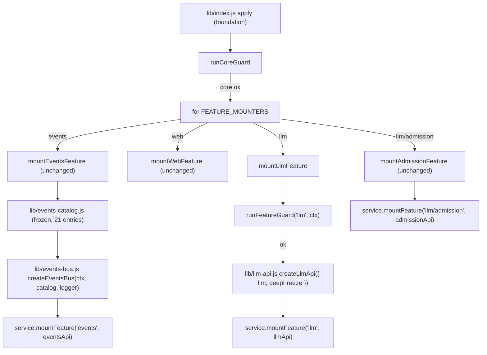

# Design: plugin-api-llm-m1

> **M2 amendment:** The L7/L8/L9 direct seams remain authoritative except for the narrow
> L8 compat-observation amendment recorded in
> `docs/specs/plugin-api-llm-request-m2/supersession.md`. Historical statements that
> `llm/admission` is unchanged or that `llm/stream` cannot be observed by compat transforms
> are not current guidance; L2/L4 owns the single scoped `resolveModelInfo` wrapper.

## Overview

`plugin-api-llm-m1` 把 feature-list 中的 **L3、L6、L7、L8、L9** 落地为两个 host 侧门面能力：

1. **`pluginApi.events` 目录扩展（L3/L6）**：在已交付的 `plugin-api-events-m1` 事件目录中追加两个官方 `dsh-llm` 事件：
   - `llm/stream`（waterfall，请求边界）；
   - `llm/adapters-updated`（emit，adapter 拓扑通知，官方无 payload）。
2. **`pluginApi.llm` 服务直通（L7/L8/L9）**：在 `pluginApi.llm` 命名空间上（与已交付的 `llm.admission` 并列）追加六个官方 `llm` 服务方法的稳定直通：
   - `modelInfo(provider, model, signal?)`；
   - `prepareCall(config, signal?)` / `stream(options)`；
   - `registerAdapter(providers, adapter)` / `registerConfigurableProviders(entries)` / `registerModelDiscovery(settingsNs, discover)`。

依赖已交付的 `plugin-api-foundation`（服务、guard、版本协商）、`plugin-api-facade-integrity`（门面完整性）、`plugin-api-events-m1`（事件总线 + 目录）与 `llm-image-admission`（`pluginApi.llm.admission` 已存在）。本 feature 全部为 A 类稳定化：不包装官方边界、不新增包装链、不修改官方 DSH 包。

---

## 源码调研结论

### `dsh-llm` 官方能力（`/usr/lib/node_modules/@deepseek-ai/dsh/node_modules/@deepseek-ai/dsh-llm/`）

| 官方能力 | 源码位置 | 关键事实 |
|---|---|---|
| `llm/adapters-updated` | `lib/index.js:926-942` | `emitAdaptersUpdated()` 经 `this.ctx.events.dispatch("emit", ["llm/adapters-updated"])` 派发；**listener 实参为 `()`（无 payload）**；官方逐个 contain 普通 listener，但 `INVARIANT` 错误会聚合后 rethrow |
| `registerAdapter(providers, adapter)` | `lib/index.js:956-975` | 返回 `AdapterRegistrationHandle`（可调用 disposer + `.replace`）；空 providers / 非法 metadata / 重复 provider 抛 `LlmError`（`INVALID_ADAPTER` / `DUPLICATE_ADAPTER`）；内部 `commitRoutes` 会触发 `emitAdaptersUpdated()` |
| `registerConfigurableProviders(entries)` | `lib/index.js:1033-1076` | 返回 `DirectoryRegistrationHandle`；空 entries / 非法 entry / 重复 provider 抛 `LlmError`（`INVALID_DIRECTORY` / `DUPLICATE_DIRECTORY`）；内部 commit 触发 `emitAdaptersUpdated()` |
| `registerModelDiscovery(settingsNs, discover)` | `lib/index.js:1097-1107` | 返回 disposer `() => void`；空 namespace / 重复 namespace 抛 `LlmError`（`INVALID_DISCOVERY` / `DUPLICATE_DISCOVERY`） |
| `resolveModelInfo(provider, model, signal?)` | `lib/index.js:1179-1181`；类型 `lib/types/index.d.ts:294` | `async`，返回 detached `LlmResolvedModelInfo`（每次调用新建对象，**不共享 adapter 内部对象**）；`signal` 传给 adapter 的 `resolveModel` |
| `prepareCall(config, signal?)` | `lib/index.js:1269-1294`；类型 `lib/types/index.d.ts:316` | `async`，返回 `PreparedLlmCall`（顶层 `Object.freeze`，`config`/`context`/`adapterDefaults` 已 deepFreeze；含 `stream(options)` 一次性派发入口） |
| `stream(options)` | `lib/index.js:1385-1387` | 同步返回 `streamWithRegistration(options)`；**内部** `streamWithRegistration`（L1388-1389）执行 `ctx.waterfall(this, "llm/stream", options, () => adapterStream(options, prepared))`，因此 `llm/stream` 是官方派发的 waterfall，listener 实参为 `(options, next)` |
| `Events['llm/stream']` 类型 | `lib/types/index.d.ts:43` | `(this: LlmRuntime, options: GenerateOptions, next: () => AsyncIterable<StreamChunk>): AsyncIterable<StreamChunk>`；`next()` 到达官方 adapter 流 |

### 相关官方类型

- `LlmResolvedModelInfo`：`lib/types/types.d.ts:251`（`provider/id/name` + 可选 `description/inputModalities/context/defaultMaxTokens/reasoning`）。
- `LlmCallConfig`：`lib/types/call-config.d.ts:16`（`provider/model/reasoningEffort?/temperature?/maxTokens?/stop?`）。
- `LlmConfigurableProvider`：`lib/types/types.d.ts:150`；`LlmModelDiscoveryRequest`：`lib/types/types.d.ts:178`。
- `GenerateOptions`：`lib/types/types.d.ts:312`（`provider/model/messages` 必填，`signal/sessionId/purpose` 等可选）。

### 本仓库现状

- `lib/events-catalog.js`：已有 19 个冻结目录条目，条目形状含 `name/mode/scopeFiltered/subject/payload/args/source/type`。本设计只追加 2 个条目并更新注释与测试。
- `lib/plugin-api-service.js`：`PluginApiService` 构造时提供 disabled stubs（`llm.admission`、`events`、`web`）；`mountFeature` 当前认识 `llm/admission`、`events`、`web`。本设计新增 `llm` feature 名与 `createDisabledLlmApi`。
- `lib/guards.js`：`runFeatureGuard` 当前认识 `llm/admission`、`events`、`web`。本设计新增 `llm` 分支。
- `lib/index.js`：`FEATURE_MOUNTERS` 当前为 `events`、`web`、`llm/admission`。本设计插入 `llm`，并新增 `mountLlmFeature`。
- `lib/deep-freeze.js`：已有 `deepFreeze(value)`，永不 throw、函数与 primitive 原样返回、循环安全。`modelInfo` 直接复用它做只读返回。

---

## 钩子引出机制（本仓库必填）

| 能力 | 类型 | 引出机制 | 失败路径与 guard 策略 |
|---|---|---|---|
| `llm/stream` 类型化（L3） | A | 追加 `eventsCatalog` 条目（`mode:'waterfall'`、`args:'(options, next)'`、`source:'L3'`）；订阅/派发复用 `plugin-api-events-m1` 事件总线，不新增运行时监听器、不重排官方链 | 目录为静态纯数据，无运行时失败；`events` feature 禁用时订阅/派发按 events-m1 既有 typed error 处理 |
| `llm/adapters-updated` 类型化（L6） | A | 追加 `eventsCatalog` 条目（`mode:'emit'`、`args:'()'`、`source:'L6'`）；订阅复用事件总线 | 同上 |
| `pluginApi.llm.modelInfo`（L7） | A | 直通官方 `llm.resolveModelInfo(provider, model, signal?)`，`await` 后对 detached 结果 `deepFreeze` 再返回（只读） | `llm` feature guard 失败 → 仅 `llm` 服务面禁用（events 目录仍含 L3/L6 条目）；官方方法 throw/reject → 同对象 rethrow/reject |
| `pluginApi.llm.prepareCall` / `stream`（L8） | A | 直通官方 `llm.prepareCall(config, signal?)` / `llm.stream(options)`，返回值原样返回 | 同上；`stream` 不额外 dispatch/监听 `llm/stream` |
| `pluginApi.llm.registerAdapter` / `registerConfigurableProviders` / `registerModelDiscovery`（L9） | A | 直通官方 `llm` 同名方法，返回值原样返回 | 同上；不缓存、不克隆 provider/adapter/entries/discover |
| `llm` feature guard | 门面基础 | `runFeatureGuard('llm', ctx)` 探测 `ctx.get('llm')` 的六个方法 | 任一 probe 失败 → `featureRegistry.disable('llm', ...)` + `featureFailNotice`；`pluginApi` 保持 active；apply 永不 throw |

---

## Architecture



```mermaid
flowchart LR
    PLUGIN["third-party plugin"] -->|inject: ['pluginApi']| API["ctx.pluginApi"]
    API --> EVENTS["pluginApi.events"]
    API --> LLM["pluginApi.llm"]

    EVENTS -->|on/once/waterfall for llm/stream| CTX["delegate to ctx.*"]
    EVENTS -->|on for llm/adapters-updated| CTX
    EVENTS --> CATALOG["events.catalog (frozen)"]

    LLM -->|modelInfo| RM["ctx.get('llm').resolveModelInfo"]
    LLM -->|prepareCall| PC["ctx.get('llm').prepareCall"]
    LLM -->|stream| ST["ctx.get('llm').stream"]
    LLM -->|registerAdapter / registerConfigurableProviders / registerModelDiscovery| REG["ctx.get('llm').register*"]
    LLM --> ADMISSION["llm.admission (delivered, unchanged)"]
```

关键路径：

1. **L7**：`pluginApi.llm.modelInfo(provider, model, signal)` → `await llm.resolveModelInfo(provider, model, signal)` → `deepFreeze(info)` → 返回只读 `LlmResolvedModelInfo`。
2. **L8**：`pluginApi.llm.prepareCall(config, signal)` / `pluginApi.llm.stream(options)` → 直接调用官方同名方法并原样返回。
3. **L9**：三个注册方法 → 直接调用官方同名方法并原样返回注册 handle / disposer。
4. **L3/L6**：`pluginApi.events` 的订阅/派发路径不变；`llm/stream` 与 `llm/adapters-updated` 通过新增目录条目获得 cataloged 事件的全部门面保证（priority、deepFreeze、故障隔离）。

---

## Components and Interfaces

### 1. `lib/events-catalog.js` — 追加 2 个 LLM 目录条目

在 `entries` 数组末尾追加：

| name | mode | scopeFiltered | subject | payload | args | source | type |
|---|---|---|---|---|---|---|---|
| `llm/stream` | `waterfall` | false | `undefined` | `'GenerateOptions (official dsh-llm type); this binding is the LlmRuntime; next(): AsyncIterable<StreamChunk>'` | `'(options, next)'` | `L3` | `A` |
| `llm/adapters-updated` | `emit` | false | `undefined` | `'none'` | `'()'` | `L6` | `A` |

约束：

- 更新文件头注释：目录从“19 个事件名”改为“21 个事件名”；同时修订“25 in-scope features”这一句，改为“events-m1 的 25 个 feature 加上 plugin-api-llm-m1 的 2 个事件 feature（L3/L6）”，避免遗留过期表述。
- 目录保持深冻结，`catalogEntryOf` 行为不变。
- 只追加，不删除、不重命名既有 19 个条目。

### 2. `lib/llm-api.js` — 新模块（host 侧，纯逻辑 + 注入的 `llm` 服务）

零 Cordis import，运行时只依赖传入的 `llm` 服务对象与 `deepFreeze`。

```js
createLlmApi({ llm, deepFreeze }) -> llmApi
```

`llmApi` 形状：

```js
{
  get isActive() { return true },

  async modelInfo(provider, model, signal) {
    const info = await llm.resolveModelInfo(provider, model, signal)
    return deepFreeze(info)
  },

  async prepareCall(config, signal) {
    return llm.prepareCall(config, signal)
  },

  stream(options) {
    return llm.stream(options)
  },

  registerAdapter(providers, adapter) {
    return llm.registerAdapter(providers, adapter)
  },

  registerConfigurableProviders(entries) {
    return llm.registerConfigurableProviders(entries)
  },

  registerModelDiscovery(settingsNs, discover) {
    return llm.registerModelDiscovery(settingsNs, discover)
  },
}
```

精确约束：

- `modelInfo`：
  - `llm.resolveModelInfo` 是 `async`；门面方法也用 `async`，因此官方同步 throw 或异步 reject 都会变成**携带同一个 error 对象**的 rejected promise。
  - 返回前调用 `deepFreeze(info)`；官方结果已 detached（每次新建），冻结不会影响 adapter 内部状态。
  - **不**在 `pluginApi.llm` 上暴露 `resolveModelInfo`。
- `prepareCall`：
  - 官方返回 `PreparedLlmCall`（顶层已 `Object.freeze`）；门面原样返回，**不额外 freeze、不克隆**。
  - `signal` 参数与调用方是否传入保持一致：未传时只传 `config`，传入时传 `(config, signal)`。
- `stream` / `registerAdapter` / `registerConfigurableProviders` / `registerModelDiscovery`：
  - 同步直通；不 catch、不包装、不缓存；官方 throw 时同一错误对象自然 rethrow。
- 所有方法只在 `llm` feature guard 通过后才会被 mount；模块本身不负责 guard。

JSDoc 类型：方法使用 `@param` / `@returns` 描述官方类型（`import('@deepseek-ai/dsh-llm')` 的 `GenerateOptions`、`LlmResolvedModelInfo`、`LlmCallConfig`、`PreparedLlmCall`、`LlmAdapter`、`LlmConfigurableProvider` 等），与当前仓库的 JSDoc 风格一致；本 feature 不新增 `.d.ts` 构建链。

### 3. `lib/plugin-api-service.js` — 扩展服务面

- 新增 `createDisabledLlmApi(active)`：

  ```js
  function createDisabledLlmApi(active) {
    const fail = () => {
      if (!active()) throw new PluginApiInactiveError()
      throw new PluginApiFeatureDisabledError('llm')
    }
    return {
      get isActive() { return false },
      modelInfo: fail,
      prepareCall: fail,
      stream: fail,
      registerAdapter: fail,
      registerConfigurableProviders: fail,
      registerModelDiscovery: fail,
    }
  }
  ```

- 构造函数中 `this.llm` 改为：

  ```js
  this.llm = {
    ...createDisabledLlmApi(active),
    admission: createDisabledAdmissionApi(active),
  }
  ```

- `mountFeature(name, api)` 新增分支：

  ```js
  if (name === 'llm') {
    for (const [key, value] of Object.entries(api)) this.llm[key] = value
    return
  }
  ```

  约束：`llmApi` 不包含 `admission` 键，因此该分支**不会覆盖** `llm/admission`；`llm/admission` 仍由既有分支单独 mount。

### 4. `lib/guards.js` — 新增 `llm` feature guard 分支

`runFeatureGuard(featureName, ctx, deps)` 新增：

```js
else if (featureName === 'llm') {
  probe('ctx.get', 'cannot resolve the official llm service', () => typeof ctx?.get === 'function')
  const llm = () => (typeof ctx?.get === 'function' ? ctx.get('llm') : undefined)
  probe('llm.resolveModelInfo', 'llm model-info query is unavailable', () => typeof llm()?.resolveModelInfo === 'function')
  probe('llm.prepareCall', 'llm call preparation is unavailable', () => typeof llm()?.prepareCall === 'function')
  probe('llm.stream', 'llm streaming entry is unavailable', () => typeof llm()?.stream === 'function')
  probe('llm.registerAdapter', 'llm adapter registration is unavailable', () => typeof llm()?.registerAdapter === 'function')
  probe('llm.registerConfigurableProviders', 'llm configurable-provider registration is unavailable', () => typeof llm()?.registerConfigurableProviders === 'function')
  probe('llm.registerModelDiscovery', 'llm model-discovery registration is unavailable', () => typeof llm()?.registerModelDiscovery === 'function')
}
```

约束：

- 不探测 `llm/stream` 或 `llm/adapters-updated` 事件源：L3/L6 是纯订阅方，目录条目属于 `events` feature，官方事件源不存在时最多收不到调用（与 events-m1 对 O* 事件的处理一致）。
- 复用现有 probe 逻辑（每次 probe 自己 try/catch，绝不 throw）。

### 5. `lib/index.js` — 挂载新 `llm` feature

新增 `mountLlmFeature`：

```js
function mountLlmFeature({ ctx, service, logger }) {
  if (service?.llm?.isActive === true) {
    return () => {}
  }

  const llm = safeGet(ctx, 'llm')
  const llmApi = createLlmApi({ llm, deepFreeze })
  service.mountFeature('llm', llmApi)

  return () => {}
}
```

`FEATURE_MOUNTERS` 顺序调整为：

```js
const FEATURE_MOUNTERS = new Map([
  ['events', mountEventsFeature],
  ['web', mountWebFeature],
  ['llm', mountLlmFeature],
  ['llm/admission', mountAdmissionFeature],
])
```

约束：

- `llm` 无资源需 dispose，返回 no-op disposer（index 仍需一个函数来满足 feature-registry 的挂载契约）。
- `llm` 与 `llm/admission` 互不覆盖：`mountFeature('llm')` 不写 `admission` 键；`mountAdmissionFeature` 只写 `service.llm.admission`。
- 挂载顺序 `llm` 在 `llm/admission` 之前，仅为可读性；两者无依赖。

### 6. `package.json` — 无新增依赖

`@deepseek-ai/dsh-llm` 已是 peerDependency；本 feature 不新增运行时依赖或 peerDependency。

---

## Data Models

```ts
// lib/llm-api.js 对外形状（JSDoc 描述，非运行时 TS）
type LlmApi = {
  readonly isActive: true
  modelInfo(provider: string, model: string, signal?: AbortSignal): Promise<LlmResolvedModelInfo>
  prepareCall(config: LlmCallConfig, signal?: AbortSignal): Promise<PreparedLlmCall>
  stream(options: GenerateOptions): AsyncIterable<StreamChunk>
  registerAdapter(providers: string[], adapter: LlmAdapter): AdapterRegistrationHandle
  registerConfigurableProviders(entries: readonly LlmConfigurableProvider[]): DirectoryRegistrationHandle
  registerModelDiscovery(settingsNs: string, discover: (request: LlmModelDiscoveryRequest) => Promise<readonly LlmDiscoveredModel[]>): () => void
}

// lib/plugin-api-service.js 中的 disabled stub 形状
type DisabledLlmApi = {
  readonly isActive: false
  modelInfo: () => never
  prepareCall: () => never
  stream: () => never
  registerAdapter: () => never
  registerConfigurableProviders: () => never
  registerModelDiscovery: () => never
}

// lib/events-catalog.js 追加的条目（沿用既有 CatalogEntry 形状）
type CatalogEntry = {
  name: string
  mode: 'on' | 'emit' | 'serial' | 'parallel' | 'bail' | 'waterfall'  // 完整枚举沿用 events-m1；本 feature 仅追加 emit/waterfall 两种
  scopeFiltered: false
  subject: undefined
  payload: string
  args: string
  source: 'L3' | 'L6'
  type: 'A'
}
```

约定：

- `LlmResolvedModelInfo`、`LlmCallConfig`、`PreparedLlmCall`、`GenerateOptions`、`LlmAdapter`、`LlmConfigurableProvider`、`LlmModelDiscoveryRequest`、`LlmDiscoveredModel` 均引用官方 `dsh-llm` 类型，门面不重新定义、不裁剪。
- `modelInfo` 返回的是 `deepFreeze` 后的官方 detached 结果，`Object.isFrozen` 对返回对象及其可达对象为 `true`。
- `registerAdapter` / `registerConfigurableProviders` 返回官方 handle（含 `.replace`），门面不复制、不包装。

---

## Error Handling

| 场景 | 行为 |
|---|---|
| `llm` feature guard 失败 | 仅 `llm` feature 禁用并 `featureFailNotice('llm', logPath)`；`pluginApi` 保持 active；`pluginApi.events.catalog` 仍含 `llm/stream`、`llm/adapters-updated`（只要 `events` feature active） |
| core inactive | `pluginApi.llm.*` 与 `llm.admission` 的 disabled stub 抛 `PluginApiInactiveError`，不触碰官方服务 |
| `llm` feature 未 mount / 被禁用 | `pluginApi.llm.modelInfo/prepareCall/stream/register*` 抛 `PluginApiFeatureDisabledError('llm')`，不触碰官方服务 |
| `llm.resolveModelInfo` 同步 throw 或 reject | `modelInfo` 的 rejected promise 携带同一 error 对象；不 mask、不 wrap、不 replace |
| `llm.prepareCall` reject | 同上 |
| `llm.stream` / 三个 register 方法同步 throw | 门面不 catch，同一 error 对象自然 rethrow |
| `deepFreeze(info)` | `lib/deep-freeze.js` 永不 throw；exotic 对象原样返回，`modelInfo` 不会因冻结失败而 reject |
| `mountLlmFeature` 抛错 | 由 index 既有 try/catch 捕获，`featureRegistry.disable('llm', ...)` + `featureFailNotice`；apply 永不 throw |
| `mountFeature('llm', api)` 收到含 `admission` 键的 api（防御性约束） | `llmApi` 由本仓库构造，不含该键；若未来扩展出现，必须保持 `llm/admission` 分支后 mount 的覆盖顺序，确保 admission 为交付形状 |

---

## Testing Strategy

运行器 `node --test`；纯函数模块零 harness 依赖；集成测试用 mock `llm` 服务与 mock Cordis context。

- `test/events-catalog.test.mjs`（更新）：
  - `EXPECTED_NAMES` 增加 `llm/stream`、`llm/adapters-updated`，总数 19 → 21；
  - matrix 增加 `llm/stream: ['waterfall', false, undefined]` 与 `llm/adapters-updated: ['emit', false, undefined]`；
  - 断言两个新条目的 `payload` / `args` / `source` / `type` 与设计表一致。
- `test/llm-api.test.mjs`（新）：
  - `modelInfo`：委托 `llm.resolveModelInfo`；传入 `(provider, model)` 时只传两参、传入 signal 时传三参；官方 resolve 为可变对象时返回对象已深冻结；官方 reject/throw 时返回的 promise 携带同一 error 对象；`llmApi` 不含 `resolveModelInfo` 键。
  - `prepareCall`：委托 `llm.prepareCall`；signal 转发；返回值同一对象引用；官方 reject 同一 error。
  - `stream`：委托 `llm.stream`；返回值同一对象引用；官方 throw 同一 error rethrow。
  - `registerAdapter` / `registerConfigurableProviders` / `registerModelDiscovery`：委托官方同名方法；返回值同一对象引用（含 handle `.replace`）；官方 throw 同一 error rethrow；参数对象不被克隆/包装。
- `test/plugin-api-service-llm.test.mjs`（新）：
  - 初始 `pluginApi.llm` 为 disabled stub：core inactive 抛 `PluginApiInactiveError`，core active 抛 `PluginApiFeatureDisabledError('llm')`，`isActive === false`；
  - `mountFeature('llm', llmApi)` 后六个方法可调、`isActive === true`；
  - `mountFeature('llm')` 不覆盖既有 `llm.admission`。
- `test/guards.test.mjs`（更新）：
  - 扩展 `runFeatureGuard('llm')` probe 矩阵：缺 `ctx.get`、缺 `llm` 服务、缺任一方法、全部存在；
  - 断言 guard 永不 throw，返回 `featureProblems` 准确。
- `test/index-llm.test.mjs`（新）：
  - mock apply 集成：`llm` feature guard 通过时 `pluginApi.llm` 六个方法被 mount 且 `admission` 保持；
  - `llm` guard 失败时仅 `llm` 禁用、`pluginApi` 仍 active、`events.catalog` 仍含两个 LLM 事件、apply 永不 throw；
  - `mountLlmFeature` 幂等：重复 apply 不重复 mount。
- 回归：
  - 既有全部测试（foundation、facade-integrity、llm-image-admission、plugin-api-events-m1）保持通过；
  - `events-bus` 对 `llm/stream`/`llm/adapters-updated` 的既有优先级/冻结/包含逻辑由 events-bus 测试与 catalog 测试共同覆盖。

---

## Requirements coverage matrix

| Requirements 章节 | 设计落点 |
|---|---|
| 1. Typed `llm/stream` waterfall (L3) | Components 1（catalog 条目）；events-bus 复用；L3 无额外运行时监听器 |
| 2. Typed `llm/adapters-updated` (L6) | Components 1（catalog 条目）；events-bus 复用 |
| 3. Read-only model-info query (L7) | Components 2/3/4/5；`createLlmApi.modelInfo` + `deepFreeze` + `llm` guard |
| 4. Call preparation and streaming entry (L8) | Components 2；`prepareCall` / `stream` 直通 |
| 5. Provider registration passthrough (L9) | Components 2；三个 register 直通 |
| 6. Feature guard and fail-safe | Components 4/5；Error Handling；Testing Strategy guard 矩阵 |
| 7. Testability and regression | Testing Strategy |
| 8. Documentation synchronization | 下节 |

---

## Documentation synchronization (AGENTS.md anti-staleness)

1. Stage 4 全部任务完成并验收后，必须同步更新仓库根 `AGENTS.md`：追加本 feature 条目（feature 名 `plugin-api-llm-m1`、范围 `L3, L6, L7, L8, L9`、状态 `delivered`、spec 目录 `docs/specs/plugin-api-llm-m1/`、关键约束：`llm` feature guard 六方法探测、`modelInfo` deepFreeze 只读、L9 注册 handle 原样直通、events 目录 19→21）。
2. 同步更新 `docs/specs/plugin-api-features/feature-list.md`：L3、L6、L7、L8、L9 状态改为 `delivered`，并同步任何公开 API 形状定稿差异。
3. 同步修订 `docs/specs/plugin-api-events-m1/requirements.md` AC 7.3/7.4：在 AC 7.3 的显式事件名清单中追加 `llm/stream` 与 `llm/adapters-updated` 两条，并相应调整 AC 7.4 的 scope 表述，使这两个 M1-llm 追加条目不再被“outside this spec's 25-feature scope”排除；原 19 事件目录由本 feature 扩展为 21 事件目录。
4. 本义务是用户显式要求的治理约束；Stage 3 tasks 中将安排一个明确任务执行本 feature 的文档同步。

---

## 明确不做（本 feature 范围外）

- 不实现 L1/L2/L4/L5/L10；不实现任何 B 类模拟或 C 类提案。
- 不包装 `llm.resolveModelInfo` 做准入变更；不公开任何模型信息修改能力。
- 不新增 client 插件 / 浏览器 bundle / settings 可视化配置桥。
- 不新增依赖；不修改官方 DSH 包文件。
- 不把 `llm/stream` 或 `llm/adapters-updated` 之外的事件加入 catalog。
