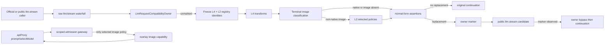

# Design: plugin-api-llm-request-m2

> feature_name: `plugin-api-llm-request-m2`
> 状态：草案（Stage 2）
> 上游：已批准的 `requirements.md`、`plugin-api-semantic-hooks-m2`、`plugin-api-llm-m1`、`llm-image-admission`
> 面：仅 host；不创建 client bundle、remote、codec 或 settings bridge
> 范围：L4 synchronous compatibility transform + constrained L2 image admission policy

---

## Overview

本 feature 将第三方插件各自维护的 `llm/stream` re-entry 收束为一个受限的 B 类兼容层。DSH 的公开 waterfall continuation 只能以原 options 继续，不能接收替换 options；因此本设计不伪装为原生 `llm/request` dispatch。对于经过所有检查的 message-only replacement，唯一的 `LlmRequestCompatibilityOwner` 抑制原 continuation，并调用一次公开 `llm.stream(candidate)`。owner marker 令这次 child operation 对本 owner 直接 pass-through，从而避免递归和重复 callback。

`llm/request` 是唯一的 translation owner，拥有 raw `llm/stream` listener、operation records、L4 transform registry、terminal pipeline、diagnostics 和 compat re-entry。`llm/admission` 是依赖 feature：它拥有 L2 image policy registry 与 admission gateway wrapper，但不拥有第二个 stream listener，也不自行 re-enter。两者通过 feature-private pipeline handle 共享已冻结 policy identities 与 owner-local operation state。

该结构集中替代 `dsh-read-image` 的 A1/A2 危险操作：facade 统一包装 scoped admission gate，并统一执行 message-only projection/re-entry。它仍受公开 substrate 限制：新 `llm.stream(candidate)` 不是同一个 native request、不能保留 private prepared-call binding，也不能证明 loop durable reconstruction、routing equality、caller provenance 或最终 adapter 前的全局控制。

### Substrate and classification

| Capability | Class | Public substrate | Fidelity limit |
|---|---|---|---|
| `pluginApi.llm.request.transform()` | B | synchronous `ctx.on('llm/stream')` waterfall plus public `llm.stream(candidate)` | replacement starts a new public stream operation; no native continuation replacement |
| `pluginApi.llm.admission.register()` | B | scoped `apiProxy.sessions.prompt/selectModel` and `llm.resolveModelInfo` wrappers; same request owner terminal scan | only `image`; gateway overlay is private and scoped, not a public `ModelInfo` mutation API |
| terminal image classifier | B helper | public `dshLlm.contentHasImage` | classifier can reject unknown/unparseable content but cannot establish a global final-adapter hook |
| strict replacement continuation/final pre-adapter enforcement | C/M4 | absent | requires native dispatch with replacement-capable continuation/envelope |

Official evidence is used only as runtime compatibility research, never imported as private state: `LlmRuntime.stream()` dispatches `ctx.waterfall(this, 'llm/stream', options, next)`, while `PreparedLlmCall.stream()` retains private registration context unavailable to a public child `llm.stream(candidate)` call. The loop constructs deep-frozen request input. This feature reads that request but never mutates it.

---

## Architecture



### Owner operation state

The owner keeps all state private to one mounted instance. It is not placed on official options, callback snapshots, catalog payloads, or durable records.

```ts
type OperationRecord = {
  epoch: object
  status: 'running' | 'settling' | 'settled'
  transforms: readonly TransformEntry[]
  policies: readonly PolicyEntry[]
  markedCandidate?: GenerateOptions
  replacementApplied: boolean
  diagnosticKeys: Set<string>
}

type Marker = {
  owner: symbol
  record: OperationRecord
}

type AdmissionScope = {
  gatewayEpoch: object
  scopeId: object
  kind: 'prompt' | 'selectModel'
  sessionId: string | undefined
  policies: readonly PolicyEntry[]
  selected: readonly PolicyEntry[]
  state: 'active' | 'settling' | 'settled'
}
```

A `WeakMap<GenerateOptions, Marker>` associates only the facade-created child candidate with the owner record. The original official request is never branded or mutated. An unmarked entry creates one `OperationRecord`, snapshots both registries before any L4 or L2 callback, and owns its terminal cleanup. Before `llm.stream(candidate)` the owner places a marker for exactly that candidate. When the listener sees that candidate, it verifies the marker belongs to its current epoch, bypasses L4/L2/assertions/effects, calls the supplied continuation once, and settles the record in `finally`.

A marker belonging to another owner is ignored and preserved. A nested call whose options are not the marked candidate receives a separate record. A stale disposer invalidates its epoch; it cannot detach or alter a later mount's listener, gateway wrapper, registry, or prepared facade transaction.

### Pipeline sequence

1. The raw listener receives `(officialOptions, next)` synchronously. It creates an operation record only for an unmarked entry.
2. It snapshots registered L4 transforms and L2 policies in priority/registration order before invoking any callback. The snapshot preserves each registration token and callback reference; later registration cannot alter it. Disposal or replacement cannot reorder the snapshot, but before a selected L2 policy is invoked the owner verifies that its token is still available in the current mount epoch. A disposed or invalidated selected policy causes typed rejection rather than stale processing or unsafe pass-through.
3. For each L4 entry, it supplies a detached, recursively immutable snapshot. `apply` runs once. `pass` retains the candidate; a valid `replace-messages` creates a new detached candidate retaining all protected request fields and the exact original `AbortSignal` object.
4. The owner calls the authoritative resolver through the same owner-controlled internal bypass scope used by `pluginApi.llm.modelInfo()`, so a stream entry that happens within an active admission gateway scope still observes pre-overlay target capability. If that bypass cannot be entered or the authoritative resolver fails, the owner rejects rather than classify against an overlay result. It performs terminal classification on the L4 candidate using `contentHasImage` per message content. Missing/unparseable shapes become `unknown`, never image-absent.
5. For non-native terminal image input, it evaluates each frozen policy's `match` once, in registration order, against facade-provided scope context. `match` receives no request messages. Each selected policy's `process` receives a newly derived recursively immutable snapshot with no mutable request, message, or result object shared with any earlier L4/L2 callback; only a policy whose `process` ran receives `validate`, likewise on a fresh detached immutable snapshot. Matching policies process one at a time while image remains. Every replacement must strictly reduce image-bearing content count; every invoked validator must return `true`; the final classification must be image-absent.
6. The owner runs every operation-start transform's `isConverged` once against this terminal candidate. A false or non-boolean value rejects the operation; the owner neither retries phases nor calls its continuation/re-entry.
7. If no valid replacement occurred, the owner calls `next()` once with the untouched official options. If a valid replacement occurred, it records the marker and returns `llm.stream(candidate)` without calling `next()`.
8. Every rejection, abort, original-continuation failure, compat re-entry failure, and success clears the marker/record in a contained `finally` path. Owner diagnostics are redacted and deduplicated by `(epoch, operation identity, category)`.

The owner guarantee is limited to steps it controls: it will not invoke its original continuation or its own compatibility re-entry with a candidate it has classified as unsafe. A later arbitrary waterfall listener may still make independent calls; universal final pre-adapter control is explicitly C/M4.

---

## Components and Interfaces

### 1. `lib/llm-request.js`: owner-local pipeline and L4 registry

This feature-local, harness-facing module exports `mountLlmRequestFeature(deps)` and pure/near-pure helpers used by focused tests. It owns no event catalog slice because requirements define no stable third-party `llm/request` synthetic event subscription.

`TransformRegistry` is private to the module. It stores `{ id, priority, sequence, apply, isConverged, token }` entries. Registration validates before insertion and returns an identity-bound disposer. It orders snapshots by `highest`, `high`, `normal`, `low`, `lowest`, then successful registration sequence. Dispose removes only the exact token and returns `true` once.

The public staged API is:

```ts
pluginApi.llm.request.transform({
  id: string,
  mode: 'compat',
  priority?: 'lowest' | 'low' | 'normal' | 'high' | 'highest',
  apply(snapshot): { kind: 'pass' } | { kind: 'replace-messages', messages },
  isConverged(snapshot): boolean,
}): () => boolean
```

The API is published only after cleanup registration succeeds. Before that, `pluginApi.llm.request` is the disabled object and produces P1/P2 before inspecting user input.

`cloneRequestWithMessages()` creates detached callback/candidate data without freezing or changing official input. It preserves every request field other than `messages`, retains the exact `AbortSignal` reference, and deep-freezes only plugin-visible snapshots. It never deep-freezes a signal. Candidate validation rejects changed fields, message count/order/metadata mutation, invalid content, any thenable, and new non-text input class. It permits M2 image only so the terminal L2 policy can eliminate it.

### 2. `lib/llm-input-policy.js`: L2 policy registry

This harness-free registry replaces `AdmissionRegistry`; `admission.js` and its `{ id, match, project }` path are retired during Execute.

```ts
type ImagePolicy = {
  id: string
  match(scope: AdmissionScopeContext): boolean
  input: 'image'
  process(snapshot): { kind: 'pass' } | { kind: 'replace-messages', messages }
  validate(snapshot): boolean
}

type AdmissionScopeContext = {
  sessionId: string | undefined
  agent: unknown
  provider: string | undefined
  model: string | undefined
}
```

The registry validates `id`, `input`, absence of `detector`/`inspector`, and all three callbacks before mutation. Duplicate ids and malformed registrations throw `LlmInputPolicyRegistrationError`; first dispose returns `true`, later calls return `false`. A policy's registration identity is distinct from its id so disposal/re-registration cannot remove a newer policy.

The owner, not the registry, evaluates `match` from its operation-start frozen policy list. Before invoking any selected policy's `process`, it queries that exact token's current-epoch availability; removal or invalidation makes the operation fail closed. A throw, thenable, or non-boolean `match` result is a no-match with one redacted owner diagnostic. The registry never receives request messages and cannot determine image presence.

### 3. `lib/llm-admission-gateway.js`: private scoped image gate

The gateway is the only replacement for legacy `admission-bridge.js`. It uses `AsyncLocalStorage` and `createWrapSafety()` with a new owner marker to wrap:

- `apiProxy.sessions.prompt`
- `apiProxy.sessions.selectModel`
- `llm.resolveModelInfo`

### Gateway scope handoff

The gateway does not claim that a prompt/select-model RPC and a later `llm/stream` entry are one provable logical operation: public DSH exposes no durable identity joining those lifetimes. Each boundary instead makes its own owner-local, operation-start policy decision from a frozen registry snapshot.

Before either wrapped RPC calls its original method, the gateway creates an `AdmissionScope` with a fresh `scopeId`, the current gateway epoch, session id, kind, and a snapshot of policy identities in successful-registration order. It synchronously evaluates each snapshot policy's `match` once against the RPC scope context and records the selected identities. The wrapper enters `AsyncLocalStorage.run(scope, originalRpc)` only after this selection succeeds.

`AsyncLocalStorage` alone cannot prove that a later `llm.resolveModelInfo()` call inside that RPC is the named official image-admission check rather than another resolver consumer. Gateway mount therefore requires a public, identity-safe confinement proof for that named invocation in addition to the wrapper targets. Only when that proof establishes the current resolver call as the named official check may the resolver wrapper use the active scope. It then verifies the current gateway epoch, `active` state, current provider/model arguments, and that selected identities are members of the scope's immutable array. It never re-reads the live registry, and a registration/disposal during the RPC cannot change the selection. If the current DSH composition cannot provide the confinement proof, `llm/admission` is P2-disabled and the wrapper does not overlay any resolver result.

There is no owner-to-gateway reverse handoff from a later stream entry. The stream owner independently snapshots and selects policies at stream entry because it has different public timing and request facts. This is deliberate: equality between the two decisions cannot be asserted without a native request identity seam. Both use the same policy definitions, but each decision is scoped to the public boundary where it is made.

The resolver wrapper calls the authoritative original resolver first. It returns an overlay containing `image` only if the validated active scope contains at least one selected image policy and authoritative input modalities do not already include image. It never mutates the official resolved-info object. If the scope is absent, stale, settling/settled, malformed, has no selected policy, or its selection fails validation, the wrapper calls the original resolver unchanged and preserves official refusal.

Gateway disposal first stops new policy registrations and new RPC scope creation. The owner then enters `settling`: an already active prompt/selectModel scope is allowed to finish only with its original resolver result, never a new overlay; a marked stream operation is allowed to finish its already-established bounded continuation/re-entry, while an unmarked operation that has not reached a terminal call is rejected through the owner error path. The owner retains the epoch, marker records, and active-scope counter until all such operations settle. After the counter reaches zero it enters `settled`, invalidates the epoch, clears markers and scope records, and identity-safely detaches the raw listener/wrappers. A stale disposer cannot reactivate or affect a later epoch. If the owner cannot establish these transitions or count active scopes during mount, it refuses activation and leaves official admission refusal unchanged.
`createLlmApi()` retains L8/L9 direct behavior: `prepareCall(config, signal?)` remains a direct official call with no added dispatch, and `registerAdapter`, `registerConfigurableProviders`, and `registerModelDiscovery` forward the original arguments and return/disposer/error behavior without transform, wrapper, or registration interception. `stream(options)` likewise keeps its public argument, return, and error interface; only its indistinguishable public waterfall can be observed by active compat transforms as specified.

`createLlmApi()` and the request owner share one owner-controlled authoritative resolver helper. Both enter an internal bypass scope before invoking that helper, so `pluginApi.llm.modelInfo()` and terminal stream classification always receive pre-overlay metadata even during a gateway scope. Bypass-entry or authoritative-resolver failure rejects the affected owner operation before classification; the public `modelInfo()` preserves its direct official error semantics. Raw third-party `ctx.llm.resolveModelInfo()` calls retain their documented uncontrolled behavior.

Gateway wrapper installation is all-or-nothing. Missing targets, a public identity-safe confinement proof for the named official image-admission invocation, `AsyncLocalStorage`, owner-local scope safety, `contentHasImage`, or identity-safe cleanup makes `llm/admission` P2-disabled and preserves official refusal. A foreign later wrapper is never removed; `wrap-safety` degrades this gateway transparent. The request pipeline remains independently usable for L4 transforms, but it does not relax image admission when gateway activation is unavailable.

### 4. Errors and diagnostics

`lib/errors.js` gains feature-specific subclasses of `PluginApiError`:

- `LlmRequestTransformRegistrationError`
- `LlmRequestTransformError`
- `LlmRequestInvalidResultError`
- `LlmRequestCompatibilityError`
- `LlmInputPolicyRegistrationError`
- `LlmInputPolicyError`

Registration errors identify a stable public code and never partially register. Operation errors reject only the current stream operation. Original continuation and compatibility re-entry errors are not wrapped or replaced after they become terminal official paths; cleanup runs in `finally` and returns/rethrows the same value or reason.

A private `reportOnce(category, record, error?)` accepts only feature identity, lifecycle phase, category, opaque ids, and safe error class/message. It must not serialize options, messages, snapshots, callback results, prompt content, or credentials. Missing/throwing logger is inert.

### 5. Coordinated staged facade publication

This is the first B facade activation and resolves the transaction gap recorded by `plugin-api-semantic-hooks-m2` Design A1.

`PluginApiService` gains a host-private staged operation, conceptually:

```ts
type PreparedFeature = {
  commit(): boolean
  rollback(): boolean
}

service.prepareFeature(name, api): PreparedFeature
```

`prepareFeature()` validates the known feature name and captures a candidate without changing public facade fields. `commit()` applies the same internal assignment path used by existing `mountFeature()` exactly once. `rollback()` discards the candidate and leaves/restores the disabled API only if this transaction still owns the prepared state. Both are identity-bound and idempotent. `mountFeature()` remains immediate for M1 mounters and delegates to the same internal assignment function; existing M1 lifecycle behavior is intentionally not changed here.

For B mounters, `lib/index.js` accepts a private structured mount result:

```ts
type StagedMount = {
  disposer: () => void
  prepared: PreparedFeature
}
```

The host flow is fixed:

```text
feature guard passes
  -> mounter installs owner resources and prepares facade API
  -> ctx.effect(() => disposer, label)
  -> prepared.commit()
  -> featureRegistry.mount(featureName)

ctx.effect / prepared.commit / featureRegistry.mount failure
  -> prepared.rollback()
  -> best-effort disposer()
  -> featureRegistry.disable(featureName, reason)
```

The host treats publication and activation as one staged transaction. It must not publish a B API or leave an active registry entry if any of cleanup registration, prepared commit, or registry activation fails. If `featureRegistry.mount()` throws after commit, the host first rolls back the prepared publication, then disposes owner resources, then disables the feature; rollback is identity/epoch checked so it cannot disturb a later successful mount. If registry activation returns a false/error result rather than throwing, the host treats that as failure by the same path. The disabled facade remains observable after every failed path.

If the mounter fails before returning a structured result, it must clean resources it acquired and expose nothing. If `commit()` fails, the host rolls back, disposes, disables, and continues mounting unrelated features. Reapply uses only `featureRegistry.isActive(featureName)`; stale prepared transactions and stale disposers cannot alter a later instance.

### 6. `lib/index.js` mount order and guards

`FEATURE_MOUNTERS` becomes:

```text
tools -> events -> agent -> llm -> llm/request -> llm/admission -> session -> settings -> systemPrompt -> services
```

No existing M1 ordering changes. `llm/request` mounts after `llm`; `llm/admission` mounts after the request owner. The request feature guard probes the public `llm.stream`, raw `ctx.on`, `contentHasImage`, callback snapshot/freezing support, and all required cleanup primitives. Admission additionally probes the public resolver, `agents.get`, `apiProxy.sessions.prompt/selectModel`, and `AsyncLocalStorage`.

If `llm/request` is unavailable or fails its staged transaction, `llm/admission` is P2-disabled without installing a gateway wrapper. If admission is unavailable, request transforms remain available but terminal non-native image handling never relaxes official admission. All failures stay within `apply()` fail-safe behavior.

### 7. Migration contract for `dsh-read-image`

Execute migrates the plugin's registration to:

```js
pluginApi.llm.admission.register({
  id: 'dsh-read-image-image-admission',
  input: 'image',
  match(scope) { /* route policy only */ },
  process(snapshot) { /* return replace-messages */ },
  validate(snapshot) { /* exact boolean */ },
})
```

`process` retains the established image ordering and nested `tool-result` projection behavior, returning only replacement messages. It preserves message positions and fields while replacing images with `[Image #N]`. `validate` confirms the processor's terminal candidate is image-free; the facade's terminal classifier remains authoritative. Unknown route capability is handled conservatively as non-native for terminal processing, while gateway relaxation occurs only for a selected policy in its scoped official admission call.

The plugin retains its capability-table refresh only as its own policy-routing knowledge. It must use facade `modelInfo()` where it requires authoritative pre-overlay metadata, not assume a raw resolver call is unwrapped. It must not own a resolver monkey-patch, raw `llm/stream` listener, `this.stream(projected)` re-entry, legacy `project` callback, or `admission.isActive` dependency.

---

## Failure Handling

| Condition | Behavior |
|---|---|
| core inactive | Public registrations raise P1 before value/service access. |
| request or admission guard failure | Relevant API remains disabled with P2; no partial listener or gateway wrapper is installed; `apply()` returns normally. |
| staged `ctx.effect` registration, commit, or registry activation failure | Prepared facade is rolled back, owned resources are disposed best-effort, registry is disabled, unrelated mounters continue. |
| malformed registration | Typed registration error; no state change. |
| L4 callback error/thenable/invalid result/assertion failure | Reject only this operation; do not invoke owner continuation or owner re-entry with original/partial candidate. |
| L2 match failure | no-match plus one redacted diagnostic; no gateway relaxation based on that policy. |
| no selected policy, invalid policy result, no image progress, validation failure, residual/unknown non-native image | Typed operation rejection; do not invoke owner continuation or owner re-entry with unsafe/partial candidate. |
| original continuation/re-entry terminal error | Preserve exact original error/rejection; owner cleanup in `finally`. |
| wrapper chain replaced by another plugin | Never restore/remove foreign wrapper; local gateway becomes transparent and no longer permits relaxation. |
| disposal with selected/marked operation | Stop new registrations/relaxation; settle through already-owned bounded path or reject without owner-controlled unsafe pass-through; retain minimum owner state until settled. |

No error path throws through host `apply()`. There is no invented host-wide drain/quiescence primitive.

---

## Testing Strategy

All Execute tests use `node --test`; registry and candidate-validation helpers remain harness-free where possible.

| Test area | Required proof |
|---|---|
| transform registry | validation precedence, duplicate ids, priorities/tie ordering, disposer idempotency, token-isolated removal |
| policy registry | image-only shape, forbidden detector fields, registration failure atomicity, matching from frozen identity snapshots, disposer isolation |
| snapshots/candidates | recursively immutable detached callback data, no live request freeze/mutation, per-callback object isolation, exact `AbortSignal` identity, including an already-aborted signal through the compatibility re-entry |
| owner pipeline | all-pass calls original continuation once; replacement suppresses it and calls public stream once; marker bypasses self pipeline; nested/concurrent records remain isolated; terminal classification inside an active gateway scope uses the authoritative bypass rather than overlay metadata; marker cleanup happens for all terminal paths |
| transform failure | throwing/thenable/invalid result/non-boolean assertion rejects only operation and makes no owner continuation/re-entry unsafe call |
| L2 terminal policy | native and image-absent bypass; matching non-native processing; no-match/disposed selection/match failure/processor failure/validator failure/no progress/residual image/unknown content reject; L4 policy mutation cannot affect current operation |
| admission gateway | scoped overlay only for a selected policy at a proven named official admission invocation; absent/invalid confinement proof or unsupported/missing gateway preserves official refusal; facade `modelInfo()` bypasses overlay; raw resolver is not promised bypass; identity-safe wrapper disposal/degradation |
| disabled API and diagnostics | P1/P2 precede user-value validation; disable, decline, containment, and repeated same-operation failures produce one redacted diagnostic per identity; absent/throwing logger does not change operation or lifecycle outcome |
| L7/L8/L9 preservation | `modelInfo()` bypasses overlay; `prepareCall()` receives no added dispatch; `stream()` retains public argument/return/error interface under the documented compat observation; provider registration members preserve direct argument, return, disposer, and error semantics |
| lifecycle transaction | prepare does not publish; effect registration precedes commit; effect, commit, or registry activation failure rolls back disabled facade, disposes owner resources, and leaves registry disabled; stale transaction/disposer cannot affect later mount; legacy M1 immediate mounts remain covered |
| delivery governance | implementation records a formal supersession amendment: `plugin-api-llm-m1` L1 `admission.isActive`/inactive no-op and narrow L8 no-listener/no-re-dispatch contracts, plus `llm-image-admission` Requirements 2, 4, and 7, are replaced by the named L2/L4 contracts; intentionally superseded tests are removed or rewritten with replacement coverage while unrelated M1 coverage remains; Stage 4 updates `AGENTS.md` section 8 and `plugin-api-features/feature-list.md`; the full `node --test` suite and documented `dsh-read-image` headless smoke/dev boot checks pass |
| integration/migration | request mount failure P2-disables admission; reapply duplicates neither hook nor effect; `dsh-read-image` registers input/process/validate, has no A1/A2/project path, preserves `[Image #N]` ordering/nested projection, and passes headless smoke/dev boot |
| compatibility disclosure | tests prove only documented public candidate fields and signal survive re-entry; no test asserts prepared-call, loop reconstruction, adapter registration/routing, provenance, or universal adapter equivalence |

---

## Native Upstream Proposals

The final implementation documentation records two C/M4 upstream proposals:

1. **Native `llm/request` waterfall**: a public request envelope with explicit owner/caller provenance, immutable input and replacement-capable continuation, defined cancellation behavior, prepared-call/adapter-registration/routing preservation, and declared sync/async/full-replacement boundaries.
2. **Native `llm/admission` decision seam**: a scoped request/session context dispatched before official admission refusal and before final adapter execution, with a documented target capability result, policy decision protocol, terminal input validation point, and cancellation/lifecycle ownership.

When those seams exist with the stated fidelity, the facade preserves transform/policy registration and disposer shapes while replacing compat re-entry and resolver/gateway wrappers.

## Out of Scope

- Editing official DSH package files or importing private DSH runtime state.
- A synthetic public `llm/request` event catalog entry.
- Async callbacks, arbitrary/full request replacement, response rewriting, loop/frozen request mutation, or adapter-private interception.
- Guarantees of prepared-call identity, adapter registration identity, routing equivalence, loop durable reconstruction, caller provenance, universal caller interception, or universal final pre-adapter enforcement.
- Other input modalities, arbitrary detectors, or client/remote/settings behavior.
