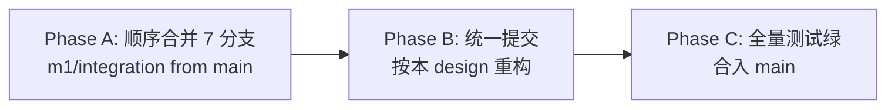
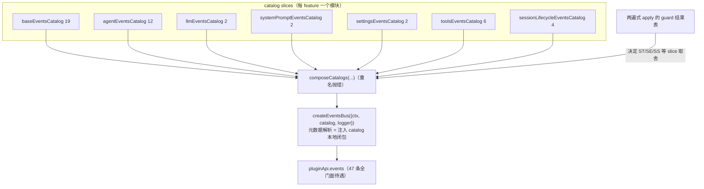

# Design: plugin-api-m1-integration

> feature_name: `plugin-api-m1-integration`
> 状态：草案（Stage 2，待用户评审）
> 上游：`requirements.md`（同目录，已获批）；AGENTS.md §3.0.1（零发布负债窗口）、§4.2（版本政策）

---

## Overview

本设计把 7 个 M1 并行分支整合进 main，并完成三类统一：事件总线基础设施（catalog schema / 冻结策略 / fault 策略 / scope 解析 / 组合机制）、门面工程契约（挂载顺序 / 幂等信号 / 失败呈现 / tools accessor）、API 形状规则（安置规则成文 + `web` 迁入 `services.*`）。同时产出并行开发工作流协议文档，并同步全部文档与版本号。

**钩子引出机制声明**：本 feature 不引出新钩子——无官方事件直接绑定新增、无底层钩子模拟新增、无 upstream proposal。它只统一既有 A 类稳定化（E/O/L/A/S/T/P/ST/SV 系列）的实现基座。

**执行形态**：不在 7 个 worktree 内返工，而是在一个 integration 分支上分三相完成（见 Architecture §Phase A/B/C）。

## Architecture

### 三相执行



- **Phase A（合并）**：从 `main` 创建 `m1/integration`，按固定顺序逐个 merge 七个分支，冲突按"保留双方语义、不在此相重构"的规则机械解决。合并顺序：`m1/tools` → `m1/agent` → `m1/session` → `m1/llm` → `m1/system-prompt` → `m1/settings` → `m1/capabilities`。
  - 顺序理由：tools 带来总线 DI 修复（后续分支的 catalog 扩展依赖它生效）；agent 带来 schema 改名（尽早落地，后续分支的条目在解决冲突时直接按新 schema 写入）；session 带来 `catalog-compose.js`（Phase B 的唯一组合机制原型）；其余按冲突面从小到大。
  - Phase A 结束时测试应为绿（session S1 缺陷此时仍在，但其现有测试本就测不出——Phase B 修复并补测试）。
- **Phase B（统一）**：一个（或少数几个内聚的）提交，实施本 design 的全部重构：schema 统一、slice 化、两遍式 apply、gating 收敛、失败呈现统一、tools accessor fail-safe、web 迁移、版本 bump、文档同步、协议文档。
- **Phase C（验收）**：全量 `node --test` 绿后合入 main；`m1/integration` 分支保留至验收完成。

### 统一后的事件基座



## Components and Interfaces

### C1. 统一 catalog 条目 schema（req §1）

```ts
type CatalogEntry = {
  name: string
  mode: 'on' | 'emit' | 'serial' | 'parallel' | 'bail' | 'waterfall'
  scopeFiltered: boolean
  scopeKey: 'args[0].agent' | 'args[1].scope' | null | undefined
  payload: string
  args: string
  source: string          // feature-list 编号（O1/L3/A1/S1/T2/P6/ST3…）
  type: 'A' | 'B'
  fault?: 'contain' | 'created' | 'propagate'   // 缺省 = 'contain'
  freeze?: 'all' | { deep: string[] } | 'except-signal'  // 缺省 = 'all'
}
```

- `subject` 字段全面更名为 `scopeKey`（agent 分支已改基线 19 条；Phase B 把其余分支条目一并改名）。
- `feature` 字段**废除**（gating 改为挂载期 slice 排除，见 C5）。
- 策略字段缺省时总线按缺省值处理；条目可显式携带缺省值（基线 19 条保留 agent 分支已回填的显式 `fault:'contain'`、`freeze:'all'`，便于审计）。

### C2. slice 化 + 单一组合机制（req §2.8/2.9）

每个贡献事件的 feature 拥有独立 slice 模块（同构命名 `lib/<name>-events-catalog.js`）：

| slice 模块 | 条目数 | 来源分支 | 取舍条件 |
|---|---|---|---|
| `events-catalog.js` → `baseEventsCatalog` | 19 | main + 四分支原地追加的条目迁出 | 恒含（events 挂载即含） |
| `agent-events-catalog.js` | 12 | m1/agent（自 events-catalog.js 迁出） | agent guard 通过 |
| `llm-events-catalog.js` | 2 | m1/llm（迁出） | llm guard 通过 |
| `system-prompt-events-catalog.js` | 2 | m1/system-prompt（迁出） | systemPrompt guard 通过 |
| `settings-events-catalog.js` | 2 | m1/settings（迁出，删 `feature` 字段） | settings guard 通过 |
| `tools-events-catalog.js` | 6 | m1/tools（已存在，字段改名） | tools guard 通过 |
| `session-events-catalog.js` | 4 | m1/session（已存在，字段改名） | session guard 通过 |

- 组合机制唯一：session 分支的 `composeCatalogs(...)`（重名抛错，fail-loud）。**删除** tools 分支的 `mergeEventCatalogs`（later-wins、fail-soft）——重名是 scope 冲突 bug，必须响。
- 组合发生在 `mountEventsFeature` 内（不再用模块级惰性单例），输入 = base + 各 guard 通过 feature 的 slice。
- 基线 `eventsCatalog` 导出名改为 `baseEventsCatalog`；`catalogEntryOf` 模块级查找函数删除（总线只用注入 catalog，见 C3）。

### C3. 统一总线（req §2）

以合并后的 `lib/events-bus.js` 为底，四处修改合一：

1. **元数据解析**（保留 tools 的 DI 修复）：`createEventsBus` 内 `const entryOf = (name) => catalog[name]`；删除对 `events-catalog.js` 的 `catalogEntryOf` import。订阅期与派发期都用 `entryOf`。
2. **冻结策略**（统一 agent 与 tools）：`deep-freeze.js` 提供单一 `freezeByPolicy(value, policy)`：
   - `policy` 缺省/`'all'` → `deepFreeze(value)`；
   - `{ deep: [...] }` → 顶层浅冻结 + 仅列出字段深冻结（agent 现有实现）；
   - `'except-signal'` → tools 的 `deepFreezeExceptSignal` 语义（顶层 `signal` 保持可写，其余深冻结 + descriptor 硬化）——作为 `freezeByPolicy` 的内部分支实现，`deepFreezeExceptSignal` 不再作为独立公开导出。
   - 任何策略都永不抛错。
3. **fault 分派**（保留 agent 的三态）：`'propagate'` 直通官方派发链；`'created'` 同步 throw 传播 / 异步 rejection contain；`'contain'`/缺省 = 现有 contain 路径（waterfall 与 emit 路径一致）。
4. **scope 解析**（保留 system-prompt 扩展）：`scopeKey` 三分支——`'args[0].agent'` → `args[0]?.agent`；`'args[1].scope'` → `args[1]?.scope`；`null` → `carrierKeyOf(this)`。
5. **删除 settings 的订阅期 gating**：`subscribe` 不再接收/查询 `featureRegistry`，不再抛 `PluginApiFeatureDisabledError`；`createEventsBus` 签名回到 `{ ctx, catalog, logger }`。

### C4. 两遍式 apply（req §2.9 gating + §3.1 顺序）

**apply 重写（显式契约项）**：现 `apply` 的 mount 调用签名 `mount({ ctx, service, featureRegistry, logger })` 扩展为 `mount({ ctx, service, featureRegistry, logger, guardResults })`；`runFeatureGuard` 的调用从 pass-2 循环内移至 pass-1。

**guard 分支归并（显式契约项）**：Phase A 合并后 `runFeatureGuard` 已含 7 分支各自追加的 feature 分支（`agent`/`llm`/`session`/`settings`/`systemPrompt`/`tools`/`services`，加基线 `llm/admission`/`events`/`web`）。Phase B：删除 `web` 分支（并入 `services` 分支的 `SERVICE_DEFINITIONS.some(...)` 探测，web 成为第 18 项定义）；按 C7 规则把每个分支标注为必需（fail-closed 探测）或可选（fail-open 探测）；`else` 未知 feature 分支保留。合并后 FEATURE_MOUNTERS 的每个名字都必须有对应 guard 分支，逐个以测试断言。

`apply` 的 feature 段改为两遍：

```text
pass 1: for each (name, mount) of FEATURE_MOUNTERS:
          guardResults[name] = runFeatureGuard(name, ctx, deps)
pass 2: for each (name, mount) of FEATURE_MOUNTERS:
          guard 失败 → featureRegistry.disable(name, …) + 日志, continue
          否则 mount({ ctx, service, featureRegistry, logger, guardResults })
```

- `mountEventsFeature` 依据 `guardResults` 决定 slice 取舍（tools/session/settings 等条件 slice），解决 "events 先于 session 挂载、但 session slice 需要 session 状态" 的次序矛盾。
- 已知边角：guard 通过但 mount 随后失败时，catalog 可能含孤儿 slice 条目。当前仅 session 有此可能，而其 mount 失败条件是 "events 未 active"——被挂载顺序排除，故该边角不可达；在代码注释中记录此论证。

最终 `FEATURE_MOUNTERS` 顺序（依赖：tools≺events、events≺session、llm≺llm/admission 固定）：

```js
['tools', 'events', 'agent', 'llm', 'llm/admission', 'session', 'settings', 'systemPrompt', 'services']
```

（原 `'web'` 条目删除，见 C8。）

### C5. gating 收敛（req §2.11，用户已选：挂载期 catalog 排除）

- 唯一机制：disabled feature 的 slice 不进入组合 catalog；对这些事件名的订阅按**非目录事件 passthrough**（裸 `ctx.on`/`ctx.once`，无门面待遇），与 E1 对未知事件名的既有语义一致。
- settings 分支的订阅期 gating 代码、`events-bus-settings-gating.test.mjs` 改写为"settings guard 失败 → `settings/updated` 不在 catalog → 订阅 passthrough"的断言。
- `PluginApiFeatureDisabledError` 仍由 disabled namespace 的方法调用抛出（见 C7），不再出现在订阅路径。

### C6. 统一幂等信号（req §3.2）

所有 mounter 的 re-apply 短路统一为：`featureRegistry.isActive(featureName)` 为真即返回 no-op disposer（re-apply 时 registry 经 `existing._registry` 复用，状态跨 apply 保持）。废除：`service?.agent?.isActive === true`、`service?.llm?.isActive === true`、常量 true getter 短路、`service?.events?.catalog === eventsCatalog` 同一性比较。`mountEventsFeature` 额外做防御性核对：已挂 catalog 的 `tools/change` 存在性与当前 tools guard 状态不一致时重新组合（正常流程不可达，防御保留）。

### C7. 失败呈现统一 + guard 规则（req §3.4/3.6）

**四条失败呈现路径**（req §3.4 的"exactly one of"即指此四条；每个 feature/namespace 归且仅归一条）：

| 路径 | 触发 | 错误类 | 归属 feature |
|---|---|---|---|
| P1 inactive core | core guard 失败（服务仍可注册） | `PluginApiInactiveError` | 全部 namespace |
| P2 feature disabled | feature guard 失败（必需服务 fail-closed） | `PluginApiFeatureDisabledError(name)` | agent / llm / llm/admission / session / tools / systemPrompt / events / services（整体） |
| P3 optional service unavailable | 可选服务缺失，调用时 | `PluginApiServiceUnavailableError(service)` | settings（`installSettingsSection` 例外：官方 no-op fallback） |
| P4 per-member disabled facade | capability 单服务缺失/声明成员缺失 | facade `isActive:false` + 调用抛 `PluginApiFeatureDisabledError(<service-key>)` | services 各成员 |

域内错误类不属于失败呈现路径，仅列明：`PluginApiSettingsNamespaceError`（settings.scope 未注册命名空间）、`PluginApiEventPriorityError`（非法 priority）、`PluginApiVersionError`（版本协商）。

- 错误类不新增；`PluginApiServiceUnavailableError`（settings 分支引入）升格为门面级。
- **成员静默省略被禁止**：`buildActiveFacade` 的"缺失成员直接省略"路径改为——声明成员缺失 ⇒ 该 service facade 整体降级为 P4 disabled（可观察信号）。
- guard 规则（已确认）：**可选服务 fail-open**（guard 期 `ctx.get` 抛错/缺失 ⇒ 视同服务不存在，feature 走 P3 模式，slice 保留在 catalog——未 disabled 即未触发 §2.11 排除）；**必需服务 fail-closed**（抛错/缺失 ⇒ guard 失败 ⇒ P2，slice 移出 catalog）。服务分类：必需 = `agents`/`llm`/`sessions`/`tools`/`systemPrompt`；可选 = `settings` 与全部 capability seams（含 web）。

### C8. tools accessor 与 mountFeature 契约（req §3.3/3.5）

- `pluginApi.tools` 保持**唯一的 scoped-accessor namespace**（理由：dsh-tools 是 scope-aware 服务，必须在访问时经 `this.ctx`（调用方 fiber 的 ctx）解析；挂载期捕获会固定为门面自身 fiber 的实例，语义错误）。
- fail-safe 修复：accessor 内 `ctx.get('tools')` 包 safeGet 语义——抛错或返回 undefined ⇒ 抛 `PluginApiFeatureDisabledError('tools')`，绝不裸抛。补 throwing-getter 测试。
- mountFeature 契约统一：`mountFeature(name, api)` 一律存储 api。tools 的 api 是 `{ scoped: true }` 描述符（注：它是状态描述符而非被调用的 API 面——真正的调用面是 accessor，此为 KD-8 记录的刻意权衡），accessor 的 disabled/live 切换读 `_toolsMounted` + 存储的 api；不再有"忽略 api 参数"的路径。

### C9. 安置规则落地 + web 迁移（req §4）

- `lib/services.js` 的 `SERVICE_DEFINITIONS` 追加第 18 项：`{ key: 'web', ctxService: 'web', members: [registerSearchProvider, registerFetchProvider] }`。
- 删除 `mountWebFeature`、`createDisabledWebApi`、`FEATURE_MOUNTERS` 的 `'web'` 条目；`pluginApi.web` 不复存在。
- guard：web 并入 services guard 的 `SERVICE_DEFINITIONS.some(...)` 探测（至少一个服务可得即通过，per-service 降级不变）。
- 文档：feature-list O15 行改为 `pluginApi.services.web.*`；events-m1 spec 的 O15 措辞同步；安置规则写入 feature-list §1 阅读说明（顶层 = 核心域 + 基础设施；`services.*` = 二线纯直通；未来纯直通进 `services.*`，语义 feature 自建命名空间）。
- 验收：`pluginApi` 顶层 key 恰为 `events, llm, agent, session, tools, systemPrompt, settings, services` 八个。

### C10. session.on passthrough（req §4.3，用户已选：裸透传）

`pluginApi.session.on/once` 对 4 个生命周期名之外的名字保持裸 `ctx.on/ctx.once` 透传（与 events 总线非目录 passthrough 同源语义），在 session spec 与 README 级文档中标注为 unsupported escape hatch。

### C11. 版本与文档同步（req §5）

- `package.json`：`version 0.1.0 → 0.2.0`，`dsh.api "0.1" → "0.2"`；peerDependencies 合并四条（`dsh-session-reference`、`dsh-session`、`dsh-settings`、`dsh-system-prompt`，均 `^0.1.0-rc.6`）。
- AGENTS.md §8：7 个 feature 各一行；events-m1 行保留（llm 分支加的"扩展至 21"括注删除）；计数类表述一律改为"各 delivered feature 贡献的并集"。
- feature-list.md：状态统一 `**delivered**`；§2.11 采纳 capabilities 的 `pluginApi.services.*` 形状（含 SV17 行的 services 前缀，状态保持 planned）；O15 行按 C9 改写。
- events-m1 spec：AC 7.3/7.4 泛化为"恰好覆盖本 spec 首版 19 个事件名；后续 feature 的扩展以各自 spec 为准，运行时目录为各 delivered feature 贡献的并集"；llm 的白名单改写与 agent 的修订注记合一，去除互相矛盾的措辞。

### C12. 并行开发工作流协议文档（req §6）

新建 `docs/specs/plugin-api-m1-integration/parallel-workflow.md`，三段：

1. **并行前（准备）**：分支派生之前必须产出并下发《契约包》——命名规范（feature 名 = pluginApi 命名空间名、slice 模块命名、测试文件命名 `index-<feature>` / `plugin-api-service-<feature>` / `<feature>-guard`）、共享文件编辑边界（guards.js/index.js/plugin-api-service.js 只允许"追加 else-if / 追加 mounter / 追加 disabled 工厂"模式）、catalog 字段词汇与扩展机制、失败呈现路径、FEATURE_MOUNTERS 插入位置规则。目标是把合并期冲突从"语义仲裁"降级为"机械拼接"。
2. **并行中（worktree 守则）**：契约是强指导而非铁律；实施中发现契约不切实际或有负价值时**允许偏离**，但必须把偏离与理由写入本 worktree 的 spec 文档并在交付报告中显式上报（预检据此仲裁）。
3. **并行后（合并）**：先只读预检（命名/同构审计、feature-list 覆盖与夹带核对、两两冲突图），再按固定顺序集中整合（一次 merge 波 + 一次统一波），全量测试绿后才算合并完成。

本 spec 周期结束（tasks 获批进入 Stage 4）时，AGENTS.md §3 增加 "### 3.5 并行开发工作流" 小节指向该文档。

## Data Models

唯一的新数据形状是 C1 的 `CatalogEntry`（其余均为既有模型的合并/改名）。组合 catalog 为 `Readonly<Record<string, CatalogEntry>>`，深冻结。`SERVICE_DEFINITIONS` 增加 `web` 一项（18 项）。feature registry 无变化。

## Error Handling

- 所有新增错误路径均使用既有 typed error（C7 矩阵），无新错误类。
- `composeCatalogs` 重名抛错发生在 apply 内层 try/catch：组合失败 ⇒ events feature disable（`featureFailNotice` + guard 日志），apply 不抛——与既有 feature 失败路径一致。
- `freezeByPolicy` 全函数（total），任何冻结失败原样返回。
- tools accessor：服务解析失败抛 `PluginApiFeatureDisabledError('tools')`（typed），不得裸抛。
- fail-safe 总不变量：apply 任何分支不抛（既有 catch-all 保留）。

## Testing Strategy

- **回归保留**：7 分支全部测试并入（约 1100+ 用例），按统一 schema 适配（`scopeKey`、slice 模块 import 路径、gating 语义改写）。
- **新增守门测试**（每贡献切片至少一条端到端，req §2.10）：
  1. 4 个 `session/*` 事件获得完整门面待遇（priority 排序生效、payload 深冻结、containment、scope gating）——直接针对 S1 缺陷的回归测试；
  2. tools guard 失败 ⇒ 6 个 tools 事件不在 catalog、订阅 passthrough；settings guard 失败 ⇒ 2 个 settings 事件同断言；
  3. `agent/*` 的 fault 三态与 freeze 豁免在合并总线下保持；
  4. `system-prompt/assemble` 的 `args[1].scope` 过滤在合并总线下保持。
- **契约测试**：FEATURE_MOUNTERS 依赖顺序（tools≺events、events≺session 被违反时行为断言）；统一幂等信号（re-apply 各 mounter 短路）；tools throwing-getter ⇒ typed error；`pluginApi` 顶层 key 恰 8 个；`services.web` 存在且旧 `web` 顶层 key 消失；**catalog 名集精确断言**（全部 guard 通过时恰为 47 个事件名的固定集合——同时充当 req §7.5"无 M2+ 夹带"的守门测试）。
- **版本测试**：`package.test.mjs` 断言 `dsh.api === '0.2'`、`version === '0.2.0'`、四条新 peerDep 存在。
- 全量 `node --test` 绿为 Phase C 合入 main 的门。

## 关键设计决策（编号备引）

| # | 决策 | 理由 |
|---|---|---|
| KD-1 | `scopeKey` 定名 | 用户决策；比 `subject` 语义更准（它解析的是 scope 路由键） |
| KD-2 | freeze 词汇 `'all' \| {deep} \| 'except-signal'`，缺省 `'all'` | 堵住"无策略字段 ⇒ 不冻结"的 E9 静默降级 |
| KD-3 | fault 缺省 `'contain'` | 与基线 E11 行为一致，旧条目零行为变化 |
| KD-4 | 每 feature 一个 slice 模块 + 唯一 fail-loud `composeCatalogs` | 同构、可审计；重名是 bug 必须响，否决 fail-soft later-wins |
| KD-5 | gating = 挂载期 slice 排除（用户决策） | 机制唯一；被排除事件回落 E1 既有 passthrough 语义，无新错误面 |
| KD-6 | 两遍式 guard-then-mount apply | 唯一能同时满足 "events≺session 挂载顺序" 与 "session/tools slice 按 feature 状态取舍" 的结构 |
| KD-7 | 幂等信号统一为 `featureRegistry.isActive(name)` | registry 跨 re-apply 复用，信号单一且既有基础设施已支持 |
| KD-8 | tools 保持唯一 scoped-accessor namespace + fail-safe 包装 | scope 正确性高于形态一致性；仅修补 fail-safe 缺口 |
| KD-9 | `web` 迁入 `services.web` | 安置规则零例外；零发布负债窗口（AGENTS.md §3.0.1）允许 |
| KD-10 | `0.1→0.2` bump；0.9 后是 0.10；1.0 保留正式发布 | 用户决策；已入 AGENTS.md §4.2 |
| KD-11 | 三相执行（合并波 → 统一波 → 验收） | merge 与 refactor 分离，各自可审 |
| KD-12 | 策略字段可显式携带缺省值 | 基线 19 条保留显式回填便于审计；新条目从简；总线以缺省值为准 |
