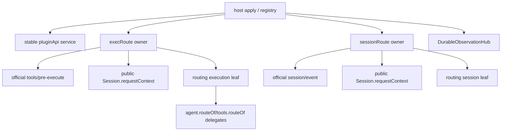

# Design: plugin-api-m2-integration

> feature_name: `plugin-api-m2-integration`
> 状态：已批准（Stage 2）
> 面：host-only 整合；不新增 client、remote、codec、catalog slice 或官方补丁

## Overview

本设计将 L2/L4、A9/T10、A11、S2/O8/O13/O14、SV17 收敛为一套 fail-safe host facade，并新增获批的 B 类 `pluginApi.routing`。routing 有两个独立 leaf：

- **execution**：在官方 `tools/pre-execute` 首次观察 execution 时，捕获当时公开 `Session.requestContext()` 的冻结 route；是 `routing.ofExecution()`、A9、T10 的唯一 authority。
- **session**：只从官方 `session/event` 内已提交、且由同一公开 `Session.requestContext()` corroborate 的 `request/context`，维护每个 live session 的最近 committed route，提供 query、future-only observation 与 wait。

两者均不是下一请求的最终 route。官方 agent-loop 先运行 `systemPrompt.assemble()`/tool schema 收集，之后才在 `buildRequest()` 内运行 `agent/request`、`llm.prepareCall()`，然后 append `request/header` 与 `request/context`。fresh `session/created` 时也没有 context。因此 pre-assembly final route 与 route-conditioned contribution 是 C 类 seam，不能以 header、agent options、defaults 或私有字段推断。

L4 继续是唯一 raw `llm/stream` owner，L2 是其 scoped gateway；A11/SV17 是 A 类直通；S2/O8/O13/O14 是 official durable records，而非 catalog events。

## Architecture

### 1. Admission and two waves

先对每个输入分支作只读准入：确认 committed Stage 4/tasks/registration、clean worktree、Spec-to-code、未改官方包、shared ownership、tests/package/consumer conflict 与未报告偏离。产物记录 branch、commit、偏离、冲突边、admission decision。若冲突改变批准的 Goal、classification、acceptance 或 migration boundary，停止并请求人工裁决。

principal merge wave 已按冻结 preflight 和提交历史完成，唯一事实顺序是 `compaction → llm-request/L2-L4 → agent-create/A11 → session-durable → exec-route`。每步只作维持已批准语义的冲突解决，并在跨过边界前运行当时的 focused 与直接受影响 shared tests；随后已完成的 unification wave 才处理 shared facade、publication、order/guards、version 与共同测试。该历史不因本次 Stage 1/2 返工而重写，也不在 remaining-only Stage 3 Tasks 中重新执行。返工后的 reconciliation 只补当前代码到本 Design 的差异；重叠语义仍只保留一个 authority，公共契约不由历史 merge order 决定。

### 2. Topology and ownership



| Owner | Owns | Does not own |
|---|---|---|
| host transaction | prepare/effect/commit/activate and reverse rollback | feature-local resolution |
| service | immutable composed facade, delegates, epoch tokens | active-state inference by shape |
| execRoute | one pre-execute capture, execution WeakMap | session observer, agent facade replacement |
| sessionRoute | one committed-route observation owner, cache/listeners/waits | durable validation, catalog/replay/poll |
| durable hub | durable observer epochs and native registration lifecycle | routing listeners/cache |
| L4/L2 | one stream owner and admission gateway | routing ownership |

### 3. Mounter order, guards, signals

```text
tools → events → agent → llm → llm/request → llm/admission → session →
sessionDurable → execRoute → sessionRoute → settings → systemPrompt → services
```

This preserves `tools ≺ events ≺ session`, L4 before L2, and puts both session observers after their substrates. A11 depends only on its approved agent substrate. Compaction remains a static `services` member—not a feature key/mounter/guard.

`featureRegistry.isActive(key)` is the sole active signal. Guards complete before any hook/wrapper/delegate is usable; a failed guard/mount is P2 only for that feature and later unrelated mounters continue.

| Feature | Mandatory public proofs | Isolation |
|---|---|---|
| `execRoute` | `ctx.on`, active M1 `tools` and `session`, resolvable official tools/session substrates | **No agents probe; no events dependency.** |
| `sessionRoute` | `ctx.on`, active M1 `session`/ `events`, sessions substrate, usable `session/event` registration | P2 never disables execRoute. |
| `sessionDurable` | approved session/events/audited-package proofs | restores only durable overlay. |
| L4/L2 | approved LLM probes and L4-before-L2 | never creates a second stream owner. |

The old execRoute `agents` guard probe and `events`/agent mounter dependencies are superseded. `agent.routeOf` is a stable service delegate, so it does not need a later agent lookup.

### 4. Prepared publication

Every B owner uses an identity-bound prepared transaction:

```text
guard → private owner/native registration → {publish, rollback, dispose}
      → ctx.effect(cleanup) registration → facade delegate commit → registry mount
```

Failure at registration, effect registration, commit, activation, rollback, or disposal is contained: reverse public visibility, restore P2 delegate, disable only the matching key, log once redacted/best-effort, continue later mounters. Cleanup is idempotent. Token/epoch checks make stale disposal inert against new epochs. Retained old facade references remain P2 after reset/reapply.

No mounter replaces a whole namespace: it fills only its private composition slot in the pre-built frozen facade. This protects additive `agent`, `tools`, `session`, `llm`, `services`, `routing` shape and prevents a rollback from erasing an unrelated member.

## Components and Interfaces

### 1. Public composition

```ts
type RouteSnapshot = Readonly<{ provider: string; model: string }>
type RoutingAvailability = Readonly<{ execution: boolean; session: boolean }>

pluginApi.routing = Object.freeze({
  ofExecution(exec): RouteSnapshot | undefined,
  current(session): RouteSnapshot | undefined,
  on(session, listener): () => boolean,
  once(session, listener): () => boolean,
  wait(session, options?): Promise<RouteSnapshot>,
  get availability(): RoutingAvailability,
})
```

`availability` is frozen exact-shape and has `execution === isActive('execRoute')`, `session === isActive('sessionRoute')`; there is no aggregate boolean. It performs P1 before registry access. Existing delegates remain:

```text
agent.routeOf(exec) ─┐
tools.routeOf(exec) ─┼─ one execution authority = routing.ofExecution(exec)
routing.ofExecution ─┘
```

All three return the exact stored snapshot identity or `undefined`. A11 preserves exact official receiver/arguments/return/promise/handle/disposer/error semantics. Session retains M1 plus approved durable members only; routing is not a second sessionDurable namespace. LLM removes only superseded admission members; services has exactly 19 static keys.

The composite `pluginApi.routing` namespace is service-lifetime stable and may dynamically expose a newly committed routing epoch after re-apply; epoch-bound leaf callbacks, observers, waiters, and disposers never revive or mutate an older epoch, and retained references to those epoch-bound objects remain disabled according to the owning feature contract.

### 2. Execution owner

Private state is `WeakSet<object> observed` plus `WeakMap<object, RouteSnapshot | undefined> outcomes`. One prepend `tools/pre-execute` wrapper marks an execution observed, reads only public `exec.agent.session.requestContext()`, validates non-empty string provider/model, deep-freezes a new snapshot, stores it, and invokes the native continuation exactly once unchanged.

Missing agent/session/context or ordinary malformed data stores `undefined` without diagnostics. Unexpected access/owner failure is contained and identity-deduplicated as `exec-route-resolution-failed`, then stores `undefined`; no tool behavior changes. Active queries of malformed/unobserved input return `undefined` without inspection/inference. The owner never reads header/options/defaults/private state and never mutates official objects. Capture is once per execution, produces no catalog entry, synthetic event or execution rewrite.

### 3. Session owner

The owner observes only future official `session/event`. A candidate can publish route state only if:

1. `ctx.get('sessions').get(session.id) === session` (or a public `list()` identity proof) holds at observation time; id equality or `instanceof` alone is insufficient;
2. it is an exact `request/context` event for that identity, has non-empty string provider/model, and a safe integer `seq >= session.firstLiveSeq`; seed/before-`firstLiveSeq` records are stale even when their fields corroborate;
3. contained `session.requestContext()` for that same identity returns the same non-empty provider/model pair.

Malformed, cross-session, stale, seed-boundary or throwing observations publish nothing and emit at most one redacted `routing-observation-invalid` diagnostic per epoch/category. They are not durable breaches and cannot disable sessionDurable. `current(session)` performs the same public `get(id) === target` validation first. A throwing `requestContext()` is contained as `routing-current-read-failed`, returns `undefined`, and cannot mutate/cache partial state. A valid read may seed cache but does not replay/notify.

Private state is a per-epoch `WeakMap<Session, RouteSnapshot>` and identity-bound ordered registration sets. Same pair reuses exactly the prior snapshot and notifies nobody; a changed/first pair creates one frozen snapshot, then snapshots that session's ordered registrations. Immediately before each callback, it rechecks epoch, target liveness and attached state; nested disposal cannot run a stale callback.

`current`, `on`, `once` and `wait` call the same public live-session validator after P1/P2 and before cache read/registration: it proves `sessions.get(target.id) === target`, or an equivalent public `list()` identity proof. A throwing `get`/`list` is contained and redacted as `routing-live-target-read-failed`; while the leaf is active it has the same `TypeError { code: 'invalid-target-session' }` outcome as a false identity proof, with no cache read or registration. `on`/`once` then validate listener (`invalid-listener`). Disposers return true only for first removal. `once` detaches before user code. Listeners run synchronously in order and are not awaited. Synchronous throws/asynchronous rejections are contained as `routing-listener-failed`, never become unhandled rejections, and do not stop remaining listeners or official dispatch.

`wait` validates P1/P2/options before reading state. Entry-aborted signal rejects with exact `signal.reason` before route read. Otherwise it executes the exact `current()` live-target validation and contained `requestContext()` cache-seed path before deciding: already committed but previously uncached state resolves immediately and does not notify observers; absent state creates one listener/abort race. First next-change or abort removes registrations before settling; current state read in this call wins over later abort; abort preserves exact reason and signal identity. Invalid options/non-AbortSignal is `invalid-options`. Session disposal means a later public `get(id) !== target` / lifecycle teardown proof: it detaches all exact-target entries and a pending wait rejects exactly once with `target-session-disposed`; a replacement session is untouched. Routing epoch teardown rejects pending waits P1 if core then inactive, otherwise P2 `sessionRoute`.

### 4. A11 agent extension (A)

A11 is composed as six independently gated leaves of the existing agent facade. Every invocation resolves `ctx.get('agents')` from the **consumer's current Cordis fiber/context**, rather than retaining a host-time registry. Each leaf performs its own availability probe; an absent/malformed member makes only that member P2 while M1 reads and the other five A11 leaves remain usable. The leaves are the approved create/resume/register/provider lifecycle members from the A11 Spec, with no composite all-or-nothing agent gate.

After the consumer-context lookup and leaf proof, forwarding is transparent: exact official receiver, supplied argument count and identities, synchronous throw, Promise identity/adoption behavior, returned handle, callback ordering and returned disposer are passed through unchanged—no clone, wrap, retry, error conversion or disposer decoration. A11's prepared overlay changes only the named A11 slots. The execRoute extension adds only `routeOf` as a peer delegate; it never reads, wraps, gates, or delays an A11 call, and an A11 failure/cleanup cannot reset execRoute.

### 5. S2 appendMessage and durable surface

`pluginApi.session.appendMessage(targetSession, kind, payload, { sourceEventSeqs? }?)` is a finite host-only S2 operation. It applies P1 then `sessionDurable` P2 before examining target/kind/payload/options, then synchronously proves the exact live session identity and rejects a session replaced/disposed since the call began. It accepts only the approved user, assistant, and tool-result surface-message kinds; after target proof all data inputs are captured as bounded lossless-JSON snapshots so later caller mutation cannot alter validation or persisted content.

The mapper validates the kind-specific finite payload grammar and computes approved `surfaceOp` / metadata. `sourceEventSeqs` must either be explicit safe integer sequence identities that belong to the target's public live event boundary, or be unambiguously derived by the documented kind-specific causal mapping; duplicates, foreign/seed/stale values, ambiguous provenance, unsupported title correction/replacement/atomic turn/raw arbitrary event, and any hostile accessor fail before persistence. It does not write a generic durable record or mutate history.

Only after all mapping/provenance checks succeed does it call the official `session.append()` exactly once, with the original target receiver and approved event data/options. The returned official record/error identity and timing are preserved. The service records an epoch-bound "inside durable observer" guard: `appendMessage` from a durable observer callback fails before persistence, preventing recursive append semantics. On epoch reset, rollback or retained old `pluginApi.session` reference, the durable overlay is P2 and cannot revive on a fresh reapply; M1 session methods remain intact.

The five audited durable kinds remain `approval/policy`, `approval/asked`, `approval/decided`, `schedule/change`, `subagent/descriptor`. `onDurable` / `onceDurable` observe only future official matching records, validate record/kind/seq/firstLiveSeq/payload before delivery, preserve official record identity, and neither replay, poll nor synthesize an event.

### 6. Durable dispatch safety

`DurableObservationHub` has service-lifetime native registration and epoch-local durable observer maps. On malformed known audited durable record inside `session/event`, it only CAS-detaches the current durable epoch, clears private observers, restores durable P2 delegate, disables matching registry epoch, and records a contained diagnostic. It **never** invokes native dispose, events-bus removal, or `reconcile('session/event')` during dispatch.

Thus unrelated native/M1/M2 listener dispatch snapshot/order cannot be rewritten mid-event. Outside callbacks teardown attempts, in order: (1) close hub state, (2) detach/dispose epoch observers, (3) restore durable P2 overlay, (4) disable matching registry epoch, (5) release native hook last. All stages run despite throws; native release marks released before one best-effort call, so a throwing disposer cannot repeat effects. Reapply creates a fresh epoch after substrate correction and never revives invalid retained references.

### 7. L4 request owner and L2 admission gateway (B)

The public L2 interface is exactly `pluginApi.llm.admission.register(policy)`, where `policy` is the approved image-only record `{ id, match, input: 'image', process, validate }`; no detector, inspector, projection, priority, route or extra public field is accepted. It returns an identity-bound idempotent disposer: first removal of that exact current registration returns `true`, later/stale/auto-removed calls return `false` and cannot affect another policy or mount epoch.

L4 owns the single raw `llm/stream` registration. It takes an operation-bound ordered snapshot of transforms; L2 separately snapshots policies. For each candidate, transforms run first, then L2 accepts only policies declaring `input: 'image'` whose `match`, `process` and `validate` all prove the candidate safe. The L2 scoped gateway verifies scope ownership and parameter matching, applies at most one eligible overlay, and has an authority bypass which prevents a gateway-owned re-entry from recursively reselecting the same policy.

The pipeline performs convergence validation before official continuation. Unchanged candidate calls the original continuation exactly once; a changed candidate suppresses it and causes at most one owner-marked public re-entry. A recognized self marker bypasses its own owner but preserves foreign markers and exact live `AbortSignal` identity. Foreign marker, nested and concurrent operations isolate markers, snapshots, diagnostics and cleanup. Any throwing/malformed transform, classifier, match/process/validate result, marker or convergence proof rejects by the approved typed fail-closed path; no original/partial candidate is forwarded. Terminal official LLM errors retain object identity.

L4 and L2 each stage registrations privately, then enter prepared publication. L4 must complete registration, effect cleanup and facade commit before registry activation. L2 is published only after its L4 dependency has committed: if L4 publication/activation fails, L2 is not activated; if L2 fails, its overlay rolls back while independently valid L4 stays active. Neither path installs a second stream listener or revives legacy projection/admission code.

The unique `resolveModelInfo` wrapper is installed only by the L2 scoped gateway. It uses an identity-bound wrapper token and preserves nested/concurrent isolation; rollback and stale disposer checks unwrap only that exact current wrapper and never a replacement. The retired admission bridge has no wrapper ownership. This is the final authority for the M1 integration supersession statement.

### 8. Other owners

A11 forwards directly, unchanged. `services.compaction` exposes only `isActive`, `compactIfNeeded`, `compactNow`, `compactRegion`, preserving receiver/argument/return/error identity/timing. Its hostile construction is definition-level P4 only for compaction.

## Data Models

```ts
type RoutingEpoch = {
  token: object; current: boolean
  snapshots: WeakMap<object, RouteSnapshot>
  registrations: Map<object, Set<ObserverOrWait>>
}
type ObserverOrWait = {
  epoch: RoutingEpoch; session: object; attached: boolean
  // listener or promise settlement, optional signal, and once/settled flags
}
type PreparedFeatureMount = {
  token: object; publish(): void; rollback(): void; dispose(): void
}
```

All records are private and identity-bound. Snapshots contain neither session id/header/options/context-window/event payload. The M1 event catalog 47, durable-kind catalog 5, and service keys 19 are independent tests, not derived totals. M2 adds no event catalog slice or synthetic event; route is query-only and durable kinds stay session-log records.

## Error Handling

Precedence is P1 core inactive → P2 owning feature inactive → existing P3 optional service → existing P4 individual member. Every routing method (including availability) checks P1 before reading execution/session/listener/options/signal/substrate, then only its leaf P2. Normal absence is `undefined`, or a pending valid non-aborted wait.

Diagnostics are redacted, constant-shaped, deduplicated, best-effort; absent/throwing logger cannot alter control flow. Host contains guard/mount/registration/diagnostic/rollback/disposer throws so harness boot continues.

## Package and compatibility contract

The final package contract is `package.json.dsh.api = '0.3'` and the repository's unique full version is `0.1.0-rc.6-0.3`. The facade parser splits that into runtime portion `0.1.0-rc.6` and protocol `0.3`: runtime-to-facade comparison requires exact full runtime identity, including patch and prerelease, with the installed audited DSH runtime; plugin-to-facade compatibility independently compares numeric API major/minor. A runtime `rc.7`, release `0.1.0`, or patch mismatch is fail-safe, never normalized to major/minor. Protocol minor progression remains numeric (`0.9 → 0.10`) and `1.0` stays reserved for public release.

All M2 official package identities needed by guards/audits are declared through existing approved package surfaces or peerDependencies, so host and plugin share one official instance. No facade-unrelated runtime dependency is added. Package assertions, peer tests, examples, docs and both consumer dependency declarations use the same full version/protocol facts.

## C-class upstream proposal

The installed runtime has no final route before prompt/tool assembly: assembly precedes `agent/request` and `llm.prepareCall`. The upstream proposal is an official `agent/prepared-route` seam with frozen `{ provider, model, signal, sessionId }`, exposed after final resolution but before any route-conditioned contribution. Upstream must define scheduler restructuring/preflight, request causal identity, carrier/scope, cancellation, ordering, teardown and failure behavior.

Until accepted, no runtime routing member/contribution registration is exposed for pre-assembly route, no fallback inference is allowed, and no consumer may claim native tool identity can be conditionally preserved at that boundary. Documentation distinguishes latest committed session route, exact execution-time captured route, and unavailable pre-assembly final route.

## Testing Strategy

Combined host tests cover exact order; all guard/publication boundaries; registration/logger/disposer throws; rollback; repeat apply/dispose; stale epochs; retained references; unrelated survival; no duplicate hooks/wrappers/facades; full `node --test`, `git diff --check`, and no-official-file modification. Durable tests explicitly make the initial hub native-registration step fail and prove prepared rollback leaves no overlay/registry state or later hook residue. A11 tests exercise each of six leaves from distinct consumer fibers, independent P2 and unmodified receiver/args/return/promise/handle/disposer/error. S2 tests exercise all finite kinds, JSON snapshot mutation resistance, explicit/derived provenance, invalid/live/observer/epoch failures, exact-one append and no persistence on every rejected path. L4/L2 tests exercise policy grammar, scope/parameter selection, at-most-one overlay, bypass, publication asymmetry, wrapper rollback, markers, convergence, signal and terminal-error identity.

Routing tests prove execution single capture/freeze/identity/no mutation; session live identity/corroboration/fresh absence/cache reuse/change; future-only ordering; on/once listener containment; wait immediate/next/abort linearization; disposal/replacement; P1/P2-before-input; nested/concurrent isolation; and absence of replay/poll/catalog/synthetic event/second raw LLM owner.

| Requirements | Design and evidence |
|---|---|
| 1–2 | admission record, merge/unification waves, focused gates |
| 3 | composed stable facade and routing leaves/delegates |
| 4–5 | order/guard table, registry signal, P1–P4/diagnostics |
| 6–7 | prepared epochs, L4/L2 staged convergence/re-entry, S2 single append, one route capture |
| 8 | no catalog additions; independent 47/5/19; safe durable dispatch |
| 9 | A11 direct forward and compaction P4 |
| 10 | exact 0.1.0-rc.6 runtime plus 0.3 protocol/package/peer tests |
| 11 | focused/full/fail-safe matrix |
| 12–13 | consumer migrations, smoke/dev boot and bounded semantics |
| 14–15 | supersession/registration synchronization and scope exclusions |
| 16 | routing API, validation, cache, linearization, epochs, C seam |

Migration acceptance is repository-real rather than a facade fixture. `dsh-read-image` registers the constrained `input: 'image'` policy (and only necessary L4 transform) through the composed facade, rereads the composed facade after reapply instead of retaining a revived old leaf, and uses `routing.ofExecution`/compat delegates for execution. It deletes A1 `resolveModelInfo` monkey patch, A2 raw stream/recursive projection/legacy `project`, A6 private agent-session traversal, dormant fallback and direct-package escape hatch. Its tests retain message-only ordering, nested tool-result projection, image-free terminal checks, exact disabled behavior and safe missing-route relay; its migration note states fresh/assembly-time route is unavailable.

`dsh-pro-ex-ability-anchor` maps actual user/assistant/tool-result repository paths to finite `session.appendMessage`: explicit or derivable causal `sourceEventSeqs` and approved `surfaceOp` are handed to the facade, while raw official `tool/call` boundaries stay raw. Ambiguous provenance preserves fail-before-persistence; no hand-authored `surfaceOp`/`sourceEventSeqs` fallback remains for migrated kinds. It rereads a fresh composed session facade after recovery because retained durable references intentionally remain P2. Both repositories update dependency/migration docs and pass their relevant suites, documented headless smoke and dev boot against integration.
