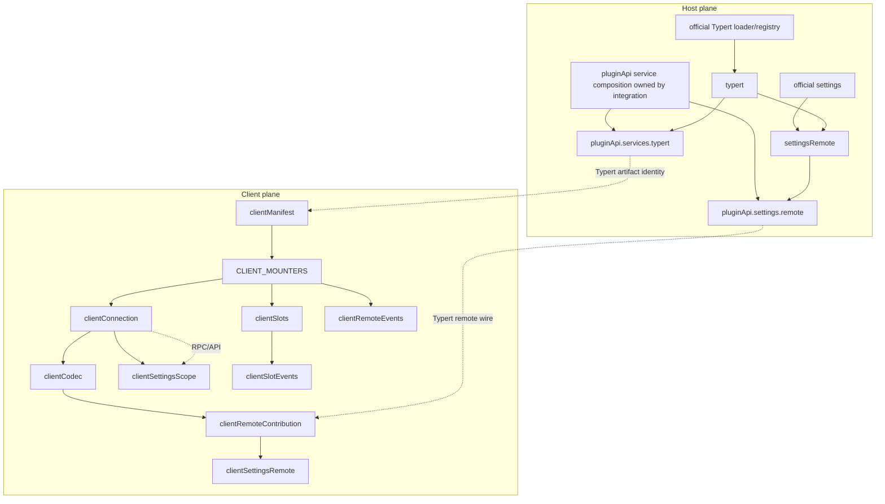
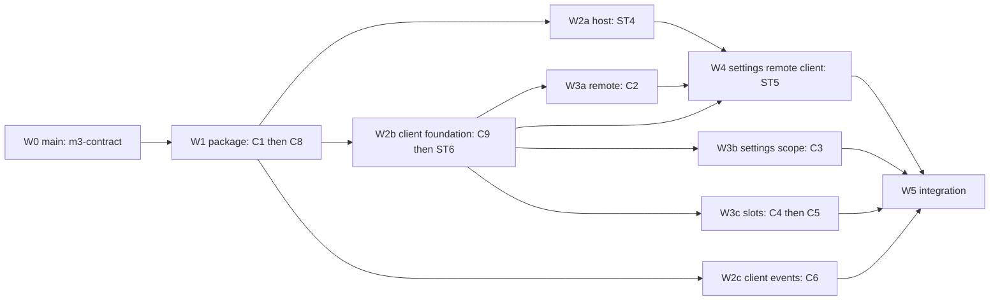

# Design: plugin-api-m3-contract

> feature_name: `plugin-api-m3-contract`
> 状态：Stage 2 design（无人值守授权下由协调者代行确认）
> 上游：`goal.md`、`requirements.md`（Stage 1 已提交）
> 设计依据：`docs/specs/plugin-api-m1-integration/parallel-workflow.md`；官方 `dsh-client-modules`、`dsh-typert-loader`、`dsh-api-remotes`、`dsh-api-gateway`、`dsh-client-connection`、`dsh-client-runtime`、`dsh-client-ui-slots` 与 `dsh-client-ui-settings` 公共导出

## Overview

M3 是一个跨 host/client 的组合交付。host 侧将已有官方 settings、Typert、gateway 能力稳定化；client 侧以一个独立的 `lib/client.js` bundle 暴露 typed helper。设计核心是把“public namespace”与“composition owner”分开：每个 feature 只拥有一个明确 slot，`pluginApi.services` 和 `client` 的父对象由 integration owner 预建并冻结，leaf owner 只能写入自己的 slot。

本 feature 不新增 runtime hook。11 个 feature 的引出机制如下：

| Feature | ID / class | Public placement | Surface | Hook mechanism | Guard / mount key |
|---|---|---|---|---|---|
| ST4 | `settingsRemote` / B | `pluginApi.settings.remote` | host | `ctx.settings`、`TypertRemoteService`、`bindTypertRemote` 公开能力转译 | `settingsRemote` / `settingsRemote` |
| ST5 | `clientSettingsRemote` / B | `client.mountRemoteContribution`（settings face） | client | `ctx.remote.$mount` 公开能力转译 | `clientSettingsRemote` / `clientSettingsRemote` |
| ST6 | `clientCodec` / B | `client.codec` | client | `dsh-api-remotes` descriptor contract + bundled zod | `clientCodec` / `clientCodec` |
| C1 | `clientManifest` / A | `client.defineManifest` | package + client | official `dsh.client` parser and `exports["./client"]` loader path | `clientManifest` / `clientManifest` |
| C2 | `clientRemoteContribution` / B | `client.mountRemote` | client | official `ctx.remote.$mount` direct delegation with face validation | `clientRemoteContribution` / `clientRemoteContribution` |
| C3 | `clientSettingsScope` / A | `client.settingsScope` | client | official connection/settings client service delegation | `clientSettingsScope` / `clientSettingsScope` |
| C4 | `clientSlots` / A | `client.slots` | client | official `slots.register/inject/entries/subscribe` delegation | `clientSlots` / `clientSlots` |
| C5 | `clientSlotEvents` / A | `client.slots` event surface | client | official `slots/changed` dispatch observation | `clientSlotEvents` / `clientSlotEvents` |
| C6 | `clientRemoteEvents` / A | `client.remote.$on/$dispatch` | client | official forwarded remote event allowlist | `clientRemoteEvents` / `clientRemoteEvents` |
| C8 | `typert` / A | `pluginApi.services.typert` (host facade; artifact remains `exports["./typert"]`) | host | official Typert loader/registry direct delegation | `typert` / `typert` |
| C9 | `clientConnection` / A | `client.connection` | client | official `connection.rpc` and `connection.api` direct delegation | `clientConnection` / `clientConnection` |

The host and client key domains are deliberately separate. Host keys enter the existing `FEATURE_MOUNTERS` only where a host feature is actually mounted; client keys enter the new client-side `CLIENT_MOUNTERS` list. This is the M3 extension of the M1 naming rule, not a second public namespace.

## Architecture

### Composition planes



### Host mounter order

Existing M0–M2 order remains unchanged. M3 adds only the following ordered entries after the existing M2 boundary:

```text
tools ≺ events ≺ agent ≺ llm ≺ llm/request ≺ llm/admission ≺
session ≺ session/durable ≺ execRoute ≺ sessionRoute ≺ settings ≺
systemPrompt ≺ services ≺ typert ≺ settingsRemote
```

`services` remains the owner of the frozen `pluginApi.services` parent. The integration task reserves `services.typert` as an empty composition slot before publication; `typert` fills that slot only after the parent has been published. `settingsRemote` is after both `settings` and `typert`, because it needs a settings namespace and Typert remote binding. No M3 feature changes the relative order of existing entries or adds a second services parent.

### Client mounter order

The browser bundle has a separate list, with one append owner for the list itself:

```text
clientManifest ≺ clientConnection ≺ clientCodec ≺ clientRemoteContribution ≺
clientSettingsRemote ≺ clientSettingsScope ≺ clientSlots ≺ clientSlotEvents ≺
clientRemoteEvents
```

`clientRemoteEvents` has no semantic dependency on slots and may initialize earlier internally, but the deterministic list order above is used for repeatable boot and tests. The client list is not a Cordis host `FEATURE_MOUNTERS` replacement and does not alter host guard results.

### Worktree waves



Wave boundaries are committed boundaries. A wave may run its listed worktrees in parallel, but a later wave cannot be derived until all of its prerequisite top-level batches have passed their focused audit. W1 and W2 have no shared implementation owner; W4 is intentionally sequential because ST5 consumes ST4's host descriptor, C2's generic mount owner, ST6's codec, and C9's connection.

## Components and Interfaces

### Host components

#### `settingsRemote`

The host leaf resolves the M1 `settings` facade's namespace, obtains the official Typert remote service and binds a `TypertRemoteService` with `bindTypertRemote`. It validates namespace, deterministic service key, method descriptors, and wire-safe values before publication. It owns only its contribution handle and registers cleanup through the host fiber.

It is a B-class adapter: no new Cordis event is emitted, and no official settings or Typert file is patched. A missing `settings` or Typert binding is a mandatory guard failure (P2); an optional existing settings service remains governed by the M1 settings feature's P3 semantics.

#### `typert`

The host leaf observes the official Typert loader's `exports["./typert"]` artifact boundary and exposes a typed read/registration facade under `pluginApi.services.typert`. The artifact identity and official registration/disposer remain authoritative. The leaf may not clone the registry or change invocation receiver/return/error semantics.

The `services.typert` slot is reserved by the integration owner. C8 owns the leaf and its focused tests; it does not edit the shared services constructor or publish a second top-level `pluginApi.typert` namespace.

### Client components

#### `clientManifest`

The package face defines the `dsh.client` declaration (`platform`, optional `inject`, optional `immediately`) and preserves the official `exports["./client"]` conditional export. The client boot path is the official loader's `window.__ModuleLoader__.load({ id, factory })` registration; `defineManifest` is validation/normalization, not a second loader.

#### `clientConnection`

The connection leaf captures the official client connection service once per client fiber. `rpc.call` and `api.settings.*` are forwarding methods; the leaf does not wrap Promises or transform errors. It provides a typed disabled face when the connection service is unavailable.

#### `clientCodec`

The codec leaf owns the only M3 bundled zod copy. It creates actual zod schema objects accepted by `dsh-api-remotes`; the host must never receive a schema instance from a different zod copy as an identity requirement. Descriptor validation is performed before remote publication and before dispatch.

#### `clientRemoteContribution` and `clientSettingsRemote`

`clientRemoteContribution` owns the generic `$mount` adapter and exact contribution disposer. `clientSettingsRemote` owns only the settings-specific descriptor/face adapter and calls the generic owner; it cannot duplicate `$mount` or create a second remote registry. The settings client uses an inert/degraded render result when host publication is unavailable. Native `remote.<ns>` discovery remains C7/M4.

#### `clientSettingsScope`

The scope binds a validated settings specification to `clientConnection`. Snapshot reads are immutable, subscriptions are effect-scoped, and mutations use the connection wire unchanged. Scope loss cancels only its own listeners and resolves pending operations through the typed failure path.

#### `clientSlots` and `clientSlotEvents`

`clientSlots` delegates to the official slots service and owns registration, injection, read, and subscription. `clientSlotEvents` registers the typed client event descriptor for `slots/changed`; it observes the official event after the slot mutation has committed. The event payload is the canonical slot ID and is not added to the host 47-entry Cordis catalog.

#### `clientRemoteEvents`

The event bridge delegates `$on` and `$dispatch` only for the official forwarded-event allowlist. It owns subscription handles, payload validation, and listener failure containment but not the shared remote service lifetime.

## Data Models

### Identity and ownership record

```ts
type M3FeatureRecord = Readonly<{
  id: string
  milestoneRow: 'ST4' | 'ST5' | 'ST6' | 'C1' | 'C2' | 'C3' | 'C4' | 'C5' | 'C6' | 'C8' | 'C9'
  class: 'A' | 'B'
  side: 'host' | 'client' | 'package+client'
  publicPath: string
  guardKey: string
  mountKey: string
  owner: string
}>
```

The record is a coordination model, not a runtime object exposed to consumers. It is frozen in the contract package and used by the integration preflight.

### Remote contribution wire model

```ts
type TypertRemoteContribution = Readonly<{
  package: string
  descriptors: readonly TypertRemoteDescriptor[]
}>

type TypertRemoteDescriptor = Readonly<{
  namespace: string
  serviceKey: string
  method: string
  parameters: readonly ParameterDescriptor[]
  result: CodecDescriptor
  errors?: readonly ErrorDescriptor[]
}>
```

The exact descriptor field names remain those exported by `dsh-typert-protocol`/`dsh-api-remotes`; the model above identifies ownership and validation responsibilities, not permission to invent alternate wire keys. ST6's codec must accept the official descriptor object and reject unknown or invalid fields.

### Settings scope model

```ts
type ClientSettingsScope<T> = Readonly<{
  getSnapshot(): Readonly<T>
  subscribe(listener: (snapshot: Readonly<T>) => void): () => void
  load(signal?: AbortSignal): Promise<Readonly<T>>
  set(value: unknown, signal?: AbortSignal): Promise<Readonly<T>>
  unset(key: string, signal?: AbortSignal): Promise<Readonly<T>>
}>
```

The model states the facade boundary; exact official endpoint argument names are taken from the connection and settings package exports during implementation. No method may infer or rename a wire field.

### Slot model and event

```ts
type SlotEntryDef = Readonly<{
  kind: string
  scope?: string
  owner?: string
  keyProps?: readonly string[]
  store?: unknown | (() => unknown)
  inject?: unknown
}>

type SlotsChanged = string
```

The official runtime currently dispatches `slots/changed` with exactly one slot-key string argument. C5 preserves that direct `(key: string)` client event shape and does not wrap it in an object or add an unrelated host catalog entry.

## Error Handling

### Guard matrix

| Feature | Mandatory substrate | Guard result | Call-time degradation |
|---|---|---|---|
| `settingsRemote` | M1 settings namespace + Typert remote binding | P2 fail-closed | no publication |
| `typert` | official Typert loader/registry identity | P2 fail-closed | no leaf; services parent survives |
| `clientManifest` | official client module loader contract | P2 client-disabled | no bundle activation |
| `clientConnection` | official connection service | P2 client-disabled | typed disabled face |
| `clientCodec` | bundled zod + remotes descriptor contract | P2 client-disabled | no descriptor publication |
| `clientRemoteContribution` | official remote `$mount` | P2 client-disabled | inert contribution |
| `clientSettingsRemote` | C2 + ST6 + host settings descriptor | P2 client-disabled | degraded UI |
| `clientSettingsScope` | C9 + settings remote face | P2 when substrate absent; P3 on transient remote loss | typed scope failure |
| `clientSlots` | official slots service | P2 client-disabled | no slot registration |
| `clientSlotEvents` | C4 event source | P2 client-disabled | no slot event surface |
| `clientRemoteEvents` | official remote event bridge | P2 client-disabled | no bridge subscription |

Failure rules are inherited from the M1 four-path vocabulary: P1 inactive core, P2 feature disabled, P3 optional service unavailable, and P4 per-member disabled facade. The client leaves use equivalent typed/inert presentation but do not create a fifth host error category. All apply/boot boundaries catch and report errors; official call-time errors are preserved inside direct A-class forwarding methods.

### Transaction and stale-cleanup rules

Every B-class owner uses `prepare → effect registration → commit/publication → activation` and reverses the exact completed steps on failure. A disposer is idempotent, proves slot ownership before clearing a composition slot, and does not clear a newer epoch. A-class forwarders preserve official disposer identity when the official API returns one; adapter-created scope/bridge disposers are stable and own only adapter registrations.

## Testing Strategy

### Focused tests by owner

| Owner | Required evidence |
|---|---|
| C1 | manifest schema/defaults, conditional `./client` export, loader registration, malformed declaration and missing bundle containment |
| C8 | Typert artifact discovery, schema/invocation/lookup/context registration, official receiver/disposer/error identity, missing registry guard |
| C9 | exact `rpc.call` endpoint/args/signal, `api.settings.*`, Promise/rejection/cancellation identity, unavailable-service disabled face |
| ST4 | namespace/service key validation, descriptor validation, bind/mount once, disposer/stale replacement, missing primitive fail-safe |
| C2/ST5/ST6 | real-zod acceptance, invalid/unknown descriptor rejection, face mismatch, one `$mount`, degraded UI, rollback and stale disposer |
| C3 | immutable snapshot, subscription ordering/cancel, load/set/unset wire shape, AbortSignal, remote loss and disposer isolation |
| C4/C5 | SlotEntryDef validation, injection wait/redeclaration, ordering, entries immutability, `slots/changed` after mutation, listener containment |
| C6 | allowlist enforcement, exact `$on/$dispatch`, invalid payload pre-transport, listener failure containment and disposer identity |

### Integration and migration gates

1. **Pre-merge audit:** inspect each worktree's Stage 4 commit, feature coverage, identity table, shared-file boundary, deviation report, official-package diff, and `git merge-tree` conflict edges.
2. **Merge wave:** merge in dependency order and run focused tests for every affected owner after each top-level batch; do not perform shared refactors in this wave.
3. **Unification wave:** build the parent `pluginApi.services`/client composition once, enforce guard/mounter order, wire typed errors, run repeated apply/disposal and no-cross-owner cleanup tests, then synchronize package/docs.
4. **Host regression:** run the existing full `node --test` suite plus M3 host guard/apply/service tests; verify M0–M2 event catalog remains 47 and services remains 19 plus only the approved `typert` child placement.
5. **Client regression:** execute bundle boot in a browser-capable/headless harness with real zod descriptor acceptance, malformed-wire cases, remote loss, slot changes, forwarded event allowlist, and settings scope cancellation.
6. **Consumer migration:** run the real `dsh-read-image` settings-panel path and `dsh-pro-ex-ability-anchor` panel bundle/slot path, their relevant tests, documented headless smoke, and dev boot.
7. **Delivery:** run `node --test`, `git diff --check`, package/export checks, official-package modification check, and verify all 11 rows are registered as delivered while C7/ST7 remain outside the M3 implementation.

## Key decisions and constraints

- `pluginApi.services.typert` is the host placement for the C8 typed facade because C8 is a stabilized official registration seam; `exports["./typert"]` remains the package artifact boundary. No top-level `pluginApi.typert` is added.
- M3 client composition uses `CLIENT_MOUNTERS` because browser bundle loading is a distinct runtime; feature IDs, guard branches, and client keys still remain identical within that domain.
- C4 and C5 share one `client.slots` parent but have independent ownership and lifecycle; C5 does not become a host event catalog slice.
- C2/ST5 use `$mount` as the supported adapter path. C7 native dynamic discovery is explicitly upstream/M4 and cannot be simulated as a stable public namespace.
- ST6 bundles zod once in the client artifact. No new host runtime dependency or second zod identity is introduced.
