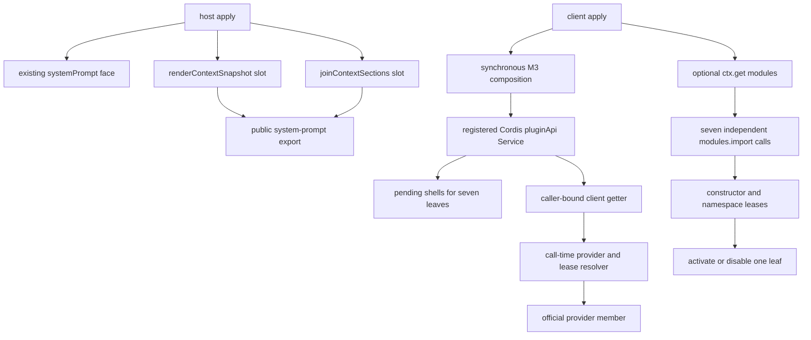

# M5 Official Passthrough Design

## Overview

M5 exposes exactly nine audited official faces that remain outside the frozen
M4 scope:

- `pluginApi.systemPrompt.renderContextSnapshot`
- `pluginApi.systemPrompt.joinContextSections`
- `pluginApi.client.inputTriggers`
- `pluginApi.client.commandUi`
- `pluginApi.client.modelDirectories`
- `pluginApi.client.conversation`
- `pluginApi.client.conversationEvents`
- `pluginApi.client.conversationViews`
- `pluginApi.client.timer`

The supported runtime boundary is the installed DSH `0.1.0-rc.6` public
contract. M5 is a passthrough facade over public package exports and registered
Cordis services. It does not synthesize an event, emulate a missing dispatch,
patch an official package, install a replacement bundle, or discover extra
members at runtime.

The host helpers are synchronous in the supported TypeScript contract and
return `string`. The forwarding layer does not await or convert results, so a
malformed test function that returns a rejected Promise still produces that
same Promise and rejection. Supporting a future signature change requires a
new accepted contract inventory; M5 does not anticipate it by changing the
current signature.

M5 shares only the existing plugin-api foundation with M4. It has no import,
guard dependency, mount dependency, API alias, or lifecycle dependency on any
M4 implementation. The M4 assignment and names remain unchanged.

### Design decisions

1. Host helpers are two independent slots layered onto the existing
   `systemPrompt` face. A missing helper never disables the other helper or the
   existing system-prompt methods.
2. The browser root is published synchronously as a real Cordis `Service`.
   The complete delivered M3 face is available immediately; the seven M5
   leaves start as typed pending shells and are filled independently after
   publication.
3. Client provider resolution is caller-scoped and happens at every access.
   A caller-bound composition is created afresh for every `client` getter read;
   it is never cached in a `WeakMap` or any other context-keyed cache.
4. Each imported constructor is held as a module-generation lease. A module
   cache invalidation retires only the affected leaf and cannot silently bind
   it to a new namespace. The RC.6 loader has no invalidation event, so lease
   validity is checked at import completion and at every later leaf access.
5. Existing `feature-registry.js` and `errors.js` remain structurally
   unchanged. M5 uses their existing operations and puts the surface key in
   the existing feature field and safe message/diagnostic text.

## Architecture



### Official boundary and inventory source

The implementation reads only the public root exports or the registered
service values identified in the contract inventory below. It does not import
private variables from an official bundle and does not use a class name,
property enumeration, or a generic Cordis `Service` as a substitute for the
declared constructor identity.

The seven browser constructor identities are loaded through the browser module
system. The module identifiers are bare package IDs, and the constructor is a
named export from that namespace. The design deliberately does not use
`./client#Constructor` or another subpath export convention.

The supported loader contract is the public three-argument call
`modules.import(specifier, parentURL, attrs)`. M5 always supplies all three
arguments (`specifier` is the bare package ID, `parentURL` is the facade client
entry identifier, and `attrs` is a fresh empty record). The current RC.6
implementation ignores the latter two arguments, but omitting them would not
implement the declared contract and would make a future loader change unsafe.
The loader's public cache record is `{ id, exports, styles, edges }` and its
`invalidate(id)` operation deletes the factory/cache entry without notifying
consumers.

### Host helper path

The host plugin keeps the existing `systemPrompt` base mounter and adds two
private helper slots to the service composition. Each slot owns its own:

- stable surface key;
- guard result and safe diagnostic;
- active or disabled method;
- generation token and current-record predicate; and
- identity-safe cleanup callback.

The guard reads the public namespace of `@deepseek-ai/dsh-system-prompt` and
checks only the named function belonging to that slot. A missing property is
`missing-export`; a non-function property is `invalid-export`. A passing
guard creates a wrapper that calls the official function with the original
argument list and returns the raw result. It does not validate, copy, freeze,
reorder, await, or wrap either input or output. Synchronous throws and
returned Promise identities are consequently preserved.

The public `systemPrompt` getter is composed from the existing base surface and
the two helper properties. The properties are always present, including while
a helper is pending or disabled. A disabled property throws
`PluginApiFeatureDisabledError` with the helper surface key as its existing
`feature` value. A retained wrapper first checks the root activity and its own
generation, so an old reapply or disposed slot cannot reach a newer export.

Host mounting keeps the existing `systemPrompt` base owner and mounts the two
helpers through a separate helper owner with two independent slot records. The
base mounter runs first; the helper owner runs after it and never overwrites the
base record. Reapply is idempotent while the owner token is active. On dispose,
each helper record is marked stale before its slot is restored to its disabled
shell; a stale cleanup can never remove a newer base or helper record. The
registry is a map and does not require a new schema. The host may store a safe
reason string in the existing `reason` field, but it does not add metadata
fields or change the meaning of legacy snapshots. Helper surface keys are
managed by this private owner rather than by adding helper-specific names to
the generic `KNOWN_FEATURES` mount table.

The two helper guards run independently of the existing `systemPrompt` guard.
If the base service is unavailable, either helper can still be active when its
public export is valid. If one helper is malformed, the base and the other
helper retain their current records. Reapply replaces a record only after the
new guard and wrapper are complete; cleanup marks the record stale before it
restores a disabled slot, and it restores only when its token still owns that
slot.

### Client root publication

The client plugin remains `inject = []`. It does not add
`@deepseek-ai/dsh-client-modules` to `dsh.client.inject`, and it does not wait
for an injected module service before publishing the root. Instead it treats
`ctx.get('modules')` as an optional browser substrate. If the substrate is
absent, the seven M5 leaves become locally disabled while all M3 faces still
publish.

Client apply is split into a synchronous publication phase and an asynchronous
bootstrap phase:

1. Build the existing M3 candidate synchronously using the current M3 guards,
   owners, direct faces, cleanup ordering, and fail-safe behavior. No M5
   import is needed to construct this candidate.
2. Create one root state and seven leaf records in `pending` state. Each leaf
   already has the complete public member shape from the inventory. Every
   pending call or property read throws the existing typed unavailable error
   for that surface key; it never returns a fake value.
3. Construct the client `pluginApi` subclass of the shared Cordis `Service`
   with the prepared M3 candidate and leaf records. The constructor registers
   the service under `pluginApi` synchronously. It performs no module import,
   provider lookup, member validation, logging, or other fallible work after
   the root registration boundary. Registration is the final publication
   step; post-registration initialization consists only of already prepared
   inert references and non-fallible assignments.
4. After the root is observable, start seven independent
   `modules.import(moduleId, parentURL, {})` operations. Each completion updates only
   its own pending record. A continuation first checks the root bootstrap token
   and then validates the namespace, named constructor, initial provider, and
   complete static member contract. It atomically changes that leaf to `active`
   or `disabled`.
5. Start each bootstrap promise under an explicit rejection boundary. The
   synchronous `apply()` returns its disposer immediately; no rejected import
   or continuation can become an unhandled rejection or escape plugin apply.
6. If service construction/publication fails before a Service root becomes
   observable, use the existing plain M3 publication path with the same M3
   candidate and cleanup record. M5 leaves are then disabled and no async
   bootstrap is started. If that fallback cannot publish, fail safe as the
   current client plugin does.
7. If an unexpected failure occurs after the Service root is observable, retain
   that root, disable only uncommitted M5 leaves, and do not publish a
   competing plain root. This avoids duplicate `pluginApi` owners.

The existing M3 root brand and idempotent reapply behavior remain intact. The
root is a Cordis `Service` value, but its existing M3 brand, `client.features`
array contents/order, M3 member identities, exact disposer identity, and
feature fallback states are preserved. M5 leaves are additive and cannot make
an M3 member pending or change an M3 feature's `isActive` result. An active
root is returned as-is on reapply with its exact disposer. A disposed root
marks every leaf record stale before unregistering; late import results are
ignored. A clean apply after disposal is the only new root generation.

### Caller-scoped client resolution

Cordis traces a `Service` property getter so `this.ctx` inside the getter is the
actual consuming context. The M5 getter relies on that contract:

```text
callerCtx = this.ctx
provider = callerCtx.get(serviceName)
```

Every `ctx.pluginApi.client` read creates a new composition bound to the
current caller. No composition is cached by context, and no provider captured
during apply is used for a later call. The M3 direct references retain their
current behavior; only M5 leaf members use the resolver below.

For every M5 method invocation and every live-property read, the resolver
performs these checks in order:

1. The root is active and the leaf record is current.
2. The lease still matches
   `modules.loadCache.get(moduleId)?.exports === lease.namespace`.
3. `provider = callerCtx.get(serviceName)` succeeds. The returned Cordis
   traceable provider is used directly; M5 never calls
   `callerCtx.reflect.trace()` a second time.
4. The provider passes `provider instanceof lease.Constructor`, using the
   exact constructor from the leased namespace.
5. Every direct member in the static inventory has its declared kind on that
   provider. This check is complete before the requested member is read or
   invoked.

For a method, M5 obtains the member from the validated provider and calls it
with that provider as receiver and the exact original arguments. For a
property, it returns the value from the validated provider as-is. Results,
Promises, rejections, async iterators, handles, subscriptions, and disposers
are never copied or wrapped.

If a caller scope lacks a provider, has the wrong provider kind, or has a
malformed member, that access gets a typed local unavailable error. The leaf's
mounted state and sibling leaves do not change, so another caller can still
resolve a valid scoped provider. If the module lease no longer matches,
however, the leaf is globally retired for that generation, because the
constructor identity is no longer trustworthy. It is not silently rebound to
the new cache entry.

### Lifecycle and lease transitions

Each leaf follows this state machine:

```text
pending --valid import/guard--> active
pending --guard failure------> disabled
active  --cache invalidation-> retired
active  --root disposal------> retired
disabled ---------------------> retired on root disposal
```

An active or disabled facade retains a root token and leaf generation. It
checks both before doing any provider work. A lease contains the bare module
ID, the exact imports namespace, the named constructor, and the generation
that acquired them. `modules.invalidate(id)` or an equivalent cache change
cannot cause an old facade to use a newly materialized namespace. Retirement
is identity-safe and logged at most once per leaf generation.

Because RC.6 does not emit invalidation notifications, the linearization points
are explicit. Import completion is accepted only if the root token is current
and `modules.loadCache.get(moduleId)?.exports === importedNamespace`. An active
leaf access is authorized by the same cache identity check immediately before
caller-provider resolution; a synchronous official call is then allowed to
complete even if it invalidates its own module, while the next access retires
the leaf. A cache change observed at either point retires the leaf before
returning a value or invoking an official method. Disposal and reapply first
invalidate the root token, then retire leaves, so an already queued import
continuation cannot reactivate an old generation. No invalidation callback is
assumed or installed.

## Components and Interfaces

### Static contract inventory

This is the complete M5 outward inventory for the supported runtime. The
implementation and tests must use this table, not runtime enumeration.

| Surface key | Official service/export | Bare module ID and constructor export | Direct members and semantics |
|---|---|---|---|
| `systemPrompt.renderContextSnapshot` | root public `renderContextSnapshot` | `@deepseek-ai/dsh-system-prompt` namespace export `renderContextSnapshot` | `renderContextSnapshot(assembly): string`; synchronous result or throw is forwarded unchanged |
| `systemPrompt.joinContextSections` | root public `joinContextSections` | `@deepseek-ai/dsh-system-prompt` namespace export `joinContextSections` | `joinContextSections(sections): string`; input and result are forwarded unchanged |
| `client.inputTriggers` | service `inputTriggers` | `@deepseek-ai/dsh-client-ui-input-trigger`, `InputTriggerService` | `registerSource(src: InputTriggerSource): () => void`; `sessionOf(actx: ClientContext): InputTriggerController`; the source, controller, and exact effect disposer remain opaque official identities |
| `client.commandUi` | service `commandUi` | `@deepseek-ai/dsh-client-ui-commands`, `CommandUiRuntime` | `register(contribution: CommandContribution): () => void`; `decorate(decoration: CommandDecoration): () => void`; `popupFor(actx: ClientContext): PopupSelectController<ClientSessionContext>`; registration disposers and popup are opaque official identities |
| `client.modelDirectories` | service `modelDirectories` | `@deepseek-ai/dsh-client-ui-model-selection`, `ModelDirectoryResolver` | `directoryFor(sessionId: SessionId): ModelDirectory`; the returned per-session directory is a live official identity and is not recursively wrapped |
| `client.conversation` | service `conversation` | `@deepseek-ai/dsh-client-ui-conversation`, `ConversationController` | live `readonly input: SessionInputResolver` and `readonly blocks: ComposerBlocks`; `send(text: string): Promise<void>`, `updateQueue(itemId: QueueItemId, action: QueueAction): Promise<void>`, `cancel(): Promise<void>`, `loadOlder(): Promise<void>`; caller-scope rebinding and Promise/rejection behavior remain official |
| `client.conversationEvents` | service `conversationEvents` | `@deepseek-ai/dsh-client-runtime`, `ConversationEventRegistry` | inherited `entries(): readonly ConversationNodeDefinition[]` and `subscribe(listener: () => void): () => void`; `register(definition: ConversationNodeDefinition): () => void`; `registerFallback(definition: ConversationNodeDefinition): () => void`; `fallbackEntry(): ConversationNodeDefinition \| undefined`; ordered entries, listener callbacks, and exact disposers remain official |
| `client.conversationViews` | service `conversationViews` | `@deepseek-ai/dsh-client-runtime`, `ConversationViewRegistry` | inherited `entries(): readonly ConversationViewDefinition[]` and `subscribe(listener: () => void): () => void`; `register(definition: ConversationViewDefinition): () => void`; ordered entries, listener callbacks, and exact disposers remain official |
| `client.timer` | service `timer` | `@deepseek-ai/dsh-cordis-client-runner`, `ClientTimerService` | `setTimeout(callback: () => void, delay: number): () => void`; `setInterval(callback: () => void, delay: number): () => void`; overloaded callback/Promise `timeout`; overloaded callback/async-iterator `interval`; `throttle<F>(callback, delay, noTrailing?): F & { dispose(): void }`; `debounce<F>(callback, delay): F & { dispose(): void }`. Callback disposers cancel pending work, Fiber teardown cancels owned schedules, and only throttled/debounced wrappers expose `.dispose()`; the service itself has no public `dispose()` member. |

The inventory intentionally excludes constructor-private implementation
members and class methods outside the audited outward contract, including
internal image orchestration, session command wiring, and composer-focus
plumbing. M5 must not expose those members merely because a provider happens to
have them. Conversely, every member in this table is required for its surface;
there is no optional-member exception within a supported runtime.

The following values are opaque and are never recursively inspected, copied,
frozen, enumerated, or wrapped by M5:

- `inputTriggers.sessionOf()` result;
- `commandUi.popupFor()` result;
- `modelDirectories.directoryFor()` result;
- `conversation.input` and `conversation.blocks` values.

`conversation.input` and `conversation.blocks` are checked only for the
present public value kind required by the inventory. Their internal members
are not part of M5's runtime contract.

### Host helper interface

The host-side helper owner accepts a public namespace, a surface key, and a
named export. It returns a stable method slot with these outcomes:

```text
active: (originalArgument) -> Reflect.apply(officialExport, namespace, [originalArgument])
disabled: () -> PluginApiFeatureDisabledError(surfaceKey, safeReason)
```

The real implementation forwards the full original argument list; the text is
only a compact notation. The helper owner exposes no new public service and no
event catalog entry.

### Client leaf interface

Each static descriptor contains:

```text
surfaceKey
serviceName
moduleId
constructorExport
directMemberContract
parentURL
attrs
```

Each runtime record contains a root token, generation, state, optional lease,
safe diagnostic, and a stable pending/active/disabled shell. A shell resolves
its current record on every access, which lets a reference acquired while the
root was pending observe the later active state without replacing the root or
silently retaining a stale provider.

The active shell exposes exactly the inventory's direct properties. It uses
explicit descriptors for properties and explicit wrappers for methods. It does
not use a permissive Proxy that forwards arbitrary provider keys. Static member
validation is performed against the exact table above: inherited members listed
by the contract are valid, but no other provider key becomes visible.

### Shared M3 boundary

The M3 candidate, existing `CLIENT_MOUNTERS`, M3 feature names, connection,
codec, remote, settings, and slot faces remain owned by their current modules.
M5 may add the client root/leaf orchestration needed to host the new faces, but
it must not rename an M3 member, alter its injection contract, or make an M3
surface conditional on a M5 import.

The client bundle remains a browser artifact. Official browser packages are
resolved through `ctx.get('modules')` and `modules.import()` at runtime; they
are not value-imported from Node. The package manifest is not changed to make
the optional module loader a hard client injection. The generated
`lib/client.js` must be regenerated from the source after implementation and
must preserve the existing no-cross-plugin-runtime-import test boundary.

The host package currently has static ESM imports for the required foundation
packages, including `@deepseek-ai/dsh-system-prompt`, before `apply()` can run.
Therefore a physically missing required peer package is a module-evaluation
failure outside the facade's fail-safe apply boundary; it is not treated as a
runtime helper guard failure. M5 does not broaden the supported installation
boundary or add a second host module loader. When the package is installed but
its public helper export is absent or malformed, the independent helper guards
provide the fail-safe behavior described above. A future safe-lazy-loading
change would be a separate feature because it would alter host startup and
dependency semantics.

## Data Models

### Safe diagnostics

M5 uses this closed reason vocabulary:

```text
missing-export | invalid-export | missing-service | invalid-provider |
missing-member | invalid-member
```

The internal diagnostic value is conceptually:

```text
{ surfaceKey, reason }
```

Only those two stable values may be logged or placed in the existing feature
reason string. Provider values, namespaces, arguments, assemblies, return
values, raw exceptions, and raw exception messages are excluded. The existing
`PluginApiFeatureDisabledError` receives `surfaceKey` as its `feature` field;
its safe message may contain the closed reason. No new error subclass,
`.reason` property, registry field, or registry API is introduced.

The existing feature registry continues to use its current calls:

```text
registry.mount(surfaceKey)
registry.disable(surfaceKey, safeReason)
registry.assertActive(surfaceKey)
```

Legacy feature names and free-form legacy reasons retain their current
behavior. M5's reason restriction applies only to M5 guard output.

### Host helper record

```text
{
  surfaceKey,
  generation,
  token,
  current,
  state: 'active' | 'disabled' | 'retired',
  facade,
  diagnostic?: { surfaceKey, reason }
}
```

`current` is invalidated before cleanup. A cleanup callback changes a public
slot only if its token still owns the slot.

### Client lease and root record

```text
lease = {
  moduleId,
  namespace,
  Constructor,
  generation
}

root = {
  active,
  rootToken,
  m3Candidate,
  modules,
  leaves: Map<surfaceKey, leafRecord>
}
```

The `namespace` identity is retained solely for the cache lease check. It is
not exposed through `pluginApi.client`.

## Error Handling

All M5 initialization and cleanup paths are fail-safe. The outer host and
client `apply()` boundaries catch their own failures and return normally.

| Condition | Affected state | Required behavior |
|---|---|---|
| Host helper export missing or non-function | One helper slot | Disable only that helper; log its surface key and `missing-export` or `invalid-export`; preserve the base and sibling helper |
| Optional browser module loader absent | All seven client leaves | Publish M3 and seven disabled leaves; each leaf uses `missing-service`; do not make the client fiber pending |
| One `modules.import()` rejects or returns a malformed namespace | One client leaf | Convert the failure to a permitted safe reason, disable that leaf, and contain the rejection; siblings continue |
| Named constructor export absent or wrong kind | One client leaf | Use `missing-member` or `invalid-member`; do not infer a constructor from `constructor.name` |
| Initial provider absent or not an instance of the leased constructor | One client leaf | Use `missing-service` or `invalid-provider`; do not publish a partial active face |
| Required direct member absent or wrong kind | One client leaf | Use `missing-member` or `invalid-member`; disable the complete named service atomically |
| Caller `ctx.get(serviceName)` fails or returns an invalid provider | One access | Throw `PluginApiFeatureDisabledError(surfaceKey, safeReason)`; hide the raw resolution error and leave mounted state unchanged |
| Module cache record disappears or exports identity changes | One leaf generation | Retire that leaf, log once with a permitted reason, and make old references typed-fail; never silently rebind |
| Retained helper/leaf belongs to an old token or disposed root | Retained reference | Throw `PluginApiInactiveError` for an inactive root, otherwise the surface-keyed feature-disabled error |
| Official active method throws or rejects | No facade state | Return the same throw/rejection/result without conversion or logging it as a guard failure |
| Service publication fails before root visibility | Client root candidate | Try the existing plain M3 fallback; if it also fails, log and return an inert disposer without throwing |
| Unexpected failure after Service visibility | Published root | Keep the single published root, disable uncommitted M5 leaves, and never publish a competing provider |
| Cleanup or late async continuation fails | Owning leaf/root only | Mark state stale first, contain cleanup errors, and ignore late results after the root token changes |

The pending shell has no guard diagnostic; it is a short-lived publication
state and throws the ordinary surface-keyed unavailable error. Only a completed
guard failure receives one of the six closed diagnostic reasons.

## Testing Strategy

Tests use `node --test` and remain focused on public behavior and lifecycle
contracts.

1. **Inventory forwarding.** Build table-driven official fakes for all nine
   rows. Assert every listed member, exact argument identity and order, the
   official receiver, synchronous result/throw behavior, Promise and rejection
   identity, live property identity, async iterator identity, and exact
   registration/subscription/timer disposer identity. Assert that unlisted
   provider members are not surfaced.
2. **Independent host guards.** Cover both helper exports independently,
   missing and invalid exports, a missing base system-prompt service, stale
   helper references, reapply replacement, and token-safe cleanup. Verify a
   rejected Promise returned by a malformed fake is not awaited or converted.
3. **Immediate client publication.** Use deferred `modules.import()` fakes to
   prove the real `pluginApi` root and all seven pending shells are visible
   synchronously, while M3 faces remain usable before imports settle. Assert
   that `apply()` returns a disposer and no import rejection becomes an
   unhandled rejection.
4. **Per-leaf isolation.** For each client row, cover absent loader, rejected
   import, malformed namespace, missing/invalid constructor, missing/invalid
   provider, and missing/invalid required member. Assert only that leaf is
   disabled, the other six leaves and all M3 faces remain available, and the
   safe diagnostic contains only the surface key and an allowed reason.
5. **Caller context and receiver.** Use real Cordis `Service` tracing and a
   child consuming context. Make a scope-sensitive conversation/provider fake
   read its bound `this.ctx`; prove the call sees the consuming context, not
   the apply root. Spy that M5 uses `callerCtx.get()` directly and does not
   trace a second time. Verify a fresh composition is made for each getter
   read rather than returned from a context cache.
6. **Opaque and live values.** Verify exact identity for trigger controllers,
   popup controllers, model directories, conversation input/blocks, live
   registry entries, and model-directory state. Do not inspect internals of
   values declared opaque by the inventory.
7. **Lease and lifecycle races.** Invalidate a module after activation and
   assert global leaf retirement, typed failure of old references, no silent
   rebinding, and sibling continuity. Exercise disposal during each import,
   old-generation cleanup after reapply, root publication failure/fallback,
   and late rejected continuations.
8. **M3 and manifest regression.** Assert the existing M3 member shape and
   cleanup order, `inject = []` in the client runtime, and no added
   `@deepseek-ai/dsh-client-modules` client injection. Load the generated
   `lib/client.js` in a VM and verify its handoff, root publication, and
   no-cross-plugin-runtime-import boundary.
9. **M4 independence.** Mount M5 with the shared foundation but no M4
   service, facade, or implementation. All valid M5 rows must operate, and
   source/artifact checks must show no M4-specific import, guard, alias, or
   feature dependency.

## Non-Goals

- No M4 API is renamed, moved, duplicated, or reclassified.
- No `tasks.md`, implementation code, generated client artifact, package
  injection, official package file, replacement bundle, or consumer migration
  is part of Stage 2.
- No new event catalog entry, B-class simulation, C-class upstream workaround,
  R-class replacement, remote namespace, or dynamic provider/member discovery
  is introduced.
- No recursive facade is built for opaque official return values.
- No future asynchronous helper signature is added to the RC.6 inventory.
