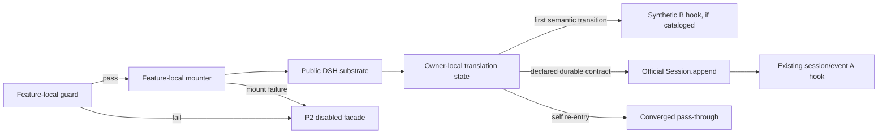
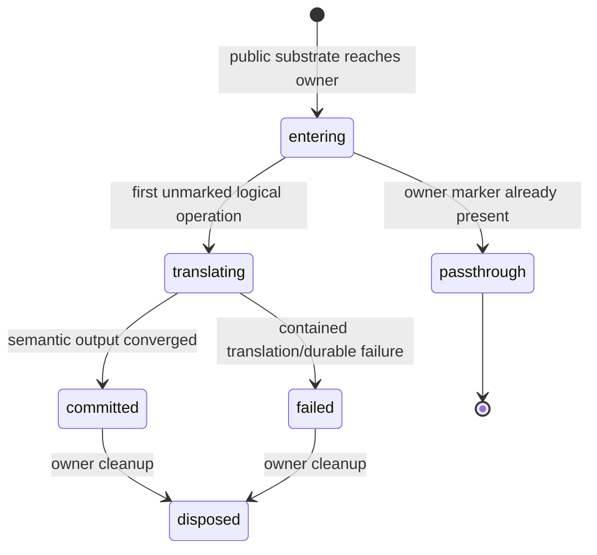

# Design: plugin-api-semantic-hooks-m2

> feature_name: `plugin-api-semantic-hooks-m2`
> 状态：已批准（Stage 2）
> 上游：`requirements.md`（Stage 1 已批准）、`plugin-api-m1-integration`
> 范围：host-side B 类转译共同契约；不实现具体 M2 feature 或 M3 bridge。

---

## Overview

本设计把 M2 B 类语义转译的共同规则固化为**规格契约，而非新的 runtime engine**。一个 B feature 只能通过公开的 Cordis dispatch、公开 service 或公开导出实现其语义；它必须自己持有 re-entry marker、收敛状态、资源 disposer 与 durable effect identity。这个边界防止尚未被两个真实 feature 证明的抽象提前进入 `lib/`。

因此，本 feature **不修改** `lib/`、`test/`、`package.json` 或 DSH 安装目录；不增加 `pluginApi` namespace、不注册事件目录条目、不变更 `FEATURE_MOUNTERS`。后续 `plugin-api-llm-request-m2`、`plugin-api-exec-route-m2` 和 `plugin-api-session-durable-m2` 分别依据本设计实现自己的 owner-local adapter。只有至少两个具体 M2 feature specification 证明相同的状态转换、失败语义和 disposer 语义后，才可在一个新的、获批的 design 中提取共享纯函数。

### 调研结论与分类

| 未来语义 | 分类 | 公开 substrate | 本阶段固定的限制 |
|---|---|---|---|
| `llm/request` 有限 stream-entry re-entry emulation | B（条件性） | `llm/stream` waterfall | DSH 在 `LlmRuntime.streamWithRegistration()` 中直接 `ctx.waterfall(..., 'llm/stream', options, next)`；没有原生 `llm/request` dispatch。对 loop-built request，`options` 是深冻结、仅可读取且由 session log 重建；未来 feature 只能证明一个不改写该 request 的有界 stream-entry semantic，不能承诺任意同步 request rewrite、全部 caller 拦截或 adapter 私有直调。 |
| `exec.route` / `routeOf(exec)` | B | `tools/pre-execute` waterfall，及 `Session.requestContext()` 读面 | 工具 runtime 在 execution 已创建后才派发 `tools/pre-execute`；`requestContext()` 只返回最近一次已提交的 `request/context`，因此无 route 时只能产生已声明的缺失结果，不能臆造 route。 |
| session durable helper | B（条件性） | `Session.append()` 与既有 `session/event` A 类 firehose | 只能写入官方已认可的 session event type 和合法 surface metadata。不能用公开 API 表达的持久化语义是 C 类，不得伪造 record。 |
| 异步完整请求改写、loop-built request 的消息或 config 改写、跨全部 caller 的请求拦截、未定义 durable record、client wire | C | 无 | loop-built request 是从 session history 重建的深冻结 input；这些语义没有可保真的公开 seam。必须记录 upstream proposal 或留给 M3；本设计不提供降级模拟。 |

当前版本的证据位于：`@deepseek-ai/dsh-llm/lib/index.js:1375-1390`、`@deepseek-ai/dsh-tool-cordis/lib/index.js:3681-3689`、`@deepseek-ai/dsh-agent-loop/lib/index.js:720-738`、`@deepseek-ai/dsh-tools/lib/index.js:3078-3137`、`@deepseek-ai/dsh-session/lib/index.js:1450-1479` 与 `1503-1514`。这些路径是运行时调研依据，不是可由本插件 import 的私有模块。

## Architecture



### A1. Host ownership and lifecycle

Every concrete B feature SHALL have exactly one named translation owner. That owner owns the public substrate subscription, marker store, translation state, catalog slice, synthetic dispatch, durable write decision, and idempotent disposer. A consumer of the synthetic hook owns none of those decisions.

A downstream mounter follows the existing M1 lifecycle shape:

```text
runFeatureGuard(featureName) -> pass-1 guard result
  -> events catalog selection from the pass-1 result
  -> feature-local mountFeature(...)
  -> ctx.effect(() => disposer)
  -> featureRegistry.mount(featureName)
```

The current host executes that pattern in `lib/index.js:161-207` and `lib/index.js:402-450`. The only authoritative re-apply test is `featureRegistry.isActive(featureName)` (`lib/feature-registry.js:30-38`). A feature MUST return an idempotent no-op disposer only when that signal is already true. It MUST NOT infer activity from the public facade shape.

A disposer MUST be idempotent, swallow its own cleanup failures, detach every owned Cordis registration, invalidate all owner-local markers, and never change a newly mounted instance's state. The owner shall use an instance epoch or identity-bound closure so that a stale disposer cannot detach a later registration.

#### Publication transaction integration issue

The current generic loop calls a feature mounter before it calls `ctx.effect()` (`lib/index.js:422-449`), while existing mounters commonly call `service.mountFeature()` inside that earlier step. If cleanup registration then throws, the loop calls the disposer and disables the registry, but it has no generic operation that restores the feature's disabled facade object. A B feature therefore cannot independently prove the P2 disabled-facade result for this path.

Before the first B feature exposes a facade entry point, a coordinated M2 integration Design MUST select and test one transaction boundary: either (a) a mounter returns an unexposed prepared API plus disposer, then the host registers cleanup before it publishes the API and marks the registry active; or (b) the host gains an explicit reversible unmount/reset operation that restores the disabled facade before registry disable. The chosen mechanism must also dispose a partially registered substrate hook. Until then, no individual B worktree may publish a facade member whose mount precedes successful cleanup registration.

This is separate from the catalog-slice gate in A4: it governs public API activation even for a B feature with no synthetic catalog entry.

### A2. Owner-local semantic convergence

The shared state machine is a contract, not a class or helper module:



Each owner keeps internal state conceptually equivalent to:

```ts
type TranslationRecord = {
  owner: string
  operationKey: object | string
  phase: 'entering' | 'translating' | 'committed' | 'failed'
  epoch: object
  synthetic: 'not-requested' | 'not-attempted' | 'attempted' | 'dispatched'
  durableIdentity?: DurableIdentity
}
```

This is an explanatory model only. It is not a public type, a serialized session payload, or a generic `lib/` API.

The concrete feature Design MUST declare all of the following before implementation:

1. The logical-operation identity and its lifetime. It may use an official object identity in a `WeakMap` only when the substrate preserves that identity. A transformed child object requires explicit owner-local propagation such as a closure or an owner-local async context; mutation of borrowed/frozen official input is forbidden.
2. The owner key. Markers are keyed by **owner and logical operation**, not merely by one global boolean, so independent nested translations and concurrent requests continue independently.
3. The convergence predicate. First entry may transform; a self-re-entry must pass through a semantically converged operation without re-emitting or re-writing. A non-convergent transform must not be shipped as B.
4. Marker cleanup. Transient records end after the substrate completion path settles. Durable deduplication must not rely solely on a transient marker, because a retry can occur after that record is gone.
5. The decline and failure policy. By default, an owner that cannot safely inspect an operation passes the official operation through unchanged, emits no success-form synthetic event, and records one contained redacted diagnostic. A fail-closed deviation is permitted only when its approved Requirements name the safety invariant and its Design defines the typed operation-level rejection; it must never throw through `apply()`. For `llm/stream`, a loop-built request is borrowed, deep-frozen input: the owner may read it but must neither mutate it nor claim that a re-entered child call is a general request rewrite. A feature that cannot prove its bounded re-entry preserves the loop's session-history reconstructability is C.

No downstream feature may suppress another feature's work merely because a different owner has an in-flight translation. Conversely, re-entry that carries the same owner and operation identity must not reapply its transform.

### A3. Synthetic hook and durable effect boundary

A synthetic B hook is transient host dispatch. A durable effect is an official `Session` log record. They are distinct outputs with distinct exactly-once proof obligations.

- A synthetic hook may be emitted only after the owner has reached its declared semantic transition. It is not a persistence mechanism and must never be reconstructed from a stale marker.
- A durable helper may call `Session.append()` only after it validates the requested `type` against a public official vocabulary: either the public `KNOWN_SESSION_EVENT_TYPES` export or the M1 facade's `session.isSessionEventType()` guard. Before the call, it also validates `data` and any caller-provided metadata with public `isJsonValue`; it does not rely on `append()` to decide JSON membership. Its feature guard must probe each public validator it selects, and an absent or throwing validator makes the B feature P2-disabled. Before selecting a surface recipe, it validates that the recognized type is surface-eligible through public `isSurfaceEligibleType` or M1 `session.isSurfaceEventType`; a non-surface type rejects surface metadata instead of forwarding it. For a surface-eligible type, the helper may use only a feature-approved fixed construction recipe: its `surfaceOp` is a declared literal, its `sourceEventSeqs` are derived from public immutable `session.events` and are checked as existing integer sequence numbers, and it never accepts an arbitrary surface intent from a plugin caller. A dynamic surface mutation whose order or metadata relationship cannot be established by this public recipe is C, not an input forwarded to `append()`. If the type is not recognized, the helper must not call `append()` and the requested custom durable record is C. The deterministic durable identity must be representable by that approved record contract; otherwise the write is C. The official method then performs its remaining public append-time surface-order validation, freezes the record, appends it, and publishes `session/event` (`@deepseek-ai/dsh-session/lib/index.js:1450-1479`).
- A durable feature MUST derive a deterministic durable identity from declared public facts, then inspect the immutable `session.events` history before appending. The identity must prove that a retry represents the same logical effect. A marker prevents re-entry; history-backed identity prevents duplicate writes across retry, resume, or re-apply.
- The owner MUST NOT call `Session.append()` from a contained `session/event` observer. DSH rejects append re-entry while it is publishing an append (`dsh-session/lib/index.js:1450-1453`). If the desired timing exists only in that observer, the feature must classify that write path as C unless a separate public timing seam is available.
- When a feature declares both a durable effect and a notification, it shall emit the synthetic B hook only after `append()` returns its committed record, and shall use the declared timing, payload, scope, and lifecycle to choose the existing A event or synthetic B event. A failed append emits neither a success notification nor a substitute durable record.
- Before one synthetic dispatch attempt, the owner sets `synthetic: 'attempted'` in the owner-and-operation record. This is an irreversible, non-retry state: it proves the owner has already invoked the one permitted dispatch, even if that dispatch later escapes to its caller. On normal return it becomes `'dispatched'`. A listener failure already contained by M1 (`fault: 'contain'` or an asynchronous `fault: 'created'` rejection) is intentionally unobservable to the owner and leaves the normal dispatch result intact. For a synchronous `fault: 'created'` throw or any `fault: 'propagate'` throw/rejection, the owner MUST preserve M1 semantics by returning or rethrowing the original value/reason unchanged; it MUST NOT contain, replace, or retry it. The committed durable record, if any, remains intact. This guarantees at most one owner-originated synthetic occurrence and prevents a subscriber failure from becoming a duplicate durable or synthetic result.

`session/event` remains an existing A-class catalog entry (`lib/session-events-catalog.js:48-58`). A B helper must not relabel it as B merely because it consumed that public event.

### A4. Catalog and mount integration gate

M1 catalog composition is selected from pass-1 guard results before later feature mounters run (`lib/index.js:161-191`). Its `composeCatalogs()` helper rejects duplicate names (`lib/catalog-compose.js:21-37`), while `events` owns the resulting failure and follows its P2 disabled path. A B catalog slice therefore has these non-negotiable rules:

1. It is an independent `lib/<feature>-events-catalog.js` module and exports `<feature>EventsCatalog`; direct additions to `lib/events-catalog.js` are forbidden.
2. Entries use M1 schema and declare `type: 'B'`. Their owning feature documentation names the owner and public substrate, and the entry specifies source, mode, scope filtering, payload, args, and any fault/freeze policy; the runtime does not infer those values from translation code.
3. A failed pass-1 guard excludes the entire slice. A later facade disabled state does not alter the already-composed catalog.
4. The feature Design must prove that every guard-success/mount-failure path removes or prevents its slice. The current two-pass host has no per-slice rollback after `events` mounts, so the first B slice requires a coordinated M2 integration design to choose and test that mechanism. An individual B worktree may not silently accept an orphan catalog entry.
5. A duplicate B entry is a catalog composition defect. It disables `events` through the established M1 P2 path; it must not guess which contributor to disable.

The required integration issue in item 4 is intentionally unresolved here: no B feature exists yet to establish the least invasive mechanism, and changing `lib/events-bus.js` or `lib/deep-freeze.js` before that evidence would violate the frozen-file protocol.

### A5. Parallel-worktree contract

For a concrete B feature, the coordinator's task package must name the feature name, mounter position, dependencies, event names, substrate, operation identity, marker lifetime, convergence predicate, durable identity (if any), and P1-P4 result. It must also reserve the M1 append-only edit seams:

| Area | Downstream responsibility |
|---|---|
| `lib/guards.js` | Add only its guard branch before the unknown fallback; mandatory missing substrate is fail-closed. |
| `lib/plugin-api-service.js` | Add only its disabled facade constructor, constructor member, and `mountFeature` branch. |
| `lib/index.js` | Add its mounter and the pre-agreed `FEATURE_MOUNTERS` position without reordering M1 entries. |
| catalog | Add only its own kebab-case slice module and `test/<kebab-runtime-key>-events-catalog.test.mjs`; never edit `events-catalog.js`. |
| feature-local adapter | Name its module and focused test from the same kebab runtime key; declare any additional name before coding rather than inventing an alias. |
| frozen shared code | Record a coordinated integration issue rather than edit `events-bus.js` or `deep-freeze.js`. |
| merge coordinator | Run the M1 parallel-workflow pre-merge audit, resolve catalog/lifecycle semantics in one integration pass, and require the full suite to pass. |

The existing dependency order remains intact. A B feature can only be placed after all of its declared dependencies; at minimum a synthetic-event owner is after `events`, `llm/request` after `llm`, `exec.route` after `tools` and the required session read surface, and a durable helper after `session`.

## Components and Interfaces

### C1. No new public foundation interface

This feature exports no new facade member. It deliberately does not introduce a `pluginApi.semantic`, `pluginApi.translation`, or `services.*` member. Doing so would make an unproven abstraction public before any concrete user need exists.

Future feature APIs are designed in their own approved specs. Each must document one of these integration mechanisms:

| Capability shape | Required design statement |
|---|---|
| A-class official event is sufficient | Name the event and prove its timing, payload, scope, and lifecycle meet the public semantic; do not add a B equivalent. |
| B-class public substrate translation | Name substrate and all fidelity limits; define owner-local state, synthetic catalog entry, guard, disposal, and convergence. |
| C-class impossible contract | State the exact missing official seam, expose no misleading emulation, and create an upstream-proposal boundary. |

### C2. Failure presentation

| Condition | Host behavior | Public result |
|---|---|---|
| core inactive | Do not mount translation or facade capability. | P1 `PluginApiInactiveError` before official service access. |
| mandatory substrate or feature guard missing | Log contained diagnostic, mount nothing, mark owner inactive. | P2 `PluginApiFeatureDisabledError(featureName)`. |
| registration/mount/disposer installation fails | Best-effort dispose partial registration; mark owner inactive; do not throw through `apply()`. | P2 `PluginApiFeatureDisabledError(featureName)`. |
| already-active re-apply | Do not duplicate subscription or marker store. | Idempotent no-op lifecycle result. |
| translation cannot inspect or declines operation | Preserve the official operation unchanged, log once, and produce no success-form B event. | Default fail-open behavior; a fail-closed operation path requires an approved feature-specific typed contract. |
| translator implementation throws before semantic commit | Catch it inside the owner, record one failure diagnostic, and invoke the original substrate continuation exactly once with the unmodified operation. A feature must stage all error-prone translation work before it calls or re-enters that continuation. | Default fail-open behavior; a fail-closed operation path requires an approved feature-specific typed contract. |
| third-party listener invoked by a synthetic B hook throws | Apply the catalog entry's existing M1 `fault` policy; this is distinct from a translator failure. The owner records its non-retry attempt before dispatch, then preserves any `created`/`propagate` exception or rejection unchanged. | Existing event-bus semantics for the listener; no second owner dispatch attempt. |
| optional M1 service becomes unavailable | Apply only to an existing M1-approved optional facade operation. | Existing P3 `PluginApiServiceUnavailableError(serviceName)`. |
| disabled `services.*` member | Retain the existing services-only policy. | Existing P4 behavior. |

New B features MUST NOT invent a P3 route. A missing B substrate or an unavailable optional official service used by a new B feature is P2, even if that service is optional elsewhere. `PluginApiServiceUnavailableError` remains restricted to existing M1-approved optional service contracts.

### C3. Client boundary

This stage creates no client bundle, remote namespace, codec, schema, settings section, or wire error mapping. A host B feature may expose host-local synthetic events only. Any capability requiring client invocation, remote contribution, settings discovery, or durable client rendering must defer those requirements to M3 with an explicit codec and failure contract.

## Data Models

The M1 catalog entry remains the only shared data model used by this feature family:

```ts
type CatalogEntry = {
  name: string
  mode: 'on' | 'emit' | 'serial' | 'parallel' | 'bail' | 'waterfall'
  scopeFiltered: boolean
  scopeKey: 'args[0].agent' | 'args[1].scope' | null | undefined
  payload: string
  args: string
  source: string
  type: 'A' | 'B' | 'R'
  fault?: 'contain' | 'created' | 'propagate'
  freeze?: 'all' | { deep: string[] } | 'except-signal'
}
```

For a B slice, `type` is literally `'B'`. `source` identifies the concrete feature-list item, not this common-foundation specification. The catalog stays deeply frozen through M1 composition; B code may not mutate it or use it as marker storage.

A durable identity is feature-private but must be deterministic, comparable from public immutable session history, and sufficient to distinguish two legitimate operations in the same session. It must not use object identity, a process-local counter, or a transient marker as its only proof.

## Error Handling

All entry paths are fail-safe. The host's final `apply()` catch exists at `lib/index.js:452-455`, but a B mounter must not depend on it for normal failure management. Guard probes, hook registration, translator-owned code, diagnostics, and disposer execution must each contain their expected failures. Synthetic subscriber faults instead retain the selected M1 catalog `fault` semantics; a required `created` or `propagate` error may escape its runtime dispatch but must never escape `apply()`.

The design distinguishes failures deliberately:

- A guard failure is known before activation and leaves a disabled facade with a diagnosable P2 reason.
- A mount failure rolls back resources already acquired by that owner and leaves no active marker, future translation, or orphan B catalog slice.
- A translation failure ends only its logical operation. It cannot cause a second translation attempt from self-reentry, duplicate synthetic occurrence, or duplicate durable record.
- A durable validation failure is not recoverable by inventing a private event envelope. It either uses a documented non-durable B outcome or the feature is C.

Official source errors and behavior retain their official semantics unless a concrete feature's approved API explicitly defines a facade-level translation. This foundation does not catch-and-retype arbitrary runtime errors for third-party callbacks.

### Diagnostic contract

An owner-local diagnostic record is keyed by `(featureName, lifecyclePhase, category, logicalOperationIdentity)`. For durable retry paths, the identity is the declared durable identity; for transient paths, it is the operation identity over that operation's declared lifetime. The owner records the key before calling the logger and suppresses later diagnostics with the same key. A later independent operation must receive its own diagnostic eligibility.

Diagnostic text may include feature identity, lifecycle phase, category, stable opaque identifiers, and error class/message only after the feature's redaction rule has approved them. It MUST NOT include request content, prompt text, credentials, or raw catalog/session payloads. A missing or throwing logger is ignored; it neither changes the official operation nor causes `apply()` to throw.

## Testing Strategy

This foundation has no runtime implementation, so it adds no code tests. Every downstream B feature must implement the following test matrix before it may claim this contract:

| Test area | Required proof |
|---|---|
| classification | Official A event satisfies all declared dimensions, or B declares substrate/fidelity, or unsupported behavior is C. |
| guard and facade | Core inactive gives P1; each mandatory missing probe and registration failure gives P2; no new P3/P4 path appears. |
| lifecycle | `apply()` never throws; duplicate apply produces one substrate registration; each disposer is idempotent; stale cleanup cannot detach a fresh instance; `ctx.effect` failure leaves both registry and facade disabled. |
| re-entry | Same-owner nested re-entry converges; independent nested owner proceeds; concurrent independent operations do not share a marker. |
| exactly once | One semantic transition yields one synthetic occurrence and, when declared, one durable effect; retry/resume cannot create a second durable identity; `created`/`propagate` subscriber failure cannot cause a retry or change the original error. |
| catalog | Guard-pass slice is present with `type: 'B'`; guard-fail slice is excluded; duplicate name disables `events`; guard-success/mount-failure has no orphan slice. |
| session boundary | Unknown type and non-JSON data/metadata are rejected by declared public guards before `append()`; a surface write uses only its approved fixed public construction recipe; invalid surface metadata never creates a record; synchronous `session/event` append re-entry is not attempted; synthetic notification and durable record remain separate. |
| diagnostics | Disable, decline, and contained owner failure include feature/phase/category; repeat of the same diagnostic identity logs once; no message, credential, prompt, or raw payload is exposed; logger failure is inert. A `created`/`propagate` subscriber error remains unwrapped. |
| event-bus policy | The slice observes M1 priority, scope, freeze, and fault behavior. |

The coordinated first-B-slice integration must additionally test catalog composition against the actual two-pass host with both a successful and a failed registration path. This is the acceptance gate for resolving Architecture A4.4, not permission to weaken it.

## Key Decisions

| ID | Decision | Rationale |
|---|---|---|
| D1 | Deliver contract-only foundation now. | No two concrete M2 feature specifications yet demonstrate identical runtime behavior and failure semantics. |
| D2 | State is owner-local and private. | Re-entry identity depends on each substrate; a shared marker risks cross-feature suppression. |
| D3 | Use history-backed durable identities. | In-memory markers cannot prove exactly-once behavior over retry, resume, or re-apply. |
| D4 | Do not append inside `session/event`. | Official session runtime rejects append re-entry during publication. |
| D5 | First B catalog slice is a coordinated integration gate. | M1 composes slices before later mounters and lacks per-slice rollback. |
| D6 | First B facade activation is a coordinated transaction gate. | Current mounters publish before `ctx.effect`; P2 requires cleanup-registration rollback to restore the disabled facade. |
| D7 | Retain P1-P4 without expansion. | Typed failures are a stable facade contract; broad P3 would hide mandatory substrate failures. |
| D8 | Defer client/wire behavior to M3. | No client contract can be correct without a concrete host API, codec, and lifecycle definition. |
| D9 | Diagnostics are owner-local, deduplicated, and redacted. | Re-entry must not flood logs or disclose translated request data. |
