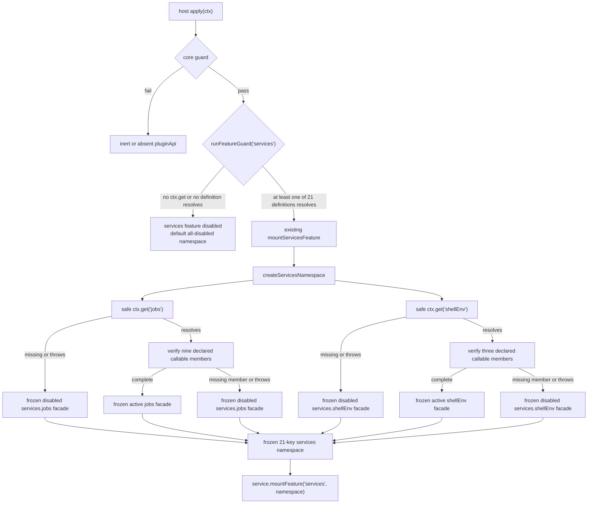

# Feature Design: plugin-api-services-jobs-shellenv-m4

> **公共契约现状注（2026-08-29 追加）**：本制品成文于目标领域树 cutover 之前，文中的公共 path 为旧命名。现行命名以 [`public-contract.registry.json`](../plugin-api-m7-public-contract-refactor/public-contract.registry.json) 的 `oldToTargetMapping` 为唯一权威，本制品涉及的映射如下：
>
> | 本制品使用的旧 path | 现行 path |
> |---|---|
> | `pluginApi.session` | `pluginApi.sessions` |
>
> 本制品新增的 `pluginApi.services.jobs` / `pluginApi.services.shellEnv` 直通面在后续公共契约重构中保留（属有独立消费者的 `services.*` 成员），`services.*` 已按成员分级、不再整体视为天然可组合。现行契约基线：包版本 `0.1.0-rc.6-0.1.0`（runtime `0.1.0-rc.6` / `dsh.api` `0.1`）；本制品中出现的 `0.1.0-rc.6-0.x` 为历史交付边界记录，不代表现行版本。本注只更新命名与版本指针，不改动本制品已获批的 Goal / Requirements 验收边界。

## 1. Overview

`plugin-api-services-jobs-shellenv-m4` delivers two additional A-class, host-side
capability facades at `pluginApi.services.jobs` and `pluginApi.services.shellEnv`.
It extends the existing 19-key `pluginApi.services` namespace to 21 keys while
preserving the existing `services` feature, mount point, feature-registry name,
guard branch, and P1/P2/P4 failure taxonomy — exactly the way
`plugin-api-compaction-m2` extended it for SV17.

The design exposes only the public service faces of the two official seams:

| Facade member (jobs) | Official target | Stable basis |
|---|---|---|
| `start` | `ctx.jobs.start(spec)` | abstract `JobRegistry.start` (`@deepseek-ai/dsh-jobs`) |
| `list` | `ctx.jobs.list(caller?)` | abstract `JobRegistry.list` |
| `get` | `ctx.jobs.get(id, caller?)` | abstract `JobRegistry.get` |
| `read` | `ctx.jobs.read(id, caller?)` | abstract `JobRegistry.read` |
| `kill` | `ctx.jobs.kill(id, caller?, reason?)` | abstract `JobRegistry.kill` |
| `wait` | `ctx.jobs.wait(id, timeoutMs, caller?, signal?)` | abstract `JobRegistry.wait` |
| `onJobDone` | `ctx.jobs.onJobDone(listener)` | abstract `JobRegistry.onJobDone` (returns disposer) |
| `onJobsChanged` | `ctx.jobs.onJobsChanged(listener)` | abstract `JobRegistry.onJobsChanged` (returns disposer) |
| `attachController` | `ctx.jobs.attachController(name)` | abstract `JobRegistry.attachController` (returns disposer) |

| Facade member (shellEnv) | Official target | Stable basis |
|---|---|---|
| `register` | `ctx.shellEnv.register(contributor)` | public `ShellEnvRegistry.register` (returns disposer) |
| `collect` | `ctx.shellEnv.collect(execution)` | public `ShellEnvRegistry.collect` |
| `list` | `ctx.shellEnv.list()` | public `ShellEnvRegistry.list` |

`ctx.jobs` is declared by module augmentation in `@deepseek-ai/dsh-jobs`
(`interface Context { jobs: JobRegistry }`); the abstract `JobRegistry` is the
service definition, and `@deepseek-ai/dsh-jobs-local` (`LocalJobRegistry`)
provides the live process-local implementation. `ctx.shellEnv` is declared and
provided by `@deepseek-ai/dsh-shell-env` (`ShellEnvRegistry`). Both are
host-plane services: the facade obtained through `ctx.get('jobs')` /
`ctx.get('shellEnv')` never imports, detects, or depends on a concrete class.

**Type and mechanism:** A-class official service direct binding. No event
translation, wrapper chain, B-class re-entry, or C-class proposal is involved.

**Host/client split:** Host only. This feature creates no client bundle, remote
contribution, codec, slot, browser API, or client peer dependency.

---

## 2. Architecture

### 2.1 Runtime flow



### 2.2 Key decisions

1. **One existing feature, not a new feature:** `jobs` and `shellEnv` are
   definitions within the delivered `services` feature. There is no
   `runFeatureGuard('jobs')`, no `FEATURE_MOUNTERS` entry, no feature-registry
   record, no top-level `pluginApi.jobs` / `pluginApi.shellEnv`, and no
   independent cleanup lifecycle.
2. **Static allowlist:** `SERVICE_DEFINITIONS` remains the sole source of
   exposed members. Runtime property enumeration of `ctx.jobs` / `ctx.shellEnv`
   is prohibited. This preserves the exact 9-member and 3-member public shapes
   and prevents concrete-provider or private members from leaking.
3. **Existing generic forwarding:** every declared member is `kind: 'method'`
   and uses the existing rest-argument delegate pattern,
   `(...args) => target[name](...args)`. This preserves `this === official
   service`, argument identity, call ordering, return/disposer identity,
   timing, and optional trailing argument omission: `jobs.kill(id)` stays a
   one-argument official call, `jobs.wait(id, timeoutMs)` stays a two-argument
   call, `shellEnv.collect(execution)` remains a one-argument call, etc.
4. **Disposer identity is preserved:** `onJobDone`, `onJobsChanged`,
   `attachController`, and `shellEnv.register` return the exact disposer the
   official service returns. No facade-owned re-disposal, caching, or wrapping
   is added.
5. **Scope neutrality:** the official `onJobDone`/`onJobsChanged`/
   `attachController` register through `this.layers.effect(this.ctx, ...)`, and
   `shellEnv.register` registers through `this.ctx.effect(...)` — in both
   cases the registration/effect scope derives from the **service's own
   context**, not the caller's fiber. A facaded call therefore behaves exactly
   like a direct `ctx.get(...)` call; the facade introduces no scope rebinding,
   no owner-relative redelivery change, and no new effect ownership. Verified
   against `dsh-jobs-local/lib/index.js` (`layers.effect(this.ctx, ...)`) and
   `dsh-shell-env/lib/index.js` (`this.ctx.effect(...)`).
6. **Freeze facade, never target:** the namespace and every facade are frozen;
   the official `ctx.jobs` / `ctx.shellEnv` objects are never frozen, sealed,
   proxied, or otherwise altered.
7. **No direct official import:** all members are obtained via Cordis injection
   (`ctx.get('jobs')`, `ctx.get('shellEnv')`). No code imports
   `@deepseek-ai/dsh-jobs`, `@deepseek-ai/dsh-jobs-local`, or
   `@deepseek-ai/dsh-shell-env`, so no peer dependency is added for this feature.
8. **No event surface:** `jobs/*` and `shellEnv/*` are not added to
   `pluginApi.events`, event catalogs, or event-bus logic. The jobs observer
   operations (`onJobDone`, `onJobsChanged`, `attachController`) remain service
   methods with official listener semantics; they are NOT new Cordis event
   types and NOT `pluginApi.events` catalog entries.

---

## 3. Components and Interfaces

### 3.1 `lib/services.js`: append the two definitions

Append the following static definitions after the current 19 entries in
`SERVICE_DEFINITIONS` (i.e. after `compaction`):

```js
{
  key: 'jobs',
  ctxService: 'jobs',
  pkg: 'dsh-jobs',
  members: [
    { kind: 'method', name: 'start' },
    { kind: 'method', name: 'list' },
    { kind: 'method', name: 'get' },
    { kind: 'method', name: 'read' },
    { kind: 'method', name: 'kill' },
    { kind: 'method', name: 'wait' },
    { kind: 'method', name: 'onJobDone' },
    { kind: 'method', name: 'onJobsChanged' },
    { kind: 'method', name: 'attachController' },
  ],
},
{
  key: 'shellEnv',
  ctxService: 'shellEnv',
  pkg: 'dsh-shell-env',
  members: [
    { kind: 'method', name: 'register' },
    { kind: 'method', name: 'collect' },
    { kind: 'method', name: 'list' },
  ],
}
```

Both definitions have no getter, forward, or optional member. Their position
makes `SERVICES_NAMESPACE_KEYS`, the default disabled namespace, and all
`SERVICE_DEFINITIONS`-driven test fixtures include `jobs` and `shellEnv`
automatically. The namespace's exact stable order becomes:

```text
fs, codeRuntime, workspaces, subagents, workflows, approval, userQuestions,
attachments, skills, storage, sessionProjections, sessionQuery, sessionTitle,
sessionTelemetry, sessionReferences, tokenMeter, agentDefaultModel, web,
compaction, jobs, shellEnv
```

`buildActiveFacade()` remains the only active-facade constructor. With the two
new definitions, it creates frozen shapes equivalent to:

```js
{
  isActive: true,
  start: (...args) => jobs.start(...args),
  list: (...args) => jobs.list(...args),
  get: (...args) => jobs.get(...args),
  read: (...args) => jobs.read(...args),
  kill: (...args) => jobs.kill(...args),
  wait: (...args) => jobs.wait(...args),
  onJobDone: (...args) => jobs.onJobDone(...args),
  onJobsChanged: (...args) => jobs.onJobsChanged(...args),
  attachController: (...args) => jobs.attachController(...args),
}
// shellEnv
{
  isActive: true,
  register: (...args) => shellEnv.register(...args),
  collect: (...args) => shellEnv.collect(...args),
  list: (...args) => shellEnv.list(...args),
}
```

This is descriptive only; implementation continues to use the generic member
factory rather than adding special-purpose facades.

### 3.2 `pkg` label decision (recorded deviation from goal wording)

The goal text describes the jobs seam as "如 dsh-jobs-local 提供的服务面" (the
live implementation contract as provided by `dsh-jobs-local`). The member set
is identical whether anchored on the abstract `JobRegistry` contract or the
live `LocalJobRegistry` (the provider implements all nine abstract methods and
adds no public members to the seam).

Following the `plugin-api-compaction-m2` precedent — where `pkg` records the
**abstract Service Definition package** (`dsh-compaction`) rather than the
concrete backend (`dsh-compaction-basic`) — this design sets
`pkg: 'dsh-jobs'` (the package declaring `JobRegistry` and the `ctx.jobs`
augmentation) and `pkg: 'dsh-shell-env'` (the single package declaring and
providing `ShellEnvRegistry`). The `pkg` label is diagnostic metadata only
(see §4); it is not used at runtime. The live provider identity is documented
here and in the feature list for tool authors.

### 3.3 Per-definition construction containment

`createServicesNamespace()` already probes each definition independently with
per-definition try containment (added for SV17). The two new definitions ride
that same path with no code change:

1. Resolve each official service through the existing `safeGet` boundary.
2. If absent, create the existing P4 disabled facade for that definition.
3. If it resolves, invoke active-facade construction inside a per-definition
   `try` boundary.
4. If member inspection, a hostile property getter, or facade construction
   throws, log through the injected safe logger and substitute the existing
   `buildDisabledFacade(def, active, reason)` result for that definition.
5. Continue building all remaining definitions and freeze the namespace.

A resolved service with a missing or non-callable declared member already
follows the generic non-optional-member rule: `buildActiveFacade()` returns a
single frozen P4 disabled facade for `services.jobs` / `services.shellEnv`. It
never publishes a partially active method set.

### 3.4 `lib/guards.js`: existing `services` guard automatically expands

No new feature-guard branch is added. The existing `services` branch iterates
`SERVICE_DEFINITIONS` and passes if at least one `ctx.get(def.ctxService)`
resolves without throwing. After the two definitions are appended it therefore
becomes a 21-service probe. The guard's diagnostic message text
("none of the 19 official capability services is available") is updated to 21.

| Situation | `services` feature result | `services.jobs` / `services.shellEnv` result |
|---|---|---|
| `ctx.get` absent or every one of 21 definitions unavailable | P2: `services` disabled | default P2 disabled facade; calls report `services` |
| complete jobs/shellEnv services alone resolve | active | active P4-capable facade; all other unavailable entries stay P4-disabled |
| jobs absent while another definition resolves | active | `services.jobs` P4 disabled; calls report `services.jobs` |
| shellEnv absent while another definition resolves | active | `services.shellEnv` P4 disabled; calls report `services.shellEnv` |
| a resolved service misses or throws from a declared member while another definition resolves | active | that facade P4 disabled; no partial active surface |
| core inactive | core inert | P1 inactive error precedes all official access |

### 3.5 `lib/index.js` and `lib/plugin-api-service.js`

No new mounter, feature-registry key, or mounting order is introduced.
`mountServicesFeature()` continues to construct the one services namespace and
mount it through `service.mountFeature('services', namespace)`. The existing
`FEATURE_MOUNTERS` order remains unchanged.

`createDisabledServicesNamespace(active)` in `lib/services.js` derives its
entries from `SERVICE_DEFINITIONS`; consequently the default
`pluginApi.services` object created by `lib/plugin-api-service.js` gains the
21st/22nd disabled `jobs`/`shellEnv` facades automatically. Before a successful
services mount, their declared methods produce P2 (`services`) or P1 (inactive
core), never touch the official services, and never report a nonexistent
independent `jobs`/`shellEnv` feature.

### 3.6 Package boundary

`package.json` remains unchanged. `@deepseek-ai/dsh-jobs`,
`@deepseek-ai/dsh-jobs-local`, and `@deepseek-ai/dsh-shell-env` are not added
as peer dependencies because the host facade does not import them; it uses the
Cordis-injected objects exclusively. The existing peer dependency rules remain
unchanged, and no runtime dependency is introduced.

---

## 4. Data Models

### 4.1 Definition model

No new model type is introduced. The two new entries are existing
`ServiceDefinition` records:

```ts
type JobsDefinition = {
  key: 'jobs'
  ctxService: 'jobs'
  pkg: 'dsh-jobs'
  members: [
    { kind: 'method'; name: 'start' },
    { kind: 'method'; name: 'list' },
    { kind: 'method'; name: 'get' },
    { kind: 'method'; name: 'read' },
    { kind: 'method'; name: 'kill' },
    { kind: 'method'; name: 'wait' },
    { kind: 'method'; name: 'onJobDone' },
    { kind: 'method'; name: 'onJobsChanged' },
    { kind: 'method'; name: 'attachController' },
  ]
}

type ShellEnvDefinition = {
  key: 'shellEnv'
  ctxService: 'shellEnv'
  pkg: 'dsh-shell-env'
  members: [
    { kind: 'method'; name: 'register' },
    { kind: 'method'; name: 'collect' },
    { kind: 'method'; name: 'list' },
  ]
}
```

The `pkg` label is diagnostic/documentation metadata only. It is not used for
runtime imports, provider discovery, class checks, or version checks.

### 4.2 Active facade models

```ts
type JobsFacade = Readonly<{
  isActive: true
  start: (...args: unknown[]) => unknown
  list: (...args: unknown[]) => unknown
  get: (...args: unknown[]) => unknown
  read: (...args: unknown[]) => unknown
  kill: (...args: unknown[]) => unknown
  wait: (...args: unknown[]) => unknown
  onJobDone: (...args: unknown[]) => unknown
  onJobsChanged: (...args: unknown[]) => unknown
  attachController: (...args: unknown[]) => unknown
}>

type ShellEnvFacade = Readonly<{
  isActive: true
  register: (...args: unknown[]) => unknown
  collect: (...args: unknown[]) => unknown
  list: (...args: unknown[]) => unknown
}>
```

The unbounded argument and return types document runtime forwarding rather than
weaken the official type contract. The facade does not clone, freeze, validate,
cache, serialize, or transform the values.

### 4.3 Disabled facade models

```ts
type DisabledJobsFacade = Readonly<{
  isActive: false
  start: () => never
  list: () => never
  get: () => never
  read: () => never
  kill: () => never
  wait: () => never
  onJobDone: () => never
  onJobsChanged: () => never
  attachController: () => never
}>

type DisabledShellEnvFacade = Readonly<{
  isActive: false
  register: () => never
  collect: () => never
  list: () => never
}>
```

The members remain present for both P2 and P4 states, so consumers can inspect
`isActive` and receive a typed failure rather than encountering an omitted
member. P1 takes precedence over P2/P4 whenever the core is inactive.

---

## 5. Error Handling and Failure Isolation

| Scenario | Observable behavior |
|---|---|
| Core inactive | P1: each jobs/shellEnv method throws `PluginApiInactiveError` before accessing an official service. |
| `services` guard fails (`ctx.get` missing or all 21 definitions unavailable) | P2: the default all-disabled namespace remains installed; each declared method throws `PluginApiFeatureDisabledError('services')`. |
| `ctx.get('jobs')` missing or throws while another definition makes services active | P4: frozen `isActive: false` jobs facade; methods throw `PluginApiFeatureDisabledError('services.jobs', reason)`. |
| `ctx.get('shellEnv')` missing or throws while another definition makes services active | P4: frozen `isActive: false` shellEnv facade; methods throw `PluginApiFeatureDisabledError('services.shellEnv', reason)`. |
| A declared member is absent or non-callable on the resolved service | P4: the whole corresponding facade is disabled, with all declared members still present as typed-error throwers. |
| Target member access or active-facade construction throws | P4: the per-definition construction boundary logs best effort and returns the disabled facade; unrelated capability facades continue construction. |
| Official method throws or rejects after a valid call begins | The exact error/rejection propagates unchanged. No containment, retry, wrapping, or logging is added to the passthrough call. |
| Official method returns a disposer | The exact disposer is returned; the facade never disposes, caches, or wraps it. |
| Namespace or facade mutation attempted | Frozen object prevents observable mutation; behavior of strict-mode assignment errors remains native JavaScript behavior. |
| `mountServicesFeature`, mounting, or cleanup registration fails | Existing feature-level fail-safe applies: `services` is disabled, diagnostics are written, and `apply()` returns normally. |

The distinction between a target failure during an official passthrough call and
a failure while building a facade is deliberate: only the latter is contained as
setup degradation. Once an official method is selected and called, its behavior
is passed through exactly.

---

## 6. Test Strategy

All coverage uses `node --test`, mocked contexts, and mocked service objects.
No case boots a real DSH harness, starts a real background job, runs a real
shell executor, or performs a real shell-environment collection.

| Test file | Changes and coverage |
|---|---|
| `test/services-definitions.test.mjs` | Update expected cardinality/key list to 21; assert `jobs -> jobs` / `shellEnv -> shellEnv`; assert exactly the nine non-optional method members for jobs and the three for shellEnv, with no getter/forward/optional members. |
| `test/services-namespace.test.mjs` | Update the 21-key namespace assertions; assert frozen active jobs facade has only `isActive` plus the nine operations, frozen active shellEnv facade has only `isActive` plus the three; assert the official mocks remain unfrozen; assert a complete jobs/shellEnv-only service set yields active facades while every other entry is P4-disabled. |
| `test/services-passthrough.test.mjs` | Retain generic 1:1 delegation coverage after it includes the new definitions; add jobs-specific calls exercising omitted trailing optionals (`kill(id)`, `wait(id, timeoutMs)`, `get(id)`, `list()`) versus fully-specified calls, asserting exact forwarded argument lengths, identities, `this`, returned identity, and unchanged throw/rejection behavior; assert `onJobDone`/`onJobsChanged`/`attachController`/`shellEnv.register` return the exact disposer; assert `shellEnv.collect`/`list` return identity. |
| `test/services-optional-member.test.mjs` | Add the non-optional missing-member cases for jobs and shellEnv: the entire corresponding facade becomes P4-disabled, keeps all declared members observable, and never exposes a partial surface. |
| `test/services-disabled.test.mjs` | Add jobs/shellEnv-specific P1, P2, P4 missing-service, and P4 incomplete-service assertions. Include targets with extras (`LocalJobRegistry`-style privates, `ShellEnvRegistry`-style privates, arbitrary state, and `ctx.shell`-style irrelevant methods) and verify none appear on the facades. |
| `test/plugin-api-service.test.mjs` | Update default services namespace cardinality to 21 and verify its pre-mount jobs/shellEnv facades report P2/P1 without any `ctx.get('jobs')`/`ctx.get('shellEnv')` call. |
| `test/guards.test.mjs` | Update 19-service wording/cardinality to 21 (including the diagnostic message text); assert jobs-only and shellEnv-only contexts pass `runFeatureGuard('services')`; retain the no-service and missing-`ctx.get` P2 cases. |
| `test/index-services.test.mjs` | Update 21-service integration assertions. Add apply-level coverage where only complete jobs/shellEnv services are available: `services` is mounted/active, both new facades are active, the other 19 facades are P4-disabled, and apply does not throw. Add apply-level hostile/missing-member cases proving a broken jobs or shellEnv target does not disable otherwise available services. |
| `test/m2-integration-cardinality.test.mjs` | Update `SERVICES_NAMESPACE_KEYS` cardinality to 21 and resequence the 21-key allowlist. Event-catalog (47) and durable-record (5) cardinalities remain unchanged; optionally add an explicit negative assertion that no `jobs/*` or `shellEnv/*` name appears in the composed catalog (mirroring the existing `compaction/*` negative check). |
| `test/m2-integration-lifecycle.test.mjs` | Update the services-namespace key-count assertion (currently 19) to 21. |
| `test/events-catalog.test.mjs` | No change required: the `19` in this file refers to the events-m1 event-name set, not the services namespace. Confirm it stays green. |
| `test/session-durable-catalog.test.mjs` | No change required: its hardcoded `19` also refers to the base events catalog, not the services namespace. Confirm it stays green. |
| Existing suite | Run the complete `node --test` suite to prove current services, events, and all M1–M3 behavior remain green. |

The tests use call-recording mock methods instead of a real `JobRegistry`,
`LocalJobRegistry`, or `ShellEnvRegistry`. This directly verifies the public
facade contract without depending on implementations the facade intentionally
excludes.

### 6.1 Migration acceptance (pro-ex Git Bash tool)

Per requirements §6 (acceptance evidence, not the feature's purpose), Stage 4
includes a migration task in the sibling `../dsh-pro-ex-ability-anchor`
repository:

- Rewire the Windows Git Bash tool's background path and managed-environment
  path to resolve `ctx.jobs` / `ctx.shellEnv` through
  `ctx.pluginApi.services.jobs` / `ctx.pluginApi.services.shellEnv` instead of
  direct `ctx.get('jobs')` / `ctx.get('shellEnv')`.
- Where the tool currently feature-detects the official services
  (`shellEnv && typeof shellEnv.collect === 'function'`,
  `jobs === undefined || jobs === null`), switch to the facade's `isActive`
  signal and typed-disabled error handling so an unavailable seam yields the
  same graceful degradation (managed-env claim omitted / background-unavailable
  error). These two detection sites run at **different times**: the
  `managedDshEnv` claim is decided once at tool-definition build time
  (`windows-gitbash.js` ~660), while background availability is decided at
  execution time inside the tool call (~791–793). Stage 4 must rewire both and
  preserve the execution-time "background jobs unavailable" error branch.
- Update `test/windows-gitbash.test.mjs` (whose `makeCtx()` currently provides
  only `pluginApi.session` and throws on other `get`s) to inject facade
  doubles for `pluginApi.services.jobs` / `pluginApi.services.shellEnv`.
- Run the relevant `dsh-pro-ex-ability-anchor` tests; report exact outcomes.
  The facade's `jobs.start` and `shellEnv.collect` delegation must satisfy the
  existing producer-contract expectations (background registration → job id;
  `collect(exec)` → environment overlay).

---

## 7. Requirements Coverage

| Requirement section | Design realization |
|---|---|
| §1 namespace, exact key set, read-only integration | `SERVICE_DEFINITIONS` append (two entries); definition-derived namespace/default; frozen facade/namespace tests |
| §2 nine jobs operations, transparent forwarding | generic static method delegation plus jobs optional-argument, disposer-identity, `this`-binding, error-identity tests |
| §3 three shellEnv operations, transparent forwarding | generic static method delegation plus register-disposer / collect / list identity tests |
| §4 P1/P2/P4 degradation and isolation | existing services guard plus generic per-definition construction containment in `createServicesNamespace` |
| §5 no events, behavior, or namespace changes | no events/catalog/index mounter additions; no package/backend changes; scope-neutrality documented and verified; no parallel namespace |
| §6 migration acceptance evidence | pro-ex Git Bash tool rewired through the two facades; direct `ctx.get` wiring removed; tests pass |
| §7 regression coverage | focused services/guards/apply/migration tests and full `node --test` |

---

## 8. Execution Boundaries and Documentation

Stage 4 implementation changes are confined to the existing services
infrastructure and tests listed in section 6. No new runtime module is
necessary. Shared-file changes are limited to the already owned
`lib/services.js` and the diagnostic message text in `lib/guards.js`;
`lib/index.js` requires no behavioral change because its services mounter is
definition-driven.

A migration task in the sibling `../dsh-pro-ex-ability-anchor` repository and
its test updates are part of this feature's acceptance evidence (requirements
§6).

After implementation and tests pass, documentation synchronization will:

1. mark the two seams delivered in
   `docs/specs/plugin-api-features/feature-list.md` under §2.11 as new
   `services.jobs` / `services.shellEnv` capability seams, with source rows for
   `dsh-jobs`/`dsh-jobs-local` and `dsh-shell-env`;
2. add the delivered feature entry to `AGENTS.md` §8, including its
   pure-passthrough, scope-neutrality, and P4-containment constraints;
3. report the static namespace cardinality as 21 wherever this feature's
   current public shape is documented, with the event catalog (47) and durable
   records (5) boundaries unchanged;
4. record the live-provider identity (`dsh-jobs-local` for jobs) alongside the
   Service Definition `pkg` labels.
