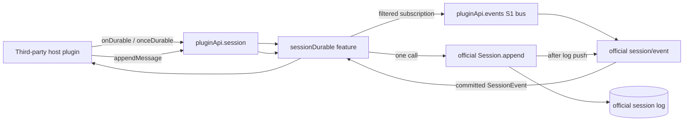

# Design: plugin-api-session-durable-m2

> feature_name: `plugin-api-session-durable-m2`
> 状态：已完成（Stage 4）
> 范围：S2 + O8 + O13 + O14
> 面：仅 host
> 依赖的已批准需求：[requirements.md](./requirements.md)

---

## 1. Overview

本设计在现有 `ctx.pluginApi.session` 上添加一个独立运行时 capability，键名为
`sessionDurable`。它不创建第二个公共 namespace，也不向 `pluginApi.events`、
`baseEventsCatalog` 或 Cordis 增加任何条目。

能力严格分为两部分：

1. **O8/O13/O14，A 类观察。** `onDurable()` 和 `onceDurable()` 以官方
   `session/event` 为唯一实时基底，按显式传入的 live `Session` 对象身份和五个
   白名单 type 过滤。它们只交付官方已经提交的 record，不轮询、不回放、不扫描历史
   以模拟通知。
2. **S2，B 类 constrained helper。** `appendMessage()` 只接受三个经过生产者审计的
   surface message kind，预检 payload 与 provenance，然后恰好调用一次官方
   `Session.append()`，固定生成 `{ surfaceOp: 'append' }`。它不拥有持久化、不会写
   其他 session-log type，也不翻译 observer 为二次 append。

`sessionDurable` 是本仓库第一个发布到已有公共门面的 B 类 feature。因此设计包含一个
可逆的 session facade publication boundary：若 mounter 已临时发布实际 helper、但宿主
随后 `ctx.effect()` 注册 cleanup 失败，mounter 的 disposer 必须恢复 P2 的 durable stubs。
这避免 feature registry 已禁用而 `pluginApi.session` 仍保留可写 B helper 的事务裂缝。

### 1.1 Explicit boundaries

- `session/event` 是已有 S1 lifecycle event，不改名、不重新 dispatch。O8/O13/O14 的
  kind 是 **session-log type**，不是 Cordis event name。
- `session.events` 只在 S2 provenance 验证时读取一次不可变 snapshot；O8/O13/O14 的
  实时路径不读取它。历史 record 不会产生观察回调。
- 直接调用官方 `Session.append()` 仍是 unsupported escape hatch；本 feature 不拦截它。
- 不引入 client bundle、remote、browser bridge、history mutation、generic event append，
  或 persistence backend。
- 观察只覆盖收到 `session/event` 后发生的 live append。未进入 store 的 staged child
  seed（例如 continuable child 的 descriptor）没有官方 live publication，因此不得被
  伪造成后续 `onDurable()` 通知。

---

## 2. Source Audit and Decisions

### 2.1 Official commit and publication contract

安装版本的官方 `Session.append()` 是本设计的最终写入权威：

- `session.events` 返回冻结的 append-only snapshot，`session.seq` 等于当前 log 长度：
  `@deepseek-ai/dsh-session/lib/index.js:1392-1403`。
- `append()` 通过官方 `snapshotJsonValue()` materialize payload 和 metadata，拒绝
  非 lossless JSON 与 append re-entry，在候选 record 上调用 surface validator：
  `.../lib/index.js:1440-1461`。
- 它在收集 callback 后先 `this.log.push(event)`，再执行 publication callbacks；因此
  `session/event` 的 `(session, event)` 参数代表已经提交到 **in-memory session log** 的同一
  immutable record：`.../lib/index.js:1463-1471` 以及 `requirements.md` 1.8。它不表示
  persistence backend 已 flush、checkpoint 已完成，或存储 I/O 已成功。
- 其声明承诺 deep-frozen committed return record，observer failure containment，以及不允许
  append publication boundary 重入：`.../lib/types/index.d.ts:178-212`。这里及全文的
  “committed” 均仅指上述 log acceptance，除非明确使用官方 `session/flush` / checkpoint
  机制。

因此 durable observer 不复制、重建或第二次 append record。它把官方交付的 `event`
直接传给 listener；该 record 已由官方冻结，且 S1 `events-bus` 也沿用 `session/event`
的 `freeze: 'all'` policy。这样用户不能通过 observer 参数改变 durable log、surface 或
另一 observer 所见的 payload。

### 2.2 Durable producer audit

**H2 final authority.** Runtime durable observation is owned by the service-lifetime
`DurableObservationHub`, with epoch-local observer maps and one native `session/event`
registration. During dispatch it never disposes the native hook, removes a bus hook, or
calls `reconcile('session/event')`; a malformed audited record only CAS-detaches the current
epoch, drains private observers, restores the durable P2 overlay, and disables that epoch.
This wording supersedes older per-epoch-native-registration descriptions while preserving
the public `onDurable`/`onceDurable` and stale-cleanup contracts.

所有五类 audited record 都是 log-only、non-surface append，所有实际生产点都调用
`session.append(type, data)`，没有 `surfaceOp` 或 `sourceEventSeqs`。`KNOWN_SESSION_EVENT_TYPES`
包含这些 type，并由安装版 session event map 生成：
`@deepseek-ai/dsh-session/lib/types/known-event-types.js:1-63`。

| Kind | Official producer and target | Verified payload | Surface eligibility / version |
| --- | --- | --- | --- |
| `approval/policy` | `setApprovalPolicy(session, policy)` writes the supplied session (`dsh-user-approval/lib/index.js:71-79`). `ApprovalService.setPolicy()` targets `agent.session`; delegation seeding targets the unpublished child (`dsh-subagent/lib/index.js:585-617`). | `{ policy: 'ask' | 'never', source?: 'delegation' }` | Log-only; no event version. Declaration: `dsh-user-approval/lib/types/index.d.ts:53-64`. |
| `approval/asked` | `ApprovalService.request()` captures `const session = req.agent.session`, then writes the fresh id, tool name, optional call id and reason (`dsh-user-approval/lib/index.js:144-153`). It requires an open turn first. | `{ id: string, toolName: string, callId?: string, reason?: string }` | Log-only; unversioned. Declaration: `.../types/index.d.ts:29-42`. |
| `approval/decided` | The same captured `req.agent.session` receives the resolved outcome after the ask (`dsh-user-approval/lib/index.js:154-159`). | `{ id: string, outcome: 'allowed-once' | 'rejected' | 'cancelled' | 'unavailable' }` | Log-only; unversioned. Declaration: `.../types/index.d.ts:43-51`; outcome union in `.../types/types.d.ts:19-23`. |
| `schedule/change` | `schedule_create` and `schedule_delete` append to owning `agent.session` (`dsh-schedule/lib/index.js:1213-1247`, `1285-1321`). Dispatch path appends to `this.agent.session` (`.../lib/index.js:841-851`); normal runtime registration is root-agent scoped. | Strict v1 create, delete, and one-shot/every dispatch union described below. | Log-only; verified `version: 1`. Declaration: `dsh-schedule/lib/types/types.d.ts:56-89`; runtime decoder rejects unsupported shapes in `dsh-schedule/lib/invariant.js:119-171`. |
| `subagent/descriptor` | One-shot in-process provider appends once to published child `agent.session` on its first entered step (`dsh-subagent-in-process-driver/lib/index.js:137-155`). Continuable path stages it in `Session.create(childId, seed)` before child materialization (`dsh-subagent/lib/index.js:620-642`, `771-820`). | v2 one-shot or continuable descriptor described below. | Log-only; verified `version: 2`. Declaration: `dsh-subagent/lib/types/descriptor.d.ts:23-78`; construction in `.../types/descriptor.js:147-169`. |

The schedule descriptor will publish exactly these audited variants, and no inferred UI
fields such as `state` or `deliveryMode`:

```text
{ version: 1, operation: 'create', schedule: After | At | Every }
{ version: 1, operation: 'delete', id }
{ version: 1, operation: 'dispatch', id }                 // after / at
{ version: 1, operation: 'dispatch', id, acceptedAt }     // every

After = { id, kind: 'after', prompt, afterSeconds, scheduledAt }
At    = { id, kind: 'at',    prompt, scheduledAt }
Every = { id, kind: 'every', prompt, everySeconds, scheduledAt }
```

The descriptor publishes exactly these audited variants:

```text
{ version: 2, mode: 'one-shot', provider, label? }
{ version: 2, mode: 'continuable', provider, label,
  agentProvider?, agentModel?, persona?, toolFilter? }
```

`toolFilter` is the producer's JSON-safe allow/deny string-array structure. Child session
header facts (`parentSession`, `origin`, `delegationDepth`, and seed length) are intentionally
not descriptor fields; the source builds them separately at
`dsh-subagent/lib/index.js:514-541`.

#### Staged-record timing boundary

The continuable implementation creates the descriptor on a detached staging `Session`, then
passes the seed to child materialization. The producer's descriptor documentation calls the
record model-hidden and non-surface; the payload/type contract agrees with the code. Its
staged timing is nevertheless not a live `session/event` publication. Likewise, delegated
`approval/policy` seeding happens on an unpublished child. This design records the distinction:
these records remain readable through existing S4 `session.events` snapshots after the child
is live, but are never replayed or synthesized as durable observations. This is the required
no-catch-up behavior, not a missing observer hook.

### 2.3 S2 surface producer audit

The official surface set is exactly `user/message`, `assistant/message`, and `tool/result`:
`@deepseek-ai/dsh-session/lib/types/surface.js:10-23`. Current official producers establish
three causal patterns:

| Kind | Official production pattern | Design consequence |
| --- | --- | --- |
| `user/message` | Agent loop appends `decision.messages` with only `{ surfaceOp: 'append' }` (`dsh-agent-loop/lib/index.js:548-555`). | The helper accepts no caller provenance and omits `sourceEventSeqs`. |
| `assistant/message` | Agent loop collects `assistant/chunk` seqs, then writes matching `{ turn, step, message, usage? }` with those seqs (`dsh-agent-loop/lib/index.js:615-658`). | Caller-supplied sources must be matching prior chunks. With no supplied source, only a no-candidate-chunk case can derive `[]`; any candidates are ambiguous. |
| `tool/result` | Agent loop appends raw `tool/call`, receives its seq, then appends result with `[callSeq]` (`dsh-agent-loop/lib/index.js:291-317`). | The helper requires or derives one matching prior `tool/call` record. |

The compaction plugins use `replace` operations (`dsh-compaction-basic/lib/index.js:582-616` and
`dsh-compaction-tool-result-pruner/lib/index.js:161-179`). They are deliberately outside S2:
this helper has no replacement surface operation and must not be used to alter surface history.

Official surface validation only requires an append marker plus a dense, unique list of earlier
seqs when provenance is present (`dsh-session/lib/types/surface.js:149-180`). This feature is
stricter: it validates causal record type and correlation before asking the official validator.
That restriction is the finite S2 contract, not a replacement for official validation.

### 2.4 Audit identity and runtime contract gate

This source audit is pinned to the complete DSH package identity `0.1.0-rc.6`. Stage 4 will
encode the following private immutable `SESSION_DURABLE_AUDIT` manifest in the pure catalog
module, rather than accepting a broad semver range at this feature boundary:

```js
{
  runtimeVersion: '0.1.0-rc.6',
  packages: {
    '@deepseek-ai/dsh-llm': '0.1.0-rc.6',
    '@deepseek-ai/dsh-session': '0.1.0-rc.6',
    '@deepseek-ai/dsh-user-approval': '0.1.0-rc.6',
    '@deepseek-ai/dsh-schedule': '0.1.0-rc.6',
    '@deepseek-ai/dsh-subagent': '0.1.0-rc.6',
    '@deepseek-ai/dsh-subagent-in-process-driver': '0.1.0-rc.6',
    '@deepseek-ai/dsh-agent-loop': '0.1.0-rc.6',
  },
}
```

Those producer packages become host peer dependencies solely because their public
`./package.json` exports are the supported runtime identity evidence for this source audit.
The guard reads no package-private variable or source file: it resolves each public manifest,
requires the exact audited version, and requires it to equal the runtime component embedded in
the facade's own full version. Missing, unreadable, malformed, or non-exact producer identity
is a `sessionDurable` P2 condition. An upgrade therefore cannot silently inherit this audit: it
must update the manifest, repeat the design source audit, and receive the normal spec approval.
A locally modified package that lies about its public version is outside this identity contract.

The manifest identity is paired with observable contract probes. The mounter requires public
`Session`, `isJsonValue`, `snapshotJsonValue`, `KNOWN_SESSION_EVENT_TYPES`, and
`isSurfaceEligibleType`; it checks all audited kinds/types as described in Section 3.2. It also
uses a strict audited-record predicate at every live delivery. That predicate checks the exact
current type discriminator, absence of surface metadata, exact keys/primitive constraints for
the three approval records, the public v1 schedule decoder-equivalent grammar, and the public
v2 descriptor grammar. An observed mismatch is not handed to user code. It is a contract breach:
the current durable epoch is synchronously reset to P2, the feature registry is disabled, and a
contained diagnostic records only kind/seq/reason (never payload). This deliberately allows a
raw unsupported official append to fail closed rather than making a descriptor claim an
unverified payload. `onceDurable` does not settle on such a record.

The schedule predicate mirrors the published `decodeScheduleChange()` branch and its exact-key
rules (`dsh-schedule/lib/invariant.js:119-171`) without importing that package's implementation:
it accepts only v1 create/delete/dispatch forms and verifies the audited `after`/`at`/`every`
record fields and scalar constraints. The descriptor predicate accepts only v2 exact-key
one-shot/continuable forms, including the source-declared optional composition fields. These
predicates are a compatibility gate, not a generic durable-event validator.

---

## 3. Architecture



### 3.1 Components and ownership

| Component | Ownership | Responsibility |
| --- | --- | --- |
| `lib/session-durable-catalog.js` | New pure module | Holds the exact audit-version manifest, five audited descriptor definitions, frozen durable type list, strict durable-record predicates, finite surface contract metadata, and total lookup/guard builders. It imports no Cordis service and does not subscribe or append. |
| `lib/session-durable-feature.js` | New host module | Validates live targets, creates the active durable API, translates a matching S1 `session/event` into one observer callback, performs S2 preflight and exactly one official append, and mounts/disposes the capability. |
| `lib/session-feature.js` | Existing S1/S3/S4/S5 owner | Remains the owner of the base session read/lifecycle API. Its S5 catalog construction remains unchanged. The only integration is that its mounted base object is composed with the service-owned durable overlay. |
| `lib/plugin-api-service.js` | Shared public facade owner | Owns P1/P2 durable stubs, descriptor-preserving composition of base session API plus durable overlay, and reversible durable overlay reset. It never knows about official sessions or subscription details. |
| `lib/guards.js` and `lib/index.js` | Host apply owner | Adds the `sessionDurable` guard/mounter after `session`; preserves generic fail-safe reporting and registers its reversible disposer through the existing effect path. |
| Tests | Repository test owner | Test helper behavior, existing-session non-regression, mounter rollback, and the anchor migration shape. No implementation changes occur in the consumer repository in this feature. |

Allowed Stage 4 shared-file changes are limited to `package.json` (the five additional
audit-only producer peer dependencies), `lib/index.js`, `lib/guards.js`,
`lib/plugin-api-service.js`, and the existing session test files necessary to wire the new
feature. No change is allowed to the event catalog, client entry, or official packages.

### 3.2 Mount order and dependencies

`FEATURE_MOUNTERS` will place `sessionDurable` immediately after `session`:

```text
tools -> events -> agent -> llm -> llm/admission -> session -> sessionDurable
      -> settings -> systemPrompt -> services
```

The durable mounter requires all of the following at activation time:

1. `featureRegistry.isActive('session')` and `featureRegistry.isActive('events')` are true.
2. The base public session API has working S1 event subscription methods, and the official
   `sessions` service has callable `get` and `list` methods with a usable live-session lookup
   identity.
3. Public `@deepseek-ai/dsh-session` exports supply callable `Session`, `isJsonValue`,
   `snapshotJsonValue`, `KNOWN_SESSION_EVENT_TYPES`, and `isSurfaceEligibleType`.
4. Every `SESSION_DURABLE_AUDIT` package can resolve its public `./package.json`, has its exact
   audited version, and agrees exactly with the facade runtime component.
5. The five durable kinds are present in the installed known vocabulary and remain non-surface;
   each of the three S2 kinds remains surface eligible.
6. The frozen descriptor table, strict durable-record predicates, and three append contracts can
   be built without throwing from that installed public contract.

`runFeatureGuard('sessionDurable', ...)` performs cheap export/service/package-identity probes
before mounting; the mounter repeats every authoritative contract construction so
`DSH_PLUGIN_API_GUARD_DISABLE=1` cannot force an unsafe capability on. A missing, malformed,
throwing, non-exact, or internally inconsistent prerequisite returns no disposer, lets the
generic host path mark `sessionDurable` inactive, emits the existing P2 diagnostic, and leaves
S1/S3/S4/S5 untouched. The guard does not parse installed producer implementation files or
import private module state.

### 3.3 Reversible facade publication

The generic host loop currently calls a mounter, then `ctx.effect(() => disposer)`, then
`featureRegistry.mount(featureName)`. A first-B feature must account for `ctx.effect()`
throwing after mounter publication.

`PluginApiService` will maintain two internal session layers:

```text
baseSessionApi       = disabled M1 session API or the mounted S1/S3/S4/S5 API
durableSessionApi    = P2 durable stubs or active sessionDurable API
public session       = descriptor-preserving composition(baseSessionApi, durableSessionApi)
```

Composition copies property descriptors, rather than spreading objects, so disabled catalog
getters are not eagerly invoked. The durable overlay only owns:

```text
durableEventTypes
durableEventDescriptors
isDurableEventType
getDurableEventDescriptor
onDurable
onceDurable
appendMessage
```

`mountFeature('session')` updates `baseSessionApi` and republishes its current durable overlay.
A new recognized `mountFeature('sessionDurable', { facade, closeEpoch })` creates an opaque
monotonic durable epoch, stores only `facade` in the public overlay, and retains `closeEpoch`
privately with that epoch. The active epoch owns a `Set` of all underlying S1 registration
disposers created by `onDurable`/`onceDurable`; each individual disposer removes itself from the
set. `closeEpoch` takes and clears that set, then calls every captured S1 disposer independently
with per-disposer error containment/diagnostics. `resetSessionDurable(epoch)` first compares epoch
identity. Only when it is current does it atomically mark that epoch inactive, call `closeEpoch`
once, reset the overlay to P2, and republish base session plus stubs. It returns whether it won
that current-epoch check.

The mounter's single cleanup closure captures the epoch and is idempotent:

1. it calls `resetSessionDurable(epoch)`;
2. only when that reset succeeded, it disables `sessionDurable` in the registry; and
3. it contains all disposal/logging failures.

There is no mounter-time global substrate subscription, but epoch-owned user registrations are
always drained on reset. The epoch test prevents a stale effect cleanup or failed first mount
from resetting a later successful application.

The generic handoff is deliberately transactional without changing the shared host protocol:

```text
mounter validates -> service publishes epoch-gated overlay (registry still inactive)
  -> ctx.effect(() => epochDisposer) -> featureRegistry.mount('sessionDurable')
```

If `ctx.effect()` or the later `featureRegistry.mount()` throws, the existing generic catch calls
the same epoch disposer before its final `featureRegistry.disable()` and diagnostics. If an effect
was registered before a later registry-mount failure, that effect can invoke the same idempotent
closure later but cannot affect a newer epoch. Thus every failure point leaves `features` reporting
`sessionDurable: false`, `pluginApi.session` retaining M1 behavior, all current durable entry
points at P2, and no leaked usable facade. Repeated cleanup and reapply are harmless; the
registry's `isActive('sessionDurable')` is the only active/reapply signal.

The active overlay is also *call-time gated*. Each durable method and each catalog getter
first checks core activity and `featureRegistry.isActive('sessionDurable')`, raising P1 or P2
when either condition is false. This is required because a plugin can retain a prior
`pluginApi.session` object reference: replacing the service property alone cannot revoke that
reference. It also means the short interval between mounter publication and the generic loop's
later `featureRegistry.mount()` is safely P2 rather than transiently usable. A catalog array
already read while active is an immutable value and cannot be retroactively revoked; reading a
catalog entry point from a retained facade after teardown is nevertheless P2.

P1/P2 behavior is intentionally additive. The disabled session layer contains durable stubs
whose methods and catalog getters first raise `PluginApiInactiveError` while core is inactive,
otherwise `PluginApiFeatureDisabledError('sessionDurable')`. It does **not** report a generic
`session` failure for a durable entry point. Existing M1 session methods retain their current
P1/P2 behavior independently.

---

## 4. Public Interfaces and Data Models

### 4.1 Active API

When active, the overlay adds this exact API under the existing `pluginApi.session` object:

```js
{
  durableEventTypes,
  durableEventDescriptors,
  isDurableEventType(value),
  getDurableEventDescriptor(kind),
  onDurable(targetSession, kind, listener),
  onceDurable(targetSession, kind, listener),
  appendMessage(targetSession, kind, payload, options),
}
```

`durableEventTypes` is a deeply frozen lexical list:

```js
[
  'approval/asked',
  'approval/decided',
  'approval/policy',
  'schedule/change',
  'subagent/descriptor',
]
```

`durableEventDescriptors` is a deeply frozen record keyed by exactly those five values. Each
entry has this stable, declarative audit shape:

```js
{
  kind: 'approval/asked',
  logSource: 'official-session-log',
  observationSource: 'session/event',
  surfaceEligible: false,
  payload: {
    version: null, // null means the audited record has no event-version field
    shape: '{ id: string, toolName: string, callId?: string, reason?: string }',
  },
}
```

The exact descriptor payload values are:

| Kind | `payload` |
| --- | --- |
| `approval/policy` | `{ version: null, shape: "{ policy: 'ask' \| 'never', source?: 'delegation' }" }` |
| `approval/asked` | `{ version: null, shape: '{ id: string, toolName: string, callId?: string, reason?: string }' }` |
| `approval/decided` | `{ version: null, shape: "{ id: string, outcome: 'allowed-once' \| 'rejected' \| 'cancelled' \| 'unavailable' }" }` |
| `schedule/change` | `{ version: 1, shape: "create: { version: 1, operation: 'create', schedule: After \| At \| Every }; delete: { version: 1, operation: 'delete', id }; dispatch: { version: 1, operation: 'dispatch', id } \| { version: 1, operation: 'dispatch', id, acceptedAt }" }` |
| `subagent/descriptor` | `{ version: 2, shape: "one-shot: { version: 2, mode: 'one-shot', provider, label? }; continuable: { version: 2, mode: 'continuable', provider, label, agentProvider?, agentModel?, persona?, toolFilter? }" }` |

`After`, `At`, and `Every` in the schedule shape have the exact audited forms in Section 2.2.
`provider`, identifiers, and optional fields retain the source package's JSON/string contracts;
the descriptor does not invent a validation DSL. It is frozen audit metadata, not an API to
append those log types.

`isDurableEventType(value)` is total and returns `true` only for an exact string in the frozen
list. `getDurableEventDescriptor(kind)` returns the frozen descriptor for a supported string,
or `undefined` otherwise; it does not throw and does not widen the catalog.

### 4.2 Live target validation

Every imperative durable API first validates that `targetSession` is:

1. an instance of the public installed `Session` constructor;
2. has callable `append` where append is needed;
3. has a public `firstLiveSeq` that is a non-negative safe integer; and
4. is currently live in the resolved official session store, proved by
   `sessions.get(targetSession.id) === targetSession`.

This rejects a session id, duck-typed record, different official package instance, detached
`Session.create()` staging object, a session missing its public seed boundary, and a
 disposed/replaced object with `TypeError { code: 'invalid-target-session' }`. It uses only
public constructor, id, `firstLiveSeq`, and store lookup APIs; it does not inspect official
private state. No ambient fiber, agent, or default session is consulted.

### 4.3 Durable observation

`onDurable(targetSession, kind, listener)` validates target, then exact durable kind, then
callable listener, in that order. It registers one unscoped wrapper through the existing S1 bus:

```js
eventsApi.on('session/event', (publishedSession, event) => {
  if (!epoch.isCurrent()) return
  if (publishedSession !== targetSession) return
  if (event.type !== kind) return
  if (!Number.isSafeInteger(event.seq) || event.seq < targetSession.firstLiveSeq) {
    deactivateCurrentDurableEpoch('seed-or-invalid-live-seq')
    return
  }
  if (!isAuditedDurableRecord(kind, event)) {
    deactivateCurrentDurableEpoch('durable-record-contract-breach')
    return
  }
  listener(event)
})
```

No scope override is passed: the target identity filter supplies the API's explicit-session
semantics, while S1's established global lifecycle subscription behavior remains unchanged.
The wrapper is registered only for future official publication. It receives no pre-existing
records, never calls `session.events`, and never dispatches a synthetic event.

`Session.firstLiveSeq` is a public in-process fork/seed boundary. A detached seed's durable
records always have a smaller sequence; the constructor's `session/end-seed` marker is created
before store attachment and has no durable type. The `firstLiveSeq` test is therefore a second,
defensive no-replay boundary in addition to the fact that official `session/event` only publishes
live appends. It rejects any accidental attach/initialization replay rather than trying to catch
it up. A valid live post-attachment record is delivered exactly as supplied by S1.

`isAuditedDurableRecord()` validates the entire committed envelope relevant to this feature:
exact durable `type`, non-surface metadata absence, a safe seq/time envelope, and the strict
payload/version grammar in Section 2.4. It never copies, normalizes, freezes again, or repairs
the official event. The predicate is total and internally contained: an exotic/throwing value is
a contract breach, not an exception that can escape the official observer path. On a mismatch it
invokes the current epoch's fail-closed P2 reset and emits a contained non-payload diagnostic; no
`onDurable` listener runs, and an invalid record does not consume `onceDurable`. Within this
design, “matching durable record” means a type match that also passes this audited-record
predicate. A direct raw append with a known but malformed kind is an unsupported escape-hatch
breach, not evidence that its data matches the audited public descriptor; the official log record
remains preserved and untouched.

The user listener receives exactly one argument, the committed official record. Listener return
values are ignored. Throws and rejected thenables follow the existing cataloged `session/event`
S1 containment/diagnostic policy; they cannot change in-memory log acceptance, official append
return, other durable observers, raw official observer behavior, or persistence checkpointing.

`onceDurable()` uses an ordinary filtered `eventsApi.on`, rather than `eventsApi.once`, because
an unrelated, seed-boundary-rejected, or contract-breaching `session/event` must not consume the
registration. On its first matching **validated live** record it sets its local done flag and
invokes the underlying disposer **before** invoking the user listener. A cleanup failure is
contained and diagnosed, but cannot permit a second delivery or prevent delivery of the first
matching record. Both functions return a synchronous idempotent `() => boolean` disposer. The
returned disposer atomically removes its underlying S1 disposer from the epoch set before calling
it; a global epoch reset drains the same set and flips `epoch.isCurrent()` false first, so callback
snapshots already captured by S1 cannot reach user code after teardown/P2.

Invalid arguments never subscribe and throw these stable `TypeError.code` values:

| Condition | Code |
| --- | --- |
| Not one explicit live official target session | `invalid-target-session` |
| Not one of the five durable kinds | `unsupported-durable-kind` |
| Listener is not callable | `invalid-listener` |

### 4.4 S2 finite append contract

The helper accepts **only** the following three kinds. `isJsonValue()` is an activation-time
public-export prerequisite, but is intentionally not invoked on the borrowed payload: doing so
before `snapshotJsonValue()` would create a second getter pass and reopen a TOCTOU window. The
helper instead materializes exactly one detached snapshot with public
`snapshotJsonValue()`, which performs the required JSON validation in the same pass. That snapshot
is used for shape/provenance checking, then passed to `Session.append()`; official append
independently snapshots/freezes it and remains the final append, persistence, surface, observer,
and reentry authority. A getter throw or a `undefined` snapshot result is reported as
`non-json-payload` before any write.

The structural message rules mirror the installed session loader's replay-safe checks at
`dsh-session/lib/index.js:1242-1272`, while deliberately allowing the official merge-extensible
JSON content/source vocabulary:

- every message is a JSON record with non-empty string `id`, required role, JSON array `content`,
  and JSON record `source` with non-empty string `kind`;
- `user/message` requires `role: 'user'`;
- `assistant/message` requires `role: 'assistant'`, `source.kind: 'model'`, and non-empty
  string `source.provider` and `source.model`;
- `tool/result` requires `role: 'user'`, `source.kind: 'tool'`, non-empty `source.callId`, one
  `tool-result` content block with the same `toolCallId`, plus an optional `{ name, code }`
  error record and JSON `meta` when supplied;
- assistant and tool-result envelopes require non-negative safe-integer `turn` and `step`.

| Accepted kind | Accepted payload and source derivation | Generated intent | Immutable return record |
| --- | --- | --- | --- |
| `user/message` | A replay-safe `UserMessage`. `options` must be absent or `{}`; no source seq may be supplied. The unambiguous source derivation is no provenance field, not `[]` (official surface rejects empty sources for this kind). | `{ surfaceOp: 'append' }` | `{ type: 'user/message', seq, time, data: UserMessage, surfaceOp: 'append' }` |
| `assistant/message` | `{ turn, step, message, usage? }` with an audited assistant message. Explicit non-empty source list must be strictly increasing prior `assistant/chunk` seqs in the same target and same `turn`/`step`; explicit `[]` is valid only when no matching chunk is present. If omitted, one snapshot scan derives `[]` only when there is no matching chunk. One or more matching chunks makes source selection ambiguous and fails closed. | `{ surfaceOp: 'append', sourceEventSeqs: [] \| validatedChunkSeqs }` | `{ type: 'assistant/message', seq, time, data, surfaceOp: 'append', sourceEventSeqs }` |
| `tool/result` | `{ turn, step, message, error?, meta? }` with an audited tool-result message. Explicit provenance must be exactly one prior `tool/call` seq in the target whose `turn`, `step`, and `callId` match the result. If omitted, the helper derives `[callSeq]` only when exactly one matching earlier call exists; zero or multiple candidates fails closed. | `{ surfaceOp: 'append', sourceEventSeqs: [callSeq] }` | `{ type: 'tool/result', seq, time, data, surfaceOp: 'append', sourceEventSeqs: [callSeq] }` |

The strict-increasing requirement preserves causal order even though the official generic
validator only requires uniqueness and earlier references. A syntactically bad sequence list,
a list supplied for `user/message`, or a list that violates a kind's cardinality/ordering is
`invalid-source-event-seqs`. A syntactically valid earlier record that cannot prove the required
kind/correlation, or an omitted source relation with zero/multiple ambiguous candidates, is
`indeterminate-source-event-seqs`.

No S2 entry accepts `tool/call`, `assistant/chunk`, `session/title`, a replacement operation,
a virtual-turn transaction, partial-turn recovery, or persistence barrier sequencing. Those
remain outside the helper because there is no audited one-call public contract for them.

### 4.5 Preflight and error behavior

`appendMessage()` performs the following synchronous sequence before its single official append:

1. Validate the live target session.
2. Validate that `kind` is one of the three finite audited surface kinds and still surface
   eligible in the installed contract.
3. Materialize a lossless JSON preflight snapshot and validate the appropriate message envelope.
4. Validate that options is absent or a plain/null-prototype record with no keys other than an
   own `sourceEventSeqs` property.
5. Read one frozen `targetSession.events` snapshot and validate or derive provenance against that
   exact target snapshot.
6. Build only the audited `{ surfaceOp: 'append', sourceEventSeqs? }` intent and call
   `targetSession.append(kind, payloadSnapshot, intent)` exactly once.

The helper never retries, catches, patches, or rolls back an official append failure. If official
append throws after preflight, the exact official error propagates unchanged. In particular, a
call made from an official `session/event` observer reaches the official append reentry guard;
the helper adds no observer-to-append loop of its own.

| Preflight condition | Stable `TypeError.code` | Write outcome |
| --- | --- | --- |
| Target is not a current official live Session | `invalid-target-session` | No official append call |
| Kind is outside S2 contract or no longer surface eligible | `unsupported-surface-message-kind` | No official append call |
| Payload cannot materialize as lossless JSON or fails audited envelope grammar | `non-json-payload` | No official append call |
| Options is not the narrow allowed object shape | `invalid-options` | No official append call |
| Sequence list is malformed, non-earlier, duplicate, out of order, or disallowed for its kind | `invalid-source-event-seqs` | No official append call |
| A source record/correlation cannot be proved, or omitted provenance has no unique derivation | `indeterminate-source-event-seqs` | No official append call; contained warning without payload content |

The helper creates a `TypeError`, assigns only the stable `code` required above, and uses a
short non-payload-bearing message. Diagnostics must never log payload, message content, tool
arguments, or source data. Unexpected preflight inspection errors are fail-closed as
`indeterminate-source-event-seqs` with the same contained diagnostic rule.

---

## 5. Migration Boundary

`dsh-pro-ex-ability-anchor` currently hand-constructs virtual turn records at
`lib/runtime.js:238-297` and appends them at `lib/runtime.js:507-530`. The compatible S2 mapping
is intentionally narrow:

```js
// user message
pluginApi.session.appendMessage(session, 'user/message', userMessage)

// preassembled assistant message with no assistant/chunk producer
pluginApi.session.appendMessage(session, 'assistant/message', {
  turn,
  step,
  message: assistantMessage,
})
// The helper derives sourceEventSeqs: [] only when no matching chunks exist.

// raw call remains outside S2 and must stay official
const callSeq = session.append('tool/call', {
  turn,
  step,
  callId,
  name,
  arguments,
}).seq

pluginApi.session.appendMessage(session, 'tool/result', {
  turn,
  step,
  message: toolResultMessage,
}, { sourceEventSeqs: [callSeq] })
```

This feature does not migrate the consumer repository in Stage 4. Its test suite will verify
that exact interaction shape against an official session. A consumer migration is a separate
worktree/spec change because it owns virtual-turn atomicity, `tool/call`, title correction,
partial-turn recovery, and persistence ordering. The feature must not claim that `appendMessage`
replaces those responsibilities.

---

## 6. Testing Strategy

Stage 4 tests will be added incrementally with the implementation tasks and will cover:

1. **Catalog, audit, and non-interference:** exact five-type frozen catalog; exact descriptor
   keys/shapes; type-guard totality; unsupported descriptor lookup; exact audited producer-package
   identities; version/export/vocabulary/surface mismatch P2; schedule only v1 variants; descriptor
   only v2 variants; unchanged S5 `sessionEventTypes`/`surfaceEventTypes`; and byte-for-byte / object
   identity assertions that `pluginApi.events`, `baseEventsCatalog`, and the complete event catalog
   gain no durable entry or synthetic namespace.
2. **Target, seed, and observer behavior:** exact invalid-target/kind/listener codes with no
   registration; reject ids, duck types, detached sessions, sessions without a valid `firstLiveSeq`,
   disposed sessions, and foreign references; deliver only future matching records for the exact
target; create a seeded continuable-style child containing
   `approval/policy` and `subagent/descriptor`, attach it, and prove neither seed is delivered;
   ignore other kinds/sessions; verify listener receives exactly the immutable official event
   object; verify one-shot removal before callback and idempotent disposers.
3. **Observed contract breaches and failure containment:** a direct raw append of a known durable
   type with malformed payload/version is never delivered, never settles a once listener, logs no
   payload, and synchronously resets only `sessionDurable` to P2; a unit-level forged S1 delivery
   additionally exercises illegal surface metadata without bypassing official append validation.
   Valid M1 session behavior remains usable. Durable listener throw/rejection follows S1 containment;
   raw official observer behavior remains independent; logging failure cannot alter commit or
   observer delivery.
4. **S2 contract per kind:** successful `user/message`, no-chunk `assistant/message`, explicit
   matching chunk provenance, derived/explicit matching `tool/result` provenance; exact generated
   metadata and record shapes; input mutation after return cannot alter committed data; result is
   immutable; one and only one official append call.
5. **S2 failure paths:** non-JSON/cyclic/exotic payloads, invalid envelope, malformed options,
   sparse/duplicate/future/wrong-kind source refs, ambiguous assistant chunk candidates,
   zero/multiple tool-call candidates, unsupported surface kinds, unchanged log/surface on every
   preflight rejection, exact propagation of an official append error, and official reentry error
   from a `session/event` callback.
6. **Apply/rollback lifecycle:** session/events missing, audit identity mismatch, contract export
   mismatch, and mounter failure leave durable P2 while M1 session remains usable; each failure
   point after publication (`ctx.effect()` throws, registry mount throws before/after activation)
   restoration drains epoch-owned registrations and blocks captured callback snapshots; registered
   late effect cleanup is harmless; cleanup/reapply and stale-epoch cleanup are idempotent; cached
   old `pluginApi.session` references become P2; mounter order is `session` before
   `sessionDurable`.
7. **Consumer mapping regression:** a fixture performs the anchor mapping above, checks that it
   needs no hand-authored `surfaceOp`, preserves the raw `tool/call` boundary, and cannot use the
   helper for unsupported title/replacement/atomic-turn behavior.

No client test is added because this design deliberately adds no client surface.

---

## 7. Requirements Traceability

| Requirement area | Design coverage |
| --- | --- |
| 1, 2 | Sections 1, 2.2, and 4.1 define the exact namespace, classification, catalog, descriptors, and non-interference with S1/S5/events. |
| 3, 4 | Sections 2.1, 3.2, 4.2, and 4.3 establish the official committed substrate, target identity, no-replay constraint, immutable delivery, and listener containment. |
| 5, 6 | Sections 2.3, 4.4, and 4.5 define the finite source-audited payload, provenance, metadata, validation, and one-append contract. |
| 7 | Sections 3.2 and 3.3 define P1/P2, runtime checks, feature registry ownership, reversible publication, cleanup, and fail-safe behavior. |
| 8 | Section 5 fixes the ability-anchor mapping and explicitly excludes client, generic append, persistence, replay, and unsupported virtual-turn concerns. |

## 8. Deferred / Upstream Boundaries

No upstream proposal is required for the audited scope. The capability stops at public
`Session`, `SessionStore`, `snapshotJsonValue`, `isSurfaceEligibleType`, and the official
S1 `session/event` substrate. A future request for live notification of seed-only records,
atomic virtual turns, surface replacement, generic appendable event registration, or a client
projection would require a separately approved design and may require an official upstream
extension.
