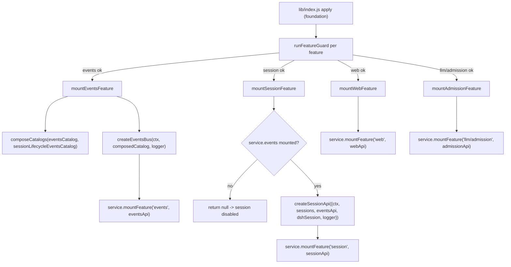

# Design: plugin-api-session-m1

## Overview

`plugin-api-session-m1` 在 `ctx.pluginApi.session` 下为第三方插件提供官方 `dsh-session` 会话能力的 A 类稳定直通，覆盖 feature-list 中的 **S1 + S3 + S4 + S5**：

1. **S1**：四个会话生命周期事件（`session/created`、`session/disposed`、`session/event`、`session/flush`）的类型化订阅，复用已交付的 `pluginApi.events` 稳定事件总线。
2. **S3**：会话读面 `get(id)` / `list()` / `fork(source, boundary?, childId?)` 稳定直通。
3. **S4**：会话状态只读访问器 `header/events/seq/surface`、`requestHeader()`、`requestContext()`、`deriveMessages()`。
4. **S5**：会话日志事件类型目录 `sessionEventTypes` / `surfaceEventTypes` 与类型守卫 `isSessionEventType` / `isSurfaceEventType`。

**Requirements 修正记录**（Stage 2 调研后，已获用户批准）：

- `requirements.md` AC 4.1 已修正：`sessionEventTypes` 与官方 `KNOWN_SESSION_EVENT_TYPES` 对齐（会话日志事件词汇），不再包含 `session/created|disposed|event|flush` 四个 Cordis 生命周期事件名。
- AC 1.6 随之一致化：非 S1 生命周期事件名走底层 Cordis 原始透传（与 `plugin-api-events-m1` AC 1.5 相同的 untyped/unsupported 语义）。

依赖关系：

- `plugin-api-foundation`：服务注册、分层 guard、版本协商、typed errors。
- `plugin-api-facade-integrity`：本 feature 不包装/替换任何官方方法，不新增包装链；只做只读访问，因此不触发链安全 helper。
- `plugin-api-events-m1`：S1 的四个会话生命周期事件进入 events catalog，`pluginApi.session.on/once` 对这四个名字直接委托 `pluginApi.events.on/once`，获得 priority / 只读 payload / scope 过滤 / 故障隔离能力。

---

## 源码调研结论

### `@deepseek-ai/dsh-session`（版本 `0.1.0-rc.6`）

源码位置：`/usr/lib/node_modules/@deepseek-ai/dsh/node_modules/@deepseek-ai/dsh-session/`。

#### 服务与读面（`lib/index.js`）

- `SessionStore extends Service`，以名称 `sessions` 注册（`super(ctx, "sessions")`），因此 feature guard 用 `ctx.get('sessions')` 探测。
- `SessionStore.get(id)`（L1816–1818）返回 live `Session` 或 `undefined`。
- `SessionStore.list()`（L1823–1825）返回 fresh array，按创建序。
- `SessionStore.fork(source, boundary?, childSessionId?)`（L1840–1852）：
  - `source` 可为 live `Session` 或 `SessionId`（`SessionForkSource`）。
  - `boundary` 为 inclusive source seq；省略取当前 last event；空 source 省略 boundary fork 空 child。
  - `childSessionId` 省略时由 store 的 id 策略分配。
  - 错误统一抛 `SessionForkError`，`code` ∈ `SESSION_NOT_FOUND | SESSION_NOT_LIVE | SESSION_ALREADY_EXISTS | INVALID_BOUNDARY | OPEN_TURN`。
- `Session` 对象（L1303–1564）关键成员：
  - `header`（readonly，deep-frozen `SessionHeader`，L1319 / L1386）。
  - `id` getter（L1321–1323）。
  - `events` getter（L1397–1400）：返回冻结的 snapshot 数组；事件本身在 append 时 deep-frozen。
  - `seq` getter（L1402–1404）：返回 `log.length`。
  - `firstLiveSeq`（readonly，L1346）。
  - `surface` getter（L1308–1310）：返回 `SurfaceManager`（**内部 `_state.nodes` 数组可变**，见下）。
  - `requestHeader()`（L1493–1499）：返回 `deepFreeze(foldRequestHeader(...))` 或 `undefined`。
  - `requestContext()`（L1508–1514）：返回 `deepFreeze({...event.data})` 或 `undefined`。
  - `deriveMessages()`（L1539–1554）：返回 **fresh array**；其中 `Message` 对象是共享且 deep-frozen 的。
  - `deriveEventMessage(event)`（L1561–1563）：官方每节点投影 helper。
- **S4 只读结论**：
  - `header` / `events` / `requestHeader()` / `requestContext()` / `deriveMessages()` 中的消息已由官方冻结或返回 fresh snapshot，门面可直接返回。
  - `deriveMessages()` 返回的数组本身是 fresh 但**未冻结**；门面应冻结该 snapshot 数组后再返回（冻结 fresh array 不影响官方内部状态）。
  - `session.surface` 返回的 `SurfaceManager.nodes` 是其内部数组，**不能直接暴露**，否则第三方插件可 push 修改官方 surface 状态；门面返回 `{nodes: frozen copy, replaceGeneration}` 的 frozen snapshot。

#### 会话生命周期事件（`lib/index.js` + `lib/types/index.d.ts`）

| 事件 | 官方 mode | 监听器实参 | scopeFiltered | dsh-scope subject resolver |
|---|---|---|---|---|
| `session/created` | `emit` | `(session)` | true | `null`（presence-only） |
| `session/disposed` | `emit` | `(session)` | true | `null` |
| `session/event` | `emit` | `(session, event)` | true | `null` |
| `session/flush` | `parallel` | `(session)` | true | `null` |

- 官方 dispatch 构造：`SessionStore.enter` 用 `scopeTarget(session, scopeOf(this.ctx))` 生成 carrier（L1691）；`collectSessionCallbacks`（L1278–1281）收集回调；`session/created` 在 `announce`（L1737–1758）、`session/disposed` 在 `emitDisposed`（L1761–1772）、`session/event` 在 `Session.append`（L1465–1472）、`session/flush` 在 `SessionStore.flush`（L1787–1804）。
- `session/flush` 官方实现是 `Promise.allSettled` 后抛第一个失败（L1795–1803）；门面监听器按 E11 包含后不会 reject 官方 aggregate。
- `session/created` 官方语义允许 **同步 throw veto** 创建；门面 E11 会对门面自己的监听器包含同步 throw，因此**通过门面订阅的第三方监听器不拥有 veto 能力**（veto 语义保留给官方/直连 `ctx.on` 监听器）。这是有意的 fail-safe 取舍：门面订阅保证故障隔离，veto 属于 unsupported escape hatch 路径。
- scope 语义：`dsh-scope/lib/invariant.js` 对四个 session 事件注册 `null` resolver（presence-only）。因此 events-bus 的 E10 scope 过滤对这四个事件使用 `carrierKeyOf(this)` 匹配；第三方插件传入的 `opts.scope` 是 **session owner scope key**（即 `scopeOf(session owner ctx)`，通常为 agent 组合 scope），不是 session 对象本身。catalog entry 中 `subject` 记录为 `null`，并在 `args`/`payload` 中说明。

#### 会话日志事件类型与 surface 类型（`lib/types/types.d.ts`、`lib/types/known-event-types.js`、`lib/types/surface.js`）

- `KNOWN_SESSION_EVENT_TYPES`（`known-event-types.js` L18–63）是当前构建认识的 `SessionEventMap` 全部键，共 44 个字符串；包括 `session/end-seed`、`session/title`、`turn/start` 等，**不包括** `session/created|disposed|event|flush`。
- `SurfaceEventType = 'user/message' | 'assistant/message' | 'tool/result'`（`types.d.ts` L362）。
- 官方根导出（`lib/index.js` L1886）同时导出 `KNOWN_SESSION_EVENT_TYPES` 与 `isSurfaceEligibleType`，因此门面可以：
  - `sessionEventTypes = [...KNOWN_SESSION_EVENT_TYPES].sort()`；
  - `surfaceEventTypes = [...KNOWN_SESSION_EVENT_TYPES].filter(isSurfaceEligibleType).sort()`。
  这样 S5 目录与安装版本自动一致，且**无需在门面里硬编码** surface 三个类型。

### `plugin-api-events-m1` 现状（本 feature 的接入点）

- `lib/events-catalog.js`：base catalog，恰好 19 个事件名，深冻结；测试 `test/events-catalog.test.mjs` 继续覆盖这 19 个。
- `lib/events-bus.js`：`createEventsBus({ ctx, catalog, logger })`；`on/once` 对 cataloged 名做 priority 排序、E9 freeze、E10 scope gate、E11 containment；非 cataloged 名直接 `ctx.on/once` 透传。
- `lib/plugin-api-service.js`：构造时挂 `events`、`web`、`llm.admission` disabled stub；`mountFeature` 目前只认识这三个名字。
- `lib/index.js`：`FEATURE_MOUNTERS` 顺序 `events → web → llm/admission`；`mountEventsFeature` 使用 `eventsCatalog` 作为总线 catalog，且用 `service?.events?.catalog === eventsCatalog` 做幂等复用判断。
- 结论：S1 需要让四个 session 事件名成为 events-bus 的 cataloged 名。**本设计采用“组合 catalog”方案**：新增 `lib/session-events-catalog.js` 定义四个 S1 条目，新增 `lib/catalog-compose.js` 在挂载 events 时把 base catalog 与 S1 条目合并为一个深冻结的 `composedEventsCatalog`。这样 `lib/events-catalog.js` 及其 19 条测试保持不变；`pluginApi.events.catalog` 在运行时变为 base + session 的组合目录。

---

## 钩子引出机制（本仓库必填）

| 能力 | 类型 | 引出机制 | 失败路径与 guard 策略 |
|---|---|---|---|
| `pluginApi.session` 命名空间 | 门面基础 | `service.mountFeature('session', sessionApi)`；在 `ctx.pluginApi` 服务上新增 `session` disabled stub，active 后替换 | session guard 失败或 mount 返回 null → 仅 `session` 禁用并显式报错，门面保持 active |
| S1 会话生命周期事件订阅 | A | 四个事件名进入组合后的 `pluginApi.events.catalog`；`session.on/once` 对这四个名委托 `pluginApi.events.on/once`（E8 priority / E9 freeze / E10 scope / E11 containment 全部继承）；非这四个名走 `ctx.on/once` 原始透传（untyped） | `service.features` 中 `events` 未 active 或 events API 缺失 → session mounter 返回 null，session 禁用；单个 listener 故障由 events-bus E11 包含；`session/created` 门面监听器不提供 veto（官方直连语义不变） |
| S3 会话读面 | A | `ctx.get('sessions')` 的 `get/list/fork` 方法直通，返回值原样返回，参数原样转发 | `sessions` 服务缺失 → guard 失败禁用 session；官方 `SessionForkError` 等原样传播（AC 5.4） |
| S4 会话状态访问器 | A | 调用官方 `Session` 已冻结的 `header/events/requestHeader()/requestContext()` 直通；`deriveMessages()` 冻结返回的 fresh snapshot 数组；`surface` 复制 `nodes` 后深冻结为 snapshot，不暴露官方可变内部数组 | 访问器禁用时抛 typed error；调用非法 session 时官方 TypeError 原样传播（AC 5.4） |
| S5 会话事件目录 | A | 从官方 `KNOWN_SESSION_EVENT_TYPES` + `isSurfaceEligibleType` 运行时派生；`sessionEventTypes` / `surfaceEventTypes` 为排序后的冻结字符串数组；类型守卫用 `includes` | 官方导出不可用/形状非法 → 目录初始化为空冻结数组，类型守卫恒 `false`，并 log 可读诊断；不抛穿 apply |
| S5 类型守卫 | A | `isSessionEventType(v)` / `isSurfaceEventType(v)` 纯本地判断，永不 throw | 同 S5 目录 fail-safe |
| escape hatch（直连 `dsh-session` / 原始 `ctx.on`） | policy | 门面不拦截、不 patch；直连可绕过门面 | 无运行时失败路径；文档声明 unsupported |

---

## Architecture



```mermaid
flowchart LR
    PLUGIN["third-party plugin"] -->|inject: ['pluginApi']| API["ctx.pluginApi"]
    API --> EVENTS["pluginApi.events"]
    API --> SESSION["pluginApi.session"]
    SESSION -->|S1 names| EVENTS
    SESSION -->|non-S1 names| RAW["ctx.on/once (untyped passthrough)"]
    SESSION -->|get/list/fork| SSVC["ctx.get('sessions')"]
    SESSION -->|header/events/seq/surface/requestHeader/requestContext/deriveMessages| SOBJ["official Session object"]
    SESSION -->|sessionEventTypes/surfaceEventTypes| KNOWN["dsh-session KNOWN_SESSION_EVENT_TYPES + isSurfaceEligibleType"]
    EVENTS --> BUS["events-bus (priority/freeze/scope/containment)"]
    BUS --> CTX["ctx.on/once native hooks"]
```

---

## Components and Interfaces

### 1. `lib/session-events-catalog.js` — S1 生命周期事件目录（新纯模块）

零 harness 依赖。导出：

```js
export const SESSION_LIFECYCLE_EVENT_NAMES = Object.freeze([
  'session/created', 'session/disposed', 'session/event', 'session/flush',
])

export const sessionLifecycleEventsCatalog = Object.freeze({ /* 4 entries, 深冻结 */ })
```

| name | mode | scopeFiltered | subject | payload | args | source | type |
|---|---|---|---|---|---|---|---|
| `session/created` | `emit` | true | `null`（presence-only，scope key = `carrierKeyOf(this)`，即 session owner scope） | `Session` | `(session)` | S1 | A |
| `session/disposed` | `emit` | true | `null` | `Session` | `(session)` | S1 | A |
| `session/event` | `emit` | true | `null` | `Session, SessionEvent` | `(session, event)` | S1 | A |
| `session/flush` | `parallel` | true | `null` | `Session` | `(session)` | S1 | A |

约束：恰好 4 个条目，每个 entry 含 `name/mode/scopeFiltered/subject/payload/args/source/type`，整个 catalog 与每个 entry 均 `Object.freeze`（深冻结）。

### 2. `lib/catalog-compose.js` — catalog 组合（新纯模块）

```js
composeCatalogs(...catalogs) // -> frozen composed catalog
```

- 按参数顺序浅拷贝合并所有 entry；同名 key 直接抛 `Error`（重复事件名是编码错误，必须 fail loud）。
- 返回的新 catalog 对象与每个 entry 均深冻结。
- 零 harness 依赖；不负责日志，异常由调用方（`mountEventsFeature`）捕获并转 feature disable。

### 3. `lib/events-catalog.js` / `lib/events-bus.js` — 不变

`events-catalog.js` 保持 base 19 条不变。`events-bus.js` 无需修改：`mountEventsFeature` 传入组合后的 catalog，总线逻辑（on/once、priority、freeze、scope、containment）原样工作。

### 4. `lib/index.js` — 组合 catalog 与挂载 session

- 新增 import：`composeCatalogs`、`sessionLifecycleEventsCatalog`、`mountSessionFeature`。
- 模块级 lazy 缓存：

```js
let composedEventsCatalog
function getComposedEventsCatalog() {
  if (!composedEventsCatalog) {
    composedEventsCatalog = composeCatalogs(eventsCatalog, sessionLifecycleEventsCatalog)
  }
  return composedEventsCatalog
}
```

- `mountEventsFeature` 改用 `getComposedEventsCatalog()`；幂等复用判断改为 `service?.events?.catalog === getComposedEventsCatalog()`；`getComposedEventsCatalog()` 抛错时返回 `null`（events feature 禁用，session 也会因 events 未挂载而禁用）。
- `FEATURE_MOUNTERS` 顺序调整为 `events → session → web → llm/admission`（session 依赖 events）。
- `mountSessionFeature` 逻辑见下。

### 5. `lib/session-feature.js` — session feature mounter 与 API 工厂（新，host 侧）

```js
import { KNOWN_SESSION_EVENT_TYPES, isSurfaceEligibleType } from '@deepseek-ai/dsh-session'
import { SESSION_LIFECYCLE_EVENT_NAMES } from './session-events-catalog.js'
import { deepFreeze } from './deep-freeze.js'
```

#### 5.1 `mountSessionFeature({ ctx, service, logger })`

1. 幂等：`service?.session?.isActive === true` → 返回 no-op disposer。
2. `const sessions = safeGet(ctx, 'sessions')`；`const eventsApi = service?.events`。
3. 校验 `sessions.get/list/fork` 与 `eventsApi.on/once` 均为 function，且 `service.features` 快照中存在 `{ name: 'events', isActive: true }`；任一不满足 → 返回 `null`（feature 禁用）。**不能用 `eventsApi.on/once` 是否为 function 判断 events 已挂载**：events 的 disabled stub 同样有 throwing function（`catalog` 为 `undefined`），必须看 feature 状态表。
4. `const sessionApi = createSessionApi({ ctx, sessions, eventsApi, dshSession: { KNOWN_SESSION_EVENT_TYPES, isSurfaceEligibleType }, logger })`。
5. `service.mountFeature('session', sessionApi)`；返回 no-op disposer（本 feature 无自有资源；S1 的 hook 由 events-bus 拥有并随 events feature dispose）。

#### 5.2 `createSessionApi({ ctx, sessions, eventsApi, dshSession, logger })`

返回对象形状见 Data Models。

- **S1 `on/once`**：
  - `name ∈ SESSION_LIFECYCLE_EVENT_NAMES`：`return eventsApi.on(name, listener, opts)` / `eventsApi.once(name, listener, opts)`。
  - 否则：`return ctx.on(name, listener)` / `ctx.once(name, listener)`，忽略 `opts`（untyped/unsupported 透传，对齐 `plugin-api-events-m1` AC 1.5）。
- **S3 读面**：
  - `get(id)`：`return sessions.get(id)`。
  - `list()`：`return sessions.list()`。
  - `fork(source, boundary, childSessionId)`：`return sessions.fork(source, boundary, childSessionId)`（`undefined` 参数原样转发，保持官方省略语义）。
- **S4 访问器**：
  - `header(session)`：`return session.header`（官方已 deep-freeze）。
  - `events(session)`：`return session.events`（官方已冻结 snapshot 数组）。
  - `seq(session)`：`return session.seq`。
  - `surface(session)`：`return deepFreeze({ nodes: [...session.surface.nodes], replaceGeneration: session.surface.replaceGeneration })`（**不**返回官方 `SurfaceManager` 实例或可变内部 `nodes` 数组；这是官方 `SessionSurface` 在调用时刻的**值等价只读快照**，直接返回官方对象会违反 AC 3.3/3.4 的只读约束）。
  - `requestHeader(session)`：`return session.requestHeader()`（官方已 deep-freeze 或 `undefined`）。
  - `requestContext(session)`：`return session.requestContext()`（官方已 deep-freeze 或 `undefined`）。
  - `deriveMessages(session)`：`return deepFreeze([...session.deriveMessages()])`（冻结 fresh snapshot 数组；消息对象官方已冻结）。
- **S5 目录与类型守卫**：
  - `const catalogs = createSessionTypeCatalogs(dshSession)`（见组件 6）。
  - `sessionEventTypes` / `surfaceEventTypes` / `isSessionEventType` / `isSurfaceEventType` 直接来自 `catalogs`。
  - `createSessionTypeCatalogs` 返回 `{ ok:false }` 时，`sessionApi` 仍挂载，但目录为空冻结数组、类型守卫恒 `false`，并 `logger.warn` 一条可读诊断（fail-safe，不因此禁用整个 session feature，因为 S1/S3/S4 可能仍可用）。

### 6. `lib/session-catalog.js` — S5 目录派生（新纯模块）

```js
createSessionTypeCatalogs({ knownSessionEventTypes, isSurfaceEligibleType })
// -> { ok: true, sessionEventTypes, surfaceEventTypes, isSessionEventType, isSurfaceEventType }
// 或 { ok: false, sessionEventTypes: [], surfaceEventTypes: [], isSessionEventType: () => false, isSurfaceEventType: () => false }
```

- 输入合法时：
  - `sessionEventTypes = deepFreeze([...knownSessionEventTypes].sort())`。
  - `surfaceEventTypes = deepFreeze([...knownSessionEventTypes].filter((type) => isSurfaceEligibleType(type)).sort())`。
  - `isSessionEventType(value)`：`typeof value === 'string' && knownSessionEventTypes.has(value)`。
  - `isSurfaceEventType(value)`：`typeof value === 'string' && surfaceEventTypes.includes(value)`。
- 输入非法（`knownSessionEventTypes` 不是 Set，或 `isSurfaceEligibleType` 不是 function）时返回 `{ ok:false }` 且类型守卫永不 throw。
- 排序保证目录确定性；`deepFreeze` 冻结数组。

### 7. `lib/plugin-api-service.js` — 扩展服务面

- 构造时新增 `this.session = createDisabledSessionApi(active)`。
- `createDisabledSessionApi(active)`：
  - 方法 `on/once/get/list/fork/header/events/seq/surface/requestHeader/requestContext/deriveMessages/isSessionEventType/isSurfaceEventType` 全部走统一 `fail`：core inert 抛 `PluginApiInactiveError`，否则抛 `PluginApiFeatureDisabledError('session')`。
  - `sessionEventTypes` / `surfaceEventTypes` 为 `undefined`（与 `events.catalog` 在禁用时为 `undefined` 一致）。
- `mountFeature` 增加 `session` 分支。

### 8. `lib/guards.js` — 扩展 feature guard

`runFeatureGuard` 增加 `session` 分支：

```text
probe('sessions.get', ...)  // ctx.get('sessions')?.get 为 function
probe('sessions.list', ...) // ctx.get('sessions')?.list 为 function
probe('sessions.fork', ...) // ctx.get('sessions')?.fork 为 function
```

- 不探测 `@deepseek-ai/dsh-session` 的静态导出：该 import 若失败是打包/依赖错误（boot 期即失败，同 `dsh-scope` 现状）；运行时 shape 非法由组件 6 降级为空目录。
- 不探测 `events` 是否已挂载：session mounter 在运行时检查 `service.features` 中 `events.isActive === true`，不满足则返回 `null` 禁用 session。

### 9. `package.json` — peerDependencies

新增 `"@deepseek-ai/dsh-session": "^0.1.0-rc.6"`（官方 `sessions` 服务与 S5 目录的宿主来源）。

---

## Data Models

```ts
type SessionApi = {
  isActive: true
  // S1
  on(name: string, listener: Function, opts?: { priority?: Priority, scope?: unknown }): () => boolean
  once(name: string, listener: Function, opts?: { priority?: Priority, scope?: unknown }): () => boolean
  // S3
  get(id: SessionId): Session | undefined
  list(): Session[]
  fork(source: Session | SessionId, boundary?: number, childSessionId?: SessionId): Session
  // S4
  header(session: Session): SessionHeader
  events(session: Session): readonly SessionEvent[]
  seq(session: Session): number
  surface(session: Session): Readonly<{ nodes: readonly number[], replaceGeneration: number }>
  requestHeader(session: Session): EpochHeader | undefined
  requestContext(session: Session): RequestContext | undefined
  deriveMessages(session: Session): Message[]
  // S5
  sessionEventTypes: readonly string[]
  surfaceEventTypes: readonly string[]
  isSessionEventType(value: unknown): boolean
  isSurfaceEventType(value: unknown): boolean
}

type SessionLifecycleCatalogEntry = {
  name: string
  mode: 'emit' | 'parallel'
  scopeFiltered: true
  subject: null
  payload: string
  args: string
  source: 'S1'
  type: 'A'
}
```

---

## Error Handling

1. **boot fail-safe 不变**：`mountSessionFeature` 任何异常由 foundation 的 mount try/catch 捕获；返回 `null` 时 feature 禁用。apply 永不 throw。
2. **session disabled / core inert**：`pluginApi.session` 的 stub 方法在抛 `PluginApiInactiveError` 或 `PluginApiFeatureDisabledError('session')` 前不触碰任何官方服务（纯本地判断）。
3. **S1 非 cataloged 名**：`session.on/once` 直接 `ctx.on/once` 透传，门面不冻结、不包含、不排序；调用方自担稳定性（对齐 events-m1 AC 1.5）。
4. **S1 监听器故障隔离**：全部继承 `pluginApi.events` E11。`session/created` 门面监听器同步 throw 被包含，**不能 veto 官方创建**；需要 veto 的插件应直连官方 `ctx.on`（unsupported escape hatch）。
5. **S3 官方错误透传**：`sessions.get/list/fork` 的官方错误（含 `SessionForkError`）原样抛给调用方；门面不包装、不吞错。
6. **S4 只读保障失败**：`surface` snapshot 构建失败（理论场景：官方 surface getter 抛错）按 AC 5.4 原样传播；门面不 catch，避免返回半初始化视图。
7. **S5 目录派生失败**：官方导出形状非法时，目录为空冻结数组、类型守卫恒 `false`，`logger.warn` 可读诊断；不影响 S1/S3/S4。
8. **catalog compose 重复键**：`composeCatalogs` 抛错 → `mountEventsFeature` 返回 `null` → events feature 禁用（session 因依赖 events 也会禁用）；绝不静默覆盖。
9. **deepFreeze 永不 throw**：复用已交付的 `lib/deep-freeze.js`；exotic 对象保持原样，dispatch/访问路径不因 freeze 失败中断。

---

## Testing Strategy

运行器 `node --test`；纯模块零 harness 依赖；集成测试使用 mock Cordis context 与 mock `sessions` 服务。

### 新增纯模块测试

- `test/session-events-catalog.test.mjs`：
  - 恰好 4 个事件名；`mode/scopeFiltered/subject/payload/args/source/type` 与设计表一致；catalog 与每个 entry 深冻结。
- `test/catalog-compose.test.mjs`：
  - 两个 catalog 合并后包含全部 key；与 `eventsCatalog` 的 19 条不冲突；返回对象深冻结；重复 key 抛错；入参为空数组时行为正确。
- `test/session-catalog.test.mjs`：
  - 用真实 `KNOWN_SESSION_EVENT_TYPES`（或 mock Set）：`sessionEventTypes` 含 `session/end-seed` 与 `session/title`，不含 `session/created|disposed|event|flush`；排序确定性；冻结。
  - `surfaceEventTypes` 恰好 `['assistant/message','tool/result','user/message']`（排序后）且每项都能通过官方 `isSurfaceEligibleType`。
  - 类型守卫 true/false 矩阵，且对 `null/undefined/数字/对象` 不 throw。
  - 非法输入 → `{ok:false}`、空目录、守卫恒 `false`。

### 新增集成测试

- `test/session-api.test.mjs`（mock `ctx`、`eventsApi`、`sessions`）：
  - S1：四个名委托 `eventsApi.on/once` 并返回其 disposer；非 S1 名落到 `ctx.on/ctx.once` 原始 listener（不包裹）；`opts` 对非 S1 名被忽略。
  - S3：`get/list/fork` 返回值与 `sessions` 完全一致，参数（含 `undefined`）原样转发；`sessions.fork` 抛错原样透传。
  - S4：各访问器返回值正确；`surface` 返回深冻结 snapshot 且不暴露官方内部数组（mutate 返回的 nodes 不影响 `session.surface.nodes`）；`deriveMessages` 返回冻结数组；`header/events/requestHeader/requestContext` 与官方返回一致；访问器不改变 session。
  - S5：目录与类型守卫符合 requirements §4。
- `test/session-guard.test.mjs`：`runFeatureGuard('session')` 对 `sessions.get/list/fork` 的 probe 矩阵（缺失/非函数/正常）；未知 feature 仍拒绝。
- `test/plugin-api-service-session.test.mjs`：disabled stub 抛 typed error 且不触官方服务；`mountFeature('session', api)` 成功；未知名仍拒绝。
- `test/index-session.test.mjs`：
  - apply 后 `pluginApi.events.catalog` 包含 base 19 + session 4 且深冻结；`pluginApi.session` active 且 `isActive === true`。
  - `pluginApi.session.on('session/event', listener)` 后 mock ctx 收到 `session/event` 的 facade hook。
  - session guard 失败（mock 无 `sessions`）时仅 `session` disabled，门面 active，events/web/llm-admission 正常。
  - apply 永不 throw。

### 更新既有测试

- `test/index-events.test.mjs`：
  - `features` 数量从 3 → 4，顺序 `events, session, web, llm/admission`。
  - `pluginApi.events.catalog` 不再严格等于 `eventsCatalog`；改为断言其为组合目录（含 19 个 base 事件 + 4 个 session 事件）且深冻结。
- `test/guards.test.mjs`：若其枚举 feature 名，则补充 `session` 分支断言。
- 回归：全部既有测试（foundation、facade-integrity、llm-image-admission、events-m1）保持通过，除上述两处因新增 feature 导致的数量/目录断言更新。

---

## Documentation synchronization (AGENTS.md anti-staleness)

1. Stage 4 完成后 MUST 更新仓库根 `AGENTS.md`：追加 `plugin-api-session-m1` 条目（范围 S1/S3/S4/S5、状态 delivered、spec 目录、关键设计：S1 复用组合 events catalog、S4 surface 返回冻结 snapshot、S5 从 `KNOWN_SESSION_EVENT_TYPES` 派生）。
2. Stage 4 完成后 MUST 更新 `docs/specs/plugin-api-features/feature-list.md`：S1/S3/S4/S5 状态 `planned` → `delivered`。
3. 若未来公开 API 形状或里程碑变化，MUST 同步更新上述两处。

---

## Host / Client coverage

- **Host 侧**：本 feature 全部能力均通过 `ctx.pluginApi.session` 在 host 侧暴露；S1 复用 host 侧 `pluginApi.events`。
- **Client 侧**：本 feature 不新增 client bundle、`client.remote`、slot 或任何浏览器端 API；client 侧无对应组件。

---

## Requirements coverage matrix

| Requirements 章节 | 设计落点 |
|---|---|
| 1. Session lifecycle event subscriptions (S1) | 组件 1/4/5；Architecture；钩子表 S1 |
| 2. Session read surface (S3) | 组件 5.2 S3；钩子表 S3 |
| 3. Session state accessors (S4) | 组件 5.2 S4；源码调研 S4 只读结论；钩子表 S4 |
| 4. Session event type catalogs and type guards (S5) | 组件 6；源码调研 S5；钩子表 S5 |
| 5. Namespace availability and fail-safe (cross-cutting) | 组件 4/7/8；Error Handling 1–9 |
| 6. Host / Client coverage | Host / Client coverage 节；Overview |
| 7. Non-goals | Overview；Host / Client coverage 节；钩子表 scope 约束 |
