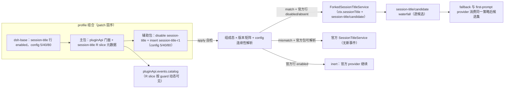

# Design: plugin-api-session-title-r1

> feature_name: `plugin-api-session-title-r1`
> 状态：Stage 2 已批准（用户已批准；含 R-5.11 收窄修订的明示同意，见「Requirements 修订注记」）
> 上游：`requirements.md`（Stage 1 已批准，含一次已记录的头注小修订）、`AGENTS.md` §2.7/§4.6、`docs/standards/capability-strategy.md` R1–R9、compaction-events-r1 的 design/tasks（R 类先例）
> 类型：R 类 replacement bundle；host-only。
>
> **维护修订（包政策推行）**：实现已收敛到不含 `r1` 的运行时名（源码 `packages/session-title/`、row id `plugin-api-session-title`、feature `session-title`、契约符号 `dsh-plugin-api.session-title.contract`）。辅助包 `package.json` 与主包统一 `0.1.0-rc.6-0.5` / `dsh.api: 0.5`，apply 内校验自身与主包的全量唯一版本；不一致时进入官方等价 fallback（replacement 特性停用）并显式诊断。主包 catalog slice 用工厂 `createSessionTitleEventsCatalogSlice({expectedContract, auxiliaryManifest, logger})` 做二次校验，只排除本 R slice。聚合 bundle `packages/full/` 以确定顺序装配主包与本替代行。

---

## Overview

官方 `@deepseek-ai/dsh-session-title@0.1.0-rc.6` 的全部标题候选获取集中在一个纯函数 `collectSessionTitleMessages(events, throughSeq)`（官方 `lib/index.js:93-105`）：过滤 `user/message` + `source.kind === 'user'` + 非空文本，产出 `{ seq, text }`。它的官方调用点共五处：

| 官方位置 | 用途 |
|---|---|
| `onUserMessage`（`lib/index.js:318`） | 单事件“是否为候选”判定 |
| `onUserMessage`（`lib/index.js:322`） | provider 自动 cadence 判定（first-prompt / all-prompts） |
| `refresh`（`lib/index.js:260`） | 显式重刷的 latest/first 候选 |
| `runProvider`（`lib/index.js:393`） | 传给 `provider.generate()` 的消息快照 |
| `ensureFallback`（`lib/index.js:553`） | fallback 的 first 候选 |

本 feature 的 fork 只做一件事：把上述五处“原始候选获取”替换为**策略感知候选获取** `collectEligible(session, events, throughSeq?)`，在该函数内为每个原始候选派发一次 `session-title/candidate` waterfall，按决策产出排除/替换后的候选集；其余官方逻辑（Config、provider 注册/生命周期、durable `session/title` append、fallback 公式、rename/get/fold）保持逐行等价。官方 first-prompt provider 是独立行 `session-title-llm`（`dsh-base/cordis.patch.yml:46-53`），**不替换**；它取 `messages[0]`，因此自然消费策略后的候选集。

核心不变量：**未安装辅助包时与官方完全一致；安装后，官方行被禁用、替代行提供契约等价的 `ctx.sessionTitle`，唯一可观察差异是新增 `session-title/candidate` 策略 dispatch；零监听器时行为等价官方。**

### 调研依据（本设计已吸收）

- 官方 `@deepseek-ai/dsh-session-title@0.1.0-rc.6` built 源码：`/usr/lib/node_modules/@deepseek-ai/dsh/node_modules/@deepseek-ai/dsh-session-title/lib/index.js`（580 行，服务 key `sessionTitle`，`static inject = ["sessions"]`，导出 `SessionTitleService`（default）/`SessionTitleInvalidError`/`SessionTitleProviderId`/`collectSessionTitleMessages`/`fallbackSessionTitle`/`foldSessionTitle`/`normalizeSessionTitle`/`truncateTitleUtf8`）。
- 官方行定义：`dsh-base/cordis.patch.yml:39-44`（`id: session-title`，config 默认 `fallbackMaxWords: 5 / fallbackMaxBytes: 40 / maxTitleBytes: 80`）；first-prompt provider 行 `:46-53` 独立。
- patch 语义：`cordis-plugin-include/lib/index.js:57-105` `applyEntryPatches`——非 insert patch 按 key 覆盖（`config` 整对象替换，`disabled` 不因后续只写 config 的层而复位）；缺失 id 告警跳过；insert 恒生效。
- Cordis waterfall 语义：`cordis/lib/index.js:317-325`——外层优先组合，监听器不调 `next()` 即短路；同步 dispatch。
- `dsh-session`：`Session` 无 agent 身份字段；`requestContext()` 只承载 route 元数据（`lib/index.js:1506-1514`）。`dsh-agent` 的 `AgentRegistry` 提供 `list()/get(id)`（`lib/index.js:688/706`），`agent.session.id` 可反查。
- pro-ex 现状 hack：`../dsh-pro-ex-ability-anchor/lib/index.js:574-691`（合成虚拟消息带 `source.form === ANCHOR_USER_SOURCE_FORM`，事后纠偏标题引用）；**exclude 决策即可完整替代该段**（见 C7）。
- R 类先例：`docs/specs/plugin-api-compaction-events-r1/design.md`（boot 矩阵、契约符号、R-slice 动态可见性、版本锁）。

---

## Architecture



两个包的耦合只通过契约符号 `Symbol.for('dsh-plugin-api.session-title-r1.active')`：辅助包在 forked service 实例上设置该符号；主包 catalog guard 只读该符号 + `ctx.loader` 条目状态，不 import 辅助包。主包/辅助包保持独立可安装（requirements 1.3）。

---

## Components and Interfaces

### C1. 主包集成：R slice 注册与版本

- 新增模块 `lib/session-title-events-catalog.js`（本 feature 自有 slice，遵守并行契约“共享文件只追加”）：

  ```js
  export const sessionTitleEventsCatalogSlice = {
    name: 'session-title-r1',
    entries: Object.freeze({
      'session-title/candidate': {
        name: 'session-title/candidate',
        mode: 'waterfall',
        scopeFiltered: false,
        scopeKey: null,            // Stage 2 定稿（requirements 6.1）：title dispatch 上下文无 agent，host-global
        payload: '{agent, session, message}; message = {seq, text, source}',
        args: '(payload, next)',
        source: 'U9 (R)',
        type: 'R',
        fault: 'contain',
        freeze: { deep: ['message'] },
        feature: 'plugin-api-session-title-r1',
      },
    }),
    isActive: isSessionTitleReplacementActive,
  }
  ```

- guard（全部 try/catch，任何异常返回 `false`）：

  ```text
  isSessionTitleReplacementActive(ctx):
    loader 条目中存在 name = '@deepseek-ai/dsh-plugin-api-session-title'
      且 entry.fiber !== undefined 且 !entry.disabled
    且 ctx.get('sessionTitle') 上存在契约符号 Symbol.for('dsh-plugin-api.session-title-r1.active')
  ```

- 在 `lib/index.js` 的 `mountEventsFeature` 按 compaction-events-r1 的 R-slice 接入方式**追加**本 slice；不改 `lib/events-bus.js` / `lib/deep-freeze.js`（frozen files）等共享派发语义。
- 主包版本：`pluginApi.events.catalog` 新增一条公开 R 类条目，属 API 协议 minor 变更。**版本定为 `0.1.0-rc.6-0.5` / `dsh.api: '0.5'`**（compaction-events-r1 已交付并占用 0.4，见下一条）。
- 并行依赖声明（已核实主仓库现状）：compaction-events-r1 Stage 4 已合入 main（提交 `bacf593`），主包已改名 `@deepseek-ai/dsh-plugin-api-main@0.1.0-rc.6-0.4`，`lib/events-bus.js` 已具备 `rSlices` 动态 accessor 与 `type:'R'` 支持。本 feature 的 catalog 接线**复用该已交付机制**，只追加自有 slice；不在本分支重造 R-slice 机制，也不修改 frozen files（`lib/events-bus.js`/`lib/deep-freeze.js`）。本 worktree 当前基于旧边界 `e514ca0`：Stage 2 批准并提交后，先 rebase 到最新 main HEAD，再开始 Stage 3/4 的共享文件追加。

### C2. 辅助包装配

`packages/session-title-r1/`：

- `package.json`：
  - `name`: `@deepseek-ai/dsh-plugin-api-session-title`；
  - `version`: `0.1.0-rc.6-0.1`（`<runtime 全量>-<R 迭代>`；runtime 部分 = 锁定的官方 runtime `0.1.0-rc.6`）；
  - `type: module`；`main: lib/index.js`；`exports`: `.`、`./invariant`、`./package.json`；
  - `dsh.bundle.patch: ./cordis.patch.yml`；
  - `peerDependencies`：镜像官方 `dsh-session-title` 的 peer 集（`@deepseek-ai/cordis@^4.0.1`、`@deepseek-ai/dsh-brand@^0.1.0-rc.6`、`@deepseek-ai/dsh-invariants@^0.1.0-rc.6`、`@deepseek-ai/dsh-llm@^0.1.0-rc.6`、`@deepseek-ai/dsh-session@^0.1.0-rc.6`、`@deepseek-ai/dsh-session-projection@^0.1.0-rc.6`），并额外精确声明 `@deepseek-ai/dsh-session-title@0.1.0-rc.6`（仅用于 identity 校验与 fallback provider）；
  - `dependencies`：`zod@^4.4.3`、`@deepseek-ai/schemastery@^3.18.1`（vendored 源码直接 import，与官方相同）；
  - `devDependencies`：`@deepseek-ai/dsh-app-boot@^0.1.0-rc.6`（仅用于 `composeEntries` patch 组合测试）。
- `cordis.patch.yml`：

  ```yaml
  - id: session-title
    disabled: true
  - insert:
      - id: session-title-r1
        name: '@deepseek-ai/dsh-plugin-api-session-title'
        config:
          fallbackMaxWords: 5
          fallbackMaxBytes: 40
          maxTitleBytes: 80
  ```

  insert 的 config 写死官方 base 默认值，使替代行在官方行缺席时也能独立激活（官方 Config 三字段均 `.required()`）；用户对官方行的自定义 config 由 C3 的 config 连续性解析接管。
- R3 边界显式声明：本包只替换 `ctx.sessionTitle` 服务面与新增事件面；第三方 `import '@deepseek-ai/dsh-session-title'`（含 `./invariant`、`./types` 等子路径）仍解析到官方原包（requirements 3.6）。
- `lib/invariant.js`：注册本包名 `@deepseek-ai/dsh-plugin-api-session-title` 的 no-op companion（本包不新增 durable event 类型）；官方包的 `./invariant` companion 及其注册行为不受影响（官方包仍在安装集内，import 面不变）。

### C3. Boot 自检与 provider 决策（requirements §4）

apply 流程：

```text
state = inspectComposition(ctx)
  官方行 entry：present-enabled | present-disabled | absent
    （按 entry.options.id === 'session-title' 匹配，回退按 options.name === '@deepseek-ai/dsh-session-title'）
  已有 ctx.sessionTitle：
    - 存在且带本契约符号 → idempotent re-apply：不重复注册，返回
    - 存在且非本契约符号 → 已有 provider（官方或更早 claimant）：log + inert
versionOk = readPackageVersion('@deepseek-ai/dsh-llm') === '0.1.0-rc.6'
         && readPackageVersion('@deepseek-ai/dsh-session-title') === '0.1.0-rc.6'
config = resolveConfig(ctx, ownConfig)
if versionOk:
    present-enabled → inert（官方 provider 继续）
    present-disabled | absent → ctx.plugin(ForkedSessionTitleService, config)
      然后 post-register 自检：ctx.get('sessionTitle') 可解析、get/rename/refresh/register
      四个公开方法 callable、契约符号存在、typeof ctx.waterfall === 'function'；
      失败 → 尝试 dispose 已注册实例，log，stay inert（requirements 4.7）
else:
    present-enabled → inert + diagnostic
    present-disabled | absent → 官方包可解析 ? ctx.plugin(官方 SessionTitleService, config)
      （官方等价、无新事件）: inert + loud diagnostic
```

- **config 连续性解析**（本 feature 比 compaction 先例多出的专项决策）：官方 Config 三字段无默认值，而 patch 引擎对非 insert patch 按 key 覆盖、且用户后续只写 `config` 的层不会复位 `disabled`。因此用户的自定义 `session-title` config 会落在**已禁用的官方行**上。解析顺序：
  1. 本行 config（insert 默认 5/40/80）先按 fork 的官方同款校验（三字段正整数 + `fallbackMaxBytes <= maxTitleBytes`）验证；
  2. 若官方行 entry 存在，读取 `entry.options.config` 并用同一校验验证：**合法则采用官方行 config（用户配置连续性），非法则用本行 config 并 log 一条诊断**；
  3. 解析全程 try/catch，异常回退本行 config，绝不抛穿 apply。
- 确定性同行胜者：**首个成功注册的 provider 拥有 `ctx.sessionTitle`**（Cordis 服务单例语义天然实现 composed entry order 最早者胜出）；后续 claimant 在 `ctx.get('sessionTitle')` 已存在且非自身符号时 log + inert（requirements 4.6）。
- ownership 解释（对齐 requirements 4.6 与 compaction 先例）：**因版本不匹配/官方包不可解析而 inert 的首个 claimant 不构成 ownership**；若它未注册任何 provider，后续匹配的 claimant 仍可注册 fork 或 fallback，避免官方行已 disabled 却无任何 provider 的死 boot。
- 全部 `ctx.get` / loader 枚举 / package.json 读取均在 try/catch 中，异常按“present-disabled”的 fallback-or-inert 规则处理，绝不抛穿 apply（requirements 4.5）。
- 契约符号在 `ForkedSessionTitleService` 构造器中设置：`Object.defineProperty(this, MARKER, { value: true })`（不可枚举）。
- `readPackageVersion` 用 `createRequire(import.meta.url).resolve('<pkg>/package.json')` + 读 JSON，全程 try/catch。

### C4. Forked service 与候选策略注入（requirements §5）

- vendored 文件 `lib/forked-service.js`：复制官方 `dsh-session-title/lib/index.js`（文件头注明出处与 MIT），增量统一打 `// R-class patch:` 注释。公开导出与官方逐名一致（requirements 3.1/3.6）；`static inject = ["sessions"]`、`static Config`、`SessionTitleInvalidError`、`SessionTitleProviderId`、纯函数导出全部保留。
- **策略感知候选获取**（模块内新增，不改官方纯函数语义）：

  ```text
  collectEligible(session, events, throughSeq?):
    raw = collectSessionTitleMessages(events, throughSeq)   // 官方纯函数，保持不变
    result = []
    for message in raw:
      source = session.events[message.seq].data.source       // 已冻结的 durable data
      payload = buildPayload(resolveAgent(ctx, session), session, message, source)
      decision = dispatchCandidatePolicy(ctx, payload)
      applyDecision(result, session, decision, message)
    return result
  ```

  返回的 provider 面仍是官方形状 `{ seq, text }`；内部候选记录额外携带 `source` 供 payload 使用。
- **五处官方调用点改写为单次采集**（保证 requirements 5.3 “每候选每 generation attempt 至多一次”、5.9 “同一策略后候选集”）：

  | 官方位置 | fork 行为 |
  |---|---|
  | `onUserMessage:318` + `:322` | 先检查 `source.kind === 'user'`；只调一次 `collectEligible(session, session.events, event.seq)`；`event.seq ∉ eligible` 即 return；cadence 判定用同一 `eligible.length` |
  | `refresh:260` | 只调一次 `collectEligible(session, session.events)`；`latest`/`first` 从该数组取；provider 分支把 `messages` 存入 `pending/work`；fallback 分支把同一 `messages` 透传给 `ensureFallback(session, messages)` |
  | `runProvider:393` | `messages = work.messages ?? collectEligible(session, session.events, work.throughSeq)`；同一数组供 fallback 与 provider 复用 |
  | `ensureFallback:553` | 签名改为私有 `ensureFallback(session, precomputed?)`；仅在无 precomputed 时自行 `collectEligible`（如 `onUserMessage` defer 触发的独立 fallback attempt） |
  | `appendFallback` | 不变（first 来自已采集数组） |

  等价性论证：`throughSeq` 固定、log append-only、`ensureFallback` 只 append `session/title`（不是 `user/message`），因此“先采集再 ensureFallback”与官方“先 ensureFallback 再采集”得到同一候选集；官方两次 `assertCurrent` 与信号语义保持原样。

- **Generation attempt 边界（requirements 5.3 的适用范围）**：一个 title-generation attempt = 一次可能产出 `session/title` append 的服务内部生成流程——`ensureFallback` 调用（fallback attempt）、`refresh` 调用（refresh attempt，含其 fallback 分支）、`runProvider` 调用（provider attempt）。每一 attempt 内按上表只做一次候选采集。`onUserMessage` 顶部的采集是**调度期筛选**（决定是否安排 pending/fallback，不产出标题），不属于任何 generation attempt；其 defer 触发的 `ensureFallback(session)` 在微任务执行时重新采集，属于新的 fallback attempt。同一候选可能被调度期筛选与后续 attempt 各评估一次，策略监听器应保持幂等、无副作用。
- **`runProvider` 空候选路径**：策略排除全部候选时，跳过 `provider.generate()`（官方该路径不可能拿到空数组，first-prompt provider 会对空数组抛错），走 `ensureFallback(session, messages)` 的官方 no-candidate 结局（无 title append、无新错误类型）——这正是 requirements 5.10 的“官方无候选行为”。
- **`dispatchCandidatePolicy`**（`lib/event-contract.js` + fork 调用）：
  - `ctx.waterfall('session-title/candidate', payload, () => undefined)`；**同步派发**（Cordis waterfall 原生同步）。
  - 决策解释（先返回者胜、短路链，requirements 5.7）：
    - `undefined` / 调用 `next()` 链正常结束 → proceed；
    - `{ kind: 'exclude', reason? }` → 该候选从候选集移除；
    - `{ kind: 'replace', message: { seq }, reason? }` → 解析替换（见 Data Models）；
    - 其他形状（含 thenable）→ 记一条 redacted 诊断，按 no decision 处理；thenable 的 rejection 被附加 `.catch` 收敛（requirements 5.8）。
  - 监听器同步 throw / 异步 reject → 捕获、redacted 日志、视为 no decision，**不改变**官方标题路径结果。
- **payload 构造**：
  - `agent`：懒解析 `ctx.get('agents').list()` 中 `agent.session.id === session.id` 的 agent；`agents` 服务缺失/查找失败时为 `undefined`（key 仍存在）。
  - `message`：`{ seq, text, source }`，`source` 为 `event.data.source` 的深冻结拷贝（含 `kind` 与 pro-ex 需要的 `form` 等官方字段）。
  - `message` 及其 `source` 深冻结；`agent`/`session` 为 live 引用（与 compaction C6 及门面 freeze 策略一致）。见“Requirements 修订注记”对 5.11 的修订。
- `get`/`rename`/`foldSessionTitle` 不改：rename 是显式赋值，不经候选采集（requirements 5.12）；无候选采集即无事件（requirements 5.13）。
- 门面订阅者注意事项：`pluginApi.events.on` 的 waterfall 包装要求“不决策时调用 `next()`”，否则按原生语义短路后续监听器；本事件词表与该既有契约一致，不新增特殊规则。

### C5. 门面 catalog 集成（requirements §6）

- R slice 元数据见 C1。`scopeKey: null` 的定稿理由：官方 `session/event` 与 title 服务 dispatch 上下文没有 agent 参数，title 是 session-owning host 服务的产物；agent 仅作为 payload 便利字段懒解析。
- `fault: 'contain'`：单个策略监听器故障只影响其自身决策；`freeze: { deep: ['message'] }`：门面只深冻结候选快照，不动 live `session`/`agent`。
- 复用 compaction-events-r1 的 R-slice 动态可见性（静态全集订阅 + 公开 accessor 过滤 + `composeCatalogs` fail-loud duplicate）：替代行未 active 时 catalog 不含该条目；facade core inactive 时 native `ctx.on('session-title/candidate', ...)` 仍可直连观察（无门面保证）。

### C6. 版本与退役

- 辅助包运行时锁：`@deepseek-ai/dsh-llm@0.1.0-rc.6`（runtime identity，与主包 F0.3 同源）+ `@deepseek-ai/dsh-session-title@0.1.0-rc.6`（fork 基底 identity）；不匹配按 C3 矩阵安全停用/降级。
- 主包：`0.1.0-rc.6-0.5` / `dsh.api 0.5`（C1）。
- U9 上游提案继续登记（requirements 8.1）；官方提供等价的 `session-title/candidate` 或内置合成消息排除 seam 后，辅助包发布 deprecation 版本：保留 provider 但把内部 dispatch 切换为官方事件（或直接退役 fork），并给出消费者迁移路径（requirements 8.2）。
- 交付治理（requirements 8.3、1.4/1.5）：Stage 4 完成时，`docs/specs/plugin-api-features/feature-list.md` 的 U9 登记与 R 类类型标注、`AGENTS.md` §8 登记与 §2/§4 同步、`docs/standards/capability-strategy.md` §5 矩阵，以及本次交付触及的旧 spec 与治理文档（包命名/行 id/catalog 类型）SHALL 在同一 change set 就地追加/修订；确属历史快照的加权威指针。

### C7. pro-ex 迁移映射（requirements §7，证据非目的）

pro-ex 现状 `lib/index.js:574-691` 的事后纠偏可以整体替换为一个策略监听器：

| 现状 hack | 迁移后的等价表达 |
|---|---|
| `realTitleText` 找 anchor/real seq（`585-597`） | 无需：候选按序到达 |
| `titleCitesVirtual` + `fixSessionTitle` 重写标题（`598-671`） | 无需：虚拟候选从不进入标题 |
| 直读 `titleService.registration` 私有字段 / 手写 `session/title` append | 删除 |
| `session/event` 上的两处事后监听（`672-691`） | `pluginApi.events.on('session-title/candidate', (payload, next) => { if (payload?.message?.source?.form === ANCHOR_USER_SOURCE_FORM) return { kind: 'exclude', reason: 'trajectory anchor virtual request' }; return next() })` |

迁移后行为：虚拟消息在 `onUserMessage` 即被排除（不触发 pending/fallback 调度）；真实首条用户消息成为 fallback 与 first-prompt provider 的 `messages[0]`；pro-ex 不再需要任何标题纠偏。**该迁移在 `../dsh-pro-ex-ability-anchor` 仓库执行，属于其独立获批任务**；本 feature 的 Stage 4 任务只负责提供 API、fixture 验证与迁移验收配合（headless 冒烟 + dev boot，requirements 7.1–7.3）。

---

## Data Models

```ts
/** 官方 provider 面不变 */
type TitleCandidate = { seq: number; text: string }

/** payload 候选快照（额外带 source） */
type SessionTitleCandidateMessage = {
  seq: number
  text: string
  source: { kind: 'user'; form?: string; [key: string]: unknown }
}

type SessionTitleCandidatePayload = {
  agent?: unknown          // 懒解析的 live agent，可能 undefined
  session: unknown         // live session 引用（不深冻结）
  message: SessionTitleCandidateMessage   // 深冻结快照
}

type SessionTitleCandidateDecision =
  | undefined                                   // proceed（含调用 next()）
  | { kind: 'exclude'; reason?: string }
  | { kind: 'replace'; message: { seq: number }; reason?: string }
```

决策校验规则：

- `kind` 必须精确为 `'exclude'` 或 `'replace'`；`reason` 若存在必须为 string（日志只输出类型/长度级别信息，不输出 reason 原文）。
- `replace.message.seq` 必须是安全整数；解析时要求 `session.events[seq]` 存在、`event.seq === seq`、`event.type === 'user/message'`、`event.data.source.kind === 'user'`、`normalizeSessionTitle(text, MAX_SAFE_INTEGER).length > 0`；若当前采集带 `throughSeq`，还必须满足 `seq <= throughSeq`（保持官方 provider 面“候选均在生成边界内”契约）。
- 替换是**单次替换、不回灌策略**（requirements 5.6）；替换目标可以是当前候选自身（语义上等于 proceed）。
- 解析失败 → 原候选保留 + redacted 诊断。
- 排除不改变 session log 与 durable title 存储（requirements 5.5）。

---

## Error Handling

| 失败场景 | 行为 |
|---|---|
| 策略监听器同步 throw | 捕获、redacted 日志、no decision；标题生成继续（5.8） |
| 策略监听器返回 thenable / 异步 reject | 附加 `.catch` 收敛、redacted 日志、no decision（5.8） |
| 决策形状 malformed | redacted 日志、no decision（视为 5.4） |
| `replace` 引用非法/不可解析 | 原候选保留、redacted 日志（5.6） |
| 策略排除全部候选 | 官方 no-candidate 结局：不调 provider、无 append、无新错误类型（5.10） |
| 官方行 present-enabled | 不注册第二 provider、log、正常 return（4.1） |
| 版本/identity 不匹配 | C3 矩阵：fallback 官方实现或 inert + loud（4.4） |
| 同行 claimant 冲突 | 最早成功注册者胜；后者 log + inert（4.6） |
| post-register 自检失败 | 回滚注册、log、inert，不抛穿 apply（4.7） |
| 自检探针自身抛错 | 全部 try/catch，按 fallback-or-inert 处理，不抛穿 apply（4.5） |
| 用户官方行 config 非法 | 回退本行默认 config + 诊断（C3 config 连续性） |
| 日志本身 throw | 忽略，不改变事务结果 |

redaction 原则：所有诊断不输出候选文本、标题文本、session 正文；只输出事件名、决策 kind、错误类名/消息摘要。

---

## Testing Strategy

- 纯函数模块（零 harness 依赖）：`lib/event-contract.js` 的决策校验、payload 深冻结（message/source 冻结、agent/session live）、thenable 收敛、redacted 诊断构造。
- patch 装配测试：用官方 `composeEntries` 验证 disable+insert、移除恢复、官方行缺席时 disable 告警跳过而 insert 生效、后续层只写 config 不复位 disabled（requirements §2 + C2/C3 前提）。
- forked service 测试（fake ctx/session）：
  - 零监听器行为与官方逐项等价（requirements 5.2）：fallback 首候选、first-prompt `messages[0]`、provider cadence、rename 不受策略影响、durable append 形状；
  - exclude / replace / malformed / listener throw / thenable reject 各结局；
  - 每候选每 generation attempt 至多一次 dispatch（refresh 单次采集并透传 fallback 分支、runProvider 复用 work.messages；onUserMessage 调度期筛选单次采集，且与后续 attempt 边界明确，见 C4）；
  - 多监听器先返回者短路（5.7）；空候选结局（5.10）；payload 不可变（5.11）。
- apply 矩阵测试（fake loader entries）：versionOk × {present-enabled, present-disabled, absent} 全覆盖 + 同行冲突 + idempotent re-apply + post-register 失败回滚 + 永不抛穿 apply（requirements §4）。
- 主包集成测试：catalog 动态可见性（guard true/false）、`pluginApi.events.on` 订阅优先级与 waterfall 决策透传、facade inactive 时 raw `ctx.on` 可观察、SV13 `pluginApi.services.sessionTitle` 直通替代服务、无辅助包时 catalog 不含该条目（requirements §6、3.7）。
- 迁移验收（配合 `../dsh-pro-ex-ability-anchor` 独立任务）：删除 `lib/index.js:574-691` 后接策略监听器，headless 冒烟 + dev boot 通过；官方包文件 checksum 审计 + `git diff --check` + 全量 `node --test`。

---

## 关键设计决策与理由

| 决策 | 理由 |
|---|---|
| D1 策略入口为同步 waterfall | Cordis waterfall 原生同步；官方候选采集点在同步 `onUserMessage` 路径，全异步化会改变官方事件时序；异步决策被显式拒绝（thenable → no decision + 收敛），requirements 5.8 只要求异步 rejection 收敛 |
| D2 改写五处采集点而非事后过滤标题 | 事后过滤只能修正已写 title；在采集点决策使 fallback 与 provider 从源头共享同一候选集，且无需新增 durable 语义 |
| D3 `ensureFallback/runProvider/refresh` 单次采集 + precomputed 透传 | 满足 5.3 “每 attempt 至多一次”与 5.9 “共享候选集”；throughSeq 固定 + append-only 保证等价 |
| D4 替换引用用 `{ seq }` 而非文本 | seq 是 log 内稳定身份；文本可被篡改/重复；解析时复核 type/source.kind/非空，避免伪造候选 |
| D5 config 连续性读取已禁用官方行的 config | patch 引擎按 key 覆盖、后续层写 config 不复位 disabled；不读取会导致用户自定义标题预算静默失效，违背 3.2/零策略等价 |
| D6 官方行缺席时 insert 自带 5/40/80 | 官方 Config 三字段 required；保证辅助包可独立安装激活（requirements 1.3、4.3） |
| D7 `scopeKey: null` | title dispatch 上下文无 agent 参数（调研证据）；与 compaction host-global 先例一致 |
| D8 主包版本 0.5 | catalog 公开面新增 R 条目属 minor 协议变更；0.4 已被 compaction-events-r1 占用 |
| D9 不替换 `session-title-llm` 行 | first-prompt provider 是独立行；其 `messages[0]` 消费策略后候选集即达成目标，最小 fork 面 |

---

## Requirements 修订注记（设计发现，提请随本设计一并批准）

1. **R-5.11 措辞修订（对已批准 AC 的实质收窄，需用户明示同意）**：`agent`/`session` 无法（也不应）被深冻结——`session` 是官方 live 服务对象，深冻结会破坏其增量缓存与 append 路径；与 compaction C6 及门面既有 freeze 策略一致。建议将 requirements 5.11 改为：

   > WHEN a `session-title/candidate` payload is produced THEN the replacement SHALL deliver an immutable candidate snapshot：`message` 与其 `source` 深冻结，`agent`/`session` 保持 live 引用；no listener SHALL be able to mutate the candidate through the payload。

   **如实声明：该修订把 5.11 的不可变承诺从“session 与 candidate 都不可通过 payload 变更”收窄为“candidate 不可变，agent/session 为 live 引用”，是对已批准 AC 的实质收窄。** 按 AGENTS.md §3.2，批准本 design 时必须同时明示同意该修订，批准后同步修订 requirements 5.11 文本；若不同意，则采用备选形状（payload 不携带 live session，只携带 `session.id` + 只读快照）并回退 requirements 重审。

2. **R-5.3 的 `agent` 字段解释**：官方 title dispatch 无 agent 身份；`agent` 由 `agents.list()` 懒解析，解析失败时键存在且值为 `undefined`。本解释不改 requirements 文本。

3. **R-5.8 的 thenable 解释**：返回 Promise（无论最终 resolve 与否）一律按 no decision 处理并收敛其 rejection；这是 Cordis waterfall 同步语义下的必然边界，不改 requirements 文本。

---

## 覆盖检查

- Host 面：C1–C5 全覆盖；Client 面：无（requirements §9）。
- 钩子引出机制：`session-title/candidate` = R 类（官方无 dispatch 点，fork 内直接 `ctx.waterfall`）；catalog 条目 = 复用 compaction R-slice 机制；无 B 类模拟、无新增 C 类（U9 仅登记）。
- 失败路径与 guard：C3 矩阵、Error Handling 表、fault/freeze 策略全覆盖。
- 治理与文档新鲜度：requirements 1.4/1.5/8.3 → C6 交付治理行。
- 测试任务映射在 Stage 3 tasks 中逐条对应 requirements §1–§8。
