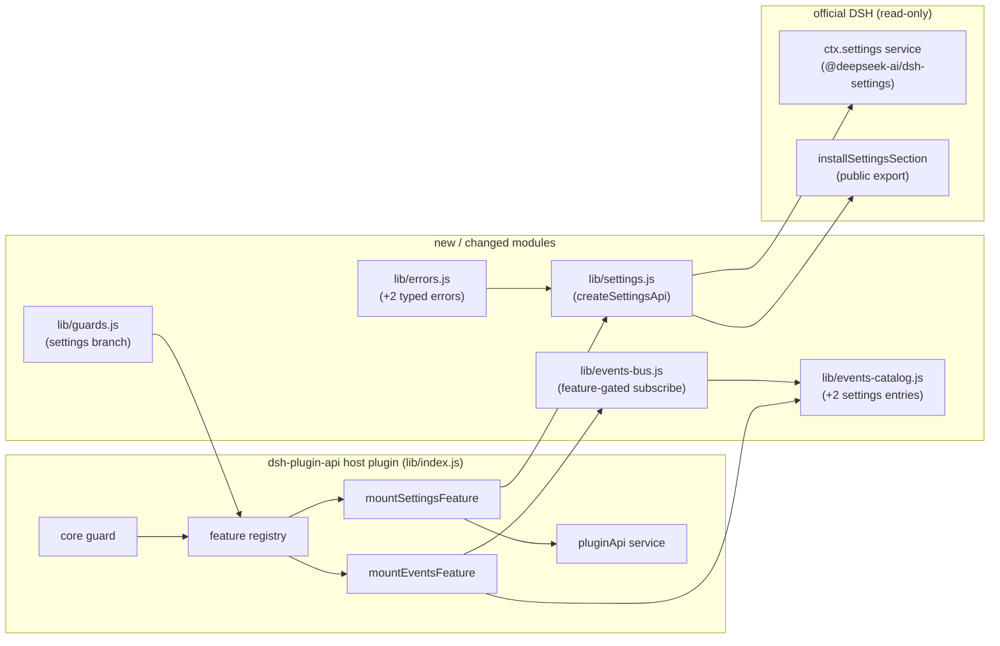

# Feature Design: plugin-api-settings-m1

## Overview

本设计把 `plugin-api-settings-m1` 的 4 个 A 类需求（ST1/ST2/ST3/ST8）落到 `dsh-plugin-api` 现有 M0/M1 架构上：

- **ST1/ST2/ST8** 通过新的 `lib/settings.js` 门面模块实现，运行时只依赖官方 `settings` 服务（`ctx.get('settings')`）与官方导出的 `installSettingsSection` helper；不包装、不重排、不发明设置语义。
- **ST3** 通过扩展 `plugin-api-events-m1` 的静态事件目录与事件总线 feature gating 实现：新增 `settings/updated`、`settings/document-updated` 两个 catalog 条目，并让事件总线在 `settings` feature 被禁用时对这两个事件名抛出 foundation 定义的 feature-disabled typed error。
- **可选 settings 服务模式**：官方 `settings` 服务是可选 seam。core 活跃时，settings feature **不因 `ctx.settings` 缺失而整体禁用**；`register` / `scope` / `describe` 在调用时若服务不可用则抛 `PluginApiServiceUnavailableError`，`installSettingsSection` 保持官方 no-op fallback。仅当官方 settings 服务存在但形状不完整时，feature guard 才在启动期禁用本 feature。

本设计不产生 B 类模拟、不产生新的 C 类上游提案、不修改任何官方包文件。

---

## Architecture



运行顺序（`lib/index.js` 现有 apply 流程不变）：

1. core guard 通过后，按 `FEATURE_MOUNTERS` 顺序 mount `events` → `web` → `llm/admission` → **`settings`（新增）**。
2. `events` feature 先创建 `pluginApi.events`（带 `featureRegistry`），因此后续第三方插件在 settings feature 就绪后即可类型化订阅两个 settings 事件。
3. `settings` feature mount 后，`pluginApi.settings` 从 disabled stub 切换为真实 API（`isActive: true`）。

---

## Components and Interfaces

### 1. `lib/settings.js`（新增）

零 harness 依赖的纯门面模块（仅 import 官方公共 helper 与门面错误类）。导出：

```js
export function createSettingsApi({ ctx, logger }) => {
  isActive: true,
  register(ns, schema, options?) -> SettingsScopeHandle,
  scope(ns) -> SettingsScopeHandle,
  describe(options?) -> SettingsDescriptor[],
  installSettingsSection(ctx, ns, schema, entry, hooks) -> void,
  dispose() -> void,
}
```

内部要点：

- `scopes = new Map()`：门面注册表，key 为 namespace，value 为该次 `register` 创建的 scope handle。`scope(ns)` 只从该 map 返回 handle；未通过门面注册的 `ns` 抛 `PluginApiSettingsNamespaceError`。
- `getSettings()`：每次调用时执行 `ctx.get('settings')` 并用 try/catch 包裹；返回 `undefined` 或抛错时统一抛 `PluginApiServiceUnavailableError('settings')`。用于 `register` / `scope` / `describe` 与 handle 的 `get` / `mutate`。
- `register(ns, schema, options)`：
  1. `const settings = getSettings()`；
  2. `const officialScope = settings.register(ns, schema, options)`（官方错误原样上抛，不捕获、不翻译、不预校验）；
  3. `const handle = createScopeHandle(ns, officialScope, getSettings)`；
  4. `scopes.set(ns, handle)`；
  5. 返回 `handle`。
- `createScopeHandle(ns, officialScope, getSettings)` 返回的 handle：

  | 方法 | 委托目标 | 说明 |
  |---|---|---|
  | `get()` | `getSettings().get(ns)` | 官方 provider 读；注册被 dispose 后返回 `undefined`（unregistered 语义），满足 AC 1.6 |
  | `watch(callback)` | `officialScope.watch(callback)` | 官方 watcher 语义：commit 顺序、一次一个、失败 contained、disposer 移除 |
  | `update(patch)` | `officialScope.update(patch)` | 官方 merge 写语义（含 JSON 校验、写队列、`SettingsConflictError`） |
  | `replace(section)` | `officialScope.replace(section)` | 官方 wholesale-reset 语义 |
  | `mutate(ops, expectedRevision?)` | `getSettings().mutate(ns, ops, expectedRevision?)` | 官方 provider 级 path-op 写语义 |

- `describe(options)`：`return getSettings().describe(options)`，原样返回官方 descriptor 数组。
- `installSettingsSection`：直接使用官方 `@deepseek-ai/dsh-settings` 的公共导出 `installSettingsSection`（不复制实现、不触碰 Cordis 内部 `fiber.state`）。
- `dispose()`：`scopes.clear()`；不调用官方任何 dispose（官方注册的生命周期由官方 `register` 的 effect 管理）。

### 2. `lib/plugin-api-service.js`（修改）

- 新增 disabled stub 工厂 `createDisabledSettingsApi(active)`：

  ```js
  {
    isActive: false,
    register: fail,
    scope: fail,
    describe: fail,
    installSettingsSection: fail,
  }
  ```

  `fail` 先判 core inactive（`PluginApiInactiveError`），否则抛 `PluginApiFeatureDisabledError('settings')`；不触碰任何官方服务。
- 构造函数增加 `this.settings = createDisabledSettingsApi(active)`。
- `mountFeature(name, api)` 增加 `if (name === 'settings') { this.settings = api; return }`。

### 3. `lib/index.js`（修改）

- `import { createSettingsApi } from './settings.js'`。
- `FEATURE_MOUNTERS` 追加 `['settings', mountSettingsFeature]`。
- `mountSettingsFeature({ ctx, service, logger })`：
  - 幂等重入：`if (service?.settings?.isActive === true) return () => {}`；
  - `const settings = createSettingsApi({ ctx, logger })`；
  - `service.mountFeature('settings', settings)`；
  - 返回 disposer `() => settings.dispose()`（清空 scope 注册表，不抛错）。
- `mountEventsFeature` 增加 `featureRegistry` 入参，并传给 `createEventsBus`，使 settings 事件名可被 feature gating。

### 4. `lib/events-catalog.js`（修改）

新增两个条目，并保持整个 catalog 深冻结：

| name | mode | scopeFiltered | subject | args | payload | source | type | feature |
|---|---|---|---|---|---|---|---|---|
| `settings/updated` | `emit` | `false` | `undefined` | `(ns, next, prev, source)` | `ns: SettingsNamespace; next/prev: resolved values; source: 'update' \| 'provider'` | `ST3` | `A` | `settings` |
| `settings/document-updated` | `emit` | `false` | `undefined` | `(ns, revision)` | `ns: SettingsNamespace; revision: number` | `ST3` | `A` | `settings` |

- entry 类型说明增加可选 `feature?: string`；已有 19 个条目不加 `feature`（默认无门禁，行为不变）。
- 原 events-m1 “首版恰好 19 个事件”的测试快照随之更新为 21 个事件名（见 Testing Strategy）。

### 5. `lib/events-bus.js`（修改）

- `createEventsBus({ ctx, catalog, logger, featureRegistry })` 增加可选 `featureRegistry`。
- `subscribe(name, listener, opts, once)` 在 catalog 命中之后、注册 native hook 之前插入：

  ```js
  const meta = catalogEntryOf(name)
  if (meta?.feature && featureRegistry && !featureRegistry.isActive(meta.feature)) {
    throw new PluginApiFeatureDisabledError(meta.feature)
  }
  ```

- 对无 `feature` 的既有条目，行为与 events-m1 完全一致；未传 `featureRegistry` 的调用（如现有单测）也保持原行为。
- 该门禁保证：settings feature 被启动期 guard 禁用时，`pluginApi.events.on/once('settings/updated'|'settings/document-updated')` 抛 `PluginApiFeatureDisabledError('settings')`，满足 AC 3.9。

### 6. `lib/guards.js`（修改）

`runFeatureGuard` 增加 `settings` 分支：

```text
probe('ctx.get', 'settings feature cannot resolve official services', () => typeof ctx?.get === 'function')
settings = safeGet(ctx, 'settings')          // 失败按 null 处理，guard 本身绝不抛
if (settings != null) {
  probe('settings.register', ..., () => typeof settings.register === 'function')
  probe('settings.describe', ..., () => typeof settings.describe === 'function')
  probe('settings.get', ..., () => typeof settings.get === 'function')
  probe('settings.mutate', ..., () => typeof settings.mutate === 'function')
}
```

- `ctx.get` 缺失 → feature 禁用（`register/scope/describe` 无法解析服务）。
- `settings` 服务缺失 → **guard 通过**（可选 settings 模式，`installSettingsSection` 保持官方 no-op fallback）。
- `settings` 服务存在但缺方法 → feature 禁用（启动期显式报错，符合 fail-safe）。

### 7. `lib/errors.js`（修改）

新增两个 typed error（均继承 `PluginApiError`）：

| 错误类 | code | 场景 |
|---|---|---|
| `PluginApiServiceUnavailableError` | `PLUGIN_API_SERVICE_UNAVAILABLE` | settings feature 活跃但官方 `settings` 服务不可用 |
| `PluginApiSettingsNamespaceError` | `PLUGIN_API_SETTINGS_NAMESPACE_NOT_FOUND` | `scope(ns)` 查询未通过门面注册的 namespace |

### 8. `package.json`（修改）

- `peerDependencies` 增加 `"@deepseek-ai/dsh-settings": "^0.1.0-rc.6"`（因为 `lib/settings.js` import 官方公共 helper `installSettingsSection`，必须共享宿主实例）。
- 不新增运行时 `dependencies`。

---

## Data Models

```ts
interface SettingsScopeHandle<T> {
  get(): T
  watch(callback: (next: T, prev: T) => void | Promise<void>): () => void
  update(patch: object): Promise<void>
  replace(section: object): Promise<void>
  mutate(ops: readonly SettingsPathOp[], expectedRevision?: number): Promise<void>
}

interface SettingsApi {
  isActive: true
  register<T>(ns: SettingsNamespace, schema: z<T>, options?: SettingsRegisterOptions<T>): SettingsScopeHandle<T>
  scope<T>(ns: SettingsNamespace): SettingsScopeHandle<T>
  describe(options?: SettingsDescribeOptions): SettingsDescriptor[]
  installSettingsSection<T>(ctx: Context, ns: SettingsNamespace, schema: z<T>, entry: T, hooks: SettingsSectionHooks<T>): void
}
```

Catalog entry 扩展（可选字段）：

```ts
type CatalogEntry = {
  name: string
  mode: 'on' | 'emit' | 'serial' | 'parallel' | 'bail' | 'waterfall'
  scopeFiltered: boolean
  subject: 'args[0].agent' | null | undefined
  payload: string
  args: string
  source: string
  type: 'A' | 'B'
  feature?: string  // 新增：需要 feature gating 的条目才设置
}
```

---

## Error Handling

| 失败路径 | 策略 | 对应需求 |
|---|---|---|
| core guard 失败 | 现有行为：门面 inert/不注册；apply 不抛 | foundation F0.2 |
| settings feature guard 失败（服务存在但形状不完整 / 无 `ctx.get`） | `featureRegistry.disable('settings', reason)` + `writeGuardLog` + `featureFailNotice`；门面其余 feature 保持 active | AC 1.7/2.9/3.9/4.7 |
| feature 活跃但 `ctx.settings` 不可用（调用 `register`/`scope`/`describe`） | 抛 `PluginApiServiceUnavailableError`，不调用任何官方服务 | AC 1.8/2.10/4.8 |
| feature 活跃但 `ctx.settings` 不可用（调用 `installSettingsSection`） | 官方 no-op fallback：`ctx.inject(['settings'], ...)` 等待服务，永不可用则永不注册、不抛 | AC 4.5/4.6/4.8 |
| `ns` 非法或重复注册 | 官方错误原样上抛；门面不预校验、不捕获、不翻译 | AC 1.5 |
| `scope(ns)` 查询未通过门面注册的 namespace | 抛 `PluginApiSettingsNamespaceError` | AC 2.2 |
| `update`/`replace`/`mutate` 遇到 revision 冲突 | 官方 `SettingsConflictError` 原样上抛 | AC 2.6/2.8 |
| watcher callback 抛错/reject | 官方 `SettingsScope.watch` contained + `ctx.logger.warn` | AC 2.5 |
| `settings/updated` / `settings/document-updated` 门面监听器抛错/reject | events-m1 总线故障隔离；官方 `INVARIANT` 失败保留官方 rethrow | AC 3.8 |
| settings feature disabled 时订阅两个 settings 事件 | events-bus feature gating 抛 `PluginApiFeatureDisabledError('settings')` | AC 3.9 |
| apply/mount 任何意外异常 | 现有 fail-safe catch-all；`mountSettingsFeature` 不产出 disposer 时 disable feature；绝不抛穿 apply | foundation / AC 5.5 |

---

## Testing Strategy

全部 `node --test`，mock Cordis context 与官方 settings 服务，不 boot 真 harness。

### 新增测试

1. `test/settings.test.mjs`（或 `test/settings-api.test.mjs`）
   - `register` 委托参数（含 `options` 省略与 `base/applies/validate` 透传）、返回 handle 五方法；
   - 重复/非法 `ns` 官方错误透传；
   - `scope(ns)` 同 handle 返回、非门面注册 `ns` 抛 `PluginApiSettingsNamespaceError`；
   - `get`/`watch`/`update`/`replace`/`mutate` 委托与 `SettingsConflictError` 透传；
   - `describe` 直通（含 `redactSecrets` 的 `secrets` sidecar 透传）；
   - `installSettingsSection` 使用官方 helper 的 attach/fallback/no-settings 行为；
   - 服务不可用（`ctx.get('settings')` 返回 `undefined`）时 `register`/`scope`/`describe` 抛 `PluginApiServiceUnavailableError`，`installSettingsSection` 不抛；
   - `dispose()` 清空 scope 注册表。

2. `test/settings-guard.test.mjs`
   - `ctx.get` 缺失 → guard 失败；
   - `ctx.settings` 缺失 → guard 通过（可选 settings 模式）；
   - `ctx.settings` 存在但缺 `register/describe/get/mutate` 任一 → guard 失败并记录对应 probe；
   - guard 函数自身在 `ctx.get` 抛错时不抛。

3. `test/index-settings.test.mjs`
   - 完整 `apply` 流程中 settings feature 挂载成功、`service.settings.isActive === true`；
   - settings guard 失败时 `service.settings` 保持 disabled stub、`pluginApi.isActive` 仍为 `true`、apply 不抛；
   - 重入 apply 幂等（不重复创建 scope 注册表）。

### 更新测试

4. `test/events-catalog.test.mjs`
   - 期望事件名从 19 个更新为 21 个（加入两个 settings 事件）；
   - 新增条目 mode/scopeFiltered/subject/type/source/feature 断言；
   - 深冻结断言覆盖新条目。

5. `test/events-bus.test.mjs`（或新增 `test/events-bus-settings-gating.test.mjs`）
   - 未传 `featureRegistry` 时两个 settings 事件可正常订阅（保持向后兼容）；
   - 传入 `featureRegistry` 且 `settings` feature inactive 时，`on/once('settings/updated')`、`on/once('settings/document-updated')` 抛 `PluginApiFeatureDisabledError('settings')`；
   - `settings` feature active 时订阅正常，dispatch 时收到官方位置参数。

6. `test/plugin-api-service.test.mjs`
   - 更新/新增：`pluginApi.settings` 初始为 disabled stub（inactive 与 feature-disabled 两态）；
   - `mountFeature('settings', api)` 注入真实 API。

7. `test/package.test.mjs`
   - 增加 `@deepseek-ai/dsh-settings` peerDependency 断言。

### 不新增 harness 依赖

所有新模块保持纯函数/纯门面；测试仅使用 `node:test` + `node:assert`。`lib/settings.js` 不 import Cordis 内部符号（`installSettingsSection` 走官方公共导出）。

---

## 钩子引出机制汇总

| 需求 | 类型 | 引出机制 | 失败路径与 guard |
|---|---|---|---|
| ST1 `register` | A（官方服务直通） | `ctx.get('settings').register(ns, schema, options)` | 服务不可用 → `PluginApiServiceUnavailableError`；非法/重复 → 官方错误透传 |
| ST2 `scope` / handle | A（官方服务直通 + 门面便利层） | handle 包装官方 `SettingsScope` + provider `get`/`mutate`；`scope` 查门面注册表 | 非门面注册 → `PluginApiSettingsNamespaceError`；写冲突 → 官方 `SettingsConflictError` 透传 |
| ST3 设置事件 | A（官方事件直接绑定） | `pluginApi.events.on/once` 经 events-bus 对 cataloged `emit` 事件注册 Cordis hook | settings feature 禁用 → events-bus feature gating 抛 feature-disabled；监听器故障 → 总线 contained |
| ST8 `describe` | A（官方服务直通） | `ctx.get('settings').describe(options)` | 服务不可用 → `PluginApiServiceUnavailableError` |
| ST8 `installSettingsSection` | A（官方 helper 再导出） | import 官方公共导出并挂到 `pluginApi.settings` | 服务缺失 → 官方 no-op fallback；服务形状不完整 → 启动期 feature guard 禁用 |
