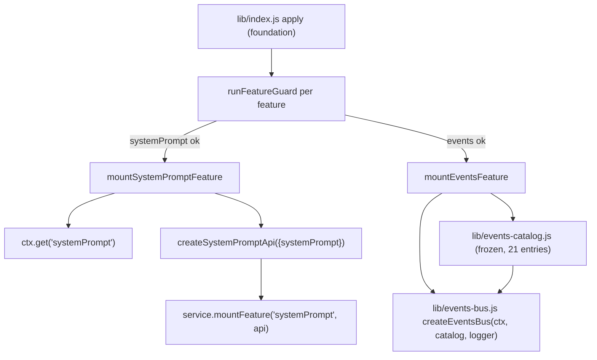

# Design: plugin-api-system-prompt-m1

> **公共契约现状注（2026-08-29 追加）**：本制品成文于目标领域树 cutover 之前，文中的公共 path 为旧命名。现行命名以 [`public-contract.registry.json`](../plugin-api-m7-public-contract-refactor/public-contract.registry.json) 的 `oldToTargetMapping` 为唯一权威，本制品涉及的映射如下：
>
> | 本制品使用的旧 path | 现行 path |
> |---|---|
> | `pluginApi.systemPrompt`（P1–P8：服务直通 / 事件目录 / 渲染直通） | `pluginApi.prompts`（叶子名不变） |
>
> 注意：slash 事件名 `system-prompt/assemble` 是协议名，**保持不变**（capability 用 dot path，事件名用 slash，互不混用）。现行契约基线：包版本 `0.1.0-rc.6-0.1.0`（runtime `0.1.0-rc.6` / `dsh.api` `0.1`）；本制品中出现的 `0.1.0-rc.6-0.x` 为历史交付边界记录，不代表现行版本。本注只更新命名与版本指针，不改动本制品已获批的 Goal / Requirements 验收边界。

## Overview

`plugin-api-system-prompt-m1` 把 feature-list §2.7 的 **P1–P8** 落地为一个 host 侧门面 feature：

- **`pluginApi.systemPrompt`**（feature 名 `systemPrompt`）：
  - P1–P5：官方 `systemPrompt` 服务五个注册/抑制方法的稳定直通；
  - P6/P7：把官方 `system-prompt/assemble`、`system-prompt/change` 纳入 `pluginApi.events` 事件目录，提供类型化订阅/派发；
  - P8：官方 `dsh-system-prompt` 公开导出的 `renderPrompt` / `renderContextSections` 渲染 helper 的稳定直通。

本 feature 全部为 A 类，不新增官方事件、不包装官方边界、不产生 B/C 类。依赖已交付的 `plugin-api-foundation`（服务、guard、版本协商）与 `plugin-api-events-m1`（事件总线契约 + 事件目录）。

---

## 源码调研结论

### 官方 `dsh-system-prompt` 服务面（`lib/index.js`、`lib/types/index.d.ts`）

- `SystemPrompt` 是 Cordis `Service`，服务名 `systemPrompt`。
- 五个注册/抑制方法签名与行号：
  - `section(section: PromptSection): () => void`（`.d.ts:187`，`index.js:186`）：非有限 `order` 抛 `TypeError`；同层重名抛错；注册/注销触发 `system-prompt/change`。
  - `context(context: PromptContext): () => void`（`.d.ts:194`，`index.js:196`）：非有限 `order` 抛 `TypeError`；同层重名抛错。
  - `suppressRuntimeContext(): () => void`（`.d.ts:201`，`index.js:206`）：多次调用相互独立。
  - `tools(provider: (context) => ToolProviderResult): () => void`（`.d.ts:209`，`index.js:216`）。
  - `variable(name, provider): () => void`（`.d.ts:218`，`index.js:227`）：`name` 必须匹配 `VARIABLE_NAME = /^[a-z][a-z0-9_]*$/`（`index.js:20`），非法名抛错；同层重名抛错。
- 这些方法全部返回“the exact Cordis effect disposer”。门面**逐字节同参转发并原样返回 disposer**，不复制官方参数校验。

### 官方事件面（`lib/index.js`）

- `system-prompt/change`（`index.js:160`）：`this.ctx.emit("system-prompt/change")`，**无 payload，非 scope-filtered**。
- `system-prompt/assemble`（`index.js:283`）：
  ```js
  const transformed = await this.ctx.waterfall(
    scopeTarget(this, scope),
    "system-prompt/assemble",
    assembly, context,
    () => Promise.resolve(assembly),
  )
  ```
  - 签名 `(assembly: PromptAssembly, context: AssembleContext, next: () => Promise<PromptAssembly>) => Promise<PromptAssembly>`；
  - **scope-filtered**：carrier 为 `scopeTarget(this, scope)`，`scope` 来自 `context.scope`；
  - 返回值为权威 assembly；官方随后对 `complete` section 与 runtime-context 抑制做后处理。
- `dsh-scope/lib/invariant.js:30` 权威表确认 scope subject：`"system-prompt/assemble": (args) => args[1]["scope"]`。

### 官方渲染导出（`dsh-system-prompt` package exports）

- `package.json` 的 `exports["."]` 公开导出 `renderPrompt` 与 `renderContextSections`（`lib/index.js:65,98`）。
- `renderPrompt(assembly)`：strict `{{variable}}` 插值、丢弃空 section、`\n\n` 拼接、非法/未知/未定义变量抛错（`lib/index.js:65`）。
- `renderContextSections(assembly)`：逐 context 插值并过滤空文本，返回 `ContextSnapshotSection[]`（`lib/index.js:98`）。
- 这两个 helper 是**纯函数导出，不是 Cordis 服务**，无法通过 `inject` 获取；门面只 import 其公开导出，不 import 任何模块私有变量（符合 AGENTS.md 第 2.3 条）。

### 门面既有实现面（本仓库 `lib/`）

- `plugin-api-service.js`：`mountFeature(name, api)` 支持 `llm/admission`、`events`、`web`；构造函数预置 disabled stub。
- `guards.js`：`runFeatureGuard(featureName, ctx, deps)` 分支化探测；feature guard 失败只禁用该 feature。
- `events-bus.js`：scope gate 当前只支持 subject 形式 `'args[0].agent'` 与 `null`（presence-only）；需要为 P6 增加 `'args[1].scope'` 解析。
- `events-catalog.js`：当前恰好 19 个事件条目；本 feature 增加 2 个条目，使 catalog 变为 21 个事件名。

---

## 钩子引出机制（本仓库必填）

| 能力 | 类型 | 引出机制 | 失败路径与 guard 策略 |
|---|---|---|---|
| P1–P5 服务直通 | A | `ctx.get('systemPrompt')` 服务方法同参转发，disposer 原样返回，不包装、不缓存、不预校验 | `systemPrompt` feature guard 失败 → 仅 `systemPrompt` 禁用并显式报错；禁用/门面 inert 时方法抛 typed error；官方方法自身抛错原样传播，门面保持 active |
| P6 `system-prompt/assemble` | A | 纳入 `pluginApi.events` catalog；facade listener 以原生 Cordis hook 注册（events-m1 既有机制），scope 过滤由 events-bus 新增的 `args[1].scope` subject 解析实现 | 同 events feature 的 scope/priority/只读/故障隔离策略；`systemPrompt` guard 失败时 `pluginApi.systemPrompt` 禁用，但事件 catalog 仍保留词汇（订阅无副作用） |
| P7 `system-prompt/change` | A | 纳入 `pluginApi.events` catalog；emit 无 payload，无 scope 过滤 | 同上 |
| P8 渲染 helper | A | `import * as dshSystemPrompt from '@deepseek-ai/dsh-system-prompt'`，公开导出 `renderPrompt`/`renderContextSections` 直通；package 缺失/导出变更由 guard probe 捕获 | 渲染 helper 缺失/变更 → `systemPrompt` feature 禁用；官方 helper 自身抛错原样传播 |

---

## Architecture



```mermaid
flowchart LR
    PLUGIN["third-party plugin"] -->|inject: ['pluginApi']| F["ctx.pluginApi"]
    F --> SP["pluginApi.systemPrompt"]
    F --> EV["pluginApi.events"]
    SP -->|section/context/variable/tools/suppressRuntimeContext| SVC2["official systemPrompt service methods"]
    SP -->|render/renderContextSections| RENDER["official renderPrompt / renderContextSections exports"]
    EV -->|on/once| BUS2["events-bus facade hooks"]
    EV -->|waterfall/emit| CTX["delegate to ctx.*"]
    BUS2 --> SCOPE["scope gate: args[0].agent | args[1].scope | carrierKeyOf(this)"]
```

---

## Components and Interfaces

### 1. `lib/events-catalog.js` — 扩展只读事件目录（修改既有纯模块）

在现有 19 个事件条目后追加 2 个条目：

| name | mode | scopeFiltered | subject | payload | args | source | type |
|---|---|---|---|---|---|---|---|
| `system-prompt/assemble` | `waterfall` | `true` | `'args[1].scope'` | `assembly {sections, contexts, tools, variables}; context {scope?, signal?}` | `(assembly, context, next)` | `P6` | `A` |
| `system-prompt/change` | `emit` | `false` | `undefined` | `'none'` | `()` | `P7` | `A` |

约束：

- catalog 保持深冻结只读；更新后恰好 21 个事件名（events-m1 的 19 个 + 本 feature 2 个）。
- `CatalogEntry.subject` 类型从 `'args[0].agent' | null | undefined` 扩展为 `'args[0].agent' | 'args[1].scope' | null | undefined`。
- 更新 `test/events-catalog.test.mjs` 的“恰好 19 个”断言为“恰好 21 个”，并增加上述两条目元数据断言。

### 2. `lib/events-bus.js` — scope gate 扩展（修改既有模块，向后兼容）

`createWrappedListener` 的 subject 解析从：

```js
const subject = meta.subject === 'args[0].agent'
  ? args[0]?.agent
  : meta.subject === null
    ? carrierKeyOf(this)
    : undefined
```

扩展为：

```js
const subject = meta.subject === 'args[0].agent'
  ? args[0]?.agent
  : meta.subject === 'args[1].scope'
    ? args[1]?.scope
    : meta.subject === null
      ? carrierKeyOf(this)
      : undefined
```

行为不变：不匹配的 waterfall facade listener 调用 `next()` 继续；非 waterfall 返回 `undefined`。这是对既有 events-bus 的向后兼容扩展（新增一个 subject 分支，不改变既有 19 个事件的行为）。更新 `test/events-bus.test.mjs` 增加 `system-prompt/assemble` 按 `args[1].scope` 过滤的用例。

### 3. `lib/system-prompt.js` — systemPrompt 门面 API（新纯模块，host 侧）

```js
import * as dshSystemPrompt from '@deepseek-ai/dsh-system-prompt'

export function createSystemPromptApi({ systemPrompt }) {
  return {
    isActive: true,
    section(section)                 { return systemPrompt.section(section) },
    context(context)                 { return systemPrompt.context(context) },
    variable(name, provider)         { return systemPrompt.variable(name, provider) },
    tools(provider)                  { return systemPrompt.tools(provider) },
    suppressRuntimeContext()         { return systemPrompt.suppressRuntimeContext() },
    render(assembly)                 { return dshSystemPrompt.renderPrompt(assembly) },
    renderContextSections(assembly)  { return dshSystemPrompt.renderContextSections(assembly) },
  }
}
```

设计决策：

- **P1–P5 不包 try/catch**：官方抛错是插件输入错误的一部分，必须原样传播（requirements §2–§6）。门面只做同参转发，因此官方方法抛错不会使门面进入坏状态。
- **P8 用公开导出而非重实现**：`renderPrompt`/`renderContextSections` 语义复杂（strict 插值、错误文案、上下文快照形状），重实现会产生漂移；官方包通过 `exports["."]` 公开这些符号，import 公开导出不违反 AGENTS.md“不 import 模块私有变量”的约束。
- 模块自身零 harness 依赖（除官方公开包外），便于 `node --test` 单测。

### 4. `lib/plugin-api-service.js` — 扩展服务面（修改既有模块）

- 新增 `createDisabledSystemPromptApi(active)`：
  - `section/context/variable/tools/suppressRuntimeContext/render/renderContextSections` 全部抛 inactive/feature-disabled typed error（先查 core inactive，再抛 `PluginApiFeatureDisabledError('systemPrompt')`）；
  - `get isActive() { return false }`（供幂等重挂载判断）。
- 构造函数新增 `this.systemPrompt = createDisabledSystemPromptApi(active)`。
- `mountFeature(name, api)` 新增可挂载名 `'systemPrompt'`：`this.systemPrompt = api`。
- 其余（`isActive`、`features`、`assertCompatible`、`reconcile`）不变。

### 5. `lib/guards.js` — 新增 `systemPrompt` feature guard（修改既有模块）

`runFeatureGuard(featureName, ctx, deps)` 增加分支：

- `systemPrompt`：
  1. probe `ctx.get('systemPrompt')` 存在且 `section`、`context`、`variable`、`tools`、`suppressRuntimeContext` 均为 function；
  2. probe `deps.dshSystemPrompt.renderPrompt` 为 function；
  3. probe `deps.dshSystemPrompt.renderContextSections` 为 function。
- 不探测官方事件源是否存在：`system-prompt/assemble|change` 是纯订阅方，事件不存在时最多收不到调用，不需要禁用 feature。requirements AC 1.2 中“`system-prompt/assemble|change` 契约缺失/变更”的检测由本 feature 的静态事件目录条目 + 纯订阅方安全兜底承载（无运行时探测，与 `plugin-api-events-m1` 对 O* 事件源的策略一致）。

### 6. `lib/index.js` — 挂载新 feature（修改既有模块）

- 顶部新增 `import * as dshSystemPrompt from '@deepseek-ai/dsh-system-prompt'`（与既有 `dshLlm` 顶层 import 模式一致）。
- `FEATURE_MOUNTERS` 增加 `['systemPrompt', mountSystemPromptFeature]`，位于 `web` 之后。
- `mountSystemPromptFeature({ ctx, service, logger })`：
  1. 幂等：`service?.systemPrompt?.isActive === true` 时返回 `() => {}`；
  2. `const systemPrompt = safeGet(ctx, 'systemPrompt')`；
  3. `const api = createSystemPromptApi({ systemPrompt })`；
  4. `service.mountFeature('systemPrompt', api)`；
  5. 返回 no-op disposer（API 只持引用，无独立资源）。
- `runFeatureGuard` 调用处传入 `{ dshLlm, dshSystemPrompt }`。
- 挂载顺序建议：`events` → `web` → `systemPrompt`（相互独立，仅为可读性）。

### 7. `package.json` — peerDependencies

新增：

```json
"@deepseek-ai/dsh-system-prompt": "^0.1.0-rc.6"
```

原因：门面 import 其公开导出 `renderPrompt`/`renderContextSections`，必须声明宿主共享实例，避免打包/嵌套实例。

---

## Data Models

```ts
// 官方 PromptSection / PromptContext / AssembleContext / PromptAssembly / ToolProviderResult
// 形状以 @deepseek-ai/dsh-system-prompt 的 lib/types/index.d.ts 为权威，门面不复制类型定义。

type SystemPromptApi = {
  readonly isActive: true
  section(section: PromptSection): () => void
  context(context: PromptContext): () => void
  variable(name: string, provider: (context: AssembleContext) => string | undefined): () => void
  tools(provider: (context: AssembleContext) => ToolProviderResult): () => void
  suppressRuntimeContext(): () => void
  render(assembly: PromptAssembly): string
  renderContextSections(assembly: PromptAssembly): ContextSnapshotSection[]
}

type CatalogSubject = 'args[0].agent' | 'args[1].scope' | null | undefined
// CatalogEntry 其余字段与 plugin-api-events-m1 相同：name/mode/scopeFiltered/subject/payload/args/source/type
```

---

## Error Handling

1. **boot fail-safe 不变**：`mountSystemPromptFeature` 任何异常由 foundation 的 mount try/catch 与 feature-registry 捕获，绝不抛穿 `apply`；`systemPrompt` 失败只禁用该 feature，门面保持 active。
2. **feature 禁用/inert**：`pluginApi.systemPrompt` stub 方法先抛 `PluginApiInactiveError`，再抛 `PluginApiFeatureDisabledError('systemPrompt')`，且抛错前不触碰官方服务（与 foundation 规则一致）。
3. **P1–P5 官方错误原样传播**：重名 section/context/variable、非有限 `order`、非法变量名、保留工具名等官方抛错不做包装；调用插件自担输入正确性。
4. **P6/P7 事件总线契约**：priority、只读 payload、scope 过滤、listener 故障隔离全部继承 `plugin-api-events-m1`；`system-prompt/assemble` 不匹配 scope 的 waterfall listener 调用 `next()` 继续，绝不 veto 官方链。
5. **P8 官方错误原样传播**：非法 assembly、未知/未定义变量、malformed 引用等 `renderPrompt`/`renderContextSections` 抛错原样返回，不预校验、不缓存。
6. **渲染 helper 缺失/变更**：guard probe 失败 → 写 guard log → 只禁用 `systemPrompt`；不会因公开导出缺失导致 `apply` 抛错。
7. **catalog 扩展**：纯静态数据，无运行时失败路径；深冻结由既有 catalog 机制保证。

---

## Testing Strategy

运行器 `node --test`；纯模块零 harness 依赖；集成测试用 mock Cordis context。

- `test/system-prompt-api.test.mjs`：
  - P1–P5：mock `systemPrompt` 服务，断言每个方法同参转发、返回官方 disposer、调用官方 disposer 生效；官方抛错（如 `section` 非有限 order）原样传播。
  - P8：用官方真实 `renderPrompt`/`renderContextSections` 的结果与 `createSystemPromptApi` 输出比对（纯函数直通）；官方抛错传播。
- `test/system-prompt-guard.test.mjs`：`runFeatureGuard('systemPrompt')` probe 矩阵——缺服务方法、缺 `renderPrompt`、缺 `renderContextSections` 分别禁用；完整时通过。
- `test/events-catalog.test.mjs`（更新）：恰好 21 个事件名；`system-prompt/assemble` 的 mode/scopeFiltered/subject/payload/args/source/type；`system-prompt/change` 的 mode/scopeFiltered/payload/source/type。
- `test/events-bus.test.mjs`（更新）：新增 `system-prompt/assemble` 的 `args[1].scope` 过滤用例——`opts.scope` 匹配时收到、不匹配时 waterfall 继续 `next()`；非 scope-filtered `system-prompt/change` 忽略 `opts.scope`。
- `test/plugin-api-service-system-prompt.test.mjs`：disabled stub 抛 typed error；`mountFeature('systemPrompt')` 后可调；未知名 mount 仍拒绝。
- `test/index-system-prompt.test.mjs`：apply 挂载 `systemPrompt` 的 mock 集成——guard 失败时门面仍 active 且只禁用 `systemPrompt`；apply 永不 throw。
- 回归：既有全部测试（foundation、facade-integrity、llm-image-admission、events-m1）保持通过。

---

## Requirements coverage matrix

| Requirements 章节 | 设计落点 |
|---|---|
| 1. Namespace availability and fail-safe activation | Components 4/5/6；Error Handling 1/2 |
| 2. Prompt section registration (P1) | Components 3；Error Handling 3 |
| 3. Dynamic context registration (P2) | Components 3；Error Handling 3 |
| 4. Prompt variable registration (P3) | Components 3；Error Handling 3 |
| 5. Tool schema provider registration (P4) | Components 3；Error Handling 3 |
| 6. Runtime context suppression (P5) | Components 3；Error Handling 3 |
| 7. Typed `system-prompt/assemble` waterfall (P6) | Components 1/2/3/6；Error Handling 4 |
| 8. Typed `system-prompt/change` notification (P7) | Components 1/6；Error Handling 4 |
| 9. Render helpers (P8) | Components 3/6/7；Error Handling 5/6 |
| 10. Testability and regression coverage | Testing Strategy |

---

## Documentation synchronization (AGENTS.md anti-staleness)

1. WHEN 本 feature 的 Stage 4 全部任务完成并验收，THEN 必须同步更新仓库根 `AGENTS.md` 与 `.worktrees/m1-system-prompt/AGENTS.md`：追加 `plugin-api-system-prompt-m1` 条目（范围 P1–P8、状态 delivered、spec 目录 `docs/specs/plugin-api-system-prompt-m1/`、关键设计约束：service 直通 + 官方 render 导出直通 + events catalog 扩展 + `@deepseek-ai/dsh-system-prompt` peerDependency）。
2. WHEN 交付完成，THEN 必须同步更新 `docs/specs/plugin-api-features/feature-list.md` §2.7 中 P1–P8 状态为 `delivered`。
3. WHEN 本 feature 的公开 API 形状或里程碑状态变化，THEN 必须同步更新上述两处，防止文档过期。
4. 本义务是用户显式要求的治理约束；Stage 3 tasks 中将安排明确任务执行同步（作为 SKILL 中“tasks 不含文档任务”的例外，按用户指示优先执行）。
