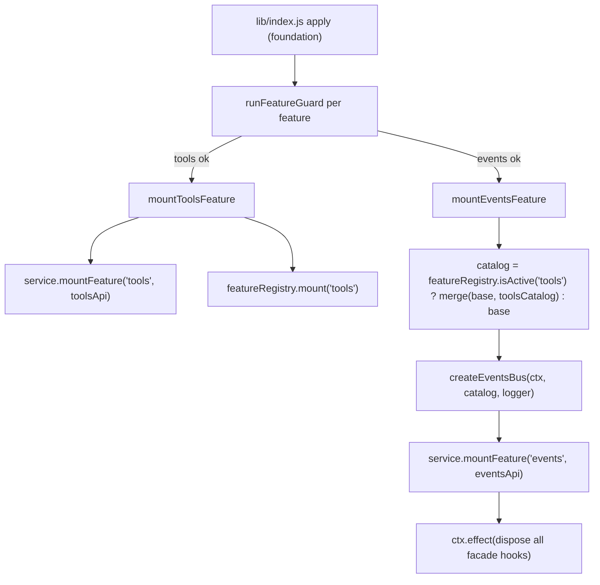

# Design: plugin-api-tools-m1

## Overview

`plugin-api-tools-m1` 把 feature-list §2.6 的 **T1–T9** 落地为一个 host 侧门面 feature（feature 名 `tools`）：

1. **`pluginApi.tools` 服务直通**：`register`（T1）、`restrict`/`guard`（T8）、`get`/`schemas`/`execute`/`presentAs`（T9）。全部为 A 类稳定直通：调用官方 `tools` 服务同名方法，参数与返回值原样透传，不包装、不缓存、不重排。
2. **六个 `tools/*` 事件稳定化**（T2–T7）：通过已交付的 `pluginApi.events` 总线暴露，并把六个事件纳入 `pluginApi.events.catalog`。门面不新增官方事件、不重排官方管线，只提供类型化订阅、只读 payload、priority、scope 过滤与故障隔离。

依赖：`plugin-api-foundation`（服务、guard、版本协商）、`plugin-api-facade-integrity`（门面完整性；本 feature 不包装官方边界，不新增包装链）、`plugin-api-events-m1`（事件总线契约与 catalog 机制）。

---

## 源码调研结论

### `dsh-tools` 服务与公共方法（`@deepseek-ai/dsh-tools/lib/index.js`、`lib/types/index.d.ts`）

- `ToolRuntime extends Service`，`super(ctx, "tools")`（L2585），`static inject = ["systemPrompt"]`（L2547）。第三方插件通过 `inject: ['tools']` 消费官方服务；本门面通过 `ctx.get('tools')` 读取并直通。
- 公共方法（本 spec 使用）：
  - `register(definition)`（L2755）：校验 `definition.output`、`timeoutMs`、保留名 `run_code` 后调用 `this.layers.effect(...)`，返回官方 disposer。
  - `restrict(filter)`（L2772）：**要求 scoped context**（`scopeOf(ctx)` 非空，否则抛错）；空 filter、未知名、保留名 `run_code` 抛错；返回 disposer。
  - `guard(guard)`（L2798）：注册单调守卫；返回 disposer。
  - `get(name, scope?)`（L2872）：按 scope 解析可见工具，返回 `ToolDefinition | undefined`。
  - `schemas(scope?)`（L2900）：返回 `ToolSchema[]`（仅 name/description/parameters，不含执行回调与 `timeoutMs`）。
  - `presentAs(mode)`（L2685）：**要求 scoped context**；一个 scope 只能声明一次；返回恢复默认模式的 disposer。
  - `execute(exec)`（L2992）：完整执行管线，返回 `Promise<ToolExecutionResult>`。
- 门面策略：这些方法**原样透传**；官方对 `restrict`/`presentAs` 的 scoped-context 限制、对 `register` 的校验抛错均保持不变，门面不预校验、不吞错。

### `tools/*` 官方事件 dispatch 点（`@deepseek-ai/dsh-tools/lib/index.js`）

- `tools/change`（L2571–2573）：`ScopedLayers` 的变更回调执行 `this.ctx.emit("tools/change")`，**无参数、无 scope carrier**；官方注释明确这是 deliberately unfiltered 的 registry-subject 通知。
- `tools/code-dispatch-log`（L2951–2957）：`ctx.waterfall(scopeTarget(this, dispatch.agent), "tools/code-dispatch-log", dispatch, () => Promise.resolve(dispatch.content))`；单个 listener 抛错时官方已包含（fallback 到原始 content）。
- `tools/pre-execute`（L3096–3098）：`ctx.waterfall(scopeTarget(this, exec.agent), "tools/pre-execute", exec, () => Promise.resolve({ kind: "allow" }))`。`ask` 决策由官方 `serviceAsk`（L3296–3346）经 `ctx.get('approval')` 解析：`allowed-once`→allow，其余→deny；无 approval seam 或 agent-less 时降级 deny。
- `tools/execute`（L3191–3195）：`ctx.waterfall(scopeTarget(this, exec.agent), "tools/execute", mutableExec, () => this.dispatchToolBody(mutableExec))`。`dispatchToolBody`（L3158–3182）把 `exec.signal` 视为 wrapper 可变字段：捕获 `wrapperSignal = exec.signal`，与 caller signal 融合后临时写回 `exec.signal`，body 结束再恢复。**官方 contract：wrappers 只允许原地替换 `exec.signal`，call identity 不可变。**
- `tools/result`（L3266–3284）：`notifyResult` 先 `Object.freeze(exec)`，再手动 `ctx.events.dispatch("emit", [scopeTarget(this, exec.agent), "tools/result", exec, result])`，并逐个包含监听器错误。`result` 是官方 deep-frozen 快照（成功结果由 `materializeFinalResult` L3458–3465 深冻结）。
- `tools/post-execute`（L3359–3388）：`ctx.waterfall(scopeTarget(this, exec.agent), "tools/post-execute", exec, result, () => Promise.resolve({ kind: "accept" }))`；官方应用 `accept`（可替换 `content` 或 `value`，二者互斥）与 `block`（feedback 变为 isError 结果）。

### 官方管线顺序（feature-list §2.6 已确认）

`tools/pre-execute` → 单调 `guard()` 检查 → `tools/execute` → `tools/post-execute` → 工具 `finalizeContent` → `tools/result`。`timeoutMs` 由 `dsh-tool-call-timeout-policy`（`tools/execute` wrapper）执行，门面不复制。

### Cordis waterfall 语义（`@deepseek-ai/cordis/lib/index.js` L317–324）

`waterfall` 把最后一个实参视为 innermost `next`；每个监听器收到**同一组原始实参**；监听器返回值是整条链的最终结果，**不会**传给后续监听器。因此 `tools/execute` 的 signal 替换只能通过原地修改共享 `exec` 对象完成，与官方 contract 一致。

### scope-filtered 权威表（`@deepseek-ai/dsh-scope/lib/invariant.js`）

- `tools/pre-execute`、`tools/execute`、`tools/post-execute`、`tools/result`、`tools/code-dispatch-log` 均在表中，subject = `args[0].agent`。
- `tools/change` **不在**表中 → 非 scope-filtered，全局可见。

---

## 钩子引出机制（本仓库必填）

| 能力 | 类型 | 引出机制 | 失败路径与 guard 策略 |
|---|---|---|---|
| `pluginApi.tools` 服务面（T1/T8/T9） | A | `ctx.get('tools')` 同名方法直通；`service.mountFeature('tools', toolsApi)` | `tools` feature guard 失败 → 仅 `tools` 禁用并显式报错；禁用/门面 inert 时方法抛 typed error；官方方法自身抛错原样透传 |
| `tools/change`（T2） | A | 纳入 catalog（`emit`、`scopeFiltered:false`、无 payload）；facade listener 以原生 Cordis hook 参与官方 `ctx.emit` | 事件源由官方维护；门面不探测、不补偿 |
| `tools/pre-execute`（T3） | A | 纳入 catalog（`waterfall`、scope-filtered）；facade listener 以原生 Cordis hook 参与官方 waterfall；gate 决策由官方处理 | 同上；facade 不实现 `ask` 审批路由 |
| `tools/execute`（T4） | A | 纳入 catalog（`waterfall`、scope-filtered、`freeze: 'except-signal'`）；facade wrapper 对 `exec` 做 **除 `signal` 外的深冻结**，保留官方 wrapper 原地替换 `exec.signal` 的能力 | `deepFreezeExceptSignal` 永不 throw；descriptor 加固失败时降级为只冻结嵌套值，dispatch 继续 |
| `tools/post-execute`（T5） | A | 纳入 catalog（`waterfall`、scope-filtered）；accept/block 决策由官方应用 | 门面不实现决策；事件源由官方维护 |
| `tools/result`（T6） | A | 纳入 catalog（`emit`、scope-filtered）；官方已 freeze/contain，门面 freeze 幂等并复用总线 containment | 门面 containment 与官方 containment 叠加，不影响结果 |
| `tools/code-dispatch-log`（T7） | A | 纳入 catalog（`waterfall`、scope-filtered）；content 替换由官方 waterfall 返回值决定 | 门面不编辑 content；事件源由官方维护 |
| tools 事件 catalog 扩展 | 门面基础 | `tools` feature 成功挂载后，`events` 挂载时合并 base catalog 与 tools catalog | 合并逻辑为纯函数，失败即 fallback base catalog |

---

## Architecture



> `FEATURE_MOUNTERS` 的挂载顺序调整为 **`tools` 在 `events` 之前**，确保 `mountEventsFeature` 能依据 `featureRegistry.isActive('tools')` 决定是否把 6 个 `tools/*` 事件合并进 catalog。`web` 与 `llm/admission` 顺序不变。

```mermaid
flowchart LR
    PLUGIN["third-party plugin"] -->|inject: ['pluginApi']| API["ctx.pluginApi"]
    API --> TOOLS["pluginApi.tools"]
    API --> EVENTS["pluginApi.events"]
    TOOLS -->|register/restrict/guard/get/schemas/execute/presentAs| OFFICIAL["ctx.get('tools') 同名方法"]
    EVENTS -->|on/once| BUS2["events-bus ordered entries + native hooks"]
    EVENTS -->|emit/serial/parallel/bail/waterfall| CTX["delegate to ctx.*"]
    EVENTS --> CATALOG["events.catalog（base 19 + tools 6 when active）"]
```

---

## Components and Interfaces

### 1. `lib/tools-events-catalog.js` — 六个 tools 事件目录（新纯模块）

零 harness 依赖。导出 `toolsEventsCatalog`（深冻结对象）与 `toolsCatalogEntryOf(name)`。条目如下：

| name | mode | scopeFiltered | subject | freeze | 实参（listener 收到） | payload 说明 |
|---|---|---|---|---|---|---|
| `tools/change` | emit | false | — | all | `()` | 无 payload（官方 unfiltered registry-subject 通知） |
| `tools/pre-execute` | waterfall | true | `args[0].agent` | all | `(exec, next)` | `exec`；返回 `PreToolDecision`：`{kind:'allow'}` / `{kind:'deny', reason}` / `{kind:'ask', reason?}` |
| `tools/execute` | waterfall | true | `args[0].agent` | **except-signal** | `(exec, next)` | `exec`；官方 contract：仅 `exec.signal` 可原地替换 |
| `tools/post-execute` | waterfall | true | `args[0].agent` | all | `(exec, result, next)` | `exec` + read-only `result`；返回 `PostToolDecision`：`{kind:'accept', content?|value?}` / `{kind:'block', feedback}` |
| `tools/result` | emit | true | `args[0].agent` | all | `(exec, result)` | `exec` 与 `result` 均为官方冻结快照；observe-only |
| `tools/code-dispatch-log` | waterfall | true | `args[0].agent` | all | `(dispatch, next)` | `dispatch {exec, agent?, subCallId, name, isError, content}`；返回替换 `ContentBlock[]` |

每个 entry 含 `source`（`T2`–`T7`）、`type`（`A`）；整体深冻结。`freeze` 字段为本 spec 新增的 catalog 元数据（默认 `all`，仅 `tools/execute` 为 `except-signal`）。

### 2. `lib/events-catalog.js` — catalog 合并 helper

- 保留现有 `eventsCatalog`（base 19 事件）与 `catalogEntryOf` 不变，保证 `plugin-api-events-m1` 既有契约与测试在 tools 未激活时不回归。
- 新增纯函数 `mergeEventCatalogs(...catalogs)`：浅合并多个 catalog 后深冻结返回。**任何异常都捕获并返回 `eventsCatalog`**（调用方无需处理失败）。

### 3. `lib/deep-freeze.js` — 新增 `deepFreezeExceptSignal`

```js
deepFreeze(value, seen?)          // 现有：全部深冻结，永不 throw
deepFreezeExceptSignal(value)     // 新增：除顶层 signal 外深冻结，永不 throw
```

`deepFreezeExceptSignal(value)` 语义：

1. `value` 非对象时原样返回。
2. 对 `value` 的每个自有属性：
   - 若 key 为 `signal`：跳过（值不冻结，属性保持可写）。
   - 否则：递归 `deepFreeze(value[key])`，并尝试把该属性定义为 `writable: false, configurable: false`。
3. 对 `value` 调用 `Object.preventExtensions`（signal 仍可写，只是不能新增属性）。
4. 任一步抛错（exotic object、不可配置属性等）都捕获并继续，绝不让 freeze 成为 dispatch 失败点。

该函数只用于 catalog 中标为 `freeze: 'except-signal'` 的事件（当前仅 `tools/execute`）。

### 4. `lib/events-bus.js` — 使用动态 catalog 与 freeze 策略

- 把 `catalogEntryOf` 从静态 import 改为基于传入 `catalog` 的本地函数：`const catalogEntryOf = (name) => catalog[name]`。`createEventsBus({ ctx, catalog, logger })` 的行为其余不变。
- `wrapped` 中 freeze 步骤改为：
  - `meta.freeze === 'except-signal'` → 对每个实参调用 `deepFreezeExceptSignal`；
  - 否则 → 对每个实参调用 `deepFreeze`。
- 对 `tools/execute`，facade listener 收到的是**同一个** `exec` 对象，`exec.signal` 可写；listener 原地替换 `exec.signal` 后调用 `next()`，官方 `dispatchToolBody` 会按官方语义融合 caller signal、执行 body、并在结束后恢复 wrapper signal。facade wrapper 不复制、不替换、不恢复 signal。
- 其余事件维持既有 freeze/contain/scope gate 逻辑不变。

### 5. `lib/plugin-api-service.js` — 扩展服务面

- 新增 `createToolsApi(tools)`：返回 host 侧 tools API 对象，方法全部委托给传入的 `tools`（一个 Cordis traceable 官方服务代理）：`register`/`restrict`/`guard`/`get`/`schemas`/`execute`/`presentAs`，并带 `isActive: true`。
- 新增 `createDisabledToolsApi(active)`：方法抛 `PluginApiInactiveError` 或 `PluginApiFeatureDisabledError('tools')`，不触碰官方服务。
- 构造函数：
  - 保存 `this._toolsMounted = false` 与 `this._toolsDisabled = createDisabledToolsApi(active)`。
  - 用 `Object.defineProperty` 定义只读 accessor `tools`：
    ```js
    get tools() {
      if (!this._toolsMounted) return this._toolsDisabled
      return createToolsApi(this.ctx.get('tools'))
    }
    ```
    关键点：当第三方插件经 `ctx.pluginApi.tools` 访问时，Cordis traceable proxy 会把 getter 的 `this` 绑定到调用方 shadow context，因此 `this.ctx` 是**调用方上下文**；`this.ctx.get('tools')` 返回绑定到调用方 scope 的官方 tools traceable proxy。这样 `register`/`restrict`/`guard`/`presentAs` 等 scope-aware 方法保留官方 scope 语义（`restrict`/`presentAs` 在 agent scope 调用不再误抛 scoped-context 错误；`register`/`guard` 在 agent scope 调用注册到对应 scope）。
- `mountFeature(name, api)` 增加可挂载名 `tools`：设置 `this._toolsMounted = true`（`api` 仅作为 mount 成功的标记）。
- 其余（`isActive`、`features`、`assertCompatible`、`reconcile`）不变。

### 6. `lib/guards.js` — 新增 tools feature guard

`runFeatureGuard(featureName, ctx, deps)` 增加 `tools` 分支，probe：

- `ctx.get('tools')` 存在；
- 以下方法均为 function：`register`、`restrict`、`guard`、`get`、`schemas`、`execute`、`presentAs`。

不探测任何 `tools/*` 事件源（门面是纯订阅方，官方事件不存在时最多收不到调用，不因此禁用门面）。

### 7. `lib/index.js` — 挂载新 feature 与挂载顺序

新增 `mountToolsFeature`：

- 幂等：`service?.tools?.isActive === true` 时返回 no-op。
- 调用 `service.mountFeature('tools', { isActive: true })` 标记 `tools` feature 已挂载；实际 `pluginApi.tools` accessor 在**每次访问时**通过调用方 `ctx` 重新解析官方 `tools` 服务（见 Components 5），**不在 mount 时捕获 root 服务引用**，以保留 `register`/`restrict`/`guard`/`presentAs` 的调用方 scope 语义。
- 返回 no-op disposer（无门面自有资源）。
- `featureRegistry.mount('tools')` 由 foundation 既有 apply 循环在 `ctx.effect` 注册成功后执行（`lib/index.js` 中 `featureRegistry.mount(featureName)`）；由于 `FEATURE_MOUNTERS` 中 `tools` 先于 `events`，`mountEventsFeature` 运行时 `featureRegistry.isActive('tools')` 已为 `true`。

`mountEventsFeature` 更新：

- 解构 `featureRegistry`；
- 构造 `catalog = featureRegistry.isActive('tools') ? mergeEventCatalogs(eventsCatalog, toolsEventsCatalog) : eventsCatalog`；
- `createEventsBus({ ctx, catalog, logger })`。

`FEATURE_MOUNTERS` 顺序更新为：`tools` → `events` → `web` → `llm/admission`。

### 8. `package.json` — 无新增依赖

本 feature 不引入新的运行时依赖；`@deepseek-ai/dsh-scope` 已作为 `plugin-api-events-m1` 的 peerDependency 存在。官方 `tools` 服务通过 `ctx.get` 消费，不 import 私有变量。

---

## Data Models

```ts
type FreezePolicy = 'all' | 'except-signal'  // 新增 catalog 元数据，默认 'all'

type CatalogEntry = {
  name: string
  mode: 'on' | 'emit' | 'serial' | 'parallel' | 'bail' | 'waterfall'
  scopeFiltered: boolean
  subject: 'args[0].agent' | null | undefined
  freeze?: FreezePolicy
  payload: string
  args: string
  source: string
  type: 'A' | 'B'
}

type ToolsApi = {
  isActive: true
  register(definition: ToolDefinition): () => void
  restrict(filter: ToolRestriction): () => void
  guard(guard: ToolGuard): () => void
  get(name: string, scope?: ScopeKey): ToolDefinition | undefined
  schemas(scope?: ScopeKey): ToolSchema[]
  execute(input: ToolExecutionInput): Promise<ToolExecutionResult>
  presentAs(mode: ToolPresentationMode): () => void
}
```

其中 `ToolDefinition`、`ToolRestriction`、`ToolGuard`、`ToolExecutionInput`、`ToolExecutionResult`、`ToolPresentationMode` 引用官方 `@deepseek-ai/dsh-tools` 类型；`ScopeKey` 引用官方 `@deepseek-ai/dsh-scope` 类型；`ToolSchema` 引用官方 `@deepseek-ai/dsh-llm` 类型（门面不重新定义类型，只做运行时直通）。

---

## Error Handling

1. **boot fail-safe 不变**：`mountToolsFeature` 任何异常由 foundation 的 mount try/catch 与 feature-registry 捕获，绝不抛穿 `apply`；`tools` 失败只禁用 `tools`，门面保持 active。
2. **feature 禁用/inert**：`pluginApi.tools` stub 方法先抛 `PluginApiInactiveError` 或 `PluginApiFeatureDisabledError('tools')`，且抛错前不触碰官方 `tools` 服务。
3. **官方方法错误原样透传**：`register` 的校验错误、`restrict`/`presentAs` 的 scoped-context 错误、`execute` 的官方错误等均不被门面吞掉或改写；门面只保证“调用前 feature 是 active 的”。
4. **`tools/execute` 选择性冻结**：`deepFreezeExceptSignal` 永不 throw；descriptor 加固失败时降级为只冻结嵌套值（不阻止 dispatch），此时门面依赖官方类型约束与 `dsh-scope` invariant 兜底。
5. **tools 事件故障隔离**：T2–T7 全部复用 `plugin-api-events-m1` 的 listener containment 契约；`tools/result` 与 `tools/code-dispatch-log` 官方已包含，门面 containment 叠加后不改变官方结果。
6. **catalog 合并失败**：`mergeEventCatalogs` 任何异常返回 base catalog（不含 tools 事件），并记录诊断；事件总线仍可用。
7. **events feature 禁用但 tools active**：`pluginApi.tools` 方法仍可用；`pluginApi.events.*` 抛 events-disabled typed error，tools 事件订阅自然不可用。
8. **tools feature 禁用**：`pluginApi.events.catalog` 退回 base 19 事件（`featureRegistry.isActive('tools')` 为 false），不包含 tools 事件。

---

## Testing Strategy

运行器 `node --test`；纯模块零 harness 依赖；集成测试用 mock Cordis context（实现 dispatch 语义）与 mock `ctx.get('tools')` 服务。

- `test/tools-events-catalog.test.mjs`：`toolsEventsCatalog` 恰好 6 个事件名；每个 entry 的 mode/scopeFiltered/subject/freeze/source/type 与上表一致；整个 catalog 深冻结。
- `test/deep-freeze.test.mjs`（扩展）：`deepFreezeExceptSignal` 下 `exec.signal` 保持可写、非 signal 顶层属性不可写、嵌套对象深冻结、对象不可扩展；重复调用幂等；AbortSignal/exotic 对象不抛。
- `test/events-bus.test.mjs`（扩展）：`tools/execute` 走 `except-signal` freeze 策略；listener 原地替换 `exec.signal` 后 mock 官方链观察到替换；其余 tools 事件 payload 全冻结；scope-filtered tools 事件按 `args[0].agent` 过滤。
- `test/guards.test.mjs`（扩展）或新增 `test/tools-guard.test.mjs`：`runFeatureGuard('tools')` 的 probe 矩阵——服务缺失、单个方法缺失、全部存在。
- `test/plugin-api-service-tools.test.mjs`（新）：disabled `pluginApi.tools` stub 抛 inactive/feature-disabled typed error；`mountFeature('tools', api)` 生效；accessor 返回 active API；`createToolsApi` 对 `register/restrict/guard/get/schemas/execute/presentAs` 的 mock 直通——参数与返回值原样透传、官方方法抛错原样传播；未知名 `mountFeature` 仍拒绝。
- `test/index-tools.test.mjs`（新）：apply 集成——tools active 时 `pluginApi.events.catalog` 包含 base+6 tools 事件；tools guard 失败时 catalog 仅 base 19 且 `pluginApi.tools` 抛 typed error；重复 apply 幂等（`mountToolsFeature` 不重复 mount）；apply 永不 throw。
- 回归：既有全部测试（foundation、facade-integrity、llm-image-admission、events-m1）保持通过。

---

## Requirements coverage matrix

| Requirements 章节 | 设计落点 |
|---|---|
| 1. `pluginApi.tools` service surface and fail-safe | Components 5/6/7；Error Handling 1/2 |
| 2. Tool registration (T1) | Components 7 `toolsApi.register`；Error Handling 3 |
| 3. Tool change notification (T2) | Components 1 catalog 行 1；Components 4 |
| 4. Pre-execute gate waterfall (T3) | Components 1 catalog 行 2；源码调研 pre-execute；官方处理 ask |
| 5. Execute around-waterfall (T4) | Components 1 catalog 行 3；Components 3/4 `except-signal` |
| 6. Post-execute decision waterfall (T5) | Components 1 catalog 行 4；官方 postExecute 应用决策 |
| 7. Tool result notification (T6) | Components 1 catalog 行 5；官方 notifyResult + 总线 containment |
| 8. Code dispatch log waterfall (T7) | Components 1 catalog 行 6；官方 shapeDispatchLog |
| 9. Tool restriction and guard passthrough (T8) | Components 7 `toolsApi.restrict/guard`；Error Handling 3 |
| 10. Tool query and execution passthrough (T9) | Components 7 `toolsApi.get/schemas/execute/presentAs`；Error Handling 3 |
| 11. Tools event catalog extension | Components 1/2/7；Architecture 挂载顺序 |
| 12. Testability and regression coverage | Testing Strategy |

---

## Documentation synchronization (AGENTS.md anti-staleness)

1. WHEN `plugin-api-tools-m1` 的 Stage 4 全部任务完成并验收，THEN 必须同步更新仓库根 `AGENTS.md`：追加本 feature 条目（feature 名 `plugin-api-tools-m1`、范围 T1–T9、状态 delivered、spec 目录 `docs/specs/plugin-api-tools-m1/`、关键设计约束：`pluginApi.tools` 服务直通 / 6 个 tools 事件 catalog / `tools/execute` 的 `except-signal` 冻结策略 / 挂载顺序 `tools` 先于 `events`）。
2. WHEN 未来任何新 feature 在 Stage 4 实现交付，THEN 必须在 `AGENTS.md` 中追加对应条目（feature 名、范围、状态、spec 目录、关键约束），以保持文档与实际代码同步，禁止只写代码不更新 `AGENTS.md`。
3. WHEN 一个 feature 的公开 API 形状或里程碑状态发生变化，THEN 必须同步更新 `AGENTS.md` 与 `docs/specs/plugin-api-features/feature-list.md` 中的对应条目，避免文档过期过时。
4. 本义务是用户显式要求的治理约束；Stage 3 tasks 中将安排一个明确任务执行本 feature 的 `AGENTS.md` 同步（该任务属于本仓库治理文档维护，作为 SKILL 中“tasks 不含文档任务”的例外，按用户指示优先执行）。
