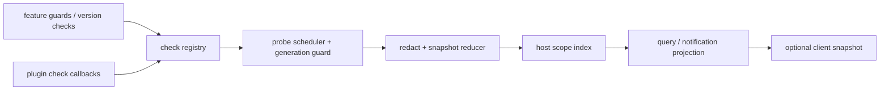

# Stage 2 - Design

## Status

Stage 2 Design 已获用户批准（M6 Wave A），进入 Stage 3 Tasks。

## Overview

`plugin-diagnostics` 是 B 类 facade projection。插件通过受控 source registration 声明检查，host 运行/接收检查结果并维护冻结快照；消费者按 `boot`、`host`、`client` 或 `plugin` 查询或订阅。诊断不会执行 repair、reload、retry、profile mutation 或其他 policy/mutation。

health 与 availability 是不同字段：health 表示检查结果，availability 表示能力是否可调用。检查 scope 是观察分类，不是 `session/workspace/profile` durable storage scope。

## Architecture



### Source and hook classification

| Area | Mechanism | Classification |
|---|---|---|
| existing feature guard、版本协商、公开 service availability | 直接读取现有公开状态/事件 | B facade |
| plugin check registration、异步 probe、snapshot coalescing | facade 内部 reducer 模拟 | B facade projection |
| official loader health API not currently exposed | 仅记录为 source unavailable/upstream limitation | C proposal if needed |
| replacement、boot/framework dispatch | 不采用 | 无 R；不改变官方 loader |

Host owns checks and snapshots. Client may contribute a client-scope check through the existing supported publication path, but cannot register host checks or mutate host status.

## Components and Interfaces

### 1. Check registry

Conceptual host interface:

```js
const dispose = pluginApi.diagnostics.register({
  ownerId, checkId, scope: 'boot' | 'host' | 'client' | 'plugin',
  dependencies, retry: { declared: false },
  run({ signal, generation }) { ... }
})
pluginApi.diagnostics.get({ scope, ownerId?, audience? })
pluginApi.diagnostics.onChange({ scope, ownerId? }, listener)
```

Registration is source declaration, not a policy registry. Duplicate `(ownerId, checkId)` replaces only the prior generation of that owner according to deterministic latest-wins semantics; another owner's check is never disposed. Returned disposers are idempotent and identity-bound.

### 2. Probe and snapshot reducer

The reducer validates a bounded result vocabulary, records first/last observed timestamps, and coalesces equivalent updates in one update window. An invalid result becomes a failed/unavailable check, not a registry-wide failure. Remediation metadata is declarative (`actionId`, prerequisite, manual/informational) and never invoked by this feature.

### 3. Scope index and notification bus

The index stores check snapshots by diagnostic scope and owner. Query filters by scope before projection. Notification payload contains one immutable snapshot (or stable snapshot reference) plus an observer epoch; the epoch is delivery metadata and is never merged into the committed check snapshot (the same snapshot may carry different epochs for different observers). Equivalent signals are coalesced; listener errors are contained and do not stop other listeners.

### 4. Client publication

If an existing remote/slot publication is available, host sends a versioned redacted snapshot and change notifications. A client-side check may report only its own client availability. Missing/incompatible publication yields explicit client unavailable state while host diagnostics remain active. No new client reconnect or UI component is designed here.

## Data Models

```ts
type DiagnosticSnapshot = Readonly<{
  scope: 'boot' | 'host' | 'client' | 'plugin'
  ownerId: string
  checkId: string
  health: 'healthy' | 'degraded' | 'failed' | 'pending' | 'unknown'
  availability: 'active' | 'degraded-active' | 'inactive' | 'unavailable' | 'unknown'
  severity: 'info' | 'warning' | 'error' | 'critical'
  blocking: 'blocking' | 'non-blocking' | 'unknown'
  generation: string
  firstObservedAt?: string
  lastUpdatedAt?: string
  dependencies: ReadonlyArray<Readonly<{ id: string; status: string; evidence?: unknown }>>
  evidence?: Readonly<{ package?: string; version?: string; runtime?: string; capability?: string }>
  reason?: Readonly<{ code: string; category?: string; boundedDetail?: string }>
  remediation?: Readonly<{ actionId: string; prerequisite?: string; mode: 'manual' | 'informational' }>
  uncertainty: 'observed' | 'inferred' | 'unavailable'
}>

// 词汇注（对齐 PD-4/PD-7/PD-8）：health 的 `unknown` 与 availability 的 `unknown` 表示“无法判定”，
// 对应 PD-7 失效兜底与 PD-8 取消/过时 provenance，绝不输出健康的错误声明；
// availability 的 `degraded-active` 依 PD-4 declared vocabulary 纳入。

type ChangeNotification = Readonly<{
  snapshot: DiagnosticSnapshot
  observerEpoch: string
}>
// observer epoch 是通知/重建投递侧的元数据，不属于已提交的 check 快照本身：
// 同一份已提交快照可被不同 observer 持有并在各自投递载体上携带不同 epoch。
```

Secrets, full environment dumps, raw payloads, stacks and arbitrary file contents are excluded before snapshots are frozen. Empty scope queries return explicit `unknown`/empty, never healthy.

## Concurrency, Cancellation, and Ownership

- Each registration owns an opaque generation and optional probe AbortController. Disposal aborts future work where possible, then prevents publication; cancellation is provenance, not a healthy result.
- Async probe results require owner id, generation and observer epoch match. Stale results may be retained as redacted evidence but cannot overwrite current status or call a newer disposer.
- Probes are `parallel` across independent checks; updates for one `(ownerId, checkId)` are `latest-wins`. Automatic retry is forbidden unless the check explicitly declares the operation idempotent/retryable; undeclared defaults to no retry.
- Snapshot observers have idempotent disposers that remove only their own listener.

## Visibility and Redaction

Default model/tool projection omits internal diagnostic details, UI omits secrets, and logs contain bounded summaries. Non-secret fields can be enabled by an explicit audience policy and preserve owner, source, time and uncertainty. Credentials, tokens, authorization headers, prompt/tool content and unclassifiable values are redacted before snapshot, notification, log or client publication. Redaction failure publishes a redacted/unavailable result.

## Error Handling and Fail-Safe

Registration validation, probe throws/rejections/timeouts, reducer errors, redaction errors and notification listener failures are contained to the affected check/consumer. If the diagnostics service cannot initialize, `apply` returns normally and the feature is inert, with an existing fail-safe diagnostic. Diagnostics never changes execution outcomes, usage entries, MCP generations or other feature state. Repair/retry/unload requests are rejected as out of contract.

## Testing Strategy

Focused tests SHALL cover:

1. stable registration ownership, duplicate owner replacement, cross-owner isolation, idempotent disposer and late callback behavior;
2. all health/availability/severity/blocking combinations, dependency/version evidence, empty scopes and bounded remediation metadata;
3. notification coalescing, observer epoch rebuild, cancellation, stale probe results, declared-vs-undeclared retry and listener isolation;
4. nested secret redaction, raw payload/stack exclusion, redaction failure and audience-specific projections;
5. service initialization/apply failure remaining inert and preserving unrelated feature state;
6. optional client publication, client-scope evidence and incompatible publication degradation.

Tests use local fixtures for guards and services; they do not claim production health or automatic repair semantics.

## Requirements Coverage

| Requirement | Design coverage |
|---|---|
| PD-1 | owner-bound registry, duplicate generation and disposer rules |
| PD-2 | immutable structured snapshot model and bounded remediation |
| PD-3 | scope index and explicit empty/unknown result |
| PD-4 | dependency/version evidence and health/availability separation |
| PD-5 | coalesced notifications and observer epochs |
| PD-6 | audience-specific redaction and fail-closed classification |
| PD-7 | inert service fallback and no repair/mutation side effects |
| PD-8 | probe cancellation, stale results and declared retry only |

## Boundary and Non-Duplication

The feature reuses existing feature guards, version checks, logger and event-bus containment. It does not duplicate execution lifecycle (`execution-observation`), usage ledger (`usage-budget-telemetry`), MCP catalog (`mcp-catalog-lifecycle`), client generation, or any official loader contract. Diagnostic checks may reference those features through bounded evidence, but do not mutate them.
