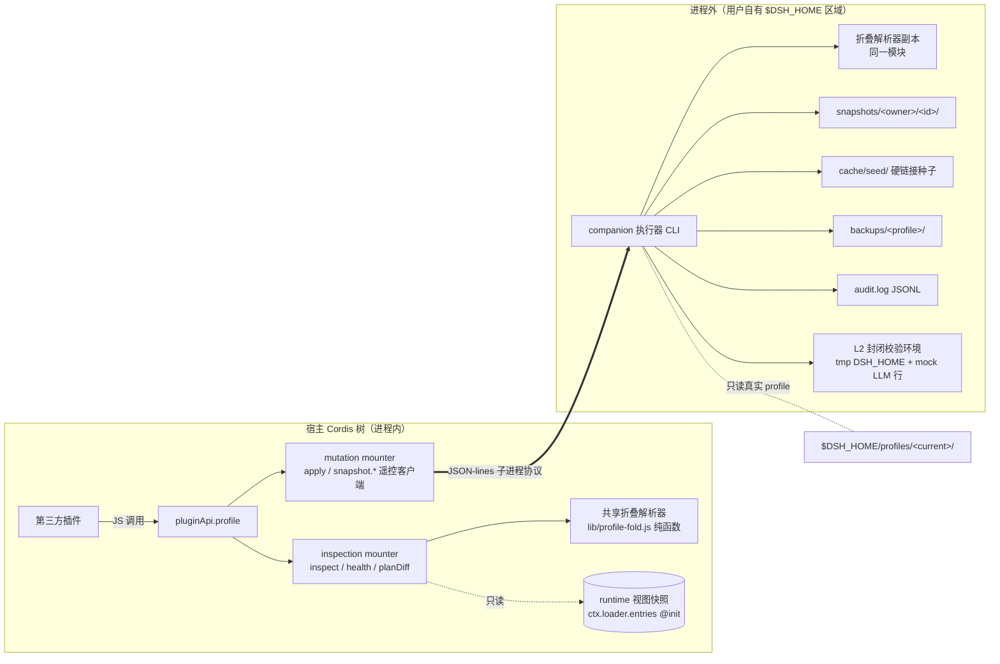

# Stage 2 - Design

## Status

SPEC1 Stage 2：**Design 已获用户批准**（M6 第五批次确认门）。批准前 2026-08-25 经 SPEC2 就地优化：补 PPM-10 客户端半身机械校验机制、结果形状补 restart-required 与备份代次上限、配额可调通道、审计 generation/受众、六册标准对照结论；未越 Goal/Requirements 验收边界。

## Overview

本设计把已获批的 Requirements（PPM-1…PPM-12）落成双执行面架构：进程内门面（投影面 + 写入面遥控客户端）与进程外 companion 执行器（写入逻辑唯一实现），共享一套容错折叠解析器。核心不变量：**进程内代码永不实现 profile 写入逻辑；所有落盘经执行器的"先验证后落盘 / CAS / 原子替换"管线**。

## Architecture



## Components and Interfaces

### 1. 门面·投影面（inspection mounter）

- `pluginApi.profile.inspect({ view: 'disk' } | { view: 'other', profile }) | { view: 'runtime' })` → 冻结 `ResolvedView`。
- `pluginApi.profile.health(target)` → 冻结 `{ findings: HealthFinding[] }`。
- `pluginApi.profile.planDiff(intent)` → 冻结 `PlanDiff`。
- 引出机制：**纯 fs 投影（B 家族边缘，无 dispatch 点、无事件钩子）**；runtime 视图数据源为 **`ctx.loader.entries` 直读**（官方已提供服务面，A 类式直通消费；本设计已核实官方 `dsh-host-plugin-inventory` 即消费此面）。
- runtime 视图语义（PPM-1.3/1.7）：本插件 apply 时点一次捕获 `loader.entries()` → 冻结作为**本次 boot 组合快照**；**不跟踪 init 之后的动态注册**（非实时 registry 镜像，PPM-1.7）。loader entry 可观察字段（id/name/enabled/fiber 相位等）如实呈现；包版本、依赖图等 loader 面不可观察字段按 PPM-1.5 标 `unavailable`，绝不从磁盘文件反推伪造。
- 跨视图对比（如 runtime vs disk 差值）由消费方组合两次 `inspect` 自行完成，本 feature 不设专用 diff 动词（goal 克制约定）。
- 失败路径与 guard：任何层解析失败 → 该层标 `unavailable`+reason，成功部分照常返回（PPM-1.4）；init 捕获不可观察字段 → 显式 unavailable 不伪造（PPM-1.5）；整个 mounter 包 G1 容器，绝不抛穿 apply。

### 2. 门面·写入面（mutation mounter，遥控客户端）

- `pluginApi.profile.apply(intent)` → 快捷写，返回操作句柄。
- `pluginApi.profile.snapshot.create/modify/delete/apply(...)` → 瞬时原子步骤，直接 typed 结果。
- `pluginApi.profile.snapshot.validate(snapshotId, level)` → 操作句柄。
- 引出机制：**进程外生态工具的遥控封装**（不属于 A/B/C/R 分类对象的分发通道；不 patch 官方文件，只写 `$DSH_HOME` 用户自有区域）。
- 与执行器协议：
  - **握手**：mounter 启动与惰性重试时调用执行器 `handshake` 子命令，返回 `{ builtForRuntime, apiProtocol }`；主包按 constitution §4 双向规则校验——方向 ① builtForRuntime 与安装的官方 runtime 完整 identity 精确相等、方向 ② apiProtocol 与主包 `dsh.api` 的 `major.minor` 匹配——任一失配 → 写动词 typed `unavailable`，读侧不受影响（PPM-4.3）。执行器包随本仓交付、与主包同仓同版本发布，正常安装下天然一致。
  - **长时操作**：每次操作一个子进程；stdout 输出 JSON-lines 事件（`{type:'progress', operationId, stage, reason?}` 终于 `{type:'result', outcome, ...}`）；退出码镜像终态类别。
  - **取消**：commit 开始前收到取消信号（SIGTERM）→ 执行器在阶段边界检查点结算 `aborted`；commit 窗口内信号被忽略并继续到终态，门面对迟到处分回 `too-late`（PPM-7.3/7.4，符合 concurrency-and-cancellation §1"取消是信号，终态是裁决"）。
  - **宿主生命周期**：v1 采用 kill-and-cleanup——宿主退出时终止在途子进程；staging 残留由 GC 扫描回收；commit 原子性保证半途击杀不产生半写态。detach/resume 留 v2。

### 3. 共享折叠解析器（`lib/profile-fold.js`）

- 纯函数模块，零 harness 依赖（可被门面与执行器两侧 import 同一实现）：`foldLayers(files) → ResolvedView`、`healthFindings(view) → Finding[]`、`planConfigOverlay(intent)`、`planDependencySet(intent)`。
- 格式耦合单点：官方组合规则变化时只改此模块。容错规则：unknown 字段原样保留进冻结视图；无法折叠的层显式标注；`!!js` 表达式保留原文、不求值。

### 4. companion 执行器（CLI，随本仓交付）

- 独立包 `packages/profile-manager/`（普通 npm 包 + bin，非 Cordis bundle、非 replacement 行），命令面：`handshake` / `quick-write` / `snapshot-create|modify|validate|delete|apply` / `gc`。
- **客户端半身机械校验（PPM-10，validate 阶段前置静态门）**：staged 快照含 client 代码时，先做确定性机械校验再进入 L1/L2——
  - **阻断（error）**：语法错误、禁止的 import 边界（如 client entry 引用 node 内置模块）、`dsh.client` 清单一致性失败（PPM-10.1）；
  - **不阻断（warning）**：危险 sink 启发式（eval、不安全 innerHTML 模式、通配 postMessage 等），使用与「client 半身威胁模型清单」交付物共享的 warning 词汇（PPM-10.2）。
  - 边界：机械校验止步包层，**不**驱动浏览器运行时行为验证（goal 范围外）；结果并入 verdict 报告，warning 不否决 boot。
- 内嵌 L2 mock 行包（tiny bundle，注册 `llm.registerAdapter` 声明固定 provider/model，返回确定性补全）——**仅经 overlay `insert` 注入一次性验证环境**，不是生产行、不是 R 替代（capability-strategy §2 形状用于注入测试脚手架而非替代官方行）。
- L2 流程：staged 快照置于 `<tmp>/profiles/l2check-<id>/` → 种子 `settings.yaml`（默认模型指向 mock provider；mock 生效时不需播种 `.env` 真实凭据）→ 校验 overlay 追加端口钉住与 mock insert → `DSH_HOME=<tmp> dsh --profile l2check-<id> <task>` 兜底档换真实凭据播种 → 按 PPM-11 判定语义归类 verdict（verdict 对象 = `{ bootHealthy, rowsApplied, caveats[], clientWarnings[] }`；**判定对象是 boot 与行 apply，不是推理成功**，PPM-11.1）。
- **配额可调通道（PPM-8.4「settings 可调」落地）**：本 feature 为 host-only、无 settings bridge；故配额以**进程外执行器读取的 profile 存储档配置文件** `$DSH_HOME/plugin-api/profile-manager/config.json`（`quotaPerOwnerMb` 默认 256 / `quotaTotalMb` 默认 1024）承载，由 profile owner 直接编辑，门面不暴露写入口（只见配置摘要于 availability）。执行器在 create/modify 时读取并判定，读不到配置时按默认值保守放行上限、绝不放宽已有配额（fail-closed）。
- 审计追加在**执行器进程**内（PPM-9.2 无公开写入口）：`audit.log` 由执行器 append，门面只读交付给授权消费方。

### 5. 存储布局（全部位于 `$DSH_HOME/plugin-api/profile-manager/`，profile 存储档）

```text
snapshots/<owner-package>/<snapshotId>/   # 惰性物化的快照实体
cache/seed/                                # 全局硬链接种子（系统单例）
backups/<profile-name>/<generation>/       # 提交代次备份（owner-local 单调代次）
audit.log                                  # JSONL 追加审计
tmp/                                       # L2 临时家目录与 staging（GC 清扫对象）
```

## Data Models

| 模型 | 字段 | 对齐说明 |
|---|---|---|
| `ResolvedView` | `view`, `profile?`, `rows[{id,name,bundle,source}]`, `layers[{kind,status:'folded'\|"unavailable",reason?}]`, `packages[{name,version,scope:'core'\|"user",dependencies}]`, `capturedAt` | 全部冻结输出；`packages[].dependencies` 为包级依赖图摘要（runtime 视图下载 loader 取不到则标 unavailable，PPM-1.5） |
| `HealthFinding` | `code`, `severity`, `subject`, `detail` | codes：duplicate-row-id / missing-package / row-package-mismatch / version-inconsistent / unknown-layer |
| `PlanDiff` | `intentType:'config'\|"deps"`, `overlayYaml?`, `depSetDelta?`, `warnings[]` | 纯计算产物 |
| `SnapshotRecord` | `snapshotId`(持久 UUID)、`owner`、`sourceProfile`、`lifecycleState: clean\|dirty\|validated`、`validatedGeneration?`、`createdAt`、`path` | 跨重启持久身份与 generation 分离（identity-and-lifecycle §3 末条） |
| `OperationHandle` | `operationId`(execution identity，门面生成 UUID)、`kind`、progress 事件流、终态 `outcome ∈ success/error/aborted/denied/superseded`（timeout 归 error+reason）、终态结果 `restartRequired` 明示 | 五词统一终态；attempt 层级承载内部 retry；`restartRequired` 对齐 PPM-5.8/6.6 |
| `AuditRecord` | `at`, `owner`, `op`, `target`, `outcome`, `reasons[]`, `generation?` | JSONL append-only（无公开写入口）；`generation` 记录操作绑定的 owner-local 代次（identity-and-lifecycle §2）；受众=日志摘要级 / 完整明细 diagnostic 可见（PPM-9.1，visibility-and-redaction §3） |

## Key Design Decisions

1. **写入逻辑唯一实现于执行器**（自指/爆炸半径/并发三重否决的结论）；门面是带握手与降级的遥控器。
2. **L2 mock-first**：判定对象是 boot 健康；mock 让退出码成为干净信号且零成本零网络零凭据拷贝；兜底档 provider 层失败记 caveat 放行（PPM-11）。
3. **惰性物化 + 硬链接 seed 缓存**：创建瞬时化、增量≈0；指纹漂移原子重建；配额拒写不删数据；判孤即删。
4. **CAS + 原子替换 + 代次备份**：并发策略声明为 compare-and-swap（真实 profile）/ exclusive（seed 重建、同快照操作）/ owner 划界并行（不同 owner 快照间）。
5. **所有权绑定层级**：mutation mounter 在挂载期以调用方插件包身份铸造作用域句柄，快照操作校验句柄归属而非信任裸参数（防谎报绑定，PPM-6.8 的落实点）。
6. **两面独立 owner**：api-shape 一面原则的合规拆分（llm 先例）；投影面永不持有写状态。
7. **host-only（capability-strategy §10 六项判定全否，与 requirements Faces 表一致）**：不声明 client manifest、不注册 remote namespace、不提供 slot/settings bridge、无 host↔client 版本协商、无 browser-side state、无 client-facing event/service。client 侧仅有两类交付：① 执行器对 staged 快照内 client 代码的**机械校验**（PPM-10，静态、止步包层）；② 「client 半身威胁模型清单」文档 + warning 词汇（承载于开发者文档），并对 `visibility-and-redaction.md` 增补 client 受众章节（goal 配套交付）。
8. **完成结果带 `restartRequired` 明示**（PPM-5.8/6.6）：commit/apply 成功且配置或依赖发生变更时置 true，UI 可见；restart 编排本身不在本 feature 范围（goal 排除）。
9. **备份代次有界（PPM-5.8/6.6「bounded retention N」）**：`backups/<profile>/` 按 owner-local 单调代次保留最近 N 份（N 与配额同置于执行器 `config.json`，默认 N=5），轮换丢弃最旧；备份随同配额判定使用 profile 存储档表观字节。

## Standards 对照结论（六册，design 落位）

| 分册 | 适用性 | 设计落位 |
|---|---|---|
| capability-strategy | 适用 | 读侧 B 家族边缘（纯 fs 投影、无 dispatch 点、R 关闭已审计归档）；执行器为生态工具、非插件分发通道，R1–R9 不适用；§3 安全不变量（可逆=备份/回滚、副作用有证明=只写 `$DSH_HOME` 用户区）；§10 六项全否 → **host-only**（KDD #7） |
| api-shape | 适用 | 双面拆分满足一面原则（llm 先例），投影面零副作用、写入面 durable mutation 且不做策略决策；跨面共享折叠解析器放 `lib/profile-fold.js` 内部模块，不入公开命名空间；无 policy 面（无授权模型） |
| identity-and-lifecycle | 适用 | 操作句柄 id=门面自生成 execution identity；attempt 承载内部 retry；generation=owner-specific opaque token（validatedGeneration、备份代次、审计 generation）；快照持久 snapshotId 与 generation 分离；终态五词统一、timeout 归 error+reason |
| durable-state-and-scope | 适用 | 快照/备份/审计/缓存全部归属 **profile 存储档**（`durable-state-and-scope.md` §1 显式声明）；mutation 面 identity+generation+commitState；原子替换杜绝半提交可见；fail-closed 默认拒绝未声明操作；审计 who/what/when/generation（§2） |
| visibility-and-redaction | 适用 | 受众逐条标注（PPM-1/2/7/9/12）；secret 全受众 redacted 且默认拒绝不可绕过；path/env 派生值默认 UI/diagnostic 可见、模型可见需 policy 提升；progress 事件只暴露 stage 元数据；**另承担本 feature 交付义务：对该分册增补 client 受众章节**（goal/ KDD #7） |
| concurrency-and-cancellation | 适用 | 「取消是信号，终态是裁决」：commit 前 SIGTERM 在阶段边界结算 `aborted`、commit 后 `too-late`；stale 提交资格=CAS 校验；disposer 按 identity 清理（delete 仅限自有快照）；并发策略显式声明 compare-and-swap/exclusive/owner 划界并行（KDD #4）；宿主退出 kill-and-cleanup 且 staging 归 GC（PPM-7.6） |

## 引出机制汇总（每钩子一句）

| 能力 | 机制 | 类别归档 |
|---|---|---|
| disk/other 视图 | fs 只读投影 + 共享解析器 | projection（B 家族边缘，无 dispatch 点） |
| runtime 视图 | `ctx.loader.entries` init 时点捕获 | 官方服务面直通消费 |
| 写动词 | 进程外执行器遥控（子进程 JSON-lines 协议） | 生态工具通道（不入 A/B/C/R 分类学） |
| mock LLM 行 | overlay `insert` 注入一次性验证环境 | 测试脚手架（非生产行、非 R 替代） |
| 上游依赖 | **无** —— `--boot-check` 等提案整体归 M-final，本 spec 零涉及 | 用户明示排除 |

## Error Handling

- **typed code 目录**：`invalid-input` / `unavailable`(执行器缺失或失配) / `quota-exceeded` / `ownership-conflict` / `gate-conflict`(未过校验门即 apply) / `cas-conflict`(要求 rebase) / `too-late`(commit 后取消) / `layer-unavailable` / `client-blocking`(PPM-10 阻断错误) / `internal`。
- **PPM-10 分类**：语法/import 边界/`dsh.client` 清单一致性失败 → 阻断（verdict fail），以 `client-blocking` 呈现；危险 sink 启发式 → 非阻断 `client-warning`（进警告词汇表），不否决 boot（PPM-10.2）。
- **失败分类映射**（durable-state-and-scope §4）：pnpm/网络 transient → 有界内部 retry（新 attempt，同 operation）；意图错误、结构损坏 permanent；取消 aborted；CAS 冲突 superseded；本 feature 无 approval 通道故 `denied` 仅保留词汇位。
- **guard 策略**：门面全入口 G1 容器；执行器崩溃/失配只降级写入面；审计失败降级结果中的 auditability 标志而不推翻已提交事实；GC/配额检查失败从保守（拒绝写入）不从宽。
- **可见性 guard**：路径与环境派生值默认 UI/diagnostic 可见、模型可见需 policy 提升；secret 值全受众 redacted（默认拒绝策略不可绕过）。

## Testing Strategy

1. **解析器纯函数测试**（零 harness 依赖，`node:test`）：分层折叠黄金样例、unknown 层降级、`!!js` 原文保留、health 各 finding code 触发。
2. **planDiff 计算测试**：配置类 overlay 生成正确性、依赖类目标集计算、零副作用断言（前后目录哈希不变）。
3. **客户端半身机械校验测试（PPM-10）**：`dsh.client` 清单一致性失败/违规 import/语法错误 → 阻断 `client-blocking`；eval/不安全 innerHTML/通配 postMessage 等 → 非阻断 warning 且写入共享词汇表；纯 client 内容隔离（不触碰真实 profile/browser 侧）。
4. **执行器集成测试**（临时 `$DSH_HOME` fixture）：握手成功/失配路径；快捷写 happy path（mock L2 全程离线）；CAS 冲突路径（prepare 后篡改真实 profile）；备份轮换（bounded N）与 rollback 还原；配额拒写（含 `config.json` 覆盖默认值）；GC 孤儿判定（含卸载→判孤→删除与 reinstall 取舍断言）。
5. **门面降级测试**：执行器缺席/失配时写动词 typed unavailable 且读侧完好；G1 容器吞错断言。
6. **句柄语义测试**：进度事件序列、commit 前取消 → `aborted`、commit 后取消 → `too-late`、终态五词互斥且不可改写。
7. **审计与结果测试**：audit.log 追加只读（无公开写入口）、`generation` 记录、终端结果 `restartRequired` 明示（配置/依赖变更成功为 true）（PPM-5.8/6.6、PPM-9）。
8. **E2E 冒烟**：在 scratch profile 上完成一次真实 quick-write（含重启后生效验证的手动检查清单）；headless 冒烟与本仓库 dev profile boot 回归照常执行。
9. 全部经 `npm test` 内存护栏运行；慢速集成用例打标隔离，不拖垮日常反馈环。
