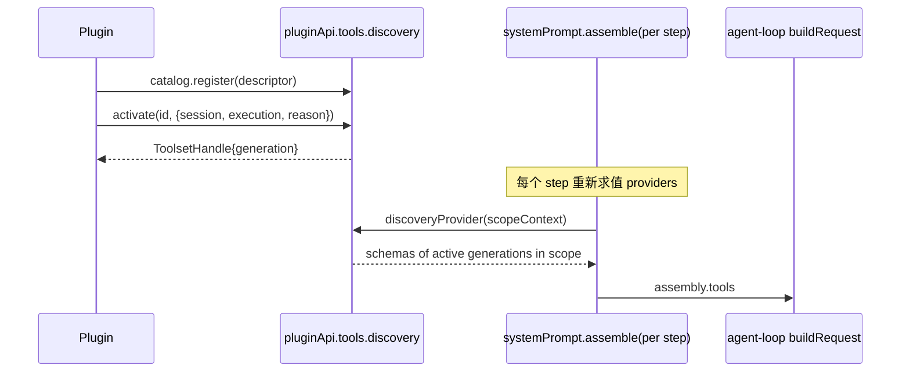

# Stage 2 - Design

## Status

SPEC1 Stage 0 Goal 已确认；Stage 1 Requirements 已确认（2026-08-25，含 PTD-3.5 R 返工规则）；Stage 2 Design 已确认（2026-08-25）；Stage 3 Tasks 已通过对抗性审查（2026-08-25「无偏差」），进入 Stage 4。

## Overview

`progressive-tool-discovery` 以"descriptor 目录 + 作用域化 toolProvider + 激活句柄"实现，命名空间 `pluginApi.tools.discovery`。**本设计的关键结论是：官方 seam 已完整支撑 turn 内 toolset 重建，PTD-3.5 的 R 返工条件未触发，首版按 B 类交付完整可用的 activation 功能。**

## 官方 loader 能力审计（PTD-3.5 判定证据）

| # | 事实 | 来源 |
|---|---|---|
| 1 | `systemPrompt.tools(provider)` 注册 tool-schema provider，**每次 assemble 都重新求值**，且支持 global + scoped 两层 | `dsh-system-prompt/lib/index.js:217-223`（provider 注册）、`:244-262`（assemble 内逐 provider 现场收集 schemas） |
| 2 | agent-loop **每个 step（= 每次 LLM 请求，含 turn 内工具调用后的后续步）** 都重新 `systemPrompt.assemble()` 并把 `assembly.tools` 传给 `buildRequest` | `dsh-agent-loop/lib/index.js:497`（preStep 内 assemble）、`:555`（step(decision.assembly)）、`:613` |
| 3 | toolset 变化被官方如实记账：header 变化时 append `request/header` reason:`change` | `dsh-agent-loop/lib/index.js:692-700` |
| 4 | tools registry 本身支持动态注册与 restriction：`register(definition)→disposer`、`restrict(filter)→disposer`、scope 参数化的 `get/schemas(scope?)` | `dsh-tools/lib/types/index.d.ts:603,611,657,678` |

结论：activation 在第 N 步生效、第 N+1 步请求即看到新 toolset，**无需替换 `dsh-tools` 行**。R 返工规则保持待命：若 Stage 4 实现中发现本表任一事实在锁定 runtime 上不成立，按 PTD-3.5 立即返工 R 类并回改本文档。

## Standards 对照结论

- api-shape：主公开面 = policy registry 面（catalog/activation 状态由系统在 assemble 决策点消费）；search 与 audit 为只读 projection；无 mutation 面。跨面共享的 active-toolset 状态放内部共享模块，不做万能 root。
- identity-and-lifecycle：entry/toolset generation 用 owner 内 opaque token；toolset 被替换的旧结果按 `superseded` 处理，不新增终态词。
- durable-state-and-scope：v1 audit/exposure 记录为内存有界队列（non-durable，如实标注）；默认不自动 retry。
- visibility-and-redaction：descriptor summary 设计上即模型可见（这是 feature 的目的）；audit/暴露原因 diagnostic/UI 可见、非模型可见。
- concurrency-and-cancellation：声明 `latest-wins`——同 scope 同 entry 的新 activation 取代旧 toolset 视图；stale 异步结果失去提交资格。
- capability-strategy：B 类通道成立（见上表证据）；不触碰横切派发语义。

## Architecture



- **Catalog registry**（内部模块 `lib/tool-discovery.js`）：`register({id, summary, capabilities, activate}) → {generation, dispose}`；duplicate id typed conflict；descriptor 冻结只读。
- **Activation handle**：activate 解析 `{session, execution}` 到 owning agent scope（经 execution/session capability plane），在该 scope 层登记 active 记录 `{entryId, generation, tools}`。工具定义来源两种：
  1. entry.activate() 返回 `ToolDefinition[]`（插件自带定义）；
  2. entry 声明引用既有已注册工具名集合（仅做可见性门控）。
- **Discovery provider**：facade 启动时向 `systemPrompt.tools()` 注册一个 facade-owned provider；其每次求值输出"当前 scope 内所有 active 且未被取代的 toolset 的 schemas"。deactivate/dispose 只改 active 集合，下一 assemble 自然生效——**不需要任何官方行内改动**。
- **Search**：纯投影，返回冻结 descriptor 数组 + exclusion 元数据（route constraint 命中时附原因）；**无匹配时显式返回空 `descriptors[]` 与空 `exclusions[]`，不捏造建议**（PTD-2.2）。
- **Deactivate 语义映射**（对应 PTD-4）：
  - entry 级 `deactivate(id, {reason})`=软下线：拒绝新 activation，已发 ToolsetHandle 继续有效至其执行结束；
  - handle 级 `handle.dispose()`=精确回收该 generation：从 active 集合移除，下一个 assemble 起不可见（等价 latest-wins 提交资格剥夺）；dispose 以自身持有 generation 自校验，**stale/foreign generation 的 dispose 返回 typed no-op/拒绝并保留当前 active 暴露**（PTD-4.4 的落地位：goal 层 `deactivate(id, generation)` 语义即映射到此 handle 级回收）；
  - scope 结束/owner dispose：execution/session scope 结束或 entry disposer 运行时回收该 scope 内该 owner 的 active 记录与其 resources（PTD-4.3 与 PTD-3.6 的清理规则）；
  - stale 结果 guard：被取代 generation 的迟到回调只进 audit，不再发布。
- **Prompt hint 注入**：有 active catalog 条目且 scope 开启 hint 时，经 `systemPrompt` section/context 贡献 descriptor 清单与调用语法；无条目贡献零字节；注入失败只降级 hint。

## Components and Interfaces

```text
pluginApi.tools.discovery
  ├─ catalog.register(spec) → Handle{generation, dispose}
  ├─ search(query, {scope}) → {descriptors[], exclusions[]}   // goal 层位置参数 `search(query, scope)` 细化为选项对象，便于后续附加过滤参数
  ├─ activate(id, {session, execution, reason}) → ToolsetHandle{generation, dispose}
  ├─ deactivate(id, {reason?})                    // entry 级软下线；generation 精确回收走 handle.dispose()（PTD-4.4）
  └─ audit.query(filter) → frozen records         // diagnostic/UI 可见
```

## Client Boundary（PTD-8）

- client 半面只消费既有 host projections 的只读 exposure 摘要（随 availability 元数据），并经现有远程投影通道下发，不新增 client transport。
- 不暴露 catalog 注册、search 代查、activate/deactivate 任何 client 面（PTD-8.2）。
- 无兼容 host 投影时 client 半面 inert/降级，不影响其他 client 面加载（PTD-8.3）。

## Data Models

```text
Descriptor      { id, owner, summary, capabilities[], sourceKind: 'plugin'|'skill'|'mcp'|'builtin-ref' }
ActiveToolset   { entryId, generation, scopeKey, tools: ToolDefinition[]|names[], activatedAt, reason }
AuditRecord     { seq, at, kind:'activate'|'deactivate'|'revoke'|'exclude'|'fail', entryId, sourceKind, owner, generation?, reason }
```

## Error Handling 与 guard

| 故障 | 行为 |
|---|---|
| activate 回调抛错/返回畸形 | 该 entry 标记 failed（diagnostics 带 owner 归因），其余 entry 与宿主请求不受影响 |
| 注册失败/畸形 descriptor | 该条目不进入目录（duplicate 走 typed conflict），注入面贡献零字节，经 plugin diagnostics 上报 owner 归因；其余 entry 与宿主不受影响（PTD-7.4） |
| provider 求值异常 | 本次 assemble 输出该 provider 空集合并记 diagnostics；不影响其他 providers 与 prompt 组装 |
| dispose 后迟到回调 | 失去提交资格，仅保留为 audit/diagnostic |
| stale/foreign generation 的 dispose | typed no-op/拒绝，当前 active 暴露保留（PTD-4.4） |
| audit 写入失败 | 显式上报 gap（availability/diagnostics），不捏造记录；exposure 按 PTD-3 继续（PTD-5.3） |
| facade setup 失败 | 整体 inert + availability 如实报告，绝不抛穿 apply |
| route constraint 引用缺失 | exclusion 元数据标 unknown，不阻断搜索 |

## Testing Strategy

1. **纯函数单元**：registry 校验/conflict/generation 替换矩阵；active 集合 latest-wins 收敛；search 过滤与 exclusion 记录。
2. **集成（真实 systemPrompt + tools fixture）**：
   - 注册→assemble 断言零泄露（未激活不出 schema）；
   - activate 后**同 turn 下一次 assemble** 断言新 schema 出现（turn 内重建回归锚点）；
   - handle.dispose 后断言消失且进行中执行持有的引用仍自洽；
   - entry failed 隔离：一个坏 activate 不影响其他条目出 schema。
3. **fail-safe**：setup 注错 inert;provider 抛错降级。
4. **回归**：feature 安装但零条目时,prompt 组装与请求 header 与基线逐字节一致。

## Stage 3 落地澄清（SPEC3 启动时补充，2026-08-25）

> 本节是进入 Stage 3（Tasks）前对已获批 Design 中实现细节空白点的**就地落地澄清**，不改变 Goal/Requirements 任何验收边界；按 AGENTS.md §3.2 Stage 4 规则，实现细节级修订由代理先行回写 spec 文档并在最终报告中列出。本节内容作为 tasks.md 的机制依据，纳入 Stage 3 对抗性审查的核对范围。

### S1. Scope 解析与暴露粒度（PTD-3.1/3.6 落地位）

- **Scope key = session id（字符串）**。assemble 时 provider/hint 只能见到 `context.scope`（= agent-loop 对象，`assembleContextFor` 契约），从中取 `scope.session.id`（兜底 `context.agent.session.id`）；无法解析出 session id 时该次求值贡献空集。
- `activate(id, { session, execution, reason })` 的解析顺序：`session.id` → `execution.agent.session.id` → `execution.sessionId`；全部缺失 → typed rejection（`DISCOVERY_SCOPE_UNRESOLVED`）。
- execution 参数不改变暴露粒度（v1 即 agent 粒度），仅在 ActiveToolset 记录中保留 execution 引用迹（audit 记录 executionId 当可解析时）；PTD-3.6 由 scope-key 隔离（不同 session 的 key 不同，天然不泄漏）+ owner 驱动清理（handle.dispose / entry disposer 按 generation 精确回收）保证，v1 不引入 session/execution 生命周期 watcher（克制设计：无人请求的 watcher 不做）。

### S2. Search 约束 seam（PTD-2.3 落地位）

- 引擎接受可注入的 `scopeConstraint(scopeKey)`（内部 seam，非公开面），返回冻结 `{ status: 'none' | 'applied' | 'unknown', source?: 'route-policy', reason?: string, forbidden: Array<{ entryId, reason }> }`；v1 宿主装配从 `resolveMarkedRoutePolicy(ctx)` 接线。
- 宿主映射：route-policy replacement 未 active → seam 恒返回 `{ status: 'none', forbidden: [] }`；active 但该 scope 无决策记录 → `{ status: 'unknown', source: 'route-policy', detail: 'no-route-decision', forbidden: [] }`（design 错误表「route constraint 引用缺失 → 标 unknown」）；有决策 → `{ status: 'applied', source: 'route-policy', reason: <决策 reason.code>（denied 决策）/ 'OFFICIAL_SEED'（success 决策）, forbidden: [] }`（route 决策 v1 不命名条目）。
- 引擎语义：`forbidden` 命中的条目从 descriptors 中滤出，各以 `{ entryId, reason }` 写入 `exclusions`；结果形状 `{ descriptors, exclusions, constraint }`（全冻结；`constraint` 即「exclusion 元数据」载体）；约束源缺失/未知只标注、**绝不阻断搜索**。无匹配时 `{ descriptors: [], exclusions: [], constraint: { status: 'none', forbidden: [] } }`（PTD-2.2）。

### S3. Hint 注入机制（PTD-6 落地位）

- facade 启动时经全局 `systemPrompt.section()` 注册唯一 hint section（name `discovery:hints`，order 取官方默认池后段）；text 为每次 assemble 求值的函数。
- 求值语义：scope 存在 ≥1 个 active toolset 时，逐条目输出一行（`- <id>: <summary>（capabilities 逗号串联）[source=<sourceKind>] 激活工具: <tool names 逗号串联>`）；无 active toolset 时输出空串（`renderPrompt` 对空 section 过滤，零字节，与基线逐字节一致——「scope 开启 hint」即「scope 有 active 条目」的 v1 判据）。
- 求值抛错 → 该次返回空串 + diagnostics 上报，不影响组装（PTD-6.3）。

### S4. Provider 输出与工具定义来源（PTD-3.1 落地位）

- facade 启动时经全局 `systemPrompt.tools()` 注册 provider；每次求值返回 `{ schemas: [...], knownNames: [...] }`（官方 assemble 强制的形状，绝不抛错：任何异常在 provider 内部消化并返回空集 + diagnostics）。
- 输出范围：该 scope 内**所有 active 且未被取代的 toolset 的 schemas**；schemas 取自 `entry.activate()` 返回值（case 1：`ToolDefinition[]`，各元素归一化为 `{ name, description, parameters }`，畸形元素按 PTD-7.1 处理）。case 2（spec 可选声明 `toolNames: string[]`，引用既有已注册工具名集合，校验量级上限同 capabilities）只参与状态/审计记录（ActiveToolset.tools 记 names[]），provider 不重复输出其 schema（其 schema 由官方 tools provider 呈现），`toolNames` 不进入 search 投影。
- **emitted schemas 必须结构化克隆安全**：官方 `assemble` 在 provider 调用之外直接对每个 schema 的 `parameters` 执行 `structuredClone`（无 try/catch）——facade 的 provider 在返回前必须保证 parameters 可克隆：归一化层实际执行一次克隆校验，函数/Symbol/循环引用等不可克隆结构 → 按 PTD-7.1 将该 entry 标记 failed 并经 diagnostics 上报，而不是把不可克隆对象交给官方 assemble。
- `knownNames` 恒取本次输出 schemas 的 name 列表（空集合法）。

### S5. deactivate 语义（PTD-4.1/4.4 落地位）

- `deactivate(id, { reason? })`：entry 级软下线——拒绝该 entry 的新 activation（typed rejection `DISCOVERY_ENTRY_DEACTIVATED`），已发 ToolsetHandle 与其 active toolset 保持有效；v1 不提供恢复通道（恢复 = dispose 后重新 register），文档注明。
- `handle.dispose()`：精确回收该 generation：从 active 集合移除该 (entryId, scopeKey, generation) 记录；stale/foreign generation（该记录已不存在、已被取代或从未发布）→ 返回冻结 typed outcome `{ ok: false, code: 'DISCOVERY_GENERATION_STALE' }` 且**保留当前 active 暴露**（PTD-4.4），不抛错（disposer 清理路径不得抛穿）。（以 S6 错误码表为准；本节曾误写 UNKNOWN，已按 S6 修正。）
- entry disposer：幂等（PTD-1.3）；只移除该 entry 自身的注册与其各 scope 的 active 记录（PTD-4.3），不触碰他人条目；随后对该 entry 的 activate/search 引用 → typed rejection `DISCOVERY_ENTRY_DISPOSED`。

### S6. Typed errors / outcomes（P1 失败呈现落地）

新增 `lib/tool-discovery-errors.js`（新文件，不触碰 `lib/errors.js`），全部继承 `PluginApiError`：

| code | 场景 |
|---|---|
| `DISCOVERY_REGISTRATION_INVALID` | descriptor 畸形（id/owner 空、summary 超 200 字符、capabilities 超 16 项、activate 非函数、sourceKind 非法） |
| `DISCOVERY_ENTRY_CONFLICT` | 同 owner 下重复 id（保留既有条目） |
| `DISCOVERY_ENTRY_UNKNOWN` | activate/search/audit 引用不存在的 id |
| `DISCOVERY_ENTRY_DISPOSED` | 引用已 dispose 条目 |
| `DISCOVERY_ENTRY_DEACTIVATED` | 对软下线条目发起新 activation |
| `DISCOVERY_ENTRY_FAILED` | activate 回调抛错/返回畸形输出（该 entry 标记 failed + diagnostics 带 owner 归因） |
| `DISCOVERY_SCOPE_UNRESOLVED` | activate 无法从 session/execution 解析 scope key |
| `DISCOVERY_ACTIVATION_SUPERSEDED` | 激活的 toolset 定义到达前已被同 scope 同 entry 的新 claim 取代（迟到结果只进审计/诊断，不发布） |
| `DISCOVERY_GENERATION_STALE`（outcome） | stale/foreign dispose 的 typed no-op 结果（不抛） |

### S7. 装配与 fail-safe 落地

- 内部 feature 名 `toolDiscovery`（中立命名，无治理代号）；公开面 `pluginApi.tools.discovery`（挂载于 `tools` 命名空间内）：
  - `catalog.register(spec) → Handle{ generation, dispose }`（entry 级）
  - `search(query, { scope? }) → { descriptors, exclusions, constraint }`（全冻结）
  - `activate(id, { session?, execution?, reason? }) → Promise<ToolsetHandle{ generation, dispose }>`
  - `deactivate(id, { reason? })`
  - `audit.query(filter?) → { items, truncated, nextCursor? }`（冻结；内存有界 500 条循环队列，non-durable 如实标注，PTD-5）
  - `get availability` → `{ active, catalog: { registered, failed, offline }, toolsets, audit: { limit, count, truncated, gap? }, constraint: { status }, providerRegistered, hintRegistered }`（真值报告，PTD-7.3；provider/hint 注册状态由宿主接线如实填写，与交付实现一致）
- 未装配/降级时全部方法抛 typed `PLUGIN_API_FEATURE_DISABLED('toolDiscovery')`（disabled surface）；setup 失败 → 整体 inert，availability 如实报 inactive（PTD-7.2）。
- 装配点（共享文件追加式改动，批次契约 §2）：`lib/plugin-api-service.js`（`// tool-discovery` 注册块：`tools.discovery` 槽 + `_assignFeature`/`_readSlot`/`_disabledSurfaceFor`/`unmountFeature`/`KNOWN_FEATURES` 追加分支与 import）；`lib/index.js`（`// tool-discovery` 注册块：FEATURE_MOUNTERS 条目 + owner 装配 + `resolveMarkedRoutePolicy` 接线为 scopeConstraint）；`lib/guards.js`（追加 `toolDiscovery` probe 分支：`systemPrompt.tools`、`systemPrompt.section`、`tools` 服务面）。
- 事件面：本 feature 不新增任何 catalog 事件条目（design 未定义），事件目录不动。

### S8. 测试策略增补

集成 fixture 使用**真实官方 `SystemPrompt` 服务**（`@deepseek-ai/dsh-system-prompt` 默认导出）：以迷你 Cordis ctx（`effect` 支持生成器 disposer、`waterfall` 直通、`emit`/`off` 空实现）实例化真实服务，注册 facade provider/section 后直接驱动 `assemble({ scope: { session: { id } } })`，断言 `assembly.tools`/`sections` 的逐 assemble 变化——即「turn 内重建回归锚点」的真实载体；零条目基线断言 renderPrompt 输出与无 facade 注册时逐字节一致。
