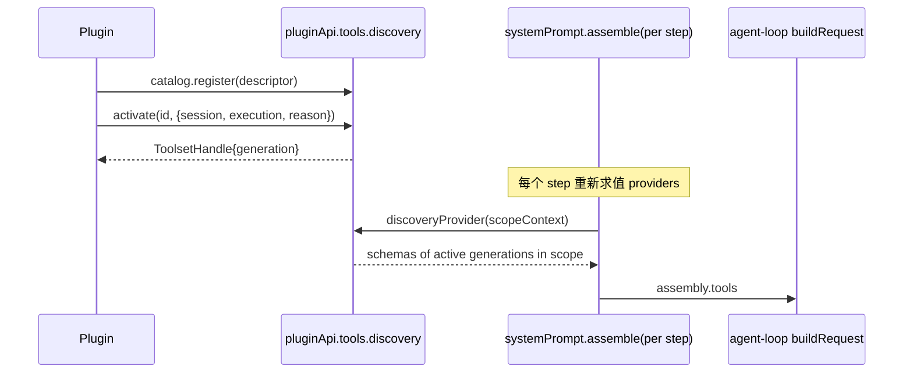

# Stage 2 - Design

## Status

SPEC1 Stage 0 Goal 已确认；Stage 1 Requirements 已确认（2026-08-25，含 PTD-3.5 R 返工规则）；Stage 2 Design 已确认（2026-08-25）；待进入 Stage 3 Tasks。

## Overview

`progressive-tool-discovery` 以"descriptor 目录 + 作用域化 toolProvider + 激活句柄"实现，命名空间 `pluginApi.tools.discovery`。**本设计的关键结论是：官方 seam 已完整支撑 turn 内 toolset 重建，PTD-3.5 的 R 返工条件未触发，首版按 B 类交付完整可用的 activation 功能。**

## 官方 loader 能力审计（PTD-3.5 判定证据）

| # | 事实 | 来源 |
|---|---|---|
| 1 | `systemPrompt.tools(provider)` 注册 tool-schema provider，**每次 assemble 都重新求值**，且支持 global + scoped 两层 | `dsh-system-prompt/lib/index.js:217-223`（provider 注册）、`:244-262`（assemble 内逐 provider 现场收集 schemas） |
| 2 | agent-loop **每个 step（= 每次 LLM 请求，含 turn 内工具调用后的后续步）** 都重新 `systemPrompt.assemble()` 并把 `assembly.tools` 传给 `buildRequest` | `dsh-agent-loop/lib/index.js:497`（preStep 内 assemble）、`:555`（step(decision.assembly)）、`:613` |
| 3 | toolset 变化被官方如实记账：header 变化时 append `request/header` reason:`change` | `dsh-agent-loop/lib/index.js:692-700` |
| 4 | tools registry 本身支持动态注册与 restriction：`register(definition)→disposer`、`restrict(filter)→disposer`、scope 参数化的 `get/schemas(scope?)` | `dsh-tools/lib/types/index.d.ts:603,611,657,678` |

结论：activation 在第 N 步生效、第 N+1 步请求即看到新 toolset，**无需替换 `dsh-tools` 行**。R 返工规则保持待命：若 Stage 4 实现中发现本表任一事实在锁定 runtime 上不成立，按 PTD-3.5 立即返工 R 类并回改本文档。

## Standards 对照结论

- api-shape：主公开面 = policy registry 面（catalog/activation 状态由系统在 assemble 决策点消费）；search 与 audit 为只读 projection；无 mutation 面。跨面共享的 active-toolset 状态放内部共享模块，不做万能 root。
- identity-and-lifecycle：entry/toolset generation 用 owner 内 opaque token；toolset 被替换的旧结果按 `superseded` 处理，不新增终态词。
- durable-state-and-scope：v1 audit/exposure 记录为内存有界队列（non-durable，如实标注）；默认不自动 retry。
- visibility-and-redaction：descriptor summary 设计上即模型可见（这是 feature 的目的）；audit/暴露原因 diagnostic/UI 可见、非模型可见。
- concurrency-and-cancellation：声明 `latest-wins`——同 scope 同 entry 的新 activation 取代旧 toolset 视图；stale 异步结果失去提交资格。
- capability-strategy：B 类通道成立（见上表证据）；不触碰横切派发语义。

## Architecture



- **Catalog registry**（内部模块 `lib/tool-discovery.js`）：`register({id, summary, capabilities, activate}) → {generation, dispose}`；duplicate id typed conflict；descriptor 冻结只读。
- **Activation handle**：activate 解析 `{session, execution}` 到 owning agent scope（经 execution/session capability plane），在该 scope 层登记 active 记录 `{entryId, generation, tools}`。工具定义来源两种：
  1. entry.activate() 返回 `ToolDefinition[]`（插件自带定义）；
  2. entry 声明引用既有已注册工具名集合（仅做可见性门控）。
- **Discovery provider**：facade 启动时向 `systemPrompt.tools()` 注册一个 facade-owned provider；其每次求值输出"当前 scope 内所有 active 且未被取代的 toolset 的 schemas"。deactivate/dispose 只改 active 集合，下一 assemble 自然生效——**不需要任何官方行内改动**。
- **Search**：纯投影，返回冻结 descriptor 数组 + exclusion 元数据（route constraint 命中时附原因）；**无匹配时显式返回空 `descriptors[]` 与空 `exclusions[]`，不捏造建议**（PTD-2.2）。
- **Deactivate 语义映射**（对应 PTD-4）：
  - entry 级 `deactivate(id, {reason})`=软下线：拒绝新 activation，已发 ToolsetHandle 继续有效至其执行结束；
  - handle 级 `handle.dispose()`=精确回收该 generation：从 active 集合移除，下一个 assemble 起不可见（等价 latest-wins 提交资格剥夺）；dispose 以自身持有 generation 自校验，**stale/foreign generation 的 dispose 返回 typed no-op/拒绝并保留当前 active 暴露**（PTD-4.4 的落地位：goal 层 `deactivate(id, generation)` 语义即映射到此 handle 级回收）；
  - scope 结束/owner dispose：execution/session scope 结束或 entry disposer 运行时回收该 scope 内该 owner 的 active 记录与其 resources（PTD-4.3 与 PTD-3.6 的清理规则）；
  - stale 结果 guard：被取代 generation 的迟到回调只进 audit，不再发布。
- **Prompt hint 注入**：有 active catalog 条目且 scope 开启 hint 时，经 `systemPrompt` section/context 贡献 descriptor 清单与调用语法；无条目贡献零字节；注入失败只降级 hint。

## Components and Interfaces

```text
pluginApi.tools.discovery
  ├─ catalog.register(spec) → Handle{generation, dispose}
  ├─ search(query, {scope}) → {descriptors[], exclusions[]}   // goal 层位置参数 `search(query, scope)` 细化为选项对象，便于后续附加过滤参数
  ├─ activate(id, {session, execution, reason}) → ToolsetHandle{generation, dispose}
  ├─ deactivate(id, {reason?})                    // entry 级软下线；generation 精确回收走 handle.dispose()（PTD-4.4）
  └─ audit.query(filter) → frozen records         // diagnostic/UI 可见
```

## Client Boundary（PTD-8）

- client 半面只消费既有 host projections 的只读 exposure 摘要（随 availability 元数据），并经现有远程投影通道下发，不新增 client transport。
- 不暴露 catalog 注册、search 代查、activate/deactivate 任何 client 面（PTD-8.2）。
- 无兼容 host 投影时 client 半面 inert/降级，不影响其他 client 面加载（PTD-8.3）。

## Data Models

```text
Descriptor      { id, owner, summary, capabilities[], sourceKind: 'plugin'|'skill'|'mcp'|'builtin-ref' }
ActiveToolset   { entryId, generation, scopeKey, tools: ToolDefinition[]|names[], activatedAt, reason }
AuditRecord     { seq, at, kind:'activate'|'deactivate'|'revoke'|'exclude'|'fail', entryId, sourceKind, owner, generation?, reason }
```

## Error Handling 与 guard

| 故障 | 行为 |
|---|---|
| activate 回调抛错/返回畸形 | 该 entry 标记 failed（diagnostics 带 owner 归因），其余 entry 与宿主请求不受影响 |
| 注册失败/畸形 descriptor | 该条目不进入目录（duplicate 走 typed conflict），注入面贡献零字节，经 plugin diagnostics 上报 owner 归因；其余 entry 与宿主不受影响（PTD-7.4） |
| provider 求值异常 | 本次 assemble 输出该 provider 空集合并记 diagnostics；不影响其他 providers 与 prompt 组装 |
| dispose 后迟到回调 | 失去提交资格，仅保留为 audit/diagnostic |
| stale/foreign generation 的 dispose | typed no-op/拒绝，当前 active 暴露保留（PTD-4.4） |
| audit 写入失败 | 显式上报 gap（availability/diagnostics），不捏造记录；exposure 按 PTD-3 继续（PTD-5.3） |
| facade setup 失败 | 整体 inert + availability 如实报告，绝不抛穿 apply |
| route constraint 引用缺失 | exclusion 元数据标 unknown，不阻断搜索 |

## Testing Strategy

1. **纯函数单元**：registry 校验/conflict/generation 替换矩阵；active 集合 latest-wins 收敛；search 过滤与 exclusion 记录。
2. **集成（真实 systemPrompt + tools fixture）**：
   - 注册→assemble 断言零泄露（未激活不出 schema）；
   - activate 后**同 turn 下一次 assemble** 断言新 schema 出现（turn 内重建回归锚点）；
   - handle.dispose 后断言消失且进行中执行持有的引用仍自洽；
   - entry failed 隔离：一个坏 activate 不影响其他条目出 schema。
3. **fail-safe**：setup 注错 inert;provider 抛错降级。
4. **回归**：feature 安装但零条目时,prompt 组装与请求 header 与基线逐字节一致。
