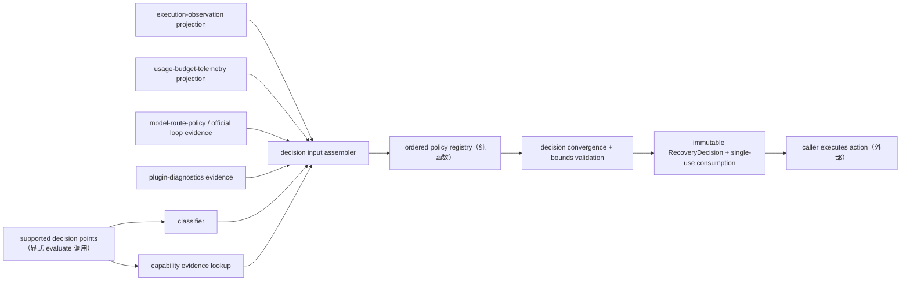

# Stage 2 - Design

> **公共契约现状注（2026-08-29 追加）**：本制品成文于目标领域树 cutover 之前，文中的公共 path 为旧命名。现行命名以 [`public-contract.registry.json`](../plugin-api-m7-public-contract-refactor/public-contract.registry.json) 的 `oldToTargetMapping` 为唯一权威，本制品涉及的映射如下：
>
> | 本制品使用的旧 path | 现行 path |
> |---|---|
> | `pluginApi.recovery`（`classify/capability/policy/evaluate/consume/adapters/visibility/availability`） | `pluginApi.executions.recovery`（叶子名不变；recovery 归入 executions 域，消费单一 authority） |
>
> 现行契约基线：包版本 `0.1.0-rc.6-0.1.0`（runtime `0.1.0-rc.6` / `dsh.api` `0.1`）；本制品中出现的 `0.1.0-rc.6-0.x` 为历史交付边界记录，不代表现行版本。本注只更新命名与版本指针，不改动本制品已获批的 Goal / Requirements 验收边界。

## Status

Stage 2 Design 已批准，Stage 2 已完成。Stage 1 Requirements（`requirements.md`）已由用户确认；本设计不包含实现代码，可进入 Stage 3。

## Overview

`recovery-policy` 是 **B 类 host-first policy facade**，落于主包新顶层命名空间 `pluginApi.recovery`。它为第三方插件提供 policy-first 的失败分类与恢复决策契约：统一 `transient/permanent/aborted/denied/superseded` 词汇、operation capability 声明、有序恢复策略注册与 `retry/abort/fallback/fork/stop` 决策收敛，并把决策与 execution/attempt、原因与能力证据关联。

本 feature **只决策、不执行**：它不创建 attempt、不启动 provider/tool 重试、不改写 checkpoint/workspace、不恢复会话；实际执行动作由调用方（官方 loop、`model-route-policy` 授权的 fallback attempt、插件自己的 integration adapter）完成。恢复策略横跨 execution、agent loop、route、session、checkpoint、workspace 与 budget 多个 owner，因此维持 B 类组合、不做 R replacement。完整请求边界、官方 agent-loop 内部 retry 选择、跨 session checkpoint restore 三处缺口登记为 C 类 upstream proposal（U13/U14/U15）。

**主公开面 = policy registry（`policy.register` + 决策引擎 `evaluate`）**；`classify` 是纯 helper，`capability.declare` 是独立的 operation capability owner，二者与 policy owner 不共享私有状态（`api-shape.md` 一面原则在 feature 内按独立 owner 拆分）。safe default 恒为 fail-closed `stop`。

## Architecture



### Source and hook classification

| Semantic area | Mechanism | Classification |
|---|---|---|
| failure classification | 纯函数 classifier（错误链、信号原因、超时、取消优先级） | B facade |
| operation capability | `capability.declare` 注册表 | B policy/registry |
| recovery policy composition | `policy.register` + `evaluate` 有序收敛 | B policy registry |
| official failure evidence | `agent/request-error`（A5）、`tools/post-execute`/`tools/result`、workflow/subagent 公开事件经 **integration adapter 纯函数**归一化后作为显式输入；facade 不自动挂载全局监听器、不声称官方 loop 内部时序 | B composition |
| execution/attempt correlation | 只读消费 `execution-observation` 公开投影 | B dependency |
| budget/route/checkpoint evidence | 只读消费 `usage-budget-telemetry` / `model-route-policy` / session/workspace 公开投影 | B dependency |
| 完整请求边界、官方 agent-loop retry seam、跨 session checkpoint restore | 当前公开 seam 不可达 | C / U13、U14、U15 upstream proposal |

Host 是分类、注册与决策权威；client 无 package-owned bundle/remote/slot/settings 面，只允许经显式批准的 redacted projection 消费决策。

## Components and Interfaces

### C1. Classifier

```js
pluginApi.recovery.classify(failure, options?)
// → { class: 'transient'|'permanent'|'aborted'|'denied'|'superseded',
//     reason: { code, category?, boundedDetail? }, source: { kind, observedAt }, outcome: 'error' }
```

- 返回**恰好一个** primary class + bounded reason + source evidence（RP-1）。
- deadline 到期 → `outcome: 'error'` + reason `timeout`，不新增终态 class（与 `identity-and-lifecycle.md` 一致）。
- 同一提交窗口内的竞争信号优先级：`aborted > superseded > error > timeout-error`（`concurrency-and-cancellation.md`）；caller/owner/generation 已取消或已取代时，late provider error 不覆盖 `aborted/superseded`。
- 分类缺失、矛盾或抛错 → safe default 路径（C4），不改变原始 operation outcome。

### C2. Operation capability registry

```js
const dispose = pluginApi.recovery.capability.declare({
  operationId, ownerId, generation, scope: 'session'|'workspace'|'profile',
  idempotent: boolean,
  retryable: boolean,
  allowedActions: Array<'retry'|'abort'|'fallback'|'fork'|'stop'>,
  sideEffectClass: 'none'|'read-only'|'external'|'non-idempotent',
  deadlineMs?, retryBudget?, forkRequiresApproval?: boolean,
})
```

- 未声明 / 声明不可解析 → 按 `{retryable: false, allowedActions: ['stop','abort']}` fail-closed（RP-2）；非幂等且无显式 override 不自动 retry。
- 旧 generation 注册 dispose 后失去决策资格；同 `(ownerId, operationId)` 新注册 latest-wins，旧 disposer 不删新注册。
- 声明只描述能力，不启动 retry，不写 execution/checkpoint 状态。

### C3. Policy registry and decision engine

```js
const dispose = pluginApi.recovery.policy.register({
  id, ownerId, generation, match(input) { /* pure */ }, decide(input) { /* pure */ }, priority,
})
// decide → { action: 'retry'|'abort'|'fallback'|'fork'|'stop', reason, bounds? }
//        | { action: 'no-op' } | Promise<同上>

const decision = await pluginApi.recovery.evaluate({
  failure, capability: { operationId, ownerId, generation } | undefined,
  execution?: { executionId, attemptId?, terminalOutcome? },
  scope: 'session'|'workspace'|'profile'|'unknown',
  evidence: {
    budget?, route?, diagnostics?, checkpoint?, branch?,    // 全部显式传入
    source: { kind: 'agent-request'|'tool-call'|'workflow'|'operation'|'other', observedAt }
  },
  signal?,
})
```

- **确定性顺序**：`priority` 升层（lowest→monitor），同层注册序；每个 decision 每个 policy 至多一次（RP-3）。
- **收敛规则（保守优先）**：固定 action precedence `stop > abort > fallback > fork > retry > no-op`；先到的高 precedence 决定不被低 precedence 覆盖；无有效结果或策略全部失败 → safe default `stop`。policy throw / rejected thenable / invalid decision → contained + bounded diagnostic，继续其余 policy。
- **显式输入**：classification、capability、execution/attempt、budget、route、checkpoint 证据全部由 input assembler 显式装配传入；policy 不得私读可变状态、不得启动 retry、不得 mutate checkpoint、不得调用 provider（RP-3）。
- **evaluate 不执行动作**：只返回不可变 decision；调用方负责执行与后果（RP-4）。

### C4. Decision model and safe default

```ts
type RecoveryDecision = Readonly<{
  decisionId: string
  action: 'retry' | 'abort' | 'fallback' | 'fork' | 'stop'
  reason: Readonly<{ code: string; category?: string; source: string }>
  execution?: Readonly<{ executionId: string; attemptId?: string }>
  parent?: Readonly<{ executionId: string; attemptId?: string }>   // fork/fallback 的失败父尝试
  proposedAttemptId?: string                                      // retry/fallback/fork 提议的新 attempt 边界（若可确定）
  bounds?: Readonly<{ attemptsRemaining?: number; deadlineAt?: string; backoff?: Readonly<{ kind: 'immediate'|'fixed'|'exponential-jitter'; ms?: number }>; approvalRequired?: boolean }>
  capabilityEvidence: ReadonlyArray<Readonly<{ operationId: string; ownerId: string; generation: string; ... }>>
  evidenceProvenance: ReadonlyArray<Readonly<{ source: string; observedAt: string; certainty: 'observed'|'inferred'|'unavailable' }>>
  consumed?: boolean
  observedAt: string
}>
```

- **action 语义**（RP-4）：
  - `retry`：同一 execution + `proposedAttemptId` 新 attempt 边界；必须携带有限 attemptsRemaining/deadline/backoff（或显式 `immediate` reason）；不铸新 execution。
  - `fallback`：`parent` 引用失败 attempt，候选选择**延迟给 `model-route-policy` 或官方 loop**；recovery 不选 provider/model。
  - `fork`：`parent` 标识父/原因；要求 capability 声明 fork 且（若配置）approval；**不声称** session/workspace/checkpoint 已被复制，除非官方公开服务确认该事实。
  - `abort`：要求存在 active cancellable operation；abort decision 本身不等于已提交 `aborted` 终态，终态由 execution owner settle。
  - `stop`：该 decision window 禁止后续自动 attempt；不重写触发决策的失败 outcome。
- **safe default**：无 capability、分类不确定、决策上下文不完整、策略失败 → `stop`（RP-1/RP-8）。
- **single-use consumption**：

  ```js
  pluginApi.recovery.consume(decisionId, { attemptId })   // idempotent, identity-guarded
  ```

  同一 decision 第二次 consume → typed reject；caller 只能用同一 decisionId 创建一次新 attempt（RP-5）。consume 不创建 attempt、只记录消费事实。

### C5. Decision input assembler

- 只从公开投影读取：`execution-observation`（execution/attempt/terminal outcome）、`usage-budget-telemetry`（budget/usage evidence）、`plugin-diagnostics`（可用性证据）、`model-route-policy`（route/lineage evidence，若 active）、session/workspace checkpoint 公开能力。
- 任何依赖缺失 → 对应 evidence `unavailable` + provenance 标注；**绝不**从 event sequence、对象 identity 或私有 retry counter 铸 execution identity（RP-6）。
- 外部再次触发同一逻辑操作（即使 byte-for-byte 相同输入）→ 消费 `execution-observation` 判定的新 execution；terminal outcome 已提交的 execution 上来的 late evaluate → safe default，不启动新 attempt（RP-6）。
- budget/route/checkpoint 证据保留各 source 的 provenance 与 uncertainty（RP-8）。

### C6. Integration adapters (pure normalizers)

- `recovery.adapters.fromAgentRequestError(payload)`：把官方 `agent/request-error` payload（turn/step/provider/failure/retryPolicy/signal）归一化为 classifier 输入，**不含**任何自动重试/挂载监听副作用；是否调用 `evaluate` 与是否执行结果由调用方决定（不伪造官方 loop 内部时序）。
- `recovery.adapters.fromToolResult(exec, result)`：把 `tools/post-execute`/`tools/result` 的失败形状归一化为 classifier 输入。
- adapter 是纯函数，零 harness 依赖；官方事件直接绑定只发生在未来获批的调用方集成里，不属于本 feature 的自动行为。

### C7. Namespace and feature mounting

- 主包新增 `pluginApi.recovery` namespace（`classify/capability/policy/evaluate/consume/adapters/availability`），host-only；不新增 events catalog slice、client bundle 或 remote namespace。
- feature guard：核心依赖（`events` 总线基础面）不满足或本 feature 初始化失败 → P2 式 disabled surface，`availability: 'unavailable'` + typed error，boot 不抛穿。
- 与 `model-route-policy`、`execution-observation`、`usage-budget-telemetry`、`plugin-diagnostics` 的边界：只消费其公开投影，不拥有其状态空间。

## Data Models

除 C4 `RecoveryDecision` 外：

```ts
type FailureClass = 'transient' | 'permanent' | 'aborted' | 'denied' | 'superseded'
type RecoveryAction = 'retry' | 'abort' | 'fallback' | 'fork' | 'stop'

type Classification = Readonly<{
  class: FailureClass
  outcome: 'error'                     // timeout 归 error + reason.timeout
  reason: Readonly<{ code: string; category?: string; boundedDetail?: string }>
  source: Readonly<{ kind: string; observedAt: string }>
}>

type OperationCapability = Readonly<{
  operationId: string
  ownerId: string
  generation: string
  scope: 'session' | 'workspace' | 'profile'
  idempotent: boolean
  retryable: boolean
  allowedActions: ReadonlyArray<RecoveryAction>
  sideEffectClass: 'none' | 'read-only' | 'external' | 'non-idempotent'
  deadlineMs?: number
  retryBudget?: Readonly<{ maxAttempts: number }>
  forkRequiresApproval?: boolean
}>
```

Capability records 属于 profile 级声明（进程内注册表，v1 非 durable；持久化能力声明属 U14 范围，见 Decision Points D1）。decision 本身不写 durable 状态；审计依赖调用方/官方 session log 与 diagnostics evidence。

## Concurrency, Cancellation, and Ownership

- 并发策略：同一 `(executionId, attemptId)` 的 evaluate `exclusive`（同窗口一次决策）；不同 execution `parallel`；capability 注册 `latest-wins`（同 owner/operation）；consume `compare-and-swap`（首个 consume 获胜）。
- 取消：caller AbortSignal 传播到 classifier/evidence 装配（支持处透传）；取消是信号，不直接写 `aborted` 终态。
- stale guard：决策窗口、generation 或 execution 已失效后到达的 policy 结果/evidence → stale，只保留 bounded diagnostic；不发布当前 decision、不调用新 disposer、不启动 retry/fallback/fork（RP-7）。
- disposer：policy/capability 注册与 notification（若有）disposer 幂等且 identity-bound；旧 generation disposer 不删同 id 新注册；apply 失败只清理本次已确认归属资源。
- retry 语义：retry 归 attempt 层（同 execution），外部重触发 = 新 execution；未声明 idempotent/retryable 默认不自动 retry（`durable-state-and-scope.md`）。

## Visibility and Redaction

无 visibility policy 时：模型可见 recovery 数据**默认缺席**；UI/debug 只显示 action/reason/source 的有界非 secret 字段；日志省略 prompts、credentials、request bodies、private error cause。显式提升的非 secret 证据保留 source/observedAt/uncertainty，不把 proposed action 呈现为已完成 outcome。redaction 失败 = fail-closed 省略。

## Error Handling and Fail-Safe

classifier 抛错、capability 校验失败、policy throw/reject、input assembler 缺失、consume 冲突、diagnostic 发射失败全部 contained；任何路径的最终结果要么是合法 decision、要么是 safe default `stop` + bounded diagnostic。feature 初始化失败时 inert，harness boot 继续；原始 operation 保留其既有 outcome（RP-8）。out-of-boundary 请求（自动 route 选择、billing、approval bypass、boot mutation、非幂等副作用补偿）typed reject。

## Testing Strategy

Focused tests SHALL cover：

1. classifier：五类词汇、timeout→error+reason、aborted/superseded 优先级、缺失/矛盾/抛错 safe default、late provider error 不覆盖取消/取代。
2. capability：声明校验、未声明 fail-closed、非幂等不自动 retry、latest-wins 与旧 disposer 隔离。
3. policy registry：确定性顺序、收敛 precedence（stop>abort>fallback>fork>retry>no-op）、每 policy 至多一次、throw/thenable/invalid 收敛、显式输入无私有读。
4. decision actions：五动作语义、retry bounds/deadline/backoff、fallback 不选 route、fork 需 capability/approval 且不声称复制、abort 不等于已提交终态、stop 不改写失败 outcome。
5. consume/single-use：同 decision 二次 consume reject、同 decisionId 不产生第二 attempt。
6. execution integrity：外部重触发 = 新 execution（经 execution-observation）、terminal execution late evaluate safe default、缺 identity 不从 event seq/私有计数铸 identity。
7. interop/evidence：budget/route/diagnostics/checkpoint 证据 provenance 与 uncertainty、依赖缺失 unavailable、不拥有他 feature 状态。
8. concurrency/redaction/fail-safe：取消传播、stale guard、幂等 disposer、默认缺席的模型可见性、feature inert 不影响 boot。

Tests use local fixtures over audited public seams；不声称 checkpoint restore 或官方 loop 内部重试语义。

## Requirements Coverage

| Requirement | Design coverage |
|---|---|
| RP-1 | C1 classifier 单类词汇、timeout、取消优先级、safe default |
| RP-2 | C2 capability 声明、未声明 fail-closed、旧注册失效 |
| RP-3 | C3 有序注册、确定性收敛、显式输入、containment |
| RP-4 | C4 五动作语义与边界（retry/fallback/fork/abort/stop） |
| RP-5 | C4 bounds/backoff/budget、消耗边界、single-use consume |
| RP-6 | C5 execution/attempt 关联、外部重触发、terminal 保护 |
| RP-7 | Concurrency 节取消、stale guard、幂等 disposer |
| RP-8 | C5 公开投影消费、unsupported/C 结果、safe default、out-of-boundary reject |
| RP-9 | U13/U14/U15 登记与退休条件 |
| RP-10 | Visibility 节默认缺席/提升/客户端审计 |

## Decision Points (flagged for user review)

- **D1 capability/decision 注册表为进程内 v1**：不引入 durable capability 存储；持久化恢复相关语义归 U14/U15。若用户要求跨重启 capability 声明持久化，需回退 requirements 扩面。
- **D2 evaluate 是显式决策点**：本 feature 不自动挂载 `agent/request-error` 监听并代为 retry。这保证“不伪造官方 loop 内部时序”的 Goal 约束；真正自动化的官方 retry seam 属 U14。用户如需默认 auto-continue 集成，应在获批 Tasks 中作为独立调用方集成实现，不改变本 feature 边界。

## Governance Registration (on approval commit)

- **U13**：官方完整请求边界 seam（能复现官方 agent-loop 请求/重试时序与 caller provenance）。
- **U14**：官方 agent-loop retry/fallback 决策 hook（完整内部生命周期与失败语义，含 recovery 决策消费点）。
- **U15**：官方跨 session checkpoint restore 契约（session/workspace/configuration/external-side-effect recovery 一体证明）。
- 三者注册于 `feature-list.md` §3。**退休条件**：任一 seam 在官方公开后，本 facade 对应能力优先官方契约并进入 deprecation/retirement；不可实现的 proposal 保持 proposal-only，不创建 hidden replacement。

## Boundary and Non-Duplication

不拥有 durable checkpoint backend、workspace transaction、lease/CAS、scheduler、自动 route 选择、provider health 状态、billing 或 profile repair；不重放非幂等工具；不把 `aborted/denied/superseded` 当 transient；不修改官方包文件、不替换官方组件 row。execution identity 仍归 `execution-observation`，route 选择仍归 `model-route-policy`/官方 loop，budget 仍归 `usage-budget-telemetry`。
