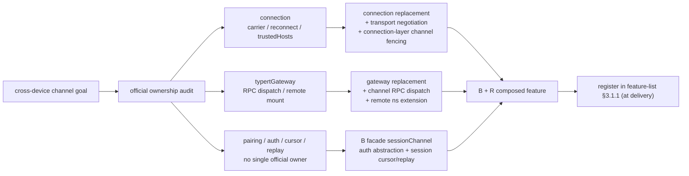

# Stage 2 - Design

## Status

SPEC1 Stage 0–2 修订稿：原稿（2026-08-27 批量确认门获批）结论为 **R no-go**——源码审计显示无单一官方行拥有完整认证通道语义，feature 转入 C 类上游提案（U21）。2026-08-27 用户指示改为 **B+R 混合设计**：认证抽象与 session 游标/重放机械层由 B 类门面 `pluginApi.sessionChannel` 承载，transport 载波与 channel RPC 派发由 `connection`/`gateway` 两个 R 替换包承载，跨组件协同在 feature-list §3.1.1 报备登记。本批仅修订 goal/requirements/design 三份制品，不产出 Tasks；修订稿待用户确认。

本设计复用原稿的源码审计证据（owner 分布与 `trustedHosts` 语义不变），但把实现路径从"纯 R 单行替换"改为"B+R 混合"。原稿的 channel contract 从"只供上游讨论"改为"B 门面可实现的契约"；认证部分以可插拔抽象落实，不伪造 replacement 边界。

## Overview

`remote-session-channel` 的目标是跨设备 pairing、授权、transport negotiation、session subscription、ack、heartbeat、断线恢复、replay 和 revoke 的统一契约。源码审计（沿用原稿，安装版本 `0.1.0-rc.6`）显示当前运行时没有一个官方组件 row 同时拥有这些语义：

- `@deepseek-ai/dsh-api-gateway` 的 `typertGateway` 负责 Typert Remote descriptor dispatch，并通过现有 `connection` carrier 暴露 `/api` RPC；
- `@deepseek-ai/dsh-host-apiproxy` 的 `apiProxy` 负责 transport-agnostic business API，但明确不注册 physical routes；
- `@deepseek-ai/dsh-client-connection` 的 `connection` 负责 HTTP-up/WebSocket-down、`/api/events.mux`、`/api/events.host`、pump/reconnect 和 DNS-rebinding trust fence；
- `@deepseek-ai/dsh-host-webserver` 负责物理 HTTP/upgrade route；
- `dsh-api-gateway` client half 负责 `remote.<namespace>` mount 和 generated descriptor invocation。

尤其是 `dsh-client-connection/lib/index.js` 的官方注释明确说明 `trustedHosts` 是 DNS-rebinding fence、**不是 authentication**。`dsh-api-gateway` 当前使用 `{ authority: "trusted-host" }` 作为连接/route gate，不提供跨设备身份、pairing、device authorization、resume token、replay authorization 或 revoke 语义。

**结论：纯 R 单行替换仍然不可行**（无单行拥有认证语义），但 **B+R 混合可行**：把"无官方 owner 的语义"（配对、设备认证、resume 凭证、逐方法授权、撤销）交给 B 类门面的可插拔认证抽象，把"有真实官方 owner 的语义"（transport 载波、channel RPC 派发）交给对应组件的 R 替换包。R 包不伪造认证，B 门面不依赖任何官方行"本来就有"认证。

## Architecture



### Current owner audit

| Official row/package | Current service or responsibility | What it proves | Role in B+R design |
|---|---|---|---|
| `typert-gateway` / `@deepseek-ai/dsh-api-gateway` | service `typertGateway`; descriptor collection, `/api` RPC claim/dispatch, generated client `remote` service | owns RPC dispatch and Remote namespace mounting | **R 替换目标（gateway 包）**：复刻契约后增加 channel 方法 RPC 派发与 remote 命名空间扩展 |
| `api-gateway` / `@deepseek-ai/dsh-host-apiproxy` | service `apiProxy`; transport-independent session/agent/business API | owns business API composition; no physical routes | 不替换；不承载 channel auth 语义 |
| `connection` / `@deepseek-ai/dsh-client-connection` | `/api`, `/api/events.mux`, `/api/events.host`, WebSocket downlinks, reconnect pump and `trustedHosts` fence | owns physical client carrier and browser reconnect loop; no authentication | **R 替换目标（connection 包）**：复刻契约后增加 transport 协商与连接层 channel 代次围栏 |
| `webserver` / `@deepseek-ai/dsh-host-webserver` | physical HTTP and upgrade route registration and fallback seat | owns route binding; transport plumbing only | 不替换；框架/transport 语义不 R（R9） |
| 配对/设备认证/resume 凭证/逐方法授权/撤销 | 无单一官方 owner | 不存在可复刻的认证契约 | **B 类门面**：可插拔 verifier/pairing/authorizer 抽象 |
| session 游标/ack/重放窗口 | 官方 `session/*` 事件与 `sessions` 服务存在，无 channel 级消费契约 | 事件流有官方 owner，channel 消费语义无 owner | **B 类门面**：基于官方 session 事件 B 类实现 |

Evidence（沿用原稿）：`dsh-api-gateway/lib/index.js:49-63` 和 `:87-123`，`dsh-api-gateway/lib/client.js:14-45`，`dsh-host-apiproxy/lib/index.js:5573-5580` 和 `:5590-5639`，`dsh-client-connection/lib/index.js:485-498` 和 `:530-586`，`dsh-web-app/cordis.patch.yml:97-165`，`dsh-base/cordis.patch.yml:36-37`（`typert-gateway` 行身份登记处）。

### Why pure R is not selectable, why B+R is

一个有效 R 替换包必须完整复刻其替代的官方行（一个或多个）的 ctx 服务面与事件面契约，把该包新增语义留在同一官方组件包内；一个 feature 可由分属多个官方组件的 replacement 包协同实现（须在 feature-list §3.1.1 报备登记）。对 session-channel 来说，纯 R 路线无法成立：

1. 配对与授权设备状态——无官方 owner；
2. 认证与逐方法授权——无官方 owner；
3. transport 协商——部分属于 `connection`，但不完整；
4. channel/session generation 与 presence——无 channel 级 owner；
5. replay window、cursor、ack、resume token——无 channel 级 owner；
6. host 序列化前脱敏——分散在各 business API；
7. client 侧 resume/reconnect 契约——分属 `connection` 与 `gateway`；
8. revoke 与 stale-connection fencing——无 owner。

若只替换 `typert-gateway`，物理载波、配对状态与 reconnect ownership 落在替换之外；只替换 `connection` 会侵入业务授权与 session replay；只替换 `apiProxy` 会侵入 route 与 client carrier ownership；替换 `webserver` 是框架/transport 替换而无业务契约。把认证语义硬塞进任何一个 replacement 包，等于"伪造 replacement 边界"（goal 逃生条款禁止）。

**B+R 混合把问题拆成两半**：

- **无官方 owner 的语义 → B 类门面**。认证不是"复刻官方契约后增加接口"，而是"用官方已有服务/钩子自己构建的 facade"。B 类门面是插件 API 面的正常形态（如既有 `remote.publish`、L2 admission），不涉及 replacement，不需要官方行"本来就有"认证。安全性由注册进门面的第三方 verifier/authorizer 链决定，门面本身只做强制执行管道（enforcement plumbing）。
- **有真实官方 owner 的机械语义 → 两个 R 替换包**。`connection` 包在官方载波契约之上增加 transport 协商、连接层 channel 代次围栏与 carrier 级 resume 再附着（载波归属 `dsh-client-connection`，这是它的真实职责）；`gateway` 包在官方 descriptor/RPC 契约之上增加 channel 方法 RPC 派发与 remote 命名空间扩展（RPC 派发归属 `dsh-api-gateway`，这是它的真实职责）。每包只复刻自己组件的官方行、不跨组件（此处"不跨组件"指单个 replacement 包的 scope 限于其所属官方组件；feature 整体可跨组件协同，须在 feature-list §3.1.1 报备登记），不伪造认证。

> 说明（Why-pure-R 清单第 8 条与切片分配的衔接）：连接层代次围栏（transport 级 stale guard）是 `connection` 组件的真实职责，因此由 connection R 包提供；但 revoke 决策与 channel 级 generation 仍无官方 owner，归属 B 门面。

## B Facade: `pluginApi.sessionChannel`

B 门面是 host 插件在官方服务之上的门面转译，使用现有官方服务/钩子构建，不是 replacement。它不替代任何官方行，不修改官方包文件。

### 公开面（语义形状，非冻结 wire schema）

主控制面（mutation/control face）：

```text
sessionChannel.open({
  device,
  capabilities,
  session?,
  resumeToken?,
  clientNonce?
}, signal?)
  -> OpenedChannel | typed denied/error/unavailable result

sessionChannel.subscribe({
  channelId,
  session,
  cursor?,
  eventTypes?,
  redactionProfile?
}, signal?)
  -> Subscription | resync-required | typed denied/error result

sessionChannel.ack({
  channelId,
  subscriptionId,
  cursor,
  dedupeKeys?
}, signal?)
  -> AckedCursor | typed stale/denied/error result

sessionChannel.resume({
  channelId,
  resumeToken,
  session,
  cursor
}, signal?)
  -> ResumedChannel | resync-required | typed denied/error result

sessionChannel.revoke({
  device,
  channelId?,
  reason
}, signal?)
  -> Revoked | typed denied/error result
```

只读投影/事件面（read-only projection/event face）：

```text
sessionChannel.observe({ channelId? , session? })
  -> frozen snapshot { channels, subscriptions, connectionState }

sessionChannel.onChange(listener)
  -> disposer          # 通道/订阅/连接状态变更通知
```

### 认证抽象（可插拔，范式无关）

认证是 B 门面的核心职责，但**门面不实现任何具体范式**。它提供三个注册接口，第三方插件按自己的范式注册，门面只保证"没有注册链就不放行"：

```text
sessionChannel.auth.registerVerifier({
  id,
  verify(deviceCredential, context) -> { deviceId, scope } | { denied, reason }
}) -> disposer

sessionChannel.auth.registerPairingProvider({
  id,
  initiate(device, context) -> { pendingToken } | { denied },
  approve(pendingToken) -> { deviceCredential },
  reject(pendingToken) -> void
}) -> disposer

sessionChannel.auth.registerAuthorizer({
  id,
  authorize({ deviceId, scope, method, session, channel }) -> allow | { deny, reason }
}) -> disposer
```

- **门面不耦合任何范式**：approval、PIN、二维码、token、自定义流程都可通过 `registerPairingProvider`/`registerVerifier` 表达；具体范式、凭证格式、存储位置由第三方插件决定。门面提供的只是"身份 + 凭证 + 方法级授权"的执行管道与 channel 生命周期钩子。
- **fail-closed**：未注册任何 verifier 时，`open` 返回 typed `unavailable`，绝不退回未认证通道。
- **组合策略（默认 fail-closed AND）**：多个 verifier/authorizer 注册时，默认全部通过（AND）才放行；同一 `id` 重复注册替换旧链；按注册顺序调用。希望 OR/自定义组合的第三方可注册单个 verifier 在内部实现自己的组合，门面不限制范式。
- **配对→验证交接契约**：`approve(pendingToken)` 返回的 `deviceCredential` 是 `verify(deviceCredential, context)` 的输入；`pendingToken` 是配对提供方内部不透明值，门面不解释其内容。配对状态迁移由注册链 owner 完成，门面只接收最终验证结果。
- **信任模型声明**：门面文档必须写明——认证强度由第三方注册链决定，门面不提供内置安全保证；`trustedHosts`/`authority: trusted-host`/任何 carrier 信任都不是设备认证。
- 门面可用官方 `approval`、`userQuestions`、`credentials`、`settings` 作为注册方的构建材料，但不强制；注册方也可完全自建。

### Session 游标/重放机械层（B 类实现）

门面基于官方 session 事件流（`pluginApi.session` 生命周期事件、`sessionEventTypes`、官方 `sessions` 服务）实现 channel 级消费语义：

- **游标与订阅**：`subscribe` 从请求 cursor 之后开始投递；`ack` 在同一 channel generation 内单调推进 watermark；游标越界/超出保留窗口返回 `resync-required`，不伪造缺失事件。
- **投递与去重**：at-least-once；每个事件带稳定 event id + dedupe key；重连后重复帧由客户端按 key 折叠。
- **重放窗口**：有界保留窗口；`resume` 验证 token/device/session/generation 后在窗口内从 cursor 重放；窗口外返回有界、已脱敏的 snapshot resync。
- **presence/heartbeat**：只更新本 channel generation，不复活已撤销/过期通道。

### 代次围栏、脱敏、审计、取消

- **代次围栏**：channel/revocation generation 采用 latest-wins；旧代 subscribe/ack/heartbeat/replay/transport 回调失去提交资格。连接层代次围栏由 connection R 包提供（见下），channel 级围栏由门面维护。
- **脱敏**：host 序列化前按 session scope、per-method authorization 与受众 redaction profile 脱敏；redaction 失败 fail-closed 省略字段；token/凭证/未脱敏日志/无关 session 数据永不上 wire。
- **审计**：channel 生命周期/授权变更 append bounded audit（who/what/when/generation），不含原始 token 与 session 内容。
- **取消**：`AbortSignal`/revoke 取消传播到订阅、当前 transport 与 replay；已提交终态不被重写；disposer 幂等且只撤销本 channel identity 拥有的资源。
- **终态词汇**：`success|error|aborted|denied|superseded`；timeout 归 `error`+reason；cursor gap 是 typed `resync-required`，不是成功空重放。

## R Slices

### `connection` replacement package

- **复刻契约**：官方 `connection` 行（`dsh-client-connection`）的完整服务/事件面——`/api`、`/api/events.mux`、`/api/events.host`、WebSocket downlinks、reconnect pump、`trustedHosts` DNS-rebinding fence、host 与 client 两半面。
- **增加切片**：
  - transport 协商：在官方已支持载波（websocket/sse/polling/loopback）中只协商已通告且已授权的 transport；transport 选择不是授权，授权必须先于敏感 channel 打开；
  - 连接层 channel 代次围栏：连接层维护 channel 绑定的 generation，revoke/supersede 后旧连接代次失去提交资格；
  - carrier 级 resume 传输再附着：为 resume 提供传输层再附着原语（channel/session 语义由 B 门面拥有）。
- **边界**：不实现设备认证、不解释 `trustedHosts` 为认证、不承载 session cursor/replay 语义；这些属于 B 门面。
- **client 半面**：官方 `connection` 的 client manifest 与 browser reconnect 状态为正（RSC-R11），本包须按 R8 自带完整 client 半面构建。
- **运行时身份**：`@deepseek-ai/dsh-plugin-api-session-channel-connection`（row `plugin-api-session-channel-connection`，唯一 owner `@deepseek-ai/dsh-client-connection`）。
### `gateway` replacement package

- **复刻契约**：官方 `typert-gateway` 行（`dsh-api-gateway`）的完整服务/事件面——descriptor collection、`/api` RPC claim/dispatch、generated client `remote` service、host 与 client 两半面。
- **增加切片**：
  - channel 方法 RPC 派发：把 `sessionChannel.open/subscribe/ack/resume/revoke` 作为经官方 RPC carrier 进出的 channel 方法面，带 descriptor 校验与调用边界；
  - remote 命名空间扩展：在既有 `remote` 之上提供 channel 专用 remote 命名空间（host 注册 + client mount），channel 状态投影与配对 UI 可经此暴露。
- **边界**：gateway 包只做 RPC/remote 派发管道，channel 语义（auth、cursor、replay、revoke 决策）全部由 B 门面拥有；不复制第二份 channel 状态。
- **client 半面**：官方 `gateway` 的 client manifest 与 `remote` mount 为正（RSC-R11），本包须按 R8 自带完整 client 半面构建。
- **运行时身份**：`@deepseek-ai/dsh-plugin-api-session-channel-gateway`（row `plugin-api-session-channel-gateway`，唯一 owner `@deepseek-ai/dsh-api-gateway`）。
- **与 ST4 观察项的关系**：capability-strategy §6 的 ST4（settings remote 原生绑定）观察项注明"仅在其他理由已 fork typert 相关行时合并评估"。本包正是 `typert-gateway` 行的 fork，但 ST4 明确不在本 feature 范围内、不随本包实现，也不构成对 `dsh-api-gateway` 的第二个竞争 replacement（R6 唯一 owner 仍为 gateway 包）。

### 装配与登记

- 两个 R 包经官方 patch 机制各 disable 一行（`connection`、`typert-gateway`）并插入对应替代行；B 门面是主包门面能力（`pluginApi.sessionChannel`），不是 replacement。
- 跨组件 feature 在 feature-list §3.1.1 报备登记（Feature=`remote-session-channel`，协同 replacement 包 = connection + gateway 两个 R 包；B 门面为 coordinating 非 replacement 组件，不占 replacement 包列）。登记是交付期任务（RSC-R13/RSC-R14），随 Stage 4 落实，不是当前状态。
- 全量聚合 bundle 与选择性安装（main + 两个 R 包）必须装配出同一组替代行、同一行为；任一 R 包缺失时 B 门面把对应切片报为 `unavailable`，不宣称完整 channel。
- 各包版本协商与主包一致（runtime 全量 identity + `dsh.api` major.minor）；不一致只停用本 feature 对应 R 特性。
- **跨包协调机制（Stage 3/4 已知协调点）**：B 门面与两个 R 包共享 channel identity/generation 词汇（RSC-R14）——具体接线（如连接层如何查询/订阅 B 门面的 channel generation、gateway 如何把 channel 方法路由到 B 门面）在 Stage 3/4 以共享 service/symbol 或门面提供 hook 的方式定义，本 Stage 只冻结语义边界。

## Hook and Ownership Classification

| Semantic area | Current mechanism/evidence | Classification in this Design | Decision |
|---|---|---|---|
| Typert Remote descriptor dispatch | `typertGateway` claims and invokes generated Remote methods | A / existing official owner | **gateway R 包**：复刻后增加 channel 方法 RPC 派发 |
| Business API composition | `ctx.apiProxy` from transport-agnostic `dsh-host-apiproxy` | A / existing official owner | Do not replace; no channel auth semantics here |
| Physical HTTP and WebSocket carrier | `connection` + `webserver` | A / existing official owners | **connection R 包**：复刻后增加 transport 协商与连接层代次围栏；`webserver` 不 R |
| `trustedHosts` | explicit DNS-rebinding fence comment in connection package | A evidence / security boundary | Not authentication; B 门面不得解释为设备认证 |
| Pairing and authorized devices | no single current owner | C 语义 / **B 门面可插拔实现** | 由 `registerPairingProvider`/`registerVerifier` 落实，范式由第三方决定 |
| Cross-device authentication | no current stable auth layer | C 语义 / **B 门面可插拔实现** | 由注册链落实；无注册链 fail-closed `unavailable` |
| Resume token, replay window and cursor ack | no owner spanning host state and client reconnect | C 语义 / **B 门面 B 类实现** | 基于官方 session 事件流实现；resume 凭证绑定注册链 |
| Channel generation and stale connection fencing | connection has local reconnect generation, not authenticated channel epoch | 部分归属 connection | connection R 包提供连接层代次围栏；channel 级 generation 由 B 门面维护 |
| Host redaction and per-method business authorization | scattered business APIs, no channel-wide contract | C 语义 / **B 门面** | 门面序列化前脱敏 + 注册 authorizer 链逐方法授权 |
| `remote.publish` / client `$mount` | UI/config and generated remote contribution mechanisms | B/A interop | gateway R 包复用为 channel remote 命名空间；不发明新协议 |
| Future complete authenticated channel owner | missing | C, conditional R candidate | upstream 提供完整 host/client owner 后 B 门面退役（U21） |

## Client-Half Audit

原稿六项检查在现有分布式 remote stack 中为正，且分散在不同官方包。B+R 下逐层归属：

| Check | Evidence | 归属 |
|---|---|---|
| client manifest | `dsh-api-gateway` 与 `dsh-client-connection` 均声明 `dsh.client` | 两个 R 包各自按 R8 自带 client 半面 |
| remote namespace | `dsh-api-gateway/lib/client.js` 构造 client `remote` 并支持 `$mount` | gateway R 包增加 channel remote 命名空间 |
| slot/settings bridge | 无完整 channel 专用 slot/settings bridge（扫描范围同原稿） | 本 feature 不需要；配对 UI 经 channel remote 暴露 |
| host-client version negotiation | Typert descriptors/protocol + connection metadata 存在，无 channel 协议版本契约 | B 门面定义 channel 契约版本；R 包沿用官方版本协商 |
| browser state/reconnect | `ConnectionController` 拥有 browser pump/reconnect generation 与 carrier state | connection R 包 client 半面 |
| client-facing event/service | client `remote` service + connection carrier events/services | 分属 gateway/connection 两个 R 包，各自 client 半面 |

B 门面本身的可选 client publication（配对状态、设备管理 UI）经 gateway R 包的 channel remote 命名空间暴露，门面不在两侧复制 channel 状态（RSC-R11 AC3）。

## Data Models

以下为 B 门面与 R 包的语义形状（semantic shapes），不是冻结 wire schema。记录按存储 scope 分离，任何单条记录不静默跨档。

### Profile-scoped authorization records（契约形状，存储归注册链）

本节的 DeviceAuthorization 是**门面与注册链之间的契约形状**：注册链的授权记录须满足这些字段以与门面互操作；实际持久化、配对状态迁移与凭证存储由注册链 owner 负责。门面本身不持久化任何授权记录，只消费注册链暴露的最小验证结果与代次信息。

```text
DeviceAuthorization {
  deviceId: durable identity
  profileId: durable profile identity
  pairingState: pending | authorized | revoked
  authorizationGeneration: owner-specific opaque token
  capabilities: declared bounded capabilities
  createdAt: timestamp
  updatedAt: timestamp
  revokedAt?: timestamp
}
```

配对材料与 resume 凭证材料是认证注册链的私有安全值；记录只存该 owner 所需的最小 hash/reference，原始配对码、bearer token、私钥不得进入 session 事件、诊断或 browser projection。撤销为 profile 级并递增 authorization generation，旧 channel 无法重获资格。

### Session-scoped channel and replay records（B 门面）

```text
ChannelRecord {
  channelId: durable channel identity
  sessionId: existing session identity
  deviceId: profile authorization identity reference
  channelGeneration: owner-specific opaque token
  lifecycleState: opening | active | suspended | revoked | expired
  redactionProfile: bounded non-secret policy id
  createdAt: timestamp
  expiresAt: timestamp
}

SubscriptionRecord {
  subscriptionId: channel-local identity
  channelId: channel identity
  sessionId: session identity
  subscriptionGeneration: owner-specific opaque token
  nextCursor: opaque cursor
  ackedCursor: opaque cursor
  eventTypes: bounded allowlist
  lifecycleState: active | resync-required | revoked | expired
}

ChannelEventEnvelope {
  eventId: stable event identity
  dedupeKey: stable delivery key
  sessionId: session identity
  channelGeneration: opaque current epoch
  cursor: opaque ordered position
  kind: bounded event kind
  payload: host-redacted projection
  emittedAt: timestamp
}
```

channel/replay 记录为 session 级，可引用 profile 授权身份，但不复制 profile 密钥或官方 transcript。

### Ephemeral connection state（connection R 包）

```text
ConnectionState {
  transport: websocket | sse | polling | loopback
  connectionGeneration: owner-specific opaque token
  channelGeneration: opaque bound epoch
  lastHeartbeatAt: timestamp
  reconnectAttempt: bounded integer
  abort: AbortSignal
}
```

连接状态是进程/browser 运行时状态，不是 durable lock 或 session transcript。重连可创建新的 transport generation 而保留有效 channel identity；revoke/supersede 使 channel generation 失效，旧回调不得写新状态。

### Terminal outcomes and cursor gaps

channel 操作使用共享终态词汇 `success|error|aborted|denied|superseded`；timeout 为 `error`+reason，不是新终态类别。cursor gap 是 typed `resync-required`，不是成功空重放。channel/subscription 终态提交后，迟到帧或回调不得重写。

## Error Handling and Guard Strategy

### Auth fail-closed

未配置任何 verifier 时，`open` 返回 typed `unavailable`。门面不把 `trustedHosts`/`{ authority: "trusted-host" }`/任何 carrier 信任当作设备认证；一个在允许 DNS 名上的 host 不等于已配对设备、已授权 session 参与者或 resume token 持有者。门面不创建"自称已安全"的通道——认证强度由注册链决定并在文档声明。

### 多步操作原子性

`open`/`resume` 等多步 channel 操作以原子方式提交或回滚：auth 验证失败、channel 记录创建失败或订阅装配失败时，不得留下半创建的 channel/subscription 对外可见（durable-state §2 fail-closed 等价）。

### 逐方法限流

B 门面对每个 channel 方法声明有界 rate limit：调用方超限时返回 bounded typed `rate-limited`，不创建 channel、不推进 cursor；未显式声明的方法使用文档化默认界，绝不 fail-open（RSC-R16）。

### R 包激活 gate

每个 R 包激活须满足：

1. 官方行 disabled 恰好一次、替代行 active 恰好一个、无竞争 owner、必需服务/route 探针通过；
2. runtime 与官方包版本与替代包锁完全一致；
3. 契约复刻探针（官方 `connection`/`typert-gateway` 的服务/事件/route/失败语义）通过；
4. client 半面构建与装配验证通过（R8）。

任一 gate 失败 → bounded typed diagnostic + 正常 return 的 fail-safe apply + 无 channel 能力。R 包不得猜测 owner 顺序、不得把多行合并成隐藏 replacement、不得退回未认证 transport。

### B 门面激活 gate

1. 必需的 session 观察钩子与 auth 注册接口可用；
2. 已登记 feature 级装配（feature-list §3.1.1）；
3. 信任模型与认证抽象已文档化。

任一 gate 失败 → 门面 inert + typed diagnostic，不挂载 channel 能力。

### Typed failures

channel 契约使用稳定、provider 中立的错误码：

```text
invalid-input
pairing-required
device-denied
session-denied
channel-expired
channel-revoked
resume-rejected
cursor-gap
resync-required
transport-unavailable
rate-limited
stale-generation
superseded
aborted
timeout
internal
```

错误 payload 只暴露 bounded code、安全 message 与非 secret 细节。原始 token 材料、授权头、异常 cause、私有设备数据、未脱敏业务 payload 一律省略。认证失败不得泄露无关设备或 session 是否存在。

上述 typed code 是**诊断码**，全部归入共享终态词汇（RSC-R14 AC4）：`superseded`/`aborted` 码 1:1 对应同名终态；`timeout` 的终态是 `error`+reason；`denied` 变体归 `denied`；`resync-required`/`cursor-gap` 是 channel 消费语义结果而非终态类别。绝不引入第二套终态词汇（identity-and-lifecycle §3）。

### Concurrency, cancellation and stale callbacks

门面组合 caller cancellation 与本地 channel/reconnect cancellation；不把上游 `AbortSignal` 替换为无关的本地 signal。父 channel 取消传播到订阅、当前 transport 与 replay；子订阅失败不撤销父设备，除非认证 owner 显式声明该关系。

发送帧、推进 ack、提交 replay cursor、发布 presence、完成 revoke 前检查：

- 设备授权 generation 是否最新；
- channel/subscription generation 是否仍匹配；
- connection generation 是否仍附着于该 channel（connection R 包提供）；
- 操作是否已提交终态；
- 目标 session 与授权 scope 是否仍有效。

新 channel/revocation generation 用 latest-wins。旧连接可被 abort，但正确性来自 generation 检查而非假设 socket 立即关闭。迟到网络帧只作 bounded 诊断丢弃或保留，不能推进当前 cursor、发布当前事件或调用新 owner 的 disposer。channel disposer 幂等，只撤销本 channel identity 拥有的资源；stale disposer 不能 dispose 新 channel 或其他 owner 的资源。

### Retry and replay

重试按操作有界。transport reconnect 仅在 channel 授权、deadline 与 generation 仍有效时重试打开载波。`ack` 对同一 channel/subscription/cursor 幂等，superseded/revoked generation 后不自动重试。`resume` 只在显式声明的有界能力下重试，绝不扩大 session scope。`denied`/`aborted`/`superseded`/无效 cursor 不自动重试。

**执行层 vs attempt 层（durable-state §3 / concurrency §7）**：transport reconnect 与 resume 重试是**内部重试**——复用同一操作执行身份并新增 attempt（每次 attempt 有独立取消语义）；每次外部 `open`/`resume` 调用创建新的执行；`ack` 幂等把重复 attempt 折叠为同一执行内的去重，而不是创建新执行。重试有界：显式 count/backoff/deadline，超界停止并返回 `error`。

Replay 为 at-least-once。Dedupe 不合并外部 execution identity，不把旧连接变成当前授权。Snapshot resync 是对 cursor gap 的唯一接受响应；服务端不静默重放无界历史。

## Testing Strategy

### R 包契约保真测试（connection / gateway）

- 每个 R 包：官方行 disabled 恰好一次、替代行 active、无竞争 owner、版本/runtime/package 锁、必需契约探针通过；
- 官方 fidelity：`connection` 的 `/api`、events.mux/host、WebSocket downlink、reconnect pump、`trustedHosts` fence 语义与 `typert-gateway` 的 descriptor/RPC/remote mount 语义在替代行下保持兼容；
- 增量切片：transport 只协商已通告且已授权 transport、连接层代次围栏阻止旧连接代次写回、channel 方法经 RPC 派发正确路由到 B 门面；
- client 半面：两个 R 包各自的 browser bundle 覆盖 transport 选择、reconnect、channel remote mount 与 schema 校验。

### B 门面测试

- Auth fail-closed：无 verifier → `open` 返回 `unavailable`；已注册链 → 只有链通过才建 channel；`trustedHosts`/carrier 信任不被当作认证；
- 可插拔性：不同配对/验证/授权范式（approval/PIN/QR/token/custom）经注册接口可替换实现，门面不耦合任何单一范式；
- 游标/投递：at-least-once 重复帧按稳定 key 去重；ack 单调；窗口外 cursor 返回 `resync-required`；resume 不静默跳过 gap；
- 生命周期：heartbeat 过期、断线、重连、revoke、新 channel generation 使旧回调失效并阻止旧连接写当前状态；
- 取消/重试：caller abort 传播、deadline 产生 `error`/`timeout`、denied/aborted/superseded 不重试、transport 重试有界；
- 脱敏：host 序列化前脱敏；redaction 失败 fail-closed；browser artifact 无 secret/exception cause；
- 迁移：代表性 remote UI 可把私有 pairing/ack/resume 实现替换为 channel 契约，而不改变无关 `remote.$mount` 或普通 settings bridge。

## Standards Alignment

### `capability-strategy.md`

R1–R9 逐包适用于两个 R 替换包（每个包只归属唯一官方组件、只复刻该组件官方行、R4/R5/R6/R8 各自落实）。R7 按包落实：connection/gateway 各登记覆盖自身切片的 U-series 提案（U22/U23）与退役条件，feature 级 U21 覆盖认证通道整体。B 门面不是 replacement，遵循门面规则。跨组件 feature 在 feature-list §3.1.1 报备登记。R9 排除 boot glue、webserver 框架语义与 Cordis dispatch 变更。认证语义永不进 R 包（由 B 门面可插拔抽象承载）。

### `api-shape.md`

channel 生命周期/控制面是主 mutation face；订阅/事件投递是只读 projection face。投影不能 ack、revoke、授权或改状态。授权经显式 request/device/session 输入与注册 authorizer 链，不读 facade 隐藏可变状态。B 门面不固定范式，符合"一个 feature 可含多个独立 owner 的面"先例。

**smell 判据 1 显式对照（api-shape §4）**：`sessionChannel` 命名空间同时出现 register（auth 注册）、query（observe/onChange）、mutate（open/subscribe/ack/resume/revoke），但三者是独立 owner 与独立状态空间——(1) auth 注册链是**策略面**，owner 是注册表本身，只在显式决策点被调用、输入全部显式传入、绝不读 facade 隐藏可变状态；(2) channel 生命周期是**唯一 mutation 面**，owner 是 channel/subscription 记录；(3) observe/onChange 是**纯 projection**，只读上述记录。三面无共享私有状态，各自独立 guard（对齐 llm 命名空间内 modelInfo 投影 / admission 策略 / stream 直通并存的先例）。

### `identity-and-lifecycle.md`

Device authorization、channel、subscription、connection generation 均为 owner 特定 opaque token，不跨 owner 比较。channel lifecycle state 与 terminal outcome 分离。终态词汇 `success|error|aborted|denied|superseded`；timeout 归 `error`+reason。revoke/新 generation 使旧工作 superseded，迟到回调不能重写已提交终态。

### `durable-state-and-scope.md`

profile 级 device authorization、session 级 channel/replay 记录、ephemeral connection state 分离，无记录静默跨档。durable mutation 要求 identity、generation、commit state、fail-closed unknown 与 bounded audit。replay/resume 声明有界重试；denied/aborted/superseded 不自动重试。不复制官方 transcript。

### `visibility-and-redaction.md`

B 门面在 wire 序列化前授权并脱敏。client payload 只含 UI/channel projection；凭证、resume secret、私钥、异常 cause、未脱敏日志、无关 session 数据不上 wire。redaction 失败 fail-closed。channel 错误不泄露无关设备/session 存在性。两个 R 包的自建 client 半面同时受 visibility-and-redaction §4（client 受众）约束：host 在 wire 序列化前脱敏、client 只做形状再校验（不承担脱敏）、channel-remote payload/console/通用字段不得携带 secret 材料（RSC-R8 AC4 落实）。

### `concurrency-and-cancellation.md`

latest-wins channel/revocation generation、identity-bound subscription、取消传播、stale-frame 检查、有界 reconnect/resume 重试。transport 关闭是 best-effort，correctness 由 generation 检查提供。旧 disposer/callback 不能 mutate 新 channel 或调用其他 owner。现有 connection reconnect state 不升级为认证身份。

**channel generation 单一权威 owner（concurrency §1.4）**：B 门面是 channel generation 的唯一权威 owner；connection R 包的 `ConnectionState.channelGeneration` 只是 transport 本地围栏用的只读 opaque 绑定（只与自身比较、不做 channel 生命周期决策），不得被读作第二个并发语义 owner。

## Requirements Traceability

| Requirement | Design location | Status / verification anchor |
|---|---|---|
| RSC-R1 | Assembly & registration; R1 | Two rows disabled (`connection`, `typert-gateway`), two replacement rows inserted; full vs selective assembly identical |
| RSC-R2 | R Slices (per-package fidelity) | Each R package preserves its own official row contract; B 门面 inert 时 R 包不发布 channel 能力；fidelity 不可证明时对应切片暂停并登记为 C 类 |
| RSC-R3 | R 包激活 gate / B 门面激活 gate | Boot 自检 + fail-safe 正常 return；无竞争 owner；门面缺钩子则 inert |
| RSC-R4 | Assembly & registration; R4/R5 | 逐包版本/owner 锁定；跨包版本一致，不一致只停用本 feature R 特性 |
| RSC-R5 | B Facade: auth abstraction + channel lifecycle | 注册链验证后才建 channel；无 verifier fail-closed `unavailable`；revoke/expire 使旧 generation 失效；不固定范式 |
| RSC-R6 | B Facade: session cursor/replay mechanics | subscribe/ack/dedupe/resync-required 语义按官方 session 事件流实现 |
| RSC-R7 | B Facade + connection R slice | resume 验证链 + 窗口内重放；窗口外 bounded snapshot；transport 只协商已通告且已授权 |
| RSC-R8 | B Facade: redaction/audit + client-half §4 | 序列化前脱敏；fail-closed；bounded audit（who/what/when/generation）；client 半面 host 脱敏、client 只做形状再校验（RSC-R8 AC4） |
| RSC-R9 | Error handling: concurrency/cancellation + timeout + child isolation | latest-wins generation、取消传播、幂等 disposer、stale guards；timeout 归 `error`+reason（AC5）；子订阅失败不撤销父设备（AC6） |
| RSC-R10 | Data models / Retry and replay | 单 scope 分档、有界重试、能力声明 |
| RSC-R11 | Client-half audit | 两个 R 包各自 R8 client 半面；B 门面不复制 channel 状态 |
| RSC-R12 | Upstream proposals (U21/U22/U23) | 上游等价契约出现后按 per-package 退役条件（U21 → B 门面退役，U22 → connection R 退役，U23 → gateway R 退役） |
| RSC-R13 | Architecture / R Slices / B+R boundary | 一个 B 门面 + 两个 R 包；无 owner 语义进 B 可插拔抽象，有 owner 语义进对应 R 包 |
| RSC-R14 | Assembly & registration + shared vocabulary | 共享 channel identity/generation 词汇与 feature-list §3.1.1 登记；缺失 slice 报 `unavailable`；共享终态词汇（AC4） |
| RSC-R15 | B Facade: auth abstraction + trust model + composition | `trustedHosts`/carrier 不作认证；无注册链 fail-closed；门面不宣称内置安全保证；接口范式无关；fail-closed AND 组合策略（AC5）；认证失败不泄露存在性（AC6） |
| RSC-R16 | Error handling: typed failures / B 门面 rate limiting | Per-method 有界限流；超限返回 `rate-limited`，不建 channel/不推进 cursor；未声明时用文档化默认界且不 fail-open |

## Upstream Proposal and Retirement

登记上游提案（feature 级 U21 + 每 replacement 包各一条 U22/U23，capability-strategy R7）：

- **U21: official authenticated remote session/channel owner**（feature 级）——单一官方组件包与 loader row 完整拥有配对、设备授权、方法级权限、现有载波上的 transport 协商、channel/session generation、heartbeat、订阅、cursor/ack、有界重放、resume token、snapshot resync、revoke、wire 前脱敏与 client reconnect 语义。出现后 B 门面标记退役、消费者迁移官方 seam。
- **U22: official connection carrier transport/fencing seam**（connection R 包）——官方 `dsh-client-connection` 原生提供 transport 协商与连接层 channel 代次围栏（或等价公开 seam）。出现后 connection R 包 deprecate/退役。
- **U23: official gateway channel RPC/remote dispatch seam**（gateway R 包）——官方 `dsh-api-gateway` 原生提供 channel 方法 RPC 派发与 channel remote 命名空间（或等价公开 seam）。出现后 gateway R 包 deprecate/退役。

**U21/U22/U23 的新定位**（用户 2026-08-27 确认）：U21 不再阻塞 channel 交付——B 门面在 upstream 到来前提供可用的可插拔通道。官方运行时提供等价契约后按上述各自退役条件迁移消费者；任何在 upstream 稳定 owner 出现后的本地 R 仍是临时 workaround，须在消费者可无损失迁移后移除。

## Decision Points

1. **B+R 取代纯 R**：认证抽象与 session 机械层由 B 门面承载（非 replacement）；transport/RPC 机械层由 `connection`/`gateway` 两个 R 包承载（每包只归属唯一官方组件）。不再尝试"选一行容纳全部语义"或"伪造 replacement 边界"。
2. **`trustedHosts` is not auth**：trusted DNS/host 访问与 `authority: "trusted-host"` 不是配对或跨设备授权；B 门面不得解释为认证。
3. **Auth fail-closed**：未注册 verifier 时 `open` 返回 `unavailable`，不提供未认证 fallback；现有 remote/config bridge 保持原样，不被广告为安全 session channel。
4. **认证范式无关**：B 门面提供通用注册接口（verifier/pairing/authorizer），不耦合任何具体范式；强度由第三方注册链决定，门面文档如实声明。
5. **少包重 B**：只做 `connection` + `gateway` 两个 R 包；session cursor/replay 由 B 门面 B 类实现，不新增 `session` R 包。
6. **Client half 逐包归属**：两个 R 包各自按 R8 自带 client 半面；B 门面不复制 channel 状态，可选 client publication 经 gateway 包 channel remote 命名空间暴露。
7. **Stage 2 boundary**：本修订稿待用户确认提交（本批不产出 Tasks）；确认即认可 B+R 方向、U21/U22/U23 新定位与 RSC-R5–RSC-R16 作为可验收需求。
