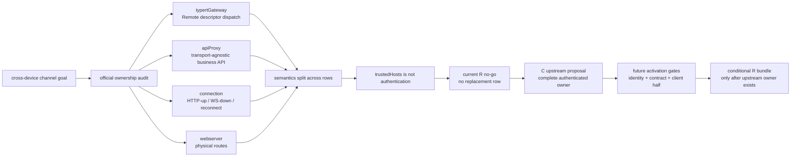

# Stage 2 - Design

## Status

Stage 2 Design：已获用户确认（2026-08-27，M6 最后批次批量确认门）；确认内容含 R no-go 结论与 U21 上游提案登记——本 feature 不产生 R 实现，Stage 3 任务限于治理/文档类（U21 登记等）并以对抗性审查为门。本文记录源码审计后的 R feasibility decision，并冻结一份只供上游讨论的 channel contract；不创建 Tasks、实现代码、package metadata、replacement row 或可执行 patch。

## Overview

`remote-session-channel` 的目标是跨设备 pairing、授权、transport negotiation、session subscription、ack、heartbeat、断线恢复、replay 和 revoke 的统一契约。源码审计显示，当前运行时没有一个官方组件 row 同时拥有这些语义：

- `@deepseek-ai/dsh-api-gateway` 的 `typertGateway` 负责 Typert Remote descriptor dispatch，并通过现有 `connection` carrier 暴露 `/api` RPC；
- `@deepseek-ai/dsh-host-apiproxy` 的 `apiProxy` 负责 transport-agnostic business API，但明确不注册 physical routes；
- `@deepseek-ai/dsh-client-connection` 负责 HTTP-up/WebSocket-down、`/api/events.mux`、`/api/events.host`、pump/reconnect 和 DNS-rebinding trust fence；
- `@deepseek-ai/dsh-host-webserver` 负责物理 HTTP/upgrade route；
- `dsh-api-gateway` client half 负责 `remote.<namespace>` mount 和 generated descriptor invocation。

尤其是 `dsh-client-connection/lib/index.js` 的官方注释明确说明 `trustedHosts` 是 DNS-rebinding fence、**不是 authentication**。`dsh-api-gateway` 当前使用 `{ authority: "trusted-host" }` 作为连接/route gate，不提供跨设备身份、pairing、device authorization、resume token、replay authorization 或 revoke 语义。因此当前 R 方向无法诚实地替换一行并复刻一个完整的认证通道。

本 Design 的结论是 **Stage 2 R no-go**：不替换 `@deepseek-ai/dsh-api-gateway`、`@deepseek-ai/dsh-host-apiproxy`、`@deepseek-ai/dsh-client-connection` 或 `@deepseek-ai/dsh-host-webserver`，不把 `trusted-host` 解释成跨设备认证，不创建自称已安全的 facade 或 replacement。RSC-R1–RSC-R4 作为未来 activation gates 保留；当前 feature 的 pairing/authenticated channel 部分登记为 C 类 upstream proposal，直到 upstream 提供一个稳定官方 owner 和完整 host/client contract。

该处置由已确认 goal 的 R-Class Boundary 逃生条款预授权（“若源码核实无法证明稳定的官方 auth/transport owner，应暂停并将该部分登记为 C 类上游提案，而不是伪造 replacement 边界”）；requirements Introduction 已将具体 row/owner/client 半面的冻结推迟到 Stage 2 源码审计，因此本 Design 在 Stage 2 执行该条款，并经下文 Decision Points 第 6 条提交人类确认门。

## Architecture and Feasibility Decision



### Current owner audit

| Official row/package | Current service or responsibility | What it proves | Why it is not the requested owner |
|---|---|---|---|
| `typert-gateway` / `@deepseek-ai/dsh-api-gateway` | service `typertGateway`; descriptor collection, `/api` RPC claim/dispatch, generated client `remote` service | owns RPC dispatch and Remote namespace mounting | no pairing, device authorization, resume/replay cursor, revoke, or authenticated business authorization |
| `api-gateway` / `@deepseek-ai/dsh-host-apiproxy` | service `apiProxy`; transport-independent session/agent/business API | owns business API composition | package documentation says it registers no physical routes; it is not a transport or authentication owner |
| `connection` / `@deepseek-ai/dsh-client-connection` | `/api`, `/api/events.mux`, `/api/events.host`, WebSocket downlinks, reconnect pump and `trustedHosts` fence | owns physical client carrier and browser reconnect loop | explicitly no authentication; no device/pairing/replay authorization or session policy owner |
| `webserver` / `@deepseek-ai/dsh-host-webserver` | physical HTTP and upgrade route registration and fallback seat（物理回退机制；静态文件由 web-runtime/frontend-static owner 承担） | owns route binding | transport plumbing only; no remote business identity or channel state |

Evidence is from the installed `0.1.0-rc.6` sources: `dsh-api-gateway/lib/index.js:49-63` and `:87-123`, `dsh-api-gateway/lib/client.js:14-45`, `dsh-host-apiproxy/lib/index.js:5573-5580` and `:5590-5639`, `dsh-client-connection/lib/index.js:485-498` and `:530-586`, `dsh-web-app/cordis.patch.yml:97-165`, and `dsh-base/cordis.patch.yml:36-37`（`typert-gateway` 行身份登记处；`dsh-web-app/cordis.patch.yml:97-165` 不含该行）.

### Why the current R target is not selectable

A valid R replacement must disable exactly one official row, insert one replacement row, preserve that row's entire service/event/route contract, and own all new semantics inside the same official component package. No current row meets all of the following simultaneously:

1. pairing and authorized-device state;
2. authentication and per-method authorization;
3. transport negotiation over the existing carrier;
4. channel/session generation and presence;
5. replay window, cursor, ack and resume token;
6. host-side redaction before serialization;
7. client-side resume/reconnect contract;
8. revoke and stale-connection fencing.

Replacing only `typert-gateway` would leave physical carrier, pairing state and reconnect ownership outside the replacement. Replacing only `connection` would cross into business authorization and session replay. Replacing only `apiProxy` would cross into route and client carrier ownership. Replacing `webserver` would be a framework/transport replacement without the business contract. Combining rows would violate the one-row/one-component R boundary and the no-cross-component replacement rule.

Accordingly, there is no approved official row id, replacement package identity, or executable patch YAML for this feature at this stage. The following shape is deliberately **not** emitted:

```yaml
# No executable patch is authorized while the official authenticated owner is unresolved.
```

Any future R implementation may publish a patch only after upstream supplies the missing owner identity and the Stage 2 design is revised and re-approved. It must then use the standard exact shape, with the upstream-confirmed values rather than values invented by this repository:

```yaml
- id: <upstream-confirmed-official-channel-row-id>
  disabled: true
- insert:
    - id: <repository-confirmed-replacement-row-id>
      name: <repository-confirmed-replacement-package>
```

## Hook and Ownership Classification

| Semantic area | Current mechanism/evidence | Classification in this Design | Decision |
|---|---|---|---|
| Typert Remote descriptor dispatch | `typertGateway` claims and invokes generated Remote methods | A / existing official owner | Do not replace; preserve exact descriptor, lookup, cancellation and failure behavior. |
| Business API composition | `ctx.apiProxy` from transport-agnostic `dsh-host-apiproxy` | A / existing official owner | Do not replace or add channel auth semantics here. |
| Physical HTTP and WebSocket carrier | `connection` + `webserver` | A / existing official owners | Do not reinterpret carrier trust as identity authentication. |
| `trustedHosts` | explicit DNS-rebinding fence comment in connection package | A evidence / security boundary | Not authentication; sensitive methods remain restricted by current policy. |
| Pairing and authorized devices | no single current owner | C | Upstream proposal only. |
| Cross-device authentication | no current stable auth layer | C | Upstream proposal only; no R implementation. |
| Resume token, replay window and cursor ack | no owner spanning host state and client reconnect | C | Upstream proposal only. |
| Channel generation and stale connection fencing | connection has local reconnect generation, but not authenticated channel epoch | C | Do not merge local carrier generation into authorization identity. |
| Host redaction and per-method business authorization | scattered business APIs, no channel-wide contract | C | Upstream owner must redact before serialization and authorize each method. |
| `remote.publish` / client `$mount` | UI/config and generated remote contribution mechanisms | B/A interop | Explicitly not a session-channel protocol; leave unchanged. |
| Future complete authenticated channel owner | missing | C, conditional R candidate | Requires one official package/row with full host/client contract before implementation. |

The current proposal therefore has no host-only fallback. A host-only facade would imply a security boundary that the runtime does not possess and would fail the approved requirements for authenticated cross-device access.

## Proposed Upstream Contract (Non-Implementable Current State)

The following is a design proposal for a future official owner. It is intentionally marked C and is not a local API, replacement package, client bundle, or patch. Names are semantic contract names only; upstream must assign the official service, row and package identities.

### Channel lifecycle face

The primary mutation/control face is a typed channel service with the following methods. 签名仅示意语义面（semantic shape），不是可调用接口或冻结 wire schema：

```text
channel.open({
  device,
  capabilities,
  session?,
  resumeToken?,
  clientNonce?
}, signal?)
  -> OpenedChannel | typed denied/error result

channel.subscribe({
  channelId,
  session,
  cursor?,
  eventTypes?,
  redactionProfile?
}, signal?)
  -> Subscription | resync-required | typed denied/error result

channel.ack({
  channelId,
  subscriptionId,
  cursor,
  dedupeKeys?
}, signal?)
  -> AckedCursor | typed stale/denied/error result

channel.resume({
  channelId,
  resumeToken,
  session,
  cursor
}, signal?)
  -> ResumedChannel | resync-required | typed denied/error result

channel.revoke({
  device,
  channelId?,
  reason
}, signal?)
  -> Revoked | typed denied/error result
```

The channel service must also expose a projection/event face for connection state, heartbeat/presence, subscription updates and explicit resync. The projection is read-only: it cannot authorize itself, change a cursor, or register another subscription.

`open` must negotiate from the carrier capabilities already supported by the host/client pair (`websocket`, `sse`, `polling`, `loopback`) and return the selected transport plus bounded heartbeat and expiry values. Transport selection is not authorization; authorization must succeed before any sensitive channel is opened.

### Authorization matrix

| Method | Required authority | State mutation | Failure behavior |
|---|---|---|---|
| `open` | authenticated, non-revoked device and permitted profile/session | creates channel epoch and ephemeral presence | `pairing-required`, `device-denied`, `transport-unavailable`, or `rate-limited` |
| `subscribe` | channel owner plus session read/control scope for requested event set | creates subscription cursor | `denied` or `resync-required`; never silently widens session scope |
| `ack` | same channel and subscription generation | advances ack watermark monotonically | `stale`/`superseded` on old generation; no cursor rollback |
| `resume` | valid non-revoked resume credential bound to device/channel/session | reattaches or opens new transport generation | `resume-rejected` or `resync-required`; no unauthenticated replay |
| `revoke` | device owner/profile administrator or explicit existing security owner | increments revocation epoch and closes channel | `denied` for insufficient authority; idempotent for already revoked identity |

The channel must never grant arbitrary remote shell, filesystem, tool execution, approval bypass, credential read or billing mutation. Those capabilities remain with their existing owners and must be separately authorized.

### Delivery contract

The proposed delivery contract is at-least-once, never exactly-once. Every event has a stable event id and dedupe key. The client may receive a frame more than once after reconnect; it must deduplicate by the stable key while retaining cursor ordering evidence. `ack` is monotonic within one subscription generation and cannot acknowledge an event that was not delivered by that channel.

A resume request is valid only when the server can prove that the supplied channel/device/session identity and cursor are within the retained replay window. If the cursor is outside that window, the server returns `resync-required` with a bounded, redacted snapshot reference. It must not silently skip the gap or fabricate a contiguous cursor. A snapshot is a projection of already-owned session state, not a second transcript store.

### Client/host boundary

The host authenticates and authorizes before serializing any channel payload. It applies the requested redaction profile and validates the result against the wire schema. The client validates the schema again, stores only the minimum channel id/cursor/resume state needed for reconnect, and never receives credentials, raw resume secrets, internal exception causes, unredacted logs, or unrelated session data. Channel lifecycle and authorization changes（open/revoke/expire/supersede）append bounded audit evidence containing who/what/when/generation, without raw tokens or session content.

The client carrier may continue to use the existing connection pump and WebSocket/SSE/polling implementations, but the future channel owner must define how channel epoch, resume token, cursor, reconnect attempt and revoke messages map onto those carriers. It cannot assume that a transport reconnect is a new authorization, nor can it reuse a carrier generation as a durable device identity.

## Data Models

These models are proposed for the upstream contract only. They are semantic shapes（semantic shapes），不是冻结的 wire schema；字段粒度仅用于说明 scope 分档与关键不变量。它们按存储 scope 分离，使任何单条记录都不会静默跨越 profile、session 与 ephemeral connection state。

### Profile-scoped authorization records

```text
DeviceAuthorization {
  deviceId: durable identity
  profileId: durable profile identity
  pairingState: pending | authorized | revoked
  authorizationGeneration: owner-specific opaque token
  capabilities: declared bounded capabilities
  createdAt: timestamp
  updatedAt: timestamp
  revokedAt?: timestamp
}
```

Pairing material and resume credential material are opaque security values owned by the future auth owner. Records store only the minimum hash/reference needed by that owner; raw pairing codes, bearer tokens and private keys must not enter session events, diagnostics or browser projections. Revocation is profile-scoped and increments the authorization generation so old channels cannot regain authority.

### Session-scoped channel and replay records

```text
ChannelRecord {
  channelId: durable channel identity
  sessionId: existing session identity
  deviceId: profile authorization identity reference
  channelGeneration: owner-specific opaque token
  lifecycleState: opening | active | suspended | revoked | expired
  redactionProfile: bounded non-secret policy id
  createdAt: timestamp
  expiresAt: timestamp
}

SubscriptionRecord {
  subscriptionId: channel-local identity
  channelId: channel identity
  sessionId: session identity
  subscriptionGeneration: owner-specific opaque token
  nextCursor: opaque cursor
  ackedCursor: opaque cursor
  eventTypes: bounded allowlist
  lifecycleState: active | resync-required | revoked | expired
}

ChannelEventEnvelope {
  eventId: stable event identity
  dedupeKey: stable delivery key
  sessionId: session identity
  channelGeneration: opaque current epoch
  cursor: opaque ordered position
  kind: bounded event kind
  payload: host-redacted projection
  emittedAt: timestamp
}
```

Channel/replay records are session-scoped and may point to profile authorization identities; they do not copy profile secrets or the official transcript. If a future implementation needs a profile-scoped durable resume credential, that credential record is separate from the session-scoped cursor record and is governed by the auth owner.

### Ephemeral connection state

```text
ConnectionState {
  transport: websocket | sse | polling | loopback
  connectionGeneration: owner-specific opaque token
  channelGeneration: opaque bound epoch
  lastHeartbeatAt: timestamp
  reconnectAttempt: bounded integer
  abort: AbortSignal
}
```

Connection state is process/browser runtime state, not a durable lock or session transcript. Reconnect may create a new transport generation while preserving a valid channel identity; revoke or supersede invalidates the channel generation and prevents old callbacks from writing new state.

### Terminal outcomes and cursor gaps

Channel operations use the shared terminal vocabulary `success`, `error`, `aborted`, `denied`, `superseded`. A timeout is `error` with reason `timeout`; it is not a new terminal category. Cursor gap is a typed `resync-required` result, not a successful empty replay. Once a channel/subscription terminal outcome is committed, late frames or callbacks cannot rewrite it.

## Error Handling and Guard Strategy

### Current no-go behavior

Because there is no valid current owner, no new channel method is mounted. Existing `remote`, `apiProxy` and `connection` behavior remains untouched. This is important: returning a success-like channel result from a facade would be a false authentication guarantee. Current sensitive remote methods remain subject to their existing loopback/trust restrictions until a real authentication layer exists.

`trustedHosts` and `{ authority: "trusted-host" }` must never be used as a substitute for device authentication. A host on an allowed DNS name is not thereby a paired device, an authorized session participant, or an owner of a resume token.

### Future activation guard

A future R implementation is allowed only when all gates pass:

1. upstream identifies one official component package and one official loader row as the complete channel/auth owner;
2. that row's service, event, route, authorization and client contract are documented and probeable;
3. the package exposes pairing/device authorization, transport negotiation, cursor/replay/resume and revoke semantics without crossing another component's owner boundary;
4. all required client-half behavior is included in that same owner contract;
5. runtime and official package versions match the replacement lock exactly;
6. the official row is disabled exactly once, one replacement row is active, no competing owner exists, and required probes pass;
7. host serialization/redaction and client schema validation tests pass.

Any failed gate produces a bounded typed diagnostic, normal-returning fail-safe apply and no channel capability. It must not guess an owner order, combine existing rows into a hidden replacement, or fall back to unauthenticated transport.

### Typed failures

The future contract should use stable, provider-neutral codes such as:

```text
invalid-input
pairing-required
device-denied
session-denied
channel-expired
channel-revoked
resume-rejected
cursor-gap
resync-required
transport-unavailable
rate-limited
stale-generation
superseded
aborted
timeout
internal
```

Error payloads expose only a bounded code, safe message and non-secret details. Raw token material, authorization headers, exception causes, private device data and unredacted business payloads are omitted. Authentication failures must not reveal whether an unrelated device or session exists.

### Concurrency, cancellation and stale callbacks

The future channel owner combines caller cancellation with local channel/reconnect cancellation. It does not replace an upstream `AbortSignal` with an unrelated local signal. Parent channel cancellation propagates to subscriptions, current transport and replay request; a child subscription failure does not revoke the parent device unless the authorization owner explicitly declares that relationship.

Before sending a frame, advancing an ack, committing a replay cursor, publishing a presence event or completing a revoke, the owner checks:

- device authorization generation is current;
- channel and subscription generations still match;
- connection generation is still attached to that channel;
- the operation has not committed a terminal outcome;
- the target session and authorization scope remain valid.

A newer channel/revocation generation uses latest-wins semantics. An old connection may be aborted, but correctness comes from the generation check, not from assuming the socket closes immediately. Late network frames are dropped or retained only as bounded diagnostics; they cannot advance a current cursor, publish a current event or invoke a newer owner's disposer. Channel disposers are idempotent and revoke only resources owned by that channel identity; a stale disposer cannot dispose a newer channel or another owner's resources.

### Retry and replay

Retries are operation-specific and bounded. Transport reconnect may retry opening a carrier only while channel authorization, deadline and generation remain valid. `ack` is idempotent for the same channel/subscription/cursor and is not automatically retried after a superseded or revoked generation. `resume` may be retried only under an explicitly declared bounded capability; it never broadens session scope. `denied`, `aborted`, `superseded` and invalid cursor results are not automatically retried.

Replay is at-least-once. Dedupe does not merge external execution identities and does not turn an old connection into a current authorization. Snapshot resync is the only accepted response to a cursor gap; the server does not silently replay an unbounded history.

## Client-Half Audit

The required six checks are positive in the existing distributed remote stack, which is another reason a single current row cannot be safely selected as the replacement target:

| Check | Evidence | Result |
|---|---|---|
| client manifest | `dsh-api-gateway/package.json` declares `dsh.client`; `dsh-client-connection/package.json` also declares `dsh.client` | Positive, but split across packages |
| remote namespace | `dsh-api-gateway/lib/client.js` constructs client `remote` and supports `$mount` | Positive in gateway client half |
| slot/settings bridge | no complete channel-specific slot/settings bridge identified（扫描范围：`typert-gateway`/`api-gateway`/`connection`/`webserver` 四官方行及其各自 client 面） | Negative for this feature |
| host-client version negotiation | Typert generated descriptors/protocol and connection metadata exist, but no authenticated channel protocol/version contract exists | Partial existing plumbing, no channel contract |
| browser state/reconnect | `ConnectionController` owns browser pump/reconnect generation and carrier state | Positive in connection package |
| client-facing event/service | client `remote` service plus connection carrier events/services | Positive, split across gateway/connection |

Under R8, any future replacement would need to reproduce the complete client half, not just add a host route. The current distributed positives cannot be collapsed into one replacement row without crossing official component boundaries. The current Design therefore adds no client bundle and no client patch.

## Testing Strategy

No implementation tests are authorized at this Stage 2 no-go. The following is the acceptance strategy for the design decision and, conditionally, for a future upstream-backed replacement.

### Current runtime audit tests

- Assert the installed versions are `0.1.0-rc.6` and record the four owner rows (`typert-gateway`, `api-gateway`, `connection`, `webserver`) without claiming one is the channel owner.
- Assert `dsh-client-connection` documents and enforces `trustedHosts` as a DNS-rebinding fence rather than authentication.
- Assert the current `/api` RPC gate and existing WebSocket event paths remain unchanged when this feature is absent.
- Assert no local patch, replacement row, `channel.*` service or unauthenticated remote fallback is produced by the current repository.
- Assert sensitive methods are not made reachable merely by supplying `authority: "trusted-host"` or a trusted hostname.

### Future upstream-owner contract tests

- Composition: exact one disabled official row, exact one replacement row, no duplicate owner, version/runtime/package lock and all required contract probes.
- Official fidelity: existing gateway routes, generated Remote descriptors, `apiProxy`, connection carriers, event paths, cancellation and failure payloads remain compatible.
- Pairing/auth: unpaired, revoked, expired, wrong-profile and insufficient-scope devices receive typed denial without existence leaks; valid devices receive bounded capability negotiation.
- Delivery: at-least-once duplicate frames dedupe by stable key; ack is monotonic; out-of-window cursors return `resync-required`; resume never silently skips a gap.
- Lifecycle: heartbeat expiry, disconnect, reconnect, revoke and newer channel generation invalidate old callbacks and stop old connections from writing current state.
- Cancellation/retry: caller abort propagates, deadlines produce `error`/`timeout`, denied/aborted/superseded operations are not retried, and transport retry stays bounded.
- Redaction: host redacts before serialization; malformed/redaction-failure payloads fail closed; browser artifacts contain no secrets or exception causes.
- Client half: browser bundle tests cover transport selection, reconnect/resume, cursor/ack state, revoke handling and schema validation for every channel method.
- Migration: a representative remote UI can replace its private pairing/ack/resume implementation with the official channel contract without changing unrelated `remote.$mount` or ordinary settings bridges.

## Standards Alignment

### `capability-strategy.md`

R1–R9 cannot currently be activated because the target component owner is not proven. In particular, selecting `typert-gateway` and silently depending on `connection`/`apiProxy` would violate the one component boundary and R2; selecting multiple rows would violate the one-row replacement shape. R3 remains explicit because any future replacement can change ctx service/event behavior only and cannot cover official package imports. R4–R6 are recorded as future composition, probe, version and sole-owner gates. R7 is the upstream proposal/retirement path. R8 is required for a future target because the distributed current stack has positive client-half checks. R9 excludes boot glue, webserver framework semantics and Cordis dispatch changes.

### `api-shape.md`

The proposed channel lifecycle/control face is the primary mutation face; subscription/event delivery is a separate read-only projection face owned by the future channel contract. A projection cannot ack, revoke, authorize or mutate state. Authorization decisions take explicit request/device/session input and do not read hidden mutable state from a facade. No local public namespace is mounted while auth ownership is unresolved.

### `identity-and-lifecycle.md`

Device authorization, channel, subscription and connection generations are owner-specific opaque tokens and are not compared across owners. Channel lifecycle state is kept separate from terminal outcome. Terminal outcomes use `success`, `error`, `aborted`, `denied` and `superseded`; timeout is `error` plus reason. A revoke or newer generation supersedes old work, and late callbacks cannot rewrite a committed terminal state.

### `durable-state-and-scope.md`

The proposal separates profile-scoped device authorization, session-scoped channel/replay records and ephemeral connection state. No record silently spans scopes. Durable mutations require identity, generation, commit state, fail-closed unknown operations and bounded audit. Replay and resume capabilities declare bounded retry behavior; no automatic retry follows denied, aborted or superseded results. The feature does not duplicate the official transcript.

### `visibility-and-redaction.md`

The future host owner must authorize and redact before wire serialization. Client payloads contain only the UI/channel projection; credentials, resume secrets, private keys, exception causes, unredacted logs and unrelated session data never enter the browser. Redaction failure is fail-closed. A channel error must not reveal the existence of unrelated devices or sessions. No current facade bypass is permitted.

### `concurrency-and-cancellation.md`

The future contract uses latest-wins channel/revocation generations, identity-bound subscriptions, cancellation propagation, stale-frame checks and bounded reconnect/resume retry. Transport closure is best effort; generation guards provide correctness. Old disposers and callbacks cannot mutate a new channel or invoke another owner. Existing connection reconnect state is not promoted into an authentication identity.

## Requirements Traceability and Current Decision

| Requirement | Design location | Current status / verification anchor |
|---|---|---|
| RSC-R1 | Feasibility decision and future activation gate | **No-go now**: no official authenticated owner, so no executable disable/insert patch is created. Revisit only after upstream owner identity is proven. |
| RSC-R2 | Current owner audit and official fidelity gate | **Conditional**: a future replacement must preserve the complete selected row; no current row has the complete contract. |
| RSC-R3 | Future activation guard / Current no-go behavior | **Conditional**: boot 自检（官方行 disabled、替代行 active、必需服务/route 探针通过、无竞争 owner）与 fail-safe 正常 return 均为未来 gate 保留；当前无 apply，故无自检可执行，现有官方行为不受影响。 |
| RSC-R4 | Future activation guard | **Conditional**: exact row/package/version/owner/probe gates are frozen; current apply is intentionally absent. |
| RSC-R5 | Proposed channel lifecycle face | **Upstream proposal**: future `open` must return bounded transport/capability negotiation after authorization. |
| RSC-R6 | Authorization matrix and delivery contract | **Upstream proposal**: per-method authorization, at-least-once delivery and stable dedupe semantics. |
| RSC-R7 | Channel lifecycle face / Delivery contract | **Upstream proposal**: resume 凭证验证（token/device/session/generation）、保留窗口内从 cursor 重放、窗口外 `resync-required` 返回有界快照、open 时从 SSE/polling/WebSocket/loopback 中协商已通告且已授权的 transport。 |
| RSC-R8 | Client/host boundary / Data models / Typed failures | **Upstream proposal**: 序列化前按 session scope、per-method authorization 与受众脱敏；redaction 失败或未声明 secret 字段 fail-closed 省略；channel 生命周期/授权变更 append bounded audit（who/what/when/generation，无原始 token 与会话内容）。 |
| RSC-R9 | Concurrency, cancellation and stale callbacks | **Upstream proposal**: latest-wins channel/revocation generation——旧代 subscribe/ack/heartbeat/replay/transport 回调失去提交资格；AbortSignal 或 revoke 取消停止投递并标 `aborted`、不重写已提交终态；disposer 幂等且只撤销本 channel identity 拥有的资源；transport 无法立即停止时由 stale-result guards 阻止晚到数据发布。 |
| RSC-R10 | Data models（scope 分档）/ Retry and replay | **Upstream proposal**: 持久记录只归一个声明 scope（requirements 词汇：session/workspace/profile；本 proposal 的持久面为 profile 授权记录与 session 通道/重放记录，`ephemeral` 连接状态为进程态、非持久、非 scope 记录）且不静默跨档；delivery/resume 重试有界并保持 channel identity/generation/dedupe 语义；未显式声明重试能力或结果为 `denied`/`aborted`/`superseded` 时不自动重试。 |
| RSC-R11 | Client-half audit | Positive client/reconnect surfaces are distributed across gateway and connection; no current single-row replacement is valid and no client build is added. |
| RSC-R12 | Upstream proposal and retirement | U21 below; retirement follows equivalent official contract and consumer migration. |

## Upstream Proposal and Retirement

Register upstream proposal **U21: official authenticated remote session/channel owner**. Upstream should provide one stable official component package and loader row whose host/client halves jointly own pairing, device authorization, method-level permissions, transport negotiation over existing carriers, channel/session generation, heartbeat, subscription, cursor/ack, bounded replay, resume token, snapshot resync, revoke, host-before-wire redaction and client reconnect semantics. The contract must state which existing gateway, business API, carrier and webserver services it composes, so that no replacement needs to cross their ownership boundaries.

The current no-go is not a retirement candidate for an implementation that does not exist. Once the official runtime offers the equivalent contract, this repository should register the feature as upstream-supported, keep no local channel replacement, and migrate consumers from private pairing/ack/resume implementations to the official service. Any future replacement created after upstream provides a stable owner is a temporary workaround and must be removed when consumers can use that official contract without losing authorization, replay, redaction or client behavior.

## Decision Points

1. **No current replacement:** do not disable `typert-gateway`, `api-gateway`, `connection` or `webserver` and do not invent a fifth row to hide the ownership split.
2. **`trustedHosts` is not auth:** trusted DNS/host access and `authority: "trusted-host"` are not pairing or cross-device authorization.
3. **No unauthenticated fallback:** existing remote/config bridges remain as-is; they are not advertised as a secure session channel.
4. **Protocol freeze only:** `channel.open`, `subscribe`, `ack`, `resume` and `revoke` are a C proposal, not local callable APIs.
5. **Client half remains required:** current client manifest, remote namespace and reconnect behavior are positive but owned by different official packages; any future R must provide a complete client half.
6. **Stage 2 boundary:** this document is ready for explicit human approval; because the approved requirements cannot be truthfully implemented against the current owner graph, approval should authorize the documented no-go and upstream proposal, not Stage 3 implementation. The approval is also the explicit acknowledgement that RSC-R5–RSC-R12 acceptance criteria move to upstream-proposal / future-activation-gate status and this feature produces no verifiable acceptance deliverable at this time — as pre-authorized by the goal's R-Class Boundary escape clause and deferred to this stage by the requirements Introduction.
