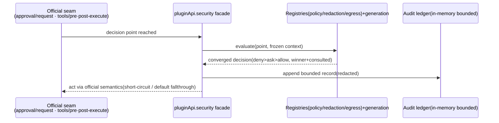

# Stage 2 - Design

## Status

SPEC1 Stage 0 Goal 已确认；Stage 1 Requirements 已确认（2026-08-25）；Stage 2 Design 已确认（2026-08-25）；待进入 Stage 3 Tasks。

## Overview

`security-policy-egress-guard` 以三个 policy registry 面（policy / redaction / egress）+ 一个审计投影实现，全部挂在主包 host 门面的新命名空间 `pluginApi.security` 下。设计核心是：**只在官方已 dispatch 的 seam 与门面自有转译点上调用策略，绝不伪造官方路径上的强制力**；所有 deny 路径 fail-closed；secret 提升默认拒绝。

## Standards 对照结论

- api-shape：三面均为 **policy registry 面**（单一 register 入口、系统在明确决策点调用、纯函数策略）；audit 为只读 projection。无 durable mutation 主面。
- visibility-and-redaction：受众四分（model/UI/log/debug）落在 redaction rule 的 audience 集合上；secret 提升走 user/profile policy 默认拒绝（SEC-5 的实现位）。
- identity-and-lifecycle：policy 身份 = owner id + owner 内 opaque generation token；decision 记录不复用生命周期词。
- durable-state-and-scope：v1 审计账本为**内存有界队列（非 durable）**，不跨重启承诺——availability 投影显式标注 non-durable，避免虚占 scope 档；未来持久化再单独立项定档。
- concurrency-and-cancellation：决策评估同步收敛；audit 订阅沿用 disposer 幂等语义。声明策略：registry 写入 `latest-wins`（同 owner 新 generation 取代旧），评估期无共享可变竞争。
- capability-strategy：维持方案一；横切派发语义不触碰。

## Architecture



- **宿主面**：`pluginApi.security.policy` / `.redaction` / `.egress` / `.audit`(只读)。client 不新增任何面（SEC-9）。
- **引出机制（逐钩子）**：
  | 决策点 | 引出机制 | 分类 |
  |---|---|---|
  | approval 前置 | 官方 `approval/request` waterfall 短路：listener 返回 `ApprovalOutcome` 不调 `next()`（`dsh-user-approval` types :24）；`ask`=透传 next | B（官方 dispatch 直绑） |
  | 工具执行前 | 官方 `tools/pre-execute` waterfall 返回 deny 型 `PreToolDecision`（`dsh-tools` types :38） | B |
  | 工具结果后（脱敏） | 官方 `tools/post-execute` waterfall（:61）：以 `PostToolDecision` 允许的结果改写通道发布脱敏后内容；具体改写字段在实现任务首项对照锁定版本核实 | B |
  | 模型请求前 | 门面自有 M2 同步 `llm/request` 转译重入点：策略 deny 时抛 typed error 使请求 fail-closed | B（门面自有 seam） |
  | egress 强制拦截官方出站路径 | 无官方 dispatch 点 | **C `upstream-required`，仅披露不模拟** |

## Components and Interfaces

1. **Registry（内部共享模块 `lib/security-policy.js`，三实例复用）**
   - `register(ownerId, spec) → { generation, dispose }`：typed 校验（缺字段/非法 matcher 先拒）；dispose 幂等且按 identity 只删本 owner 条目。
   - `evaluate(point, ctxInput) → ConvergedDecision`：冻结输入快照 → 按 `(point, declaredOrder)` 排序逐个调用 → 冲突按 `deny > ask > allow` 收敛 → 单个策略抛错仅降级该策略为该点默认值。
   - 各点默认值：egress=deny；approval-context=ask（透传官方流）；redaction=noop。默认值即 fail-closed 底线。
2. **Redaction engine（纯函数模块，零 harness 依赖）**
   - 输入内容树 + audience 集 + 规则集；输出 `{ content, applied: [{ruleId, count}] }`。
   - 覆盖边界（Design 定稿，SEC-4.5）：嵌套对象递归；字符串按规则替换为带 `redacted:<ruleId>` 标记；二进制/buffer 仅在元数据层打标记不深读；异常 cause 展开一层；MCP resource 内容视为不可信文本同样过规则；日志面只输出摘要计数不落全文。
   - 任一节点处理失败 → 整体替换为 redacted marker（fail-closed，SEC-4.4）。
3. **Secret gate**：规则注册时声明 `mayTouchSecret`；凡命中 secret 形状或声明 true 的暴露决定，必须经 user/profile secret policy 放行（默认 deny）。插件注册单独不足以放行。
4. **Egress checker/lease**：目标描述符 `{kind, destination}` 匹配规则 → converged decision；`lease.acquire(target, ttl)` 返回 `{generation, expiresAt}`，过期/撤销后 check 一律 deny；proxy 环境检测不产生任何 allowance。
5. **Audit ledger**：内存环形缓冲（容量常量，溢出丢弃最旧并置 `truncated` 旗标）；`audit.query(filter)` 返回冻结视图（secret/private 字段一律脱敏）；append 失败置 `gapSince` 显式暴露。

## Data Models

```text
SecurityDecision { decisionId, point, outcome: 'allow'|'deny'|'ask', winner?: policyId,
                   consulted: policyId[], reason, expiresAt?, executionRef?, sessionId?, at }
RedactionRuleSpec { id?, audiences: ('model'|'ui'|'log'|'debug')[], match, action, mayTouchSecret? }
EgressTarget { kind: 'subprocess'|'http'|'mcp'|'remote', destination }
EgressLease { target, generation, expiresAt }
AuditRecord { seq, at, kind, ownerIds[], summary, outcome, generation? }  // 无敏感原文
```

## Error Handling 与 guard

| 故障 | 行为 |
|---|---|
| 单策略抛错/返回畸形 | 该策略降级为该点默认决定；diagnostics 记 owner 归属；其余策略与宿主操作不受影响 |
| registry 注册参数非法 | typed rejection，未生效即拒 |
| 脱敏中途失败 | 内容整体替换 redacted marker（不返回部分保护对象） |
| audit 存储失败 | 决策本身照常生效；查询侧暴露 `gapSince`，不伪造记录 |
| 门面自身 setup 失败 | 全 feature 降级 inert + availability 如实报告；绝不抛穿 apply（G1 模式） |
| secret 提升未被放行 | 保持脱敏；audit 只记计数不含值 |

## Testing Strategy

1. **纯函数单元**（零 harness）：precedence 收敛矩阵、generation 替换、脱敏引擎各受众×内容类型矩阵、secret gate 默认拒绝、lease 过期时钟注入。
2. **集成（harness fixture）**：approval 短路与 ask 透传；pre-execute deny 生效且 ask 不阻断；post-execute 脱敏 provenance 标记随结果下发；llm/request 重入点 deny 抛 typed error。
3. **fail-safe**：策略持续抛错→降级+diagnostics；setup 注错→inert 且 boot 存活。
4. **回归**：无任何策略注册时,官方 approval/tools 行为零变化（对照快照）。
