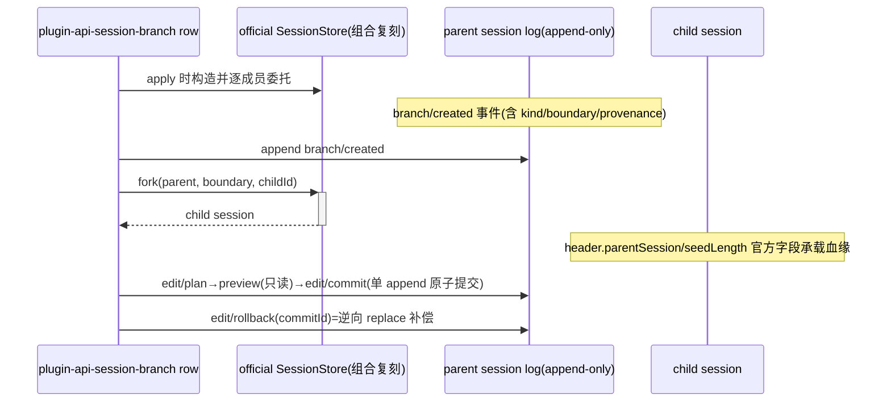

# Stage 2 - Design

## Status

SPEC1 Stage 0 Goal 已确认；R 类通道经用户 2026-08-25 批准；Stage 1 Requirements 已确认（2026-08-25）；Stage 2 Design 已确认（2026-08-25）；待进入 Stage 3 Tasks。
修订注记（2026-08-26，Stage 4 执行期人类裁决，路线 B）："自定义事件持久化机制"与"Edit plan / commit / rollback"两节按运行时实证修订——① 自定义事件类型不能携带 surfaceOp（官方 `isSurfaceEligibleType` 硬编码 `user/message|assistant/message|tool/result` 三种），edit commit/rollback 改由 surface-eligible `user/message` 事件承载替换并内嵌 `edit` 审计块（单 append 原子提交点不变）；② 官方 surface replace 只能折叠/1:1 交换、不能展开，rollback 改内容级恢复（单"内容还原节点"，角色/边界如实标注）；③ commit 审计块新增**调用方自定义 `kind`**（适配 user / 调用方 plugin id / goal 等场景，replace 与 append 形式一致适用，调用方为插件时默认取调用方 plugin id）。Data Models 与 Testing Strategy 相应同步。

## Overview

`session-branch-sidechain-edit` 由 R 类替代包 `@deepseek-ai/dsh-plugin-api-session-branch`（row `plugin-api-session-branch`）承载：禁用官方 `id: session` 行，插入替代行；替代行**组合官方公开导出的 `SessionStore` 实例做逐成员委托复刻**，在其上增加 branch/edit 契约。核心设计决策：**分支与编辑全部表达为官方 append-only 事件语义上的记录与补偿，绝不改写既有事件日志**——这与"不能把新 child session 伪装成原 session 的就地修改"的要求在机制层同源。

## Replacement Identity Matrix（对照锁定版本 `0.1.0-rc.6` 实测）

| 项 | 内容 | 来源 |
|---|---|---|
| runtime 全量版本 | `0.1.0-rc.6`（含 rc 后缀精确相等） | 本机实际安装 identity（`/usr/lib/node_modules/@deepseek-ai/dsh/package.json` 的 version；AGENTS §4 只定义版本格式规则，不构成取值来源） |
| 被替代 owner 包 | `@deepseek-ai/dsh-session@0.1.0-rc.6` | 其 package.json |
| 官方行 | `- id: session`，无 config 块 | `dsh-base/cordis.patch.yml:27-28` |
| ctx 服务面 | `ctx.sessions: SessionStore`——`create/prepare/enter/announce/flush/get/list/fork` | owner types `index.d.ts:290-416` |
| Session 实例面 | `surface/header/id/firstLiveSeq/events/seq/append/requestHeader/requestContext/deriveMessages/deriveEventMessage` + static `create/fromRestore` | 同上 `:106-267` |
| 事件面 | `session/created`(emit，同步抛错否决+回滚)、`session/disposed`(emit)、`session/event`(emit，post-commit fire-and-forget)、`session/flush`(parallel awaited) | 同上 `:32-76`；派发点 owner lib/index.js:1472/1746/1766/1780 |
| typert 面 | `TypertLookupMap.session: TypertLookup<Session, SessionId>` 必须保持 | types `:78-82` |
| 导出面 | `SessionStore(default)/Session/SessionForkError/adoptSessionEvent/snapshotSessionEvent/KNOWN_SESSION_EVENT_TYPES/SESSION_FORMAT_VERSION/fold*/is*Surface*/canonicalHeader/headerEquals/decodeStorageRecord/packChunkRuns/interruptedTurnClosers/TOOL_*/SessionPreparation` 等 | owner lib/index.js export 尾 + types `:15-27` |
| config/settings 面 | 行无 config；未消费 settings | patch + 全文核查 |
| client half（§10 六项） | 全负：(a) 无 dsh.client manifest/无 dsh 字段；(b) 无 remote namespace；(c) 无 slot/settings bridge；(d) 无 client/host 协商；(e) 无 browser state/reconnect 语义；(f) 无 client-facing event/service → **host-only** | owner package.json exports 全为 server 面；SBE-7.1 六项证据留档 |
| peer 注入 | cordis `Service/Context`、`dsh-scope Scoped`、`dsh-llm Message`、`typert-protocol TypertLookup` | owner types imports |

注：row15（runtime 主包）与 row16（owner 包）是两个实体，本锁定环境恰为同值；取值均以实际安装 package.json 为准。

## Standards 对照结论

- capability-strategy：R1–R9 逐条落点——R1 patch 形状（官方 `disabled:true` + `insert`，见 Components cordis.patch.yml；验收句 SBE-4.4）；R2 上表矩阵+委托复刻；R3 import 面不覆盖(组合而非再导出)；R4 boot 自检；R5 SBE-1；R6 冲突检测；R7 U-series 提案**已登记**（覆盖 branch/edit 契约；编号于 tasks 阶段在 feature-list §7 落定；退役条件：官方提供等价 branch/edit API 且消费者迁移后；boot diagnostics 引用，SBE-6.2）；R8 host-only 判定成立(Matrix client-half 行留证，client 复刻不适用)；R9 不跨组件、横切派发语义与 boot 胶水不走 R（SBE-15.4，声明不适用留痕）。
- api-shape：branch graph 查询=projection；edit plan/commit/rollback=durable mutation(identity+generation+commitState、fail-closed、审计)；一面原则满足。R slice 归属唯一组件 `dsh-session`，facade 组合部分不依赖跨组件 replacement。
- identity-and-lifecycle：branchId 为 owner 域内 id；plan 终态用统一词汇且 final；generation 用 opaque token（此处取 plan 记录的创建序 opaque 串，不做全局单调承诺）。
- durable-state-and-scope：branch/plan 记录归属 **session 档**（随 parent session 事件日志持久化，天然跨重启）；commit/rollback 无半提交可见（单次 append 即提交点）；rollback 幂等按 operation 能力声明，restore 默认不自动 retry。
- visibility-and-redaction：branch/plan 元数据 diagnostic/UI 可见、非模型可见（不进 prompt 组装）；preview 输出遵循既有 redaction 底线。
- concurrency-and-cancellation：并发策略声明 **compare-and-swap**（expectedVersion = `session.seq`，官方 contiguous seq 契约即版本向量）；scope=单 session；取消来源=caller signal 与 supersede；提交资格=plan 未终态+version 未漂移+owner 未 dispose；被取代 plan/branch 的 pending 异步完成仅留 diagnostics（SBE-14.3）；disposer 幂等且 identity-bound、不删新 owner 记录（SBE-14.4）；inherited 资源不可用时 child degraded 启动并记录 gap、不伪造（SBE-13.3）。

## Architecture



### 复刻策略（R2 的实现方式）

替代行 apply 时实例化官方 `import { SessionStore } from '@deepseek-ai/dsh-session'`（使用公开导出，不触碰模块私有），以**薄委托层**暴露 `ctx.sessions`：每个成员原样转发（保时序/形状/typed 错误），`session/*` 四事件由底层 store 自行 dispatch（零重派发，杜绝双跑与形状漂移）；typert lookup 注册保持同名 key。委托层之上仅追加 `sessions.branches` 子接口（branch/edit 面）。该方式使 R2 的"完整复刻"从"手工仿写"降级为"结构保证"。

**自定义事件持久化机制**：branch/edit **记录**以 append 到 parent log 的自定义事件（`branch/created`、`branch/failed` 等）持久化，为此委托层须在**保持官方事件类型语义与派发顺序不变**（R2 边界内，官方 `KNOWN_SESSION_EVENT_TYPES` 等词汇不被改写）的前提下，扩展本 bundle 自定义事件类型的接纳/编解码面，使之经官方存储路径原样 round-trip；"自定义事件经官方持久化跨重启可重建"列入复刻一致性套件断言（Testing item 1）。**运行时实证（2026-08-26）限定**：自定义事件类型**不能携带 surfaceOp**（`isSurfaceEligibleType` 只认三种 message 类型，带 surfaceOp 会被 `surfaceOpOf` 拒绝），因此 edit **commit/rollback 的 surface 变更本体**由 surface-eligible `user/message` 事件承载（见下节），`branch/created|failed` 等纯元数据自定义事件不带 surfaceOp（实测 round-trip 成立）。若锁定版本实测不允许该扩展，则改 sidecar 记录并同步修订本节与 Branch 记录节的持久化声称（实测义务已完成，主案成立）。

### Branch 记录 = parent log 上的事件

- `branches.create(parent, boundary, {kind, ...})`：先以官方同款校验（`INVALID_BOUNDARY/OPEN_TURN/...`）验证边界 → 在 **parent session** append `branch/created` 事件（data：branchId(kind 内 opaque)、kind、boundarySeq、childSessionId、causal sourceEventSeqs、visibility、retention、inheritance 声明）→ 再调官方 `fork(parent, boundary, childId)` 建 child（header `parentSession/seedLength` 官方血缘字段自然承载）。
- branch graph 查询 = 折叠 parent log 中 `branch/created` 与 `branch/failed` 事件的冻结投影（首版不设 `branch/closed` 终态词，branch 生命周期终态从简，见 Data Models 与克制设计）；跨重启恢复免费获得（持久化插件本就订阅这些事件）。
- 失败清理：fork 失败 → 向 parent append `branch/failed` 终态记录（或回滚刚 append 的 created——同一提交窗口内以补偿事件标记 superseded），不留 untracked 半成品。
- 旧 client cursor 处理（goal 高风险边界）：fork/replace/rewind 使既有 client 在父 session 事件流上的位置失效时，以显式事件/状态呈现 typed invalidation（含 cursor 失效信息），不静默丢弃；具体形态（invalidation 事件或迁移提示）在实现任务首项对照锁定版本 client 消费面核实。

### Edit plan / commit / rollback = append-only 补偿（2026-08-26 修订，路线 B）

- `plan(session, target, expectedVersion, {kind})`：expectedVersion 即 `session.seq`；**创建即校验 expectedVersion==当前 seq，不匹配返回 typed 冲突（SBE-10.1）**；plan 记录为 draft（内存句柄 + 校验），不改日志；commit 时再次 CAS 校验。plan 记录含**调用方自定义 `kind`**（非空字符串，适配 `user` / 调用方 plugin id / `goal` 等场景；调用方为插件时默认取调用方 plugin id）。
- `preview(plan)`：只读推导受影响 surface 范围与结果形态（利用官方 `foldSurface/deriveMessages` 投影函数离线折叠），并列出计划涉及的 external side-effect 声明。
- `commit(plan)`：CAS 校验 expectedVersion==当前 seq → **单次 append 一个 surface-eligible `user/message` 事件**：`data.message` = plan 的 replacement 内容（折叠语义：`surfaceOp:{op:'replace', start, end}` 删除被 shadow 的节点，compaction 同款机制），`data.edit` = 内嵌审计块（`{kind(调用方自定义), planId, commitId, range:{fromSeq,toSeq}, generation, actor, at, externals[]}`），`sourceEventSeqs` = 全部被 shadow surface 节点。**一次 append 即原子提交点**，观察者视角无半提交（SBE-10.3，审计与表面变更同事件原子可见）；commit 成功后该 plan 终态落 `success`（终态词汇与 SBE-10.5 逐字一致）。replacement 折叠目标范围可为多节点（N→1）。
- `rollback(commitId)`：校验该 commit 仍可逆（scan 确认 commit 事件存在且未被 revert 标记）→ **单次 append 逆向 `user/message` replace 事件**：`data.message` = **内容级恢复节点**（content blocks 内嵌被 shadow 各原始消息的可读文本，角色与边界如实标注；不伪造逐条消息形状），`data.edit` = `{kind(调用方自定义), commitId, revertId, actor, at, externals[]}` 标记本次还原 → 幂等：已被 revert 标记的 commitId 再次调用返回 typed no-op。**revert 是审计/补偿表达，不改变所属 plan 的终态（仍为 `success`）**。官方 surface replace 实测只支持折叠/1:1 交换且被 shadow 节点不能恢复可见性，故多节点原始形状不可逐条恢复——内容级恢复即本 feature 的公认 rollback 语义（2026-08-26 人类裁决）。不可自动回滚的 external 效果在 commit 记录中预先标记，rollback 结果如实列为 external-pending，要求显式 acknowledgment。
- `restore`（SBE-12）：restore=对指定历史 commitId 序列的重放校验——先离线折叠验证连续性（可引用 `recovery-policy` 的 checkpoint 证据作为恢复点来源，不重复实现配额/保留策略，goal 消费项落地）；restore 范围内声明的外部副作用走显式 acknowledgment 路径并在结果中枚举（与 SBE-11 的 external-pending 共用词汇）；通过后一次性 append 恢复事件；失败 typed error 且默认不 auto-retry。

## Components and Interfaces

```text
@deepseek-ai/dsh-plugin-api-session-branch
  ├─ lib/apply.js        // patch 入口：identity 校验→boot 自检→委托装配→branches 接口注册
  ├─ lib/delegate.js     // SessionStore 逐成员薄委托（复刻层）
  ├─ lib/branch-log.js   // branch/created|failed 事件编解码+graph 折叠（纯函数）
  ├─ lib/edit-plan.js    // plan/CAS/preview/commit/rollback 状态机（纯函数核心）
  ├─ test/*.mjs          // 包级测试
  └─ cordis.patch.yml    // - id: session disabled:true + insert plugin-api-session-branch
```

host 门面侧：`pluginApi.session.branches` 只读投影 + 操作入口转发至替代行的 ctx 服务（facade 组合，非第二 owner）。

## Data Models

```text
BranchRecord   { branchId, kind:'retry'|'sidechain'|'experiment'|'rescue', parentSessionId,
                 boundarySeq, childSessionId, causalSourceSeqs[], visibility, retention,
                 inheritance?: {route?,memory?,attachments?,toolState?}, state:'active'|'failed' }
EditPlan       { planId, targetSessionId, expectedVersion, range:{fromSeq,toSeq},
                 kind(调用方自定义，非空字符串；默认调用方 plugin id), replacement
                 (content 块配方), externals: ExternalEffectRef[], state:'draft'|'success'|
                 'error'|'aborted'|'denied'|'superseded' }  // 非终态仅 draft；终态 final
                 // 且唯一，与 SBE-10.5 词汇逐字一致
EditCommit     { commitId, planId, generation, at, actor, kind(调用方自定义), range,
                 externals[] }  // 承载于 user/message replace 事件 data.edit 审计块
RevertMark     { commitId, revertId, at, actor, kind(调用方自定义), externals[] }
                 // 承载于内容级恢复节点 data.edit 审计块；幂等标记
```

## Error Handling 与 guard

| 故障 | 行为 |
|---|---|
| runtime/owner identity 失配 | 替代包整体安全停用 + 显式报错，不加载替代行（R5） |
| 自检失败（官方行未禁用/契约探针失败） | bounded 日志 + 正常 return，不注册任何 branch 接口，绝不双跑（R4） |
| 竞争 owner/重复 insert/目标行缺失 | 冲突诊断 + fail-safe return（R6） |
| CAS version 漂移 | typed conflict，当前状态不动 |
| commit/rollback 中途异常 | 单 append 原子性保证无半提交；异常记 audit，plan 进入对应终态 |
| fork 失败 | 补偿记录 branch/failed；child 半成品显式清理 |
| restore 校验失败 | typed error + 现状标记待恢复；默认不 auto-retry |
| facade 版本协商失配 | 仅停用本 R 特性，主门面与其他能力不受影响 |

## Testing Strategy

1. **复刻一致性套件**（对锁定版本的回归锚）：对 `create/prepare/enter/announce/flush/get/list/fork` 与四事件逐一断言委托层与官方直连行为一致（含 fork 五种 typed 拒绝码、`session/created` 否决回滚、flush 参与计数语义）；自定义元数据事件（`branch/created|failed`）经官方存储 round-trip 断言（写入→读出→折叠一致）；`user/message` replace 事件**内嵌 edit 审计块的额外字段**经官方存储 round-trip 断言（额外字段逐字段保持，派生消息仍只取 message）。
2. **纯函数单元**（零 harness）：branch-log 折叠、edit-plan CAS/终态机（含创建即拒与 commit 双检、终态唯一性）、补偿配对（commit↔revert：N→1 折叠后内容级恢复、1:1 精确恢复）、调用方自定义 kind 校验（非空字符串、长度有界）、inheritance 默认表、disposer 幂等、pending 异步仅留诊断。
3. **集成（harness boot 应用 patch）**：自检断言三件套；branch 创建→child 血缘字段断言；commit 后 deriveMessages 反映 replace、rollback 后可见内容还原；外部效果 ack 流；重启后 graph 从持久化日志重建一致。
4. **冲突/停用**：模拟竞争 owner 行与失配 identity → 安全停用且官方行为可恢复（卸载可逆性）。
5. **治理登记**：U-series upstream proposal 条目与退役条件写入 feature-list/tasks 登记项（R7 验收）。
