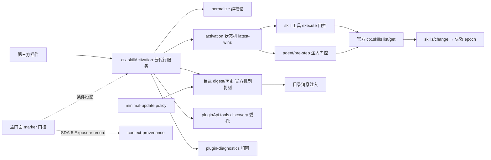

# Stage 2 - Design

## Status

SPEC1 Stage 2：Design 已产出，与重构后的 Goal/Requirements 一并提交 M6 第六批次批量确认门，**尚未获批**。获批前不得进入 Stage 3 Tasks。本文为 Wave A：`context-provenance` 的设计将消费本文定义的 Exposure record 词汇（SDA-5）与目录 notice 的 `source.kind` 元数据。

## Overview

本 feature 是 **R 类 replacement bundle**：禁用官方 `tool-skill` 行，插入替代行 `plugin-api-tool-skill`（运行时名 `@deepseek-ai/dsh-plugin-api-tool-skill`，源码 `packages/tool-skill/`，唯一 owner `@deepseek-ai/dsh-tool-skill`）。

官方事实（2026-08-26 本机 DSH `0.1.0-rc.6` 源码核实）：

- `dsh-skill` 拥有 `ctx.skills`（registry）与 `skills/change` 失效通知；**不渲染模型指引、不注册模型侧工具**——本 feature 不替换它，只读消费。
- `dsh-tool-skill` 是模型侧暴露的唯一一致性 owner，其 ctx 契约面 = ① `skill` 工具（`defineTool`，execute 经 `ctx.skills.list/get` 解析，只查 `modelInvocable`）；② `agent/pre-step` 用户调用注入（只查 `userInvocable`）；③ `agent/pre-step` 目录机制（session 级 `catalogHistory` digest + `createUserMessage` 注入；**变化时全量重发 catalog**，首发布为完整目录，`source.kind: 'skill-catalog'`）。

替代行保真复刻上述三面，再增加：session 内动态 activation 策略（在三路径强制执行）、目录变化告知策略（默认官方全量重发对齐，注册政策后切换为英文最小更新信息）。

## Architecture



组件（`packages/tool-skill/`，零主门面依赖，peerDependencies 共享宿主实例）：

| 组件 | 职责 | 钩子引出机制 |
|---|---|---|
| `apply.js` | 替代行入口：boot 自检矩阵、版本锁定、owner 冲突检测、注册 `ctx.skillActivation` | R 通道官方 patch 机制 |
| `forked-tool-skill.js` | 官方 `tool-skill` 三面保真复刻（skill 工具 / pre-step 注入 / 目录机制），在复刻点插入 activation 门控与 delta 告知 | R（R2 契约复刻） |
| `skill-activation-engine.js` | 纯状态机：descriptor 注册表、per-(skill,scope) 激活、latest-wins、TTL、降级、审计环 | R 行内 owner（无官方 dispatch） |
| `register-skill-sugar.js` | `registerSkill` thin composition：官方 `ctx.skills.register()` 内容注册 + descriptor overlay + 原子/幂等 dispose + 半程失败回滚 | R（语法糖；内容 owner 官方 registry） |
| `skill-activation-normalize.js` | 纯函数：参数校验、scope 解析、TTL 归一、diff notice 组装 | — |
| `catalog-diff.js` | 官方 digest 复刻 + 增量化：added/removed/changed 差量计算与聚合（政策开启时启用） | R（官方目录机制行为策略化扩展，默认官方对齐） |
| 主门面 `lib/index.js` 条件投影 | `pluginApi.skills.activation` marker/版本门控投影 `ctx.skillActivation` | B 面（只投影，不维护第二状态机） |

**数据流（单向）**：`skills/change` / `activate`/`deactivate` → 状态机 mutation → 三路径门控 + digest 重算 → 目录消息注入（默认全量重发；政策开启时英文最小更新）→ 冻结投影。投影不写、策略不读私有状态（`api-shape.md` §2）。

## Components and Interfaces

### 替代行 ctx 服务面

- **官方契约面（保真，先于扩展）**：`skill` 工具定义不变（name/schema/output/render 形状逐字段复刻）；`agent/pre-step` 用户调用注入钩子保留；目录机制保留 `catalogHistory`（session 级 digest 历史、`visibleDigest`、`published`）与 `createUserMessage` 消息替换语义。
- **新增接口 `ctx.skillActivation`**：
  - `registerDescriptor(spec)` → `{ handle: { skillId, owner, generation, dispose() } }`（SDA-0 overlay 契约；descriptor 是官方 registry 条目的激活政策覆盖层，不是第二内容源）
  - `registerSkill({ name, summary, content, capabilities?, sourceKind, activation? })` → `{ skillId, owner, generation, activate, deactivate, exposure, dispose }`（SDA-10 语法糖：官方 content 注册 + overlay 组合，官方 first-wins/只读借用/disposer 语义逐字透传）
  - `activate(skill, { scope, reason, ttl })` → activation（SDA-1/SDA-3）
  - `deactivate(skill, generation, scope?)`（SDA-4）
  - `exposure(skill, generation)` → 冻结 Exposure record（SDA-5）
  - `audit(query)`（SDA-8）、`availability()`（SDA-9）
  - `policy.registerMinimalCatalogUpdate(scope?)` → disposer（SDA-C2）
- **Exposure record（SDA-5，Wave B 契约词汇，形状冻结）**：

```text
{ skillId, owner, sourceKind: 'userInvocable'|'explicit'|'auto-match'|'provider-sourced',
  scope: { kind: 'session'|'agent'|'turn', key }, generation,
  tools: [{ entryId, generation }], promptSections: [sectionKey],
  resources: [{ resourceId, metadata }],
  degraded: [{ part, reason }],
  availability: { status, degradedParts, seamStatus } }
```

### 目录变化告知（默认官方全量重发对齐）

- 首次发布（session 无历史）：官方完整目录消息（`source.kind: 'skill-catalog'`），无论政策。
- 后续 digest 变化、无政策：默认全量重发官方 replacement catalog 消息（`source.kind: 'skill-catalog'`），与 stock DSH 逐行为对齐。
- 最小更新政策注册后：切换为英文最小更新 CONTEXT（`source.kind: 'skill-catalog-update'`）——「Skill `<name>` has been removed」「Skill `<name>` has been added」「Skill `<name>` has changed; its new shape is: `<summary>`」，聚合为单条有界消息；沿用官方消息替换语义（同 digest 幂等、旧消息替换新消息）。
- policy 抛错回退默认全量重发并记诊断。
- 注入失败 containment：不改变 `agent/pre-step` decision，不破坏消息数组（SDA-C4）。

### 三路径门控插入点

- `<available_skills>` 渲染：在官方 `snapshot().skills.filter(isModelInvocable)` 之后叠加本 session 激活态过滤（SDA-2.1）。
- `skill` 工具 `execute()`：在官方 `isModelInvocable` 检查处并列增加激活态检查（SDA-2.2）。
- `agent/pre-step` 用户调用注入：在官方 `isUserInvocable` 检查处并列增加激活态 + source-kind 策略检查（SDA-2.3/SDA-3.2）。

## Data Models

- **DescriptorRecord**：`{ skillId, owner, summary≤200, capabilities≤16, sourceKind, activationSource, generation, state: 'registered'|'failed' }`
- **ActivationRecord**：`{ skillId, owner, scopeKey, sourceKind, reason, ttlMs, expiresAt, generation, state: 'active'|'degraded'|'expired'|'superseded' }`
- **CatalogRevision**：官方 `catalogHistory` 复刻 `{ digest, published, visibleDigest }` + delta 元数据 `{ added:[{skillId,summary}], removed:[{skillId}], changed:[{skillId,summary}] }`
- **AuditRecord**：`{ seq, at, kind, skillId, owner, sourceKind, reason, generation }`，环形上限 500。
- generation 为 owner-specific opaque token（`identity-and-lifecycle.md` §2）；无新终态词汇；超时归 `error` + `timeout`。

## Error Handling

统一 typed 结果（不抛穿插件回调、绝不抛穿 apply）：

- `SKILL_REGISTRATION_INVALID` / `SKILL_ENTRY_CONFLICT` / `SKILL_ENTRY_UNKNOWN` / `SKILL_ENTRY_DISPOSED` / `SKILL_ENTRY_FAILED`
- `ACTIVATION_SCOPE_UNRESOLVED` / `ACTIVATION_SUPERSEDED` / `ACTIVATION_EXPIRED` / `ACTIVATION_DEGRADED` / `ACTIVATION_TIMEOUT`
- `SKILL_LOAD_DENIED`（skill 工具门控拒绝，含 reason）/ `INJECTION_SKIPPED`（pre-step 门控跳过）
- `DEACTIVATE_STALE_GENERATION` / `EXPOSURE_STALE_GENERATION` / `UNAVAILABLE` / `INACTIVE`

官方 `skills/change` 监听器与 pre-step 钩子内部异常全部吞掉并降级为诊断（官方语义：监听器失败不得否决注册表变更/决策流）。

## Failure Paths and Guard Strategy

1. **boot 自检矩阵（apply 内强制）**：官方 `tool-skill` 行已 disabled、替代行已 active、`skill` 工具与两条 `agent/pre-step` 钩子已注册、`ctx.skillActivation` 契约探针通过；任一失败 = fail-safe 日志 + 正常 return（绝不静默双跑）（SDA-R4）。
2. **版本锁定**：runtime 全量 identity `0.1.0-rc.6` 与 `@deepseek-ai/dsh-tool-skill` identity 不匹配 → 安全停用（SDA-R5）。
3. **组件唯一 owner**：检测 dsh-tool-skill 组件的其他 replacement、未禁用目标行、重复插入（SDA-R6）。
4. **主门面 marker/版本门控**：替代行失配时仅停用 `pluginApi.skills.activation` 投影，主门面与其他能力不受影响（SDA-5.2）。
5. **per-skill 降级与 stale 隔离**：依赖缺失/provider 抛错只降级该 skill；旧 generation 异步结果失去提交资格（SDA-7/SDA-4）。
6. **host-only**：§10 六项判定全否（无 client manifest / 无 remote / 无 slot-settings bridge / 无版本协商 / 无 browser state / 无 client-facing event），不产生 client 构建面（SDA-R8）。

## Hook Extraction Summary（AGENTS.md §2.5 强制表）

| 语义 | 通道 | 引出机制 |
|---|---|---|
| 官方 skills registry 读取 | A | `ctx.skills` 直通（只读消费，不替换 dsh-skill 行） |
| 目录失效通知 | A | 官方 `skills/change` 事件绑定 |
| skill 工具 / pre-step 注入 / 目录机制 | **R** | 禁用 `tool-skill` 行 + 插入 `plugin-api-tool-skill`；保真复刻三面后增加 activation 门控与目录变化告知策略（默认官方全量重发；政策切换英文最小更新） |
| session 内动态激活策略 | **R** | 官方无 dispatch；替代行内 `ctx.skillActivation` 状态机为唯一 owner |
| 工具暴露 | B（委托） | `pluginApi.tools.discovery` 已交付 seam |
| 横切派发语义 | 永不 R | priority/deepFreeze/fault containment 维持官方现状 |
| 上游提案 | C（登记） | U18 官方 session 内动态 skill activation/exposure seam；官方落地后退役替代行（SDA-R7） |

## Testing Strategy

1. **纯函数**：`skill-activation-normalize.test.mjs`、`catalog-diff.test.mjs`（added/removed/changed 差量、聚合、summary 截断、digest 幂等）。
2. **契约保真**：`forked-tool-skill.test.mjs` 以官方行为为基线——skill 工具 schema/output/render 逐字段、execute 的 list/get 解析与错误文案、pre-step 注入与目录消息替换语义，先证 parity 再证扩展。
3. **引擎**：`skill-activation-engine.test.mjs`（latest-wins、TTL、degrade、审计环、stale 提交资格）。
4. **三路径门控**：`gating.test.mjs` 验证目录过滤、execute 拒绝（typed `SKILL_LOAD_DENIED`）、pre-step 跳过（typed `INJECTION_SKIPPED`）与 fail-closed 缺 scope。
5. **CONTEXT 注入**：`catalog-notice.test.mjs` 验证默认全量重发（官方对齐）、最小更新政策切换（英文 delta）、政策 dispose 回落默认、首发布完整目录、同 digest 幂等、注入失败 containment。
6. **语法糖**：`register-skill-sugar.test.mjs` 验证组合顺序（先官方 content 注册后 overlay）、可选初始 activation、官方 first-wins 透传（no-op disposer 不伪造所有权）、dispose 双半幂等且 identity-bound、半程失败回滚（不留半注册 skill）、active 时官方 `get` 可解析内容 / inactive 时 typed 拒绝。
7. **boot 自检/集成**：apply 自检矩阵、版本锁定、owner 冲突、full bundle patch 装配（第 8 块）与选择性安装一致性；主门面 marker 门控投影；`npm test` 全量；共享 `features.length`/host-boundary 断言为 integration-owned 增量；版本 bump 由 integration owner 统一。

## Requirements Coverage

SDA-R1…R9 → boot 自检/版本/owner/U18/§10 判定；SDA-0 → descriptor↔registry overlay 契约；SDA-1/3/4 → engine；SDA-2 → 三路径门控；SDA-5 → Exposure record + 主门面条件投影；SDA-6 → tools.discovery 委托；SDA-7/8/9 → 降级/审计/availability；SDA-10 → register-skill-sugar；SDA-C1…C4 → catalog-diff + 目录机制。

## Non-Goals

同 requirements.md「Non-Goals」；另：不替换 `dsh-skill` registry 行；不把英文最小更新设为默认（默认 = 官方全量重发对齐）；不写自定义 prompt prose（最小更新文案仅由英文最小更新词汇模板构成，与 DSH 官方 prompt 语言对齐）。
