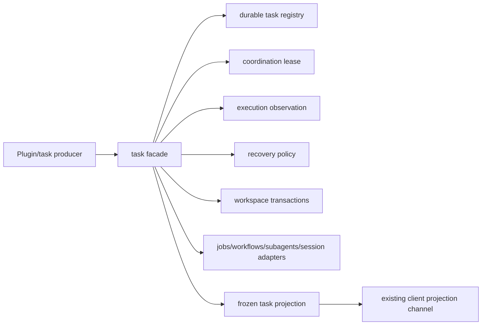

# Stage 2 - Design

## Status

Stage 2 Design 已确认；SPEC2 审查纠偏完成，可进入 Stage 3 Tasks。

## Overview

`task-execution-observation` adds a host-owned task surface that preserves a
business task identity while linking each run and attempt to the actual
workflow, agent, execution, session, job, and workspace transaction evidence.
It supplies durable task registration, fenced claim/reassign, authoritative
settlement, reconnect reconstruction, and read-only observation.

The feature is intentionally an aggregation facade. It consumes the public
`pluginApi.execution`, `pluginApi.recovery`, `pluginApi.coordination`, and
`pluginApi.diagnostics` surfaces, plus `pluginApi.workspaceTransactions` when the
same-batch feature is present, plus public `jobs`, `workflows`, `subagents`, and
session services. It does not create a scheduler, worker, executor, retry loop,
route policy, transcript store, lease implementation, or client transport.
Missing official identity or attachment seams remain explicit C-class
unavailable/unknown results.

The host is the only task mutation authority. Client consumers render a frozen,
redacted projection through an existing supported host channel; when the host
projection or channel is unavailable the client degrades locally, identifies the
unavailable surface, and does not prevent unrelated client faces from loading
(TEO-10.3).

### Requirements coverage

| Requirement | Design location |
|---|---|
| TEO-1 registration/identity | `register` contract; Task record; `identity-conflict` handling |
| TEO-2 run/resource lineage | `start`/`attach`; Attempt and run link; Source adapters |
| TEO-3 start/claim/fencing | `claim`/`reassign`; State and event flow; Error Handling |
| TEO-4 settlement | `settle`; State and event flow; Error Handling |
| TEO-5 observe/reconnect | `get`/`observe`/`history`; Settlement and observation; Testing (observe/reconnect) |
| TEO-6 attachment | `attach`; Source adapters |
| TEO-7 recovery/workspace | Source adapters; Error Handling (recovery evidence) |
| TEO-8 scheduler boundary | Overview; Hook classification; Boundary |
| TEO-9 visibility/redaction | Data Models; Error Handling; Testing (visibility) |
| TEO-10 client boundary | Overview (host-only mutation authority) |

## Architecture



The registry is implemented through a public storage-domain adapter only when
the host exposes a verifiable durable scope and conditional write. A process
memory registry is allowed for local development but is marked memory-scoped;
observe/reconnect cannot claim reconstruction after process loss from it.

Each task has an in-process serialized lane. Attempt claims additionally carry
the `coordination` generation and fencing token, so local ordering cannot be
mistaken for ownership. Event arrivals are reconciled by stable identity and
generation, never by latest-arrival order.

### Hook classification

| Hook or input | Mechanism | Boundary |
|---|---|---|
| execution lifecycle | consume the public `pluginApi.execution` projection and change observer | B aggregation |
| recovery evidence | consume `pluginApi.recovery` decisions/capabilities | B boundary |
| claim/reassign fencing | call `pluginApi.coordination` | B dependency |
| diagnostics availability | consume `pluginApi.diagnostics` get/onChange as provenance availability evidence | B dependency |
| workspace mutation provenance | consume `pluginApi.workspaceTransactions` projection when the same-batch feature is present | B optional integration |
| jobs/workflows/subagents | public service adapters plus documented events (`subagent/*`, `workflow/*`) | B aggregation |
| session transcript/context | existing `pluginApi.session` read/observation surface | A/B delegation |
| missing private task or settlement seam | no event synthesis from array position or sequence number | C/upstream-required |

The feature does not register a second scheduler or poller. It reacts to public
observations and explicit task API calls only.

## Components and Interfaces

### Host owner

`createTaskExecutionObservation({ ctx, execution, recovery, coordination,
diagnostics, workspaceTransactions, logger, now })` returns
`{ api, dispose, availability }`. The facade is mounted as `pluginApi.tasks`
under the neutral runtime feature key `tasks`. The governance feature name
remains confined to the specification documents.

The public API is:

```text
register({ taskId, ownerId, scope, intent, provenance })
start(taskId, { runId?, workflowId?, agentId?, sessionId?, jobId?, provenance? })
claim(taskId, { ownerId, lease, reason? })
reassign(taskId, { ownerId, expectedGeneration, reason, approval? })
settle(taskId, { attemptId, outcome, reason?, source?, evidence? })
attach(taskId, { workflowId?, agentId?, executionId?, sessionId?, jobId?, transactionId? })
get(taskId, { audience? })
observe(taskId, { signal?, audience? })
history(taskId, { cursor?, limit?, audience? })
```

`start` creates a run and attempt link in the `registered` attempt state but
does not execute anything and does not publish an active attempt. `claim`
validates a coordination owner/generation/fencing context, then publishes the
attempt as `active` (TEO-3.1). `reassign` calls `coordination.takeover` with the
expected generation first; only after the takeover succeeds does the facade
publish the new attempt and generation. `settle` accepts only the current
fenced attempt; duplicate terminal evidence returns the existing terminal
result. `observe` and `history` return frozen projections with an observation
epoch.

### Source adapters

The internal source boundary is:

```text
execution.observe/get/history/onChange
recovery.classify/evaluate/availability
coordination.acquire/heartbeat/release/takeover/compareAndSet/availability
diagnostics.get/onChange (when the public projection is present)
workspaceTransactions.get/observe (when the same-batch feature is present)
jobs.get/list/read (when public and available); change notification via onJobDone/onJobsChanged
workflow/* and subagent/* catalog events; services.workflows.start and services.subagents public members
session.get/on/requestContext (read-only)
registry.read/writeCas/queryEvents
```

Adapters return source identity, generation, certainty, observed time, and
bounded provenance. If a source lacks a public identity, its link is
`unavailable` or `unknown`; the task layer never mints a replacement execution
identity. Recovery consumption uses `classify` for the settlement safety
classification and `evaluate` for recovery decisions (TEO-7.1).

### State and event flow

```text
registered --start (attempt link, fencing pending)--> registered
registered --claim (fenced)--> active
active --settle--> settling --confirmed--> settled
registered/active --reassign (fenced takeover)--> reassigning --> active
active --failure or uncertain evidence--> failed | unknown
settled / failed / unknown --terminal; duplicate and late callbacks cannot rewrite
```

Attempts are never reused after reassign or retry. A prior attempt may become
`superseded` or retain its confirmed execution outcome, while the task identity
and immutable registration metadata remain unchanged. Late observations are
bounded provenance only.

## Data Models

### Task record

```text
{
  taskId: string,
  ownerId: string,
  scope: { kind, key },
  intent: { kind, summary },
  state: 'registered' | 'active' | 'reassigning' | 'settling' | 'settled'
       | 'failed' | 'unknown',
  revision: number,
  activeAttemptId?: string,
  attempts: [AttemptSummary],
  terminalOutcome?: 'success' | 'error' | 'aborted' | 'denied' | 'superseded',
  provenance: [BoundedProvenance],
  availability: Availability
}
```

### Attempt and run link

```text
{
  attemptId: string,
  runId: string,
  ownerId: string,
  generation: string,
  fencingToken: string,
  state: 'registered' | 'active' | 'settling' | 'settled' | 'superseded' | 'unknown',
  links: {
    workflow?, agent?, execution?, session?, job?, transaction?
  },
  startedAt, settledAt?, outcome?, reason?, provenance: [BoundedProvenance]
}
```

Each link includes the source's own identity and generation when available,
plus `certainty: observed | served | stale | unavailable | unknown`. A task ID is never
used as an execution ID, and an execution ID is never rewritten as a task ID.

### Settlement and observation

Settlement evidence stores the source outcome, reason, attempt/generation,
observed time, recovery safety classification, and a bounded late-event list.
The public projection includes no prompt, credential, raw tool output, or
unbounded transcript. It distinguishes `observed`, `served`, `stale`,
`unavailable`, and `unknown` provenance explicitly.

## Error Handling

Registration is idempotent only for equivalent immutable metadata; conflicting
registration returns `identity-conflict`. Claim and settlement validate the
current coordination handle before any task state write. A stale attempt is
rejected or appended as late provenance and cannot settle a newer attempt.

Settlement maps source outcomes without reinterpretation. `aborted`, `denied`,
and `superseded` remain distinct from success. Contradictory or incomplete
evidence yields `unknown`/`unavailable`, not inferred success. A terminal task
cannot be rewritten by a duplicate callback. Observers carry an observation
epoch; callbacks from a disposed or replaced observer are dropped and cannot
publish into a newer observer generation (TEO-5.5).

Recovery evaluation only consumes and exposes `recovery` recommendations; it
never executes retry, fallback, fork, abort, route choice, approval bypass, or
tool replay. Missing source projections leave the last confirmed state intact
and identify the missing surface.

Observer callbacks, rejected thenables, adapter failures, and repeated
disposers are contained. Redaction/freezing failures withhold the projection.
Mount-time failures disable only `tasks`, log a bounded diagnostic, and return
normally so harness boot and unrelated facade features survive.

## Testing Strategy

| Area | Evidence |
|---|---|
| registration | stable identity, equivalent idempotency, immutable metadata conflict |
| run/attempt lineage | distinct retry IDs, source link preservation, unavailable identity |
| claims | lease requirement, foreign-generation conflict, conditional reassign, stale fencing |
| settlement | one terminal outcome, duplicate/late callbacks, outcome preservation, contradiction |
| observe/reconnect | durable reconstruction, epoch, truncated evidence, observer isolation/disposal, stale-callback epoch guard |
| attachments | public jobs/workflows/subagents/session links, replacement generation, disposed source |
| recovery/workspace | evidence-only consumption, transaction provenance, non-idempotent/external safety |
| boundary | no scheduler/poller, no route/billing/approval bypass, no client mutation methods |
| visibility | redaction, deep freeze, bounded late evidence, scope denial |
| mount | missing services, malformed registry, repeated apply/dispose, fail-safe boot |
| integration | capability-gated durable registry with execution and coordination projections |

Tests must prove that a process-memory registry is reported as non-durable and
cannot satisfy a reconnect-after-process-loss assertion. Tests for absent
official attachment or settlement seams must assert explicit unavailable/unknown
projections rather than synthetic identities.
