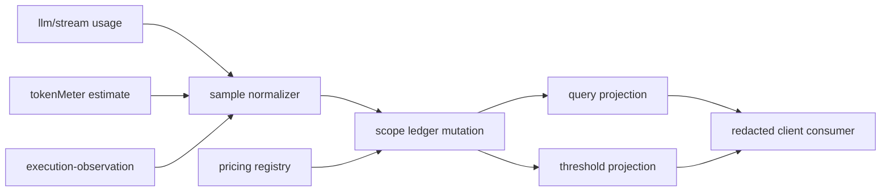

# Stage 2 - Design

## Status

Stage 2 Design 草案，待用户确认。

## Overview

`usage-budget-telemetry` 是 B 类 host-first feature，消费 `execution-observation` 的 execution/attempt identity以及公开 `llm/stream` usage seam。它将 usage sample、幂等 settle、pricing evidence、scope-safe ledger 和 threshold notification 组合成三个明确 owner：`durable mutation`、`projection`、`threshold projection`。它不执行 deny、route、retry、approval 或自动降级。

`tokenMeter` 可作为 estimated source，但不被重建为第二个 ledger，也不被宣称为 provider-confirmed。

## Architecture



### Source and hook classification

| Semantic area | Mechanism | Classification |
|---|---|---|
| provider usage chunks | 直接绑定公开 `llm/stream` payload | B facade |
| local estimates | 组合既有 `tokenMeter`，标记 estimated | B facade |
| execution correlation | 读取 `execution-observation` projection | B dependency |
| ledger/settle/pricing/threshold | facade 内部 durable mutation + projection | B |
| authoritative provider invoice/credit events | 当前不可证明 | C upstream proposal；不得伪装账单 |
| budget deny/route/retry | policy owner 不在本 feature | 明确拒绝，不实现 |

## Components and Interfaces

### 1. Sample normalizer

Normalizes input/output/cache/reasoning/total, provider/model identity, timestamp, source certainty and execution/attempt correlation without changing raw provider semantics. Unknown provider/model remain explicit unknown. Every sample receives an owner operation identity and deterministic idempotency key supplied by the source or caller; sequence/time cannot be used as identity.

When provider-confirmed and estimated samples coexist for the same execution/attempt (UB-1), the ledger SHALL apply an explicit precedence rule: confirmed values are authoritative and counted first; estimated values are counted only for metrics the confirmed sample does not provide, each retaining its own source/certainty, and the two are never summed into a silent double-count. The aggregation basis (precedence vs. per-source) is recorded on the record.

Same-operation re-entry by an external caller yields a new `executionId` under execution-observation (UB-2); this design only binds samples to whatever identity that projection provides and never creates execution identities itself.

### 2. Durable ledger mutation owner

Conceptual host interface:

```js
pluginApi.usage.record(sample, { scope, ownerId, generation, operationId })
pluginApi.usage.settle(executionId, { attempts, scope, ownerId, generation, operationId })
pluginApi.usage.pricing.register({ provider, model, revision, currency, units })
```

Pricing registration is evidence-only and never alters execution routing, provider selection, or approval decisions (UB-5).

Each record belongs to exactly one `session`, `workspace`, or `profile` scope. Cross-scope totals are separate records/projections. `record` and `settle` use compare-and-swap/transaction semantics: equivalent replay is a no-op; conflicting replay is fail-closed; partial commit is invisible as successful. `commitState` uses `success | error | aborted | denied | superseded`; `settledAt` is lifecycle metadata.

### 3. Query and threshold projection owners

```js
pluginApi.usage.query({ executionId?, sessionId?, workspaceId?, profileId?, day?, provider?, model? })
pluginApi.usage.budget.observe({ scope, thresholdId, limit, unit, generation }, listener)
```

Queries identify each record's scope and provisional/truncated state. Threshold projection emits one deterministic crossing notification per threshold generation; it never calls policy, route, retry or approval code.

### 4. Client boundary

Client consumes versioned, redacted usage snapshots/notifications through existing publication paths if present. Client never writes ledger, settles executions, registers pricing, or decides budget action. Publication absence is explicit degraded/unavailable. This feature ships no client cost UI components (Non-Goals).

## Data Models

```ts
type UsageSample = Readonly<{
  sampleId: string
  operationId: string
  executionId?: string
  attempt?: number | string
  provider?: string
  model?: string
  metrics: Readonly<{ input?: number; output?: number; cache?: number; reasoning?: number; total?: number }>
  source: 'provider-confirmed' | 'estimated' | 'mixed'
  estimator?: string
  observedAt: string
  late?: boolean
  replay?: boolean
}>

type UsageRecord = Readonly<{
  recordId: string
  scope: 'session' | 'workspace' | 'profile'
  ownerId: string
  generation: string
  commitState: 'success' | 'error' | 'aborted' | 'denied' | 'superseded'
  samples: ReadonlyArray<UsageSample>
  totals: Readonly<Record<string, number | null>>
  pricing?: Readonly<{ provider?: string; model?: string; revision: string; currency: string; basis: string; certainty: 'confirmed' | 'estimated' | 'unknown' }>
  provisional: boolean
  createdAt: string
  settledAt?: string
}>
```

Missing price leaves usage intact and cost `unknown`; a pricing revision is immutable on a settled record. Revaluation, if later approved, is a new operation. Partial streams retain observed samples and mark provisional/aborted/error provenance without synthesizing missing usage. A `totals` value of `null` means cost-unavailable/unknown (UB-5) and is never presented as a final total; it must not be read as a zero charge.

## Concurrency, Cancellation, Retry, and Ownership

- Sample ingestion is `deduplicate` by `(ownerId, generation, operationId, sampleId)`; independent executions may proceed `parallel`.
- Settle is `compare-and-swap` on execution/attempt settle state and `latest-wins` only before terminal commit. Once `aborted`, `denied` or `superseded` is committed, late usage cannot start an attempt.
- AbortSignal stops further collection where possible; it does not itself commit a ledger outcome. Deadline is `error` with timeout reason. Reconnect replay is accepted only as idempotent replay.
- Every async normalizer, pricing lookup and commit checks owner, generation, execution terminal state and scope record identity. Stale results are diagnostic-only and cannot update totals or dispose a newer owner.
- Automatic retry is forbidden unless the operation declares idempotent/retryable capability and bounded policy. This feature does not create execution identities.
- Mutation disposers are idempotent and may remove only records/observers owned by the current owner and generation.

## Visibility and Redaction

Default model/tool output excludes internal usage diagnostics; UI excludes secrets; logs contain bounded totals, certainty and pricing revision, never prompts, raw tool arguments, credentials or provider authorization data. Audience policy may expose non-secret metrics while preserving scope, source, timestamp and certainty. Redaction or classification failure fails closed before ledger projection, threshold notification, log or client publication.

## Error Handling and Fail-Safe

Normalization, execution lookup, pricing, transaction, query, threshold and publication failures are contained. A failed telemetry operation reports a bounded diagnostic and leaves provider/tool execution unchanged; `apply` never throws through boot. Unknown or undeclared mutation operations are rejected and not retried. Cross-scope writes, policy actions, payment/invoice reconciliation and client writes are rejected as boundary violations.

## Testing Strategy

Focused tests SHALL cover:

1. normalized confirmed/estimated/mixed samples, the confirmed-first precedence/aggregation rule for coexisting values, missing identities, tokenMeter boundary and execution/attempt correlation;
2. duplicate equivalent sample replay, conflicting replay, atomic settle, rollback/fail-closed partial commit, commitState/outcome separation and scope ownership;
3. pricing revisions, unknown price, historical immutability, provisional partial stream, abort/timeout/reconnect replay and stale generation guards;
4. session/workspace/profile queries, cross-scope composition, truncation/provisional flags and deterministic threshold crossing deduplication;
5. redaction for nested provider metadata and raw content, client publication degradation and policy-action rejection;
6. normalization/ledger/query/apply failures isolated from execution and unrelated feature state.

Tests are local ledger and public-seam fixtures; they do not claim provider billing or production invoice accuracy.

## Requirements Coverage

| Requirement | Design coverage |
|---|---|
| UB-1 | sample normalizer, certainty and unknown identity |
| UB-2 | execution/attempt reference and late-sample rule |
| UB-3 | idempotent mutation, CAS settle and commitState |
| UB-4 | one-scope records and cross-scope query projection |
| UB-5 | immutable pricing revision and unknown cost |
| UB-6 | threshold projection and crossing deduplication |
| UB-7 | partial/abort/replay handling and stale guards |
| UB-8 | audience-specific usage redaction |
| UB-9 | fail-safe telemetry and policy boundary |

## Boundary and Non-Duplication

Execution identity remains owned by `execution-observation`; this design only references it. `tokenMeter` remains an estimator. Existing session telemetry/storage primitives may be used as internal backends, but no second hidden token ledger or generic policy registry is introduced. Future deny/route/retry behavior requires a separately approved policy feature.
