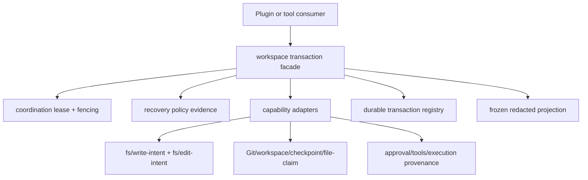

# Stage 2 - Design

## Status

Stage 2 Design 已确认；SPEC2 审查纠偏完成，可进入 Stage 3 Tasks。

## Overview

`workspace-mutation-transaction` adds a host-owned transaction surface for
workspace changes. It combines file claims, checkpoint evidence, Change Ledger
records, Git/workspace adapters, tool approval, and execution provenance behind
one explicit prepare/record/preview/commit/rollback/recover/get/observe boundary.

The feature is a B-class facade. It consumes the `pluginApi.coordination`
contract provided by the same-batch first feature and the public
decision/capability vocabulary of `pluginApi.recovery`; it does not implement
lease/CAS or recovery policy itself. It never promises a transaction across
network, process, publication, or another external system unless a concrete
adapter confirms that capability. Such effects remain `external` or `unknown`.

The host owns all mutation authority. A client can render a frozen projection
through an existing channel, but has no prepare, record, commit, rollback, or
recover entry point; any mutation attempt through this feature's client surface
is answered with an explicit typed `unsupported`/`unavailable` result, never a
client-side emulation (WMT-10.2). When the host projection or channel is
unavailable, the client degrades locally without preventing unrelated client
faces from loading (WMT-10.3).

## Architecture



The transaction registry is a host `storageDomain` adapter only when the host
reports a usable durable scope and write primitive. The design does not assume
that a domain called `storageDomain` is durable or atomic. When that evidence is
absent, prepare may still return an explicitly memory-scoped transaction, while
commit/recover operations that require durable proof return `unsupported` or
`unavailable`.

Transactions are serialized by transaction identity and by each resource claim.
The ordering lane prevents duplicate local callbacks; the lease fencing token is
the authority that rejects stale writers.

### Hook classification

| Hook or input | Mechanism | Boundary |
|---|---|---|
| `fs/write-intent`, `fs/edit-intent` | direct public waterfall listeners; call `next()` and return its result | A observation |
| `tools/pre-execute` | direct public event observation for source tool and approval provenance | A observation |
| `storageDomain` transaction records | public service adapter | B when capability is confirmed |
| `workspaces`, file-claim, checkpoint, Git | public service methods through capability adapters | B aggregation |
| `coordination` lease/fencing/CAS | direct dependency on previous feature's facade | B |
| `recovery` decision/capability evidence | public projection consumption only | B boundary |
| complete cross-session restore or arbitrary external rollback | no local simulation | C/upstream-required |

The transaction listeners are sidecar observers. They do not make mutation
decisions and do not intercept or replace the official waterfall result. A
missing optional hook disables only the corresponding evidence field; it does not
pretend that the mutation was observed.

## Components and Interfaces

### Host owner

`createWorkspaceMutationTransaction({ ctx, coordination, recovery, logger, now })`
returns `{ api, dispose, availability }` and mounts the public surface as
`pluginApi.workspaceTransactions` under the neutral runtime feature key
`workspaceTransactions`. The governance feature name remains confined to the
specification documents.

The frozen API is:

```text
prepare({ transactionId, workspace, ownerId, intent, resources, lease, checkpoint?, approval?, provenance? })
record(transactionId, { resource, operation, before, after, capability, source, sideEffectClass, idempotent? })
preview(transactionId, { audience?, includeExternal? })
commit(transactionId, { confirmation?, expectedRevision? })
rollback(transactionId, { confirmation?, takeover? })
recover(transactionId, { takeover?, audience? })
get(transactionId, { audience? })
observe(transactionId, { signal?, audience? })
```

Expected conflicts and capability failures are discriminated results, not boot
escaping exceptions. `observe()` has an epoch and idempotent disposer; observer
failures are isolated exactly as in the `execution-observation` facade.

### Transaction adapters

The internal adapter boundary is intentionally small:

```text
workspace.capabilities(scope)
fileClaim.claim/release(resource, lease)
checkpoint.describe/create/restore(ref, boundary)
git.preview/apply/restore(boundary)
ledger.append/query(transactionId)
approval.confirm(request)
sessionBranch.preview/apply/restore(boundary)   // only when a public capability exists
registry.read/writeCas(transactionId, expectedRevision, record)
```

Each adapter returns capability provenance and a bounded evidence reference. An
adapter may refuse an operation when it cannot prove the requested guarantee. No
adapter may report an external effect as rollbackable merely because a local
command completed.

### State machine

```text
prepared -> committing -> committed
prepared -> rolling-back -> rolled-back
prepared/committing -> recovering -> committed | rolled-back | failed | unknown
prepared/committing -> failed
rolling-back -> recovering        // durable evidence allows continuing the rollback
rolling-back -> failed            // unrestored resources without a recovery path
prepared/committing/rolling-back/recovering -> superseded   // explicit fenced replacement only
```

`rolled-back` is published only after every adapter-confirmed rollbackable
resource has been restored (WMT-6.1); a partial restore leaves the transaction
in `failed` or `recovering`, never `rolled-back`. Terminal states are
immutable: `committed`, `rolled-back`, `failed`, and `superseded` reject later
transitions that would rewrite the terminal outcome while retaining bounded
late-event provenance (WMT-7.2). `unknown` is likewise a terminal observation
state in this version: it is never silently upgraded to a success terminal, and
only a new explicit `recover()` with sufficient durable evidence may reclassify
it. `superseded` is used when a newer fenced transaction explicitly replaces an
abandoned one; it is never inferred from a timeout. Every transition carries
previous/next state, reason, revision, epoch, lease generation, and evidence
references.

## Data Models

### Transaction

```text
{
  transactionId: string,
  workspace: { scope, key, label? },
  ownerId: string,
  generation: string,
  lease: { generation, fencingToken, expiresAt },
  intent: { kind, summary },
  state: 'prepared' | 'committing' | 'committed' | 'rolling-back'
       | 'rolled-back' | 'recovering' | 'failed' | 'unknown' | 'superseded',
  revision: number,
  checkpoint?: { id, capability, provenance },
  mutations: [MutationRecord],
  approvals: [ApprovalEvidence],
  provenance: [BoundedProvenance],
  availability: Availability   // projection shape shared with `coordination-lease`
}
```

### Mutation record

```text
{
  mutationId, resource: { kind, key, scope }, operation,
  before: { digest?, version?, evidence? },
  after: { digest?, version?, evidence? },
  source: { toolId?, executionId?, sessionId?, eventSeq? },
  sideEffectClass: 'none' | 'read-only' | 'rollbackable' | 'external' | 'unknown',
  capability: { owner, name, version?, status },
  idempotent: boolean,
  order: number,
  observedAt: string
}
```

Digests are evidence references, not content identity for private values.
`non-rollbackable` (the requirements vocabulary) is rendered here as `external`
or `unknown`; `rollbackable` requires an adapter-confirmed capability that
proves restore to the declared boundary (WMT-4.2). `none` and `read-only`
classify mutations with no reversible effect or read-only reads kept for
evidence; they carry no rollback claim. An explicit absent `after` state is
represented by an `absent: true` marker, never by a missing field (WMT-3.1).
Raw file contents, credentials, prompts, and unbounded tool output are never in
the public projection.

### Preview and recovery evidence

Preview reports the planned state transition, resource summary, capability
status, approvals required, rollback boundary, and external/unknown effects. It
must label an external effect as not covered by automatic rollback. When the
current resource state no longer matches the recorded precondition, preview
reports stale/conflict evidence and never silently refreshes the transaction
into a different change (WMT-4.3). Recovery
reports what durable evidence was found, which resources are settled, and which
actions are unavailable; it does not invoke retry, fallback, fork, route choice,
or approval bypass.

## Error Handling

`prepare` requires a unique transaction identity, one declared workspace scope,
a non-empty resource set, an intent, and an owner identity; it validates
lease/fencing context, registry capability, and every capability the caller
declares required (e.g. checkpoint, file-claim) before creating a record
(WMT-1.1, WMT-2.1). A declared-required capability that is unavailable returns
an explicit `unsupported`/`unavailable` result and never produces a
commit-ready transaction (WMT-2.2); the only permitted degradation is an
explicitly memory-scoped transaction whose commit/recover operations remain
`unsupported`. Resources governed by incompatible workspace/profile/session
authorities are rejected outright in this version (no silent merge, no
partition) before any mutation is published (WMT-1.3). When preparation fails
after allocating temporary evidence, only its own temporary resources are
released and no partially active transaction is left visible (WMT-2.4). A
reused transaction identity with conflicting owner, scope, or intent fails
closed and never merges records (WMT-1.4).

`record` rejects stale fencing, duplicate mutation ids with conflicting
evidence, and resources outside the declared resource set or workspace scope.
Repeated records with an equivalent operation identity and content return an
idempotent result without duplicating the ledger entry; a conflicting repeated
identity is rejected without overwriting the original provenance (WMT-3.2,
WMT-3.3). When a before/after digest cannot be verified, the evidence is marked
`unknown`/`unavailable` and the facade never claims an exact reversible
mutation (WMT-3.5).

`commit` validates active ownership, the lease generation/fencing token, all
required approvals, preconditions, and capability evidence before publishing
`committed`; a partial adapter success leaves the transaction in `failed` or
`recovering`, never `committed`. A mutation classified `external` commits only
with the declared approval/confirmation, recorded in `approvals`, and the
result states that the side effect is not covered by automatic rollback
(WMT-5.3). The commit result carries the final transaction state, bounded
mutation summary, provenance references, and the lease generation used
(WMT-5.4).

`rollback` restores only adapter-confirmed rollbackable resources (WMT-6.1). It
records unrestored resources and preserves `external`/`unknown` classification;
if any confirmed rollbackable resource cannot be restored and no durable
recovery path exists, the transaction becomes `failed` (or `recovering` while
durable evidence can continue the rollback), never `rolled-back`. Repeated
commit, rollback, or recover calls with the same terminal evidence are
idempotent. A stale owner cannot recover or rollback without an explicit,
fenced takeover (WMT-6.5).

When the registry is unavailable, `get`/`observe` return an explicit unavailable
projection. When redaction/freezing fails, the projection is withheld rather
than partially exposed. Listener, adapter, and disposer failures are bounded
and logged. Mount failures disable this feature only and never escape `apply()`.

## Testing Strategy

| Area | Evidence |
|---|---|
| identity and prepare | resource set and scope/owner/lease validation, required-capability unavailability, duplicate idempotency, checkpoint binding |
| record | before/after digest, source provenance, side-effect classification, scope denial |
| preview | rollback boundary, required approval, external/unknown warning, redaction |
| commit | all-or-nothing state publication, precondition/CAS conflict, terminal retry |
| rollback/recover | adapter-confirmed restore, partial-restore → failed/recovering (never rolled-back), stale-owner rejection, durable boundary |
| state machine | ordered immutable transitions, terminal protection, superseded generation |
| hook adapters | waterfall `next()` passthrough, tool provenance, missing-hook degradation |
| visibility | deep freeze, bounded serialization, private-resource denial, observer isolation |
| mount | missing services, malformed domain, repeated apply/dispose, fail-safe boot |
| integration | capability-gated workspace/checkpoint/Git adapters; no false rollback claims |

Tests must include a backend that completes a local write but reports no atomic
or durable guarantee, proving that the facade returns `unsupported`/`unknown`
instead of claiming commit or recovery success.
